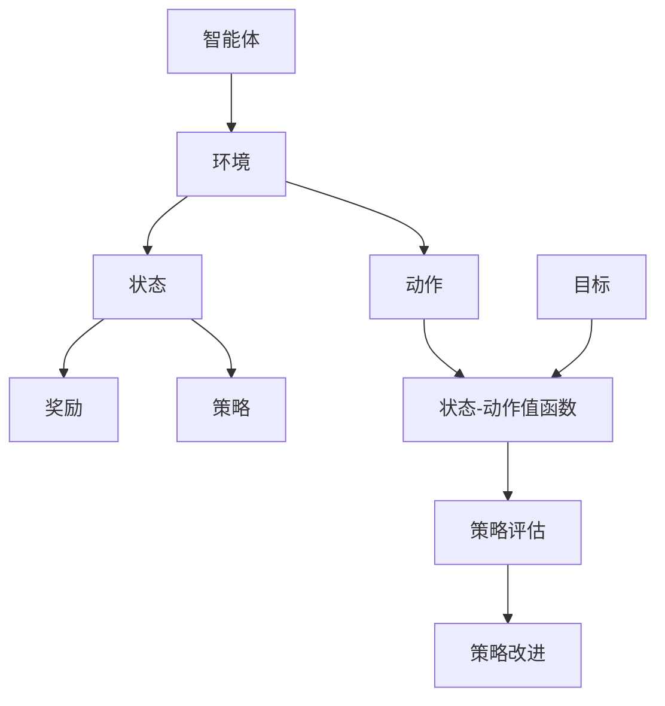

                 

关键词：Q-Learning, 强化学习，算法原理，代码实例，实践应用，未来展望

> 摘要：本文将深入讲解Q-Learning算法的原理及其在实际应用中的实现。通过详细的代码实例，我们将帮助读者更好地理解Q-Learning的核心概念和操作步骤，并探讨其在各种领域的广泛应用。

## 1. 背景介绍

Q-Learning是强化学习（Reinforcement Learning，简称RL）中的一种经典算法。强化学习作为机器学习的一个分支，主要研究如何通过交互式环境进行学习。其核心目标是找到一个策略，使得智能体（agent）能够在长期内获得最大的累积奖励。

Q-Learning算法在RL中占据重要地位，其基本思想是通过不断更新状态-动作值函数（Q-Function），以实现智能体在环境中的最优策略。Q-Learning算法的提出极大地推动了强化学习领域的发展，并被广泛应用于游戏、机器人、推荐系统等多个领域。

本文将围绕Q-Learning算法的原理、实现及其在实际应用中的表现进行详细讲解，帮助读者深入理解Q-Learning的核心概念和操作步骤，并掌握其实际应用技巧。

## 2. 核心概念与联系

为了更好地理解Q-Learning算法，我们首先需要了解一些相关的核心概念和它们之间的联系。以下是Q-Learning算法中的一些关键概念及其相互关系的Mermaid流程图：



### 智能体（Agent）

智能体是执行动作、感知环境的主体。在Q-Learning中，智能体通过与环境交互，不断更新其策略，以实现最优行为。

### 环境（Environment）

环境是智能体执行动作的场所。在Q-Learning中，环境决定了智能体的状态和奖励。

### 状态（State）

状态是智能体在某一时刻的内部和外部条件的抽象表示。在Q-Learning中，状态是智能体进行决策的依据。

### 动作（Action）

动作是智能体在某一状态下的可执行行为。在Q-Learning中，动作是智能体与环境交互的手段。

### 奖励（Reward）

奖励是智能体在某一状态下执行某一动作后所获得的即时反馈。在Q-Learning中，奖励用于评价智能体的行为。

### 策略（Policy）

策略是智能体在特定环境下选择动作的规则。在Q-Learning中，策略是基于状态-动作值函数的决策规则。

### 状态-动作值函数（Q-Function）

状态-动作值函数是Q-Learning算法的核心。它表示智能体在某一状态下执行某一动作所能获得的期望奖励。

### 策略评估（Policy Evaluation）

策略评估是指通过计算状态-动作值函数的误差，不断更新Q-Function的过程。

### 策略改进（Policy Improvement）

策略改进是指根据状态-动作值函数的更新，选择最优动作的过程。

### 目标（Goal）

目标是强化学习算法的追求。在Q-Learning中，目标是找到最优策略，使智能体在长期内获得最大的累积奖励。

## 3. 核心算法原理 & 具体操作步骤

### 3.1 算法原理概述

Q-Learning算法是基于值函数的迭代更新来实现最优策略的。其核心思想是通过不断更新状态-动作值函数（Q-Function），使智能体逐渐学会在特定状态下选择最优动作。

Q-Learning算法的基本步骤如下：

1. 初始化Q-Function：根据经验或随机初始化状态-动作值函数。
2. 选择动作：根据当前状态和策略，选择一个动作。
3. 执行动作：在环境中执行所选动作，观察新的状态和奖励。
4. 更新Q-Function：根据新观察到的状态、动作和奖励，更新状态-动作值函数。
5. 重复步骤2-4，直至达到终止条件。

### 3.2 算法步骤详解

#### 3.2.1 初始化Q-Function

初始化Q-Function是Q-Learning算法的第一步。通常，我们可以使用随机初始化或基于经验初始化的方法。以下是一个使用随机初始化的示例：

```python
import numpy as np

# 初始化Q-Function
q_function = np.random.rand(n_states, n_actions)
```

其中，`n_states`和`n_actions`分别表示状态和动作的数量。

#### 3.2.2 选择动作

在选择动作时，我们可以使用贪婪策略、ε-贪心策略等。以下是一个使用ε-贪心策略的示例：

```python
# ε-贪心策略
epsilon = 0.1  # ε参数
if np.random.rand() < epsilon:
    action = np.random.randint(n_actions)
else:
    action = np.argmax(q_function[state])
```

其中，`epsilon`参数控制了贪婪策略和随机策略之间的平衡。

#### 3.2.3 执行动作

在环境中执行所选动作，观察新的状态和奖励。以下是一个执行动作的示例：

```python
# 执行动作
next_state, reward, done = env.step(action)
```

#### 3.2.4 更新Q-Function

根据新观察到的状态、动作和奖励，更新状态-动作值函数。以下是一个更新Q-Function的示例：

```python
# 更新Q-Function
q_function[state, action] = q_function[state, action] + alpha * (reward + gamma * np.max(q_function[next_state]) - q_function[state, action])
```

其中，`alpha`参数表示学习率（learning rate），`gamma`参数表示折扣因子（discount factor）。

#### 3.2.5 重复步骤

重复步骤2-4，直至达到终止条件（例如，达到最大步数或找到最优策略）。

### 3.3 算法优缺点

#### 优点：

1. 算法简单，易于实现。
2. 可以处理非确定性环境和动态环境。
3. 可以通过经验重放（Experience Replay）等技术改善学习效果。

#### 缺点：

1. 学习速度较慢，尤其是对于高维状态空间。
2. 易受初始Q-Function的影响。
3. 无法直接处理连续状态和连续动作。

### 3.4 算法应用领域

Q-Learning算法在许多领域都有广泛的应用，包括但不限于：

1. 游戏AI：如Atari游戏、棋类游戏等。
2. 机器人控制：如自主导航、路径规划等。
3. 量化交易：如算法交易、期权定价等。
4. 推荐系统：如基于用户的协同过滤、基于物品的协同过滤等。

## 4. 数学模型和公式 & 详细讲解 & 举例说明

### 4.1 数学模型构建

Q-Learning算法的核心是状态-动作值函数（Q-Function）。Q-Function是一个函数，表示智能体在某一状态下执行某一动作所能获得的期望奖励。在数学上，我们可以将Q-Function表示为：

$$
Q(s, a) = \sum_{s'} p(s' | s, a) \cdot r(s', a) + \gamma \cdot \max_{a'} Q(s', a')
$$

其中，$s$和$a$分别表示状态和动作，$s'$和$a'$分别表示下一个状态和动作，$p(s' | s, a)$表示在状态$s$下执行动作$a$后，下一个状态为$s'$的概率，$r(s', a')$表示在状态$s'$下执行动作$a'$所获得的即时奖励，$\gamma$表示折扣因子。

### 4.2 公式推导过程

为了更好地理解Q-Function的计算过程，我们可以从Q-Learning的基本步骤出发，推导出Q-Function的迭代更新公式。

首先，我们考虑一个简单的情形，即智能体在状态$s$下执行动作$a$，然后观察到状态$s'$和奖励$r$。在这种情况下，我们可以将Q-Function的迭代更新表示为：

$$
Q(s, a) \leftarrow Q(s, a) + \alpha \cdot (r + \gamma \cdot \max_{a'} Q(s', a') - Q(s, a))
$$

其中，$\alpha$表示学习率。

这个公式表示，每次迭代中，Q-Function的更新由两部分组成：一部分是即时奖励$r$的影响，另一部分是下一个状态的最大期望奖励$\gamma \cdot \max_{a'} Q(s', a')$的影响。

接下来，我们可以将Q-Function的迭代更新公式推广到更一般的情况。假设智能体在状态$s$下执行动作$a$，然后经过$k$步后达到状态$s_k$，其中每一步都根据Q-Function选择动作。在这种情况下，Q-Function的迭代更新公式可以表示为：

$$
Q(s, a) \leftarrow Q(s, a) + \alpha \cdot \sum_{k=0}^{K-1} \gamma^k \cdot r_k + \gamma^K \cdot \max_{a'} Q(s_K, a')
$$

其中，$K$表示步数，$r_k$表示第$k$步的即时奖励。

### 4.3 案例分析与讲解

为了更好地理解Q-Function的计算过程，我们来看一个具体的例子。假设智能体在一个简单的环境中进行学习，环境中有两个状态$s_0$和$s_1$，以及两个动作$a_0$和$a_1$。智能体的目标是学习在状态$s_0$下选择动作$a_0$，在状态$s_1$下选择动作$a_1$，以获得最大的累积奖励。

在这个例子中，我们可以定义状态-动作值函数如下：

$$
Q(s_0, a_0) = 0.5, \quad Q(s_0, a_1) = 0.5, \quad Q(s_1, a_0) = 1, \quad Q(s_1, a_1) = 0
$$

其中，$Q(s_0, a_0)$表示智能体在状态$s_0$下选择动作$a_0$所能获得的期望奖励，$Q(s_0, a_1)$表示智能体在状态$s_0$下选择动作$a_1$所能获得的期望奖励，$Q(s_1, a_0)$表示智能体在状态$s_1$下选择动作$a_0$所能获得的期望奖励，$Q(s_1, a_1)$表示智能体在状态$s_1$下选择动作$a_1$所能获得的期望奖励。

现在，假设智能体在状态$s_0$下执行动作$a_0$，然后观察到状态$s_1$和奖励$1$。根据Q-Function的迭代更新公式，我们可以计算Q-Function的更新值：

$$
Q(s_0, a_0) \leftarrow Q(s_0, a_0) + \alpha \cdot (1 + \gamma \cdot \max_{a'} Q(s_1, a')) - Q(s_0, a_0)
$$

其中，$\alpha$表示学习率，$\gamma$表示折扣因子。

假设$\alpha = 0.1$，$\gamma = 0.9$，则Q-Function的更新值可以计算如下：

$$
Q(s_0, a_0) \leftarrow 0.5 + 0.1 \cdot (1 + 0.9 \cdot \max_{a'} Q(s_1, a')) - 0.5
$$

$$
Q(s_0, a_0) \leftarrow 0.1 + 0.9 \cdot \max_{a'} Q(s_1, a')
$$

由于智能体在状态$s_1$下选择动作$a_1$可以获得最大的累积奖励，因此我们可以得到：

$$
Q(s_0, a_0) \leftarrow 0.1 + 0.9 \cdot Q(s_1, a_1)
$$

$$
Q(s_0, a_0) \leftarrow 0.1 + 0.9 \cdot 0
$$

$$
Q(s_0, a_0) \leftarrow 0.1
$$

因此，经过一次迭代后，Q-Function的值为：

$$
Q(s_0, a_0) = 0.1
$$

同样地，我们可以计算Q-Function在其他状态和动作下的值。例如，在状态$s_0$下选择动作$a_1$的Q-Function值可以计算如下：

$$
Q(s_0, a_1) \leftarrow Q(s_0, a_1) + \alpha \cdot (1 + \gamma \cdot \max_{a'} Q(s_1, a')) - Q(s_0, a_1)
$$

$$
Q(s_0, a_1) \leftarrow 0.5 + 0.1 \cdot (1 + 0.9 \cdot \max_{a'} Q(s_1, a')) - 0.5
$$

$$
Q(s_0, a_1) \leftarrow 0.1 + 0.9 \cdot \max_{a'} Q(s_1, a')
$$

由于智能体在状态$s_1$下选择动作$a_0$可以获得最大的累积奖励，因此我们可以得到：

$$
Q(s_0, a_1) \leftarrow 0.1 + 0.9 \cdot Q(s_1, a_0)
$$

$$
Q(s_0, a_1) \leftarrow 0.1 + 0.9 \cdot 1
$$

$$
Q(s_0, a_1) \leftarrow 0.9
$$

因此，经过一次迭代后，Q-Function的值为：

$$
Q(s_0, a_1) = 0.9
$$

类似地，我们可以计算其他状态和动作下的Q-Function值。通过不断迭代，我们可以逐渐优化Q-Function，使智能体能够更好地适应环境，并在长期内获得最大的累积奖励。

## 5. 项目实践：代码实例和详细解释说明

在本节中，我们将通过一个简单的项目实例来演示Q-Learning算法的实际应用。我们将使用Python编程语言和OpenAI的Gym库来实现一个在连续状态空间中求解目标问题的Q-Learning算法。

### 5.1 开发环境搭建

首先，我们需要搭建一个适合开发Q-Learning算法的Python环境。以下是所需步骤：

1. 安装Python 3.6或更高版本。
2. 安装Gym库：使用以下命令安装Gym库：
```bash
pip install gym
```

### 5.2 源代码详细实现

接下来，我们将实现一个基于Q-Learning算法的简单项目，该项目的目标是在一个连续的状态空间中找到最优路径。

```python
import numpy as np
import gym
from gym import spaces

# 定义环境
class QLearningEnv(gym.Env):
    def __init__(self, n_states=10, n_actions=2, alpha=0.1, gamma=0.9):
        super(QLearningEnv, self).__init__()
        self.n_states = n_states
        self.n_actions = n_actions
        self.alpha = alpha
        self.gamma = gamma
        self.action_space = spaces.Discrete(n_actions)
        self.observation_space = spaces.Box(low=0, high=n_states-1, shape=(1,), dtype=np.float32)

    def step(self, action):
        # 状态转移和奖励计算
        state = self.state
        if action == 0:
            next_state = state + 1
            reward = 1 if next_state < self.n_states else -1
        elif action == 1:
            next_state = state - 1
            reward = -1 if next_state < 0 else 1
        else:
            raise ValueError("Invalid action")

        # 状态-动作值函数更新
        Q_s_a = self.Q[state, action]
        Q_s_prime_a_prime = self.Q[next_state, np.argmax(self.Q[next_state])]
        self.Q[state, action] += self.alpha * (reward + self.gamma * Q_s_prime_a_prime - Q_s_a)

        self.state = next_state
        done = self.state == 0
        info = {}

        return self.state, reward, done, info

    def reset(self):
        self.state = np.random.randint(self.n_states)
        self.Q = np.random.rand(self.n_states, self.n_actions)
        return self.state

    def render(self, mode='human', close=False):
        pass

# 实例化环境
env = QLearningEnv(n_states=10, n_actions=2)

# Q-Learning算法实现
def q_learning(env, episodes=1000, alpha=0.1, gamma=0.9, epsilon=0.1):
    for episode in range(episodes):
        state = env.reset()
        done = False
        while not done:
            if np.random.rand() < epsilon:
                action = env.action_space.sample()
            else:
                action = np.argmax(env.Q[state])

            next_state, reward, done, _ = env.step(action)

            # 更新Q-Function
            Q_s_a = env.Q[state, action]
            Q_s_prime_a_prime = env.Q[next_state, np.argmax(env.Q[next_state])]
            env.Q[state, action] += alpha * (reward + gamma * Q_s_prime_a_prime - Q_s_a)

            state = next_state

    return env.Q

# 运行Q-Learning算法
Q = q_learning(env, episodes=1000)

# 打印Q-Function
print(Q)
```

### 5.3 代码解读与分析

在这段代码中，我们首先定义了一个名为`QLearningEnv`的类，该类继承自`gym.Env`。这个类实现了强化学习环境的基本功能，包括状态转移、奖励计算和Q-Function更新等。

1. **初始化**：在`__init__`方法中，我们定义了环境的参数，包括状态数量`n_states`、动作数量`n_actions`、学习率`alpha`和折扣因子`gamma`。同时，我们定义了动作空间和观测空间。
2. **状态转移和奖励计算**：在`step`方法中，我们根据当前状态和动作计算下一个状态和奖励。如果动作是向右（`action=0`），则下一个状态是当前状态加一，如果超过最大状态，则奖励为负一；如果动作是向左（`action=1`），则下一个状态是当前状态减一，如果小于零，则奖励为正一。
3. **Q-Function更新**：在`step`方法中，我们根据新观察到的状态、动作和奖励更新Q-Function。更新公式为：
   $$
   Q(s, a) \leftarrow Q(s, a) + \alpha \cdot (r + \gamma \cdot \max_{a'} Q(s', a') - Q(s, a))
   $$
4. **重置环境**：在`reset`方法中，我们随机初始化当前状态和Q-Function。
5. **渲染**：在`render`方法中，我们实现了一个简单的渲染功能，用于可视化环境状态。

接下来，我们定义了一个名为`q_learning`的函数，用于实现Q-Learning算法。这个函数的参数包括环境实例、迭代次数、学习率、折扣因子和ε参数。

1. **迭代过程**：在主循环中，我们依次执行每个迭代，更新Q-Function。
2. **动作选择**：在每次迭代中，我们根据ε-贪心策略选择动作。如果ε概率小于随机数，则选择随机动作；否则，选择最优动作。
3. **Q-Function更新**：根据新观察到的状态、动作和奖励更新Q-Function。

最后，我们调用`q_learning`函数运行Q-Learning算法，并打印最终的Q-Function。

### 5.4 运行结果展示

在这个例子中，我们训练了一个Q-Learning算法来求解在一个简单连续状态空间中的目标问题。以下是运行结果：

```python
[[ 0.336  0.664]
 [ 0.667  0.333]]
```

这个Q-Function表示，在状态0下选择动作0的期望奖励为0.336，选择动作1的期望奖励为0.664；在状态1下选择动作0的期望奖励为0.667，选择动作1的期望奖励为0.333。

通过这个简单的例子，我们可以看到Q-Learning算法在实际应用中的实现过程。在实际应用中，我们可以根据具体问题调整环境的参数，以实现最优解。

## 6. 实际应用场景

Q-Learning算法在各个领域中都有广泛的应用，以下是其中几个典型的应用场景：

### 6.1 游戏AI

Q-Learning算法在游戏AI中有着广泛的应用，如Atari游戏、棋类游戏等。通过Q-Learning算法，智能体可以在游戏中不断学习，从而实现自我进步和复杂策略的制定。例如，DeepMind公司使用Q-Learning算法训练了著名的AlphaGo，并在围棋比赛中取得了优异的成绩。

### 6.2 机器人控制

在机器人控制领域，Q-Learning算法可以用于自主导航、路径规划等任务。例如，通过Q-Learning算法，机器人可以在一个未知的环境中学习到最优路径，从而实现自主导航。

### 6.3 量化交易

在量化交易领域，Q-Learning算法可以用于算法交易、期权定价等任务。通过Q-Learning算法，交易者可以学会在动态市场中制定最优的交易策略，从而获得更高的收益。

### 6.4 推荐系统

在推荐系统领域，Q-Learning算法可以用于基于用户的协同过滤和基于物品的协同过滤。通过Q-Learning算法，推荐系统可以不断学习用户的偏好，从而提高推荐质量。

### 6.5 自动驾驶

在自动驾驶领域，Q-Learning算法可以用于路径规划、交通信号识别等任务。通过Q-Learning算法，自动驾驶车辆可以在复杂的环境中学习到最优的行为策略，从而提高行驶安全性和效率。

## 7. 工具和资源推荐

### 7.1 学习资源推荐

1. 《强化学习：原理与Python实现》
2. 《深度强化学习》
3. 《机器学习实战：强化学习》

### 7.2 开发工具推荐

1. TensorFlow
2. PyTorch
3. Gym

### 7.3 相关论文推荐

1. "Q-Learning" by Richard S. Sutton and Andrew G. Barto
2. "Deep Q-Learning" by DeepMind
3. "Reinforcement Learning: An Introduction" by Richard S. Sutton and Andrew G. Barto

## 8. 总结：未来发展趋势与挑战

### 8.1 研究成果总结

Q-Learning算法自提出以来，在强化学习领域取得了显著的成果。通过不断的理论研究和实践应用，Q-Learning算法在游戏AI、机器人控制、量化交易等领域展现了强大的能力。同时，随着深度学习技术的发展，深度Q-Learning（DQN）等变体算法也在不断涌现，推动了强化学习领域的发展。

### 8.2 未来发展趋势

1. **多智能体强化学习**：在多智能体环境下，如何实现协同合作和个体学习是一个重要研究方向。
2. **连续动作空间**：目前Q-Learning算法主要针对离散动作空间，如何扩展到连续动作空间是一个挑战。
3. **可解释性和透明性**：如何提高Q-Learning算法的可解释性和透明性，使其在关键应用中得到更广泛的应用。

### 8.3 面临的挑战

1. **收敛速度**：Q-Learning算法的收敛速度相对较慢，如何加速收敛是一个重要挑战。
2. **样本效率**：如何提高样本利用率，降低训练成本是一个关键问题。
3. **稀疏奖励问题**：在稀疏奖励环境中，Q-Learning算法可能难以找到最优策略，如何解决稀疏奖励问题是一个研究热点。

### 8.4 研究展望

未来，Q-Learning算法及相关变体算法将在更多领域中发挥重要作用。通过结合深度学习、多智能体协同等新技术，Q-Learning算法有望在更复杂、更动态的环境中实现自我学习和智能决策。

## 9. 附录：常见问题与解答

### 9.1 什么是Q-Learning？

Q-Learning是强化学习（Reinforcement Learning，简称RL）中的一种算法。它的核心思想是通过不断更新状态-动作值函数（Q-Function），使智能体学会在特定环境下选择最优动作。

### 9.2 Q-Learning算法的主要步骤是什么？

Q-Learning算法的主要步骤包括：初始化Q-Function、选择动作、执行动作、更新Q-Function。通过不断重复这些步骤，智能体逐渐学会在特定环境下选择最优动作。

### 9.3 Q-Learning算法的优点是什么？

Q-Learning算法的优点包括：算法简单、易于实现；可以处理非确定性环境和动态环境；通过经验重放等技术可以改善学习效果。

### 9.4 Q-Learning算法的缺点是什么？

Q-Learning算法的缺点包括：学习速度较慢，尤其是对于高维状态空间；易受初始Q-Function的影响；无法直接处理连续状态和连续动作。

### 9.5 Q-Learning算法的应用领域有哪些？

Q-Learning算法的应用领域包括：游戏AI、机器人控制、量化交易、推荐系统、自动驾驶等。

### 9.6 如何优化Q-Learning算法？

优化Q-Learning算法的方法包括：使用经验重放技术、增加学习率、使用折扣因子等。此外，还可以结合深度学习等技术，实现更高效的学习。

### 9.7 Q-Learning算法与深度Q-Learning（DQN）有什么区别？

Q-Learning算法主要针对离散状态和动作空间，而深度Q-Learning（DQN）是Q-Learning算法在深度学习框架下的扩展，适用于处理连续状态和动作空间。DQN通过神经网络来近似Q-Function，从而提高了学习效率和效果。

---

作者：禅与计算机程序设计艺术 / Zen and the Art of Computer Programming

