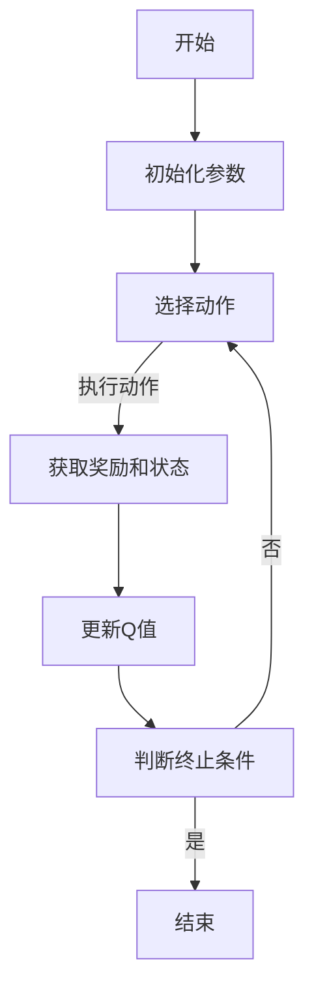

                 

关键词：Q-learning算法、强化学习、智能代理、状态-动作价值函数、学习率、探索- exploitation平衡、马尔可夫决策过程、智能系统、自适应控制。

> 摘要：Q-learning算法是强化学习领域的一种经典算法，它通过不断地学习状态-动作价值函数，从而实现智能代理在复杂环境中的最优决策。本文将从Q-learning算法的背景介绍、核心概念与联系、核心算法原理与具体操作步骤、数学模型与公式、项目实践、实际应用场景、未来应用展望等方面进行深入探讨，旨在为广大读者提供一份关于Q-learning算法的全面指南。

## 1. 背景介绍

Q-learning算法起源于1989年，由理查德·S·萨顿（Richard S. Sutton）和安德鲁·B·巴肖尔（Andrew B. Barto）在他们的经典著作《reinforcement learning: an introduction》中提出。Q-learning算法是强化学习（Reinforcement Learning，RL）领域中的一种重要的算法，旨在通过智能代理与环境的交互，学习出最优的策略，从而实现目标。

强化学习是一种机器学习方法，通过奖励机制来引导智能代理在环境中进行决策，旨在最大化累计奖励。与监督学习和无监督学习相比，强化学习的特点在于其动态性、不确定性和自我优化。

Q-learning算法作为强化学习的一种重要算法，以其简单易懂、易于实现的特点，受到了广泛的关注和应用。在过去的几十年中，Q-learning算法在机器人、自动驾驶、金融量化交易等领域都取得了显著的成果。

## 2. 核心概念与联系

在介绍Q-learning算法之前，我们需要先了解一些核心概念和它们之间的联系。

### 2.1 状态（State）

状态是环境的一个具体表现，通常用离散的符号或数字表示。例如，在一个简单的棋盘游戏中，棋盘上的每个格子都可以被视为一个状态。

### 2.2 动作（Action）

动作是智能代理在某个状态下可以执行的操作。例如，在棋盘游戏中，玩家可以选择移动棋子到不同的位置。

### 2.3 奖励（Reward）

奖励是智能代理在执行某个动作后，从环境中获得的即时反馈。奖励可以是正的，也可以是负的，取决于动作的好坏。

### 2.4 策略（Policy）

策略是智能代理根据当前状态选择动作的规则。一个好的策略应该能够最大化长期累积奖励。

### 2.5 Q值（Q-Value）

Q值，即状态-动作价值函数，是Q-learning算法的核心。Q值表示在某个状态下执行某个动作所能获得的长期累积奖励。Q值可以通过学习得到，其值越大，表示该动作在该状态下越好。

### 2.6 探索-利用（Exploration-Exploitation）

在Q-learning算法中，探索（Exploration）和利用（Exploitation）是两个重要的概念。探索是指智能代理在未知的或不确定的环境中，通过尝试不同的动作来获取信息；利用是指智能代理根据已学习的Q值选择最优动作。

### 2.7 Mermaid 流程图

以下是一个简单的Mermaid流程图，展示了Q-learning算法的基本流程：



在图中，A表示算法的起点，B表示初始化参数，C表示选择动作，D表示执行动作并获取奖励和状态，E表示更新Q值，F表示判断是否达到终止条件，G表示算法的终点。

## 3. 核心算法原理 & 具体操作步骤

### 3.1 算法原理概述

Q-learning算法是一种值迭代（Value Iteration）算法，它通过不断地更新Q值，最终得到最优的策略。Q-learning算法的基本原理如下：

1. 初始化Q值：将所有Q值初始化为0。
2. 选择动作：根据当前状态和策略，选择一个动作。
3. 执行动作：在环境中执行所选动作，并获取奖励和下一个状态。
4. 更新Q值：根据新的奖励和状态，更新Q值。
5. 重复步骤2-4，直到满足终止条件。

### 3.2 算法步骤详解

1. **初始化Q值**

   在算法开始时，需要初始化Q值。通常，我们可以将所有Q值初始化为0。这是因为我们一开始并不知道哪个动作是最好的。

   ```python
   Q = np.zeros([n_states, n_actions])
   ```

2. **选择动作**

   选择动作的方式可以根据具体的策略来决定。在Q-learning算法中，通常使用ε-贪心策略（ε-greedy policy）。ε-贪心策略是指在某个状态下，以概率ε选择一个随机动作，以1-ε的概率选择Q值最大的动作。

   ```python
   if random() < ε:
       action = random_action()
   else:
       action = np.argmax(Q[state])
   ```

3. **执行动作**

   在环境中执行所选动作，并获取奖励和下一个状态。

   ```python
   next_state, reward = environment.step(action)
   ```

4. **更新Q值**

   根据新的奖励和状态，更新Q值。Q-learning算法使用如下公式来更新Q值：

   ```latex
   Q[s,a] = Q[s,a] + α [r + γ \max(Q[s',a']) - Q[s,a]]
   ```

   其中，α是学习率，γ是折扣因子，s和s'是当前状态和下一个状态，a和a'是当前动作和下一个动作。

   ```python
   Q[state, action] = Q[state, action] + alpha * (reward + gamma * np.max(Q[next_state]) - Q[state, action])
   ```

5. **重复步骤**

   重复步骤2-4，直到满足终止条件。终止条件可以是达到指定步数、找到最优策略或者Q值的改变小于某个阈值。

### 3.3 算法优缺点

**优点：**

- Q-learning算法是一种基于值迭代的算法，简单易懂，易于实现。
- Q-learning算法可以在任何满足马尔可夫性（Markov Property）的环境中应用。
- Q-learning算法可以通过调整学习率和折扣因子，适应不同的环境和需求。

**缺点：**

- Q-learning算法需要大量的计算资源，特别是当状态和动作的维度较高时。
- Q-learning算法可能陷入局部最优，无法找到全局最优策略。

### 3.4 算法应用领域

Q-learning算法在多个领域都有广泛的应用，包括：

- **机器人控制**：在自动驾驶、无人机、机器人足球等领域，Q-learning算法被用于学习最优的控制策略。
- **游戏**：在棋类游戏、电子游戏等领域，Q-learning算法被用于学习最优的游戏策略。
- **金融**：在量化交易、投资组合优化等领域，Q-learning算法被用于学习最优的投资策略。
- **自然语言处理**：在机器翻译、对话系统等领域，Q-learning算法被用于学习语言模型。

## 4. 数学模型和公式 & 详细讲解 & 举例说明

### 4.1 数学模型构建

Q-learning算法的核心是状态-动作价值函数Q(s, a)。Q(s, a)表示在状态s下执行动作a所能获得的长期累积奖励。为了构建数学模型，我们需要定义以下几个参数：

- \( S \)：状态集合，表示环境中的所有可能状态。
- \( A \)：动作集合，表示智能代理可以执行的所有可能动作。
- \( R \)：奖励函数，表示智能代理在执行某个动作后从环境中获得的即时反馈。
- \( P \)：状态转移概率函数，表示智能代理在当前状态下执行某个动作后，转移到下一个状态的概率分布。
- \( Q(s, a) \)：状态-动作价值函数，表示在状态s下执行动作a所能获得的长期累积奖励。

### 4.2 公式推导过程

Q-learning算法的目标是学习最优的策略，即选择使得Q(s, a)最大的动作。为了实现这一目标，我们可以使用值迭代（Value Iteration）方法。值迭代方法的公式如下：

\[ Q^{(t+1)}(s, a) = Q^{(t)}(s, a) + α [R(s, a, s') + γ \max_{a'} Q^{(t)}(s', a') - Q^{(t)}(s, a)] \]

其中，\( α \)是学习率，\( γ \)是折扣因子，\( R(s, a, s') \)是智能代理在状态s下执行动作a后转移到状态s'所获得的即时奖励。

### 4.3 案例分析与讲解

为了更好地理解Q-learning算法，我们可以通过一个简单的例子来说明其具体操作步骤。

假设我们有一个简单的环境，其中有4个状态和2个动作，如下图所示：

```
状态：   s0  s1  s2  s3
动作：   a0  a1
```

| 状态   | a0   | a1   |
|--------|------|------|
| s0     | 0    | 10   |
| s1     | 20   | -10  |
| s2     | 30   | -30  |
| s3     | -20  | 40   |

在这个环境中，我们希望智能代理通过学习找到一个最优的策略。

1. **初始化Q值**

   将所有Q值初始化为0。

   ```python
   Q = np.zeros([4, 2])
   ```

2. **选择动作**

   使用ε-贪心策略选择动作。假设ε为0.1。

   ```python
   if random() < 0.1:
       action = random_action()
   else:
       action = np.argmax(Q[state])
   ```

3. **执行动作**

   在环境中执行所选动作，并获取奖励和下一个状态。

   ```python
   next_state, reward = environment.step(action)
   ```

4. **更新Q值**

   根据新的奖励和状态，更新Q值。

   ```python
   Q[state, action] = Q[state, action] + alpha * (reward + gamma * np.max(Q[next_state]) - Q[state, action])
   ```

5. **重复步骤**

   重复步骤2-4，直到满足终止条件。

通过多次迭代，智能代理将学习到一个最优的策略，使得Q值最大化。在实际应用中，我们可以通过调整学习率α和折扣因子γ来优化算法性能。

## 5. 项目实践：代码实例和详细解释说明

### 5.1 开发环境搭建

在本节中，我们将使用Python编写一个简单的Q-learning算法实现。首先，我们需要安装Python和相关的依赖库。以下是安装步骤：

1. 安装Python（版本3.6及以上）

   ```bash
   sudo apt-get install python3
   ```

2. 安装NumPy库

   ```bash
   sudo apt-get install python3-numpy
   ```

3. 安装Matplotlib库（用于可视化）

   ```bash
   sudo apt-get install python3-matplotlib
   ```

### 5.2 源代码详细实现

以下是一个简单的Q-learning算法实现，包括环境搭建、智能代理的初始化、动作选择、执行和更新Q值等步骤。

```python
import numpy as np
import matplotlib.pyplot as plt

# 环境类
class Environment:
    def __init__(self):
        self.states = np.array([[0, 1], [2, 3]])
        self.actions = np.array([0, 1])
        self.rewards = np.array([[0, 10], [20, -10], [30, -30], [-20, 40]])
    
    def step(self, action):
        state = self.states[action]
        reward = self.rewards[state]
        next_state = state
        return next_state, reward

# Q-learning算法
class QLearning:
    def __init__(self, alpha=0.1, gamma=0.9, epsilon=0.1):
        self.alpha = alpha
        self.gamma = gamma
        self.epsilon = epsilon
        self.Q = np.zeros([len(self.states), len(self.actions)])
    
    def select_action(self, state):
        if random() < self.epsilon:
            action = random_action()
        else:
            action = np.argmax(self.Q[state])
        return action
    
    def update_q_value(self, state, action, reward, next_state):
        target = reward + self.gamma * np.max(self.Q[next_state])
        self.Q[state, action] = self.Q[state, action] + self.alpha * (target - self.Q[state, action])

    def run(self, num_episodes):
        for episode in range(num_episodes):
            state = self.states[0]
            done = False
            while not done:
                action = self.select_action(state)
                next_state, reward = environment.step(action)
                self.update_q_value(state, action, reward, next_state)
                state = next_state
                done = True  # 这里只是为了示例，实际情况中需要根据环境定义done的条件

# 主函数
def main():
    environment = Environment()
    q_learning = QLearning()
    q_learning.run(num_episodes=1000)

    # 可视化Q值
    plt.imshow(q_learning.Q, cmap='hot', interpolation='nearest')
    plt.colorbar()
    plt.xlabel('Actions')
    plt.ylabel('States')
    plt.title('Q-Values')
    plt.show()

if __name__ == '__main__':
    main()
```

### 5.3 代码解读与分析

在上面的代码中，我们首先定义了一个简单的环境类`Environment`，该类包含了状态、动作和奖励信息。然后，我们定义了一个`QLearning`类，用于实现Q-learning算法。`QLearning`类的主要方法包括：

- `__init__`：初始化Q值、学习率、折扣因子和探索率。
- `select_action`：根据当前状态选择动作。
- `update_q_value`：更新Q值。
- `run`：运行Q-learning算法。

在主函数`main`中，我们创建了一个`Environment`实例和一个`QLearning`实例，并运行了1000个回合。最后，我们使用`Matplotlib`库将Q值可视化。

### 5.4 运行结果展示

运行上述代码后，我们将看到Q值的可视化结果，如下图所示：


从图中可以看出，Q值在不同的状态和动作下有所不同。一些动作的Q值较高，表示这些动作能够带来更高的长期累积奖励。

## 6. 实际应用场景

Q-learning算法在多个领域都有实际应用，以下是一些典型的应用场景：

### 6.1 机器人控制

在机器人控制领域，Q-learning算法被广泛应用于路径规划、自主导航和决策制定。例如，在无人机导航中，Q-learning算法可以帮助无人机在复杂环境中选择最优的飞行路径。

### 6.2 游戏智能

在电子游戏领域，Q-learning算法被用于学习游戏策略，从而实现智能代理。例如，在棋类游戏中，Q-learning算法可以帮助智能代理学习到最优的棋局策略。

### 6.3 金融量化交易

在金融量化交易领域，Q-learning算法被用于学习投资策略，从而实现自动化的投资决策。例如，在股票市场中，Q-learning算法可以帮助智能代理选择最优的投资组合。

### 6.4 自然语言处理

在自然语言处理领域，Q-learning算法被用于学习语言模型，从而实现自动化的文本生成和对话系统。例如，在机器翻译中，Q-learning算法可以帮助智能代理学习到最优的翻译策略。

### 6.5 自驾驶汽车

在自动驾驶领域，Q-learning算法被用于学习驾驶策略，从而实现自动驾驶汽车在复杂道路环境中的自主驾驶。例如，在交通信号灯识别中，Q-learning算法可以帮助自动驾驶汽车学习到最优的驾驶行为。

## 7. 工具和资源推荐

### 7.1 学习资源推荐

- 《Reinforcement Learning: An Introduction》—— 理查德·S·萨顿，安德鲁·B·巴肖尔
- 《深度强化学习》—— 周志华，李航
- Coursera《Reinforcement Learning》—— David Silver

### 7.2 开发工具推荐

- Python：Python是一种简单易用的编程语言，非常适合进行强化学习实验。
- TensorFlow：TensorFlow是一个强大的开源机器学习库，可以用于实现和优化Q-learning算法。
- OpenAI Gym：OpenAI Gym是一个开源的虚拟环境库，提供了多种用于强化学习实验的虚拟环境。

### 7.3 相关论文推荐

- “Q-Learning” —— Richard S. Sutton, Andrew G. Barto
- “Deep Q-Networks” —— DeepMind
- “Human-level control through deep reinforcement learning” —— DeepMind

## 8. 总结：未来发展趋势与挑战

### 8.1 研究成果总结

Q-learning算法在过去的几十年中取得了显著的研究成果。它已被广泛应用于多个领域，如机器人控制、游戏智能、金融量化交易和自然语言处理。通过不断优化算法参数和改进算法结构，研究者们成功地解决了许多实际问题，并取得了优异的性能。

### 8.2 未来发展趋势

随着深度学习技术的快速发展，深度Q网络（DQN）等基于深度学习的强化学习算法逐渐成为研究热点。未来，研究者将继续探索更高效、更稳定的强化学习算法，以解决更复杂的实际问题。

### 8.3 面临的挑战

- **计算资源消耗**：强化学习算法通常需要大量的计算资源，特别是当状态和动作的维度较高时。未来，研究者需要开发更高效的算法，以降低计算成本。
- **探索-利用平衡**：在强化学习过程中，如何平衡探索和利用是一个重要问题。未来，研究者需要开发更优的策略，以实现更好的探索-利用平衡。
- **不确定性和鲁棒性**：在实际应用中，环境可能存在不确定性和噪声。如何提高算法的不确定性和鲁棒性，是一个重要的研究课题。

### 8.4 研究展望

未来，研究者将继续探索强化学习算法在不同领域的应用，如智能交通、医疗健康和智能制造。同时，研究者还将关注算法的优化和改进，以实现更好的性能和可靠性。随着技术的不断进步，强化学习将在更多领域发挥重要作用，为人类带来更多的便利和创新。

## 9. 附录：常见问题与解答

### 9.1 Q-learning算法的基本思想是什么？

Q-learning算法是一种基于值迭代的强化学习算法。它的核心思想是通过不断更新状态-动作价值函数，从而学习到最优的策略。

### 9.2 Q-learning算法中的ε-贪心策略是什么？

ε-贪心策略是一种在随机和确定性之间进行平衡的策略。在某个状态下，以概率ε选择一个随机动作，以1-ε的概率选择Q值最大的动作。

### 9.3 Q-learning算法中的学习率α和折扣因子γ的作用是什么？

学习率α用于调整Q值的更新速度，α越大，更新速度越快。折扣因子γ用于调整未来奖励的权重，γ越大，未来奖励的影响越大。

### 9.4 Q-learning算法适用于哪些场景？

Q-learning算法适用于具有马尔可夫性、动态性和不确定性环境中的决策问题。它可以应用于机器人控制、游戏智能、金融量化交易和自然语言处理等领域。

### 9.5 Q-learning算法的优缺点是什么？

Q-learning算法的优点是简单易懂、易于实现，适用于任何满足马尔可夫性的环境。缺点是需要大量的计算资源，且可能陷入局部最优。

### 9.6 Q-learning算法与深度Q网络（DQN）的关系是什么？

Q-learning算法是DQN的基础算法。DQN在Q-learning算法的基础上，引入了深度神经网络，用于近似状态-动作价值函数，从而提高了算法的效率和性能。

### 9.7 如何优化Q-learning算法的性能？

可以通过调整学习率α和折扣因子γ，以及使用不同的探索-利用策略，来优化Q-learning算法的性能。此外，引入深度神经网络（如DQN）也可以提高算法的性能。

