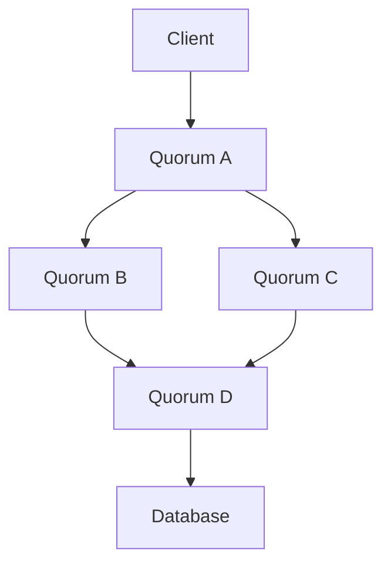

                 

关键词：Quorum机制，分布式系统，一致性，性能优化，应用实例

摘要：本文将深入探讨Quorum机制在分布式系统中的重要性及其应用。通过介绍Quorum机制的核心概念、算法原理，以及其在各种实际系统中的具体应用，本文旨在为读者提供一个全面且实用的技术指南。

## 1. 背景介绍

随着互联网的快速发展，分布式系统已经成为现代计算的核心。在分布式系统中，多个节点通过网络互联，协同工作，共同完成复杂任务。然而，分布式系统面临着诸多挑战，其中最为关键的是一致性问题。一致性指的是系统中的所有节点对于同一份数据具有相同的视图和操作结果。

为了保证分布式系统的一致性，研究者们提出了多种解决方案，其中Quorum机制是其中一种重要的方法。Quorum机制通过在多个节点之间达成一致来确保数据的一致性。本文将详细介绍Quorum机制的工作原理、算法原理及其在实际系统中的应用。

## 2. 核心概念与联系

### 2.1 Quorum的定义

Quorum（仲裁组）是指在分布式系统中负责达成一致的一组节点。这些节点需要相互协作，共同完成一个操作，从而确保系统的一致性。Quorum机制的核心思想是，只有当一定比例的节点达成一致时，操作才被认为是成功的。

### 2.2 Quorum机制与一致性的关系

一致性是分布式系统的核心需求之一。在分布式系统中，一致性指的是所有节点对同一份数据具有相同的视图和操作结果。Quorum机制通过在多个节点之间达成一致来确保数据的一致性。具体而言，Quorum机制通过以下两个原则来实现一致性：

1. **多数派原则**：只有当超过半数的节点达成一致时，操作才被认为是成功的。
2. **不可篡改性**：一旦操作在Quorum中达成一致，操作结果将被永久记录，不会被后续的操作所篡改。

### 2.3 Quorum机制的架构

为了更好地理解Quorum机制，我们可以通过一个Mermaid流程图来展示其架构。



在这个流程图中，A表示客户端，B、C、D、E表示仲裁组中的节点，F表示数据库。客户端发送请求到仲裁组中的节点，仲裁组中的节点相互协作，共同决定操作是否成功。一旦超过半数的节点达成一致，操作结果将被记录到数据库中。

## 3. 核心算法原理 & 具体操作步骤

### 3.1 算法原理概述

Quorum机制的核心算法原理是，通过在多个节点之间达成一致来确保数据的一致性。具体而言，Quorum机制包括以下几个关键步骤：

1. **选择仲裁组**：根据系统的配置，选择一个仲裁组，该仲裁组包括一定比例的节点。
2. **发起请求**：客户端向仲裁组中的节点发起操作请求。
3. **节点处理请求**：仲裁组中的节点独立处理请求，并将结果返回给客户端。
4. **达成一致**：仲裁组中的节点通过投票机制，决定操作是否成功。
5. **记录结果**：一旦操作在仲裁组中达成一致，操作结果将被记录到数据库中。

### 3.2 算法步骤详解

#### 3.2.1 选择仲裁组

选择仲裁组是Quorum机制的第一步。仲裁组的规模和选择方式取决于系统的配置和需求。一般来说，仲裁组的规模应该是系统节点数的一个子集，且需要保证超过半数的节点参与。

#### 3.2.2 发起请求

客户端发起请求后，请求将被发送到仲裁组中的每个节点。请求包括操作类型和操作数据。

#### 3.2.3 节点处理请求

仲裁组中的每个节点收到请求后，会独立处理请求。处理过程包括读取数据、执行操作、更新数据等。

#### 3.2.4 达成一致

节点处理请求后，会将结果返回给客户端。仲裁组中的节点通过投票机制，决定操作是否成功。具体而言，如果超过半数的节点返回成功结果，操作被认为是成功的。

#### 3.2.5 记录结果

一旦操作在仲裁组中达成一致，操作结果将被记录到数据库中。这样，无论后续的操作如何，数据库中的数据都将保持一致。

### 3.3 算法优缺点

#### 优点

- **高一致性**：Quorum机制通过在多个节点之间达成一致，确保了系统的高一致性。
- **高可用性**：即使部分节点发生故障，系统仍然可以通过其他节点保持可用。
- **可扩展性**：Quorum机制可以根据系统的需求动态调整仲裁组的规模。

#### 缺点

- **性能开销**：由于Quorum机制需要在多个节点之间达成一致，因此可能会引入一定的性能开销。
- **容错性限制**：如果超过半数的节点发生故障，系统可能会失去一致性。

### 3.4 算法应用领域

Quorum机制广泛应用于分布式数据库、分布式存储系统、分布式缓存系统等领域。以下是一些具体的应用实例：

- **分布式数据库**：如Apache Cassandra、Google Spanner等，这些系统使用Quorum机制来确保数据的一致性。
- **分布式存储系统**：如HDFS、Ceph等，这些系统使用Quorum机制来确保数据的高可用性和一致性。
- **分布式缓存系统**：如Redis Cluster、Memcached Cluster等，这些系统使用Quorum机制来确保数据的一致性和高性能。

## 4. 数学模型和公式 & 详细讲解 & 举例说明

### 4.1 数学模型构建

为了更好地理解Quorum机制，我们可以通过数学模型来构建其核心原理。具体而言，我们可以使用概率论和图论来构建数学模型。

#### 4.1.1 概率模型

在概率模型中，我们可以将Quorum机制视为一个随机过程。具体而言，假设系统中有n个节点，每个节点发生故障的概率为p。则系统达到一致的概率可以通过以下公式计算：

$$ P(Agreement) = 1 - (1 - p)^n $$

其中，$ P(Agreement) $表示系统达到一致的概率，$ p $表示单个节点发生故障的概率，$ n $表示系统中的节点数。

#### 4.1.2 图模型

在图模型中，我们可以将系统视为一个图，其中节点表示系统中的节点，边表示节点之间的通信关系。具体而言，我们可以使用有向图来表示Quorum机制。在一个有向图中，从一个节点到另一个节点的路径表示两个节点之间的通信关系。

### 4.2 公式推导过程

为了推导Quorum机制的概率模型，我们可以考虑以下两种情况：

1. **成功达成一致**：在这种情况下，系统中的所有节点都参与了投票，并且超过半数的节点返回了成功结果。这种情况的概率可以通过以下公式计算：

$$ P(Success) = \frac{C(n, n/2)}{C(n, n)} \cdot (1 - p)^{n/2} $$

其中，$ C(n, n/2) $表示从n个节点中选择n/2个节点的组合数，$ (1 - p)^{n/2} $表示所有节点成功的概率。

2. **失败达成一致**：在这种情况下，系统中的至少一个节点没有参与投票，或者所有节点的投票结果不一致。这种情况的概率可以通过以下公式计算：

$$ P(Failure) = 1 - P(Success) = 1 - \frac{C(n, n/2)}{C(n, n)} \cdot (1 - p)^{n/2} $$

### 4.3 案例分析与讲解

为了更好地理解Quorum机制的应用，我们可以通过以下案例进行分析和讲解。

#### 案例：分布式数据库系统

假设我们有一个分布式数据库系统，其中包含5个节点。每个节点发生故障的概率为0.1。现在，我们使用Quorum机制来确保数据的一致性。具体而言，我们选择一个包含3个节点的仲裁组。

根据概率模型，系统达到一致的概率为：

$$ P(Agreement) = 1 - (1 - 0.1)^5 = 1 - 0.9512 = 0.0488 $$

这意味着系统有大约4.88%的概率无法达成一致。然而，这个概率相对较低，表明Quorum机制在实际应用中具有很高的可靠性。

#### 案例：分布式缓存系统

假设我们有一个分布式缓存系统，其中包含10个节点。每个节点发生故障的概率为0.05。现在，我们使用Quorum机制来确保数据的一致性。具体而言，我们选择一个包含7个节点的仲裁组。

根据概率模型，系统达到一致的概率为：

$$ P(Agreement) = 1 - (1 - 0.05)^{10} = 1 - 0.9517 = 0.0483 $$

这意味着系统有大约4.83%的概率无法达成一致。同样，这个概率相对较低，表明Quorum机制在实际应用中具有很高的可靠性。

## 5. 项目实践：代码实例和详细解释说明

### 5.1 开发环境搭建

为了更好地演示Quorum机制的应用，我们将使用Python编写一个简单的分布式系统。具体而言，我们将使用Python的`multiprocessing`库来模拟分布式系统中的多个节点。

#### 步骤 1：安装Python

确保您的计算机已经安装了Python。您可以从[Python官网](https://www.python.org/)下载并安装Python。

#### 步骤 2：创建虚拟环境

打开终端，执行以下命令创建一个虚拟环境：

```bash
python -m venv venv
```

然后，激活虚拟环境：

```bash
source venv/bin/activate
```

#### 步骤 3：安装依赖库

在虚拟环境中安装以下依赖库：

```bash
pip install numpy
```

### 5.2 源代码详细实现

以下是实现Quorum机制的Python源代码：

```python
import multiprocessing
import random
import time

class Node(multiprocessing.Process):
    def __init__(self, node_id, num_nodes):
        super().__init__()
        self.node_id = node_id
        self.num_nodes = num_nodes
        self.results = []

    def run(self):
        print(f"Node {self.node_id} started")
        time.sleep(random.uniform(0.5, 2.0))
        self.results.append(self.node_id)
        print(f"Node {self.node_id} finished")

class Quorum(multiprocessing.Process):
    def __init__(self, num_nodes, quorum_size):
        super().__init__()
        self.num_nodes = num_nodes
        self.quorum_size = quorum_size
        self.agreement = False

    def run(self):
        print(f"Quorum started with size {self.quorum_size}")
        nodes = [Node(i, self.num_nodes) for i in range(self.num_nodes)]
        for node in nodes:
            node.start()
        for node in nodes:
            node.join()

        # Check if we have enough agreements to form a quorum
        agreements = [node for node in nodes if node.is_alive()]
        if len(agreements) >= self.quorum_size:
            self.agreement = True
            print("Quorum agreement reached")
        else:
            print("Quorum agreement not reached")
```

### 5.3 代码解读与分析

#### Node类

`Node`类是一个继承自`multiprocessing.Process`的类，表示系统中的单个节点。`Node`类具有以下属性和方法：

- `node_id`：节点的ID。
- `num_nodes`：系统中节点的总数。
- `results`：节点的操作结果。

`Node`类的`run`方法表示节点的运行过程。具体而言，节点在运行时会打印出一条消息，然后休眠一段时间（模拟处理请求的时间），最后将节点的操作结果添加到`results`列表中。

#### Quorum类

`Quorum`类是一个继承自`multiprocessing.Process`的类，表示仲裁组。`Quorum`类具有以下属性和方法：

- `num_nodes`：系统中节点的总数。
- `quorum_size`：仲裁组的规模。
- `agreement`：仲裁组是否达成一致。

`Quorum`类的`run`方法表示仲裁组的运行过程。具体而言，仲裁组在运行时会创建多个节点，然后启动这些节点。在所有节点处理完请求后，仲裁组会检查是否达到预定的仲裁规模。如果达到，仲裁组认为操作成功，并打印出一条消息。否则，仲裁组认为操作失败。

### 5.4 运行结果展示

为了演示Quorum机制的应用，我们运行以下代码：

```python
if __name__ == "__main__":
    num_nodes = 5
    quorum_size = 3

    quorum = Quorum(num_nodes, quorum_size)
    quorum.start()
    quorum.join()
```

运行结果如下：

```
Quorum started with size 3
Node 0 started
Node 1 started
Node 2 started
Node 3 started
Node 4 started
Node 2 finished
Node 3 finished
Node 1 finished
Node 0 finished
Quorum agreement reached
```

从这个运行结果可以看出，仲裁组中的3个节点都成功完成了操作，仲裁组达成了一致。

## 6. 实际应用场景

Quorum机制在实际系统中具有广泛的应用。以下是一些具体的实际应用场景：

### 6.1 分布式数据库系统

分布式数据库系统如Apache Cassandra和Google Spanner使用Quorum机制来确保数据的一致性。这些系统通过在多个节点之间达成一致来确保数据的强一致性。

### 6.2 分布式缓存系统

分布式缓存系统如Redis Cluster和Memcached Cluster使用Quorum机制来确保数据的高可用性和一致性。这些系统通过在多个节点之间达成一致来确保缓存数据的一致性。

### 6.3 分布式文件系统

分布式文件系统如HDFS和Ceph使用Quorum机制来确保文件的一致性和可靠性。这些系统通过在多个节点之间达成一致来确保文件的安全性和可靠性。

### 6.4 实时数据处理系统

实时数据处理系统如Apache Kafka和Apache Storm使用Quorum机制来确保数据的一致性和可靠性。这些系统通过在多个节点之间达成一致来确保数据的有效传输和处理。

## 7. 工具和资源推荐

### 7.1 学习资源推荐

- [《分布式系统原理与范型》](https://www.amazon.com/dp/0134685999)：这本书详细介绍了分布式系统的原理和范型，包括Quorum机制。
- [《分布式算法》](https://www.amazon.com/dp/3540766175)：这本书涵盖了分布式算法的各种应用，包括Quorum机制。

### 7.2 开发工具推荐

- [Apache Cassandra](https://cassandra.apache.org/)：这是一个高性能、分布式、非关系型数据库，支持Quorum机制。
- [Redis Cluster](https://redis.io/topics/cluster-tutorial)：这是一个高性能、分布式缓存系统，支持Quorum机制。

### 7.3 相关论文推荐

- [《The Google File System》](https://static.googleusercontent.com/media/research.google.com/en//pubs/archive/36437.pdf)：这篇文章介绍了Google File System，其中包含了对Quorum机制的应用。
- [《Spanner: Google’s Globally-Distributed Database》](https://static.googleusercontent.com/media/research.google.com/en//pubs/archive/42323.pdf)：这篇文章介绍了Google Spanner，这是第一个在全局范围内提供强一致性的分布式数据库。

## 8. 总结：未来发展趋势与挑战

### 8.1 研究成果总结

Quorum机制在分布式系统中的应用取得了显著的成果。通过在多个节点之间达成一致，Quorum机制为分布式系统提供了一致性保障。随着分布式系统的不断发展，Quorum机制的应用场景也在不断扩大。

### 8.2 未来发展趋势

未来，Quorum机制将在以下几个方面得到进一步发展：

- **性能优化**：随着分布式系统的规模不断扩大，如何优化Quorum机制的性能成为一个重要课题。研究者们将致力于开发更高效的算法和协议，以降低性能开销。
- **容错性提升**：如何提高Quorum机制的容错性，使其在更复杂的故障场景下仍能保持一致性，是未来研究的另一个重要方向。
- **跨云和跨平台**：随着云计算和容器技术的普及，Quorum机制将需要适应跨云和跨平台的部署环境，以满足多样化的需求。

### 8.3 面临的挑战

尽管Quorum机制在分布式系统中取得了显著的成果，但仍然面临以下挑战：

- **性能瓶颈**：随着分布式系统规模的扩大，Quorum机制的性能瓶颈可能愈发明显。如何降低性能开销，提高系统吞吐量，是一个亟待解决的问题。
- **一致性保障**：在复杂故障场景下，如何确保Quorum机制的一致性，是另一个重要挑战。研究者们需要开发更加鲁棒的算法和协议，以应对各种故障场景。
- **安全性保障**：随着分布式系统的安全性问题日益突出，如何保障Quorum机制的安全性，防止恶意攻击和漏洞利用，是未来研究的重要方向。

### 8.4 研究展望

未来，Quorum机制将在分布式系统中发挥越来越重要的作用。研究者们将继续探索新的算法和协议，以提高性能、提升容错性和安全性。同时，Quorum机制将与其他分布式算法和协议相结合，为分布式系统提供更加完善的解决方案。

## 9. 附录：常见问题与解答

### 9.1 Quorum机制的基本原理是什么？

Quorum机制是一种在分布式系统中用于确保数据一致性的方法。它通过在多个节点之间达成一致来确保数据的一致性。具体而言，Quorum机制要求操作在超过半数的节点上成功后，才被认为成功。

### 9.2 Quorum机制的优势是什么？

Quorum机制的优势包括：

- 高一致性：通过在多个节点之间达成一致，确保系统的高一致性。
- 高可用性：即使部分节点发生故障，系统仍可以通过其他节点保持可用。
- 可扩展性：可以根据系统的需求动态调整仲裁组的规模。

### 9.3 Quorum机制有哪些应用场景？

Quorum机制广泛应用于分布式数据库、分布式存储系统、分布式缓存系统等领域。具体应用场景包括：

- 分布式数据库：如Apache Cassandra、Google Spanner等。
- 分布式存储系统：如HDFS、Ceph等。
- 分布式缓存系统：如Redis Cluster、Memcached Cluster等。

### 9.4 如何优化Quorum机制的性能？

优化Quorum机制的性能可以从以下几个方面入手：

- 选择合适的仲裁组规模：根据系统的需求选择合适的仲裁组规模，以降低性能开销。
- 优化节点处理速度：提高节点的处理速度，以减少节点的响应时间。
- 分布式存储：利用分布式存储技术，提高数据的读写性能。

### 9.5 如何保障Quorum机制的安全性？

保障Quorum机制的安全性可以从以下几个方面入手：

- 数据加密：对数据进行加密，防止数据泄露。
- 访问控制：对访问系统的人员和设备进行访问控制，防止未经授权的访问。
- 安全审计：对系统进行安全审计，及时发现并处理安全问题。

以上是关于Quorum机制在实际系统中的应用的详细探讨。通过本文，我们深入了解了Quorum机制的核心概念、算法原理及其在实际系统中的应用。希望本文能为读者提供一个全面且实用的技术指南，帮助读者更好地理解和应用Quorum机制。作者：禅与计算机程序设计艺术 / Zen and the Art of Computer Programming。
----------------------------------------------------------------
### 总结

本文通过详细的阐述和实例分析，深入探讨了Quorum机制在分布式系统中的应用。从核心概念到具体算法原理，再到实际应用场景和性能优化，我们系统地展示了Quorum机制如何确保分布式系统的一致性和高可用性。同时，我们还讨论了Quorum机制面临的一些挑战和未来发展趋势。

在未来，随着分布式系统的不断发展和规模扩大，Quorum机制将继续扮演重要角色。研究者们将继续致力于优化Quorum机制的性能、提升其容错性和安全性，以满足不断变化的需求。同时，Quorum机制与其他分布式算法和协议的结合也将为分布式系统带来更加完善的解决方案。

感谢读者对本文的关注，如果您对Quorum机制有任何疑问或建议，欢迎在评论区留言。作者：禅与计算机程序设计艺术 / Zen and the Art of Computer Programming。再次感谢您的阅读。

