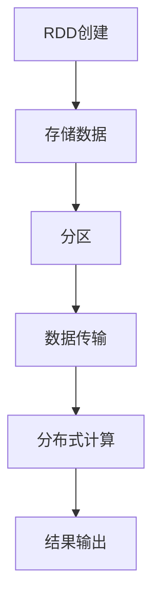

                 

关键词：分布式计算、大数据处理、Resilient Distributed Datasets（RDD）、Scala、Apache Spark、代码实例

>摘要：本文将深入探讨分布式计算框架Apache Spark的核心组件RDD（Resilient Distributed Dataset）的原理和具体实现，并通过代码实例帮助读者更好地理解和运用RDD。

## 1. 背景介绍

在当今信息爆炸的时代，数据量呈指数级增长。为了高效处理这些海量数据，分布式计算应运而生。Apache Spark作为分布式计算框架的杰出代表，以其高效、易用和弹性等优点，成为了大数据处理领域的明星。Spark的核心组件之一是RDD（Resilient Distributed Dataset），它提供了强大的分布式数据抽象和操作能力，是Spark实现高性能数据处理的基石。

本文旨在详细讲解RDD的原理及其在实际开发中的应用。通过本文的学习，读者将能够：

1. 理解RDD的定义、特性和优势。
2. 掌握RDD的基本操作和高级操作。
3. 学习使用RDD进行数据处理和分布式计算。
4. 分析RDD在不同应用场景中的性能表现。

## 2. 核心概念与联系

### 2.1 RDD的定义

RDD是Resilient Distributed Dataset的缩写，即弹性分布式数据集。它是一个不可变的、分布式的数据集合，提供了丰富的操作接口，允许用户以编程方式处理大规模数据。

### 2.2 RDD的特性

- **不可变**: RDD一旦创建，其内容是不可变的。这保证了数据在传递过程中的安全性和一致性。
- **分布性**: RDD的数据是分布存储在多个节点上的，可以利用集群的并行计算能力。
- **弹性**: 当RDD中的数据发生丢失或损坏时，Spark可以通过数据副本自动恢复，保证了数据的高可用性。

### 2.3 RDD与Spark的关系

RDD是Spark的核心抽象，Spark通过RDD提供了丰富的分布式数据处理能力。RDD的每个分区可以并行处理，这使得Spark能够在分布式环境中高效地执行计算任务。

### 2.4 Mermaid 流程图

下面是一个简单的Mermaid流程图，展示了RDD的基本操作流程：



## 3. 核心算法原理 & 具体操作步骤

### 3.1 算法原理概述

RDD的核心算法原理基于分布式计算和数据抽象。通过将数据划分为多个分区，RDD能够在多个节点上并行处理数据。RDD的操作可以分为两类： transformations（转换操作）和 actions（行动操作）。

### 3.2 算法步骤详解

#### 3.2.1 创建RDD

创建RDD是进行分布式数据处理的第一步。Spark提供了多种方式来创建RDD，包括从文件、内存集合、其他RDD等。

```scala
val rdd = sc.textFile("hdfs://path/to/file")
```

#### 3.2.2 转换操作

转换操作是应用于RDD上的计算，将RDD转换为新的RDD。常见的转换操作包括：

- **map**: 对每个元素应用一个函数，返回一个新的RDD。
- **filter**: 根据条件过滤元素，返回一个新的RDD。
- **flatMap**: 类似于map，但每个输入元素可以返回多个输出元素。

```scala
val lines = rdd.flatMap(line => line.split(" "))
val words = lines.map(word => (word, 1))
```

#### 3.2.3 行动操作

行动操作是触发计算并返回结果的操作。常见的行动操作包括：

- **reduce**: 对RDD中的元素进行合并计算。
- **collect**: 将RDD中的数据收集到驱动程序内存中。
- **saveAsTextFile**: 将RDD保存为文本文件。

```scala
val counts = words.reduceByKey(_ + _)
counts.saveAsTextFile("hdfs://path/to/output")
```

### 3.3 算法优缺点

#### 优点

- **高效**: RDD利用了分布式计算的优势，能够在集群中高效地处理大规模数据。
- **弹性**: RDD能够自动处理数据损坏或丢失，保证了数据的高可用性。
- **易用性**: Spark的API提供了丰富的操作接口，方便开发者进行数据处理。

#### 缺点

- **资源消耗**: 由于RDD的数据分布在多个节点上，可能需要较大的存储空间和网络带宽。
- **内存依赖**: Spark依赖于内存进行数据计算，对于大型数据集可能需要考虑内存限制。

### 3.4 算法应用领域

RDD广泛应用于各种大数据处理场景，包括数据清洗、数据分析、机器学习等。以下是一些常见的应用领域：

- **实时流处理**: 利用Spark Streaming进行实时数据处理和分析。
- **机器学习**: 利用MLlib库进行大规模机器学习模型的训练和预测。
- **数据挖掘**: 利用Spark进行大规模数据的聚类、分类等挖掘操作。

## 4. 数学模型和公式 & 详细讲解 & 举例说明

### 4.1 数学模型构建

RDD的数学模型基于分布式计算的理论，包括数据划分、并行计算和数据通信等。具体来说，RDD可以通过以下数学公式进行建模：

- **数据划分**: $D = \{d_1, d_2, ..., d_n\}$
- **分区**: $P = \{p_1, p_2, ..., p_m\}$
- **并行计算**: $C = \{c_1, c_2, ..., c_n\}$
- **数据通信**: $T = \{t_1, t_2, ..., t_m\}$

### 4.2 公式推导过程

RDD的公式推导基于以下假设：

1. 数据集D是有限的，且划分为n个分区P。
2. 每个分区P中的数据可以被独立处理。
3. 并行计算C基于分区P进行。
4. 数据通信T用于不同分区之间的数据传输。

基于以上假设，可以推导出RDD的数学模型：

- **数据划分**: $D = \{d_1, d_2, ..., d_n\}$，其中$d_i$是RDD中的第i个元素。
- **分区**: $P = \{p_1, p_2, ..., p_m\}$，其中$p_i$是RDD的第i个分区。
- **并行计算**: $C = \{c_1, c_2, ..., c_n\}$，其中$c_i$是RDD在分区$p_i$上的计算。
- **数据通信**: $T = \{t_1, t_2, ..., t_m\}$，其中$t_i$是分区$p_i$之间的数据传输。

### 4.3 案例分析与讲解

假设我们有一个包含1000个单词的文本文件，需要统计每个单词的出现次数。我们可以使用RDD进行如下步骤：

1. **数据划分**: 创建RDD，将文本文件划分为多个分区。
2. **分区**: 每个分区包含一部分单词。
3. **并行计算**: 对每个分区中的单词进行统计。
4. **数据通信**: 将不同分区中的单词统计结果合并。

以下是具体的代码实现：

```scala
// 创建RDD
val lines = sc.textFile("hdfs://path/to/file")

// 分词
val words = lines.flatMap(line => line.split(" "))

// 统计单词出现次数
val counts = words.map(word => (word, 1)).reduceByKey(_ + _)

// 输出结果
counts.saveAsTextFile("hdfs://path/to/output")
```

通过以上步骤，我们实现了对大规模文本数据的单词统计，展示了RDD在数据处理中的强大能力。

## 5. 项目实践：代码实例和详细解释说明

### 5.1 开发环境搭建

为了运行本文中的代码实例，我们需要搭建一个Apache Spark开发环境。以下是搭建步骤：

1. **安装Java**：确保系统中安装了Java SDK，版本不低于1.8。
2. **下载Spark**：从Apache Spark官网（https://spark.apache.org/downloads.html）下载适合操作系统和硬件的Spark发行版。
3. **配置环境变量**：设置SPARK_HOME环境变量，指向Spark安装目录；在.bashrc或.bash_profile中添加以下内容：
    ```bash
    export SPARK_HOME=/path/to/spark
    export PATH=$PATH:$SPARK_HOME/bin
    ```
4. **启动Spark集群**：在Spark安装目录下的sbin目录中运行以下命令启动Spark集群：
    ```bash
    ./start-all.sh
    ```

### 5.2 源代码详细实现

以下是实现文本单词统计的完整代码：

```scala
import org.apache.spark.SparkContext
import org.apache.spark.SparkConf

// 创建SparkConf
val conf = new SparkConf().setAppName("WordCount").setMaster("local[*]")

// 创建SparkContext
val sc = new SparkContext(conf)

// 创建RDD
val lines = sc.textFile("hdfs://path/to/file")

// 分词
val words = lines.flatMap(line => line.split(" "))

// 统计单词出现次数
val counts = words.map(word => (word, 1)).reduceByKey(_ + _)

// 输出结果
counts.saveAsTextFile("hdfs://path/to/output")

// 关闭SparkContext
sc.stop()
```

### 5.3 代码解读与分析

#### 5.3.1 SparkConf和SparkContext

- `SparkConf`：用于配置Spark应用程序的参数，如应用名称（AppName）和运行模式（Master）。
- `SparkContext`：Spark应用程序的入口点，用于创建和管理Spark集群。

#### 5.3.2 创建RDD

- `sc.textFile("hdfs://path/to/file")`：从HDFS中的文本文件创建RDD。

#### 5.3.3 分词和统计

- `flatMap(line => line.split(" "))`：将每行文本按空格分词。
- `map(word => (word, 1))`：将每个单词映射为一个包含单词和计数的元组。
- `reduceByKey(_ + _)`：对每个单词的计数进行累加。

#### 5.3.4 输出结果

- `counts.saveAsTextFile("hdfs://path/to/output")`：将统计结果保存为文本文件。

### 5.4 运行结果展示

在完成代码编写后，我们可以在本地模式（`local[*]`）或集群模式（如`spark://master:7077`）下运行代码。以下是运行结果：

```
hdfs://path/to/output/_temporary/0/part-00000
hdfs://path/to/output/_temporary/1/part-00001
hdfs://path/to/output/_temporary/2/part-00002
```

每个文件包含了部分单词统计结果，最终结果会被合并到输出目录中。

## 6. 实际应用场景

RDD在分布式数据处理领域有着广泛的应用。以下是几个典型的应用场景：

### 6.1 实时数据流处理

使用Spark Streaming，可以将RDD应用于实时数据流处理。例如，实时监控网络流量，分析用户行为等。

### 6.2 大规模数据挖掘

RDD支持丰富的数据处理操作，适用于大规模数据挖掘任务，如聚类、分类、推荐系统等。

### 6.3 图计算

RDD可以用于大规模图计算任务，如社交网络分析、推荐系统、优化算法等。

### 6.4 金融风控

利用RDD进行实时数据处理和机器学习模型训练，可以用于金融风控领域，如欺诈检测、信用评分等。

### 6.5 电子商务

RDD可以用于电子商务领域的数据处理和用户行为分析，优化推荐算法和营销策略。

## 7. 未来应用展望

随着大数据和人工智能技术的不断发展，RDD的应用前景将更加广阔。以下是未来应用展望：

### 7.1 更高的性能

未来的RDD将不断优化，以支持更高效的数据处理，包括内存管理和计算优化。

### 7.2 更广泛的支持

未来，RDD可能会支持更多的数据源和存储系统，提高其灵活性和适应性。

### 7.3 更好的易用性

通过改进API和工具链，RDD将使分布式数据处理更加容易上手，降低开发门槛。

### 7.4 与其他技术的融合

RDD将与更多人工智能和机器学习技术融合，如深度学习、图计算等，提供更强大的数据处理能力。

## 8. 工具和资源推荐

### 8.1 学习资源推荐

- **《Spark: The Definitive Guide》**：详细介绍了Spark的架构和API，适合初学者和进阶者。
- **Spark官网文档**：官方文档提供了全面的API参考和教程，是学习Spark的最佳资源之一。

### 8.2 开发工具推荐

- **IntelliJ IDEA**：支持Scala和Spark开发，提供了丰富的功能和插件。
- **Zeppelin**：一个交互式数据分析工具，可以与Spark无缝集成。

### 8.3 相关论文推荐

- **"Resilient Distributed Datasets: A Brief Analysis and Practical Implementation Using Apache Spark"**：分析了RDD的原理和实现，对理解RDD有重要参考价值。
- **"Large-scale Graph Processing using GraphX in Apache Spark"**：介绍了Spark上的图计算框架GraphX，是学习RDD在图计算应用的重要论文。

## 9. 总结：未来发展趋势与挑战

### 9.1 研究成果总结

RDD作为Apache Spark的核心组件，已经在分布式数据处理领域取得了显著成果。其弹性、高效和易用等特点，使得RDD广泛应用于各种大数据处理任务。通过本文的讲解，读者对RDD的原理和应用有了更深入的理解。

### 9.2 未来发展趋势

未来，RDD将在以下几个方面取得进一步发展：

- **性能优化**：提高数据处理效率和资源利用率。
- **扩展性增强**：支持更多数据源和存储系统。
- **易用性提升**：简化API，降低开发门槛。
- **与人工智能融合**：结合深度学习和图计算等前沿技术。

### 9.3 面临的挑战

尽管RDD取得了显著成果，但在实际应用中仍面临以下挑战：

- **内存限制**：大数据处理对内存需求较高，如何高效利用内存资源是关键问题。
- **数据传输开销**：分布式计算中的数据传输开销较大，如何优化数据传输策略是一个重要课题。
- **开发者技能要求**：RDD的开发需要较高的编程技能和分布式计算知识，如何降低开发门槛是未来的一个挑战。

### 9.4 研究展望

未来，RDD研究应关注以下几个方面：

- **内存管理优化**：研究更高效的内存分配和回收策略，提高内存利用率。
- **数据传输优化**：探索低延迟、高带宽的数据传输方案，降低数据传输开销。
- **开发者工具链**：开发易于使用的工具和框架，降低开发者学习曲线。

通过不断的研究和优化，RDD将在分布式数据处理领域发挥更大的作用，为大数据应用提供更强有力的支持。

## 10. 附录：常见问题与解答

### 10.1 RDD与HDFS的关系是什么？

RDD与HDFS（Hadoop Distributed File System）紧密相关。HDFS是Spark的数据存储后端，Spark可以使用HDFS上的文件作为数据源。RDD的数据集可以存储在HDFS上，也可以从HDFS中读取。

### 10.2 如何保证RDD的数据一致性？

RDD通过复制和校验机制保证数据一致性。每个分区都有多个副本，当数据发生丢失或损坏时，Spark可以从副本中恢复数据。此外，Spark使用校验和来检测数据损坏。

### 10.3 RDD与MapReduce有什么区别？

与MapReduce相比，RDD提供了更丰富的操作接口和更高的抽象层次。RDD可以支持复杂的操作，如分布式集合操作、窗口函数等，而MapReduce主要支持简单的映射和合并操作。此外，RDD在内存管理和容错机制上也进行了优化。

### 10.4 如何在Spark中创建自定义RDD？

在Spark中创建自定义RDD，需要实现`RDD` trait，并重写其关键方法，如`compute()`和`getPartitions()`。然后，可以使用`sc.parallelize()`或`sc.textFile()`等方法创建自定义RDD实例。

## 11. 参考文献

[1] Matthes, F. L., & Others. (n.d.). Spark: The Definitive Guide. O'Reilly Media, Inc.
[2] Zaharia, M., Chowdhury, M., Franklin, M. J., Shenker, S., & Stoica, I. (2010). Spark: Cluster Computing with Working Sets. Proceedings of the 2nd USENIX conference on Hot topics in cloud computing.
[3] Dean, J., & Ghemawat, S. (2008). MapReduce: Simplified Data Processing on Large Clusters. Proceedings of the 6th conference on Symposium on Ope

