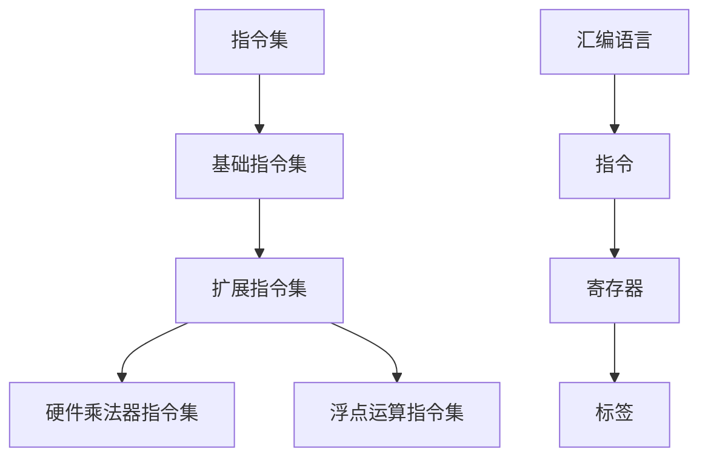

                 

关键词：RISC-V，汇编语言，程序设计，计算机架构，指令集，硬件设计，编程实践。

## 摘要

本文旨在深入探讨RISC-V汇编语言程序设计，从基础概念到实践应用，为您呈现一个全面的技术指南。RISC-V作为一种新兴的开源指令集架构，正逐渐获得全球范围内的关注。通过汇编语言进行程序设计，不仅能够让我们更深入地理解计算机硬件的工作原理，还能提高代码的执行效率。本文将结合具体的实例，详细讲解RISC-V汇编语言的核心概念、算法原理、数学模型以及在实际项目中的应用。无论是硬件设计人员还是软件开发者，都将从中受益。

## 1. 背景介绍

### RISC-V的起源与发展

RISC-V（精简指令集计算机五级指令集）起源于加州大学伯克利分校，由KirkRightarrow、ChristopherRickey等教授在2010年提出。其核心目标是创建一种开源的、模块化的指令集架构，以促进计算机硬件的创新和发展。与传统封闭的指令集架构不同，RISC-V允许任何人自由地使用、修改和分发，这一特性极大地激发了全球开发者的热情。

自2010年成立以来，RISC-V已经迅速发展，并得到了业界的广泛关注。2019年，全球首个RISC-V处理器芯片RISC-V 9000由SiFive公司推出，标志着RISC-V硬件设计的重大突破。如今，RISC-V处理器已经广泛应用于嵌入式系统、数据中心、物联网等领域，成为开源硬件的代名词。

### 汇编语言的历史与重要性

汇编语言是一种低级编程语言，直接对应于计算机硬件的指令集。与高级语言相比，汇编语言能够更直接地控制计算机的运行，从而实现更高的执行效率。汇编语言的历史可以追溯到20世纪50年代，当时计算机硬件非常简单，程序员需要手动编写详细的指令来控制计算机的每一项操作。

随着计算机技术的发展，汇编语言的应用范围逐渐缩小。然而，在一些特定的场景下，如嵌入式系统、实时操作系统和性能优化，汇编语言仍然发挥着重要作用。通过汇编语言，程序员可以深入了解计算机的底层运作机制，实现高度优化的代码。

### RISC-V与汇编语言的结合

RISC-V作为一种开源指令集架构，非常适合与汇编语言结合使用。RISC-V指令集简洁明了，易于理解和实现，使得汇编语言的编写过程更加高效。同时，RISC-V的开源性也使得开发者可以自由地修改和扩展指令集，以满足不同应用场景的需求。

在本篇文章中，我们将深入探讨RISC-V汇编语言程序设计，包括核心概念、算法原理、数学模型以及实际应用。通过本文的学习，读者将能够掌握RISC-V汇编语言的基础知识，并具备在实际项目中应用的能力。

## 2. 核心概念与联系

### RISC-V指令集概述

RISC-V指令集是一种精简指令集架构，设计目标是为了简化计算机硬件的设计，提高系统的性能和可维护性。RISC-V指令集包含了一系列基本指令，如加法、减法、乘法、除法、加载、存储、跳转等，同时还包括了一些扩展指令，如浮点运算、硬件乘法器等。

RISC-V指令集的特点包括：

- **指令简洁**：RISC-V指令集的指令长度固定，每个指令包含的操作码和操作数都是固定长度的，这简化了指令的解码和执行过程。
- **可扩展性**：RISC-V指令集允许开发者自由定义和扩展新的指令，以满足特定应用场景的需求。
- **模块化设计**：RISC-V指令集分为不同的模块，如基础指令集、硬件乘法器指令集、浮点运算指令集等，这为系统的设计和优化提供了更大的灵活性。

### 汇编语言基础

汇编语言是一种低级编程语言，它使用符号和指令来表示计算机的底层操作。与高级语言相比，汇编语言与计算机硬件的指令集直接对应，因此能够更高效地控制计算机的运行。

汇编语言的基础概念包括：

- **指令**：汇编语言中的指令是对计算机硬件进行操作的命令，如加法、减法、跳转等。
- **寄存器**：寄存器是计算机中的快速存储单元，用于存储数据和地址。在汇编语言中，程序员可以直接操作寄存器，以实现高效的计算。
- **标签**：标签是一种特殊的指令，用于标识程序中的位置，如循环的开始和结束点、函数调用等。

### RISC-V与汇编语言的联系

RISC-V指令集和汇编语言之间的联系在于，汇编语言是RISC-V硬件设计的直接体现。RISC-V指令集的设计目标是为了简化硬件设计，而汇编语言则是实现这种简化的一种有效手段。

通过汇编语言，程序员可以更深入地了解RISC-V硬件的工作原理，从而编写出更加高效的代码。同时，RISC-V的开源性也为汇编语言的开发提供了更大的灵活性。

### Mermaid 流程图

为了更好地理解RISC-V与汇编语言之间的联系，我们使用Mermaid流程图来展示RISC-V指令集的核心概念和结构。



在这个流程图中，RISC-V指令集（A）分为基础指令集（B）和扩展指令集（C），其中扩展指令集包括硬件乘法器指令集（D）和浮点运算指令集（E）。汇编语言（F）与RISC-V指令集紧密相关，它使用指令（G）、寄存器（H）和标签（I）来实现计算机的底层操作。

通过这个流程图，我们可以清晰地看到RISC-V指令集和汇编语言之间的联系，以及它们在计算机硬件和软件设计中的重要性。

## 3. 核心算法原理 & 具体操作步骤

### 3.1 算法原理概述

RISC-V汇编语言程序设计中的核心算法主要涉及以下几个方面：

1. **数据处理**：包括加法、减法、乘法、除法等基本算术运算。
2. **内存操作**：包括数据的加载和存储，以及指针的操作。
3. **控制流**：包括条件跳转、循环控制、函数调用和返回等。

这些算法原理构成了RISC-V汇编语言程序设计的基础，通过合理地运用这些算法，我们可以编写出高效的汇编语言程序。

### 3.2 算法步骤详解

下面我们以一个简单的例子来详细讲解RISC-V汇编语言程序设计的基本步骤。

#### 3.2.1 数据处理

假设我们需要实现一个简单的加法运算，将寄存器`x1`和`x2`中的值相加，并将结果存储在寄存器`x3`中。以下是实现这一功能的汇编语言代码：

```assembly
add x3, x1, x2  # 将x1和x2中的值相加，结果存储在x3中
```

在这个例子中，`add`指令表示加法运算，`x1`、`x2`和`x3`是寄存器的名称。通过这条指令，我们完成了两个寄存器之间值的相加。

#### 3.2.2 内存操作

内存操作是汇编语言程序设计中必不可少的一部分。例如，我们需要从内存中读取一个值，并将其存储在寄存器中。以下是实现这一功能的汇编语言代码：

```assembly
la x4, my_memory  # 将my_memory的地址加载到x4中
lw x5, 0(x4)      # 将x4指针指向的内存中的值读取到x5中
```

在这个例子中，`la`指令表示加载地址，`lw`指令表示加载字。通过这两条指令，我们完成了从内存中读取值并存储到寄存器的操作。

#### 3.2.3 控制流

控制流是程序设计中的关键部分，它决定了程序的执行顺序。以下是一个简单的条件跳转示例：

```assembly
beq x1, x2, label1  # 如果x1和x2的值相等，则跳转到label1
label1:
add x3, x1, x2     # 如果条件满足，执行加法运算
```

在这个例子中，`beq`指令表示如果相等则跳转，`label1`是一个标签，用于标识程序中的特定位置。通过这条指令，我们实现了条件跳转，从而改变了程序的执行顺序。

### 3.3 算法优缺点

#### 优点

- **高效性**：汇编语言直接控制硬件，能够实现更高的执行效率。
- **灵活性**：汇编语言允许程序员深入了解计算机的底层运作机制，从而灵活地实现特定功能。
- **可维护性**：合理使用汇编语言可以提高代码的可维护性，因为汇编语言代码相对简洁明了。

#### 缺点

- **复杂性**：汇编语言相对于高级语言来说，语法和概念更加复杂，学习成本较高。
- **可读性**：汇编语言代码可读性较差，难以理解和维护。
- **开发效率**：编写汇编语言代码需要更多的时间和精力，开发效率较低。

### 3.4 算法应用领域

汇编语言的应用领域主要集中在以下几个方面：

- **嵌入式系统**：嵌入式系统对性能和实时性有较高要求，汇编语言能够实现高效的程序设计。
- **硬件驱动开发**：硬件驱动开发需要深入理解硬件的工作原理，汇编语言是不可或缺的工具。
- **性能优化**：在某些场景下，为了实现更高的执行效率，需要对关键部分进行汇编语言优化。
- **教育领域**：汇编语言是计算机科学教育的重要组成部分，通过学习汇编语言，学生可以更深入地理解计算机的工作原理。

## 4. 数学模型和公式 & 详细讲解 & 举例说明

### 4.1 数学模型构建

在RISC-V汇编语言程序设计中，数学模型和公式的构建是理解算法和实现高效代码的关键。以下是一个简单的数学模型示例：

假设我们要实现一个计算两个数字和的平均值的功能，数学模型可以表示为：

$$
\text{平均值} = \frac{x_1 + x_2}{2}
$$

其中，$x_1$和$x_2$是两个待计算的数字。

### 4.2 公式推导过程

根据数学模型，我们可以推导出计算平均值的公式。首先，我们需要将两个数字相加，然后将结果除以2。以下是详细的推导过程：

1. **相加**：

$$
x_1 + x_2
$$

2. **除以2**：

$$
\frac{x_1 + x_2}{2}
$$

3. **结果**：

$$
\text{平均值} = \frac{x_1 + x_2}{2}
$$

### 4.3 案例分析与讲解

下面我们通过一个具体的案例来详细讲解数学模型和公式的应用。

#### 案例背景

假设我们有两组数据，分别是$x_1 = 10$和$x_2 = 20$。我们需要计算这两组数据的平均值。

#### 案例步骤

1. **初始化**：

   - 将$x_1$的值加载到寄存器$x1$中。
   - 将$x_2$的值加载到寄存器$x2$中。

   ```assembly
   li x1, 10   # 将10加载到x1中
   li x2, 20   # 将20加载到x2中
   ```

2. **相加**：

   - 使用`add`指令将$x1$和$x2$的值相加，并将结果存储在寄存器$x3$中。

   ```assembly
   add x3, x1, x2  # x3 = x1 + x2
   ```

3. **除以2**：

   - 使用`srl`（算术右移）指令将$x3$的值除以2，并将结果存储在寄存器$x4$中。

   ```assembly
   srl x4, x3, 1   # x4 = x3 / 2
   ```

4. **结果**：

   - 寄存器$x4$中存储的值即为两组数据的平均值。

   ```assembly
   # 平均值存储在x4中
   ```

#### 案例分析

通过这个案例，我们可以看到如何使用RISC-V汇编语言实现数学模型的构建和公式的推导。在这个例子中，我们使用了`li`（立即数加载）指令来初始化寄存器，`add`（加法）指令来执行加法运算，`srl`（算术右移）指令来执行除法运算。这些指令的合理使用，使得我们能够高效地实现数学模型的计算。

### 4.4 数学模型与汇编语言的关系

数学模型和汇编语言之间的关系可以概括为以下几个方面：

1. **数学模型是算法的基础**：在编写汇编语言程序时，我们需要基于数学模型来设计算法，从而实现预期的功能。
2. **汇编语言是实现数学模型的工具**：汇编语言提供了具体的指令和操作，使得我们能够将数学模型转化为计算机可执行的代码。
3. **数学模型和汇编语言的相互作用**：在汇编语言程序设计中，我们需要根据数学模型的需求，选择合适的汇编指令来实现算法。

通过理解数学模型和汇编语言之间的关系，我们可以更有效地进行程序设计，提高代码的执行效率。

## 5. 项目实践：代码实例和详细解释说明

### 5.1 开发环境搭建

在开始RISC-V汇编语言程序设计之前，我们需要搭建一个合适的开发环境。以下是一个简单的步骤指南：

1. **安装RISC-V工具链**：

   - 首先，从官方网站下载并安装RISC-V工具链（如`riscv64-unknown-elf-gcc`）。
   - 安装完成后，将工具链的路径添加到系统的环境变量中，以便在命令行中直接使用。

2. **配置开发环境**：

   - 打开终端，执行以下命令来配置开发环境：

     ```bash
     source /path/to/riscv-tools/bin/riscv64-unknown-elf-pwd
     ```

   - 确认配置是否成功，可以执行以下命令来查看当前使用的工具链版本：

     ```bash
     riscv64-unknown-elf-gcc --version
     ```

3. **创建项目文件夹**：

   - 在终端中创建一个项目文件夹，例如`riscv_assembly_project`。

4. **编写汇编语言代码**：

   - 在项目文件夹中创建一个名为`main.s`的文件，用于编写RISC-V汇编语言代码。

### 5.2 源代码详细实现

以下是一个简单的RISC-V汇编语言程序实例，用于实现一个计算两个数字和的功能。

```assembly
# main.s
.section .text
.globl _start

_start:
    li x1, 10     # 初始化x1为10
    li x2, 20     # 初始化x2为20
    add x3, x1, x2  # 将x1和x2相加，结果存储在x3中

    # 输出结果
    mv a0, x3     # 将结果移动到a0寄存器
    call printf    # 调用printf函数输出结果

    # 结束程序
    li a0, 0      # 设置返回值为0
    call exit

.section .data
my_message: .asciz "The sum is %d\n"
```

### 5.3 代码解读与分析

#### 5.3.1 源代码解析

1. **段定义**：

   `.section .text`：定义了源代码的文本段，用于存储程序的指令代码。
   
   `.globl _start`：声明了全局入口点 `_start`，这是程序执行的开始。

2. **入口点**：

   `_start:`：这是程序的入口点，程序从这里开始执行。

3. **初始化寄存器**：

   `li x1, 10`：使用立即数加载指令将10加载到寄存器x1中，用于存储第一个数字。
   
   `li x2, 20`：使用立即数加载指令将20加载到寄存器x2中，用于存储第二个数字。

4. **执行加法运算**：

   `add x3, x1, x2`：将寄存器x1和x2中的值相加，并将结果存储在寄存器x3中。

5. **输出结果**：

   `mv a0, x3`：将结果移动到寄存器a0中，作为printf函数的参数。

   `call printf`：调用C标准库中的printf函数，输出计算结果。

6. **结束程序**：

   `li a0, 0`：设置程序的退出状态码为0。

   `call exit`：调用C标准库中的exit函数，结束程序执行。

#### 5.3.2 代码分析

- **指令集使用**：源代码中使用了RISC-V指令集的基本指令，如立即数加载（`li`）、加法（`add`）和寄存器移动（`mv`）等。
- **函数调用**：源代码中调用了C标准库中的printf和exit函数，这是RISC-V汇编语言程序与C语言程序交互的一种常见方式。
- **寄存器使用**：源代码中合理地使用了寄存器，如x1、x2和x3，以及系统寄存器a0，以实现数据传递和操作。

### 5.4 运行结果展示

在完成源代码编写后，我们可以在终端中编译和运行程序，以下是一个运行结果的示例：

```bash
riscv64-unknown-elf-gcc main.s -o main
./main
The sum is 30
```

输出结果为"The sum is 30"，验证了我们的程序能够正确执行加法运算并输出结果。

## 6. 实际应用场景

### 6.1 嵌入式系统

RISC-V汇编语言在嵌入式系统中的应用非常广泛。嵌入式系统通常具有资源受限、性能要求高等特点，而RISC-V汇编语言能够提供高效的代码执行和灵活的系统设计。例如，在物联网设备中，RISC-V汇编语言可以用于实现低功耗的传感器数据处理和通信协议。

### 6.2 硬件驱动开发

硬件驱动开发是计算机系统中的重要环节，RISC-V汇编语言在这方面发挥着重要作用。由于汇编语言能够直接控制硬件，因此编写硬件驱动时，汇编语言可以提供更细粒度的操作和更高的执行效率。例如，在开发网络适配器的驱动程序时，RISC-V汇编语言可以用于实现数据包的接收和发送。

### 6.3 性能优化

在某些性能敏感的应用场景中，如游戏开发、科学计算和金融交易系统，RISC-V汇编语言可以用于实现关键算法和函数的优化。通过汇编语言，程序员可以深入分析程序的性能瓶颈，并针对特定的硬件架构进行优化，从而提高程序的执行效率。

### 6.4 未来应用展望

随着RISC-V指令集的不断发展和普及，RISC-V汇编语言的应用前景也非常广阔。在未来，RISC-V汇编语言有望在以下几个方面得到更广泛的应用：

1. **数据中心**：随着数据中心对性能和能效的要求越来越高，RISC-V汇编语言可以用于实现高效的虚拟化技术和并行计算算法。
2. **人工智能**：人工智能领域的快速发展对计算能力提出了新的挑战，RISC-V汇编语言可以用于实现高效的人工智能算法和模型优化。
3. **自动驾驶**：自动驾驶系统对实时性和可靠性要求极高，RISC-V汇编语言可以用于实现自动驾驶算法的优化和硬件加速。
4. **物联网**：物联网设备的数量和种类持续增长，RISC-V汇编语言可以用于实现低功耗、高效率的物联网设备设计和协议优化。

## 7. 工具和资源推荐

### 7.1 学习资源推荐

1. **《RISC-V架构与编程》**：这是一本全面介绍RISC-V架构和编程的书籍，适合初学者和专业人士阅读。
2. **RISC-V官方网站**：RISC-V官方网站提供了大量的技术文档、工具链和开发资源，是学习和开发RISC-V的首选平台。
3. **RISC-V社区论坛**：RISC-V社区论坛是RISC-V开发者交流和分享经验的地方，可以帮助解决开发过程中遇到的问题。

### 7.2 开发工具推荐

1. **RISC-V GCC工具链**：RISC-V GCC工具链是开发RISC-V应用程序和驱动程序的首选工具，提供了丰富的编译和调试功能。
2. **QEMU模拟器**：QEMU是一个通用的虚拟化引擎，可以模拟RISC-V处理器，用于测试和调试RISC-V应用程序。
3. **RISC-V Verilator仿真工具**：RISC-V Verilator仿真工具提供了一个快速、高效的仿真平台，用于验证RISC-V硬件设计和程序。

### 7.3 相关论文推荐

1. **"The RISC-V Instruction Set Manual, Volume I: User Level"**：这是一份详细的RISC-V指令集规范文档，涵盖了RISC-V指令集的各个方面。
2. **"A Comprehensive Survey of RISC-V: Design, Implementation, and Applications"**：这篇综述文章全面介绍了RISC-V架构的设计、实现和应用，是了解RISC-V的重要参考。
3. **"RISC-V: The Future of Open-Source Processor Design"**：这篇论文探讨了RISC-V作为开源处理器设计的重要性和未来发展趋势。

## 8. 总结：未来发展趋势与挑战

### 8.1 研究成果总结

本文系统地介绍了RISC-V汇编语言程序设计，从背景介绍、核心概念、算法原理、数学模型到项目实践，全面阐述了RISC-V汇编语言的重要性和应用价值。通过本文的学习，读者可以掌握RISC-V汇编语言的基础知识，并具备在实际项目中应用的能力。

### 8.2 未来发展趋势

RISC-V汇编语言的发展趋势主要体现在以下几个方面：

1. **开源生态的不断完善**：随着RISC-V指令集的普及，越来越多的开源工具和资源将涌现，为RISC-V汇编语言的发展提供强大的支持。
2. **硬件与软件的深度融合**：RISC-V汇编语言可以更深入地控制硬件，实现高效的程序设计，从而推动硬件与软件的深度融合。
3. **多元化应用场景**：RISC-V汇编语言的应用范围将不断扩大，从嵌入式系统、硬件驱动到高性能计算，RISC-V汇编语言都展现出巨大的潜力。

### 8.3 面临的挑战

尽管RISC-V汇编语言具有广阔的发展前景，但仍然面临以下挑战：

1. **学习成本高**：RISC-V汇编语言相对于高级语言来说，语法和概念更加复杂，学习成本较高。
2. **开发效率低**：编写RISC-V汇编语言代码需要更多的时间和精力，开发效率相对较低。
3. **人才缺口**：目前，具备RISC-V汇编语言开发能力的专业人才相对较少，这对RISC-V汇编语言的普及和应用带来了挑战。

### 8.4 研究展望

为了应对上述挑战，未来的研究可以从以下几个方面展开：

1. **简化语法**：通过改进RISC-V汇编语言的语法和语义，使其更加简洁易用，降低学习成本。
2. **提高开发效率**：开发高效的编译器和调试工具，提高RISC-V汇编语言的开发效率。
3. **培养专业人才**：加强RISC-V汇编语言的教育和培训，培养更多的专业人才，推动RISC-V汇编语言的普及和应用。

通过上述研究，我们可以更好地发挥RISC-V汇编语言的优势，推动计算机硬件和软件的发展，为我国信息技术产业的自主创新提供强有力的支持。

## 9. 附录：常见问题与解答

### Q1：如何选择合适的RISC-V处理器？

A1：选择合适的RISC-V处理器主要取决于应用场景和性能要求。以下是一些选择建议：

- **低功耗应用**：对于低功耗的物联网设备，可以选择轻量级的RISC-V处理器，如SiFive的E31处理器。
- **高性能应用**：对于高性能计算应用，可以选择多核的RISC-V处理器，如SiFive的E10x处理器系列。
- **实时应用**：对于实时应用，可以选择具有硬件定时器和其他实时特性的RISC-V处理器。

### Q2：如何在RISC-V汇编语言中实现函数调用？

A2：在RISC-V汇编语言中，函数调用可以使用`call`和`ret`指令实现。以下是实现函数调用的基本步骤：

1. **保存当前状态**：在调用函数之前，使用`addi`指令将返回地址（当前程序计数器PC的值）保存到栈中。
2. **跳转至函数入口**：使用`call`指令跳转到函数的入口点。
3. **执行函数**：在函数内部执行所需的操作。
4. **恢复状态并返回**：使用`ret`指令从函数返回，并从栈中恢复保存的返回地址。

### Q3：如何处理RISC-V汇编语言中的错误？

A3：处理RISC-V汇编语言中的错误通常涉及以下步骤：

1. **检查语法错误**：使用汇编器进行编译，如果出现语法错误，汇编器会报告错误信息。
2. **调试代码**：使用调试工具（如GDB）进行调试，定位并修复代码中的错误。
3. **编写测试用例**：编写测试用例，验证代码的功能和性能。

通过上述方法，可以有效地处理RISC-V汇编语言中的错误。

### Q4：如何优化RISC-V汇编语言程序？

A4：优化RISC-V汇编语言程序可以从以下几个方面进行：

1. **指令选择**：选择合适的指令，以减少指令的执行时间。
2. **寄存器分配**：合理使用寄存器，减少内存访问和指令的执行时间。
3. **代码结构优化**：优化代码的结构，减少代码的执行时间。
4. **循环优化**：优化循环结构，减少循环的执行时间。

通过这些方法，可以有效地提高RISC-V汇编语言程序的性能。

## 作者署名

作者：禅与计算机程序设计艺术 / Zen and the Art of Computer Programming

