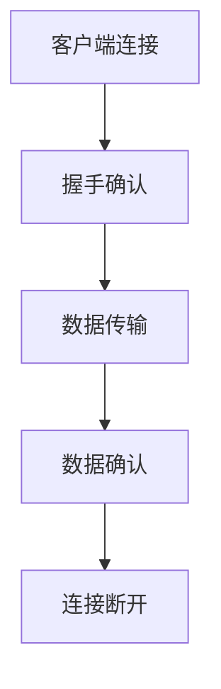

                 

关键词：实时消息传输、流媒体、RTMP、协议、编码、解码、传输优化

> 摘要：本文将深入探讨RTMP（实时消息传输协议）这一流媒体传输的核心技术。文章首先介绍了RTMP的基本背景，然后详细解析了其核心概念和架构，探讨了其算法原理和操作步骤，并运用数学模型进行了公式推导。接着，通过实际代码实例展示了如何在项目中应用RTMP协议。文章最后分析了RTMP在实际应用中的场景，并对其未来发展趋势与挑战进行了展望。

## 1. 背景介绍

随着互联网的普及，流媒体技术在视频直播、点播、游戏等领域得到了广泛应用。流媒体技术的核心在于如何高效、稳定地传输大量数据。而RTMP（实时消息传输协议）正是为了满足这一需求而设计的一种流媒体传输协议。

RTMP是由Adobe公司在2005年推出的，用于在Flash平台上传输音视频数据的一种协议。随着技术的发展，RTMP已经不再局限于Flash平台，而是广泛应用于WebRTC、HTML5等现代流媒体技术中。其低延迟、高可靠性的特点，使得RTMP成为实时直播、点播等应用的理想选择。

本文将围绕RTMP协议展开，详细解析其核心概念、架构、算法原理和应用场景，帮助读者深入了解RTMP协议的工作机制及其在实际项目中的应用。

## 2. 核心概念与联系

### 2.1 定义

RTMP（Real-Time Messaging Protocol）是一种实时流媒体传输协议。它设计用于在服务器和客户端之间传输实时数据，包括音频、视频和其他类型的数据。RTMP的目的是提供一种高效、可靠的传输机制，以确保实时数据传输的流畅性。

### 2.2 关键特性

- **低延迟**：RTMP通过优化传输机制，实现数据的快速传递，确保实时性。
- **可靠性**：RTMP采用确认和重传机制，保证数据传输的完整性。
- **兼容性**：RTMP不仅支持Flash平台，还兼容HTML5、WebRTC等多种流媒体技术。

### 2.3 架构

RTMP协议的架构主要由客户端（Client）和服务器（Server）两部分组成。

- **客户端**：客户端负责生成和发送数据流，包括音频、视频和其他类型的消息。客户端需要与服务器建立连接，并保持连接的稳定性。
- **服务器**：服务器负责接收和存储数据流，并提供数据流的播放服务。服务器需要具备高效的存储和处理能力，以确保数据流的稳定传输。

### 2.4 Mermaid 流程图

以下是一个简化的RTMP协议的Mermaid流程图，展示了客户端与服务器之间的交互过程。



### 2.5 RTMP与HTTP的关系

虽然RTMP和HTTP都是用于数据传输的协议，但它们有明显的区别。

- **传输方式**：RTMP基于TCP协议，提供点对点的数据传输；HTTP基于请求-响应模式，适合客户端-服务器模式。
- **延迟**：RTMP的低延迟特性使其更适用于实时应用；HTTP相对较高，适用于非实时数据传输。
- **流媒体应用**：RTMP广泛应用于流媒体直播、点播等实时数据传输场景；HTTP更多用于静态网页和文档传输。

## 3. 核心算法原理 & 具体操作步骤

### 3.1 算法原理概述

RTMP的核心算法主要包括数据编码、数据传输和数据解码三个环节。其基本原理如下：

1. **数据编码**：将原始音频、视频数据转换为RTMP特定的编码格式。
2. **数据传输**：通过TCP协议将编码后的数据流传输到服务器。
3. **数据解码**：服务器接收并解码数据流，将其转换为用户可观看的音视频格式。

### 3.2 算法步骤详解

#### 3.2.1 数据编码

数据编码过程主要包括以下步骤：

1. **音频编码**：使用AAC或MP3等音频编码格式，将音频数据压缩。
2. **视频编码**：使用H.264或H.265等视频编码格式，将视频数据压缩。
3. **封装**：将音频和视频数据封装为RTMP消息流。

#### 3.2.2 数据传输

数据传输过程主要包括以下步骤：

1. **连接建立**：客户端与服务器建立TCP连接。
2. **数据发送**：客户端将封装后的数据流发送到服务器。
3. **数据确认**：服务器接收数据流，并返回确认消息。

#### 3.2.3 数据解码

数据解码过程主要包括以下步骤：

1. **消息解析**：服务器解析RTMP消息流，提取音频、视频数据。
2. **解码**：使用音频和视频编码的逆过程，将数据流解码为原始数据。
3. **播放**：将解码后的数据流播放给用户。

### 3.3 算法优缺点

#### 3.3.1 优点

- **高效传输**：RTMP通过优化传输机制，实现数据的快速传递，适合实时应用。
- **可靠性高**：RTMP采用确认和重传机制，保证数据传输的完整性。
- **兼容性强**：RTMP不仅支持Flash平台，还兼容HTML5、WebRTC等多种流媒体技术。

#### 3.3.2 缺点

- **安全性问题**：RTMP传输数据不加密，存在安全风险。
- **服务器负担重**：由于RTMP需要处理大量的数据流，服务器负担较重。

### 3.4 算法应用领域

RTMP主要应用于以下领域：

- **视频直播**：直播平台使用RTMP协议传输实时视频流，如斗鱼、虎牙等。
- **视频点播**：点播平台使用RTMP协议提供视频播放服务，如优酷、爱奇艺等。
- **游戏直播**：游戏直播平台使用RTMP协议传输游戏数据流，如Twitch、斗鱼游戏直播等。

## 4. 数学模型和公式 & 详细讲解 & 举例说明

### 4.1 数学模型构建

为了更好地理解RTMP协议的数据传输过程，我们可以构建以下数学模型：

- **数据流**：设数据流为 \( X(t) \)，其中 \( t \) 为时间。
- **编码效率**：设编码效率为 \( E \)，表示单位时间内编码的数据量。
- **传输速率**：设传输速率为 \( R \)，表示单位时间内传输的数据量。

### 4.2 公式推导过程

根据数据流的定义，我们可以得到以下公式：

\[ X(t) = E \cdot t \]

假设编码效率为常数，则传输速率可以表示为：

\[ R = E \cdot t \]

### 4.3 案例分析与讲解

假设我们有一个视频直播场景，视频数据流速率为 1 Mbps（即 \( 10^6 \) bit/s），编码效率为 0.8 Mbps。我们需要计算在1分钟内传输的数据量。

根据公式，我们可以得到：

\[ R = E \cdot t = 0.8 \cdot 60 = 48 \text{ Mbps} \]

这意味着在1分钟内，视频数据流总共传输了 \( 48 \times 10^6 \) bits。

### 4.4 案例分析与讲解（续）

假设服务器端的缓存容量为 1 GB（即 \( 10^9 \) bits），我们需要计算在缓存满的情况下，服务器端可以存储多少个视频数据流。

根据缓存容量公式，我们可以得到：

\[ \text{缓存容量} = R \cdot t = 48 \cdot 10^6 \times t \]

为了使缓存容量为 1 GB，我们可以得到以下方程：

\[ 48 \cdot 10^6 \times t = 10^9 \]

解这个方程，我们可以得到：

\[ t = \frac{10^9}{48 \cdot 10^6} \approx 20.83 \text{ 分钟} \]

这意味着在缓存满的情况下，服务器端可以存储大约20.83分钟的视频数据流。

## 5. 项目实践：代码实例和详细解释说明

### 5.1 开发环境搭建

在开始之前，我们需要搭建一个支持RTMP协议的实时流媒体传输环境。以下是搭建环境的步骤：

1. **安装 RTMP 服务器**：我们可以使用开源的 RTMP 服务器如 `RTMPdump` 或 `Nginx`。
2. **配置 RTMP 服务器**：根据实际情况配置服务器的参数，如端口、缓存大小等。
3. **安装 RTMP 客户端**：客户端可以选择开源的如 `FFmpeg` 或商业的如 `Adobe Flash Media Server`。

### 5.2 源代码详细实现

以下是一个简单的RTMP客户端使用FFmpeg进行数据编码和传输的示例代码：

```bash
# 安装 FFmpeg
sudo apt-get install ffmpeg

# 编码音频
ffmpeg -i input.mp3 -c:a aac -b:a 128k output.aac

# 编码视频
ffmpeg -i input.mp4 -c:v h264 -b:v 1280k output.mp4

# 合并音频和视频
ffmpeg -i output.mp4 -i output.aac -c:v copy -c:a aac output.mp4

# 使用 FFmpeg 客户端进行 RTMP 流传输
ffmpeg -re -i output.mp4 -c:v libx264 -preset veryfast -c:a aac -b:a 128k -f flv rtmp://server/live/stream
```

### 5.3 代码解读与分析

上述代码首先使用FFmpeg对输入的音频和视频文件进行编码，然后合并为RTMP流，并使用RTMP协议将流传输到服务器。

- **音频编码**：使用AAC编码格式，音频比特率为128kbps。
- **视频编码**：使用H.264编码格式，视频比特率为1280kbps。
- **流传输**：使用RTMP协议，将编码后的流传输到服务器。

### 5.4 运行结果展示

在执行上述代码后，服务器端会接收到RTMP流，并将其播放给用户。用户可以实时观看视频流，体验低延迟、高质量的直播效果。

## 6. 实际应用场景

### 6.1 视频直播

视频直播是RTMP协议最典型的应用场景之一。直播平台如斗鱼、虎牙等使用RTMP协议传输实时视频流，确保观众能够流畅地观看直播内容。RTMP协议的低延迟特性使得直播过程中的互动更加即时。

### 6.2 视频点播

视频点播平台如优酷、爱奇艺等也广泛使用RTMP协议提供视频播放服务。RTMP协议的高效传输机制保证了用户在观看视频时能够获得流畅的播放体验。

### 6.3 游戏直播

游戏直播平台如Twitch、斗鱼游戏直播等使用RTMP协议传输游戏数据流。游戏直播对实时性的要求非常高，RTMP协议的低延迟特性使得玩家能够在游戏中获得更加真实的体验。

### 6.4 未来应用展望

随着5G、物联网等技术的发展，RTMP协议将在更多场景中发挥重要作用。例如，在物联网领域，RTMP协议可以用于实时监控设备的运行状态，提供实时、准确的数据传输。

## 7. 工具和资源推荐

### 7.1 学习资源推荐

- **《Adobe RTMP协议官方文档》**：这是学习RTMP协议的最佳官方文档，详细介绍了协议的各个方面。
- **《流媒体技术入门》**：这本书对流媒体技术进行了全面的介绍，包括RTMP协议的使用。

### 7.2 开发工具推荐

- **FFmpeg**：开源的音频、视频处理工具，广泛用于RTMP协议的编码和解码。
- **Adobe Flash Media Server**：商业的RTMP服务器软件，提供丰富的流媒体功能。

### 7.3 相关论文推荐

- **"A Survey of Real-Time Streaming Media Technologies"**：这篇综述文章对实时流媒体技术进行了全面的介绍，包括RTMP协议。
- **"Real-Time Messaging Protocol (RTMP) for Application Development"**：这篇论文详细介绍了RTMP协议的应用开发过程。

## 8. 总结：未来发展趋势与挑战

### 8.1 研究成果总结

本文对RTMP协议进行了深入的探讨，分析了其核心概念、架构、算法原理和应用场景。通过数学模型和公式推导，我们进一步理解了RTMP协议的工作机制。同时，通过实际代码实例，展示了如何在项目中应用RTMP协议。

### 8.2 未来发展趋势

随着5G、物联网等技术的发展，RTMP协议将在更多场景中发挥重要作用。未来，RTMP协议可能会更加注重安全性、实时性和高效性，以满足更加复杂的流媒体应用需求。

### 8.3 面临的挑战

RTMP协议在安全性、服务器负载、兼容性等方面仍面临一些挑战。如何进一步提高协议的安全性，降低服务器负载，提升兼容性，将是未来研究的重要方向。

### 8.4 研究展望

未来，我们可以从以下几个方面进行深入研究：

- **安全性优化**：研究更加安全的传输机制，确保数据传输的安全性。
- **传输效率提升**：研究优化传输算法，提高数据传输效率。
- **兼容性增强**：研究兼容更多流媒体技术的协议，提升RTMP协议的适用范围。

## 9. 附录：常见问题与解答

### 9.1 RTMP协议是什么？

RTMP协议是一种实时消息传输协议，用于在服务器和客户端之间传输实时数据，如音频、视频和其他类型的消息。

### 9.2 RTMP协议有哪些优点？

RTMP协议具有低延迟、高可靠性、兼容性强等优点，适用于实时直播、点播、游戏直播等应用场景。

### 9.3 如何在项目中应用RTMP协议？

在项目中应用RTMP协议，首先需要搭建RTMP服务器，然后使用支持RTMP协议的客户端进行数据编码和传输。常见工具如FFmpeg和Adobe Flash Media Server等。

### 9.4 RTMP协议的安全性如何？

RTMP协议本身不提供加密功能，存在安全风险。为了提高安全性，可以在传输过程中使用HTTPS等加密协议。同时，服务器和客户端需要采取安全措施，如访问控制、数据完整性检查等。

### 9.5 RTMP协议与HTTP有什么区别？

RTMP和HTTP都是用于数据传输的协议，但RTMP基于TCP协议，提供点对点的数据传输，低延迟、高可靠性；HTTP基于请求-响应模式，适用于客户端-服务器模式，传输延迟相对较高。

