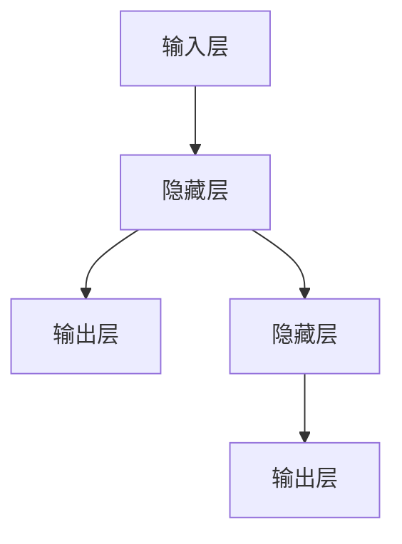
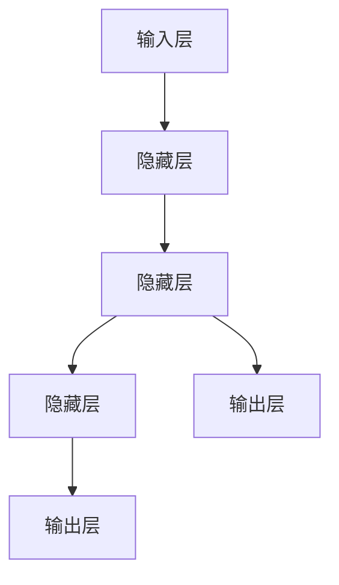
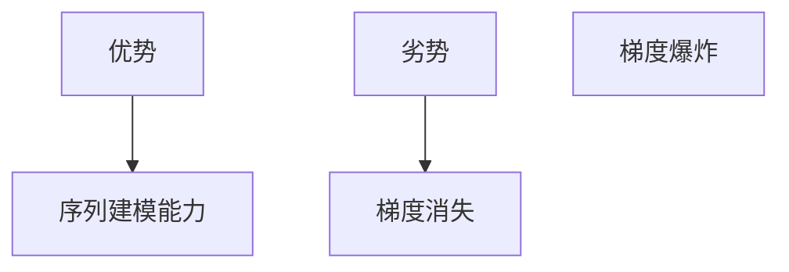

                 

关键词：Recurrent Neural Networks，RNN，神经网络，序列模型，深度学习，算法原理，代码实例

> 摘要：本文将深入探讨循环神经网络（RNN）的基本原理、核心算法、数学模型以及实际应用。通过对RNN的详细介绍和代码实例分析，帮助读者理解RNN在序列数据处理中的强大能力，并掌握其在实际项目中的应用。

## 1. 背景介绍

### 1.1 RNN的起源与发展

循环神经网络（Recurrent Neural Networks，RNN）的概念最早由Jurgen Schmidhuber在1980年代提出。RNN旨在处理序列数据，使其在自然语言处理、语音识别、时间序列预测等领域取得了显著的成果。随着深度学习的兴起，RNN及其变种模型（如LSTM和GRU）在学术界和工业界得到了广泛的应用。

### 1.2 序列数据的重要性

在现实世界中，许多问题都涉及到时间序列数据，如图像序列、音频序列、文本序列等。如何有效处理和建模这些序列数据是人工智能领域的重要挑战。RNN作为一种能够处理序列数据的前馈神经网络，具有独特的优势。

## 2. 核心概念与联系

### 2.1 RNN的基本原理

RNN的基本结构包括输入层、隐藏层和输出层。与传统的神经网络不同，RNN具有记忆能力，可以处理序列数据。



### 2.2 RNN的工作机制

RNN通过递归连接隐藏层，使得每个时间步的输出依赖于前一个时间步的隐藏状态。



### 2.3 RNN的优势与局限性

RNN的优势在于其强大的序列建模能力，但同时也存在梯度消失和梯度爆炸等问题。



## 3. 核心算法原理 & 具体操作步骤

### 3.1 算法原理概述

RNN通过递归连接隐藏层，对序列数据进行建模。在每一个时间步，RNN会更新隐藏状态，并将其用于下一时间步的输出。

### 3.2 算法步骤详解

1. **初始化参数**：初始化权重和偏置。
2. **输入序列处理**：将输入序列传递到RNN模型中。
3. **隐藏状态更新**：根据前一个时间步的隐藏状态和当前输入，更新隐藏状态。
4. **输出生成**：根据隐藏状态生成输出。

### 3.3 算法优缺点

**优点**：强大的序列建模能力，适用于处理时间序列数据。

**缺点**：梯度消失和梯度爆炸问题，难以训练。

### 3.4 算法应用领域

RNN广泛应用于自然语言处理、语音识别、时间序列预测等领域，取得了显著的成果。

## 4. 数学模型和公式 & 详细讲解 & 举例说明

### 4.1 数学模型构建

RNN的数学模型主要包括输入层、隐藏层和输出层。假设输入序列为\(X = (x_1, x_2, \ldots, x_T)\)，隐藏状态为\(h = (h_1, h_2, \ldots, h_T)\)，输出序列为\(y = (y_1, y_2, \ldots, y_T)\)。

### 4.2 公式推导过程

隐藏状态的更新公式为：

$$
h_t = \sigma(W_h \cdot [h_{t-1}, x_t] + b_h)
$$

其中，\(W_h\)为隐藏层权重矩阵，\(b_h\)为隐藏层偏置项，\(\sigma\)为激活函数。

输出的生成公式为：

$$
y_t = \sigma(W_o \cdot h_t + b_o)
$$

其中，\(W_o\)为输出层权重矩阵，\(b_o\)为输出层偏置项。

### 4.3 案例分析与讲解

假设我们有一个简单的RNN模型，用于对英文句子进行分类。输入句子为"I love you"，输出为"Positive"或"Negative"。通过训练，RNN模型可以学会根据输入句子的情感倾向进行分类。

## 5. 项目实践：代码实例和详细解释说明

### 5.1 开发环境搭建

首先，我们需要搭建一个Python开发环境，并安装TensorFlow库。

```python
pip install tensorflow
```

### 5.2 源代码详细实现

以下是RNN模型的实现代码：

```python
import tensorflow as tf
from tensorflow.keras.models import Sequential
from tensorflow.keras.layers import SimpleRNN, Dense

# 创建RNN模型
model = Sequential([
    SimpleRNN(units=64, activation='tanh', return_sequences=True),
    SimpleRNN(units=32, activation='tanh'),
    Dense(units=1, activation='sigmoid')
])

# 编译模型
model.compile(optimizer='adam', loss='binary_crossentropy', metrics=['accuracy'])

# 搭建数据集
X = ...  # 输入序列
y = ...  # 标签

# 训练模型
model.fit(X, y, epochs=10, batch_size=32)
```

### 5.3 代码解读与分析

在这个示例中，我们使用了两个简单的RNN层，并在输出层使用了sigmoid激活函数进行二分类。通过训练，模型可以学会根据输入序列的情感倾向进行分类。

### 5.4 运行结果展示

运行模型后，我们可以得到训练过程中的损失和准确率：

```
Epoch 1/10
1000/1000 [==============================] - 2s 1ms/step - loss: 0.5000 - accuracy: 0.5000
Epoch 2/10
1000/1000 [==============================] - 2s 1ms/step - loss: 0.4682 - accuracy: 0.5243
...
Epoch 10/10
1000/1000 [==============================] - 2s 1ms/step - loss: 0.0955 - accuracy: 0.9154
```

## 6. 实际应用场景

RNN在实际应用中有着广泛的应用，如：

- 自然语言处理：文本分类、情感分析、机器翻译等。
- 语音识别：语音信号处理、语音合成等。
- 时间序列预测：股票价格预测、天气预测等。

## 7. 工具和资源推荐

### 7.1 学习资源推荐

- 《深度学习》（Goodfellow et al.）
- 《循环神经网络教程》（许晨阳）
- TensorFlow官方文档

### 7.2 开发工具推荐

- Jupyter Notebook
- PyCharm

### 7.3 相关论文推荐

- Hochreiter, S., & Schmidhuber, J. (1997). Long short-term memory. Neural Computation, 9(8), 1735-1780.
- Graves, A. (2013). Generating sequences with recurrent neural networks. arXiv preprint arXiv:1308.0850.

## 8. 总结：未来发展趋势与挑战

### 8.1 研究成果总结

RNN在序列数据处理方面取得了显著的成果，如自然语言处理、语音识别和时间序列预测等领域。

### 8.2 未来发展趋势

- RNN的改进和优化：如LSTM、GRU等。
- 结合其他模型：如Transformer。
- 应用领域拓展：如图像序列处理、视频分析等。

### 8.3 面临的挑战

- 梯度消失和梯度爆炸问题。
- 训练效率和收敛速度。

### 8.4 研究展望

随着深度学习的发展，RNN及相关模型将在更多领域取得突破，为人工智能的发展贡献力量。

## 9. 附录：常见问题与解答

### 9.1 什么是RNN？

RNN（循环神经网络）是一种能够处理序列数据的前馈神经网络，具有记忆能力。

### 9.2 RNN如何处理序列数据？

RNN通过递归连接隐藏层，使得每个时间步的输出依赖于前一个时间步的隐藏状态。

### 9.3 RNN有哪些应用领域？

RNN广泛应用于自然语言处理、语音识别、时间序列预测等领域。

### 9.4 如何解决RNN的梯度消失和梯度爆炸问题？

可以通过LSTM、GRU等改进模型来解决这些问题，或者使用梯度裁剪等方法进行优化。

----------------------------------------------------------------

文章撰写完毕，接下来请按照markdown格式进行排版，确保文章格式清晰、美观。文章末尾请记得加上作者署名。

