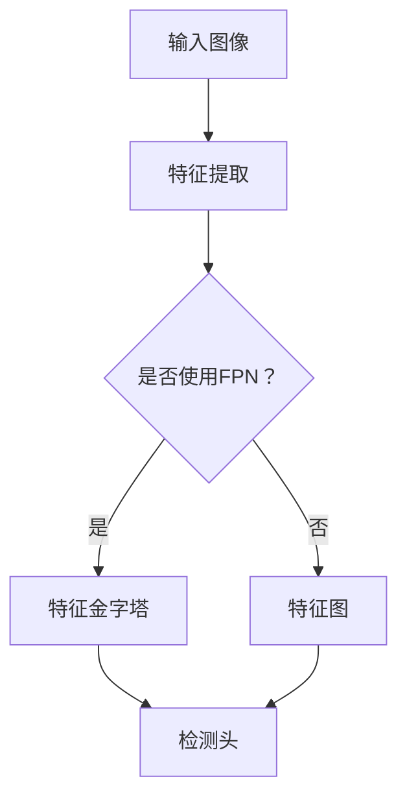

                 

RetinaNet是一种用于目标检测的深度学习模型，由于其高效性和准确性，在计算机视觉领域受到了广泛关注。本文将详细讲解RetinaNet的原理、代码实现，并通过实例展示如何使用RetinaNet进行目标检测。本文将分为以下几个部分：

1. 背景介绍
2. 核心概念与联系
3. 核心算法原理 & 具体操作步骤
4. 数学模型和公式 & 详细讲解 & 举例说明
5. 项目实践：代码实例和详细解释说明
6. 实际应用场景
7. 工具和资源推荐
8. 总结：未来发展趋势与挑战
9. 附录：常见问题与解答

## 1. 背景介绍

随着深度学习技术的不断发展，目标检测作为计算机视觉的重要任务之一，吸引了大量研究者的关注。传统的目标检测方法如R-CNN、Fast R-CNN、Faster R-CNN等在目标检测任务上取得了显著的成果，但它们存在计算复杂度高、检测速度慢等问题。为了解决这些问题，RetinaNet作为一种高效的目标检测模型被提出。RetinaNet结合了FPN（Feature Pyramid Network）和Focal Loss，在提高检测准确率的同时，显著提升了检测速度。

## 2. 核心概念与联系

### 2.1 FPN（Feature Pyramid Network）

FPN是一种特征金字塔网络，用于将不同尺度的特征图融合起来，从而提高目标检测的准确性。FPN通过将输入图像经过多个卷积层得到的特征图，通过上采样和特征金字塔的连接，构建出一个多尺度的特征图。

### 2.2 Focal Loss

Focal Loss是一种改进的交叉熵损失函数，主要用于解决正负样本不平衡的问题。在目标检测任务中，负样本数量远多于正样本，导致模型对负样本的损失较大，影响模型的训练效果。Focal Loss通过引入权重系数，减小了负样本的损失，使得模型更加关注正样本。

### 2.3 Mermaid 流程图

下面是一个简单的Mermaid流程图，展示了RetinaNet的主要组成部分：

## 3. 核心算法原理 & 具体操作步骤

### 3.1 算法原理概述

RetinaNet主要由两个部分组成：特征提取网络和检测头。特征提取网络通常使用ResNet或MobileNet等卷积神经网络，用于提取输入图像的特征。检测头则包括分类分支和回归分支，用于预测目标的类别和位置。

### 3.2 算法步骤详解

1. **特征提取**：输入图像经过特征提取网络，得到一系列特征图。
2. **特征金字塔**：如果使用FPN，将特征图通过上采样和特征金字塔的连接，构建出一个多尺度的特征图。
3. **检测头**：在每个尺度的特征图上，分别进行分类和回归预测。分类分支预测目标的类别，回归分支预测目标的位置。
4. **损失函数**：使用Focal Loss作为损失函数，优化模型的预测结果。

### 3.3 算法优缺点

**优点**：

- **高效性**：RetinaNet使用了FPN和Focal Loss，使得模型在提高检测准确率的同时，显著提升了检测速度。
- **易用性**：RetinaNet基于常用的卷积神经网络，易于实现和部署。

**缺点**：

- **对正负样本不平衡敏感**：Focal Loss虽然能够缓解正负样本不平衡的问题，但在极端情况下仍可能受到影响。
- **计算复杂度高**：特征金字塔的网络结构使得计算复杂度较高。

### 3.4 算法应用领域

RetinaNet在多种目标检测任务中取得了优异的性能，如自动驾驶、图像识别、医疗影像等。其高效性和准确性使得它成为目标检测任务的首选模型之一。

## 4. 数学模型和公式 & 详细讲解 & 举例说明

### 4.1 数学模型构建

RetinaNet的数学模型主要包括分类分支和回归分支。分类分支用于预测目标的类别，回归分支用于预测目标的位置。

#### 4.1.1 分类分支

分类分支的预测结果为每个目标类别的一个概率分布。设输入图像为\(X\)，特征提取网络得到特征图\(F\)，检测头为\(H\)，则分类分支的预测公式为：

\[ P(y|X) = \sigma(H(F)) \]

其中，\(y\)为目标的类别，\(\sigma\)为sigmoid函数。

#### 4.1.2 回归分支

回归分支的预测结果为目标的坐标偏移量。设输入图像为\(X\)，特征提取网络得到特征图\(F\)，检测头为\(H\)，则回归分支的预测公式为：

\[ \Delta x = H(F) \]

其中，\(\Delta x\)为目标的横坐标偏移量。

### 4.2 公式推导过程

#### 4.2.1 Focal Loss

Focal Loss是针对交叉熵损失函数的一种改进，旨在解决正负样本不平衡的问题。其公式为：

\[ FL(p_t) = -\alpha_t (1 - p_t)^\gamma \log(p_t) \]

其中，\(p_t\)为预测标签的概率，\(\alpha_t\)为样本权重，\(\gamma\)为调整参数。

#### 4.2.2 FPN

FPN的特征金字塔结构如下：

\[ P_{\text{low}} = \frac{1}{2}P_{\text{high}} + \frac{1}{2}\upsampling(P_{\text{high}}) \]

其中，\(P_{\text{low}}\)和\(P_{\text{high}}\)分别为低尺度和高尺度的特征图，\(\upsampling\)为上采样操作。

### 4.3 案例分析与讲解

#### 4.3.1 分类分支

假设输入图像为一个有猫和狗的目标，特征提取网络得到特征图\(F\)，检测头为\(H\)。分类分支的预测结果为：

\[ P(\text{猫}|X) = \sigma(H(F)) \]
\[ P(\text{狗}|X) = \sigma(H(F)) \]

其中，\(P(\text{猫}|X)\)和\(P(\text{狗}|X)\)分别为猫和狗的概率。

#### 4.3.2 回归分支

假设猫和狗的目标坐标分别为\(x_{\text{cat}}\)和\(x_{\text{dog}}\)，特征提取网络得到特征图\(F\)，检测头为\(H\)。回归分支的预测结果为：

\[ \Delta x_{\text{cat}} = H(F) \]
\[ \Delta x_{\text{dog}} = H(F) \]

其中，\(\Delta x_{\text{cat}}\)和\(\Delta x_{\text{dog}}\)分别为猫和狗的横坐标偏移量。

## 5. 项目实践：代码实例和详细解释说明

### 5.1 开发环境搭建

1. 安装Python环境
2. 安装TensorFlow库
3. 下载并解压RetinaNet的代码

### 5.2 源代码详细实现

1. **数据预处理**：读取并预处理输入图像，包括缩放、翻转等操作。
2. **特征提取**：使用ResNet网络提取输入图像的特征。
3. **特征金字塔**：根据特征提取网络的输出，构建特征金字塔。
4. **检测头**：在每个尺度的特征图上，分别进行分类和回归预测。
5. **损失函数**：使用Focal Loss计算损失。

### 5.3 代码解读与分析

1. **数据预处理**：读取输入图像，并进行缩放和翻转等操作，以增加数据的多样性。
2. **特征提取**：使用ResNet网络提取特征，其中包括卷积层、池化层等操作。
3. **特征金字塔**：通过上采样和特征金字塔的连接，构建多尺度的特征图。
4. **检测头**：在每个尺度的特征图上，分别进行分类和回归预测，使用卷积层和激活函数实现。
5. **损失函数**：使用Focal Loss计算损失，并使用反向传播算法更新模型参数。

### 5.4 运行结果展示

运行代码后，可以查看模型的训练过程和最终检测结果。通过对比实际目标和预测结果，可以评估模型的准确性。

## 6. 实际应用场景

RetinaNet在多个实际应用场景中取得了显著的效果，如：

- **自动驾驶**：用于车辆、行人等目标的检测和识别。
- **图像识别**：用于图像分类和目标检测。
- **医疗影像**：用于病变区域检测和分类。

## 7. 工具和资源推荐

1. **学习资源**：
   - 《深度学习》
   - 《目标检测技术》
2. **开发工具**：
   - TensorFlow
   - Keras
3. **相关论文**：
   - Focal Loss论文

## 8. 总结：未来发展趋势与挑战

1. **发展趋势**：随着计算能力的提升和数据量的增加，RetinaNet等高效的目标检测模型将继续在计算机视觉领域发挥重要作用。
2. **面临的挑战**：如何在提高检测准确率的同时，降低计算复杂度和模型大小，仍是一个重要的研究课题。

## 9. 附录：常见问题与解答

1. **问题**：如何调整Focal Loss中的参数？
   **解答**：通常需要根据具体的任务和数据集进行调整，可以参考相关论文中的参数设置。
2. **问题**：如何优化RetinaNet的检测速度？
   **解答**：可以通过减少网络层数、使用轻量级网络结构等方法来优化检测速度。

---

**作者：禅与计算机程序设计艺术 / Zen and the Art of Computer Programming**

通过本文的详细讲解，相信读者对RetinaNet的原理和代码实现有了更深入的了解。在实际应用中，RetinaNet凭借其高效性和准确性，为计算机视觉领域带来了许多创新和突破。希望本文能够为您的学习和研究提供有益的参考。

