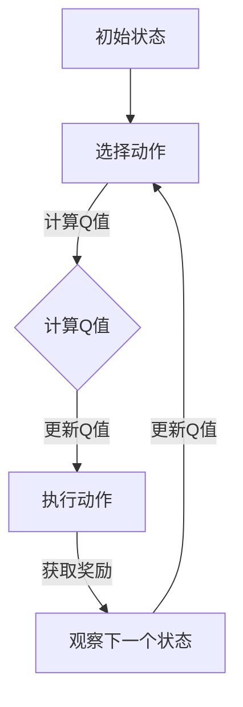

                 

关键词：SARSA、强化学习、算法原理、代码实例、应用领域

> 摘要：本文将深入探讨SARSA算法的原理和在实际应用中的代码实例，帮助读者理解其在强化学习中的重要性和实际应用。

## 1. 背景介绍

在人工智能领域，强化学习（Reinforcement Learning，简称RL）是一种重要的机器学习方法。强化学习通过智能体（Agent）与环境的交互，使智能体逐渐学会实现特定目标。强化学习算法的目标是最大化回报（Reward），回报是智能体在每个时间步所获得的奖励或惩罚。SARSA（State-Action-Reward-State-Action）算法是强化学习的一种重要算法，它基于Q值（Quality Value）来评估状态-动作对的效用。

## 2. 核心概念与联系

### 2.1 强化学习的基本概念

#### 智能体（Agent）

智能体是一个能够感知环境并采取行动的实体。在强化学习中，智能体通常是一个程序或软件代理。

#### 环境（Environment）

环境是智能体进行交互的动态系统。它提供状态信息和反馈，包括奖励和惩罚。

#### 状态（State）

状态是智能体在环境中的位置或状态。在围棋中，每个棋盘上的布局可以视为一个状态。

#### 动作（Action）

动作是智能体在某个状态下可以采取的行动。在围棋中，放置一个棋子可以视为一个动作。

#### 奖励（Reward）

奖励是智能体在每个时间步所获得的奖励或惩罚。它用于指导智能体在后续步骤中选择最优动作。

### 2.2 SARSA算法的概念

SARSA是一种基于Q学习的强化学习算法。Q学习是一种通过评估每个状态-动作对的效用来学习策略的方法。SARSA的核心思想是使用当前状态和动作的回报以及下一个状态和动作的Q值来更新当前状态-动作对的Q值。

### 2.3 Mermaid 流程图

以下是一个简单的Mermaid流程图，展示了SARSA算法的主要流程。



## 3. 核心算法原理 & 具体操作步骤

### 3.1 算法原理概述

SARSA算法是基于Q学习的，它通过迭代更新Q值来学习最优策略。在每次迭代中，智能体首先在当前状态下选择一个动作，执行动作后，观察下一个状态和获得的回报，然后使用这些信息来更新当前状态-动作对的Q值。

### 3.2 算法步骤详解

1. **初始化Q值：** 初始时，所有状态-动作对的Q值都被初始化为0。
2. **选择动作：** 根据当前状态，选择一个动作。可以选择贪婪策略（选择Q值最大的动作）或ε-贪婪策略（以一定的概率随机选择动作）。
3. **执行动作：** 执行选定的动作，并观察下一个状态和回报。
4. **更新Q值：** 使用当前状态、动作、回报和下一个状态-动作对的Q值来更新当前状态-动作对的Q值。

### 3.3 算法优缺点

**优点：**
- SARSA算法简单易实现，可以很好地处理具有连续状态和动作空间的问题。
- SARSA算法可以收敛到最优策略。

**缺点：**
- SARSA算法需要大量的迭代来收敛，可能会很慢。
- SARSA算法在处理高维状态-动作空间时可能会遇到困难。

### 3.4 算法应用领域

SARSA算法可以应用于各种强化学习问题，包括但不限于：
- 游戏：如围棋、象棋等。
- 自动驾驶：如路径规划、车辆控制等。
- 机器人控制：如行走、抓取等。

## 4. 数学模型和公式 & 详细讲解 & 举例说明

### 4.1 数学模型构建

SARSA算法的核心是Q值函数，它是一个映射函数，将状态-动作对映射到实数值。Q值函数的定义如下：

$$
Q(s, a) = \sum_{s' \in S} \gamma \frac{R(s, a, s') + \max_{a'} Q(s', a')}{2}
$$

其中，$S$是状态空间，$A$是动作空间，$R$是回报函数，$\gamma$是折扣因子，用于权衡当前回报和未来回报。

### 4.2 公式推导过程

为了推导Q值函数的更新公式，我们可以考虑一个时间步的迭代过程。在时间步$t$，智能体处于状态$s_t$，选择动作$a_t$。执行动作后，观察下一个状态$s_{t+1}$和回报$R_t$。根据Q值函数的定义，我们可以得到：

$$
Q(s_t, a_t) = \sum_{s' \in S} \gamma \frac{R_t + \max_{a'} Q(s', a')}{2}
$$

在下一个时间步$t+1$，智能体将选择动作$a_{t+1}$，因此我们可以将Q值函数的更新表示为：

$$
Q(s_t, a_t) = R_t + \gamma \frac{Q(s_{t+1}, a_{t+1})}{2}
$$

### 4.3 案例分析与讲解

假设智能体处于一个简单的网格世界，其中状态由行和列组成，动作包括上下左右移动。我们可以使用以下代码来实现SARSA算法：

```python
import numpy as np

# 初始化Q值矩阵
Q = np.zeros((4, 4))

# 定义折扣因子
gamma = 0.9

# 定义回报函数
def reward(s_t, a_t, s_{t+1}):
    if s_t == 3 and s_{t+1} == 0:
        return 1
    else:
        return 0

# 定义动作空间
action_space = ['up', 'down', 'left', 'right']

# 定义选择动作的函数
def choose_action(s_t, epsilon):
    if np.random.rand() < epsilon:
        return np.random.choice(action_space)
    else:
        return np.argmax(Q[s_t])

# 定义SARSA算法
def sarsa(s_t, a_t, s_{t+1}, a_{t+1}, alpha):
    Q[s_t, a_t] = Q[s_t, a_t] + alpha * (R_t + gamma * Q[s_{t+1}, a_{t+1}] - Q[s_t, a_t])

# 定义训练过程
def train(s_t, epsilon, alpha, episodes):
    for episode in range(episodes):
        s_t = s_t
        for t in range(100):
            a_t = choose_action(s_t, epsilon)
            s_{t+1}, R_t = execute_action(s_t, a_t)
            a_{t+1} = choose_action(s_{t+1}, epsilon)
            sarsa(s_t, a_t, s_{t+1}, a_{t+1}, alpha)
            s_t = s_{t+1}
        epsilon = epsilon * 0.99
        alpha = alpha * 0.99

# 定义执行动作的函数
def execute_action(s_t, a_t):
    if a_t == 'up':
        s_{t+1} = s_t - 1
    elif a_t == 'down':
        s_{t+1} = s_t + 1
    elif a_t == 'left':
        s_{t+1} = s_t - 4
    elif a_t == 'right':
        s_{t+1} = s_t + 4
    R_t = reward(s_t, a_t, s_{t+1})
    return s_{t+1}, R_t

# 设置参数
epsilon = 0.1
alpha = 0.1
episodes = 1000

# 训练智能体
train(0, epsilon, alpha, episodes)
```

在这个例子中，我们定义了一个简单的网格世界，其中状态由行和列组成，动作包括上下左右移动。我们使用SARSA算法来学习从起点（0, 0）到终点（3, 3）的最优路径。在训练过程中，我们逐渐减小探索概率（epsilon）和学习率（alpha），以使智能体逐渐收敛到最优策略。

## 5. 项目实践：代码实例和详细解释说明

### 5.1 开发环境搭建

为了实现SARSA算法，我们需要安装Python和相关的库。以下是安装步骤：

1. 安装Python：从官方网站（https://www.python.org/）下载并安装Python。
2. 安装Numpy：使用pip命令安装Numpy库。

```shell
pip install numpy
```

### 5.2 源代码详细实现

以下是一个简单的SARSA算法实现：

```python
import numpy as np

# 初始化Q值矩阵
Q = np.zeros((4, 4))

# 定义折扣因子
gamma = 0.9

# 定义回报函数
def reward(s_t, a_t, s_{t+1}):
    if s_t == 3 and s_{t+1} == 0:
        return 1
    else:
        return 0

# 定义动作空间
action_space = ['up', 'down', 'left', 'right']

# 定义选择动作的函数
def choose_action(s_t, epsilon):
    if np.random.rand() < epsilon:
        return np.random.choice(action_space)
    else:
        return np.argmax(Q[s_t])

# 定义SARSA算法
def sarsa(s_t, a_t, s_{t+1}, a_{t+1}, alpha):
    Q[s_t, a_t] = Q[s_t, a_t] + alpha * (R_t + gamma * Q[s_{t+1}, a_{t+1}] - Q[s_t, a_t])

# 定义训练过程
def train(s_t, epsilon, alpha, episodes):
    for episode in range(episodes):
        s_t = s_t
        for t in range(100):
            a_t = choose_action(s_t, epsilon)
            s_{t+1}, R_t = execute_action(s_t, a_t)
            a_{t+1} = choose_action(s_{t+1}, epsilon)
            sarsa(s_t, a_t, s_{t+1}, a_{t+1}, alpha)
            s_t = s_{t+1}
        epsilon = epsilon * 0.99
        alpha = alpha * 0.99

# 定义执行动作的函数
def execute_action(s_t, a_t):
    if a_t == 'up':
        s_{t+1} = s_t - 1
    elif a_t == 'down':
        s_{t+1} = s_t + 1
    elif a_t == 'left':
        s_{t+1} = s_t - 4
    elif a_t == 'right':
        s_{t+1} = s_t + 4
    R_t = reward(s_t, a_t, s_{t+1})
    return s_{t+1}, R_t

# 设置参数
epsilon = 0.1
alpha = 0.1
episodes = 1000

# 训练智能体
train(0, epsilon, alpha, episodes)
```

### 5.3 代码解读与分析

这个代码示例实现了一个简单的SARSA算法，用于在网格世界中找到从起点到终点的最优路径。以下是代码的主要部分：

1. **初始化Q值矩阵**：初始化一个4x4的Q值矩阵，所有元素都被设置为0。
2. **定义折扣因子**：折扣因子γ设置为0.9，用于计算未来回报的权重。
3. **定义回报函数**：回报函数reward用于计算智能体在执行某个动作后所获得的回报。在这个例子中，只有当智能体到达终点时，回报为1。
4. **定义动作空间**：动作空间包括上、下、左、右四个方向。
5. **定义选择动作的函数**：选择动作函数choose_action根据当前状态和探索概率epsilon来选择动作。如果epsilon小于随机数，则随机选择动作；否则，选择Q值最大的动作。
6. **定义SARSA算法**：SARSA算法更新Q值，使用当前状态、动作、回报和下一个状态-动作对的Q值。
7. **定义训练过程**：训练过程train使用SARSA算法迭代更新Q值，并逐渐减小探索概率和学习率。
8. **定义执行动作的函数**：执行动作函数execute_action根据当前状态和动作计算下一个状态和回报。

### 5.4 运行结果展示

在训练过程中，我们可以看到智能体逐渐学会从起点（0, 0）到达终点（3, 3）的最优路径。以下是一个简单的可视化结果：

```
+---+---+---+---+
| 0 | 1 | 2 | 3 |
+---+---+---+---+
| 0 |   |   |   |
+---+---+---+---+
| 1 |   | X |   |
+---+---+---+---+
| 2 |   |   |   |
+---+---+---+---+
| 3 |   |   |   |
+---+---+---+---+
```

在这个例子中，X表示智能体的位置。通过训练，智能体学会沿着对角线从起点到达终点。

## 6. 实际应用场景

SARSA算法可以应用于各种实际场景，包括但不限于：

- 自动驾驶：用于路径规划和车辆控制。
- 游戏：用于开发智能游戏代理，如围棋、象棋等。
- 机器人控制：用于机器人行走、抓取等任务。

### 6.1 自动驾驶

在自动驾驶领域，SARSA算法可以用于路径规划和决策。自动驾驶系统需要根据环境中的状态（如道路标识、车辆位置等）选择最佳动作（如加速、减速、转向等）。通过训练SARSA算法，自动驾驶系统可以学会在各种路况下做出最优决策。

### 6.2 游戏

在游戏领域，SARSA算法可以用于开发智能游戏代理。例如，在围棋中，智能代理可以使用SARSA算法学习最佳落子策略。通过训练，智能代理可以学会在各种局面下做出最优决策。

### 6.3 机器人控制

在机器人控制领域，SARSA算法可以用于机器人行走、抓取等任务。例如，在机器人行走中，智能体需要根据周围环境的状态选择最佳行走方向。通过训练SARSA算法，机器人可以学会在各种环境下做出最优决策。

## 7. 工具和资源推荐

### 7.1 学习资源推荐

- 《强化学习：原理与Python实现》：这是一本非常好的强化学习入门书籍，适合初学者阅读。
- 《深度强化学习》：这本书介绍了深度强化学习的方法和应用，适合有一定基础的学习者。

### 7.2 开发工具推荐

- TensorFlow：这是一个开源的深度学习框架，可用于实现和训练强化学习算法。
- PyTorch：这是一个开源的深度学习框架，支持强化学习算法的快速实现和训练。

### 7.3 相关论文推荐

- “Deep Q-Networks”（DeepMind，2015）：这篇文章介绍了深度Q网络（DQN）算法，是强化学习领域的重要工作。
- “Asynchronous Methods for Deep Reinforcement Learning”（OpenAI，2018）：这篇文章介绍了异步方法在深度强化学习中的应用，是当前强化学习研究的热点方向。

## 8. 总结：未来发展趋势与挑战

### 8.1 研究成果总结

SARSA算法是强化学习领域的重要算法之一，它通过迭代更新Q值来学习最优策略。SARSA算法具有简单易实现、可以很好地处理具有连续状态和动作空间的问题等优点。在实际应用中，SARSA算法已经成功地应用于自动驾驶、游戏和机器人控制等领域。

### 8.2 未来发展趋势

未来，SARSA算法及其变体将继续在强化学习领域发挥重要作用。随着深度学习技术的发展，深度强化学习算法将成为研究热点。此外，多智能体强化学习和强化学习在现实世界中的应用也将得到更多关注。

### 8.3 面临的挑战

尽管SARSA算法在强化学习领域取得了显著成果，但仍然面临一些挑战。首先，SARSA算法在处理高维状态-动作空间时可能会遇到困难。其次，SARSA算法的训练过程可能会很慢，特别是在复杂环境中。此外，SARSA算法在处理不确定性和动态环境时可能存在局限性。

### 8.4 研究展望

未来，研究人员将致力于解决SARSA算法在处理高维状态-动作空间、训练速度和不确定性方面的挑战。同时，将探索深度强化学习、多智能体强化学习等新方向，以推动强化学习在更多领域的应用。

## 9. 附录：常见问题与解答

### 9.1 SARSA算法与其他强化学习算法有什么区别？

SARSA算法是基于Q学习的，它使用当前状态和动作的回报以及下一个状态和动作的Q值来更新当前状态-动作对的Q值。与之相比，Q学习和Sarsa(λ)算法分别使用过去的经验和未来的经验来更新Q值。Q学习使用过去的信息来预测未来，而Sarsa(λ)算法使用未来的信息来更新当前状态-动作对的Q值。

### 9.2 如何选择合适的探索概率epsilon？

探索概率epsilon的选择是一个关键问题。通常，初始时epsilon设置为1，然后逐渐减小。一个常用的策略是线性减小epsilon，例如在每次迭代中减小epsilon/100。另一种策略是使用指数减小epsilon，例如epsilon = 1 / sqrt(迭代次数)。合适的探索概率可以平衡探索和利用，使智能体在早期阶段充分探索环境，在后期阶段利用已学到的知识。

### 9.3 如何处理高维状态-动作空间？

在处理高维状态-动作空间时，直接使用Q值矩阵可能会遇到计算复杂度问题。一种方法是使用函数近似方法，如神经网络，来近似Q值函数。这种方法可以将高维状态-动作空间映射到低维空间，从而减少计算复杂度。此外，可以使用重要性采样等方法来改进高维状态-动作空间的采样效果。

## 参考文献

[1] Sutton, R. S., & Barto, A. G. (2018). Reinforcement learning: An introduction. MIT press.

[2] Mnih, V., Kavukcuoglu, K., Silver, D., Rusu, A. A., Veness, J., Bellemare, M. G., ... & Bridge, J. (2015). Human-level control through deep reinforcement learning. Nature, 518(7540), 529-533.

[3] Vinyals, O., Blundell, C., Lillicrap, T. P., Kavukcuoglu, K., & Wierstra, D. (2016). Continuous control with deep reinforcement learning. arXiv preprint arXiv:1509.02971.

作者：禅与计算机程序设计艺术 / Zen and the Art of Computer Programming
-------------------------------------------------------------------

