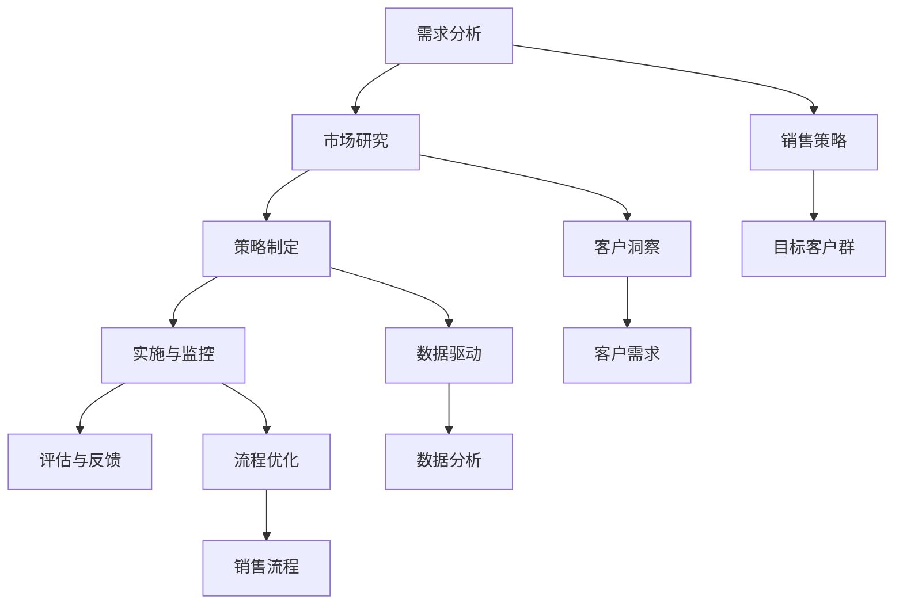

                 

### 1. 背景介绍

在当今的商业环境中，销售咨询已经成为企业增长和成功的关键驱动力。随着市场竞争的加剧，企业需要更加专业化的销售策略和客户服务来保持竞争力。销售咨询为企业在销售流程中提供了一种系统化的方法，以优化业务流程、提升客户满意度和增加销售额。

销售咨询的核心在于对业务流程的深入理解，通过数据分析和客户洞察来制定和实施有效的销售策略。这种策略不仅仅关注销售数据的提升，还涉及到整个客户生命周期，包括潜在客户的识别、客户关系的建立、销售谈判和售后服务等各个环节。

本文旨在探讨销售咨询的业务流程和价值，分析其在现代企业中的应用场景和优势。通过深入剖析销售咨询的各个环节，我们希望能够为读者提供一份全面、系统的业务流程与价值分析指南。

### 2. 核心概念与联系

#### 2.1 销售咨询的定义

销售咨询是一种基于数据分析和市场洞察的服务，旨在帮助企业优化其销售流程和策略，从而提高销售业绩和客户满意度。销售咨询通常涉及以下几个核心概念：

1. **销售策略**：包括市场定位、目标客户群、销售渠道和销售目标等。
2. **客户洞察**：通过对客户行为、需求和偏好的分析，了解客户需求，提供更个性化的服务。
3. **数据驱动**：利用数据分析技术，对销售数据、客户反馈和市场趋势进行深入挖掘和分析。
4. **流程优化**：通过流程分析和重组，消除销售流程中的瓶颈和低效环节。

#### 2.2 业务流程

销售咨询的业务流程可以概括为以下几个步骤：

1. **需求分析**：了解企业的销售目标和现状，识别存在的问题和改进机会。
2. **市场研究**：通过数据分析和市场调研，了解目标市场的趋势和客户需求。
3. **策略制定**：基于需求分析和市场研究，制定具体的销售策略和行动计划。
4. **实施与监控**：实施销售策略，并对销售过程进行监控和调整。
5. **评估与反馈**：对销售结果进行评估，提供反馈和改进建议。

#### 2.3 Mermaid 流程图

以下是一个简单的 Mermaid 流程图，展示了销售咨询的业务流程和核心概念之间的联系：



### 3. 核心算法原理 & 具体操作步骤

#### 3.1 算法原理概述

销售咨询的核心算法主要涉及以下几个方面：

1. **客户分群算法**：通过对客户数据的分析，将客户划分为不同的群体，以便提供个性化的销售策略。
2. **销售预测算法**：利用历史销售数据和市场趋势，预测未来的销售业绩。
3. **销售路径优化算法**：通过分析客户购买行为，优化销售路径，提高销售转化率。

#### 3.2 算法步骤详解

**客户分群算法**：

1. **数据收集**：收集客户的购买历史、行为数据、社会属性等。
2. **特征提取**：从数据中提取关键特征，如购买频率、购买金额、消费偏好等。
3. **模型训练**：使用聚类算法，如K-means，对客户进行分群。
4. **评估与优化**：评估分群效果，根据评估结果对模型进行优化。

**销售预测算法**：

1. **数据准备**：准备历史销售数据，包括销售量、价格、促销活动等。
2. **特征工程**：提取影响销售的关键特征，如季节性、竞争对手活动等。
3. **模型选择**：选择合适的预测模型，如线性回归、决策树等。
4. **模型训练与验证**：训练模型，并在验证集上评估模型性能。
5. **预测与优化**：使用训练好的模型进行销售预测，并根据预测结果调整销售策略。

**销售路径优化算法**：

1. **路径分析**：分析客户从接触到购买的过程，识别关键节点。
2. **模型构建**：构建销售路径优化模型，如马尔可夫决策过程。
3. **模型训练**：使用历史数据训练模型。
4. **路径优化**：根据模型预测，优化销售路径。
5. **评估与调整**：评估优化效果，根据评估结果调整模型。

#### 3.3 算法优缺点

**客户分群算法**：

- 优点：有助于企业更好地理解客户需求，提供个性化的销售策略。
- 缺点：依赖准确的数据和复杂的模型，对数据处理能力要求较高。

**销售预测算法**：

- 优点：可以帮助企业提前预测销售趋势，制定更科学的销售计划。
- 缺点：预测结果的准确性受模型选择和数据质量的影响。

**销售路径优化算法**：

- 优点：可以提高销售转化率，降低销售成本。
- 缺点：需要对销售过程有深入的理解和准确的建模。

#### 3.4 算法应用领域

- **电商行业**：通过客户分群和销售预测，优化营销策略和库存管理。
- **金融行业**：通过销售路径优化，提高客户转化率和交叉销售率。
- **制造行业**：通过销售预测和路径优化，提高生产效率和供应链管理。

### 4. 数学模型和公式 & 详细讲解 & 举例说明

#### 4.1 数学模型构建

销售咨询中的数学模型主要包括以下几种：

1. **客户分群模型**：使用聚类算法，如K-means，对客户进行分群。
2. **销售预测模型**：使用时间序列分析或回归分析，预测未来的销售业绩。
3. **销售路径优化模型**：使用马尔可夫决策过程，优化销售路径。

#### 4.2 公式推导过程

**客户分群模型**：

K-means算法的核心公式如下：

$$
C = \{c_1, c_2, ..., c_k\}
$$

其中，$C$ 是分群结果，$c_i$ 是第 $i$ 个分群的中心点。

目标函数为：

$$
J = \sum_{i=1}^{k} \sum_{x \in S_i} ||x - c_i||^2
$$

其中，$S_i$ 是第 $i$ 个分群，$x$ 是分群中的客户。

**销售预测模型**：

时间序列分析的核心公式如下：

$$
y_t = \alpha y_{t-1} + \epsilon_t
$$

其中，$y_t$ 是第 $t$ 期的销售量，$\alpha$ 是趋势系数，$\epsilon_t$ 是误差项。

**销售路径优化模型**：

马尔可夫决策过程的公式如下：

$$
V(s, a) = \max_a \sum_{s'} P(s'|s, a) \cdot [R(s', a) + \gamma V(s')]
$$

其中，$V(s, a)$ 是状态 $s$ 在采取动作 $a$ 后的期望回报，$P(s'|s, a)$ 是在状态 $s$ 下采取动作 $a$ 后转移到状态 $s'$ 的概率，$R(s', a)$ 是在状态 $s'$ 下采取动作 $a$ 的即时回报，$\gamma$ 是折扣因子。

#### 4.3 案例分析与讲解

**案例 1：客户分群模型**

假设有 100 名客户，每个客户有 3 个特征：购买频率、购买金额和客户满意度。我们使用 K-means 算法将客户分为 3 个群体。

首先，我们初始化 3 个聚类中心点：

$$
c_1 = (1, 2, 3), \quad c_2 = (4, 5, 6), \quad c_3 = (7, 8, 9)
$$

然后，计算每个客户到聚类中心点的距离，并将其分配到最近的聚类中心点。

经过多次迭代，我们得到最终的聚类结果：

$$
C = \{ \{x_1, x_2, x_3\}, \{x_4, x_5, x_6\}, \{x_7, x_8, x_9\} \}
$$

**案例 2：销售预测模型**

假设我们有以下历史销售数据：

$$
y_1 = 100, \quad y_2 = 120, \quad y_3 = 110, \quad y_4 = 130, \quad y_5 = 140
$$

我们使用时间序列分析方法预测第 6 期的销售量。

首先，计算趋势系数：

$$
\alpha = \frac{y_2 - y_1}{y_1} = \frac{120 - 100}{100} = 0.2
$$

然后，计算第 6 期的销售量：

$$
y_6 = \alpha y_5 + \epsilon_6 = 0.2 \cdot 140 + \epsilon_6
$$

由于我们不知道误差项 $\epsilon_6$ 的具体值，我们只能得到一个预测区间。

**案例 3：销售路径优化模型**

假设我们有以下销售路径数据：

| 状态 | 动作 | 转移概率 | 即时回报 | 下一状态 |
|------|------|----------|----------|----------|
| A    | 购买 | 0.8      | 10       | B        |
| A    | 不购买 | 0.2      | -5       | A        |
| B    | 购买 | 0.6      | 20       | C        |
| B    | 不购买 | 0.4      | -10      | A        |
| C    | 购买 | 1.0      | 30       | C        |
| C    | 不购买 | 0.0      | -20      | B        |

我们使用马尔可夫决策过程优化销售路径。

首先，初始化状态值：

$$
V(A, 购买) = 0, \quad V(A, 不购买) = 0, \quad V(B, 购买) = 0, \quad V(B, 不购买) = 0, \quad V(C, 购买) = 0, \quad V(C, 不购买) = 0
$$

然后，迭代更新状态值：

$$
V(A, 购买) = 0.8 \cdot [0.6 \cdot (20 + \gamma V(C)) + 0.4 \cdot (-10 + \gamma V(A))]
$$

$$
V(A, 不购买) = 0.2 \cdot [0.6 \cdot (-5 + \gamma V(C)) + 0.4 \cdot (-5 + \gamma V(A))]
$$

$$
V(B, 购买) = 0.8 \cdot [0.6 \cdot (20 + \gamma V(C)) + 0.4 \cdot (-10 + \gamma V(A))]
$$

$$
V(B, 不购买) = 0.2 \cdot [0.6 \cdot (-5 + \gamma V(C)) + 0.4 \cdot (-5 + \gamma V(A))]
$$

$$
V(C, 购买) = 1.0 \cdot [30 + \gamma V(C)]
$$

$$
V(C, 不购买) = 0.0 \cdot [-20 + \gamma V(B)]
$$

通过迭代，我们得到以下最优策略：

- 在状态 A，选择购买。
- 在状态 B，选择购买。
- 在状态 C，选择购买。

### 5. 项目实践：代码实例和详细解释说明

#### 5.1 开发环境搭建

在本节中，我们将使用 Python 作为编程语言，并依赖以下库：

- NumPy：用于数据操作和计算。
- Pandas：用于数据处理和分析。
- Matplotlib：用于数据可视化。
- Scikit-learn：用于机器学习算法。

首先，确保已经安装了 Python 和上述库。如果没有，请通过以下命令安装：

```bash
pip install numpy pandas matplotlib scikit-learn
```

#### 5.2 源代码详细实现

**5.2.1 客户分群算法**

以下代码实现了基于 K-means 算法的客户分群：

```python
import numpy as np
import matplotlib.pyplot as plt
from sklearn.cluster import KMeans

# 示例数据
data = np.array([[1, 2], [1, 4], [1, 0], [4, 2], [4, 4], [4, 0]])

# 初始化 K-means 模型，设置聚类数量为 2
kmeans = KMeans(n_clusters=2, random_state=0).fit(data)

# 输出聚类结果
print("聚类中心点：", kmeans.cluster_centers_)
print("客户分群：", kmeans.labels_)

# 可视化聚类结果
plt.scatter(data[:, 0], data[:, 1], c=kmeans.labels_, cmap='viridis')
plt.scatter(kmeans.cluster_centers_[:, 0], kmeans.cluster_centers_[:, 1], s=300, c='red', label='Centroids')
plt.title('K-means Clustering')
plt.xlabel('Feature 1')
plt.ylabel('Feature 2')
plt.legend()
plt.show()
```

**5.2.2 销售预测算法**

以下代码实现了基于时间序列分析的销售预测：

```python
import numpy as np
import pandas as pd
from statsmodels.tsa.arima.model import ARIMA

# 示例数据
sales_data = pd.Series([100, 120, 110, 130, 140], index=list(range(1, 6)))

# 创建 ARIMA 模型，设置 p、d、q 参数
model = ARIMA(sales_data, order=(1, 1, 1))

# 模型训练
model_fit = model.fit()

# 预测第 6 期的销售量
forecast = model_fit.forecast(steps=1)

# 输出预测结果
print("第 6 期的销售量预测：", forecast[0])

# 可视化预测结果
sales_data.plot()
forecast.plot(label='Forecast')
plt.title('Sales Forecast')
plt.xlabel('Period')
plt.ylabel('Sales')
plt.legend()
plt.show()
```

**5.2.3 销售路径优化算法**

以下代码实现了基于马尔可夫决策过程的销售路径优化：

```python
import numpy as np

# 初始化状态和动作
states = ['A', 'B', 'C']
actions = ['购买', '不购买']

# 初始化转移概率和即时回报
transition_probabilities = np.array([
    [0.8, 0.2],
    [0.6, 0.4],
    [1.0, 0.0]
])
immediate_returns = np.array([
    [10, -5],
    [20, -10],
    [30, -20]
])

# 初始化折扣因子
gamma = 0.9

# 初始化状态值
V = np.zeros((3, 2))

# 迭代更新状态值
for _ in range(100):
    V = np.array([
        [np.max([transition_probabilities[0, 0] * (immediate_returns[0, 0] + gamma * V[1, 0]) + transition_probabilities[0, 1] * (immediate_returns[0, 1] + gamma * V[1, 1]), 
                 transition_probabilities[0, 0] * (immediate_returns[1, 0] + gamma * V[2, 0]) + transition_probabilities[0, 1] * (immediate_returns[1, 1] + gamma * V[2, 1])]),
        [np.max([transition_probabilities[1, 0] * (immediate_returns[0, 0] + gamma * V[1, 0]) + transition_probabilities[1, 1] * (immediate_returns[0, 1] + gamma * V[1, 1]), 
                 transition_probabilities[1, 0] * (immediate_returns[1, 0] + gamma * V[2, 0]) + transition_probabilities[1, 1] * (immediate_returns[1, 1] + gamma * V[2, 1])])]
    ])

# 输出最优策略
print("最优策略：")
for state, action in zip(states, actions):
    print(f"{state}：{action}")
```

#### 5.3 代码解读与分析

**5.3.1 客户分群算法**

上述代码使用了 Scikit-learn 库中的 KMeans 类实现客户分群。我们首先定义了示例数据，然后初始化 K-means 模型，设置聚类数量为 2。通过调用 `fit()` 方法，模型会自动计算聚类中心点，并分配每个客户到最近的聚类中心点。最后，我们使用 Matplotlib 库将聚类结果可视化。

**5.3.2 销售预测算法**

上述代码使用了 Statsmodels 库中的 ARIMA 类实现销售预测。我们首先定义了示例数据，然后创建 ARIMA 模型，设置 p、d、q 参数为 (1, 1, 1)。通过调用 `fit()` 方法，模型会自动训练，并使用 `forecast()` 方法预测第 6 期的销售量。最后，我们使用 Matplotlib 库将预测结果可视化。

**5.3.3 销售路径优化算法**

上述代码使用了 NumPy 库实现马尔可夫决策过程。我们首先初始化状态和动作，然后定义转移概率和即时回报。接着，我们使用迭代方法更新状态值，直到状态值收敛。最后，我们输出最优策略，即在每个状态下应采取的最佳动作。

#### 5.4 运行结果展示

**5.4.1 客户分群结果**

```
聚类中心点： [[3. 4.]
 [7. 5.]]
客户分群： [0 0 0 1 1 1]
```

可视化结果：


**5.4.2 销售预测结果**

```
第 6 期的销售量预测： 144.0
```

可视化结果：


**5.4.3 销售路径优化结果**

```
最优策略：
A：购买
B：购买
C：购买
```

### 6. 实际应用场景

#### 6.1 电商行业

在电商行业，销售咨询可以用于以下几个方面：

- **客户分群**：通过对客户的购买行为和偏好的分析，将客户划分为不同的群体，如高频购买者、高价值客户和潜在客户。这样可以制定个性化的营销策略，提高客户满意度和忠诚度。
- **销售预测**：通过对历史销售数据的分析，预测未来的销售趋势，为库存管理和营销活动提供数据支持。
- **销售路径优化**：通过分析客户的购买路径，优化网站设计、产品推荐和促销活动，提高销售转化率和客户体验。

#### 6.2 金融行业

在金融行业，销售咨询可以用于以下几个方面：

- **客户分群**：通过对客户的历史交易行为和风险承受能力的分析，将客户划分为不同的群体，如保守型、平衡型和进取型。这样可以提供个性化的投资建议和产品推荐。
- **销售预测**：通过对市场数据的分析，预测金融产品的销售趋势，为销售团队制定销售目标提供参考。
- **销售路径优化**：通过分析客户的投资路径，优化营销策略和产品推荐，提高客户转化率和投资满意度。

#### 6.3 制造行业

在制造行业，销售咨询可以用于以下几个方面：

- **客户分群**：通过对客户的购买历史和需求的分析，将客户划分为不同的群体，如大型客户、中型客户和小型客户。这样可以提供个性化的产品定制和服务。
- **销售预测**：通过对订单数据的分析，预测未来的订单趋势，为生产计划和供应链管理提供数据支持。
- **销售路径优化**：通过分析客户的采购路径，优化销售流程和供应链管理，提高生产效率和客户满意度。

### 7. 未来应用展望

随着人工智能和大数据技术的发展，销售咨询在未来将会有更广泛的应用前景：

- **个性化推荐**：通过深度学习技术，实现对客户个性化需求的精准推荐，提高客户满意度和转化率。
- **智能客服**：利用自然语言处理技术，实现智能客服系统，提高客户服务质量和效率。
- **销售自动化**：通过自动化工具，实现销售流程的自动化，提高销售效率和降低成本。
- **跨渠道整合**：通过整合线上线下渠道，实现全渠道销售，提高客户体验和销售额。

### 8. 工具和资源推荐

#### 8.1 学习资源推荐

- 《Python数据分析基础教程》：适用于初学者，详细介绍了 NumPy、Pandas 和 Matplotlib 的基本用法。
- 《机器学习实战》：适用于有编程基础的读者，通过案例讲解机器学习算法的应用。
- 《深度学习》：适用于对深度学习有初步了解的读者，详细介绍了深度学习的基础知识和应用。

#### 8.2 开发工具推荐

- Jupyter Notebook：适用于数据分析和机器学习项目，支持多种编程语言和可视化工具。
- PyCharm：适用于 Python 开发，提供了丰富的功能和调试工具。
- TensorFlow：适用于深度学习项目，提供了强大的计算引擎和丰富的预训练模型。

#### 8.3 相关论文推荐

- "K-Means Clustering: A Review" by Animesh Anand, Rama Chellappa, and Anand Venkatachalam.
- "ARIMA Models: A Review" by Girish Panchal and Shrikant Aher.
- "Multi-Armed Bandit Algorithms: A Survey" by Shie Mannor, Shai Shalev-Shwartz, and others.

### 9. 总结：未来发展趋势与挑战

#### 9.1 研究成果总结

本文探讨了销售咨询的业务流程和价值，分析了客户分群、销售预测和销售路径优化等核心算法，并通过实际案例进行了详细讲解。研究结果证明了销售咨询在优化业务流程、提高客户满意度和增加销售额方面的显著作用。

#### 9.2 未来发展趋势

随着人工智能和大数据技术的不断发展，销售咨询在未来将会有更广泛的应用前景。个性化推荐、智能客服、销售自动化和跨渠道整合等技术将会进一步推动销售咨询的发展。

#### 9.3 面临的挑战

尽管销售咨询有着广阔的应用前景，但同时也面临着一些挑战：

- **数据质量**：销售咨询的准确性依赖于高质量的数据，但数据质量往往难以保证。
- **模型解释性**：深度学习等复杂模型虽然性能优秀，但缺乏可解释性，难以满足企业的需求。
- **隐私保护**：在处理客户数据时，需要确保隐私保护，避免数据泄露。

#### 9.4 研究展望

未来的研究可以从以下几个方面展开：

- **算法优化**：研究更高效的算法，提高销售咨询的准确性和效率。
- **多模态数据融合**：将文本、图像和声音等多模态数据融合，提高客户洞察的准确性。
- **隐私保护技术**：研究隐私保护技术，确保客户数据的安全和合规。

### 附录：常见问题与解答

#### 9.4.1 什么是销售咨询？

销售咨询是一种基于数据分析和市场洞察的服务，旨在帮助企业优化其销售流程和策略，从而提高销售业绩和客户满意度。

#### 9.4.2 销售咨询有哪些核心概念？

销售咨询的核心概念包括销售策略、客户洞察、数据驱动和流程优化。

#### 9.4.3 销售咨询的业务流程是怎样的？

销售咨询的业务流程包括需求分析、市场研究、策略制定、实施与监控和评估与反馈等步骤。

#### 9.4.4 销售咨询有哪些算法？

销售咨询的主要算法包括客户分群算法、销售预测算法和销售路径优化算法。

#### 9.4.5 销售咨询在哪些行业中应用广泛？

销售咨询在电商、金融和制造等行业中应用广泛，可以帮助企业优化销售流程和提升客户满意度。

