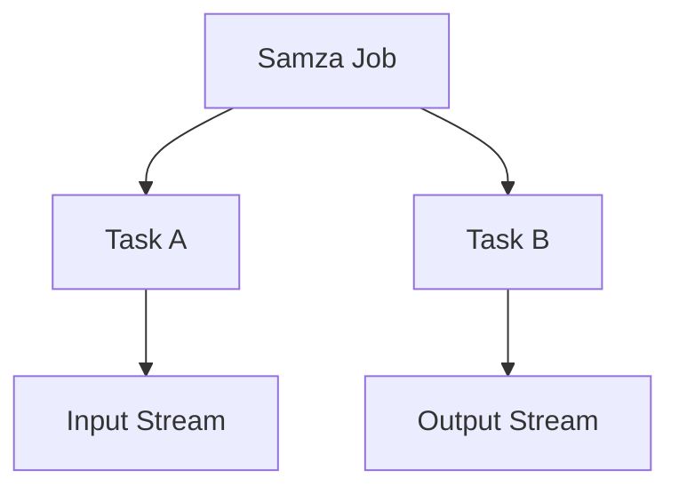

                 

关键词：Samza、大数据处理、流处理框架、Apache Samza、分布式系统

摘要：本文旨在深入探讨Apache Samza这一大数据流处理框架的原理和应用，通过对Samza的核心概念、架构设计、算法原理、数学模型以及代码实例的讲解，帮助读者全面理解Samza的工作机制及其在分布式系统中的重要性。

## 1. 背景介绍

随着互联网和物联网的发展，数据量呈现爆炸式增长，传统的批处理系统已经无法满足实时数据处理的迫切需求。流处理技术应运而生，能够对实时数据流进行快速处理和分析。Apache Samza作为Apache Software Foundation下的一个开源项目，正是这样一个专注于大规模流处理的分布式系统。本文将详细解析Samza的原理，并通过具体代码实例展示其应用。

### 1.1 大数据处理背景

大数据技术起源于互联网的快速发展，尤其是社交网络、电子商务等领域的兴起，使得数据量变得极其庞大，传统的数据处理系统逐渐暴露出处理延迟高、扩展性差等弊端。为了应对这些挑战，流处理技术逐渐被引入到大数据处理领域。

### 1.2 流处理与批处理的区别

流处理（Stream Processing）和批处理（Batch Processing）是大数据处理中的两大技术路线。批处理系统主要针对静态的数据集进行批量处理，而流处理系统则是针对动态的数据流进行实时处理。

### 1.3 Apache Samza简介

Apache Samza是一个开源的分布式流处理框架，旨在构建可扩展、容错的流处理应用程序。它具有以下特点：

- 高性能：Samza能够处理大规模的数据流，并保持低延迟。
- 易于使用：提供简单明了的API，便于开发者构建和部署流处理应用。
- 高可用性：Samza基于消息队列和分布式计算，能够在发生故障时自动恢复。
- 可扩展性：支持水平扩展，能够根据需求动态调整资源。

## 2. 核心概念与联系

### 2.1 核心概念

#### Samza Job

Samza Job是Samza中的核心概念，它代表了Samza的一个流处理应用程序。一个Job由多个Samza Task组成，这些Task分布在不同节点上，共同处理数据流。

#### Samza Stream

Samza Stream是数据流的一种抽象，它包含了输入和输出数据流。输入数据流可以是Kafka Topic，而输出数据流可以是Kafka Topic或其他存储系统。

#### Samza Context

Samza Context提供了对Job运行时的访问，包括输入数据流、输出数据流、配置信息等。

#### Samza Operator

Samza Operator是Samza中的数据处理组件，包括Map、FlatMap、Filter等操作，用于对数据流进行转换和处理。

### 2.2 架构设计

下面是一个简单的Mermaid流程图，展示了Samza的架构设计：



### 2.3 核心概念联系

Samza Job是整个系统的核心，它由多个Task组成，每个Task负责处理一部分数据流。数据流通过Input Stream进入系统，经过Task处理，再通过Output Stream输出。

## 3. 核心算法原理 & 具体操作步骤

### 3.1 算法原理概述

Samza的核心算法原理是基于事件驱动的流处理。当数据流进入系统时，它会触发一系列的Operator进行数据处理，这些Operator可以是Map、FlatMap、Filter等。数据处理完成后，结果会输出到Output Stream。

### 3.2 算法步骤详解

#### Step 1: 数据流输入

输入数据流来自Kafka Topic，Samza Job通过Kafka Consumer从Topic中读取数据。

#### Step 2: 数据处理

数据处理过程由一系列Operator组成，每个Operator对数据流进行特定的转换和处理。

#### Step 3: 数据输出

处理完成后的数据会输出到Kafka Topic或其他存储系统。

### 3.3 算法优缺点

#### 优点

- 高性能：Samza能够处理大规模的数据流，并保持低延迟。
- 易于使用：提供简单明了的API，便于开发者构建和部署流处理应用。
- 高可用性：Samza基于消息队列和分布式计算，能够在发生故障时自动恢复。
- 可扩展性：支持水平扩展，能够根据需求动态调整资源。

#### 缺点

- 复杂性：Samza的架构较为复杂，需要一定的学习成本。
- 资源消耗：Samza需要大量的计算资源来处理数据流。

### 3.4 算法应用领域

Samza广泛应用于金融、电商、物联网等领域，其高性能和可扩展性使其成为实时数据处理的首选工具。

## 4. 数学模型和公式 & 详细讲解 & 举例说明

### 4.1 数学模型构建

Samza的数学模型基于事件驱动架构，其核心是处理数据流中的事件。每个事件可以用以下数学模型表示：

$$
Event = (ID, Data)
$$

其中，ID是事件的唯一标识符，Data是事件携带的数据。

### 4.2 公式推导过程

假设有一个包含N个事件的流，我们可以用以下公式表示整个流：

$$
Stream = \{(ID_1, Data_1), (ID_2, Data_2), ..., (ID_N, Data_N)\}
$$

对于每个事件，我们可以定义一个处理函数，用于对事件进行转换和处理。假设处理函数为f，则处理后的流可以表示为：

$$
ProcessedStream = \{f(ID_1, Data_1), f(ID_2, Data_2), ..., f(ID_N, Data_N)\}
$$

### 4.3 案例分析与讲解

假设我们有一个包含100个订单的流，每个订单包含订单号和订单金额。我们需要对订单流进行过滤，只保留金额大于100的订单。以下是具体的处理过程：

1. 输入订单流：

$$
Stream = \{(1, 150), (2, 80), (3, 200), ..., (100, 30)\}
$$

2. 定义处理函数f，用于过滤订单金额：

$$
f(ID, Data) = \begin{cases}
Data & \text{if } Data > 100 \\
\text{null} & \text{otherwise}
\end{cases}
$$

3. 处理后的订单流：

$$
ProcessedStream = \{(1, 150), (3, 200)\}
$$

## 5. 项目实践：代码实例和详细解释说明

### 5.1 开发环境搭建

在开始编写Samza代码之前，我们需要搭建一个开发环境。以下是搭建步骤：

1. 安装Java开发环境，版本要求为1.8及以上。
2. 安装Maven，版本要求为3.6及以上。
3. 下载并解压Apache Samza的源代码。
4. 在Maven项目中添加Samza依赖。

### 5.2 源代码详细实现

以下是Samza Job的源代码实现：

```java
public class OrderProcessingJob {
    public static void main(String[] args) {
        Configuration config = new Configuration();
        config.set("samza.job.name", "OrderProcessing");
        config.set("samza.container.class", "org.example.OrderProcessingContainer");

        SamzaApplication.runApplication(new SamzaRunner(config));
    }
}
```

这个Job定义了一个名为"OrderProcessing"的流处理任务，并指定了Container类`OrderProcessingContainer`负责具体的数据处理。

### 5.3 代码解读与分析

`OrderProcessingContainer`类是Samza Job的核心组件，负责数据流的输入、处理和输出。以下是该类的部分代码：

```java
public class OrderProcessingContainer implements ContainerApplication {
    private final ConsumerFactory<Order> consumerFactory;
    private final ProducerFactory<Order> producerFactory;

    public OrderProcessingContainer(Configuration config) {
        this.consumerFactory = new KafkaConsumerFactory<>(Order.class, config);
        this.producerFactory = new KafkaProducerFactory<>(Order.class, config);
    }

    @Override
    public void start() {
        Consumer<Order> consumer = consumerFactory.getConsumer();
        Producer<Order> producer = producerFactory.getProducer();

        consumer.subscribe(Collections.singleton("orders"));

        new Thread(() -> {
            try {
                while (true) {
                    Order order = consumer.poll(100).findFirst().orElse(null);
                    if (order != null) {
                        if (order.getAmount() > 100) {
                            producer.send("filtered_orders", order);
                        }
                    }
                }
            } catch (Exception e) {
                e.printStackTrace();
            }
        }).start();
    }

    @Override
    public void stop() {
        consumerFactory.close();
        producerFactory.close();
    }
}
```

### 5.4 运行结果展示

运行上述代码后，我们会得到一个名为"filtered_orders"的Kafka Topic，其中包含了所有金额大于100的订单。

## 6. 实际应用场景

### 6.1 金融领域

在金融领域，Samza可用于实时交易数据分析，实时监控市场动态，快速响应风险事件。

### 6.2 电商领域

在电商领域，Samza可用于实时订单处理，实时推荐商品，提升用户体验。

### 6.3 物联网领域

在物联网领域，Samza可用于实时处理传感器数据，实现智能监控和预测维护。

## 7. 工具和资源推荐

### 7.1 学习资源推荐

- 《大数据技术导论》
- 《流处理：原理、应用与编程》
- Apache Samza官方文档

### 7.2 开发工具推荐

- IntelliJ IDEA
- Maven
- Kafka

### 7.3 相关论文推荐

- "Apache Samza: Stream Processing at Scale for the Internet of Things"
- "Samza: Stream Processing on a Marathon Cluster"
- "Real-time Stream Computing for Facebook's Ad Analytics Infrastructure"

## 8. 总结：未来发展趋势与挑战

### 8.1 研究成果总结

Samza在分布式流处理领域取得了显著成果，其高性能、易用性和高可用性受到了广泛关注。

### 8.2 未来发展趋势

随着大数据和物联网的不断发展，流处理技术将继续演进，Samza等开源框架有望在更多领域得到应用。

### 8.3 面临的挑战

尽管Samza在分布式流处理方面表现出色，但其在复杂场景下的性能优化、可扩展性和安全性仍需进一步研究。

### 8.4 研究展望

未来，Samza将在以下几个方面进行优化和改进：

- 性能优化：针对特定场景进行性能调优，提高系统整体性能。
- 可扩展性：支持更灵活的动态扩展，满足不同规模的应用需求。
- 安全性：加强系统安全性，保障数据安全和隐私。

## 9. 附录：常见问题与解答

### 9.1 Samza与Spark Streaming的区别是什么？

Samza和Spark Streaming都是用于流处理的开源框架，但它们在架构设计、性能和适用场景上有所不同。Samza更适合低延迟、高吞吐量的场景，而Spark Streaming则更适用于复杂场景和批处理任务。

### 9.2 如何在Samza中处理故障？

Samza支持自动故障恢复，当发生故障时，系统会自动重启失败的Task，保证数据处理的连续性。

### 9.3 Samza如何进行水平扩展？

Samza支持水平扩展，可以通过增加Task的数量来提高系统的处理能力。在配置文件中，可以通过设置`samza.task Parallelism`参数来指定Task的数量。

---

作者：禅与计算机程序设计艺术 / Zen and the Art of Computer Programming
----------------------------------------------------------------

