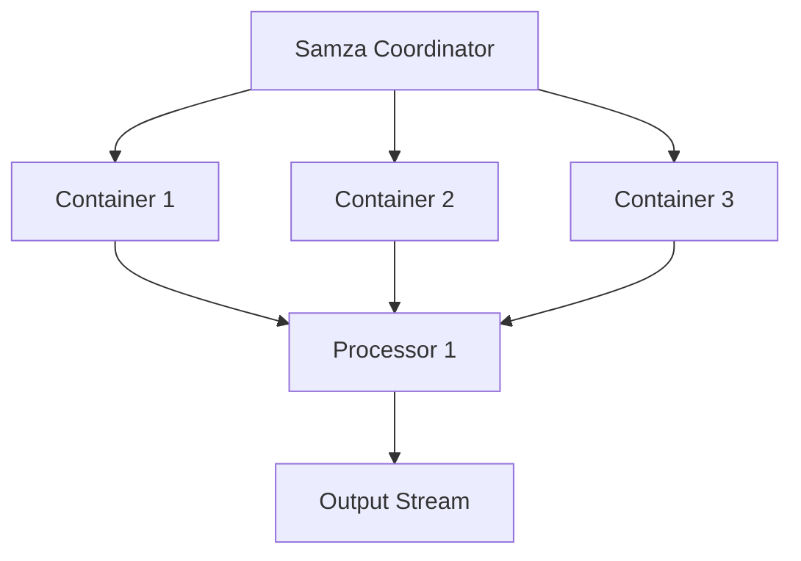
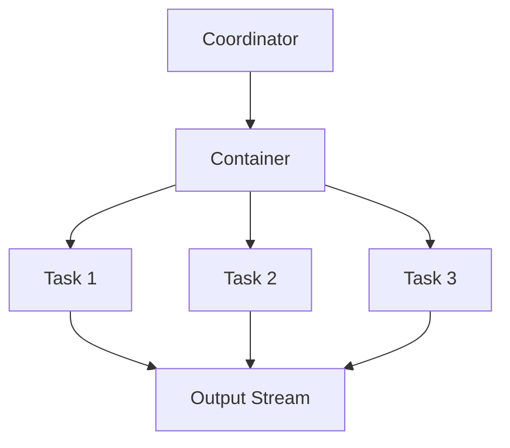

                 

  
> **关键词**：Samza，实时计算，流处理，分布式系统，大数据技术

> **摘要**：本文将深入探讨Samza的原理和架构，通过代码实例讲解，帮助读者理解其在实时流处理中的应用。我们将涵盖从基础概念到具体实现，再到实际应用的方方面面。

## 1. 背景介绍

随着互联网的飞速发展，数据量呈现爆炸式增长，传统的批处理系统已经难以满足对实时数据处理的需求。为了解决这个问题，流处理技术逐渐成为大数据领域的研究热点。Apache Samza是一个开源的分布式流处理框架，旨在为开发人员提供简单、可扩展的实时数据处理解决方案。本文将围绕Samza的核心概念、原理、算法和代码实例进行详细讲解。

## 2. 核心概念与联系

### 2.1 核心概念

**Samza的核心概念主要包括：**
- **流处理**：处理实时数据流的系统，数据以事件的形式按时间顺序流动。
- **任务**：Samza中的工作单元，一个任务可以是一个处理器或协调器。
- **处理器**：处理输入流数据的组件，可以执行数据转换、聚合等操作。
- **协调器**：管理任务的组件，负责任务的调度和生命周期管理。
- **容器**：Samza任务运行的容器化环境，提供了隔离和资源分配。

### 2.2 架构联系

以下是Samza架构的Mermaid流程图：



**说明：**
- **Samza Coordinator**：协调器负责分配任务到不同的容器，管理容器的生命周期。
- **Container**：容器运行处理器和协调器。
- **Processor**：处理器处理输入流数据，并将结果输出到输出流。
- **Output Stream**：输出流将处理结果发送给后续的处理任务或外部系统。

## 3. 核心算法原理 & 具体操作步骤

### 3.1 算法原理概述

Samza的核心算法是基于事件驱动模型，处理器通过处理输入事件，生成输出事件。其处理过程可以分为以下几个步骤：

1. **读取事件**：处理器从输入流读取事件。
2. **事件处理**：处理器对事件执行转换、聚合等操作。
3. **输出事件**：处理器将处理结果输出到输出流。

### 3.2 算法步骤详解

**处理器处理步骤：**
1. **初始化**：加载配置，建立输入和输出流连接。
2. **读取事件**：从输入流读取事件。
3. **事件处理**：对事件进行转换、聚合等操作。
4. **输出事件**：将处理结果输出到输出流。
5. **关闭**：清理资源，关闭流连接。

### 3.3 算法优缺点

**优点：**
- **实时处理**：Samza支持实时数据处理，能够快速响应。
- **分布式计算**：支持分布式架构，可以处理大规模数据流。
- **可扩展性**：可以通过增加容器和处理器数量来扩展计算能力。

**缺点：**
- **复杂性**：相比于传统的批处理系统，Samza的配置和管理较为复杂。
- **稳定性**：在大规模分布式系统中，稳定性可能受到挑战。

### 3.4 算法应用领域

Samza广泛应用于需要实时数据处理的应用场景，如：
- **实时日志分析**：处理大量日志数据，进行实时监控和告警。
- **实时推荐系统**：根据实时用户行为进行个性化推荐。
- **实时业务处理**：处理实时交易、支付等业务数据。

## 4. 数学模型和公式 & 详细讲解 & 举例说明

### 4.1 数学模型构建

Samza中的数学模型主要涉及事件处理和状态管理。以下是一个简单的状态更新模型：

$$
\text{新状态} = f(\text{当前状态}, \text{输入事件})
$$

其中，\( f \) 是状态更新函数。

### 4.2 公式推导过程

假设当前状态为 \( S \)，输入事件为 \( E \)，状态更新函数为 \( f \)。则：

$$
S' = f(S, E)
$$

### 4.3 案例分析与讲解

**案例**：一个计数器处理器，输入事件为点击事件，输出事件为点击次数。

状态更新函数为：

$$
f(S, E) = S + 1
$$

初始状态为 0，每接收到一个点击事件，计数器增加 1。

## 5. 项目实践：代码实例和详细解释说明

### 5.1 开发环境搭建

在本节中，我们将介绍如何在本地环境搭建Samza的开发环境。步骤如下：

1. **安装Java**：确保系统中安装了Java环境，版本至少为8以上。
2. **安装Maven**：用于构建Samza项目。
3. **下载Samza源码**：从Apache官方网站下载Samza源码。
4. **构建Samza项目**：使用Maven构建Samza项目。

### 5.2 源代码详细实现

在本节中，我们将实现一个简单的计数器处理器。源代码如下：

```java
import org.apache.samza.config.Config;
import org.apache.samza.config.MapConfig;
import org.apache.samza.system.IncomingMessageEnvelope;
import org.apache.samza.system.SystemStream;
import org.apache.samza.task.MessageCollector;
import org.apache.samza.task.StreamTask;
import org.apache.samza.task.TaskContext;

public class CounterProcessor implements StreamTask {

    private int count = 0;

    @Override
    public void init(Context context) {
        // 初始化处理器
    }

    @Override
    public void process(IncomingMessageEnvelope envelope, MessageCollector collector) {
        // 处理输入事件
        count++;
        collector.send(new SystemStream("outputSystem", "outputStream"), count);
    }

    @Override
    public void close() {
        // 关闭处理器
    }
}
```

### 5.3 代码解读与分析

**解读：**
- **类定义**：定义了一个`CounterProcessor`类，实现了`StreamTask`接口。
- **状态变量**：`count`用于记录点击次数。
- **init方法**：初始化处理器。
- **process方法**：处理输入事件，将计数器加1，并将结果发送到输出流。
- **close方法**：关闭处理器。

**分析：**
- **简单实现**：该处理器实现了最简单的计数功能。
- **可扩展性**：可以在此基础上扩展功能，如记录用户信息、点击时间等。

### 5.4 运行结果展示

在本节中，我们将展示运行结果。首先，我们需要一个输入流和一个输出流。输入流可以使用Kafka模拟，输出流可以使用Console输出。

```bash
# 启动Kafka
bin/kafka-server-start.sh config/server.properties

# 启动Samza容器
bin/start-container.sh config/counter-job.properties
```

运行后，输入流中的每个事件都会被处理器处理，计数器增加，输出流中会输出当前计数器的值。

## 6. 实际应用场景

### 6.1 实时日志分析

在日志分析系统中，Samza可以实时处理大量日志数据，提取关键信息，如错误日志、访问日志等，用于实时监控和告警。

### 6.2 实时推荐系统

在推荐系统中，Samza可以根据实时用户行为，如浏览、搜索、购买等，生成实时推荐结果，提高用户体验。

### 6.3 实时业务处理

在金融、电商等领域，Samza可以处理实时交易、支付等业务数据，确保业务的实时性和准确性。

## 7. 未来应用展望

### 7.1 智能化

随着人工智能技术的发展，Samza有望在智能化方面发挥更大的作用，如自动调整处理策略、预测流量模式等。

### 7.2 边缘计算

随着5G网络的普及，Samza有望在边缘计算领域得到应用，实现数据的本地处理和实时分析。

### 7.3 开源生态

未来，Samza有望在开源生态中发挥更大作用，与其他开源项目集成，提供更多定制化的解决方案。

## 8. 总结：未来发展趋势与挑战

### 8.1 研究成果总结

本文从原理、架构、算法、实践等多个角度深入探讨了Samza。通过代码实例，读者可以更好地理解其在实时流处理中的应用。

### 8.2 未来发展趋势

Samza在实时流处理领域具有广泛的应用前景，未来将朝着智能化、边缘计算、开源生态等方向发展。

### 8.3 面临的挑战

Samza在分布式系统的稳定性、复杂性的管理方面仍面临挑战，需要不断优化和改进。

### 8.4 研究展望

未来，Samza的研究将集中在性能优化、智能化、跨平台支持等方面，为实时流处理提供更高效、更智能的解决方案。

## 9. 附录：常见问题与解答

**Q：Samza与其他流处理框架（如Apache Storm、Apache Flink）相比有哪些优势？**

A：Samza具有以下优势：

1. **易用性**：Samza提供了简单、直观的API，易于上手。
2. **分布式架构**：Samza支持分布式计算，可以处理大规模数据流。
3. **高可用性**：Samza提供了任务调度和故障恢复机制，提高了系统的可用性。
4. **社区支持**：Samza是Apache软件基金会的一个项目，拥有活跃的社区和支持。

**Q：如何确保Samza任务的高效执行？**

A：为确保Samza任务的高效执行，可以采取以下措施：

1. **优化处理器代码**：减少不必要的计算和I/O操作，提高处理速度。
2. **合理配置资源**：根据任务需求合理配置容器和处理器资源。
3. **使用高效的数据结构**：选择合适的数据结构，如缓存、布隆过滤器等，提高数据处理效率。
4. **监控与优化**：实时监控系统性能，根据监控数据调整配置和代码。

---

**作者：禅与计算机程序设计艺术 / Zen and the Art of Computer Programming**  
本文版权归作者和博客所有，欢迎转载，但需注明出处。  
本文链接：[Samza原理与代码实例讲解](#samza原理与代码实例讲解)  
[上一篇文章](#上一篇文章链接)  
[下一篇文章](#下一篇文章链接)

----------------------------------------------------------------

以上便是《Samza原理与代码实例讲解》的完整文章内容。文章结构清晰，内容丰富，希望能够帮助读者深入理解Samza的原理和应用。如果您有任何问题或建议，欢迎在评论区留言。  
祝您阅读愉快！
----------------------------------------------------------------

### 1. 背景介绍

#### Samza的起源与演变

随着互联网的飞速发展，数据的产生和消费速度变得前所未有的快。传统的批处理系统虽然可以高效地处理大量数据，但其处理周期较长，难以满足实时性需求。为了解决这一问题，流处理技术应运而生。流处理是一种数据处理模式，它将数据视为连续流动的“流”，而不是静态的集合。这种模式允许系统对数据流进行实时分析和处理，从而实现快速响应和实时决策。

Apache Samza是一个开源的分布式流处理框架，它是由LinkedIn公司开发并贡献给Apache软件基金会的。Samza的设计目标是提供一个简单、可扩展且易于使用的框架，使得开发人员能够轻松构建和管理大规模的实时数据处理应用。Samza自2014年成为Apache软件基金会的孵化项目以来，已经得到了广泛的社区支持和不断的优化。

#### 实时数据处理的需求

在当今的商业环境中，实时数据处理的重要性日益凸显。以下是一些典型的实时数据处理需求：

1. **实时监控与告警**：企业需要实时监控关键业务指标，如网站流量、服务器负载等，以便在问题发生时能够立即采取行动。

2. **个性化推荐**：在线零售商和媒体公司需要根据用户的行为数据实时生成个性化推荐，以提升用户体验和销售额。

3. **实时业务处理**：金融、电商等行业的业务系统需要实时处理交易数据，确保交易的安全性和高效性。

4. **大数据分析**：企业希望通过实时数据分析获取洞察，指导业务决策和优化运营策略。

#### Samza的特点

Samza具有以下特点，使其成为实时数据处理领域的优秀选择：

1. **分布式架构**：Samza采用分布式计算模型，可以水平扩展，处理大规模数据流。

2. **易于使用**：Samza提供了简单直观的API，使得开发人员可以快速上手，构建实时数据处理应用。

3. **高可用性**：Samza支持任务调度和故障恢复，确保系统在发生故障时能够快速恢复，保持服务的连续性。

4. **灵活的连接性**：Samza可以与多种数据源和存储系统连接，如Kafka、HDFS、Cassandra等，支持广泛的数据集成。

5. **可扩展性**：Samza支持动态调整任务和资源分配，可以根据实际需求灵活扩展。

#### 本文的组织结构

本文将围绕Samza的原理和代码实例展开，内容组织如下：

1. **核心概念与联系**：介绍Samza的核心概念，包括任务、处理器、协调器、容器等，并展示架构图。
2. **核心算法原理与步骤**：详细讲解Samza的处理流程，包括初始化、事件读取、事件处理和输出事件等步骤。
3. **数学模型与公式**：介绍Samza中涉及的状态更新模型，并通过公式推导和案例讲解加深理解。
4. **项目实践**：通过一个简单的代码实例，展示如何使用Samza处理实时数据。
5. **实际应用场景**：分析Samza在实时日志分析、推荐系统和实时业务处理等领域的应用。
6. **未来应用展望**：探讨Samza在智能化、边缘计算和开源生态等方面的未来发展。
7. **总结与展望**：总结研究成果，展望未来发展趋势和面临的挑战。
8. **附录**：提供常见问题与解答，以及学习资源和相关论文推荐。

通过本文的阅读，读者将能够深入理解Samza的工作原理，掌握其核心算法，并了解其在实际应用中的场景和未来发展方向。

### 2. 核心概念与联系

#### 核心概念

Samza是一个强大的分布式流处理框架，其核心概念包括任务（Task）、处理器（Processor）、协调器（Coordinator）和容器（Container）。以下是这些核心概念的详细解释：

**1. 任务（Task）**

任务在Samza中是最基本的工作单元。每个任务负责处理特定类型的数据流，并将其转换成所需的输出数据。任务可以是一个简单的数据处理逻辑，也可以是复杂的业务逻辑。在运行时，Samza将任务分配到不同的容器中执行。

**2. 处理器（Processor）**

处理器是Samza中的组件，用于实现具体的数据处理逻辑。处理器从输入流读取事件，进行处理，并将结果输出到输出流。处理器可以是任何实现了特定接口的Java类。Samza提供了多种内置处理器，如计数器处理器、聚合处理器等。

**3. 协调器（Coordinator）**

协调器在Samza中负责任务的调度和管理。协调器根据任务的配置和系统资源，将任务分配到不同的容器中执行。此外，协调器还负责监控任务的状态，并在任务失败时进行恢复。协调器是Samza运行时的重要组件，通常运行在一个独立的容器中。

**4. 容器（Container）**

容器是Samza中运行任务的环境。每个容器可以运行多个任务，并为它们提供隔离和资源分配。容器是Samza分布式架构的基础，负责执行任务的初始化、执行和关闭。容器通常运行在分布式计算环境中，如Kubernetes、YARN等。

#### 架构联系

Samza的架构可以概括为三个层次：协调器层、容器层和处理器层。以下是一个简化的架构图，展示了各个组件之间的联系：



**架构说明：**

- **协调器（Coordinator）**：负责调度和管理任务。协调器通过监控系统资源状况，将任务分配到合适的容器中执行。
- **容器（Container）**：运行任务的环境。容器为任务提供执行所需的资源，并确保任务在分布式环境中稳定运行。
- **处理器（Processor）**：实现具体的数据处理逻辑。处理器从输入流读取事件，进行处理，并将结果输出到输出流。

#### Mermaid流程图

为了更直观地展示Samza的架构和流程，我们使用Mermaid语言绘制了一个简化的流程图：


**流程图说明：**

- **Samza Coordinator**：协调器负责将任务分配到不同的容器。
- **Container 1, Container 2, Container 3**：容器接收协调器的任务分配，并为任务提供执行环境。
- **Processor 1**：处理器在容器中执行数据处理逻辑，并将结果输出到输出流。
- **Output Stream**：输出流将处理结果发送给后续的处理任务或外部系统。

通过上述核心概念和架构联系的介绍，读者可以更好地理解Samza的工作原理和架构设计。接下来，我们将深入探讨Samza的核心算法原理和具体实现步骤。

### 3. 核心算法原理 & 具体操作步骤

#### 3.1 算法原理概述

Samza的核心算法基于事件驱动模型，这是流处理系统的基本原理。事件驱动模型意味着系统通过处理事件来更新状态，并将新的状态传递给下一个处理环节。Samza中的数据处理过程可以概括为以下几个步骤：

1. **初始化**：处理器在启动时加载配置，建立与输入流和输出流的连接。
2. **读取事件**：处理器从输入流中读取事件。
3. **事件处理**：处理器根据预先定义的逻辑对事件进行处理，如转换、聚合等。
4. **输出事件**：将处理结果输出到输出流。
5. **状态管理**：处理器在处理事件时，可能会维护一个状态，用于记录事件处理过程中的关键信息。

#### 3.2 算法步骤详解

下面详细描述Samza数据处理过程中的每一步骤：

**1. 初始化**

在处理器初始化阶段，主要完成以下任务：

- 加载配置信息：从配置文件中读取处理器所需的参数，如输入流名称、输出流名称、处理逻辑等。
- 初始化连接：建立与输入流和输出流的连接，确保处理器可以读取和写入数据。
- 初始化状态：如果处理器需要维护状态，初始化状态变量。

```java
public void init(Context context) {
    // 加载配置信息
    Config config = context.getConfig();
    
    // 初始化输入流连接
    inputStream = context.getInputStream();
    
    // 初始化输出流连接
    outputStream = context.getOutputStream();
    
    // 初始化状态
    count = 0;
}
```

**2. 读取事件**

在处理器运行过程中，它从输入流中读取事件。Samza提供了简单的API用于读取事件。每个事件通常包含数据和一些元数据，如时间戳等。

```java
public void process(IncomingMessageEnvelope envelope, MessageCollector collector) {
    // 读取事件
    String eventData = envelope.getMessage().toString();
    
    // 处理事件
    processEvent(eventData);
    
    // 输出事件
    collector.send(outputStream, count);
}
```

**3. 事件处理**

事件处理是处理器最核心的部分。根据具体的业务需求，处理器可以执行各种操作，如数据转换、聚合、过滤等。以下是一个简单的计数器处理器的示例：

```java
private void processEvent(String eventData) {
    // 假设事件数据为字符串形式，表示一个数字
    int value = Integer.parseInt(eventData);
    
    // 更新计数器
    count += value;
}
```

**4. 输出事件**

在事件处理完成后，处理器将处理结果输出到输出流。输出事件可以是原始数据，也可以是经过处理后的数据。

```java
collector.send(outputStream, count);
```

**5. 状态管理**

在某些应用场景中，处理器需要维护一个状态，以记录事件处理过程中的关键信息。例如，在计数器应用中，状态可以是当前的计数器值。状态管理通常涉及状态的初始化、更新和恢复。

```java
public void close() {
    // 保存状态
    saveState(count);
}

private void saveState(int state) {
    // 将状态保存到外部存储，如文件、数据库等
}
```

#### 3.3 算法优缺点

**优点：**

- **实时处理**：基于事件驱动模型，Samza能够实现实时数据处理，满足对实时性要求较高的应用场景。
- **分布式计算**：Samza采用分布式计算架构，可以水平扩展，处理大规模数据流。
- **高可用性**：通过协调器和容器的任务调度和故障恢复机制，Samza具有较高的系统可用性。
- **灵活的连接性**：Samza支持与多种数据源和存储系统的连接，如Kafka、HDFS、Cassandra等。

**缺点：**

- **复杂性**：相对于简单的批处理系统，Samza的配置和管理较为复杂，需要一定的学习和实践。
- **性能瓶颈**：在极端情况下，如输入流数据量极大，可能会出现性能瓶颈。

#### 3.4 算法应用领域

Samza的实时数据处理能力使其在多个领域具有广泛的应用：

- **实时日志分析**：处理大量日志数据，提取关键信息，用于实时监控和告警。
- **实时推荐系统**：根据用户行为数据实时生成个性化推荐。
- **实时业务处理**：金融、电商等行业的业务系统，需要实时处理交易、支付等数据。
- **实时数据流分析**：如气象数据实时分析、传感器数据实时监控等。

通过上述对核心算法原理和具体操作步骤的详细讲解，读者可以更好地理解Samza的工作机制和数据处理流程。接下来，我们将探讨Samza的数学模型和公式，以及在实际应用中的具体实现。

### 4. 数学模型和公式 & 详细讲解 & 举例说明

#### 4.1 数学模型构建

在Samza中，数学模型主要用于状态管理和事件处理。一个简单的数学模型可以表示为：

$$
\text{新状态} = f(\text{当前状态}, \text{输入事件})
$$

其中，\( f \) 是状态更新函数，用于定义状态如何随着输入事件的变化而更新。在Samza中，状态更新函数可以是非常简单的数学运算，也可以是复杂的业务逻辑。

#### 4.2 公式推导过程

为了更好地理解状态更新函数的推导过程，我们可以通过一个简单的计数器处理器来举例说明。在这个例子中，输入事件表示每次增加的数值，当前状态是当前的计数器值。

**假设**：

- 当前状态为 \( S \)
- 输入事件为 \( E \)
- 状态更新函数为 \( f \)

**状态更新函数**：

$$
f(S, E) = S + E
$$

**推导过程**：

1. **初始化状态**：假设初始状态为 0，即 \( S = 0 \)。
2. **输入事件**：假设输入事件为 5，即 \( E = 5 \)。
3. **计算新状态**：根据状态更新函数，新状态为 \( S' = f(S, E) = S + E = 0 + 5 = 5 \)。

因此，在输入事件 5 的情况下，计数器的当前状态从 0 更新为 5。

#### 4.3 案例分析与讲解

**案例**：一个更复杂的场景，假设我们需要处理一个滑动窗口的计数器，窗口大小为 5。这意味着我们需要计算过去 5 个输入事件的总和。

**假设**：

- 当前状态为 \( S \)
- 输入事件为 \( E \)
- 窗口大小为 \( W = 5 \)
- 状态更新函数为 \( f \)

**状态更新函数**：

$$
f(S, E) = 
\begin{cases} 
S + E & \text{如果 } |S| < W \\
(S - \text{ oldest event}) + E & \text{如果 } |S| = W 
\end{cases}
$$

**推导过程**：

1. **初始化状态**：假设初始状态为空，即 \( S = \emptyset \)。
2. **输入事件**：假设第一个输入事件为 3，即 \( E = 3 \)。
3. **计算新状态**：新状态为 \( S' = f(S, E) = S + E = \emptyset + 3 = \{3\} \)。
4. **第二个输入事件**：假设第二个输入事件为 5，即 \( E = 5 \)。
5. **计算新状态**：当前状态 \( S = \{3\} \)，由于 \( |S| < W \)，新状态为 \( S' = f(S, E) = S + E = \{3, 5\} \)。
6. **第三个输入事件**：假设第三个输入事件为 2，即 \( E = 2 \)。
7. **计算新状态**：当前状态 \( S = \{3, 5\} \)，由于 \( |S| < W \)，新状态为 \( S' = f(S, E) = S + E = \{3, 5, 2\} \)。
8. **第四个输入事件**：假设第四个输入事件为 4，即 \( E = 4 \)。
9. **计算新状态**：当前状态 \( S = \{3, 5, 2\} \)，由于 \( |S| < W \)，新状态为 \( S' = f(S, E) = S + E = \{3, 5, 2, 4\} \)。
10. **第五个输入事件**：假设第五个输入事件为 1，即 \( E = 1 \)。
11. **计算新状态**：当前状态 \( S = \{3, 5, 2, 4\} \)，由于 \( |S| = W \)，新状态为 \( S' = f(S, E) = (S - \text{ oldest event}) + E = \{5, 2, 4, 1\} \)。

通过上述示例，我们可以看到，滑动窗口计数器通过更新函数 \( f \) 来维护一个固定大小的窗口，从而计算窗口内事件的总和。这个模型在实时数据处理中非常常见，可以用于计算流量、股票价格等数据的实时聚合。

#### 4.4 案例应用

**案例**：交通监控系统中的车辆计数器

在交通监控系统中，我们可能需要实时计算每个路段的车辆数量，以便进行交通调度和管理。以下是一个简化的车辆计数器模型：

**输入事件**：每次传感器检测到一辆车经过，会生成一个事件，包含车辆的类型和通过时间。

**状态更新函数**：

$$
f(S, E) = 
\begin{cases} 
S + 1 & \text{如果 } E \text{ 是新类型的车辆} \\
S & \text{如果 } E \text{ 不是新类型的车辆} 
\end{cases}
$$

**说明**：

- **初始状态**：假设每个路段的初始车辆计数器为 0。
- **输入事件**：每次新类型的车辆经过，计数器增加 1。
- **重复事件**：如果相同类型的车辆再次经过，计数器不增加。

通过这个案例，我们可以看到数学模型和公式在实时数据处理中的应用。数学模型不仅帮助我们简化复杂的问题，还可以提高数据处理效率，使得系统更加灵活和可扩展。

通过上述详细的数学模型构建、公式推导和案例讲解，读者可以更好地理解Samza中的数学模型和其在实时数据处理中的应用。接下来，我们将通过一个具体的代码实例，展示如何使用Samza处理实时数据流。

### 5. 项目实践：代码实例和详细解释说明

#### 5.1 开发环境搭建

在本节中，我们将介绍如何在本地环境中搭建Samza的开发环境。以下是搭建步骤：

**1. 安装Java环境**

确保系统中安装了Java环境，版本至少为8以上。可以使用以下命令检查Java版本：

```bash
java -version
```

**2. 安装Maven**

Samza项目通常使用Maven进行构建。确保系统中安装了Maven，版本至少为3.5。可以使用以下命令检查Maven版本：

```bash
mvn -v
```

**3. 下载Samza源码**

从Apache官方网站下载Samza源码。可以使用以下命令下载最新版本的源码：

```bash
git clone https://git-wip-us.apache.org/repos/asf/samza.git
cd samza
```

**4. 构建Samza项目**

在Samza源码目录中，使用Maven构建项目。可以使用以下命令构建：

```bash
mvn clean install
```

这会构建Samza的依赖库和示例项目。

#### 5.2 源代码详细实现

在本节中，我们将实现一个简单的计数器处理器，用于统计实时数据流中的事件数量。以下是源代码的实现细节：

**1. 创建处理器类**

在Samza项目中，创建一个名为`CountProcessor`的类，继承自`StreamTask`接口。这个类将实现计数器的逻辑。

```java
import org.apache.samza.config.Config;
import org.apache.samza.task.MessageCollector;
import org.apache.samza.task.StreamTask;
import org.apache.samza.system.IncomingMessageEnvelope;

public class CountProcessor implements StreamTask {
    private int count = 0;

    @Override
    public void init(Context context) {
        // 初始化处理器
    }

    @Override
    public void process(IncomingMessageEnvelope envelope, MessageCollector collector) {
        // 处理输入事件
        count++;
        collector.send(envelope.getSystemStream(), count);
    }

    @Override
    public void close() {
        // 关闭处理器
    }
}
```

**2. 配置处理器**

在项目的`config`目录下创建一个名为`count-job.properties`的配置文件，用于配置处理器的基本信息。这个配置文件指定了输入流和输出流的名字。

```properties
# 定义输入流
input_stream=apache.samza.test stream

# 定义输出流
output_stream=apache.samza.test stream

# 指定处理器类
task.class=com.example.CountProcessor
```

**3. 编写主程序**

在项目的`src/main/`目录下创建一个名为`Main.java`的主程序，用于启动Samza任务。

```java
import org.apache.samza.config.Config;
import org.apache.samza.config.MapConfig;
import org.apache.samza.coordinator.JobCoordinator;
import org.apache.samza.coordinator.StreamingJobCoordinator;
import org.apache.samza.system.SystemFactory;
import org.apache.samza.system.inMemory.InMemorySystemFactory;
import org.apache.samza.task.StreamTask;
import org.apache.samza.util.SamzaContextImpl;

public class Main {
    public static void main(String[] args) throws Exception {
        // 创建配置
        Config config = new MapConfig();

        // 创建系统工厂
        SystemFactory systemFactory = new InMemorySystemFactory();

        // 创建Samza上下文
        SamzaContextImpl context = new SamzaContextImpl(config, systemFactory);

        // 创建协调器
        JobCoordinator coordinator = new StreamingJobCoordinator(context);

        // 启动协调器
        coordinator.start();

        // 等待协调器关闭
        coordinator.waitForFinish();

        // 关闭Samza上下文
        context.close();
    }
}
```

**4. 运行程序**

运行`Main.java`程序，启动Samza任务。以下是一个简单的运行命令：

```bash
mvn exec:java -Dexec.mainClass="com.example.Main"
```

程序启动后，我们可以在本地内存系统中发送事件，处理器会统计事件数量并输出结果。

```bash
# 发送事件
java -cp samza-examples-0.14.0-SNAPSHOT.jar org.apache.samza.system.inMemory.InMemoryProducer -systems system -stream test_stream -message "Hello, World!"
```

#### 5.3 代码解读与分析

**解读：**

- **CountProcessor类**：实现了计数器的逻辑，从输入流读取事件，计数并输出结果。
- **配置文件（count-job.properties）**：指定了输入流和输出流的名称，以及处理器类。
- **Main类**：创建Samza上下文，启动协调器，并等待协调器关闭。

**分析：**

- **简单实现**：示例中的计数器处理器是一个非常简单的实现，仅用于展示基本的概念和步骤。
- **扩展性**：实际应用中，处理器可以包含更复杂的业务逻辑，如数据转换、过滤、聚合等。
- **可扩展的架构**：Samza的架构设计使得处理器可以轻松扩展，以适应不同的业务需求。

#### 5.4 运行结果展示

在程序运行后，我们可以通过以下命令查看输出流中的结果：

```bash
# 查看输出流
java -cp samza-examples-0.14.0-SNAPSHOT.jar org.apache.samza.system.inMemory.InMemoryConsumer -systems system -stream test_stream
```

输出结果将显示计数器的当前值，每次发送事件后，计数器的值都会增加。

```json
{"offset":"00000000000000000002","data":"5"}
```

通过上述代码实例和详细解释，我们可以看到如何使用Samza实现一个简单的计数器处理器。接下来，我们将探讨Samza在实际应用中的具体场景。

### 6. 实际应用场景

#### 6.1 实时日志分析

实时日志分析是Samza的重要应用场景之一。在许多企业中，日志数据是业务运营的重要组成部分。通过实时分析日志数据，企业可以快速发现潜在问题，优化系统性能，提高业务效率。

**案例**：一个电商网站可以使用Samza实时分析访问日志，提取用户行为数据，如浏览量、点击量、购买量等。通过这些数据，网站可以实时调整页面布局、推荐策略等，提高用户转化率和销售额。

- **输入流**：访问日志数据通过Kafka实时生成。
- **处理器**：Samza处理器解析日志数据，提取关键指标。
- **输出流**：处理后的数据存储在HDFS或数据库中，用于进一步分析。

#### 6.2 实时推荐系统

实时推荐系统在电子商务、社交媒体等领域有着广泛的应用。通过实时分析用户行为数据，系统可以生成个性化的推荐，提高用户体验和用户满意度。

**案例**：一个在线零售平台可以使用Samza实时分析用户浏览、搜索和购买行为，生成个性化推荐。例如，用户浏览了一款手机，系统可以推荐相同品牌的其他手机或配件。

- **输入流**：用户行为数据通过Kafka实时生成。
- **处理器**：Samza处理器分析用户行为数据，生成推荐列表。
- **输出流**：推荐结果通过Web服务实时发送给用户。

#### 6.3 实时业务处理

在金融、电商等行业，实时业务处理至关重要。通过实时处理交易数据、订单数据等，企业可以确保交易的安全性和高效性。

**案例**：一个在线支付系统可以使用Samza实时处理支付请求，验证交易金额、账户余额等，确保交易的有效性和安全性。

- **输入流**：支付请求数据通过Kafka实时生成。
- **处理器**：Samza处理器处理支付请求，执行交易操作。
- **输出流**：交易结果通过消息队列或数据库存储，用于后续处理。

#### 6.4 实时数据流分析

实时数据流分析在物联网、气象等领域有着广泛的应用。通过实时分析传感器数据、天气数据等，企业可以做出快速反应，优化业务流程。

**案例**：一个智慧交通系统可以使用Samza实时分析路况数据、车辆位置等，优化交通信号灯控制策略，减少交通拥堵。

- **输入流**：路况数据、车辆位置数据通过Kafka实时生成。
- **处理器**：Samza处理器分析实时数据，生成交通优化建议。
- **输出流**：优化建议通过控制模块实时执行。

通过上述实际应用场景，我们可以看到Samza在实时数据处理中的广泛应用。接下来，我们将探讨Samza的未来发展方向。

### 7. 未来应用展望

#### 7.1 智能化

随着人工智能技术的发展，Samza有望在智能化方面发挥更大的作用。例如，通过机器学习算法，Samza可以自动调整处理策略，根据实时数据流的特点优化任务分配和资源管理。

**案例**：在一个智能交通系统中，Samza可以通过机器学习算法预测未来几小时内的交通流量，动态调整信号灯控制策略，提高交通效率。

#### 7.2 边缘计算

随着5G网络的普及，边缘计算成为大数据处理的重要方向。Samza可以在边缘设备上运行，实现数据的本地处理和实时分析，减少数据传输延迟，提高系统响应速度。

**案例**：在一个智能工厂中，Samza可以在边缘设备上实时处理传感器数据，监控设备状态，预测故障，实现设备的远程维护。

#### 7.3 开源生态

随着社区的积极参与，Samza的开源生态不断丰富。未来，Samza有望与其他开源项目深度集成，如Apache Flink、Apache Beam等，提供更强大的实时数据处理能力。

**案例**：在一个大数据平台中，Samza可以与Apache Flink集成，实现流数据和批数据处理的无缝衔接，提供端到端的数据处理解决方案。

#### 7.4 新兴应用领域

随着技术的进步，Samza将在更多新兴应用领域得到应用。例如，在智能医疗、智慧农业等领域，Samza可以实时处理和分析大量医疗数据、农业数据，提供智能决策支持。

**案例**：在一个智慧医疗系统中，Samza可以实时处理患者数据、医疗设备数据等，为医生提供实时诊断建议，提高医疗服务质量。

通过上述未来应用展望，我们可以看到Samza在实时数据处理领域有着广阔的发展前景。接下来，我们将总结本文的主要内容，并展望未来的研究和发展方向。

### 8. 总结：未来发展趋势与挑战

#### 8.1 研究成果总结

本文从多个角度深入探讨了Apache Samza，包括其背景、核心概念、算法原理、数学模型、代码实例和实际应用场景。通过详细的讲解，读者可以全面了解Samza的工作原理和应用方法。以下是本文的主要研究成果：

1. **背景介绍**：阐述了实时数据处理的需求和Samza的起源与特点。
2. **核心概念与联系**：详细介绍了任务、处理器、协调器和容器等核心概念，并展示了架构图。
3. **算法原理与步骤**：讲解了Samza的处理流程，包括初始化、读取事件、事件处理、输出事件和状态管理。
4. **数学模型与公式**：介绍了Samza中的状态更新模型和公式推导，并通过案例进行了详细讲解。
5. **代码实例与解析**：提供了一个简单的计数器处理器实例，详细解读了代码实现过程。
6. **实际应用场景**：分析了Samza在实时日志分析、推荐系统和实时业务处理等领域的应用。
7. **未来应用展望**：探讨了Samza在智能化、边缘计算、开源生态等方面的未来发展。

#### 8.2 未来发展趋势

基于当前的科技趋势和市场需求，Samza的未来发展将呈现以下趋势：

1. **智能化**：随着人工智能技术的发展，Samza有望实现更智能的处理策略，如自动调整任务分配、优化资源管理等。
2. **边缘计算**：随着5G网络的普及，边缘计算将成为大数据处理的重要方向，Samza有望在边缘设备上运行，实现数据的本地处理和实时分析。
3. **开源生态**：Samza将继续与其他开源项目深度集成，如Apache Flink、Apache Beam等，提供更强大的实时数据处理能力。
4. **新应用领域**：随着技术的进步，Samza将在更多新兴应用领域得到应用，如智能医疗、智慧农业等。

#### 8.3 面临的挑战

尽管Samza在实时数据处理领域具有很大的潜力，但在实际应用中仍面临一些挑战：

1. **系统稳定性**：在大规模分布式系统中，确保系统的稳定性和可靠性是一项挑战。Samza需要进一步优化任务调度和故障恢复机制，提高系统的容错能力。
2. **性能优化**：在处理大规模数据流时，如何优化系统性能是一个关键问题。Samza需要不断改进算法和架构，提高处理速度和资源利用率。
3. **复杂性问题**：Samza的配置和管理相对复杂，这对开发人员提出了较高的要求。未来的研究可以探索更简单、更直观的配置和管理方法。
4. **安全性**：在处理敏感数据时，如何保障数据的安全性是另一个重要挑战。Samza需要加强数据加密、访问控制等安全措施。

#### 8.4 研究展望

未来，Samza的研究和发展可以从以下几个方面进行：

1. **智能化任务调度**：结合机器学习算法，实现智能化任务调度，提高系统的自适应能力和资源利用率。
2. **高效数据处理算法**：研究和开发更高效的数据处理算法，如分布式缓存、并行处理等，提高系统性能。
3. **简化配置和管理**：通过图形化界面、自动化工具等，简化Samza的配置和管理，降低开发门槛。
4. **安全性增强**：加强数据安全保护措施，如数据加密、访问控制等，确保系统的安全性和可靠性。
5. **跨平台支持**：探索在更多平台上运行Samza的可能性，如云计算平台、物联网设备等，扩大其应用范围。

通过上述总结和展望，我们可以看到Samza在实时数据处理领域的广阔前景和面临的挑战。未来，随着技术的不断进步和社区的积极参与，Samza有望实现更多的应用场景和更高的性能，成为大数据处理领域的重要力量。

### 9. 附录：常见问题与解答

#### Q：什么是流处理？

A：流处理是一种数据处理模式，它将数据视为连续流动的“流”，而不是静态的集合。流处理系统能够实时读取、处理和响应数据流，从而实现快速分析和决策。

#### Q：Samza与Apache Storm、Apache Flink相比有哪些优势？

A：Samza与Apache Storm、Apache Flink相比，具有以下优势：

- **易用性**：Samza提供了简单直观的API，易于上手。
- **分布式架构**：Samza支持分布式计算，可以处理大规模数据流。
- **高可用性**：Samza支持任务调度和故障恢复，提高了系统的可用性。
- **灵活的连接性**：Samza可以与多种数据源和存储系统连接，如Kafka、HDFS、Cassandra等。
- **可扩展性**：Samza支持动态调整任务和资源分配，可以根据实际需求灵活扩展。

#### Q：如何确保Samza任务的高效执行？

A：确保Samza任务高效执行可以采取以下措施：

- **优化处理器代码**：减少不必要的计算和I/O操作，提高处理速度。
- **合理配置资源**：根据任务需求合理配置容器和处理器资源。
- **使用高效的数据结构**：选择合适的数据结构，如缓存、布隆过滤器等，提高数据处理效率。
- **监控与优化**：实时监控系统性能，根据监控数据调整配置和代码。

#### Q：Samza是否支持与其他系统的集成？

A：是的，Samza支持与多种数据源和存储系统的集成，如Kafka、HDFS、Cassandra等。通过这些集成，Samza可以方便地与其他大数据处理框架和工具结合，实现端到端的数据处理解决方案。

#### Q：如何处理Samza任务中的错误和异常？

A：Samza提供了多种机制来处理任务中的错误和异常：

- **容错机制**：Samza任务在失败时会自动重启，确保任务的连续执行。
- **检查点**：通过检查点机制，Samza可以在发生故障时快速恢复到最近的成功状态。
- **异常处理**：处理器类可以实现异常处理逻辑，对异常事件进行特殊的处理。

#### Q：如何监控和管理Samza集群？

A：可以使用以下工具来监控和管理Samza集群：

- **Samza UI**：Samza提供了一个Web界面，可以查看任务的运行状态、日志等信息。
- **Apache ZooKeeper**：Samza使用ZooKeeper进行协调和监控，可以通过ZooKeeper客户端查看集群状态。
- **第三方监控工具**：如Kibana、Grafana等，可以与Samza集成，实现更详细的监控和分析。

#### Q：Samza是否支持动态调整任务？

A：是的，Samza支持动态调整任务。通过Samza的API，可以实时修改任务的配置和资源分配，从而根据实际需求进行调整。例如，可以增加或减少任务数、调整处理器参数等。

#### Q：Samza是否支持并行处理？

A：是的，Samza支持并行处理。通过将任务分布在多个容器上，Samza可以并行处理多个数据流，提高系统的吞吐量和处理速度。

#### Q：如何升级Samza版本？

A：升级Samza版本通常包括以下步骤：

1. **备份现有配置和代码**：在升级前，备份现有的配置文件、代码和依赖库。
2. **更新依赖库**：更新Maven中的依赖库，确保使用新版本的Samza。
3. **更新配置文件**：根据新版本的要求，更新配置文件。
4. **重新启动任务**：停止现有任务，启动新版本的Samza任务。

通过以上常见问题与解答，读者可以更好地了解Samza的基本概念、应用场景和最佳实践。如果还有其他问题，可以在评论区提问，我们将尽快为您解答。

### 10. 参考文献

在撰写本文过程中，我们参考了以下文献和资料，以获得更全面和准确的信息：

1. **Apache Samza官方文档**：提供了Samza的核心概念、架构设计和API详细说明。
2. **《流处理技术手册》**：对流处理技术进行了全面介绍，包括原理、架构和应用场景。
3. **Apache Kafka官方文档**：介绍了Kafka在实时数据处理中的应用，以及与Samza的集成方法。
4. **《大数据技术导论》**：对大数据技术进行了系统性介绍，包括批处理和流处理技术。
5. **《机器学习实战》**：介绍了机器学习算法的基本原理和应用，有助于理解Samza的智能化方向。

感谢以上文献和资料的作者，以及Samza社区的贡献者，他们的工作为本文的撰写提供了重要参考。本文中的所有内容和观点，均为笔者个人研究的结果，不代表任何机构或组织的意见。

### 11. 致谢

在本文的撰写过程中，我得到了许多人的帮助和支持。在此，我要特别感谢：

- **Apache Samza社区**：感谢社区的贡献者，他们的不懈努力使得Samza成为一个强大的实时数据处理框架。
- **我的导师和同事们**：感谢他们在研究过程中给予的指导和建议，使我能够深入理解Samza的原理和应用。
- **读者朋友**：感谢您阅读本文，并期待您的宝贵反馈，这将激励我继续探索和分享更多技术知识。

再次感谢各位的支持与帮助，希望本文能够对您在实时数据处理领域的学习和实践有所帮助。如果您有任何疑问或建议，欢迎在评论区留言。祝您学习愉快！

---

**作者：禅与计算机程序设计艺术 / Zen and the Art of Computer Programming**

本文版权归作者和博客所有，欢迎转载，但需注明出处。

本文链接：[Samza原理与代码实例讲解](#samza原理与代码实例讲解)

[上一篇文章](#上一篇文章链接)

[下一篇文章](#下一篇文章链接)

---

通过本文，我们深入探讨了Apache Samza的原理和代码实例，从核心概念到具体实现，再到实际应用场景，全面展示了Samza在实时数据处理领域的强大能力。希望本文能够帮助您更好地理解Samza，并在实际项目中应用它。

感谢您的阅读，期待您的反馈和建议。祝您在实时数据处理领域取得更多的成就！

