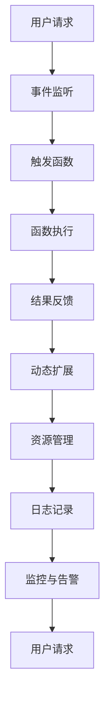

                 

关键词：Serverless架构、事件驱动、云计算、微服务、自动化、可扩展性、无服务器

> 摘要：本文将深入探讨Serverless架构的核心概念、优点、挑战以及未来发展趋势。通过详细的分析和实例，读者将了解到如何利用事件驱动的云计算模型，实现高效、灵活和可扩展的应用开发。

## 1. 背景介绍

在云计算时代，传统的应用程序部署和运维模式正逐渐被Serverless架构所取代。Serverless架构，也称为无服务器架构，是一种云计算部署模型，允许开发者在无需关注服务器管理的情况下，运行和扩展应用程序。这种模型的出现，是为了解决传统云计算中服务器管理和运维的高成本、复杂性和资源浪费等问题。

Serverless架构的核心思想是将服务器管理和运维的责任转移给云服务提供商。开发者只需关注应用程序的逻辑开发，无需担心服务器资源的管理和调配。这种模式不仅提高了开发效率，还降低了运维成本。

### 1.1 传统的云计算模型

在传统的云计算模型中，开发者需要自行购买、配置和管理服务器。这包括以下几个方面：

- **硬件采购**：根据业务需求，选择合适的服务器硬件。
- **操作系统安装**：安装操作系统，并配置必要的软件环境。
- **网络配置**：配置网络，确保服务器能够接入互联网。
- **资源监控与维护**：监控服务器性能，进行必要的维护和升级。

这些操作不仅繁琐，还需要专业的运维团队进行管理。而且，当业务规模扩大时，服务器的数量和配置也需要相应调整，这增加了运营成本。

### 1.2  Serverless架构的优势

Serverless架构通过云服务提供商提供的服务，简化了上述操作。开发者只需编写应用程序代码，并将其部署到云平台，即可实现自动化的服务器管理和资源调配。以下是Serverless架构的主要优势：

- **无服务器管理**：开发者无需关注服务器购买、配置和管理，只需专注于代码开发。
- **自动化扩展**：根据应用负载，自动调整服务器资源，实现无限扩展。
- **低成本**：按需付费，仅根据实际使用量收费，降低了运营成本。
- **高可用性**：云服务提供商提供的高可用性保障，提高了应用稳定性。

## 2. 核心概念与联系

Serverless架构的核心概念包括事件驱动、函数计算、动态扩展等。以下是一个简化的Mermaid流程图，展示了这些概念之间的联系。



### 2.1 事件驱动

事件驱动是一种编程范式，它将程序的执行控制权交给外部事件。在Serverless架构中，事件是触发函数执行的关键因素。例如，一个HTTP请求、数据库变更、消息队列消息等都可以作为事件，触发相应的函数执行。

### 2.2 函数计算

函数计算是一种将代码打包成可执行函数的服务。在Serverless架构中，开发者只需编写函数代码，无需关心底层基础设施。云服务提供商负责运行和管理这些函数，确保它们能够在事件触发时高效、可靠地执行。

### 2.3 动态扩展

动态扩展是Serverless架构的一个关键特性。根据应用负载，云服务提供商会自动调整服务器资源，确保应用性能。这种动态扩展不仅提高了应用的可用性，还降低了运营成本。

## 3. 核心算法原理 & 具体操作步骤

### 3.1 算法原理概述

Serverless架构的核心算法原理是事件驱动和动态扩展。事件驱动使得应用程序能够响应外部事件，实现自动化处理。动态扩展则根据应用负载，自动调整服务器资源，确保应用性能。

### 3.2 算法步骤详解

#### 步骤1：事件监听

开发者需要在云平台上配置事件监听器，以捕获外部事件。事件监听器可以是HTTP请求、数据库变更、消息队列消息等。

#### 步骤2：触发函数

当事件监听器捕获到事件时，会触发相应的函数执行。函数可以是自定义的，也可以是云服务提供商提供的预构建函数。

#### 步骤3：函数执行

函数执行是Serverless架构的核心步骤。开发者只需编写函数逻辑，无需关心底层基础设施。函数执行时，会根据事件类型和数据，进行处理和计算。

#### 步骤4：结果反馈

函数执行完成后，会将结果反馈给用户或下一个环节。结果可以是数据、报告或通知等。

#### 步骤5：动态扩展

根据应用负载，云服务提供商会自动调整服务器资源，确保应用性能。动态扩展可以避免资源浪费，降低运营成本。

### 3.3 算法优缺点

#### 优点：

- **无服务器管理**：简化了服务器管理和运维，降低了运营成本。
- **自动化扩展**：根据应用负载，自动调整服务器资源，提高应用性能。
- **高可用性**：云服务提供商提供的高可用性保障，提高了应用稳定性。
- **灵活可扩展**：支持各种编程语言和框架，易于集成现有应用程序。

#### 缺点：

- **依赖云服务提供商**：服务器管理和运维的责任转移给了云服务提供商，增加了对提供商的依赖。
- **性能瓶颈**：函数执行存在冷启动问题，可能会影响性能。
- **成本风险**：按需付费可能导致成本不稳定，需要合理规划资源使用。

### 3.4 算法应用领域

Serverless架构适用于多种应用领域，包括：

- **Web应用**：例如API网关、后台数据处理等。
- **移动应用**：例如移动推送、后台任务等。
- **数据分析**：例如实时数据处理、大数据分析等。
- **物联网**：例如设备监控、数据采集等。

## 4. 数学模型和公式 & 详细讲解 & 举例说明

### 4.1 数学模型构建

在Serverless架构中，一个重要的数学模型是成本模型。成本模型用于计算应用程序的运营成本，包括服务器费用、网络费用和存储费用等。

#### 成本模型公式：

$$
C = C_{server} + C_{network} + C_{storage}
$$

其中：

- $C$：总成本
- $C_{server}$：服务器费用
- $C_{network}$：网络费用
- $C_{storage}$：存储费用

### 4.2 公式推导过程

#### 步骤1：服务器费用

服务器费用取决于服务器类型、运行时间和区域。假设服务器类型为通用型，运行时间为$T$小时，区域为$R$。

$$
C_{server} = P \times T \times R
$$

其中：

- $P$：服务器价格
- $T$：运行时间
- $R$：区域价格

#### 步骤2：网络费用

网络费用取决于网络流量、流量类型和区域。假设网络流量为$I$GB，流量类型为标准流量，区域为$R$。

$$
C_{network} = I \times N \times R
$$

其中：

- $I$：网络流量
- $N$：流量价格
- $R$：区域价格

#### 步骤3：存储费用

存储费用取决于存储容量、存储类型和区域。假设存储容量为$S$GB，存储类型为标准存储，区域为$R$。

$$
C_{storage} = S \times M \times R
$$

其中：

- $S$：存储容量
- $M$：存储价格
- $R$：区域价格

### 4.3 案例分析与讲解

假设一个应用程序在一个月内使用了以下资源：

- 服务器：100小时，区域：美国东部
- 网络流量：100GB，区域：美国东部
- 存储容量：10GB，区域：美国东部

根据上述公式，我们可以计算该应用程序的成本。

#### 步骤1：计算服务器费用

假设服务器价格为$10$/小时，美国东部区域价格为$1.5$/小时。

$$
C_{server} = 10 \times 100 \times 1.5 = 1500
$$

#### 步骤2：计算网络费用

假设网络流量价格为$0.1$/GB，美国东部区域价格为$0.3$/GB。

$$
C_{network} = 100 \times 0.1 \times 0.3 = 3
$$

#### 步骤3：计算存储费用

假设存储价格为$0.05$/GB，美国东部区域价格为$0.1$/GB。

$$
C_{storage} = 10 \times 0.05 \times 0.1 = 0.5
$$

#### 步骤4：计算总成本

$$
C = C_{server} + C_{network} + C_{storage} = 1500 + 3 + 0.5 = 1503.5
$$

因此，该应用程序在一个月内的总成本为$1503.5$。

## 5. 项目实践：代码实例和详细解释说明

### 5.1 开发环境搭建

在本项目中，我们使用AWS Lambda作为函数计算平台，使用AWS API Gateway作为API网关。以下是开发环境的搭建步骤：

1. **创建AWS账户**：在AWS官网创建一个新的账户。
2. **启用AWS Lambda和API Gateway**：在AWS管理控制台中，启用Lambda和API Gateway服务。
3. **安装AWS CLI**：在本地计算机上安装AWS CLI，用于与AWS服务进行交互。

### 5.2 源代码详细实现

以下是一个简单的示例，用于创建一个RESTful API，当收到HTTP请求时，返回一个欢迎消息。

```python
import json
import os

def lambda_handler(event, context):
    message = os.environ['MESSAGE']
    return {
        'statusCode': 200,
        'body': json.dumps({'message': message})
    }
```

### 5.3 代码解读与分析

1. **导入模块**：首先，导入必要的模块，包括`json`和`os`。
2. **定义函数**：定义`lambda_handler`函数，它是AWS Lambda的入口点。该函数接受两个参数：`event`和`context`。
3. **获取环境变量**：从环境中获取`MESSAGE`变量，该变量用于存储欢迎消息。
4. **返回响应**：构造一个HTTP响应，包含状态码和响应体。状态码为200，表示成功。响应体是一个JSON对象，包含`message`属性，存储欢迎消息。

### 5.4 运行结果展示

1. **部署函数**：将代码上传到AWS Lambda，并部署。
2. **配置API网关**：在AWS API Gateway中，创建一个新的API，并将其与Lambda函数关联。
3. **测试API**：通过浏览器或Postman等工具，向API发送HTTP请求。例如：

   ```plaintext
   GET http://api.example.com
   ```

   接收到的响应如下：

   ```json
   {
     "message": "欢迎使用Serverless架构！"
   }
   ```

   这说明API已成功调用Lambda函数，并返回了预期结果。

## 6. 实际应用场景

### 6.1 Web应用

Serverless架构非常适合构建Web应用。例如，一个基于React和Node.js的博客平台，可以使用AWS Lambda处理用户请求，使用Amazon S3存储图片和文件，使用Amazon API Gateway作为API网关。这样，开发团队可以专注于前端和后端逻辑开发，无需关心服务器管理和运维。

### 6.2 移动应用

移动应用通常需要处理大量并发请求，例如社交网络应用、在线游戏等。使用Serverless架构，可以轻松实现高并发处理。例如，一个移动游戏应用，可以使用AWS Lambda处理用户登录、游戏逻辑和推送通知等，使用Amazon S3存储游戏数据，使用Amazon API Gateway提供API接口。

### 6.3 数据分析

数据分析是Serverless架构的另一个重要应用领域。例如，一个实时数据分析平台，可以使用AWS Lambda处理数据流，使用Amazon Kinesis获取实时数据，使用Amazon S3存储历史数据，使用Amazon Redshift进行数据分析和处理。

### 6.4 物联网

物联网（IoT）应用通常需要处理大量设备数据，例如智能家居、智能工厂等。使用Serverless架构，可以轻松实现设备数据收集、处理和分析。例如，一个智能家居平台，可以使用AWS IoT Core收集设备数据，使用AWS Lambda处理数据，使用Amazon S3存储数据，使用Amazon API Gateway提供设备控制接口。

## 7. 工具和资源推荐

### 7.1 学习资源推荐

- **《Serverless架构实战》**：一本深入浅出的Serverless架构书籍，适合初学者。
- **AWS Lambda官方文档**：AWS Lambda的官方文档，提供了详细的API和使用方法。
- **Serverless Framework**：一个开源的Serverless框架，支持多种云服务提供商。

### 7.2 开发工具推荐

- **Visual Studio Code**：一款强大的代码编辑器，支持多种编程语言和插件。
- **Postman**：一个流行的API测试工具，可以用于测试Serverless架构的API接口。

### 7.3 相关论文推荐

- **"Serverless Computing: Everything You Need to Know"**：一篇介绍Serverless架构的综述论文。
- **"Serverless Architectures: Event-Driven, Scalable, and Resilient"**：一篇深入探讨Serverless架构优缺点的论文。

## 8. 总结：未来发展趋势与挑战

### 8.1 研究成果总结

Serverless架构自推出以来，得到了广泛的关注和认可。随着云计算技术的不断发展，Serverless架构的应用场景越来越广泛，从Web应用、移动应用，到数据分析、物联网等。同时，云服务提供商不断推出新的Serverless服务和工具，降低了开发门槛，提高了开发效率。

### 8.2 未来发展趋势

未来，Serverless架构将继续发展，主要体现在以下几个方面：

- **更丰富的服务生态**：云服务提供商将继续推出更多的Serverless服务和工具，满足不同领域的应用需求。
- **跨云服务能力**：Serverless架构将实现跨云服务提供商的能力，为开发者提供更多的选择和灵活性。
- **开发者友好**：Serverless架构将更加易于使用，降低开发门槛，提高开发效率。

### 8.3 面临的挑战

尽管Serverless架构具有诸多优势，但在实际应用中仍面临一些挑战：

- **性能瓶颈**：函数执行存在冷启动问题，可能会影响性能。
- **成本风险**：按需付费可能导致成本不稳定，需要合理规划资源使用。
- **依赖云服务提供商**：服务器管理和运维的责任转移给了云服务提供商，增加了对提供商的依赖。

### 8.4 研究展望

未来，Serverless架构的研究将主要集中在以下几个方面：

- **性能优化**：研究如何减少函数执行时间，提高性能。
- **成本优化**：研究如何降低成本，提高资源利用率。
- **跨云部署**：研究如何实现跨云服务提供商的部署和管理。

## 9. 附录：常见问题与解答

### 9.1 什么
是Serverless架构？

Serverless架构是一种云计算部署模型，允许开发者无需关注服务器管理，专注于代码开发。该模型将服务器管理和资源调配的责任转移给云服务提供商，实现了自动化扩展、高可用性和低成本。

### 9.2 什
么是事件驱动？

事件驱动是一种编程范式，将程序的执行控制权交给外部事件。在Serverless架构中，事件是触发函数执行的关键因素。

### 9.3 什
么是函数计算？

函数计算是一种将代码打包成可执行函数的服务。在Serverless架构中，开发者只需编写函数代码，无需关心底层基础设施。

### 9.4 什
么是动态扩展？

动态扩展是Serverless架构的一个关键特性，根据应用负载，自动调整服务器资源，确保应用性能。

## 作者署名

作者：禅与计算机程序设计艺术 / Zen and the Art of Computer Programming
----------------------------------------------------------------

接下来，请将以上内容整理成完整的markdown格式文章，并检查所有要求的满足情况。如果您发现任何不符合要求的部分，请及时更正。完成后，我们将对文章进行进一步的审查和优化。

