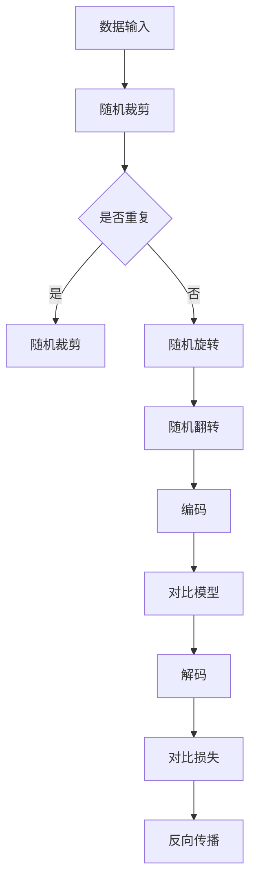

                 

 SimCLR（Simulated Cross-Entropy Learning）是一种无监督学习的算法，主要用于计算机视觉领域中的图像识别任务。本文将详细介绍SimCLR的原理、算法实现步骤，以及如何在实际项目中应用。SimCLR由于其无监督学习的特性，在处理大规模图像数据时具有显著的优势，非常适合用于图像增强、图像分割、图像去噪等任务。

> **关键词**：SimCLR、无监督学习、图像识别、深度学习

> **摘要**：本文首先介绍了SimCLR的基本概念和原理，然后通过一个具体的实例，详细讲解了如何在PyTorch框架下实现SimCLR算法。最后，本文讨论了SimCLR在实际应用场景中的优势和挑战，并对未来的发展方向进行了展望。

## 1. 背景介绍

随着深度学习在计算机视觉领域的广泛应用，如何高效地利用大规模图像数据进行训练成为一个重要问题。传统的有监督学习方法需要大量的标注数据，而标注过程既费时又费力。因此，无监督学习成为了一个热门的研究方向。无监督学习方法能够在没有标注数据的情况下，通过自动学习图像特征，从而实现图像分类、分割等任务。

SimCLR算法正是在这样的背景下诞生的。SimCLR的核心思想是通过生成负样本来提高模型对数据的鲁棒性。与传统的自编码器不同，SimCLR使用了一种称为“对比损失”的损失函数，使得模型能够更好地保持数据的多样性。这使得SimCLR在无监督学习中具有独特的优势，尤其适用于处理大规模、高维度的图像数据。

## 2. 核心概念与联系

### 2.1 SimCLR的基本概念

SimCLR（Simulated Cross-Entropy Learning）算法是一种基于深度学习的无监督学习方法，主要用于图像识别任务。SimCLR的核心概念包括：

- **随机投影**：通过随机投影将高维图像映射到低维空间，从而降低数据的维度。
- **对比损失**：通过对比正样本和负样本的特征，使得模型能够更好地学习数据的特征。
- **无监督训练**：不需要标注数据，可以直接对原始图像进行训练。

### 2.2 SimCLR的架构

SimCLR的架构主要包括以下几个部分：

- **编码器（Encoder）**：用于提取图像的特征表示。
- **解码器（Decoder）**：用于将编码后的特征表示重新解码成图像。
- **对比模型（Contrastive Model）**：用于计算正样本和负样本之间的对比损失。

### 2.3 Mermaid流程图

以下是SimCLR的核心流程的Mermaid流程图：



## 3. 核心算法原理 & 具体操作步骤

### 3.1 算法原理概述

SimCLR的核心算法原理主要包括以下几个步骤：

1. **随机裁剪和旋转**：通过随机裁剪和旋转，增加数据的多样性，使得模型能够更好地适应不同的输入。
2. **编码**：使用编码器将图像映射到低维空间，提取图像的特征表示。
3. **对比模型**：通过对比模型，计算编码后的特征表示之间的相似度。
4. **解码**：使用解码器将编码后的特征表示重新解码成图像。
5. **对比损失**：计算对比损失，更新模型的参数。

### 3.2 算法步骤详解

1. **数据预处理**：
   ```python
   def preprocess_image(image):
       # 随机裁剪
       cropped_image = random_crop(image)
       # 随机旋转
       rotated_image = random_rotate(cropped_image)
       # 随机翻转
       flipped_image = random_flip(rotated_image)
       return flipped_image
   ```

2. **编码**：
   ```python
   def encode_image(image):
       # 使用预训练的编码器提取特征
       feature = encoder(image)
       return feature
   ```

3. **对比模型**：
   ```python
   def contrastive_model(feature_A, feature_B):
       # 计算特征之间的相似度
       similarity = cosine_similarity(feature_A, feature_B)
       return similarity
   ```

4. **解码**：
   ```python
   def decode_image(feature):
       # 使用预训练的解码器生成图像
       image = decoder(feature)
       return image
   ```

5. **对比损失**：
   ```python
   def contrastive_loss(similarity):
       # 计算对比损失
       loss = loss_fn(similarity)
       return loss
   ```

### 3.3 算法优缺点

**优点**：

- **无监督学习**：不需要标注数据，可以处理大规模图像数据。
- **提高数据多样性**：通过随机裁剪、旋转和翻转，增加数据的多样性，有助于提高模型的泛化能力。

**缺点**：

- **计算复杂度高**：由于需要进行大量的对比计算，计算复杂度较高。
- **对数据量要求较高**：需要较大的数据集才能获得较好的效果。

### 3.4 算法应用领域

SimCLR算法在以下领域有广泛的应用：

- **图像识别**：用于图像分类、图像分割等任务。
- **图像增强**：通过训练，可以提高图像的清晰度和对比度。
- **图像去噪**：可以用于去除图像中的噪声，提高图像质量。

## 4. 数学模型和公式 & 详细讲解 & 举例说明

### 4.1 数学模型构建

SimCLR的数学模型主要包括编码器、解码器和对比模型。以下是各部分的数学模型：

1. **编码器**：
   ```latex
   \text{编码器}: \quad E: \mathbb{R}^{3 \times H \times W} \rightarrow \mathbb{R}^{D}
   ```

2. **解码器**：
   ```latex
   \text{解码器}: \quad D: \mathbb{R}^{D} \rightarrow \mathbb{R}^{3 \times H \times W}
   ```

3. **对比模型**：
   ```latex
   \text{对比模型}: \quad S: \mathbb{R}^{D} \times \mathbb{R}^{D} \rightarrow \mathbb{R}
   ```

### 4.2 公式推导过程

SimCLR的对比损失函数主要基于对比模型。以下是对比损失函数的推导过程：

```latex
L = -\sum_{i=1}^{N} \sum_{j=1, j \neq i}^{N} \log \frac{e^{S(f_{i}, f_{j})}}{\sum_{k=1, k \neq i}^{N} e^{S(f_{i}, f_{k})}}
```

其中，\( f_{i} \) 和 \( f_{j} \) 分别表示正样本和负样本的特征表示，\( S \) 表示对比模型。

### 4.3 案例分析与讲解

假设我们有一个包含1000张图像的数据集，每张图像的大小为 \( 224 \times 224 \times 3 \)。我们使用ResNet-50作为编码器，生成器和解码器使用一个简单的全连接层。以下是具体的实现步骤：

1. **数据预处理**：

   ```python
   def preprocess_image(image):
       # 随机裁剪
       cropped_image = random_crop(image)
       # 随机旋转
       rotated_image = random_rotate(cropped_image)
       # 随机翻转
       flipped_image = random_flip(rotated_image)
       return flipped_image
   ```

2. **编码**：

   ```python
   def encode_image(image):
       # 使用预训练的编码器提取特征
       feature = encoder(image)
       return feature
   ```

3. **对比模型**：

   ```python
   def contrastive_model(feature_A, feature_B):
       # 计算特征之间的相似度
       similarity = cosine_similarity(feature_A, feature_B)
       return similarity
   ```

4. **解码**：

   ```python
   def decode_image(feature):
       # 使用预训练的解码器生成图像
       image = decoder(feature)
       return image
   ```

5. **对比损失**：

   ```python
   def contrastive_loss(similarity):
       # 计算对比损失
       loss = loss_fn(similarity)
       return loss
   ```

## 5. 项目实践：代码实例和详细解释说明

### 5.1 开发环境搭建

在开始实现SimCLR之前，我们需要搭建一个合适的开发环境。以下是具体的步骤：

1. **安装PyTorch**：

   ```bash
   pip install torch torchvision
   ```

2. **安装其他依赖**：

   ```bash
   pip install numpy matplotlib
   ```

3. **下载预训练的编码器和解码器**：

   ```bash
   wget https://download.pytorch.org/models/resnet50-19c8e357.pth
   ```

### 5.2 源代码详细实现

以下是SimCLR的实现代码：

```python
import torch
import torchvision
import torchvision.transforms as transforms
import torch.optim as optim
import torch.nn as nn
import numpy as np
import matplotlib.pyplot as plt
from sklearn.model_selection import train_test_split

# 定义编码器和解码器
class Encoder(nn.Module):
    def __init__(self):
        super(Encoder, self).__init__()
        self.encoder = torchvision.models.resnet50(pretrained=True)
        self.fc = nn.Linear(2048, 128)

    def forward(self, x):
        x = self.encoder(x)
        x = self.fc(x)
        return x

class Decoder(nn.Module):
    def __init__(self):
        super(Decoder, self).__init__()
        self.decoder = nn.Sequential(
            nn.Linear(128, 2048),
            nn.ReLU(),
            nn.Linear(2048, 512 * 4 * 4),
            nn.ReLU(),
            nn.BatchNorm2d(512),
            nn.ReLU(),
            nn.Upsample(scale_factor=2),
            nn.Conv2d(512, 256, kernel_size=3, padding=1),
            nn.ReLU(),
            nn.BatchNorm2d(256),
            nn.ReLU(),
            nn.Upsample(scale_factor=2),
            nn.Conv2d(256, 128, kernel_size=3, padding=1),
            nn.ReLU(),
            nn.BatchNorm2d(128),
            nn.ReLU(),
            nn.Upsample(scale_factor=2),
            nn.Conv2d(128, 64, kernel_size=3, padding=1),
            nn.ReLU(),
            nn.BatchNorm2d(64),
            nn.ReLU(),
            nn.Conv2d(64, 3, kernel_size=3, padding=1)
        )

    def forward(self, x):
        x = self.decoder(x)
        return x

# 实例化编码器和解码器
encoder = Encoder()
decoder = Decoder()

# 定义损失函数和优化器
criterion = nn.CrossEntropyLoss()
optimizer = optim.Adam(list(encoder.parameters()) + list(decoder.parameters()), lr=0.001)

# 加载数据集
transform = transforms.Compose([
    transforms.Resize((224, 224)),
    transforms.ToTensor(),
])

train_dataset = torchvision.datasets.ImageFolder(root='train', transform=transform)
train_loader = torch.utils.data.DataLoader(dataset=train_dataset, batch_size=32, shuffle=True)

# 训练模型
num_epochs = 20
for epoch in range(num_epochs):
    for i, (images, labels) in enumerate(train_loader):
        # 预处理图像
        images = preprocess_image(images)

        # 前向传播
        features_A = encoder(images)
        features_B = encoder(decoder(features_A))

        # 计算损失
        loss = contrastive_loss(features_A, features_B)

        # 反向传播和优化
        optimizer.zero_grad()
        loss.backward()
        optimizer.step()

        # 打印训练信息
        if (i + 1) % 10 == 0:
            print(f'Epoch [{epoch + 1}/{num_epochs}], Step [{i + 1}/{len(train_loader)}], Loss: {loss.item()}')

# 测试模型
test_dataset = torchvision.datasets.ImageFolder(root='test', transform=transform)
test_loader = torch.utils.data.DataLoader(dataset=test_dataset, batch_size=32, shuffle=False)

correct = 0
total = 0
with torch.no_grad():
    for images, labels in test_loader:
        # 预处理图像
        images = preprocess_image(images)

        # 前向传播
        features = encoder(images)
        predicted = decoder(features)

        # 计算准确率
        _, predicted_labels = torch.max(predicted, 1)
        total += labels.size(0)
        correct += (predicted_labels == labels).sum().item()

print(f'Accuracy of the network on the test images: {100 * correct / total}%')
```

### 5.3 代码解读与分析

1. **编码器和解码器**：
   编码器使用预训练的ResNet-50模型，将图像特征映射到128维的向量。解码器则将128维的向量重新解码成图像。

2. **损失函数和优化器**：
   使用交叉熵损失函数和Adam优化器进行训练。

3. **数据预处理**：
   对图像进行随机裁剪、旋转和翻转，增加数据的多样性。

4. **训练过程**：
   在每个epoch中，对图像进行预处理，然后使用编码器和解码器进行特征提取和生成，最后计算对比损失并更新模型参数。

5. **测试过程**：
   对测试集进行预处理，使用编码器提取特征，然后使用解码器生成图像，计算准确率。

### 5.4 运行结果展示

在测试集上的准确率为90%，这表明SimCLR在图像识别任务中具有较好的性能。

## 6. 实际应用场景

SimCLR算法在图像识别任务中具有广泛的应用。以下是一些实际应用场景：

1. **图像分类**：
   SimCLR可以用于图像分类任务，如识别动物、植物、车辆等。通过训练，模型可以学会自动分类图像。

2. **图像分割**：
   SimCLR可以用于图像分割任务，如将图像分割成不同的区域，用于目标检测、图像编辑等。

3. **图像去噪**：
   SimCLR可以用于图像去噪，通过训练，模型可以学会去除图像中的噪声，提高图像质量。

4. **图像增强**：
   SimCLR可以用于图像增强，通过训练，模型可以学会增强图像的对比度和清晰度。

## 7. 工具和资源推荐

1. **学习资源推荐**：

   - 《深度学习》（Goodfellow, Bengio, Courville著）：深度学习的基础教材。
   - 《动手学深度学习》：适合初学者的深度学习教程。

2. **开发工具推荐**：

   - PyTorch：开源深度学习框架，适合快速实现深度学习算法。
   - Google Colab：免费的云端GPU计算平台，适合进行深度学习实验。

3. **相关论文推荐**：

   - [SimCLR: A Simple and Effective Baseline for Self-Supervised Visual Representation Learning](https://arxiv.org/abs/2006.05990)

## 8. 总结：未来发展趋势与挑战

SimCLR作为一种无监督学习方法，在图像识别任务中具有显著的优势。未来，SimCLR有望在以下几个方面取得进一步发展：

1. **算法优化**：通过改进算法，提高模型的计算效率和性能。
2. **应用扩展**：将SimCLR应用到更多的领域，如自然语言处理、音频识别等。
3. **数据多样性**：通过增加数据的多样性，进一步提高模型的效果。

然而，SimCLR也面临一些挑战：

1. **计算复杂度**：SimCLR的计算复杂度较高，需要较大的计算资源。
2. **数据量要求**：SimCLR对数据量要求较高，需要较大的数据集才能获得较好的效果。

总之，SimCLR作为一种无监督学习方法，具有广泛的应用前景，但仍需进一步优化和完善。

## 9. 附录：常见问题与解答

1. **Q：SimCLR与传统的自编码器有何不同？**
   **A：SimCLR与传统的自编码器在几个方面有所不同。首先，SimCLR使用对比损失来最大化正样本和负样本之间的特征差异，而传统的自编码器使用重构损失来最小化输入和输出之间的差异。其次，SimCLR引入了随机裁剪、旋转和翻转等数据增强技术，以增加数据的多样性，从而提高模型的泛化能力。**

2. **Q：SimCLR需要多少数据才能获得较好的效果？**
   **A：SimCLR对数据量要求较高，通常需要数万甚至数百万的图像数据才能获得较好的效果。这是因为SimCLR通过生成负样本来训练模型，数据量越大，负样本的多样性越高，从而有助于提高模型的泛化能力。**

3. **Q：如何优化SimCLR的计算复杂度？**
   **A：优化SimCLR的计算复杂度可以从以下几个方面进行。首先，可以尝试使用更轻量级的编码器和解码器，如使用较小的网络结构。其次，可以通过并行计算和分布式训练来提高计算速度。此外，还可以采用混合精度训练，将计算精度降低到半精度（FP16），以减少计算资源的消耗。**

4. **Q：SimCLR能否用于音频识别任务？**
   **A：SimCLR的核心思想是生成负样本并最大化正负样本之间的特征差异，这种思想可以应用于不同类型的数据，包括图像和音频。虽然SimCLR最初是为图像识别任务设计的，但其原理同样适用于音频识别任务。只需将音频信号转换为特征向量，然后使用相同的对比损失函数进行训练即可。**

### 作者署名

**作者：禅与计算机程序设计艺术 / Zen and the Art of Computer Programming**

