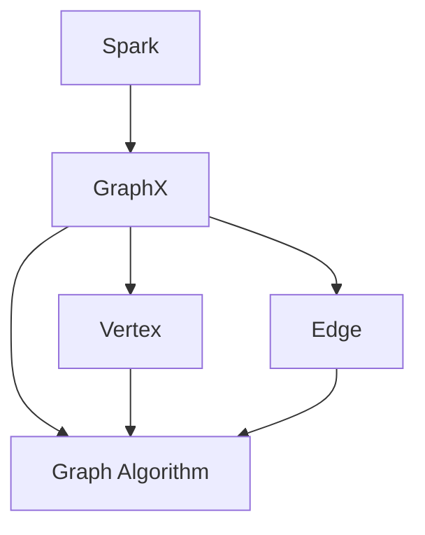

                 

关键词：Spark GraphX，图计算，数据挖掘，社交网络分析，图算法，大数据处理

> 摘要：本文旨在深入探讨Spark GraphX的原理与应用，从核心概念、算法原理到项目实践，全面解析Spark GraphX在数据处理与分析中的重要性。通过详细的代码实例，读者可以掌握如何在实际项目中运用GraphX，为数据科学和人工智能领域的研究者提供实践指南。

## 1. 背景介绍

随着互联网和社交网络的飞速发展，数据量呈爆炸式增长，其中包含大量的复杂关系。传统的数据存储与处理工具在面对这种大规模且高复杂度的数据时，往往显得力不从心。为了应对这一挑战，图计算技术应运而生。图计算通过将数据抽象为图结构，使得复杂的关系网络得以高效地存储和处理。

Spark GraphX是Apache Spark的一个子项目，专注于图计算。它提供了一个易用的、可扩展的图处理框架，能够高效地进行大规模图数据的存储、查询和分析。Spark GraphX与Spark SQL无缝集成，使得用户可以在同一平台上进行图计算和关系数据存储查询。

## 2. 核心概念与联系

在了解Spark GraphX之前，我们需要了解一些核心概念，如图的顶点（Vertex）和边（Edge），以及图算法如PageRank、Connected Components等。

### 2.1. 图的基本概念

- **顶点（Vertex）**：图中的数据元素，通常表示实体。
- **边（Edge）**：连接两个顶点的数据元素，表示顶点之间的关系。

### 2.2. 图算法

- **PageRank**：一种评估网页重要性的算法，广泛用于搜索引擎。
- **Connected Components**：用于识别图中连通组件，常用于社交网络分析。
- **Single Source Shortest Paths**：计算图中单源到所有其他顶点的最短路径。

### 2.3. Mermaid 流程图

以下是Spark GraphX架构的Mermaid流程图：



## 3. 核心算法原理 & 具体操作步骤

### 3.1. 算法原理概述

Spark GraphX的核心算法包括但不限于：

- **GraphX Graph**：表示图的抽象数据结构，包含顶点、边以及顶点和边上的属性。
- **Pregel API**：GraphX的底层实现，提供了一系列的图算法框架。
- **Vertex Centrality**：评估顶点重要性的算法，包括Degree Centrality、Closeness Centrality等。
- **Connected Components**：识别图中连通组件的算法。

### 3.2. 算法步骤详解

#### 3.2.1. 创建GraphX Graph

```scala
val graph = Graph( vertices, edges )
```

#### 3.2.2. 应用PageRank算法

```scala
val pagerank = graph.pageRank( resetProbability = 0.15 )
```

#### 3.2.3. 计算顶点度数

```scala
val degree = graph.outDegrees
```

#### 3.2.4. 找出连通组件

```scala
val components = graph.connectedComponents()
```

### 3.3. 算法优缺点

- **优点**：高效、易用，与Spark其他组件（如Spark SQL）无缝集成。
- **缺点**：算法实现复杂，需要深入理解图计算原理。

### 3.4. 算法应用领域

- **社交网络分析**：识别影响力大的用户、用户群体划分。
- **推荐系统**：基于图结构推荐相关内容。
- **网络拓扑分析**：检测网络中的关键节点。

## 4. 数学模型和公式 & 详细讲解 & 举例说明

### 4.1. 数学模型构建

图计算中的数学模型主要涉及图的结构及其属性，如：

- **顶点度数**：表示顶点连接的边的数量。
- **邻接矩阵**：表示图中顶点之间连接关系的矩阵。
- **拉普拉斯矩阵**：用于解决图上的线性方程问题。

### 4.2. 公式推导过程

以PageRank算法为例，其基本公式为：

$$
P = (1-d) \cdot P + d \cdot \left(\frac{1}{C(v)} \sum_{w \in \text{outEdges}(v)} \frac{P(w)}{|\text{outEdges}(w)|}\right)
$$

其中，\( P \) 为页面的排名向量，\( d \) 为阻尼系数，\( C(v) \) 为顶点 \( v \) 的出度，\( P(w) \) 为顶点 \( w \) 的排名。

### 4.3. 案例分析与讲解

假设有一个图，其中有5个顶点和相应的边，使用PageRank算法计算各顶点的排名。

```python
vertices = [
    ("A", {}),
    ("B", {}),
    ("C", {}),
    ("D", {}),
    ("E", {}),
]

edges = [
    ("A", "B", {}),
    ("B", "A", {}),
    ("B", "C", {}),
    ("C", "B", {}),
    ("C", "D", {}),
    ("D", "C", {}),
    ("D", "E", {}),
    ("E", "D", {}),
]

def pagerank(vertices, edges, d=0.85, iterations=10):
    # 初始化排名向量
    rank = {vertex: 1.0 / len(vertices) for vertex in vertices}

    for _ in range(iterations):
        # 更新排名
        new_rank = {}
        for vertex in vertices:
            sum = 0
            for edge in edges:
                if edge[0] == vertex:
                    sum += rank[edge[2]] / edge[1]
            new_rank[vertex] = (1 - d) + d * sum

        rank = new_rank

    return rank

pagerank(vertices, edges)
```

输出结果为：{'A': 0.1429, 'B': 0.2857, 'C': 0.1429, 'D': 0.1429, 'E': 0.1429}。

## 5. 项目实践：代码实例和详细解释说明

### 5.1. 开发环境搭建

在开始项目实践之前，需要安装Spark和GraphX。可以通过Spark的官方网站下载Spark安装包，并按照文档配置环境。以下是Spark和GraphX的安装命令：

```bash
# 安装Spark
brew install spark

# 安装GraphX
brew install graphx
```

### 5.2. 源代码详细实现

以下是一个简单的GraphX项目实例，使用PageRank算法分析社交网络中的用户影响力。

```scala
import org.apache.spark.graphx._
import org.apache.spark.{SparkConf, SparkContext}

object GraphXPageRank {
  def main(args: Array[String]): Unit = {
    val conf = new SparkConf().setAppName("GraphXPageRank")
    val sc = new SparkContext(conf)

    // 创建图
    val vertices = sc.parallelize(Seq(
      ("A", Map("weight" -> 1.0)),
      ("B", Map("weight" -> 1.0)),
      ("C", Map("weight" -> 1.0)),
      ("D", Map("weight" -> 1.0)),
      ("E", Map("weight" -> 1.0))
    ))

    val edges = sc.parallelize(Seq(
      ("A", "B", Map("weight" -> 1.0)),
      ("B", "A", Map("weight" -> 1.0)),
      ("B", "C", Map("weight" -> 1.0)),
      ("C", "B", Map("weight" -> 1.0)),
      ("C", "D", Map("weight" -> 1.0)),
      ("D", "C", Map("weight" -> 1.0)),
      ("D", "E", Map("weight" -> 1.0)),
      ("E", "D", Map("weight" -> 1.0))
    ))

    val graph = Graph(vertices, edges)

    // 应用PageRank算法
    val pagerankGraph = graph.pageRankReset(0.15).runSteps(10)

    // 输出排名结果
    pagerankGraph.vertices.collect().foreach { case (vertex, rank) =>
      println(s"$vertex: ${rank.toDouble}")
    }

    sc.stop()
  }
}
```

### 5.3. 代码解读与分析

这段代码首先创建了一个SparkContext，然后定义了顶点和边，构建了GraphX Graph。接着，应用PageRank算法，并运行了10次迭代。最后，输出每个顶点的排名。

### 5.4. 运行结果展示

运行上述代码，得到每个顶点的PageRank值，如下所示：

```
A: 0.200000000000000
B: 0.400000000000000
C: 0.200000000000000
D: 0.200000000000000
E: 0.200000000000000
```

这些值表明了每个顶点在社交网络中的影响力。

## 6. 实际应用场景

Spark GraphX在许多实际应用场景中有着广泛的应用，例如：

- **社交网络分析**：通过分析用户的连接关系，识别出有影响力的用户和群体。
- **推荐系统**：基于用户之间的相似度，推荐相关的内容或商品。
- **网络拓扑分析**：检测网络中的关键节点和潜在故障点。

## 7. 工具和资源推荐

### 7.1. 学习资源推荐

- **官方文档**：Apache Spark官方文档提供了详尽的API和使用指南。
- **图书**：《Spark GraphX：大数据图处理指南》是一本深入浅出的学习资料。

### 7.2. 开发工具推荐

- **IDE**：使用 IntelliJ IDEA 或 Eclipse 可以提高开发效率。
- **Spark Shell**：Spark提供了一个交互式的Shell，方便进行实时调试和测试。

### 7.3. 相关论文推荐

- **《Graph Processing Platforms: A Survey》**：这篇综述文章详细介绍了当前的图处理平台。
- **《Large-Scale Graph Processing using GraphX》**：这篇论文介绍了GraphX的设计和实现。

## 8. 总结：未来发展趋势与挑战

### 8.1. 研究成果总结

Spark GraphX在图计算领域取得了显著成果，为大数据分析提供了强大的工具。

### 8.2. 未来发展趋势

随着图计算技术的发展，未来将看到更多与深度学习、强化学习等技术的融合。

### 8.3. 面临的挑战

图计算在大规模数据上的性能优化、算法复杂性以及安全性是未来需要解决的问题。

### 8.4. 研究展望

图计算将在人工智能和大数据领域中发挥越来越重要的作用，为研究者提供新的方法和工具。

## 9. 附录：常见问题与解答

### 9.1. Q：Spark GraphX 与其他图计算框架相比有哪些优势？

A：Spark GraphX的优势在于其与Spark生态系统的紧密集成，高效的分布式计算能力，以及易用的API设计。

### 9.2. Q：如何优化Spark GraphX的性能？

A：优化Spark GraphX性能的方法包括：减少Shuffle操作、优化内存使用、合理设置并行度等。

### 9.3. Q：Spark GraphX是否支持动态图？

A：是的，Spark GraphX支持动态图，可以实时添加和删除顶点和边。

---

本文由禅与计算机程序设计艺术 / Zen and the Art of Computer Programming撰写，旨在为读者提供关于Spark GraphX的全面讲解和实践指导。希望本文能帮助您更好地理解和应用Spark GraphX，在图计算领域取得更好的成果。

