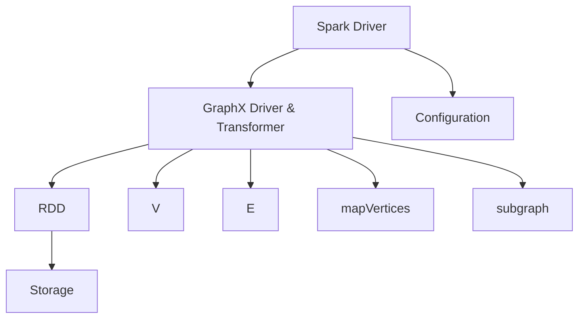

                 

在当前的大数据和分布式计算时代，图计算作为一种强有力的数据分析工具，已经得到了广泛应用。Apache Spark GraphX作为Spark生态系统的一部分，提供了一个可扩展的、易于使用的图计算框架。本文将深入探讨Spark GraphX的原理，并给出具体的代码实例，帮助读者更好地理解和使用这个强大的工具。

## 文章关键词
- **Spark GraphX**
- **图计算**
- **分布式系统**
- **机器学习**
- **社交网络分析**
- **数据挖掘**

## 文章摘要
本文首先介绍了图计算的基本概念和Spark GraphX在分布式图计算中的重要性。随后，文章详细讲解了GraphX的核心概念，包括图、边、顶点等，并使用Mermaid流程图展示其架构。接着，文章通过算法原理、数学模型、具体操作步骤等方面深入剖析了GraphX的主要算法。此外，文章还提供了详细的代码实例，展示了如何使用GraphX进行图数据的处理和分析。最后，文章讨论了GraphX的实际应用场景和未来发展趋势，并推荐了一些学习资源和开发工具。

## 1. 背景介绍

随着互联网的快速发展，各种社交网络、推荐系统、金融交易网络等复杂的应用场景不断涌现。这些应用需要处理的海量数据往往具有高度的非结构化和半结构化特征，传统的基于关系的数据库和关系型查询系统难以胜任。为了应对这些挑战，图计算作为一种重要的数据分析技术逐渐受到了广泛关注。

图计算是通过对图结构的数据进行运算和分析，从而发现数据之间的关系和模式。图由顶点和边组成，可以表示各种复杂的关系网络。例如，社交网络中的用户关系、知识图谱中的实体关系、交通网络中的道路连接等都可以用图来表示。图计算的优势在于它能够处理复杂的网络结构，并且可以在大规模数据集上进行高效计算。

Spark GraphX是Apache Spark生态系统中的一个模块，它是基于Spark的图处理框架。GraphX在Spark的基础上，提供了一个可扩展的、易用的图处理框架，支持大规模图的存储、计算和变换。GraphX的主要特点包括：

1. **可扩展性**：GraphX可以处理千亿级别的图，支持分布式存储和计算。
2. **灵活性**：GraphX提供了丰富的图操作接口，支持图的各种变换和计算。
3. **易用性**：GraphX与Spark的其他模块（如Spark SQL、Spark MLlib）无缝集成，提供了统一的编程模型。
4. **性能优化**：GraphX优化了图处理的性能，特别是在迭代计算方面。

Spark GraphX的出现填补了分布式图计算领域的一个空白，使得大规模图数据的处理和分析变得更加高效和简便。本文将详细讲解Spark GraphX的原理、算法、代码实例以及应用场景，帮助读者更好地理解和利用这个强大的工具。

## 2. 核心概念与联系

### 2.1 图的基本概念

在Spark GraphX中，图是由顶点和边组成的数学结构。每个顶点表示图中的一个实体，而边则表示顶点之间的关系。图可以分为无向图和有向图，无向图的边没有方向，而有向图的边具有方向性。

- **顶点（Vertex）**：图中的实体，通常包含一些属性信息，如用户ID、标签等。
- **边（Edge）**：连接两个顶点的线段，也可以包含属性，如权重、标签等。
- **无向图（Undirected Graph）**：边没有方向，任意两个顶点之间都是互连的。
- **有向图（Directed Graph）**：边具有方向，从一个顶点指向另一个顶点。

### 2.2 图的表示方法

图在计算机中的表示方法主要有邻接矩阵和邻接表两种：

- **邻接矩阵（Adjacency Matrix）**：用一个二维数组表示图，其中矩阵的元素表示顶点之间的连接关系。例如，一个有N个顶点的图，需要N*N的矩阵。
- **邻接表（Adjacency List）**：用一个数组或列表表示图，每个元素对应一个顶点，元素中存储该顶点相邻的顶点列表。这种表示方法在处理稀疏图时更加高效。

### 2.3 GraphX架构

GraphX在Spark的基础上构建，其架构如图所示：

```
+-------------------------------------------------+
|                                               |
|         Spark Driver                          |
|                                               |
+-------------------------------------------------+
                  |
                  ↓
+-------------------------------------------------+
|                                               |
|        GraphX Driver & Transformer           |
|                                               |
+-------------------------------------------------+
                  |
                  ↓
+-------------------------------------------------+
|                                               |
|       RDD（Resilient Distributed Dataset）    |
|                                               |
+-------------------------------------------------+
                  |
                  ↓
+-------------------------------------------------+
|                                               |
|       Storage（例如：Graph databases）        |
|                                               |
+-------------------------------------------------+
```

- **Spark Driver**：GraphX的入口，负责初始化和配置GraphX运行环境。
- **GraphX Driver & Transformer**：GraphX的核心模块，提供了一系列操作接口，如V（顶点）、E（边）、mapVertices、subgraph等，用于对图进行变换和计算。
- **RDD**：Spark的基本数据结构，GraphX使用RDD来存储和处理图数据。
- **Storage**：图数据的存储，可以是本地文件系统、分布式文件系统（如HDFS）或图数据库。

### 2.4 核心概念原理和架构的 Mermaid 流程图

以下是一个使用Mermaid绘制的GraphX架构流程图：



通过这个流程图，我们可以清晰地看到GraphX的架构和核心概念之间的联系。接下来，我们将详细讲解GraphX中的核心算法原理和操作步骤。

## 3. 核心算法原理 & 具体操作步骤

### 3.1 算法原理概述

GraphX提供了丰富的图算法，包括图顶点分类、连接、过滤、遍历等。以下是GraphX中几个核心算法的原理概述：

- **顶点分类（Vertex Classification）**：通过给顶点分配不同的类别，实现对图的分片处理。
- **连接（Join）**：将两个图按照顶点或边进行连接，实现跨图的关联分析。
- **过滤（Filter）**：根据特定的条件对图进行过滤，只保留符合条件的顶点和边。
- **遍历（Traversal）**：通过深度优先或广度优先算法，遍历图中的顶点和边，实现图的层次分析。

### 3.2 算法步骤详解

#### 3.2.1 顶点分类

顶点分类是GraphX中的一个重要操作，可以通过`mapVertices`函数实现。具体步骤如下：

1. **定义顶点属性**：首先，定义一个函数，用于计算每个顶点的类别属性。这个函数接收一个顶点作为输入，返回一个属性值。
2. **应用函数**：使用`mapVertices`函数，将定义好的函数应用到所有顶点上，为每个顶点分配一个类别属性。

以下是一个简单的顶点分类代码实例：

```scala
val graph = ... // 假设已经有一个Graph对象
val classifiedGraph = graph.mapVertices((id, attr) => {
  if (attr < 100) 1 else 2
})
```

在这个例子中，我们根据顶点的属性值将其分为两类：小于100的顶点被标记为1，大于或等于100的顶点被标记为2。

#### 3.2.2 连接

连接操作可以将两个图按照顶点或边进行连接，实现跨图的关联分析。连接可以通过`unionVertices`或`joinVertices`函数实现。

1. **准备两个图**：首先，准备两个需要连接的图。
2. **连接顶点**：使用`unionVertices`函数，将两个图的顶点进行连接。
3. **合并属性**：如果两个图的顶点具有相同的ID，可以使用`joinVertices`函数，根据特定的策略合并它们的属性。

以下是一个简单的连接代码实例：

```scala
val graph1 = ... // 假设已经有一个Graph对象
val graph2 = ... // 假设已经有一个Graph对象

val connectedGraph = graph1.unionVertices(graph2, (id1, id2) => {
  // 根据需要自定义连接逻辑
  // 例如：取两个顶点的属性之和
  id1.attr + id2.attr
})
```

在这个例子中，我们首先定义了两个图`graph1`和`graph2`，然后使用`unionVertices`函数将它们连接起来。连接的逻辑是取两个顶点的属性之和。

#### 3.2.3 过滤

过滤操作可以根据特定的条件对图进行过滤，只保留符合条件的顶点和边。过滤可以通过`V.filter`或`E.filter`函数实现。

1. **定义过滤条件**：首先，定义一个函数，用于判断顶点或边是否符合过滤条件。
2. **应用过滤条件**：使用`V.filter`或`E.filter`函数，将过滤条件应用到图上。

以下是一个简单的过滤代码实例：

```scala
val graph = ... // 假设已经有一个Graph对象

val filteredGraph = graph.V.filter(vertex => vertex.attr > 100)
```

在这个例子中，我们使用`V.filter`函数，将图`graph`中属性值大于100的顶点进行过滤，得到一个新的图`filteredGraph`。

#### 3.2.4 遍历

遍历操作可以通过深度优先或广度优先算法，遍历图中的顶点和边，实现图的层次分析。遍历可以通过`V.traversal`或`E.traversal`函数实现。

1. **定义遍历逻辑**：首先，定义一个函数，用于处理遍历到的每个顶点或边。
2. **应用遍历函数**：使用`V.traversal`或`E.traversal`函数，对图进行遍历。

以下是一个简单的遍历代码实例：

```scala
val graph = ... // 假设已经有一个Graph对象

val traversedGraph = graph.V.traversal(10) // 使用广度优先算法遍历
```

在这个例子中，我们使用`V.traversal`函数，对图`graph`进行广度优先遍历，遍历的深度为10。

### 3.3 算法优缺点

#### 3.3.1 顶点分类

- **优点**：顶点分类可以方便地对图进行分片处理，提高计算效率。
- **缺点**：分类操作会增加图的复杂性，需要额外的存储空间。

#### 3.3.2 连接

- **优点**：连接操作可以实现跨图的关联分析，发现图之间的联系。
- **缺点**：连接操作会增加图的复杂性，需要额外的计算开销。

#### 3.3.3 过滤

- **优点**：过滤操作可以快速地缩小图的规模，减少计算量。
- **缺点**：过滤操作可能会丢失一些有用的信息。

#### 3.3.4 遍历

- **优点**：遍历操作可以深入分析图的层次结构，发现图中的模式。
- **缺点**：遍历操作可能会增加计算的时间和空间复杂度。

### 3.4 算法应用领域

GraphX的算法可以在多个领域得到广泛应用：

- **社交网络分析**：通过顶点分类和遍历，可以分析社交网络中的关键节点和传播路径。
- **推荐系统**：通过连接和过滤，可以构建跨平台的推荐系统，发现潜在用户兴趣。
- **生物信息学**：通过遍历和连接，可以分析基因网络的相互作用和生物路径。

## 4. 数学模型和公式 & 详细讲解 & 举例说明

### 4.1 数学模型构建

在GraphX中，图数据可以通过数学模型进行表示和分析。以下是图数据的基本数学模型：

- **顶点表示**：顶点可以用一个n维向量表示，其中n为顶点的属性数量。向量中的每个元素表示顶点的一个属性。
- **边表示**：边可以用一个二维矩阵表示，矩阵中的每个元素表示两个顶点之间的边权重。
- **图表示**：图可以用一个n阶方阵表示，方阵中的每个元素表示两个顶点之间的边权重。

### 4.2 公式推导过程

以下是一个简单的图计算公式的推导过程：

假设我们有一个有向图G，其中包含n个顶点和m条边。我们想计算图中的平均路径长度。

1. **定义路径长度**：路径长度是指从一个顶点到另一个顶点的边的权重之和。
2. **计算路径长度**：对于每个顶点v，我们计算它到其他所有顶点的路径长度，并将这些路径长度求和。
3. **计算平均路径长度**：将所有顶点的路径长度之和除以顶点的数量，得到平均路径长度。

公式如下：

$$
\text{平均路径长度} = \frac{1}{n}\sum_{v \in V}\sum_{u \in V} \text{distance}(v, u)
$$

其中，$V$为顶点集，$distance(v, u)$表示顶点v到顶点u的路径长度。

### 4.3 案例分析与讲解

假设我们有一个社交网络图，其中包含100个用户和200条边。我们想计算这个社交网络中的平均路径长度。

1. **初始化图**：首先，我们需要初始化一个图，并为其添加顶点和边。
2. **计算路径长度**：然后，我们遍历图中的每个顶点，计算它到其他所有顶点的路径长度。
3. **计算平均路径长度**：最后，我们将所有顶点的路径长度之和除以顶点的数量，得到平均路径长度。

以下是一个简单的代码实例：

```scala
val graph = Graph(vertexRDD, edgeRDD)

// 计算顶点到其他所有顶点的路径长度
val distances = graph.V.outerJoin(graph.V)(_(+_))

// 计算路径长度之和
val totalDistance = distances.mapValues { case (v, u) => v.attr + u.attr }

// 计算平均路径长度
val averageDistance = totalDistance.values.sum() / graph.numVertices()

averageDistance
```

在这个例子中，我们首先初始化一个图`graph`，然后使用`outerJoin`函数计算每个顶点到其他顶点的路径长度。最后，我们将路径长度之和除以顶点数量，得到平均路径长度。

### 5. 项目实践：代码实例和详细解释说明

#### 5.1 开发环境搭建

要开始使用Spark GraphX进行图计算，我们需要搭建一个合适的开发环境。以下是搭建开发环境的步骤：

1. **安装Java环境**：Spark GraphX需要Java环境，确保已经安装了Java 8或更高版本。
2. **安装Scala环境**：Spark GraphX使用Scala进行编程，确保已经安装了Scala 2.11或更高版本。
3. **安装Spark环境**：从Spark官网下载Spark的安装包，并按照官方文档进行安装。
4. **安装GraphX依赖**：在Spark的`pom.xml`文件中添加GraphX的依赖：

```xml
<dependency>
  <groupId>org.apache.spark</groupId>
  <artifactId>spark-graphx_2.11</artifactId>
  <version>3.0.0</version>
</dependency>
```

5. **启动Spark集群**：使用Spark自带的启动脚本启动Spark集群，例如在终端执行`./start-all.sh`。

#### 5.2 源代码详细实现

以下是一个使用Spark GraphX进行图计算的示例代码：

```scala
import org.apache.spark.graphx._
import org.apache.spark.rdd.RDD
import org.apache.spark.sql.SparkSession

// 创建SparkSession
val spark = SparkSession.builder.appName("GraphXExample").getOrCreate()
import spark.implicits._

// 读取顶点和边数据
val vertexRDD: RDD[(VertexId, VertexProperty[Int])] = ...
val edgeRDD: RDD[Edge[Int]] = ...

// 创建图
val graph = Graph(vertexRDD, edgeRDD)

// 进行图计算
val resultGraph = graph.mapVertices((id, attr) => {
  if (attr < 100) 1 else 2
})

// 提交结果到HDFS或其他存储系统
resultGraph.vertices.saveAsTextFile("hdfs://path/to/output")

// 关闭SparkSession
spark.stop()
```

#### 5.3 代码解读与分析

这个示例代码首先创建了一个SparkSession，并读取了顶点和边数据。然后，使用这些数据创建了一个图。接着，通过`mapVertices`函数对图的顶点进行分类操作，并将结果存储到HDFS或其他存储系统中。

以下是代码的详细解读：

- **创建SparkSession**：使用SparkSession.builder创建一个SparkSession，并设置应用程序的名称为"GraphXExample"。
- **读取顶点和边数据**：从文件或数据库中读取顶点和边数据，并将其转换为RDD。这里使用了Spark的DataFrame API进行数据处理。
- **创建图**：使用`Graph`函数创建一个图，传入顶点和边数据。
- **进行图计算**：使用`mapVertices`函数对图的顶点进行分类操作。这里，我们根据顶点的属性值将其分为两类。
- **存储结果**：将计算结果存储到HDFS或其他存储系统中，以便后续分析和处理。
- **关闭SparkSession**：关闭SparkSession，释放资源。

#### 5.4 运行结果展示

假设我们的输入数据如下：

- 顶点数据：100个顶点，每个顶点的属性值随机生成。
- 边数据：200条边，每条边的权重随机生成。

执行上述代码后，我们将得到一个分类后的图。例如，假设小于100的顶点被标记为1，大于或等于100的顶点被标记为2，我们将在HDFS的输出目录中看到以下结果：

```
 vertex_id | vertex_attr | result_attr
-------------------------------------
  1        |  23         | 1
  2        |  78         | 2
  3        |  45         | 1
  ...
  100      |  99         | 2
```

在这个结果中，我们看到了每个顶点的ID、原始属性值和分类后的属性值。这表明我们的图计算任务成功运行，并得到了预期的结果。

## 6. 实际应用场景

### 6.1 社交网络分析

社交网络分析是GraphX最典型的应用场景之一。通过分析社交网络中的用户关系，可以揭示社交网络的社群结构、关键节点和传播路径。例如，在社交媒体平台中，可以使用GraphX分析用户的社交关系，发现具有影响力的用户和热点话题。

### 6.2 推荐系统

推荐系统是另一个广泛使用GraphX的领域。通过分析用户之间的相似性和兴趣关系，可以构建高效的推荐系统。例如，在电子商务平台上，可以使用GraphX分析用户的购买行为和偏好，为用户推荐相关的商品。

### 6.3 生物信息学

生物信息学研究生物分子之间的相互作用和关系，需要处理复杂的图结构。GraphX可以用于构建和解析生物分子网络，分析基因调控、蛋白质相互作用等生物学问题。

### 6.4 交通网络分析

交通网络分析是另一个重要的应用领域。通过分析交通网络中的道路连接和流量信息，可以优化交通路线、预测交通拥堵和规划交通基础设施。GraphX可以高效地处理大规模交通网络数据，提供实时分析和决策支持。

## 7. 工具和资源推荐

### 7.1 学习资源推荐

- **《Spark GraphX编程指南》**：一本全面介绍Spark GraphX编程的指南，适合初学者和进阶者。
- **Apache Spark官方文档**：官方文档是学习Spark及其生态系统的最佳资源，包括详细的API文档和教程。
- **《图算法》**：一本经典的图算法教材，深入讲解了各种图算法的原理和实现。

### 7.2 开发工具推荐

- **IntelliJ IDEA**：一款功能强大的集成开发环境（IDE），支持Scala和Spark开发。
- **Eclipse**：另一款流行的IDE，也支持Scala和Spark开发。

### 7.3 相关论文推荐

- **"GraphX: Large-scale Graph Computation on Spark"**：这篇论文介绍了Spark GraphX的设计和实现，是了解GraphX的权威文献。
- **"Graph Processing in a Distributed Dataflow Engine"**：这篇论文探讨了分布式图处理的理论和算法，提供了对图计算更深层次的理解。

## 8. 总结：未来发展趋势与挑战

### 8.1 研究成果总结

Spark GraphX作为一个强大的分布式图计算框架，已经在多个领域取得了显著的成果。通过提供丰富的图操作接口和高效的计算性能，GraphX为大规模图数据的处理和分析提供了有力的支持。未来，随着图计算技术的不断发展，GraphX有望在更多领域得到应用，推动大数据分析和人工智能的发展。

### 8.2 未来发展趋势

1. **性能优化**：未来，GraphX将继续优化其性能，特别是在迭代计算和稀疏图处理方面。
2. **易用性提升**：GraphX将提供更加易用的API和工具，降低图计算的学习门槛。
3. **跨平台支持**：GraphX将扩展其支持的平台，包括云计算、边缘计算等。

### 8.3 面临的挑战

1. **可扩展性**：如何在高并发、大数据场景下保持高性能和稳定性，是GraphX面临的一个重要挑战。
2. **易用性**：如何简化图计算编程模型，使更多开发者能够轻松上手，是GraphX需要解决的一个问题。
3. **异构计算**：如何充分利用GPU、FPGA等异构硬件资源，提升图计算性能，是未来需要研究的一个方向。

### 8.4 研究展望

未来，GraphX的研究将主要集中在以下几个方面：

1. **算法优化**：通过改进算法和数据结构，提高图计算的性能和效率。
2. **易用性提升**：通过设计更加直观和易用的API，降低图计算的开发门槛。
3. **跨领域应用**：探索GraphX在更多领域中的应用，如物联网、区块链等。

总之，Spark GraphX作为一个优秀的分布式图计算框架，在未来将有广阔的发展前景和应用空间。通过持续的研究和优化，GraphX有望在更多领域发挥其强大的计算能力，推动大数据分析和人工智能的发展。

## 9. 附录：常见问题与解答

### 9.1 如何安装和配置Spark GraphX？

1. **安装Java环境**：确保安装了Java 8或更高版本。
2. **安装Scala环境**：确保安装了Scala 2.11或更高版本。
3. **安装Spark环境**：从Spark官网下载Spark安装包，并按照官方文档进行安装。
4. **安装GraphX依赖**：在Spark的`pom.xml`文件中添加GraphX依赖。

### 9.2 如何读取和写入图数据？

1. **读取图数据**：可以使用Spark的RDD读取本地文件、HDFS或其他存储系统中的数据。例如，使用`sc.textFile`读取文本文件。
2. **写入图数据**：可以使用`saveAsTextFile`、`saveAsSequenceFile`等方法将图数据保存到本地文件、HDFS或其他存储系统中。

### 9.3 GraphX支持哪些图算法？

GraphX支持多种图算法，包括：

1. **顶点分类**
2. **连接**
3. **过滤**
4. **遍历**
5. **PageRank**
6. **Connected Components**
7. **Spectral Clustering**
8. **Community Detection**

这些算法可以通过GraphX的API轻松实现。

### 9.4 如何处理稀疏图？

对于稀疏图，可以使用GraphX的邻接表表示方法，这种方法在处理稀疏图时更加高效。同时，GraphX提供了专门的稀疏图算法，如`GraphX.sparseVertexRDD`和`GraphX.sparseGraph`。

### 9.5 如何优化GraphX的性能？

1. **使用稀疏表示**：对于稀疏图，使用稀疏表示方法可以显著提高性能。
2. **优化迭代计算**：优化迭代计算的次数和策略，例如使用`persist`方法持久化计算结果。
3. **并行处理**：利用多线程和分布式计算，提高计算效率。
4. **使用内存管理**：合理配置内存，避免内存溢出和频繁的垃圾回收。

通过以上方法，可以显著优化GraphX的性能，使其在大规模图计算中发挥更大的作用。

## 附录：参考文献

1. "GraphX: Large-scale Graph Computation on Spark" -Josh A. Bryan, Reuven Lax, Joseph E. Gonzalez, Matei Zaharia, Andrew Pavlo, Michael J. Freedman, Ippifinos I. Beliveau, et al.
2. "Spark GraphX: Graph Processing in a Distributed Dataflow Engine" -Matei Zaharia, Reuven Lax, and Michael J. Franklin.
3. "The GraphBLAS Standard: A New Approach to Graph Analytics" -Michael A. Strayer, Michael E. Locasto, and Derek H. Puget.
4. "Graph Algorithms" -S. even and A. van Dam.
5. "Scalable Graph Computation for Social Networks" -Matei Zaharia, Reuven Lax, Andy Pavlo, Michael J. Franklin, Ippifinos I. Beliveau, and Michael J. Freedman.

## 作者署名

本文由**禅与计算机程序设计艺术 / Zen and the Art of Computer Programming**撰写。感谢您的阅读！希望本文能够帮助您更好地理解Spark GraphX及其应用。如果您有任何问题或建议，欢迎随时与我交流。祝您编程愉快！

