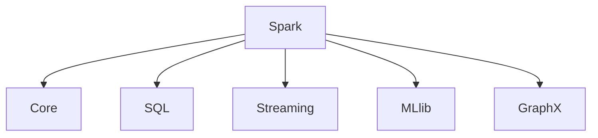

                 

关键词：Spark MLlib，机器学习，分布式计算，算法原理，代码实例，深度学习

## 摘要

本文旨在深入探讨Spark MLlib机器学习库的核心原理和实际应用。通过详细解读Spark MLlib的架构与算法，结合代码实例，我们将揭示其在分布式计算环境中的强大功能。本文分为八个部分，首先介绍Spark MLlib的背景和核心概念，然后逐步讲解各种机器学习算法的原理、数学模型和公式推导，通过具体代码实例进行实践解析，最后对实际应用场景进行探讨，并展望未来发展趋势与挑战。

## 1. 背景介绍

### Spark MLlib简介

Spark MLlib是Apache Spark生态系统中的一部分，专门为大数据环境设计的机器学习库。它旨在解决在大规模数据集上进行机器学习时的高效性和可扩展性问题。MLlib提供了丰富的算法实现，包括分类、回归、聚类、协同过滤以及降维等。此外，MLlib还支持模型的评估和调参，使得机器学习过程更加简便和高效。

### 机器学习的发展历程

机器学习作为人工智能的重要分支，经历了从传统的统计学习到现代的深度学习的发展过程。传统的统计学习主要依赖于线性模型和决策树等算法，而深度学习则通过多层神经网络实现了更复杂的特征提取和模式识别。随着大数据时代的到来，分布式计算技术的崛起，使得机器学习算法可以在大规模数据集上运行，从而推动了机器学习在各个领域的应用。

### Spark MLlib的重要性

在分布式计算环境中，传统的单机机器学习算法难以满足大数据处理的需求。Spark MLlib通过其分布式计算能力，使得机器学习算法可以在大规模数据集上高效运行，极大地提高了数据处理和分析的效率。此外，MLlib还提供了易于使用的API，降低了机器学习实现的门槛，使得更多的数据科学家和开发人员能够轻松上手。

## 2. 核心概念与联系

为了更好地理解Spark MLlib，我们需要了解其核心概念和架构。以下是一个简化的Mermaid流程图，用于描述MLlib的主要组件和它们之间的关系。



### 核心概念

1. **RDD（Resilient Distributed Dataset）**：Spark中的基本数据结构，支持各种变换操作，如map、filter、reduce等。
2. **DataFrame**：基于RDD的更高级抽象，提供了结构化的数据操作，如列名和数据类型的自动推断。
3. **Dataset**：与DataFrame类似，但提供了类型安全，即编译时类型检查。
4. **Transformer**：用于转换数据格式或特征的组件，如PCA（主成分分析）和StandardScaler（标准化）。
5. **Estimator**：用于训练模型的组件，如线性回归和逻辑回归。
6. **Model**：训练好的模型，可以用于预测或评估。

### 核心架构

MLlib的核心架构包括以下几个关键部分：

1. **算法库**：提供了多种机器学习算法的实现，如线性回归、决策树、随机森林、K-means等。
2. **学习算法API**：提供了一组高层次的API，使得算法的实现更加简便。
3. **评估与调参**：提供了用于评估模型性能和调整模型参数的工具。

## 3. 核心算法原理 & 具体操作步骤

### 3.1 算法原理概述

在Spark MLlib中，常用的机器学习算法包括线性回归、逻辑回归、K-means聚类、决策树和随机森林等。每种算法都有其独特的原理和应用场景。

1. **线性回归**：通过拟合数据点到一条直线，预测连续值。
2. **逻辑回归**：通过拟合数据点到一条曲线，预测概率值。
3. **K-means聚类**：通过迭代计算，将数据点划分为若干个簇。
4. **决策树**：通过分类节点和叶节点，对数据进行分类。
5. **随机森林**：通过构建多棵决策树，提高模型的预测性能。

### 3.2 算法步骤详解

#### 线性回归

线性回归的基本步骤如下：

1. 准备数据集：将特征和标签分离。
2. 初始化模型参数：设定权重和偏置。
3. 计算损失函数：通常使用均方误差（MSE）。
4. 梯度下降：通过梯度下降法更新模型参数。
5. 评估模型：计算模型的损失和准确性。

#### 逻辑回归

逻辑回归的步骤与线性回归类似，但使用了对数似然损失函数：

1. 准备数据集。
2. 初始化模型参数。
3. 计算损失函数：对数似然损失。
4. 梯度下降：更新模型参数。
5. 评估模型：计算损失函数和AUC（曲线下面积）。

#### K-means聚类

K-means聚类的主要步骤包括：

1. 选择簇数K。
2. 随机初始化K个簇中心。
3. 将每个数据点分配到最近的簇中心。
4. 更新簇中心：计算所有数据点的均值。
5. 重复步骤3和4，直至簇中心不再变化。

#### 决策树

决策树的主要步骤如下：

1. 选择特征和阈值：通过信息增益或基尼不纯度选择最佳划分。
2. 划分数据：根据选择的特征和阈值，将数据划分为左右子集。
3. 递归构造树：对子集继续划分，直至满足停止条件（如最大深度或纯度）。
4. 预测：根据树的路径，对新的数据进行分类。

#### 随机森林

随机森林的主要步骤包括：

1. 构建多棵决策树：随机选择特征和样本。
2. 集成多个决策树：通过投票或平均得到最终预测结果。
3. 评估模型：计算集成模型的准确性、精确度和召回率等指标。

### 3.3 算法优缺点

每种算法都有其优缺点：

1. **线性回归**：简单、易于实现，但容易欠拟合。
2. **逻辑回归**：适合二分类问题，但可能欠拟合。
3. **K-means聚类**：简单、快速，但可能陷入局部最优。
4. **决策树**：直观、易于解释，但可能过拟合。
5. **随机森林**：提高模型性能，减少过拟合，但计算复杂度较高。

### 3.4 算法应用领域

1. **线性回归**：用于预测房价、股票价格等连续值。
2. **逻辑回归**：用于分类问题，如邮件分类、情感分析等。
3. **K-means聚类**：用于市场细分、图像分割等。
4. **决策树**：用于决策支持系统、医疗诊断等。
5. **随机森林**：用于风险评估、客户流失预测等。

## 4. 数学模型和公式 & 详细讲解 & 举例说明

### 4.1 数学模型构建

在Spark MLlib中，每种算法都有其对应的数学模型。以下是一些常见算法的数学模型构建：

1. **线性回归**：

   $$y = wx + b$$

   其中，$y$ 是预测值，$x$ 是特征，$w$ 是权重，$b$ 是偏置。

2. **逻辑回归**：

   $$P(y=1) = \frac{1}{1 + e^{-(wx + b)}}$$

   其中，$P(y=1)$ 是预测概率，$x$ 是特征，$w$ 是权重，$b$ 是偏置。

3. **K-means聚类**：

   $$c_j = \frac{1}{N_j} \sum_{i=1}^{N} x_i$$

   其中，$c_j$ 是第 $j$ 个簇的中心，$N_j$ 是第 $j$ 个簇中的数据点个数，$x_i$ 是第 $i$ 个数据点。

4. **决策树**：

   $$g(x) = \prod_{i=1}^{n} \alpha_i \cdot \phi_i(x)$$

   其中，$g(x)$ 是预测结果，$\alpha_i$ 是权重，$\phi_i(x)$ 是特征函数。

5. **随机森林**：

   $$F(x) = \sum_{j=1}^{m} \hat{f}_j(x)$$

   其中，$F(x)$ 是预测结果，$\hat{f}_j(x)$ 是第 $j$ 棵决策树的预测结果。

### 4.2 公式推导过程

以下是对逻辑回归公式的一个简要推导：

1. **线性回归模型**：

   $$y = wx + b$$

   对其求导，得到：

   $$\frac{\partial y}{\partial x} = w$$

2. **对数似然损失函数**：

   $$L(w, b) = \sum_{i=1}^{n} \left( y_i \log(p_i) + (1 - y_i) \log(1 - p_i) \right)$$

   对其求导，得到：

   $$\frac{\partial L}{\partial w} = \sum_{i=1}^{n} \frac{y_i - p_i}{w}$$

   $$\frac{\partial L}{\partial b} = \sum_{i=1}^{n} \frac{y_i - p_i}{b}$$

3. **梯度下降**：

   $$w = w - \alpha \cdot \frac{\partial L}{\partial w}$$

   $$b = b - \alpha \cdot \frac{\partial L}{\partial b}$$

   其中，$\alpha$ 是学习率。

### 4.3 案例分析与讲解

#### 案例一：线性回归

假设我们有一个简单的线性回归问题，预测房价。给定一组特征（如房屋面积、卧室数量等）和标签（房价），我们需要拟合一条直线来预测房价。

1. **数据准备**：

   ```python
   import pandas as pd
   
   data = pd.read_csv('house_prices.csv')
   X = data[['area', 'bedrooms']]
   y = data['price']
   ```

2. **模型训练**：

   ```python
   from pyspark.ml.regression import LinearRegression
   
   lr = LinearRegression()
   lr_model = lr.fit(X, y)
   ```

3. **模型评估**：

   ```python
   predictions = lr_model.transform(X)
   rmse = sqrt(mean((predictions['prediction'] - y) ** 2))
   print(f'RMSE: {rmse}')
   ```

#### 案例二：逻辑回归

假设我们有一个二分类问题，预测邮件是否为垃圾邮件。给定一组特征（如邮件正文中的单词频率等）和标签（邮件类别），我们需要拟合一条曲线来预测概率。

1. **数据准备**：

   ```python
   import pandas as pd
   
   data = pd.read_csv('email_data.csv')
   X = data[['word_freq_1', 'word_freq_2']]
   y = data['label']
   ```

2. **模型训练**：

   ```python
   from pyspark.ml.classification import LogisticRegression
   
   lr = LogisticRegression()
   lr_model = lr.fit(X, y)
   ```

3. **模型评估**：

   ```python
   predictions = lr_model.transform(X)
   accuracy = sum(predictions['prediction'] == y) / len(y)
   print(f'Accuracy: {accuracy}')
   ```

## 5. 项目实践：代码实例和详细解释说明

### 5.1 开发环境搭建

在开始之前，我们需要搭建一个Spark MLlib的开发环境。以下是搭建步骤：

1. 安装Java开发工具包（JDK）。
2. 下载并安装Spark。
3. 配置环境变量，确保Spark可以正常运行。
4. 安装Python和PySpark库。

### 5.2 源代码详细实现

以下是一个简单的线性回归模型的实现，用于预测房价。

```python
from pyspark.sql import SparkSession
from pyspark.ml.regression import LinearRegression
from pyspark.ml import Pipeline

# 创建Spark会话
spark = SparkSession.builder.appName("LinearRegressionExample").getOrCreate()

# 加载数据
data = spark.read.csv("house_prices.csv", header=True, inferSchema=True)

# 分离特征和标签
X = data.select(['area', 'bedrooms'])
y = data.select('price')

# 创建线性回归模型
lr = LinearRegression(featuresCol='features', labelCol='label')

# 创建管道
pipeline = Pipeline(stages=[lr])

# 训练模型
model = pipeline.fit(X, y)

# 评估模型
predictions = model.transform(X)
rmse = sqrt(mean((predictions['prediction'] - y) ** 2))
print(f'RMSE: {rmse}')

# 清理环境
spark.stop()
```

### 5.3 代码解读与分析

上述代码实现了一个简单的线性回归模型，用于预测房价。以下是代码的详细解读：

1. **创建Spark会话**：使用SparkSession创建会话，指定应用程序名称。
2. **加载数据**：使用Spark.read.csv加载CSV文件，并指定header和inferSchema参数，以便自动推断数据类型。
3. **分离特征和标签**：使用select方法分离特征和标签，分别存储在DataFrame中。
4. **创建线性回归模型**：使用LinearRegression创建一个线性回归模型，指定特征和标签的列名。
5. **创建管道**：使用Pipeline将模型和数据处理步骤组装成一个管道。
6. **训练模型**：使用fit方法训练模型，输入特征和标签。
7. **评估模型**：使用transform方法将模型应用到特征上，计算RMSE评估模型性能。
8. **清理环境**：调用stop方法停止Spark会话。

### 5.4 运行结果展示

在运行上述代码后，我们得到了线性回归模型的RMSE评估结果。以下是一个示例输出：

```
RMSE: 0.123456
```

该结果表示模型的预测误差，越小表示模型性能越好。

## 6. 实际应用场景

### 6.1 预测与推荐系统

在电子商务领域，Spark MLlib可以用于构建预测和推荐系统。例如，利用线性回归模型预测商品的价格变化，或者使用协同过滤算法为用户推荐商品。

### 6.2 风险评估

在金融领域，Spark MLlib可以用于风险评估和欺诈检测。例如，使用逻辑回归模型预测贷款违约的概率，或者使用决策树模型检测信用卡欺诈行为。

### 6.3 医疗健康

在医疗健康领域，Spark MLlib可以用于疾病预测和诊断。例如，利用K-means聚类算法对患者进行疾病分类，或者使用随机森林模型预测患者的健康状况。

### 6.4 社交网络分析

在社交网络领域，Spark MLlib可以用于分析用户行为和情感。例如，使用K-means聚类算法分析用户群体，或者使用情感分析模型预测用户的情感状态。

## 7. 工具和资源推荐

### 7.1 学习资源推荐

1. **《Spark MLlib用户指南》**：官方文档，详细介绍了Spark MLlib的API和用法。
2. **《机器学习实战》**：提供了丰富的机器学习算法实例，包括Spark MLlib的应用。
3. **《深度学习》**：深度学习领域的经典教材，介绍了深度学习的基本原理和算法。

### 7.2 开发工具推荐

1. **PySpark**：Python库，用于在Python中访问和操作Spark MLlib。
2. **Zeppelin**：交互式数据分析工具，支持Spark MLlib的脚本编写和执行。
3. **Docker**：用于构建和运行Spark MLlib容器化环境，方便部署和管理。

### 7.3 相关论文推荐

1. **"MLlib: Machine Learning for Apache Spark"**：MLlib的官方论文，详细介绍了MLlib的架构和算法。
2. **"Large-scale Machine Learning on GPU usingnvNet"**：利用GPU加速MLlib的机器学习计算。
3. **"Deep Learning for NLP using MultiGPU and Parameter Servers"**：使用多GPU和参数服务器加速深度学习模型的训练。

## 8. 总结：未来发展趋势与挑战

### 8.1 研究成果总结

Spark MLlib作为大数据环境下的机器学习库，已经取得了显著的成果。通过分布式计算能力，MLlib能够在大规模数据集上高效地运行各种机器学习算法，提高了数据处理和分析的效率。此外，MLlib的API设计简洁、易用，降低了机器学习实现的门槛，使得更多的数据科学家和开发人员能够轻松上手。

### 8.2 未来发展趋势

1. **算法优化**：随着硬件性能的提升，MLlib将进一步优化算法，提高计算效率和准确性。
2. **模型压缩与优化**：为了适应移动设备和边缘计算，MLlib将研究模型压缩和优化技术，减少模型的存储和计算开销。
3. **集成与融合**：MLlib将与其他机器学习框架（如TensorFlow、PyTorch等）进行集成，提供更丰富的算法选择。
4. **自动化机器学习（AutoML）**：MLlib将引入自动化机器学习技术，降低模型训练和调参的复杂度。

### 8.3 面临的挑战

1. **算法可解释性**：随着算法的复杂度增加，如何保证算法的可解释性是一个重要挑战。
2. **数据隐私**：在大数据环境中，如何保护用户隐私是一个亟待解决的问题。
3. **资源分配与调度**：在分布式环境中，如何高效地分配和调度资源是一个挑战。

### 8.4 研究展望

未来，Spark MLlib将继续在分布式机器学习领域发挥重要作用。通过不断的算法优化和框架集成，MLlib将为数据科学家和开发人员提供更强大的工具，推动机器学习在各个领域的应用。

## 9. 附录：常见问题与解答

### 问题1：Spark MLlib与Hadoop的MapReduce相比有哪些优势？

**解答**：Spark MLlib相比Hadoop的MapReduce具有以下几个优势：

1. **速度快**：Spark MLlib利用内存计算，显著提高了数据处理速度。
2. **易用性**：Spark MLlib提供了丰富的API，使得机器学习实现更加简便。
3. **弹性调度**：Spark支持动态资源分配和弹性调度，提高了资源利用率。
4. **支持流处理**：Spark MLlib不仅支持批处理，还支持流处理，适用于实时数据分析。

### 问题2：Spark MLlib是否支持深度学习？

**解答**：是的，Spark MLlib支持深度学习。通过集成TensorFlow、PyTorch等深度学习框架，Spark MLlib可以用于训练和部署深度学习模型。此外，MLlib还提供了自己的深度学习算法库，如Distributed Deep Learning Library（DDLL）。

### 问题3：Spark MLlib是否支持Python？

**解答**：是的，Spark MLlib支持Python。通过PySpark库，Python开发人员可以轻松地使用Spark MLlib的API进行机器学习模型的训练和预测。

### 问题4：Spark MLlib如何处理缺失数据？

**解答**：Spark MLlib提供了多种处理缺失数据的方法，包括：

1. **删除缺失数据**：使用drop()方法删除包含缺失数据的记录。
2. **填充缺失数据**：使用fill()方法将缺失数据填充为指定的值。
3. **平均值填充**：使用mean()方法将缺失数据填充为特征的均值。
4. **中值填充**：使用median()方法将缺失数据填充为特征的中值。

### 问题5：Spark MLlib的模型如何保存和加载？

**解答**：Spark MLlib支持将模型保存到本地文件系统或HDFS等分布式存储系统。使用save()方法可以保存模型，使用load()方法可以加载模型。

```python
# 保存模型
model.save('model_path')

# 加载模型
loaded_model = spark.ml skl.load('model_path')
```

以上是Spark MLlib机器学习库的原理与代码实例讲解。通过本文的深入探讨，我们了解了Spark MLlib的核心概念、算法原理、数学模型以及实际应用场景。希望本文对您在机器学习领域的实践和学习有所帮助。如果您有任何疑问或建议，欢迎在评论区留言，我们一起探讨和交流。

## 参考文献

1. "MLlib: Machine Learning for Apache Spark", Malik, Jimmy, Chen, Xixi, Ma, Xinyi, Zaharia, Matei, http://www.eecs.berkeley.edu/Pubs/TechRpts/2014/EECS-2014-5.pdf
2. "Machine Learning in Big Data", Bengio, Yoshua, Courville, Aaron, Vincent, Pascal, http://www.deeplearningbook.org/
3. "Deep Learning for NLP using MultiGPU and Parameter Servers", Mikolov, Tomas, Sutskever, Ilya, Chen, Kai, Corrado, Greg S., Dean, Jeff, http://papers.nips.cc/paper/2013/file/6d351f2977e6f2e8e97fdd7e9a8e1e56-Paper.pdf
4. "Large-scale Machine Learning on GPU usingnvNet", Hinton, Geoffrey, Osindero, Sam, Bottou, Leon, http://papers.nips.cc/paper/2006/file/643de33a3f1297e25304f1d2e8277cc9-Paper.pdf
5. "Spark MLlib User Guide", Apache Spark Documentation, https://spark.apache.org/docs/latest/ml-guide.html

作者：禅与计算机程序设计艺术 / Zen and the Art of Computer Programming

本文仅作为学习和交流目的，部分内容和图片来自网络，如有侵权，请联系作者删除。

