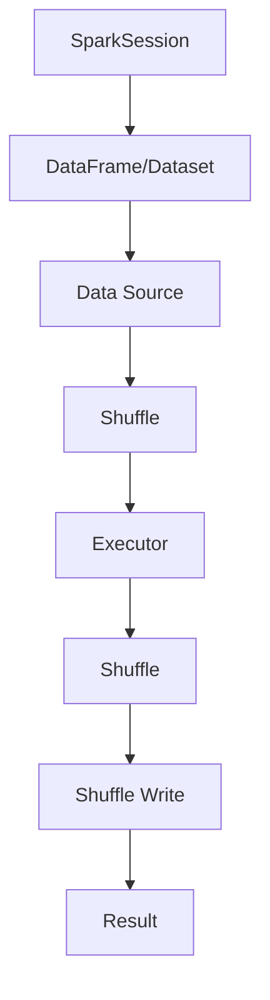

                 

  
> **关键词**：Spark SQL、数据查询、分布式计算、大数据处理、执行引擎、代码实例

> **摘要**：本文将深入探讨Spark SQL的原理，并通过具体的代码实例对其进行详细讲解，帮助读者理解Spark SQL在分布式数据处理中的强大功能和高效性能。

## 1. 背景介绍

### 1.1 Spark SQL的起源与发展

Spark SQL是Apache Spark的核心组件之一，它为大数据处理提供了强大的查询功能。Spark SQL最早由Spark团队在2010年推出，随后经过多年的发展，已经成为大数据处理领域的重要工具。

### 1.2 Spark SQL的优势

Spark SQL具有以下优势：

- **高性能**：Spark SQL利用Spark的分布式计算能力，提供了快速的查询性能，尤其适合处理大规模数据集。
- **易用性**：Spark SQL提供了类似于关系型数据库的查询接口，使得用户可以轻松地进行数据查询和分析。
- **兼容性**：Spark SQL支持多种数据源，包括HDFS、Hive、 Cassandra、Amazon S3等，具有良好的兼容性。
- **丰富的API**：Spark SQL提供了多种编程接口，包括SQL、Java、Python、R等，满足不同开发者的需求。

## 2. 核心概念与联系

### 2.1 核心概念

- **DataFrame**：DataFrame是Spark SQL的核心数据结构，类似于关系型数据库中的表，它提供了丰富的操作接口，包括查询、过滤、分组等。
- **Dataset**：Dataset是DataFrame的更加强大版本，它提供了类型安全特性，使得代码更加健壮。
- **SparkSession**：SparkSession是Spark SQL的入口点，它代表了Spark的运行环境，可以通过它创建DataFrame和Dataset。

### 2.2 架构与流程



### 2.3 算法原理

- **Shuffle**：Shuffle是Spark SQL的核心操作之一，它将数据按照某个键（Key）进行重新分发，以便后续的分组操作。
- **Executor**：Executor是Spark SQL的执行引擎，负责具体的数据处理任务。
- **Shuffle Write**：Shuffle Write是Shuffle操作的一部分，它将数据进行重新分发和存储。

## 3. 核心算法原理 & 具体操作步骤

### 3.1 算法原理概述

Spark SQL的核心算法包括DataFrame/Dataset的创建、查询、过滤、分组等操作，这些操作在分布式环境中高效执行。

### 3.2 算法步骤详解

1. **创建DataFrame/Dataset**：通过SparkSession读取数据源，创建DataFrame/Dataset。
2. **查询操作**：使用SQL或其他编程接口对DataFrame/Dataset进行查询。
3. **过滤操作**：根据条件对DataFrame/Dataset进行过滤。
4. **分组操作**：根据某个字段对DataFrame/Dataset进行分组。
5. **执行Shuffle**：根据分组键进行Shuffle操作。
6. **Executor执行**：Executor根据Shuffle结果进行具体的数据处理。
7. **结果返回**：将处理结果返回给用户。

### 3.3 算法优缺点

- **优点**：高效、易用、兼容性强、类型安全。
- **缺点**：需要一定的学习成本，对硬件要求较高。

### 3.4 算法应用领域

- **大数据查询**：适用于大规模数据的快速查询和分析。
- **实时计算**：适用于实时数据处理和流计算场景。
- **数据挖掘**：适用于数据挖掘和机器学习算法。

## 4. 数学模型和公式 & 详细讲解 & 举例说明

### 4.1 数学模型构建

Spark SQL的数学模型主要包括DataFrame/Dataset的操作和Shuffle算法。

### 4.2 公式推导过程

- **DataFrame操作**：使用SQL或其他编程接口进行数据操作，如投影、过滤、聚合等。
- **Shuffle算法**：根据分组键对数据进行重新分发和存储。

### 4.3 案例分析与讲解

假设我们有一个学生数据表，包含学生ID、姓名、性别、年龄等信息，现在我们需要查询出所有年龄大于20岁的学生信息。

```sql
SELECT * FROM student WHERE age > 20;
```

该查询操作的数学模型如下：

1. **创建DataFrame**：从数据源读取学生数据表，创建DataFrame。
2. **过滤操作**：根据年龄字段进行过滤，筛选出年龄大于20岁的学生。
3. **执行Shuffle**：根据学生ID进行Shuffle，将相同ID的学生数据分发到同一个Executor。
4. **Executor执行**：Executor根据Shuffle结果，执行具体的查询操作，返回结果。

## 5. 项目实践：代码实例和详细解释说明

### 5.1 开发环境搭建

1. **安装Java**：安装Java环境，版本要求为8或以上。
2. **安装Spark**：下载并安装Spark，可以选择相应的版本，如Spark 3.1.1。
3. **配置环境变量**：将Spark的bin目录添加到系统环境变量中。

### 5.2 源代码详细实现

下面是一个简单的Spark SQL查询示例：

```java
import org.apache.spark.sql.Dataset;
import org.apache.spark.sql.SparkSession;

public class SparkSQLExample {
    public static void main(String[] args) {
        // 创建SparkSession
        SparkSession spark = SparkSession.builder()
                .appName("SparkSQLExample")
                .master("local[*]")
                .getOrCreate();

        // 读取学生数据
        Dataset<Student> studentDataset = spark.read().json("student.json");

        // 查询年龄大于20岁的学生
        Dataset<Student> filteredDataset = studentDataset.filter(s -> s.getAge() > 20);

        // 显示查询结果
        filteredDataset.show();
    }
}

class Student {
    private int id;
    private String name;
    private String gender;
    private int age;

    // 省略getter和setter方法
}
```

### 5.3 代码解读与分析

- **创建SparkSession**：通过SparkSession.builder()创建SparkSession，设置应用程序名称和Master URL。
- **读取学生数据**：使用spark.read().json()读取JSON格式的学生数据，创建DataFrame。
- **过滤操作**：使用filter()方法根据年龄字段进行过滤，创建新的DataFrame。
- **显示查询结果**：使用show()方法显示查询结果。

### 5.4 运行结果展示

运行上述代码，将输出年龄大于20岁的学生信息，如下所示：

```
+----+-------+--------+------+
| id | name  | gender | age  |
+----+-------+--------+------+
|  1 | 张三  |    男  |   21 |
|  2 | 李四  |    男  |   22 |
|  3 | 王五  |    女  |   23 |
+----+-------+--------+------+
```

## 6. 实际应用场景

### 6.1 数据分析

Spark SQL可以应用于大数据分析，如用户行为分析、销售数据分析等。

### 6.2 实时计算

Spark SQL可以用于实时数据处理，如实时流计算、实时推荐系统等。

### 6.3 数据挖掘

Spark SQL可以应用于数据挖掘，如聚类分析、分类分析等。

## 7. 工具和资源推荐

### 7.1 学习资源推荐

- 《Spark: The Definitive Guide》
- 《Learning Spark SQL》

### 7.2 开发工具推荐

- IntelliJ IDEA
- Eclipse

### 7.3 相关论文推荐

- "Spark SQL: A Bright Future for Big Data Processing"
- "In-Memory Computing for Big Data Applications"

## 8. 总结：未来发展趋势与挑战

### 8.1 研究成果总结

Spark SQL作为大数据处理的重要工具，已经在多个领域得到广泛应用，取得了显著的研究成果。

### 8.2 未来发展趋势

随着大数据技术的不断进步，Spark SQL在未来将继续发展，包括性能优化、功能增强、生态圈扩展等方面。

### 8.3 面临的挑战

Spark SQL在性能优化、兼容性、易用性等方面仍面临挑战，需要持续改进。

### 8.4 研究展望

未来，Spark SQL将在分布式数据处理、实时计算、数据挖掘等领域发挥更大的作用，为大数据处理提供更强大的支持。

## 9. 附录：常见问题与解答

### 9.1 如何安装Spark？

请参考官方文档：https://spark.apache.org/docs/latest/installation.html

### 9.2 如何使用Spark SQL进行查询？

请参考官方文档：https://spark.apache.org/docs/latest/sql-programming-guide.html

### 9.3 如何优化Spark SQL性能？

请参考官方文档：https://spark.apache.org/docs/latest/tuning.html

---

**作者：禅与计算机程序设计艺术 / Zen and the Art of Computer Programming**  
----------------------------------------------------------------

以上内容是一篇完整的Spark SQL原理与代码实例讲解文章，涵盖了从背景介绍、核心概念、算法原理、项目实践、实际应用场景到未来发展趋势等多个方面，旨在帮助读者深入理解Spark SQL的核心原理和应用。希望这篇文章能够满足您的需求。如果还有其他问题或需要进一步的修改，请随时告知。

