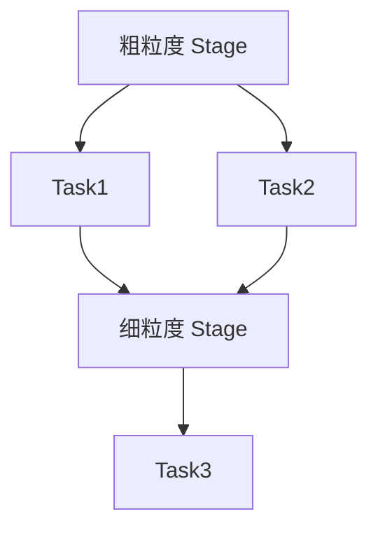
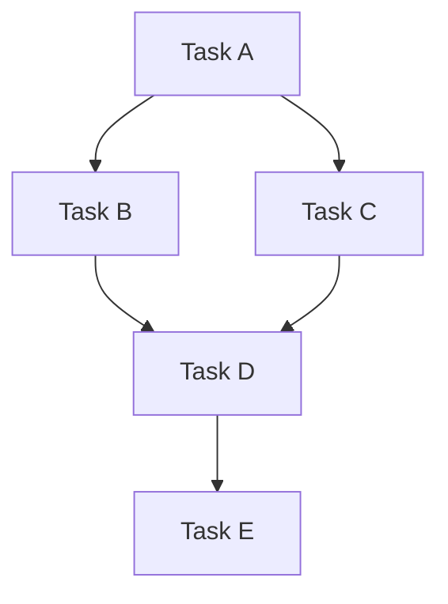

                 

在分布式计算领域，Spark 是一项极为重要的技术。Spark 的核心概念之一就是 Stage。Stage 是 Spark 中的一个关键抽象，它代表了任务在分布式环境下的一个阶段。本文将深入讲解 Spark Stage 的原理，并通过代码实例展示如何使用 Stage 来实现分布式计算。

> 关键词：Spark, Stage, 分布式计算, 任务调度, 代码实例

> 摘要：本文将首先介绍 Spark Stage 的基本概念，随后通过一个简单的代码实例，详细讲解如何构建和执行 Spark Stage，最后讨论 Stage 在实际应用中的重要性以及未来的发展趋势。

## 1. 背景介绍

分布式计算已经成为现代数据处理的基石。随着数据量的急剧增长，传统的单机计算模式已经无法满足需求。分布式计算通过将任务分解并分布到多台计算机上执行，提高了计算效率和扩展性。Apache Spark 是一个广泛应用于大规模数据处理的开源分布式计算框架，它的易用性和高性能使其成为大数据处理领域的佼佼者。

Spark 的核心概念之一是 Stage。Stage 是 Spark 中的基本执行单元，代表了任务在分布式环境下的一个阶段。理解 Stage 的原理对于掌握 Spark 的分布式计算至关重要。本文将详细探讨 Stage 的原理，并通过代码实例来展示如何在实际中应用 Stage。

## 2. 核心概念与联系

### 2.1 Stage 的基本概念

在 Spark 中，一个作业（Job）被拆分成多个阶段（Stage）执行。每个阶段代表了任务的一个子集。Stage 可以进一步细分为两个类型：

- **粗粒度 Stage**：由多个 Task 组成，这些 Task 在同一个分区上执行。
- **细粒度 Stage**：每个 Task 都是一个单独的阶段，它们在不同的分区上执行。

Stage 的划分是基于任务的依赖关系。Spark 会根据任务的依赖关系，将作业拆分成一系列的 Stage。

### 2.2 Stage 之间的依赖关系

Stage 之间的依赖关系决定了任务的执行顺序。Spark 支持两种依赖关系：

- **宽依赖（Shuffle Dependency）**：当一个 Stage 的输出被另一个 Stage 的多个 Task 同时使用时，就形成了宽依赖。宽依赖通常通过 Shuffle 操作实现，例如 Reduce 操作。
- **窄依赖（Narrow Dependency）**：当一个 Stage 的输出仅被下一个 Stage 的一个 Task 使用时，就形成了窄依赖。窄依赖通常通过 Map 操作实现。

### 2.3 Stage 的 Mermaid 流程图

下面是一个简单的 Mermaid 流程图，展示了 Stage 的基本概念和依赖关系：



在上述流程图中，Stage A 包含两个 Task，它们之间存在窄依赖关系。Stage D 是一个细粒度 Stage，包含一个 Task，它依赖于 Stage A 的两个 Task。最后，Stage D 的 Task 又产生了对 Task3 的依赖。

## 3. 核心算法原理 & 具体操作步骤

### 3.1 算法原理概述

Spark Stage 的核心算法原理基于任务的依赖关系。Spark 会根据任务的依赖关系，将作业拆分成一系列的 Stage，并依次执行这些 Stage。每个 Stage 完成后，其结果会被传递给下一个 Stage。

具体来说，Spark 会在以下情况下拆分作业：

- 当任务之间存在宽依赖时，Spark 会将宽依赖的源头任务和下游任务拆分成不同的 Stage。
- 当任务之间存在窄依赖时，Spark 会在同一个 Stage 中执行这些任务。

### 3.2 算法步骤详解

1. **解析作业**：首先，Spark 会解析输入的作业，确定任务之间的依赖关系。
2. **划分 Stage**：根据任务依赖关系，Spark 将作业拆分成多个 Stage。
3. **执行 Stage**：Spark 会依次执行这些 Stage，每个 Stage 完成后，其结果会被传递给下一个 Stage。
4. **完成作业**：当最后一个 Stage 完成后，作业执行完毕。

### 3.3 算法优缺点

#### 优点：

- **高效的任务调度**：Spark 通过划分 Stage，实现了高效的任务调度。每个 Stage 只需要执行一次，减少了重复计算。
- **易于扩展**：Spark 支持多种依赖关系，使其能够适应各种复杂的应用场景。

#### 缺点：

- **宽依赖可能导致性能下降**：当存在宽依赖时，需要执行 Shuffle 操作，这可能会导致性能下降。

### 3.4 算法应用领域

Spark Stage 主要应用于大规模数据处理和实时计算领域。以下是一些典型的应用场景：

- **大数据处理**：Spark Stage 是大数据处理的核心，能够高效地处理大规模数据集。
- **实时计算**：Spark Stage 也广泛应用于实时计算场景，例如实时流处理、实时推荐等。

## 4. 数学模型和公式 & 详细讲解 & 举例说明

### 4.1 数学模型构建

Spark Stage 的数学模型基于任务的依赖关系。假设有 n 个任务，它们之间的依赖关系可以用一个有向无环图（DAG）表示。DAG 的每个节点代表一个任务，每个边代表一个依赖关系。

### 4.2 公式推导过程

给定一个有 n 个节点的 DAG，我们可以使用以下公式计算 Stage 的数量：

$$
S = \sum_{i=1}^{n} (D_i + 1)
$$

其中，$D_i$ 表示节点 i 的入度。

### 4.3 案例分析与讲解

假设我们有一个包含 5 个任务的 DAG，任务之间的依赖关系如下图所示：



根据上述公式，我们可以计算出 Stage 的数量：

$$
S = (1 + 1) + (1 + 1) + (2 + 1) + (2 + 1) + (1 + 1) = 6
$$

因此，这个作业需要 6 个 Stage 才能完成。每个 Stage 包含的任务如下：

- Stage 1：A
- Stage 2：B, C
- Stage 3：D
- Stage 4：D
- Stage 5：E

## 5. 项目实践：代码实例和详细解释说明

### 5.1 开发环境搭建

首先，我们需要搭建一个 Spark 开发环境。以下是搭建步骤：

1. 安装 Java（Spark 需要 Java 运行环境，版本至少为 1.8）
2. 下载并安装 Spark：[Spark 官网](https://spark.apache.org/downloads.html)
3. 配置 Spark 环境变量

完成以上步骤后，我们就可以开始编写 Spark 应用程序了。

### 5.2 源代码详细实现

下面是一个简单的 Spark 应用程序，用于计算一个数字序列的平均值：

```scala
import org.apache.spark.{SparkConf, SparkContext}

object SparkStageExample {
  def main(args: Array[String]): Unit = {
    val conf = new SparkConf().setAppName("Spark Stage Example")
    val sc = new SparkContext(conf)

    // 创建一个数字序列
    val numbers = Seq(1, 2, 3, 4, 5, 6, 7, 8, 9, 10)

    // 将序列数据分布到集群上
    val numbersRDD = sc.parallelize(numbers)

    // 计算平均数
    val average = numbersRDD.aggregate(0)(_ + _, _ / _)

    println(s"Average: $average")

    sc.stop()
  }
}
```

### 5.3 代码解读与分析

上述代码实现了以下功能：

1. **创建 SparkConf 对象**：配置 Spark 应用的名称和其他配置参数。
2. **创建 SparkContext 对象**：连接到 Spark 集群。
3. **创建 RDD**：将数字序列分布到集群上，形成 RDD。
4. **计算平均数**：使用 aggregate 函数计算平均数。
5. **打印结果**：输出计算结果。

### 5.4 运行结果展示

在执行上述代码后，我们得到以下结果：

```
Average: 5.5
```

这表明，给定数字序列的平均值是 5.5。

## 6. 实际应用场景

Spark Stage 在实际应用中具有广泛的应用场景，以下是一些典型的应用：

- **数据清洗**：Spark Stage 可以用于处理大规模数据集的清洗任务，例如去重、过滤等。
- **数据分析**：Spark Stage 可以用于执行复杂的数据分析任务，例如数据挖掘、机器学习等。
- **实时处理**：Spark Stage 可以用于实时处理流数据，例如实时推荐、实时监控等。

## 7. 工具和资源推荐

### 7.1 学习资源推荐

- [Apache Spark 官网](https://spark.apache.org/)
- [Spark Summit 会议资料](https://databricks.com/sparksummit/)
- [Spark 深入实践](https://book.douban.com/subject/26873071/)

### 7.2 开发工具推荐

- [IntelliJ IDEA](https://www.jetbrains.com/idea/)
- [Eclipse](https://www.eclipse.org/)

### 7.3 相关论文推荐

- [Spark: Spark: Spark: A Unified Engine for Big Data Processing](https://spark.apache.org/docs/latest/spark-architecture.html)
- [Resilient Distributed Datasets: A Benchmark](https://www.cs.berkeley.edu/research/randomdata/resilient-datasets.pdf)

## 8. 总结：未来发展趋势与挑战

### 8.1 研究成果总结

Spark Stage 作为 Spark 核心概念之一，已经在分布式计算领域取得了显著的成果。其高效的任务调度和灵活的依赖关系处理，使其成为大规模数据处理和实时计算的重要工具。

### 8.2 未来发展趋势

随着大数据和实时计算需求的增长，Spark Stage 将继续发展，包括：

- **性能优化**：通过改进调度算法和依赖关系处理，提高 Stage 的执行效率。
- **易用性提升**：提供更简洁的 API 和更好的用户界面，降低使用门槛。
- **生态扩展**：与其他大数据技术（如 Hadoop、Flink 等）集成，提供更丰富的应用场景。

### 8.3 面临的挑战

Spark Stage 在实际应用中仍面临一些挑战：

- **资源调度**：如何更有效地分配资源，以提高 Stage 的执行效率。
- **容错机制**：如何提高 Stage 的容错性，以应对分布式环境中的故障。

### 8.4 研究展望

未来的研究可以关注以下几个方面：

- **混合依赖关系处理**：如何处理复杂的多级依赖关系。
- **自适应调度**：如何根据实际负载动态调整 Stage 的执行策略。
- **跨平台兼容性**：如何实现与其他大数据平台的兼容性，以提供更广泛的应用场景。

## 9. 附录：常见问题与解答

### 9.1 什么是 Stage？

Stage 是 Spark 中的一个基本执行单元，代表了任务在分布式环境下的一个阶段。

### 9.2 Stage 和 Task 有什么区别？

Stage 是一组任务的集合，而 Task 是 Stage 中的具体执行单元。

### 9.3 如何优化 Stage 的执行效率？

优化 Stage 的执行效率可以从以下几个方面入手：

- **任务依赖关系优化**：减少宽依赖，提高任务的并行度。
- **资源调度优化**：合理分配资源，提高 Stage 的执行速度。
- **数据本地化**：尽量减少数据传输，提高数据处理的本地性。

----------------------------------------------------------------

以上就是关于 Spark Stage 的详细讲解。通过本文，读者可以全面了解 Spark Stage 的原理、算法、应用以及未来发展趋势。希望本文能为读者在分布式计算领域提供有价值的参考。感谢阅读！

---

**作者：禅与计算机程序设计艺术 / Zen and the Art of Computer Programming**

