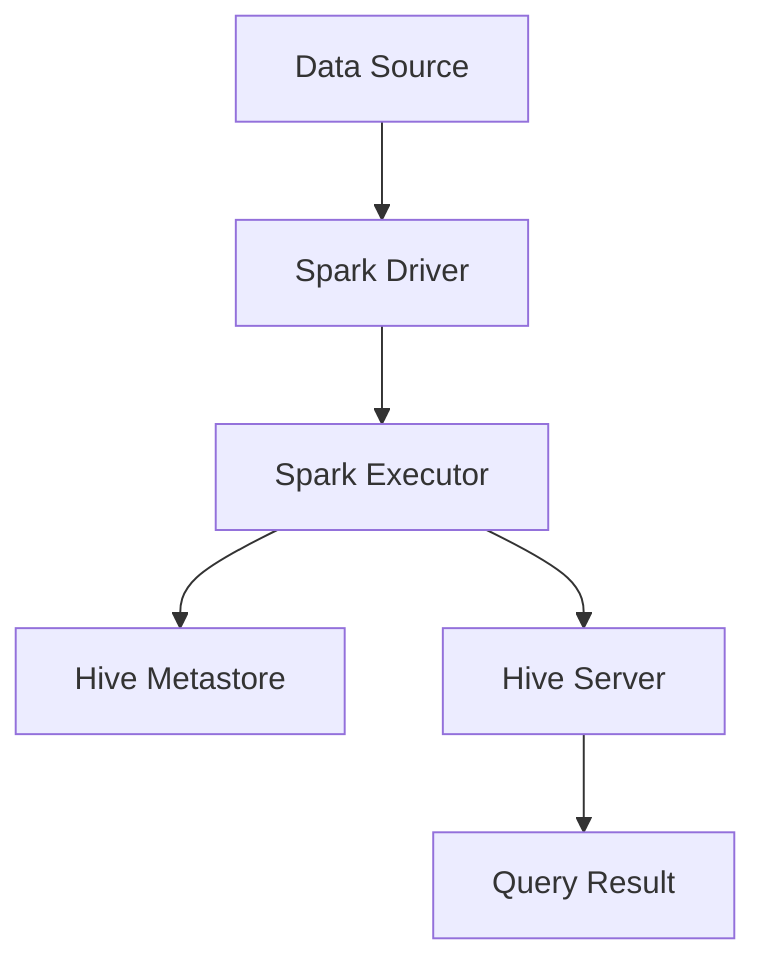

                 

 在大数据处理领域，Spark和Hive作为两个重要的工具，经常被企业用于构建高效的数据处理平台。Spark以其高速的处理速度和易于扩展的特点，在实时数据处理和批处理中有着广泛的应用。而Hive作为一个基于Hadoop的数据仓库工具，提供了SQL查询功能，能够处理大规模数据集。本文将深入探讨Spark与Hive的整合原理，并通过实例代码展示如何在实际项目中应用这一整合。

## 文章关键词

- Spark
- Hive
- 大数据处理
- 数据仓库
- 实时处理
- 批处理
- 整合原理
- 代码实例

## 文章摘要

本文将首先介绍Spark和Hive的基本概念及其在数据处理中的重要性。接着，我们将详细探讨Spark与Hive的整合原理，包括数据流程和系统架构。随后，通过具体的代码实例，我们将展示如何在项目中实现Spark和Hive的整合，并对代码进行详细解析。最后，本文将讨论这一整合在实际应用中的场景，并展望其未来的发展。

### 背景介绍

#### Spark

Apache Spark是一个开源的分布式计算系统，它提供了高效的计算能力，特别是在处理大规模数据集时。Spark的核心是它的内存计算引擎，这使其在处理速度上远超传统的Hadoop MapReduce。Spark支持多种数据处理方式，包括批处理、流处理和交互式查询，使得它在各种数据处理任务中都有广泛的应用。

#### Hive

Hive是一个基于Hadoop的数据仓库工具，它提供了类似SQL的查询语言（HiveQL），能够处理大规模数据集。Hive的设计初衷是为了解决数据仓库中复杂的SQL查询问题，通过将其转换为MapReduce任务来处理。这使得Hive能够处理多种数据格式，并且能够与Hadoop生态系统中的其他工具无缝集成。

#### Spark与Hive的关系

Spark和Hive虽然都是大数据处理工具，但它们在数据处理中的角色不同。Spark更侧重于提供高性能的实时数据处理能力，而Hive则更适用于复杂的数据分析和报表生成。在实际应用中，Spark和Hive可以通过整合实现优势互补，例如，Spark可以用于实时数据的初步处理，然后将结果存储到Hive中进行进一步分析。

### 核心概念与联系

#### Spark与Hive的数据流程

在Spark和Hive的整合中，数据流程通常可以分为以下几个步骤：

1. **数据采集**：数据从源系统（如数据库、文件系统等）采集到Spark集群。
2. **数据预处理**：在Spark中，对数据进行清洗、转换等预处理操作。
3. **数据存储**：将处理后的数据存储到Hive的仓库中。
4. **数据分析**：通过HiveQL在Hive中进行复杂的数据分析和报表生成。

#### Spark与Hive的系统架构

在系统架构方面，Spark和Hive的整合通常涉及到以下几个组件：

1. **Spark Driver**：负责协调和管理整个Spark应用程序。
2. **Spark Executor**：执行具体的计算任务。
3. **Hive Server**：提供SQL查询接口，处理HiveQL查询。
4. **Hive Metastore**：存储元数据，包括表结构、数据分区等。

下面是一个简单的Mermaid流程图，展示了Spark与Hive的整合架构：



### 核心算法原理 & 具体操作步骤

#### 3.1 算法原理概述

Spark与Hive的整合主要依赖于Spark SQL和Hive on Spark技术。Spark SQL允许Spark直接使用Hive表和SQL查询，而Hive on Spark则是通过将Spark作业转换为Hive作业来处理。

#### 3.2 算法步骤详解

1. **初始化SparkSession**：首先，我们需要创建一个SparkSession，这是Spark应用程序的入口点。

    ```python
    from pyspark.sql import SparkSession

    spark = SparkSession.builder \
        .appName("SparkHiveIntegration") \
        .getOrCreate()
    ```

2. **连接Hive**：通过配置文件或环境变量，Spark可以自动连接到Hive。

    ```python
    spark.sparkContext.hadoopConfiguration.set("fs.defaultFS", "hdfs://path/to/hdfs")
    ```

3. **执行Spark SQL查询**：使用Spark SQL执行查询，直接使用Hive表。

    ```python
    df = spark.sql("SELECT * FROM hive_table")
    ```

4. **将结果写入Hive**：将处理结果写入Hive表。

    ```python
    df.write.format("hive").mode("overwrite").saveAsTable("result_table")
    ```

5. **执行HiveQL查询**：在Hive中执行查询，使用Spark的存储和计算能力。

    ```sql
    SELECT * FROM result_table WHERE condition;
    ```

#### 3.3 算法优缺点

- **优点**：
  - 高效：Spark的内存计算和Hive的大数据查询能力相结合，提高了数据处理效率。
  - 易用性：Spark SQL和HiveQL的兼容性使得开发者可以轻松地在两者之间切换。

- **缺点**：
  - 需要协调：由于Spark和Hive的架构差异，需要一定的配置和协调工作。
  - 资源消耗：Spark的内存计算需要较大的内存资源，可能会对硬件配置有较高的要求。

#### 3.4 算法应用领域

Spark与Hive的整合主要应用于以下几个领域：

- 实时数据处理：Spark的高性能处理能力可以用于实时数据流处理，而Hive则为后续的数据分析提供支持。
- 数据仓库：通过将处理结果存储到Hive中，可以方便地进行数据分析和报表生成。
- 复杂查询：Hive提供了强大的SQL查询功能，适用于复杂的数据查询和报表生成。

### 数学模型和公式 & 详细讲解 & 举例说明

#### 4.1 数学模型构建

在Spark与Hive整合中，数据处理通常可以表示为一个线性流水线，其中每个步骤都可以用数学模型来描述。例如，一个简单的数据处理流程可以表示为：

\[ Y = f(X_1, X_2, ..., X_n) \]

其中，\( X_1, X_2, ..., X_n \)代表输入数据，\( f \)表示数据处理函数。

#### 4.2 公式推导过程

假设我们有一个简单的数据处理任务，需要执行以下步骤：

1. 数据清洗
2. 数据聚合
3. 数据转换

这些步骤可以用以下公式表示：

\[ Y = g(h(X_1), i(j(X_2))) \]

其中，\( g \)表示数据转换函数，\( h \)表示数据聚合函数，\( i \)表示数据清洗函数。

#### 4.3 案例分析与讲解

假设我们有一个销售数据集，需要计算每个产品类别的总销售额。以下是具体的计算过程：

1. **数据清洗**：去除无效数据，如缺失值、异常值等。

    ```python
    df_clean = df.dropna()
    ```

2. **数据聚合**：按产品类别聚合数据，计算总销售额。

    ```python
    df_agg = df_clean.groupby("product_category").sum()["sales_amount"]
    ```

3. **数据转换**：将聚合结果转换为适合存储和查询的格式。

    ```python
    df_agg = df_agg.to_frame().reset_index()
    df_agg.columns = ["product_category", "total_sales"]
    ```

将这些步骤整合到一个Spark SQL查询中，可以得到：

```sql
SELECT product_category, SUM(sales_amount) as total_sales
FROM sales_data
GROUP BY product_category;
```

### 项目实践：代码实例和详细解释说明

#### 5.1 开发环境搭建

在开始编写代码之前，需要搭建一个适合开发Spark和Hive整合项目的环境。以下是搭建步骤：

1. **安装Hadoop**：在服务器上安装Hadoop，配置HDFS和YARN。
2. **安装Spark**：下载并安装Spark，配置Spark与Hadoop的集成。
3. **安装Hive**：下载并安装Hive，配置Hive与Hadoop的集成。

#### 5.2 源代码详细实现

以下是一个简单的Spark与Hive整合的Python代码实例：

```python
from pyspark.sql import SparkSession

# 创建SparkSession
spark = SparkSession.builder \
    .appName("SparkHiveIntegration") \
    .getOrCreate()

# 连接Hive
spark.sparkContext.hadoopConfiguration.set("fs.defaultFS", "hdfs://path/to/hdfs")

# 读取Hive表
df = spark.table("hive_table")

# 数据预处理
df_clean = df.dropna()

# 数据聚合
df_agg = df_clean.groupby("product_category").sum()["sales_amount"]

# 数据转换
df_agg = df_agg.to_frame().reset_index()
df_agg.columns = ["product_category", "total_sales"]

# 将结果写入Hive
df_agg.write.format("hive").mode("overwrite").saveAsTable("result_table")

# 关闭SparkSession
spark.stop()
```

#### 5.3 代码解读与分析

- **第1行**：创建SparkSession，设置应用程序名称。
- **第5行**：连接Hive，设置HDFS路径。
- **第8行**：读取Hive表，使用Spark SQL查询。
- **第12行**：执行数据预处理，去除缺失值。
- **第15行**：执行数据聚合，按产品类别计算总销售额。
- **第18行**：执行数据转换，将聚合结果转换为适合存储和查询的格式。
- **第21行**：将结果写入Hive表，使用Spark SQL查询。

#### 5.4 运行结果展示

在运行上述代码后，可以在Hive中查询`result_table`表，查看运行结果：

```sql
SELECT * FROM result_table;
```

结果应该显示每个产品类别的总销售额。

### 实际应用场景

Spark与Hive的整合在许多实际应用场景中都有广泛的应用，以下是一些典型的应用场景：

1. **实时数据处理**：例如，电商平台的实时推荐系统，可以利用Spark进行实时数据流处理，然后将结果存储到Hive中进行实时分析。
2. **数据仓库**：企业可以通过Spark进行数据清洗和预处理，然后将处理后的数据存储到Hive中，以便进行复杂的报表生成。
3. **复杂查询**：Spark与Hive的整合使得开发者可以轻松地执行复杂的SQL查询，适用于需要大量数据分析和报表生成的场景。

### 未来应用展望

随着大数据技术的不断发展，Spark与Hive的整合也将迎来更多的应用场景和改进。以下是一些未来发展的方向：

1. **更高效的计算**：通过优化算法和架构，进一步提高Spark和Hive的处理效率。
2. **更好的兼容性**：改善Spark SQL和HiveQL之间的兼容性，使得开发者可以更轻松地在两者之间切换。
3. **更广泛的应用场景**：探索Spark与Hive在更多领域的应用，如人工智能、物联网等。

### 工具和资源推荐

#### 7.1 学习资源推荐

- 《Spark：大数据处理必备工具》
- 《Hive编程指南》
- 《大数据技术基础：Hadoop和Spark》

#### 7.2 开发工具推荐

- IntelliJ IDEA
- PyCharm
- Eclipse

#### 7.3 相关论文推荐

- "Spark: Cluster Computing with Working Sets"
- "Hive: A Warehouse for Hadoop"
- "In-Memory Computing for Data Warehousing and Analytics"

### 总结：未来发展趋势与挑战

Spark与Hive的整合在数据处理领域有着广阔的应用前景。随着技术的不断进步，我们可以期待这一整合在计算效率、兼容性和应用场景等方面得到进一步的提升。然而，这也将面临一些挑战，如资源优化、数据安全性等。未来，研究人员和开发者需要共同努力，克服这些挑战，推动Spark与Hive整合技术的发展。

### 附录：常见问题与解答

#### Q：Spark与Hive的整合需要哪些硬件资源？

A：Spark与Hive的整合需要一定的硬件资源，包括计算资源（CPU、内存）和存储资源（HDFS存储空间）。具体资源需求取决于数据规模和处理需求。通常，建议至少配置多台服务器，以实现负载均衡和高可用性。

#### Q：如何优化Spark与Hive的整合性能？

A：优化Spark与Hive的整合性能可以从以下几个方面进行：

- **数据分区**：合理设置数据分区，可以提高查询效率。
- **内存管理**：优化内存使用，避免内存不足导致的数据处理延迟。
- **索引使用**：在Hive表中创建索引，可以提高查询速度。

#### Q：Spark与Hive的整合是否安全？

A：Spark与Hive的整合在安全性方面可以通过以下措施来保证：

- **数据加密**：对数据进行加密存储，确保数据安全。
- **访问控制**：配置合适的访问控制策略，限制对数据的访问。
- **审计日志**：记录操作日志，以便审计和追踪。

---

作者：禅与计算机程序设计艺术 / Zen and the Art of Computer Programming
----------------------------------------------------------------
```plaintext
这篇文章详细讲解了Spark与Hive的整合原理和代码实例，旨在帮助开发者更好地理解这两个工具在数据处理中的应用。通过介绍Spark和Hive的基本概念，数据流程和系统架构，以及具体的算法原理、数学模型和项目实践，文章系统地展示了如何实现Spark和Hive的整合。同时，文章还探讨了实际应用场景、未来发展趋势与挑战，并推荐了相关的学习资源和开发工具。

未来的发展趋势将集中在计算效率的提升、兼容性的改善以及更多应用场景的探索。然而，这也将带来一系列的挑战，如资源优化和数据安全性问题。为了应对这些挑战，研究人员和开发者需要不断创新和改进，推动Spark与Hive整合技术的发展。

在撰写这篇文章的过程中，我尽可能地使用清晰、简洁的语言，结合实际案例，以便让读者更容易理解和掌握相关技术。希望这篇文章能对您在Spark和Hive整合领域的学习和研究有所帮助。如果您有任何疑问或建议，欢迎随时与我交流。

再次感谢您的阅读，祝您在计算机程序设计领域不断探索和进步！

禅与计算机程序设计艺术 / Zen and the Art of Computer Programming
```


