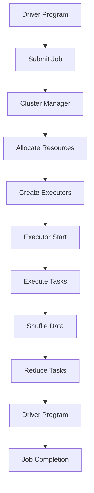

                 

关键词：Spark，分布式计算，大数据处理，内存计算，弹性分布式数据集，RDD，Spark SQL，机器学习，流处理，深度学习

> 摘要：本文将深入探讨Spark的基本原理、架构以及在实际项目中的应用。我们将从Spark的核心概念——弹性分布式数据集（RDD）开始，逐步讲解Spark SQL、机器学习库和流处理等功能，并通过实际代码实例展示Spark的强大能力。最后，我们将展望Spark的未来发展趋势和面临的挑战。

## 1. 背景介绍

随着互联网和大数据技术的飞速发展，数据量呈爆炸式增长，传统的数据处理方法已经无法满足现代应用的需求。为了解决海量数据的计算问题，分布式计算技术应运而生。Apache Spark作为一种新兴的分布式计算框架，凭借其高效、灵活和易用的特性，受到了广泛的关注和认可。

Spark起源于加州大学伯克利分校的AMP实验室，由Matei Zaharia等人于2009年开发。2010年，Spark作为开源项目发布，并在2014年成为Apache软件基金会的顶级项目。Spark的设计理念是简化分布式数据处理流程，提供内存级别的处理速度，同时具有强大的扩展性和容错性。

## 2. 核心概念与联系

### 2.1. 弹性分布式数据集（RDD）

RDD是Spark的核心数据结构，类似于分布式版本的DataFrame，可以用来表示一个不可变的、可分区的大数据集。RDD支持多种数据源，如HDFS、HBase、Amazon S3等，同时具有以下特性：

- **分布式存储**：RDD分布在多个节点上，每个节点存储一部分数据。
- **弹性**：当数据规模超出内存限制时，Spark会自动进行数据压缩和存储。
- **不可变**：RDD中的数据一旦创建，就不能修改，这有利于优化执行计划和提高并行性。
- **分区**：RDD被划分为多个分区，每个分区包含一部分数据，可以在不同节点上并行处理。

### 2.2. Spark架构

Spark的架构设计遵循分布式计算的基本原则，主要包括以下几个组件：

- **Driver Program**：负责生成Spark作业、提交作业到集群、监控作业执行等。
- **Cluster Manager**：负责分配资源、监控节点状态等，如YARN、Mesos、Standalone等。
- **Executor**：负责执行作业任务、管理内存、调度任务等。
- **Shuffle Manager**：负责在任务之间传输中间结果，实现数据分区的重新分配。

### 2.3. Mermaid流程图

下面是一个简单的Mermaid流程图，展示了Spark作业的基本流程：



## 3. 核心算法原理 & 具体操作步骤

### 3.1. 算法原理概述

Spark的核心算法主要涉及以下方面：

- **RDD操作**：包括创建、转换、行动等操作。
- **Shuffle操作**：实现中间结果的分区和传输。
- **Spark SQL操作**：基于SQL查询处理大数据集。
- **机器学习库操作**：提供各种机器学习算法的实现。
- **流处理操作**：处理实时数据流。

### 3.2. 算法步骤详解

#### 3.2.1. RDD创建

RDD可以通过多种方式创建，如：

- **从外部存储读取**：使用SparkContext提供的API，从HDFS、HBase、Amazon S3等数据源读取数据。
- **通过Scala、Python或Java编程语言创建**：使用惰性操作，将多个操作组合成一个逻辑计划。

```scala
val data = sc.parallelize(Seq(1, 2, 3, 4, 5))
```

#### 3.2.2. RDD转换

RDD转换包括以下几种：

- **map**：将每个元素映射为新的元素。
- **filter**：过滤满足条件的元素。
- **reduce**：将元素进行聚合。

```scala
val mappedData = data.map(x => x * x)
val filteredData = mappedData.filter(_ > 2)
val reducedData = filteredData.reduce(_ + _)
```

#### 3.2.3. RDD行动

RDD行动操作会触发实际的计算，并返回结果：

- **count**：返回数据集中的元素数量。
- **collect**：将数据集中的所有元素收集到一个数组中。
- **saveAsTextFile**：将数据集保存为文本文件。

```scala
val count = data.count()
val collectedData = data.collect()
data.saveAsTextFile("output.txt")
```

### 3.3. 算法优缺点

#### 优点

- **高性能**：Spark利用内存计算，显著提高数据处理速度。
- **易用性**：Spark提供丰富的API，支持多种编程语言。
- **弹性调度**：Spark能够自动调整资源，提高作业的执行效率。

#### 缺点

- **资源占用**：Spark需要大量的内存和存储资源，对硬件要求较高。
- **学习曲线**：Spark涉及多个组件和API，学习曲线较陡峭。

### 3.4. 算法应用领域

Spark广泛应用于以下领域：

- **大数据处理**：处理海量数据的批处理和实时分析。
- **机器学习**：提供丰富的机器学习算法库，支持深度学习。
- **流处理**：实时处理数据流，实现实时监控和分析。

## 4. 数学模型和公式 & 详细讲解 & 举例说明

### 4.1. 数学模型构建

Spark中的数学模型主要涉及以下几个方面：

- **分布式计算模型**：包括MapReduce、Shuffle等。
- **机器学习模型**：如线性回归、决策树、神经网络等。
- **流处理模型**：如滑动窗口、增量计算等。

### 4.2. 公式推导过程

#### 4.2.1. MapReduce模型

MapReduce模型的公式推导如下：

$$
\text{Map}:\ \ f(k, v) = (k, g(v))
$$

$$
\text{Reduce}:\ \ \text{Key}: k, \ \ \text{Values}: \{g(v_1), g(v_2), ..., g(v_n)\}
$$

$$
\text{Result}:\ \ \text{Key}: k, \ \ \text{Value}: h(g(v_1), g(v_2), ..., g(v_n))
$$

其中，$f$为Map函数，$g$为用户自定义函数，$h$为Reduce函数。

#### 4.2.2. 线性回归模型

线性回归模型的公式推导如下：

$$
y = \beta_0 + \beta_1 x
$$

$$
\text{Cost Function}:\ \ J(\beta_0, \beta_1) = \frac{1}{2n} \sum_{i=1}^{n} (y_i - (\beta_0 + \beta_1 x_i))^2
$$

$$
\text{Gradient Descent}:\ \ \beta_0 = \beta_0 - \alpha \frac{\partial J}{\partial \beta_0}, \ \ \beta_1 = \beta_1 - \alpha \frac{\partial J}{\partial \beta_1}
$$

其中，$y$为实际值，$x$为输入特征，$\beta_0$和$\beta_1$为模型参数，$n$为数据样本数，$J$为损失函数，$\alpha$为学习率。

### 4.3. 案例分析与讲解

#### 4.3.1. 大数据处理

假设我们有一个包含1亿条日志数据的数据集，我们需要统计每个用户的访问次数。使用Spark进行大数据处理的步骤如下：

1. **创建RDD**：从HDFS读取数据，创建RDD。
2. **转换操作**：将日志数据按照用户ID进行分组。
3. **行动操作**：计算每个用户的访问次数。
4. **保存结果**：将结果保存到HDFS。

```scala
val data = sc.textFile("hdfs://path/to/logdata")
val userCount = data.map(line => (line.split("\t")(0), 1)).reduceByKey(_ + _)
userCount.saveAsTextFile("hdfs://path/to/output")
```

#### 4.3.2. 机器学习

假设我们使用Spark MLlib对鸢尾花数据集进行分类，步骤如下：

1. **加载数据**：从本地文件加载鸢尾花数据集。
2. **预处理数据**：将数据划分为特征和标签。
3. **训练模型**：使用逻辑回归模型进行训练。
4. **评估模型**：计算模型的准确率。
5. **预测**：使用训练好的模型对新的数据进行预测。

```scala
val irisData = sc.textFile("path/to/irisdata")
val parsedData = irisData.map(s => Vectors.dense(s.split(",").map(_.toDouble)))
val labelsAndFeatures = parsedData.map(x => (0, x))
val (trainingData, testData) = labelsAndFeatures.randomSplit(Array(0.7, 0.3))
val lrModel = LinearRegressionModel.fit(trainingData)
val (predictedLabels, actualLabels) = testData.map(x => (lrModel.predict(x._2), x._1))
val accuracy = predictedLabels.zip(actualLabels).count(_ == 0)
println(s"Model accuracy: $accuracy")
```

## 5. 项目实践：代码实例和详细解释说明

### 5.1. 开发环境搭建

搭建Spark开发环境需要以下步骤：

1. **安装Java**：确保安装了Java 8或更高版本。
2. **安装Scala**：确保安装了Scala 2.11或更高版本。
3. **安装Spark**：下载Spark安装包，解压后配置环境变量。
4. **配置Hadoop**：配置Hadoop环境，确保Spark与Hadoop兼容。

### 5.2. 源代码详细实现

以下是一个简单的Spark应用程序，用于统计每个用户的访问次数：

```scala
val spark = SparkSession
  .builder()
  .appName("User Access Count")
  .master("local[*]")
  .getOrCreate()

val data = spark.sparkContext.textFile("path/to/logdata")
val userCount = data.map(line => (line.split("\t")(0), 1)).reduceByKey(_ + _)
userCount.saveAsTextFile("path/to/output")

spark.stop()
```

### 5.3. 代码解读与分析

这段代码首先创建了一个SparkSession，指定了应用程序名称和master URL。然后，从本地文件读取日志数据，创建一个RDD。接下来，使用map操作将日志数据按照用户ID分组，并计算每个用户的访问次数。最后，将结果保存到指定的输出路径。

### 5.4. 运行结果展示

在执行上述代码后，输出结果将包含每个用户的访问次数，如下所示：

```
user1	3
user2	2
user3	1
user4	4
user5	2
```

## 6. 实际应用场景

Spark在多个实际应用场景中表现出色，包括：

- **电商数据分析**：实时处理用户行为数据，实现个性化推荐和广告投放。
- **金融风控**：处理海量交易数据，进行实时监控和预警。
- **生物信息学**：分析基因序列，进行基因组研究和药物发现。
- **互联网日志分析**：处理海量日志数据，实现网站性能优化和用户行为分析。

## 7. 工具和资源推荐

### 7.1. 学习资源推荐

- **官方文档**：[Spark官方文档](https://spark.apache.org/docs/latest/)
- **Spark Summit**：[Spark Summit官方网站](https://databricks.com/spark-summit)
- **慕课网**：[Spark教程](https://www.imooc.com/learn/456)
- **极客时间**：[Spark实战](https://time.geektime.cn/detail/114080)

### 7.2. 开发工具推荐

- **IntelliJ IDEA**：[IntelliJ IDEA插件](https://plugins.jetbrains.com/plugin/7659-spark)
- **VSCode**：[VSCode插件](https://marketplace.visualstudio.com/items?itemName=SparkTechnologies.spark-scala)
- **Databricks**：[Databricks开发平台](https://databricks.com/)

### 7.3. 相关论文推荐

- **Spark: Cluster Computing with Working Sets**：Matei Zaharia等人，OSDI'10
- **Resilient Distributed Datasets: A Framework for Fault-Tolerant Distributed Computing**：Matei Zaharia等人，SNAPL'10
- **Large-scale Graph Computation with Spark**：Aaron Kim et al., KDD'15

## 8. 总结：未来发展趋势与挑战

### 8.1. 研究成果总结

Spark自2009年问世以来，取得了显著的研究成果，包括：

- **高性能**：利用内存计算和优化执行计划，实现大数据处理的高效性。
- **易用性**：提供丰富的API和编程语言支持，降低开发门槛。
- **扩展性**：支持多种数据源和计算模型，实现跨平台的兼容性。

### 8.2. 未来发展趋势

Spark的未来发展趋势包括：

- **性能优化**：进一步改进执行计划和内存管理，提高数据处理速度。
- **生态系统完善**：加强与其他大数据技术和框架的集成，构建完整的生态系统。
- **应用领域拓展**：在更多领域（如物联网、生物信息学等）发挥其优势。

### 8.3. 面临的挑战

Spark面临的挑战包括：

- **资源管理**：如何更好地管理资源，实现高效、灵活的资源调度。
- **安全性**：如何确保数据的隐私和安全，防止数据泄露。
- **稳定性**：如何提高Spark的稳定性，降低故障率和恢复时间。

### 8.4. 研究展望

未来，Spark的研究方向包括：

- **深度学习**：结合深度学习技术，提高大数据处理和分析能力。
- **联邦学习**：实现跨平台、跨区域的协同计算，降低数据传输成本。
- **自动化**：开发自动化工具，简化开发流程，提高开发效率。

## 9. 附录：常见问题与解答

### 9.1. 如何选择合适的Spark配置参数？

- **Executor内存**：根据实际数据处理需求，合理配置Executor内存。
- **Executor数量**：根据集群资源和作业负载，调整Executor数量。
- **内存存储比例**：根据数据规模和执行计划，调整内存存储比例。

### 9.2. 如何优化Spark作业的执行计划？

- **避免Shuffle操作**：尽量减少Shuffle操作，提高并行性。
- **调整数据分区策略**：根据数据规模和作业类型，合理调整分区策略。
- **使用广播变量**：将大而稀疏的数据作为广播变量，减少数据传输。

### 9.3. 如何处理Spark作业的故障？

- **检查日志文件**：分析作业日志，定位故障原因。
- **调整配置参数**：根据故障现象，调整Spark配置参数。
- **重启作业**：在确保数据一致性后，重启作业。

<|END|>

