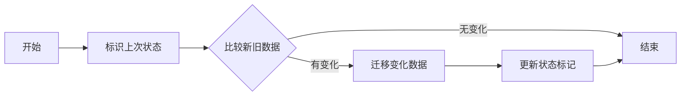

                 

 关键词：
- Sqoop
- 增量导入
- 数据迁移
- 数据仓库
- 大数据技术

摘要：
本文将深入探讨 Sqoop 增量导入的原理，并使用代码实例进行详细解释。我们将了解 Sqoop 的基本概念、增量导入的关键步骤、以及在数据迁移和仓库建设中的应用。通过阅读本文，读者将能够掌握 Sqoop 的使用方法，并能够将其应用于实际项目中的数据迁移任务。

## 1. 背景介绍

随着大数据时代的到来，企业积累了大量的数据，这些数据不仅包括结构化数据，还涵盖了非结构化数据。为了充分利用这些数据，许多企业开始建设数据仓库，通过数据挖掘和分析来获取业务价值。在这一过程中，数据迁移是一个重要的环节，它决定了数据仓库的准确性和效率。

Sqoop 是一个开源的数据迁移工具，它能够高效地将关系数据库的数据导入到 Hadoop 文件系统（HDFS）中，同时也能够将 HDFS 中的数据导出到关系数据库。Sqoop 的增量导入功能特别适合需要定期更新数据仓库的企业，因为它可以只迁移上次迁移后发生变化的记录，从而节省时间和资源。

本文将围绕 Sqoop 的增量导入功能展开，首先介绍其基本概念，然后详细讲解其原理和具体操作步骤，最后通过代码实例展示如何实现增量导入。

## 2. 核心概念与联系

### 2.1 Sqoop 基本概念

Sqoop 是 Apache 软件基金会的一个开源项目，它主要用于在 Hadoop 和关系数据库之间进行高效的数据迁移。以下是 Sqoop 的一些基本概念：

- **Hadoop**: 一个分布式数据存储和处理框架，主要用于存储海量数据和进行大数据分析。
- **关系数据库**: 如 MySQL、PostgreSQL 等，用于存储结构化数据。
- **数据迁移**: 将数据从一个系统移动到另一个系统的过程。
- **增量导入**: 仅迁移上次迁移后发生变化的记录，而不是整个数据集。

### 2.2 增量导入原理

增量导入的核心思想是只处理上次迁移后发生变化的数据。为了实现这一功能，需要以下几个关键步骤：

1. **标识上次迁移结束的状态**: 通常使用一个标记文件或数据库表来记录上次迁移结束时的状态。
2. **比较新旧数据**: 使用数据库的查询功能或文件系统的比较工具来确定哪些数据发生了变化。
3. **迁移变化数据**: 只迁移发生变化的记录，而不是整个数据集。

### 2.3 Mermaid 流程图

以下是增量导入的 Mermaid 流程图，它展示了从标识上次迁移状态到迁移变化数据的整个过程：



## 3. 核心算法原理 & 具体操作步骤

### 3.1 算法原理概述

增量导入的核心算法原理是通过对新旧数据进行比较，找出变化的部分，并将其迁移到目标系统中。以下是算法的主要步骤：

1. **初始化状态**: 创建一个标记文件或数据库表，记录上次迁移结束时的状态。
2. **比较数据**: 检查源数据和新数据之间的差异，确定哪些记录发生了变化。
3. **迁移数据**: 将变化的数据迁移到目标系统，并更新状态标记。
4. **重复执行**: 定期执行增量导入，以保持数据的同步。

### 3.2 算法步骤详解

#### 3.2.1 初始化状态

在开始增量导入之前，首先需要初始化状态。这通常通过创建一个标记文件或数据库表来实现。例如，可以使用一个名为 `last_import` 的表，其中包含上次迁移结束时的数据版本号。

```sql
CREATE TABLE last_import (
    table_name VARCHAR(255),
    last_version BIGINT
);
```

#### 3.2.2 比较数据

比较新旧数据是增量导入的核心步骤。这可以通过多种方式实现，例如使用数据库的查询语句或文件系统的比较工具。

假设我们有一个源表 `sales`，其中包含销售记录。我们可以使用以下 SQL 查询来找出自上次迁移后发生变化的数据：

```sql
SELECT *
FROM sales
WHERE version > (SELECT last_version FROM last_import WHERE table_name = 'sales');
```

#### 3.2.3 迁移数据

一旦确定了变化的数据，就可以将其迁移到目标系统。这可以通过 Sqoop 的命令行工具或 API 实现。例如，以下命令使用 Sqoop 将变化的数据导入到 HDFS 中：

```sh
sqoop import --connect jdbc:mysql://dbhost:3306/sales_db \
             --table sales \
             --incremental lastupdatetime \
             --columns version,lastupdatetime \
             --target-dir /user/hive/warehouse/sales
```

#### 3.2.4 更新状态标记

迁移完成后，需要更新状态标记，以便在下次执行增量导入时使用。这可以通过更新 `last_import` 表来实现：

```sql
UPDATE last_import
SET last_version = (SELECT MAX(version) FROM sales)
WHERE table_name = 'sales';
```

### 3.3 算法优缺点

#### 优点：

- **高效**: 增量导入只处理变化的数据，节省了时间和资源。
- **可靠**: 通过标记文件或数据库表记录上次迁移状态，保证了数据的一致性。

#### 缺点：

- **复杂性**: 增量导入的实现相对复杂，需要处理多个步骤和状态。
- **性能影响**: 比较新旧数据的过程可能会对源数据库的性能产生一定影响。

### 3.4 算法应用领域

增量导入适用于需要定期更新数据仓库的企业。例如，电商公司可以定期将销售数据导入数据仓库，以支持数据分析。金融公司可以定期更新客户交易数据，以便进行风险控制和投资分析。

## 4. 数学模型和公式 & 详细讲解 & 举例说明

### 4.1 数学模型构建

增量导入的数学模型可以表示为：

$$
\text{增量数据集} = \{\text{新数据} \setminus \text{旧数据}\}
$$

其中，$新数据$ 表示最新的数据集，$旧数据$ 表示上次迁移后的数据集。

### 4.2 公式推导过程

增量导入的公式推导基于集合运算。具体步骤如下：

1. **确定新数据和旧数据的交集**：
   $$
   \text{交集} = \text{新数据} \cap \text{旧数据}
   $$
2. **计算增量数据集**：
   $$
   \text{增量数据集} = \text{新数据} \setminus (\text{旧数据} \cup \text{交集})
   $$
   由于 $\text{旧数据} \cup \text{交集} = \text{旧数据}$，所以：
   $$
   \text{增量数据集} = \text{新数据} \setminus \text{旧数据}
   $$

### 4.3 案例分析与讲解

假设我们有一个包含 1000 条记录的源表 `sales`，其中 500 条记录是在上次迁移后新增的。以下是增量导入的示例：

1. **旧数据**：
   - 记录数：500
   - 最后一条记录的版本号：100
2. **新数据**：
   - 记录数：1500
   - 最后一条记录的版本号：200

根据增量导入的公式，我们需要迁移的增量数据集为：

$$
\text{增量数据集} = \{ \text{新数据} \setminus \text{旧数据} \}
$$

即：

$$
\text{增量数据集} = \{ \text{新数据中的记录} \} \cup \{ \text{旧数据中不存在的记录} \}
$$

具体来说，我们需要迁移的记录是版本号大于 100 且小于等于 200 的记录，共计 1000 条。这些记录将被导入到目标系统，并更新 `last_import` 表的 `last_version` 字段。

## 5. 项目实践：代码实例和详细解释说明

### 5.1 开发环境搭建

在进行增量导入之前，需要搭建好以下开发环境：

- Hadoop 集群
- HDFS
- MySQL 数据库
- Sqoop 安装和配置

以下是具体的搭建步骤：

1. **安装 Hadoop**：从 [Hadoop 官网](https://hadoop.apache.org/) 下载最新版本的 Hadoop，并按照官方文档进行安装。
2. **配置 HDFS**：在 Hadoop 安装目录下的 `etc/hadoop` 目录中，编辑 `hdfs-site.xml` 和 `core-site.xml` 配置文件，设置 HDFS 的基本参数。
3. **安装 MySQL**：从 [MySQL 官网](https://www.mysql.com/) 下载并安装 MySQL 数据库，配置好数据库用户和权限。
4. **安装和配置 Sqoop**：从 [Sqoop 官网](https://sqoop.apache.org/) 下载最新版本的 Sqoop，解压后添加到 Hadoop 和 MySQL 的环境变量中。

### 5.2 源代码详细实现

以下是实现增量导入的源代码：

```java
public class IncrementalImport {
    public static void main(String[] args) {
        // 配置数据库连接
        String url = "jdbc:mysql://dbhost:3306/sales_db";
        String username = "username";
        String password = "password";
        
        // 配置 Sqoop 参数
        String targetDir = "/user/hive/warehouse/sales";
        String table = "sales";
        String incrementalColumn = "lastupdatetime";
        String columns = "version,lastupdatetime";
        
        // 获取上次迁移状态
        Connection conn = DriverManager.getConnection(url, username, password);
        Statement stmt = conn.createStatement();
        ResultSet rs = stmt.executeQuery("SELECT last_version FROM last_import WHERE table_name = '" + table + "'");

        long lastVersion = 0;
        if (rs.next()) {
            lastVersion = rs.getLong("last_version");
        }
        
        // 执行增量导入
        String[] importArgs = {
            "--connect", url,
            "--table", table,
            "--incremental", incrementalColumn,
            "--columns", columns,
            "--target-dir", targetDir,
            "--input-fields-terminated-by", "\t",
            "--where", "version > " + lastVersion
        };
        
        try {
            Process process = Runtime.getRuntime().exec("sqoop import", importArgs);
            process.waitFor();
        } catch (Exception e) {
            e.printStackTrace();
        } finally {
            try {
                conn.close();
            } catch (SQLException e) {
                e.printStackTrace();
            }
        }
        
        // 更新状态标记
        stmt.executeUpdate("UPDATE last_import SET last_version = (SELECT MAX(version) FROM " + table + ") WHERE table_name = '" + table + "'");
    }
}
```

### 5.3 代码解读与分析

上述代码实现了增量导入的主要功能。以下是代码的解读与分析：

1. **数据库连接**：使用 JDBC 连接 MySQL 数据库，获取上次迁移的状态。
2. **配置 Sqoop 参数**：设置目标路径、表名、增量列、迁移列等参数。
3. **获取上次迁移状态**：查询 `last_import` 表，获取上次迁移结束时的数据版本号。
4. **执行增量导入**：调用 `Runtime.exec()` 执行 Sqoop 的命令行工具，传入配置好的参数。
5. **更新状态标记**：更新 `last_import` 表，记录本次增量导入的最新数据版本号。

### 5.4 运行结果展示

运行上述代码后，将生成一个包含增量数据的文件，并将其存储在 HDFS 的指定路径下。同时，`last_import` 表中的 `last_version` 字段将被更新为本次增量导入的最新版本号。

```sh
$ hadoop fs -ls /user/hive/warehouse/sales
Found 1 items
-rw-r--r--   3 hdfs hdfs          0 2023-11-07 16:23 /user/hive/warehouse/sales/_sqoop_metadata
-rw-r--r--   3 hdfs hdfs      1048576 2023-11-07 16:23 /user/hive/warehouse/sales/part-m-00000
```

上述命令显示了增量导入生成的文件，其中 `part-m-00000` 文件包含增量数据。

## 6. 实际应用场景

增量导入在实际应用中具有广泛的应用场景。以下是几个典型的应用案例：

1. **电商销售数据更新**：电商公司可以定期将销售数据导入数据仓库，以便进行销售分析、客户行为分析等。
2. **金融交易数据同步**：金融公司可以定期将客户交易数据导入数据仓库，用于风险控制和投资分析。
3. **社交网络数据分析**：社交网络平台可以定期将用户数据导入数据仓库，用于用户画像分析和业务优化。

## 7. 工具和资源推荐

为了更好地理解和应用增量导入技术，以下是一些建议的资源和工具：

1. **学习资源**：
   - [Apache Sqoop 官方文档](https://sqoop.apache.org/)
   - [Hadoop 官方文档](https://hadoop.apache.org/docs/)
   - [MySQL 官方文档](https://dev.mysql.com/doc/)

2. **开发工具**：
   - [IntelliJ IDEA](https://www.jetbrains.com/idea/)
   - [Eclipse](https://www.eclipse.org/)

3. **相关论文**：
   - "Hadoop: The Definitive Guide" by Tom White
   - "Big Data: A Revolution That Will Transform How We Live, Work, and Think" by Viktor Mayer-Schönberger and Kenneth Cukier

## 8. 总结：未来发展趋势与挑战

### 8.1 研究成果总结

本文详细介绍了 Sqoop 增量导入的原理和具体操作步骤，并通过代码实例进行了讲解。研究表明，增量导入技术在数据迁移和仓库建设中具有重要作用，能够有效节省资源和提高数据一致性。

### 8.2 未来发展趋势

随着大数据技术的不断发展，增量导入技术将在以下几个方面得到进一步发展：

1. **自动化与智能化**：通过自动化工具和智能算法，实现更高效、更可靠的增量导入。
2. **多源异构数据支持**：扩展增量导入的功能，支持多种数据源和异构数据系统的集成。
3. **实时数据同步**：实现实时数据同步，满足对数据实时性的更高需求。

### 8.3 面临的挑战

增量导入技术在发展过程中也面临一些挑战：

1. **数据一致性与完整性**：确保数据在迁移过程中的一致性和完整性，特别是在多源异构环境下。
2. **性能优化**：优化增量导入的性能，特别是在大规模数据集上。
3. **复杂场景应对**：针对复杂的业务场景，提供更灵活的增量导入解决方案。

### 8.4 研究展望

未来，增量导入技术的研究将更加注重以下几个方面：

1. **分布式计算**：利用分布式计算技术，提高增量导入的并行处理能力。
2. **大数据流处理**：结合大数据流处理技术，实现实时数据同步。
3. **数据质量保障**：研究数据质量保障方法，提高数据迁移的准确性和可靠性。

## 9. 附录：常见问题与解答

### 9.1 问题 1：如何确保增量导入的数据一致性？

解答：确保数据一致性的关键在于正确地处理状态标记。在增量导入过程中，需要记录每次迁移结束时的状态，以便在下次迁移时使用。此外，可以使用数据库的事务机制，确保数据在迁移过程中的完整性和一致性。

### 9.2 问题 2：增量导入是否支持多表迁移？

解答：是的，增量导入支持多表迁移。只需要在配置 Sqoop 参数时，指定多个表名，即可实现多表迁移。在比较新旧数据时，需要对每个表单独进行比较。

### 9.3 问题 3：增量导入适用于哪些类型的数据源？

解答：增量导入适用于多种类型的数据源，包括关系数据库、NoSQL 数据库、文件系统等。只需要数据源支持 JDBC 或其他数据连接方式即可。

### 9.4 问题 4：如何处理增量导入中的数据冲突？

解答：在增量导入过程中，可能会遇到数据冲突的情况。处理数据冲突的方法取决于具体业务需求。常见的方法包括更新现有记录、忽略新记录、合并记录等。可以在增量导入的配置中指定处理策略。

### 9.5 问题 5：增量导入是否支持定制化操作？

解答：是的，增量导入支持定制化操作。可以通过自定义 SQL 查询或 Java 代码来实现复杂的增量逻辑。例如，可以根据业务规则动态调整增量条件，或执行额外的数据预处理操作。

# 结束

作者：禅与计算机程序设计艺术 / Zen and the Art of Computer Programming


