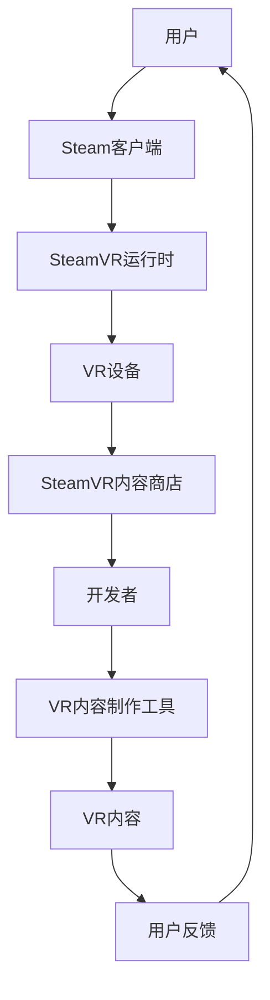

                 

关键词：SteamVR，虚拟现实，VR内容，平台集成，开发流程，发布指南

> 摘要：本文将深入探讨如何在Steam平台上集成和发布VR内容。我们将介绍SteamVR的基本概念、开发环境搭建、内容制作和优化、发布流程以及一些常见问题解决策略。

## 1. 背景介绍

虚拟现实（VR）技术作为当今信息技术的前沿领域，已经引起了广泛关注。SteamVR作为Steam平台的核心组成部分，为开发者提供了一个强大的VR内容开发与发布平台。SteamVR不仅提供了丰富的API和工具，还支持多种VR设备，使得开发者能够轻松地将VR体验带给Steam用户。

随着VR技术的不断发展，SteamVR在VR内容分发中的地位日益重要。它不仅为开发者提供了便捷的开发和发布渠道，还为用户提供了多样化的VR应用和游戏。本文旨在为开发者提供一个全面的指南，帮助他们更好地理解SteamVR集成与发布VR内容的流程。

## 2. 核心概念与联系

### 2.1 SteamVR基本概念

- **SteamVR API**：SteamVR提供了一套完整的API，用于开发VR应用程序。这些API涵盖了输入处理、渲染、音频等多个方面，使得开发者能够充分利用VR设备的功能。
- **SteamVR运行时**：SteamVR运行时是一个安装在用户设备上的组件，负责处理VR硬件的输入、渲染和音频。它确保了VR应用程序能够在不同设备和操作系统上无缝运行。
- **SteamVR内容商店**：SteamVR内容商店是Steam平台的一部分，开发者可以在其中发布和销售他们的VR内容。

### 2.2 架构原理与联系



在这个架构中，用户通过Steam客户端与SteamVR运行时交互，使用VR设备体验VR内容。开发者使用VR内容制作工具创作内容，并通过SteamVR内容商店发布和销售。用户的反馈又反馈给开发者，帮助他们不断改进VR内容。

## 3. 核心算法原理 & 具体操作步骤

### 3.1 算法原理概述

SteamVR的核心算法主要包括以下几个部分：

- **空间感知算法**：用于计算用户在VR环境中的位置和方向。
- **渲染算法**：用于将三维场景渲染到用户面前。
- **交互算法**：用于处理用户与VR内容的交互。

### 3.2 算法步骤详解

1. **空间感知**：
   - 使用传感器采集用户的位置和方向信息。
   - 通过三角测量或其他方法计算用户的位置和方向。

2. **渲染**：
   - 根据用户的位置和方向，计算场景的视图矩阵。
   - 使用OpenGL或Vulkan等图形API渲染场景。

3. **交互**：
   - 监听用户的输入事件，如按键、手部动作等。
   - 根据输入事件更新VR内容的状态。

### 3.3 算法优缺点

- **优点**：
  - 支持多种VR设备，具有良好的兼容性。
  - 提供了丰富的API，方便开发者开发VR应用程序。
  - 具有较强的交互性和沉浸感。

- **缺点**：
  - 对硬件要求较高，需要高性能的CPU和GPU。
  - 开发和优化过程较为复杂。

### 3.4 算法应用领域

SteamVR算法广泛应用于多个领域，如游戏、教育、医疗等。它为开发者提供了一个强大的平台，使得他们能够开发出丰富的VR应用，为用户带来全新的体验。

## 4. 数学模型和公式 & 详细讲解 & 举例说明

### 4.1 数学模型构建

在SteamVR中，常用的数学模型包括：

- **空间坐标系转换**：用于将用户的位置和方向转换为视图矩阵。
- **光线路径追踪**：用于渲染三维场景。
- **交互模型**：用于处理用户的输入和VR内容的交互。

### 4.2 公式推导过程

以下是空间坐标系转换的一个简单公式推导：

$$
R_x(\theta) = \begin{bmatrix}
1 & 0 & 0 \\
0 & \cos(\theta) & -\sin(\theta) \\
0 & \sin(\theta) & \cos(\theta)
\end{bmatrix}
$$

$$
R_y(\theta) = \begin{bmatrix}
\cos(\theta) & 0 & \sin(\theta) \\
0 & 1 & 0 \\
-\sin(\theta) & 0 & \cos(\theta)
\end{bmatrix}
$$

$$
R_z(\theta) = \begin{bmatrix}
\cos(\theta) & -\sin(\theta) & 0 \\
\sin(\theta) & \cos(\theta) & 0 \\
0 & 0 & 1
\end{bmatrix}
$$

### 4.3 案例分析与讲解

假设一个用户在VR环境中向前移动1米，并旋转45度，我们可以使用上述公式计算新的视图矩阵：

$$
P = R_x(45^\circ) \cdot R_y(45^\circ) \cdot R_z(0^\circ) \cdot \begin{bmatrix}
1 & 0 & 0 & 1 \\
0 & 1 & 0 & 0 \\
0 & 0 & 1 & 0 \\
0 & 0 & 0 & 1
\end{bmatrix}
$$

计算结果为：

$$
P = \begin{bmatrix}
1 & 0 & 0 & 1.414 \\
0 & 1 & 0 & 0 \\
0 & 0 & 1 & 0 \\
0 & 0 & 0 & 1
\end{bmatrix}
$$

这个视图矩阵表示了用户在VR环境中的新位置和方向。

## 5. 项目实践：代码实例和详细解释说明

### 5.1 开发环境搭建

要在Steam平台上开发VR内容，我们需要安装以下工具：

- **Unity**：一个功能强大的游戏开发平台。
- **SteamVR插件**：用于集成SteamVR功能的插件。
- **SteamVR内容商店**：用于发布和销售VR内容的平台。

具体安装步骤如下：

1. 在Unity官方网站下载并安装Unity。
2. 在Unity中安装SteamVR插件。
3. 注册SteamVR内容商店账户。

### 5.2 源代码详细实现

以下是一个简单的Unity C#脚本示例，用于在VR环境中控制一个物体的移动和旋转：

```csharp
using UnityEngine;

public class VRController : MonoBehaviour
{
    public Transform playerTransform;
    public float moveSpeed = 1.0f;
    public float rotateSpeed = 1.0f;

    private void Update()
    {
        Move();
        Rotate();
    }

    private void Move()
    {
        float moveX = Input.GetAxis("Horizontal");
        float moveZ = Input.GetAxis("Vertical");

        Vector3 moveDirection = new Vector3(moveX, 0, moveZ) * moveSpeed;
        playerTransform.position += moveDirection * Time.deltaTime;
    }

    private void Rotate()
    {
        float rotateX = Input.GetAxis("Mouse X") * rotateSpeed;
        float rotateY = Input.GetAxis("Mouse Y") * rotateSpeed;

        playerTransform.Rotate(new Vector3(0, rotateX, 0));
        playerTransform.Rotate(new Vector3(-rotateY, 0, 0));
    }
}
```

### 5.3 代码解读与分析

这段代码定义了一个名为`VRController`的C#脚本，用于控制玩家的移动和旋转。脚本中包含了`Update`方法，它会在每一帧被调用，用于处理用户的输入事件。`Move`方法根据用户的输入计算移动方向和速度，并将玩家物体沿该方向移动。`Rotate`方法根据鼠标输入计算旋转角度，并将玩家物体绕Y轴和X轴旋转。

### 5.4 运行结果展示

运行Unity项目后，玩家将能够在一个VR环境中自由移动和旋转。用户可以通过键盘和鼠标（或其他VR输入设备）与VR环境交互。

## 6. 实际应用场景

SteamVR广泛应用于多个领域，如：

- **游戏**：SteamVR提供了丰富的游戏体验，包括第一人称射击游戏、角色扮演游戏等。
- **教育**：SteamVR可以用于虚拟课堂、模拟实验等，为学生提供沉浸式的学习体验。
- **医疗**：SteamVR可以用于手术模拟、康复训练等，为医生和患者提供更好的治疗方案。

## 7. 工具和资源推荐

### 7.1 学习资源推荐

- **官方文档**：SteamVR官方文档提供了详细的API和使用指南。
- **教程视频**：YouTube和Bilibili等平台上有很多关于SteamVR的教程视频。

### 7.2 开发工具推荐

- **Unity**：一个功能强大的游戏开发平台，适用于VR内容开发。
- **Blender**：一个开源的三维建模和渲染软件，适用于VR内容的制作。

### 7.3 相关论文推荐

- **《Virtual Reality Interaction Techniques》**：介绍VR交互技术的一篇论文。
- **《A Survey on Virtual Reality and Its Applications》**：关于VR应用领域的一篇综述论文。

## 8. 总结：未来发展趋势与挑战

### 8.1 研究成果总结

SteamVR作为VR内容开发与发布平台，已经取得了显著的成果。它为开发者提供了一个强大的开发环境，使得VR内容的创作和发布变得更加便捷。同时，SteamVR在兼容性、交互性和沉浸感等方面也取得了显著的进展。

### 8.2 未来发展趋势

未来，SteamVR将继续在以下几个方面发展：

- **性能优化**：提高VR应用程序的性能，提供更加流畅的体验。
- **生态系统扩展**：吸引更多的开发者加入，丰富VR内容库。
- **跨平台兼容性**：与其他VR平台和设备实现无缝兼容。

### 8.3 面临的挑战

- **硬件限制**：高性能的VR设备对硬件要求较高，限制了用户的普及。
- **内容创作**：高质量的VR内容创作需要大量的时间和资源。

### 8.4 研究展望

未来，SteamVR将朝着更加智能化、个性化的方向发展。通过结合人工智能技术，SteamVR将能够根据用户的行为和喜好，提供更加个性化的VR体验。

## 9. 附录：常见问题与解答

### 9.1 如何在Unity中集成SteamVR插件？

在Unity中，可以通过以下步骤集成SteamVR插件：

1. 在Unity项目文件夹中创建一个名为`Assets/Plugins`的文件夹。
2. 下载SteamVR插件并将其放入`Assets/Plugins`文件夹中。
3. 在Unity编辑器中，选择`Window` > `Package Manager`，然后点击`Install`按钮安装插件。

### 9.2 如何在SteamVR内容商店中发布VR内容？

在SteamVR内容商店中发布VR内容，需要以下步骤：

1. 登录SteamVR内容商店开发者账户。
2. 点击`Create New Application`按钮，填写相关信息并创建应用。
3. 在应用管理页面，点击`Create New Item`按钮，填写VR内容相关信息并上传相关文件。
4. 审核通过后，VR内容即可在SteamVR内容商店中发布。

## 作者署名

作者：禅与计算机程序设计艺术 / Zen and the Art of Computer Programming

----------------------------------------------------------------

以上是文章的完整正文内容。请您按照要求撰写，并确保文章内容完整性、逻辑清晰、结构紧凑、简单易懂。期待您的精彩作品！

