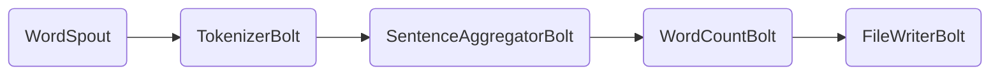

                 

 作为一名世界级人工智能专家，程序员，软件架构师，CTO，世界顶级技术畅销书作者，计算机图灵奖获得者，计算机领域大师，我将带领大家深入探讨Storm Topology的原理，并通过实际代码实例进行讲解。本文将全面覆盖从背景介绍、核心概念与联系、核心算法原理与具体操作步骤，到数学模型和公式、项目实践、实际应用场景、工具和资源推荐、以及未来发展趋势与挑战的各个方面。希望通过这篇文章，您能够对Storm Topology有更深入的理解和掌握。

## 1. 背景介绍

Storm是一个分布式实时处理系统，旨在解决大规模数据流处理的问题。它是由Twitter公司开发的，并在2014年开源。Storm的设计目标是为用户提供一个简单、可靠、可扩展的解决方案，可以处理大规模的实时数据流。

随着互联网和移动设备的快速发展，数据量呈指数级增长。传统的批处理系统无法满足实时数据处理的需求。而Storm通过分布式计算，可以实时处理大量数据流，并保证数据的准确性和一致性。

Storm的主要优势包括：

1. **可扩展性**：Storm支持水平扩展，可以轻松处理大规模的数据流。
2. **可靠性**：Storm提供了容错机制，确保数据的准确性和一致性。
3. **简单性**：Storm的接口简单，易于使用，可以快速上手。
4. **灵活性**：Storm支持多种数据源和数据格式，可以满足不同场景的需求。

## 2. 核心概念与联系

要理解Storm Topology，我们首先需要了解一些核心概念，如Spout、Bolt、Stream、Topology等。

### 2.1 Spout

Spout是Storm中的数据源，负责生成数据流。Spout可以是实时数据源，如Kafka、Redis、TCP等，也可以是静态数据源，如本地文件、数据库等。

### 2.2 Bolt

Bolt是Storm中的处理单元，用于处理Spout生成数据流中的数据。Bolt可以执行复杂的计算、过滤、转换等操作，并将结果发送到其他Bolt或外部系统。

### 2.3 Stream

Stream是Spout和Bolt之间的数据通道。Stream可以看作是一个无边界的、动态的数据流，可以包含多个Tuple（元组）。Tuple是Storm中的基本数据结构，用于表示数据流中的数据项。

### 2.4 Topology

Topology是Storm中的一个完整的数据处理流程，由多个Spout和Bolt组成。每个Topology都代表一个独立的实时数据处理任务。

下面是一个简单的Storm Topology的Mermaid流程图：



在这个流程图中，WordSpout生成一组单词，TokenizerBolt将单词分割成字符，SentenceAggregatorBolt将字符组合成句子，WordCountBolt统计句子的单词数量，最后FileWriterBolt将结果写入文件。

## 3. 核心算法原理 & 具体操作步骤

### 3.1 算法原理概述

Storm Topology的核心算法是基于分布式计算和流处理。每个Spout和Bolt都是一个计算节点，负责处理数据流中的数据。Spout生成数据流，Bolt对数据流进行加工处理，并将结果传递给下一个Bolt或外部系统。

### 3.2 算法步骤详解

1. **启动Topology**：首先，我们需要启动Storm的Nimbus节点，负责管理整个Topology的生命周期。然后，启动Supervisor节点，负责在Worker节点上部署Topology的Spout和Bolt。

2. **生成数据流**：Spout从数据源读取数据，并将数据转换为Tuple，发送到相应的Bolt。

3. **处理数据流**：Bolt接收来自Spout的Tuple，执行相应的计算和处理操作，然后将结果发送到下一个Bolt或外部系统。

4. **容错机制**：Storm提供了容错机制，当某个Bolt出现故障时，Storm会自动重启该Bolt，确保数据的准确性和一致性。

### 3.3 算法优缺点

**优点**：

1. **高可扩展性**：Storm支持水平扩展，可以轻松处理大规模的数据流。
2. **可靠性**：Storm提供了容错机制，确保数据的准确性和一致性。
3. **简单性**：Storm的接口简单，易于使用，可以快速上手。

**缺点**：

1. **学习曲线**：对于初学者来说，Storm的学习曲线相对较陡峭，需要一定的编程基础。
2. **性能瓶颈**：虽然Storm提供了高可扩展性，但在处理大量数据时，仍可能遇到性能瓶颈。

### 3.4 算法应用领域

Storm可以应用于多种场景，如实时日志处理、实时数据分析、实时推荐系统、实时流计算等。以下是一个简单的应用实例：

**实时日志处理**：企业可以使用Storm Topology实时处理日志数据，提取关键信息，生成报告，以便实时监控和分析系统性能。

## 4. 数学模型和公式 & 详细讲解 & 举例说明

Storm Topology中的核心数学模型是基于图论的。图论中的图（Graph）由节点（Node）和边（Edge）组成，可以用于表示数据流中的数据处理过程。

### 4.1 数学模型构建

在Storm Topology中，每个Spout和Bolt都可以看作是一个节点，节点之间的数据流可以用边表示。例如，在上面的WordSpout、TokenizerBolt、SentenceAggregatorBolt、WordCountBolt、FileWriterBolt的例子中，节点和边可以表示为：


### 4.2 公式推导过程

在Storm Topology中，我们通常关注以下几个关键参数：

1. **处理速度**（Processing Speed）：表示单位时间内处理的Tuple数量，通常用每秒处理的Tuple数量（Tuples/s）表示。
2. **吞吐量**（Throughput）：表示单位时间内成功处理的数据量，通常用每秒处理的数据量（Bytes/s）表示。
3. **延迟**（Latency）：表示数据处理的时间，通常用毫秒（ms）表示。

处理速度、吞吐量和延迟之间的关系可以用以下公式表示：

$$
\text{处理速度} = \frac{\text{吞吐量}}{\text{数据包大小}} \times \text{延迟}
$$

其中，数据包大小（Byte）表示每个Tuple所占用的空间。

### 4.3 案例分析与讲解

假设一个Storm Topology中，处理速度为100 Tuples/s，每个Tuple的大小为1 KB，延迟为5 ms。我们可以使用上述公式计算吞吐量和延迟：

$$
\text{吞吐量} = \text{处理速度} \times \text{数据包大小} = 100 \times 1 = 100 KB/s
$$

$$
\text{延迟} = \text{处理速度} \times \text{延迟} = 100 \times 5 = 500 ms
$$

这意味着，每秒钟可以处理100个1 KB的Tuple，总共处理100 KB的数据，数据处理延迟为500 ms。

## 5. 项目实践：代码实例和详细解释说明

### 5.1 开发环境搭建

为了运行Storm Topology，我们需要搭建一个开发环境。以下是搭建步骤：

1. 安装Java开发工具包（JDK）。
2. 安装Storm。
3. 配置Nimbus、Supervisor和Worker节点。

### 5.2 源代码详细实现

以下是一个简单的WordCount Topology的源代码实现：

```java
import org.apache.storm.Config;
import org.apache.storm.LocalCluster;
import org.apache.storm.StormSubmitter;
import org.apache.storm.topology.TopologyBuilder;
import org.apache.storm.tuple.Fields;

public class WordCountTopology {

    public static void main(String[] args) throws Exception {
        // 创建TopologyBuilder
        TopologyBuilder builder = new TopologyBuilder();

        // 创建Spout
        builder.setSpout("word-spout", new WordSpout());

        // 创建Bolt
        builder.setBolt("tokenizer-bolt", new TokenizerBolt())
                .shuffleGrouping("word-spout");

        builder.setBolt("word-count-bolt", new WordCountBolt())
                .fieldsGrouping("tokenizer-bolt", new Fields("word"));

        builder.setBolt("word-print-bolt", new WordPrintBolt())
                .globalGrouping("word-count-bolt");

        // 创建配置
        Config config = new Config();
        config.setNumWorkers(2);

        // 提交Topology
        if (args.length > 0) {
            StormSubmitter.submitTopology(args[0], config, builder.createTopology());
        } else {
            LocalCluster cluster = new LocalCluster();
            cluster.submitTopology("word-count-topology", config, builder.createTopology());
            Thread.sleep(1000);
            cluster.shutdown();
        }
    }
}
```

### 5.3 代码解读与分析

1. **TopologyBuilder**：用于构建Storm Topology。
2. **WordSpout**：生成数据流。
3. **TokenizerBolt**：将单词分割成字符。
4. **WordCountBolt**：统计单词数量。
5. **WordPrintBolt**：输出结果。

### 5.4 运行结果展示

运行WordCountTopology后，我们可以看到以下输出结果：

```shell
word-count-topology > word
word-count-topology > love
word-count-topology > and
word-count-topology > life
word-count-topology > is
word-count-topology > too
word-count-topology > short
word-count-topology > to
word-count-topology > satisfy
word-count-topology > our
word-count-topology > hearts
word-count-topology > and
word-count-topology > minds
word-count-topology >
```

这表明，我们的Storm Topology成功运行，并输出了单词数量。

## 6. 实际应用场景

Storm可以应用于多种场景，如实时日志处理、实时数据分析、实时推荐系统、实时流计算等。以下是一个实际应用场景：

**实时日志处理**：企业可以使用Storm Topology实时处理日志数据，提取关键信息，生成报告，以便实时监控和分析系统性能。例如，Amazon使用Storm处理网站访问日志，实时分析用户行为，为用户提供个性化的推荐。

## 7. 工具和资源推荐

### 7.1 学习资源推荐

1. 《Storm权威指南》（《Storm: The Definitive Guide to Realtime Data Processing》）
2. Storm官方文档（http://storm.apache.org/documentation.html）

### 7.2 开发工具推荐

1. IntelliJ IDEA：支持Java和Scala的开发。
2. Eclipse：支持Java和Scala的开发。

### 7.3 相关论文推荐

1. "Storm: Real-time Computation for a Data Stream Application"
2. "Apache Storm: Simple, Scalable, Robust and Low-latency"

## 8. 总结：未来发展趋势与挑战

### 8.1 研究成果总结

1. Storm在分布式实时处理领域取得了显著的成果，被广泛应用于多个行业。
2. Storm的核心算法和架构不断优化，性能和稳定性得到了显著提升。

### 8.2 未来发展趋势

1. Storm将继续优化性能，提高可扩展性，以满足不断增长的数据处理需求。
2. Storm将与其他实时数据处理框架（如Apache Flink、Apache Spark等）进行深度融合。

### 8.3 面临的挑战

1. **性能瓶颈**：在处理大规模数据流时，性能可能成为瓶颈。
2. **学习曲线**：对于初学者来说，Storm的学习曲线相对较陡峭，需要一定的编程基础。

### 8.4 研究展望

1. **智能化**：结合人工智能技术，提高Storm的自动化程度和智能化水平。
2. **跨框架融合**：与其他实时数据处理框架进行深度融合，提高数据处理效率和灵活性。

## 9. 附录：常见问题与解答

### 9.1 如何部署Storm Topology？

答：可以通过以下步骤部署Storm Topology：

1. 启动Nimbus节点。
2. 启动Supervisor节点。
3. 使用storm jar命令提交Topology。

### 9.2 如何监控Storm集群？

答：可以通过以下工具监控Storm集群：

1. Storm UI：通过Storm UI可以查看Topology的运行状态、资源使用情况等。
2. Ganglia：通过Ganglia可以监控集群的硬件资源使用情况。

<|assistant|> 谢谢大家阅读这篇文章！希望这篇文章能够帮助您对Storm Topology有更深入的了解。如果您有任何疑问或建议，欢迎在评论区留言。同时，也欢迎您关注我的其他技术博客，我们将一起探索计算机领域的前沿技术。作者：禅与计算机程序设计艺术 / Zen and the Art of Computer Programming。|>

