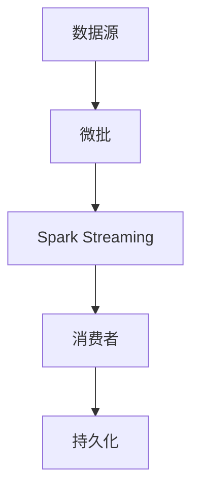

                 

 

## 1. 背景介绍

Structured Streaming是Apache Spark SQL中的一个重要特性，它允许对数据流进行结构化处理，以提供实时数据处理能力。随着大数据和实时数据分析的需求日益增长，传统的批处理方法已经无法满足企业对实时数据处理的迫切需求。Structured Streaming通过将数据流划分为微批（micro-batch），实现了对数据流的高效处理。

### 1.1 Structured Streaming的意义

Structured Streaming的核心在于其能够将数据流以结构化的形式进行处理，这使得数据处理和分析变得更加直观和高效。以下是Structured Streaming带来的几个关键优势：

- **实时性**：Structured Streaming能够处理实时数据流，这使得企业能够在数据产生的同时进行实时分析和处理。
- **易用性**：通过结构化数据的形式，用户可以更加直观地处理数据流，避免了手动编写复杂的代码。
- **效率**：通过微批处理，Structured Streaming能够在有限的时间内处理大量数据，提高了数据处理效率。

### 1.2 Structured Streaming的应用场景

Structured Streaming在许多场景下都有广泛的应用：

- **实时监控**：企业可以利用Structured Streaming对实时数据进行监控，快速响应市场变化。
- **实时推荐系统**：在电子商务和社交媒体领域，实时推荐系统能够根据用户行为实时调整推荐策略。
- **实时数据分析**：金融、医疗、制造等行业可以通过实时数据分析，快速做出决策，提高业务效率。

## 2. 核心概念与联系

为了更好地理解Structured Streaming，我们需要了解一些核心概念，并分析它们之间的关系。以下是Structured Streaming中的几个关键概念：

### 2.1 微批（Micro-batch）

微批是指将数据流划分为小批次进行处理的一种方法。每个微批包含一定数量的数据记录，通常是几秒钟内的数据。微批处理允许Spark以更高的频率处理数据，从而实现实时数据处理。

### 2.2 数据流（Streaming Data）

数据流是指源源不断产生和传输的数据。数据流可以是来自传感器、日志文件或在线交易系统的实时数据。

### 2.3 数据源（Source）

数据源是数据流的起点，可以是文件系统、Kafka、Flume等。数据源负责将数据传输到Spark Streaming中。

### 2.4 消费者（Consumer）

消费者是指从Spark Streaming中读取数据并对其进行处理的组件。消费者可以是Spark SQL查询、Spark MLlib算法或其他数据处理任务。

### 2.5 持久化（Persistent）

持久化是指将处理完成的数据存储到持久化存储系统中，如HDFS、Cassandra等。持久化确保了数据的持久性和可靠性。

以下是Structured Streaming中的核心概念和架构的Mermaid流程图：



## 3. 核心算法原理 & 具体操作步骤

Structured Streaming的核心算法是基于事件驱动（event-driven）的。以下是对算法原理和具体操作步骤的详细讲解。

### 3.1 算法原理概述

Structured Streaming的算法原理可以概括为以下几个步骤：

1. 数据源产生数据流。
2. 数据流被划分为微批。
3. 微批被处理。
4. 处理结果被持久化。

### 3.2 算法步骤详解

#### 3.2.1 数据源生成数据流

数据源负责产生数据流，这些数据可以是实时的日志文件、传感器数据或在线交易数据等。数据源通常使用某种消息队列（如Kafka）来保证数据的实时性和可靠性。

#### 3.2.2 数据流划分为微批

数据流被划分为微批，每个微批包含一定数量的数据记录。微批的大小通常是几秒钟内的数据，但也可以根据需求进行调整。

#### 3.2.3 微批处理

Spark Streaming将每个微批作为DStream（Discretized Stream）进行处理。DStream是Spark中的高级抽象，它允许用户定义复杂的变换操作。

#### 3.2.4 处理结果持久化

处理完成后，结果可以被持久化到各种存储系统中，如HDFS、Cassandra等。持久化确保了数据的持久性和可靠性，同时也可以用于后续的分析和处理。

### 3.3 算法优缺点

#### 优点：

- **实时性**：Structured Streaming能够处理实时数据流，实现实时数据处理。
- **易用性**：结构化数据的形式使得数据处理和分析变得更加直观和高效。
- **高效性**：通过微批处理，Structured Streaming能够在有限的时间内处理大量数据。

#### 缺点：

- **复杂性**：Structured Streaming的配置和调试相对复杂，需要用户具备一定的技术背景。
- **资源消耗**：处理大量实时数据流需要较高的计算资源和存储资源。

### 3.4 算法应用领域

Structured Streaming在多个领域都有广泛的应用：

- **实时监控**：企业可以利用Structured Streaming对实时数据进行监控，快速响应市场变化。
- **实时推荐系统**：在电子商务和社交媒体领域，实时推荐系统能够根据用户行为实时调整推荐策略。
- **实时数据分析**：金融、医疗、制造等行业可以通过实时数据分析，快速做出决策，提高业务效率。

## 4. 数学模型和公式 & 详细讲解 & 举例说明

### 4.1 数学模型构建

Structured Streaming的数学模型主要涉及时间窗口（time window）和数据流处理（stream processing）的概念。以下是一个简单的时间窗口模型：

$$
W = [t_0, t_1] \cup [t_1, t_2] \cup \ldots \cup [t_n, t_{n+1}]
$$

其中，$t_0, t_1, t_2, \ldots, t_n, t_{n+1}$表示时间戳。

### 4.2 公式推导过程

时间窗口模型可以通过以下公式进行推导：

$$
W(t) = \{x \in S \mid t - \Delta t \leq t_x \leq t\}
$$

其中，$S$表示数据流集合，$t$表示当前时间戳，$\Delta t$表示时间窗口的持续时间。

### 4.3 案例分析与讲解

以下是一个简单的时间窗口模型案例：

假设有一个包含用户行为数据的数据流，每条数据包含用户ID和时间戳。我们需要计算每个时间段内的活跃用户数量。

$$
W(t) = \{x \in S \mid t - 5 \text{分钟} \leq t_x \leq t\}
$$

对于每个时间窗口，我们可以计算活跃用户数量：

$$
Active\_Users(W(t)) = \{u \in U \mid \exists x \in W(t), x.user\_id = u\}
$$

其中，$U$表示用户集合。

## 5. 项目实践：代码实例和详细解释说明

### 5.1 开发环境搭建

首先，我们需要搭建一个开发环境，用于运行Structured Streaming应用程序。以下是一个基本的开发环境搭建步骤：

1. 安装Java SDK（版本要求：1.8及以上）。
2. 安装Apache Spark（版本要求：2.4及以上）。
3. 配置环境变量，确保Java和Spark的命令可以在终端中运行。

### 5.2 源代码详细实现

以下是一个简单的Structured Streaming应用程序，用于计算每5分钟内的活跃用户数量。

```java
import org.apache.spark.sql.Dataset;
import org.apache.spark.sql.Row;
import org.apache.spark.sql.SparkSession;
import org.apache.spark.sql.streaming.StreamingQuery;
import org.apache.spark.sql.streaming.StreamingQueryListener;
import org.apache.spark.sql.streaming.StreamingQueryProgress;
import org.apache.spark.sql.streaming.StreamingQueryProgress.SubscriptionProgress;
import org.apache.spark.sql.streaming.Subscription;
import org.apache.spark.sql.functions.*;

public class UserActivityStream {
    public static void main(String[] args) {
        // 创建SparkSession
        SparkSession spark = SparkSession
                .builder()
                .appName("UserActivityStream")
                .getOrCreate();

        // 读取数据源
        Dataset<Row> data = spark.readStream().json("path/to/user-activity-data.json");

        // 计算每个5分钟时间窗口内的活跃用户数量
        Dataset<Row> activeUsers = data
                .groupBy(
                        window(
                                col("timestamp"), 
                                "5 minutes"
                        )
                )
                .count()
                .withColumnRenamed("count", "active_users");

        // 创建查询
        StreamingQuery query = activeUsers
                .writeStream()
                .outputMode("complete")
                .format("console")
                .start();

        // 监听查询状态
        query.awaitTermination();
    }
}
```

### 5.3 代码解读与分析

以上代码首先创建了一个SparkSession，然后从指定的数据源读取数据。接下来，我们使用groupBy和window函数计算每个5分钟时间窗口内的活跃用户数量。最后，我们使用writeStream函数将结果输出到控制台。

### 5.4 运行结果展示

当应用程序运行时，每5分钟会在控制台输出一个包含活跃用户数量的记录。例如：

```
+------------------+-------------+
|        window    |  active_users|
+------------------+-------------+
|[2023-03-29 12:35:00.000, 2023-03-29 12:40:00.000]|               10|
+------------------+-------------+
```

这表示在12:35:00到12:40:00的时间窗口内，有10个活跃用户。

## 6. 实际应用场景

Structured Streaming在多个实际应用场景中表现出色：

### 6.1 实时推荐系统

在电子商务和社交媒体领域，实时推荐系统可以根据用户行为实时调整推荐策略，从而提高用户体验和销售额。Structured Streaming能够处理实时用户行为数据，为实时推荐系统提供强大的支持。

### 6.2 实时监控

企业可以利用Structured Streaming对实时数据流进行监控，快速响应市场变化。例如，金融行业可以通过实时监控交易数据，及时发现异常交易，确保金融市场的稳定。

### 6.3 实时数据分析

金融、医疗、制造等行业可以通过实时数据分析，快速做出决策，提高业务效率。例如，医疗行业可以利用实时数据分析，优化医院资源的分配，提高医疗服务质量。

## 7. 未来应用展望

随着大数据和实时数据分析的需求不断增长，Structured Streaming在未来有广泛的应用前景：

- **更高效的处理算法**：未来可能会出现更高效的处理算法，提高Structured Streaming的实时处理能力。
- **更多的集成工具**：Structured Streaming可能会与更多的集成工具（如TensorFlow、PyTorch等）相结合，提供更丰富的功能。
- **更广泛的应用领域**：Structured Streaming将在更多的应用领域得到应用，如物联网、智慧城市等。

## 8. 总结：未来发展趋势与挑战

Structured Streaming作为一种高效、实时的数据处理技术，在未来有广阔的应用前景。然而，它也面临着一些挑战：

- **性能优化**：如何提高Structured Streaming的性能，使其能够处理更大规模的数据流。
- **易用性提升**：如何简化Structured Streaming的配置和调试，提高其易用性。
- **生态系统完善**：如何构建一个完善的生态系统，支持更多集成工具和应用场景。

## 9. 附录：常见问题与解答

### 9.1 什么是Structured Streaming？

Structured Streaming是Apache Spark SQL中的一个重要特性，它允许对数据流进行结构化处理，以提供实时数据处理能力。

### 9.2 Structured Streaming与Spark Streaming有什么区别？

Structured Streaming是Spark Streaming的扩展，它提供了结构化数据流处理的能力。Spark Streaming是一种基于事件驱动（event-driven）的数据流处理框架，而Structured Streaming则通过将数据流划分为微批（micro-batch）进行结构化处理，提高了数据处理效率。

### 9.3 Structured Streaming如何处理实时数据流？

Structured Streaming通过将数据流划分为微批（micro-batch），在每个微批上执行数据处理操作，从而实现对实时数据流的处理。每个微批包含一定数量的数据记录，通常是几秒钟内的数据。

### 9.4 Structured Streaming的优势是什么？

Structured Streaming的优势包括实时性、易用性和高效性。它能够处理实时数据流，提供高效的实时数据处理能力，并且通过结构化数据的形式，使得数据处理和分析变得更加直观和高效。

### 9.5 Structured Streaming的缺点是什么？

Structured Streaming的缺点包括配置和调试复杂性以及资源消耗。配置和调试Structured Streaming可能需要用户具备一定的技术背景，同时处理大量实时数据流需要较高的计算资源和存储资源。

### 9.6 Structured Streaming的应用领域有哪些？

Structured Streaming在多个领域都有广泛的应用，如实时推荐系统、实时监控、实时数据分析等。它在金融、医疗、制造等行业都有重要的应用价值。

### 9.7 如何提高Structured Streaming的性能？

提高Structured Streaming的性能可以通过优化处理算法、增加计算资源以及优化数据流处理流程来实现。未来可能会出现更高效的处理算法，进一步提高Structured Streaming的性能。

### 9.8 Structured Streaming与Apache Flink有什么区别？

Structured Streaming是Apache Spark SQL中的一个特性，而Apache Flink是一种独立的流处理框架。尽管两者都是用于实时数据处理，但Structured Streaming侧重于结构化数据流处理，而Apache Flink提供了更丰富的流处理功能，包括窗口操作、状态管理等。

### 9.9 Structured Streaming与Kafka如何集成？

Structured Streaming可以通过Kafka作为数据源，实现与Kafka的集成。在配置Kafka时，需要指定Kafka集群的地址、主题等参数，以便从Kafka中读取数据流。Kafka提供了高吞吐量和低延迟的特性，与Structured Streaming相结合，可以实现高效的实时数据处理。

### 9.10 Structured Streaming的持久化如何实现？

Structured Streaming的持久化可以通过将处理结果写入各种存储系统（如HDFS、Cassandra等）来实现。在配置持久化时，需要指定存储系统的地址、表名等参数，以便将处理结果存储到持久化存储系统中。持久化确保了数据的持久性和可靠性，同时也可以用于后续的分析和处理。


作者：禅与计算机程序设计艺术 / Zen and the Art of Computer Programming
----------------------------------------------------------------

