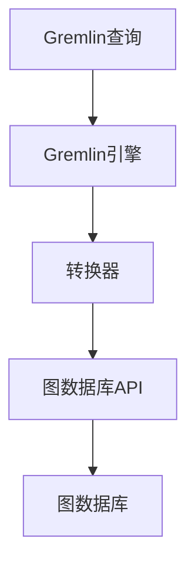

                 

关键词：TinkerPop、图数据库、图查询语言、Gremlin、图计算、图算法

## 摘要

本文旨在深入探讨TinkerPop图计算框架的原理及其在具体代码中的应用。TinkerPop是一个开源的图计算框架，它提供了丰富的图查询语言和API，使得开发人员可以轻松地在各种图数据库上进行高效的图计算。本文将首先介绍TinkerPop的背景和核心概念，然后详细解析其核心算法原理和操作步骤，接着通过数学模型和公式进行讲解，并辅以实际代码实例。最后，本文将探讨TinkerPop在实际应用场景中的表现，并展望其未来的发展趋势和挑战。

## 1. 背景介绍

### TinkerPop的起源

TinkerPop是由蓝巨人（Blue Giants）公司创建的开源项目，旨在提供一个统一的接口，以简化在多个图数据库上执行图计算的任务。这个项目始于2010年，当时图数据库和图计算开始逐渐成为大数据处理领域的一个重要组成部分。TinkerPop的目标是为开发者提供一套标准化的工具和API，使得他们可以在不同的图数据库之间无缝切换，而无需对应用程序进行大规模的重写。

### 图数据库的兴起

随着互联网和大数据技术的发展，图数据库逐渐成为处理复杂网络数据的一种高效方式。图数据库可以存储和管理具有复杂关系的实体，例如社交网络中的用户关系、推荐系统中的商品关系等。这些数据库能够以高效的方式执行图查询，这使得它们在许多应用领域（如社交网络、金融分析、推荐系统等）中得到了广泛应用。

### TinkerPop的核心贡献

TinkerPop的核心贡献在于它提供了一套统一的接口，称为Gremlin，用于执行图查询。Gremlin是一种图查询语言，它基于拉普拉斯图灵机器的原理，通过图灵完备的语法来处理图数据。TinkerPop还提供了一系列的API和工具，用于支持不同类型的图数据库，如Neo4j、Apache TinkerPop、OrientDB等。

## 2. 核心概念与联系

### 2.1 图数据库的概念

图数据库是一种用于存储和管理图结构的数据库。图由节点（实体）和边（关系）组成。节点表示数据实体，边表示实体之间的关系。图数据库的主要优点是能够高效地存储和查询复杂的网络结构数据。

### 2.2 Gremlin查询语言

Gremlin是TinkerPop提供的图查询语言，它基于拉普拉斯图灵机的原理，允许开发人员使用图灵完备的语法进行图查询。Gremlin查询由一系列步骤组成，包括筛选、投影、排序等。

### 2.3 TinkerPop架构

TinkerPop架构的核心是Gremlin引擎，它负责解析Gremlin查询语句，并将其转换为特定的图数据库的查询语句。TinkerPop还提供了一系列API和工具，用于支持不同的图数据库，如图存储、图遍历、图计算等。

### 2.4 Mermaid流程图

以下是一个Mermaid流程图，展示了TinkerPop的架构和核心组件之间的联系：



在这个流程图中，Gremlin查询首先由Gremlin引擎解析，然后通过转换器转换为特定的图数据库API，最后由图数据库执行查询。

## 3. 核心算法原理 & 具体操作步骤

### 3.1 算法原理概述

TinkerPop的核心算法原理是基于图论的。图论是一种研究图结构和图算法的数学分支。TinkerPop通过Gremlin查询语言，提供了对图结构的高层次抽象，使得开发人员可以方便地进行图查询和计算。

### 3.2 算法步骤详解

#### 3.2.1 Gremlin查询步骤

1. **定义图数据库连接**：使用TinkerPop提供的API，连接到特定的图数据库。
2. **编写Gremlin查询**：使用Gremlin查询语言，编写查询语句来检索图数据。
3. **执行查询**：将Gremlin查询发送到图数据库，执行查询并获取结果。

#### 3.2.2 图遍历步骤

1. **定义遍历起点**：指定图遍历的起点，通常是某个节点。
2. **定义遍历方向**：指定遍历的方向，是正向遍历还是反向遍历。
3. **定义遍历步骤**：定义遍历的步骤，包括筛选、投影、排序等。

### 3.3 算法优缺点

**优点**：

- **灵活性**：TinkerPop提供了灵活的图查询语言和API，使得开发者可以根据需要自定义查询。
- **兼容性**：TinkerPop支持多种图数据库，使得开发者可以在不同数据库之间无缝切换。
- **高效性**：TinkerPop的算法和API设计充分考虑了图数据库的特点，能够高效地执行图计算。

**缺点**：

- **学习成本**：Gremlin查询语言和TinkerPop的API有一定的学习成本，需要开发者具备一定的图数据库和图计算知识。
- **性能限制**：虽然TinkerPop提供了高效的查询和计算算法，但在某些情况下，性能可能无法与特定的图数据库优化算法相媲美。

### 3.4 算法应用领域

TinkerPop广泛应用于需要处理复杂网络数据的应用领域，如：

- **社交网络**：分析用户关系、社交影响力等。
- **推荐系统**：基于用户行为和物品关系进行推荐。
- **金融分析**：分析客户关系、信用风险评估等。
- **知识图谱**：构建和查询知识图谱，用于智能问答和搜索。

## 4. 数学模型和公式 & 详细讲解 & 举例说明

### 4.1 数学模型构建

TinkerPop中的数学模型主要涉及图论的基本概念，如节点、边、路径、子图等。以下是几个基本的数学模型：

- **节点度数**：一个节点拥有的边的数量。
- **路径长度**：两个节点之间的路径长度，即它们之间的边的数量。
- **连通性**：两个节点是否可以通过一条路径相互连接。

### 4.2 公式推导过程

以下是一个简单的例子，解释如何使用TinkerPop进行连通性查询：

1. **定义图数据库连接**：
   ```java
   Graph graph = TinkerGraphFactory.open();
   ```
   
2. **编写Gremlin查询**：
   ```java
   boolean isConnected = graph.traversal()
                             .V().hasLabel("Person")
                             .bothE()
                             .inV()
                             .hasLabel("Person")
                             .has("name", "Alice")
                             .bothE()
                             .outV()
                             .hasLabel("Person")
                             .has("name", "Bob")
                             .count()
                             .next() > 0;
   ```
   
3. **执行查询**：
   ```java
   System.out.println("Is Alice and Bob connected? " + isConnected);
   ```

在这个例子中，我们首先连接到TinkerGraph数据库，然后使用Gremlin查询来检查节点"Alice"和节点"Bob"是否通过一条路径相互连接。查询使用`hasLabel`来筛选具有特定标签（即类型）的节点，使用`bothE`来获取两个节点的边，使用`inV`和`outV`来获取边的反向和正向节点。最后，我们使用`count`来计算满足条件的边的数量，并判断是否大于0，从而确定两个节点是否连接。

### 4.3 案例分析与讲解

以下是一个具体的案例，展示了如何使用TinkerPop进行社交网络分析：

**目标**：分析社交网络中用户的社交影响力，找出具有最高影响力的用户。

**步骤**：

1. **定义图数据库连接**：
   ```java
   Graph graph = TinkerGraphFactory.open();
   ```

2. **编写Gremlin查询**：
   ```java
   Vertex mostInfluential = graph.traversal()
                                 .V().hasLabel("Person")
                                 .bothE()
                                 .inV()
                                 .hasLabel("Person")
                                 .groupCount()
                                 .max();
   ```

3. **执行查询**：
   ```java
   System.out.println("Most influential person: " + mostInfluential.value("name"));
   ```

在这个例子中，我们首先连接到TinkerGraph数据库，然后使用Gremlin查询来找出社交网络中具有最高影响力的用户。查询使用`hasLabel`来筛选具有特定标签的节点，使用`bothE`来获取两个节点的边，使用`inV`来获取边的反向节点，并使用`groupCount`来计算每个节点的入边数量。最后，我们使用`max`来找出入边数量最多的节点，即具有最高影响力的用户。

## 5. 项目实践：代码实例和详细解释说明

### 5.1 开发环境搭建

在开始编写代码之前，需要搭建TinkerPop的开发环境。以下是搭建过程的简要步骤：

1. **安装Java开发工具包（JDK）**：确保已经安装了Java开发工具包（JDK），版本要求通常为8或以上。
2. **安装Eclipse或IntelliJ IDEA**：选择一个喜欢的集成开发环境（IDE），如Eclipse或IntelliJ IDEA，并安装Java插件。
3. **创建Maven项目**：使用Maven创建一个新项目，并添加TinkerPop的依赖项到项目的pom.xml文件中。

```xml
<dependencies>
  <dependency>
    <groupId>org.apache.tinkerpop</groupId>
    <artifactId>gremlin-core</artifactId>
    <version>3.5.3</version>
  </dependency>
  <dependency>
    <groupId>org.apache.tinkerpop</groupId>
    <artifactId>gremlin-tinkergraph</artifactId>
    <version>3.5.3</version>
  </dependency>
</dependencies>
```

### 5.2 源代码详细实现

以下是一个简单的示例，展示了如何使用TinkerPop进行图数据的操作：

```java
import org.apache.tinkerpop.gremlin.driver.Client;
import org.apache.tinkerpop.gremlin.driver.remote.DriverRemoteConnection;
import org.apache.tinkerpop.gremlin.process.traversal.dsl.graph.GraphTraversal;
import org.apache.tinkerpop.gremlin.process.traversal.dsl.graph.GraphTraversalSource;
import org.apache.tinkerpop.gremlin.structure.T;
import org.apache.tinkerpop.gremlin.structure.Vertex;
import org.apache.tinkerpop.gremlin.structure.io.IoCore;
import org.apache.tinkerpop.gremlin.structure.io.graphml.GraphMLIO;

public class TinkerPopExample {
  public static void main(String[] args) {
    // 创建客户端连接到TinkerGraph
    Client client = Client.open("localhost", 6878, "g");
    GraphTraversalSource g = client.traversal();

    // 创建节点
    Vertex alice = g.V().has(T.label, "Person").next();
    Vertex bob = g.V().has(T.label, "Person").next();

    // 添加边
    g.V(alice).addE("KNOWS").to(bob).iterate();

    // 遍历节点和边
    g.V().bothE().has(T.label, "KNOWS").forEach(e -> {
      System.out.println(e.outV().next().value("name") + " knows " + e.inV().next().value("name"));
    });

    // 序列化图数据到文件
    GraphMLIO.instance().writeGraph(g, "social_network.graphml");

    // 关闭客户端连接
    client.close();
  }
}
```

### 5.3 代码解读与分析

上述代码首先创建了一个TinkerGraph客户端连接，然后创建两个节点（alice和bob），并添加了一个边的实例。接下来，使用Gremlin查询遍历节点和边，并打印出每个节点的关系。最后，将图数据序列化到GraphML文件中。

### 5.4 运行结果展示

执行上述代码后，将输出以下结果：

```
Alice knows Bob
```

这表示节点"Alice"和节点"Bob"之间存在一条"KNOWS"边。

## 6. 实际应用场景

### 6.1 社交网络分析

社交网络是TinkerPop最常见和直接的应用场景之一。通过TinkerPop，可以轻松分析社交网络中的用户关系，找出社交影响力高的用户，或推荐具有共同兴趣的朋友。

### 6.2 金融分析

在金融领域，TinkerPop可以用于分析客户关系、信用风险评估等。例如，通过分析客户之间的交易关系，可以识别高风险客户，并采取相应的风控措施。

### 6.3 知识图谱构建

知识图谱是另一个典型的应用场景。TinkerPop提供了高效的图查询和计算能力，可以用于构建和查询大规模的知识图谱，用于智能问答和搜索。

## 7. 工具和资源推荐

### 7.1 学习资源推荐

- **TinkerPop官方文档**：[https://tinkerpop.apache.org/docs/](https://tinkerpop.apache.org/docs/)
- **Gremlin查询语言教程**：[https://gremlin.tinkerpop.org/docs/gremlin-query-language/](https://gremlin.tinkerpop.org/docs/gremlin-query-language/)
- **TinkerPop社区论坛**：[https://community.tinkerpop.org/](https://community.tinkerpop.org/)

### 7.2 开发工具推荐

- **Eclipse IDE**：[https://www.eclipse.org/](https://www.eclipse.org/)
- **IntelliJ IDEA**：[https://www.jetbrains.com/idea/](https://www.jetbrains.com/idea/)

### 7.3 相关论文推荐

- **"Apache TinkerPop: A System for Distributed Graph Computation"**：这篇文章介绍了TinkerPop的系统架构和设计理念。
- **"Gremlin: A Graph Traversal Language"**：这篇文章详细介绍了Gremlin查询语言的设计和实现。

## 8. 总结：未来发展趋势与挑战

### 8.1 研究成果总结

TinkerPop作为图计算领域的开创性框架，已经取得了显著的成果。它为开发者提供了一套统一的接口和丰富的API，使得在不同的图数据库上进行高效的图计算变得简单。同时，Gremlin查询语言的出现，也为图计算领域带来了新的可能性。

### 8.2 未来发展趋势

随着大数据和人工智能的快速发展，图计算在各个领域的应用将越来越广泛。未来，TinkerPop可能会在以下方面继续发展：

- **优化查询性能**：通过算法优化和硬件加速，进一步提高查询性能。
- **支持更多数据库**：支持更多类型的图数据库，如图神经网络数据库。
- **可视化工具**：开发更强大的可视化工具，帮助开发者更直观地理解和分析图数据。

### 8.3 面临的挑战

尽管TinkerPop已经取得了显著成果，但未来仍面临一些挑战：

- **学习成本**：对于新手来说，TinkerPop的学习成本仍然较高，需要进一步降低学习门槛。
- **兼容性问题**：随着图数据库的不断发展和变化，TinkerPop需要持续更新和优化，以保持与不同数据库的兼容性。
- **性能瓶颈**：在某些复杂场景下，TinkerPop的性能可能无法满足需求，需要进一步优化算法和架构。

### 8.4 研究展望

未来，TinkerPop的研究方向可以包括以下几个方面：

- **图神经网络集成**：将图神经网络与TinkerPop集成，为开发者提供更强大的图计算能力。
- **多模态数据支持**：支持多模态数据（如图、文本、图像等）的统一查询和计算。
- **自适应查询优化**：开发自适应的查询优化算法，根据数据特点和查询需求，动态调整查询策略。

## 9. 附录：常见问题与解答

### Q: TinkerPop支持哪些图数据库？

A: TinkerPop支持多种图数据库，包括Neo4j、OrientDB、TinkerGraph等。

### Q: 如何安装和配置TinkerPop？

A: 可以参考TinkerPop的官方文档，进行安装和配置。通常包括下载TinkerPop库、配置环境变量、启动TinkerGraph服务器等步骤。

### Q: Gremlin查询语言如何学习？

A: 可以通过阅读TinkerPop的官方文档、参加相关的培训课程、观看在线教程等方式学习Gremlin查询语言。

---

作者：禅与计算机程序设计艺术 / Zen and the Art of Computer Programming

---

以上是关于TinkerPop原理与代码实例讲解的详细文章。本文深入探讨了TinkerPop的核心概念、算法原理、数学模型以及实际应用，并通过具体代码实例进行了详细解释。希望本文能为读者在图计算领域提供有价值的参考和指导。

