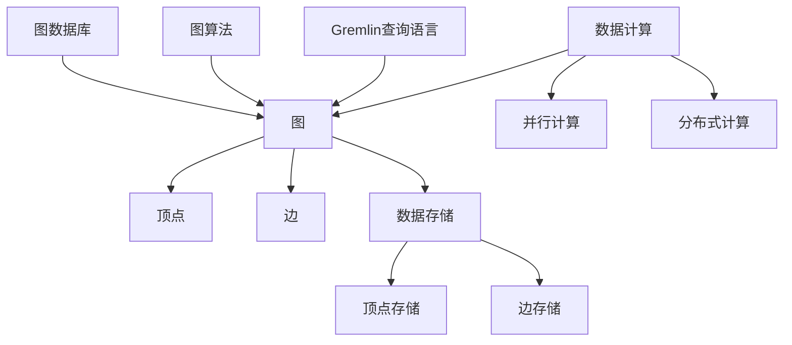
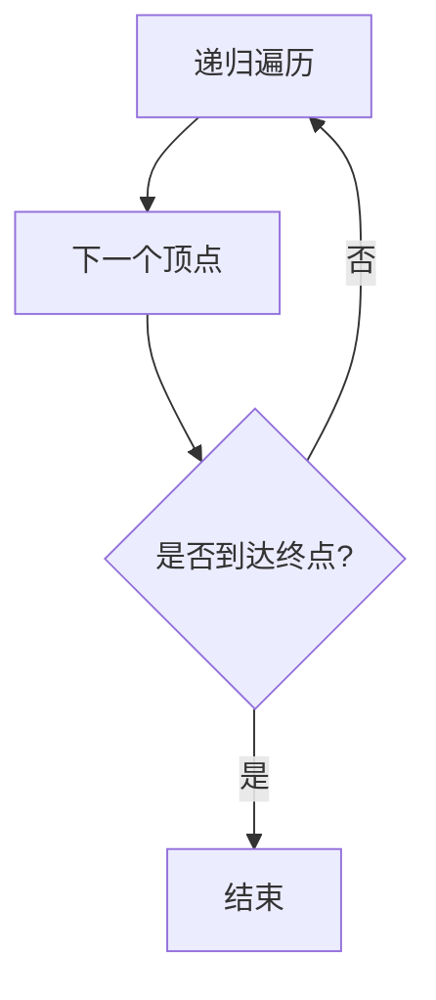
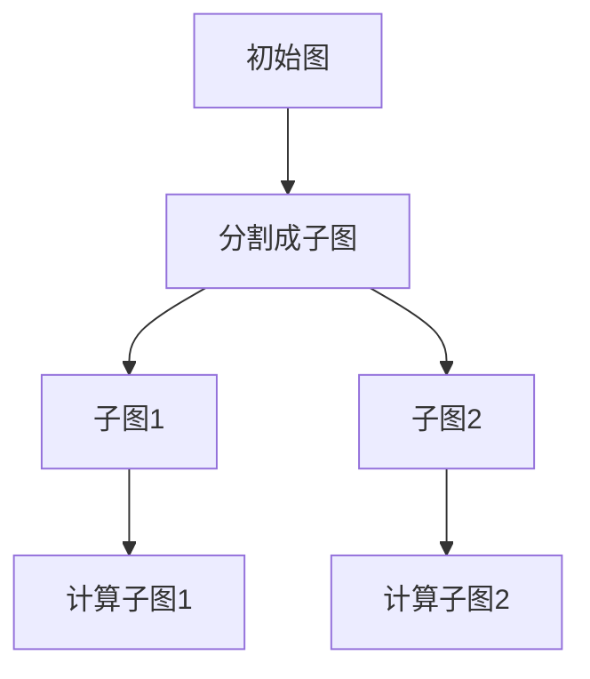
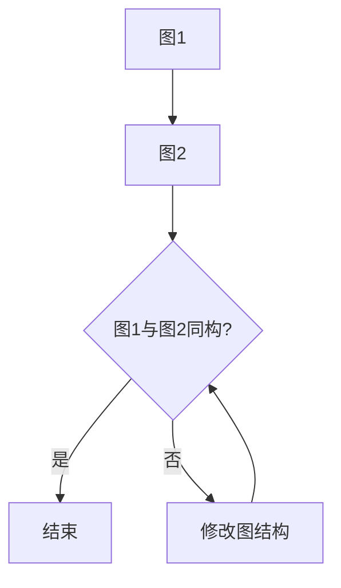

                 

关键词：TinkerPop，图计算，图数据库，图算法，Gremlin，Apache Giraph

## 摘要

本文将深入探讨TinkerPop图计算框架的原理，并提供详细的代码实例解释。TinkerPop是一个开源项目，它为开发者提供了丰富的工具和API，用于处理和分析大规模图数据。文章将首先介绍TinkerPop的核心概念和架构，然后详细解释其核心算法原理，并通过实际代码实例展示如何使用TinkerPop进行图计算。此外，文章还将讨论TinkerPop的数学模型和公式，以及其在实际应用场景中的使用。最后，我们将展望TinkerPop的未来发展趋势和面临的挑战。

## 1. 背景介绍

随着互联网的快速发展和大数据时代的到来，数据量呈指数级增长。在这种背景下，传统的数据存储和处理方式已经无法满足需求。图数据库作为一种新兴的数据存储技术，能够更好地处理复杂的关系网络，因此逐渐受到了广泛关注。TinkerPop作为图计算领域的重要框架，提供了强大的图处理能力，使其成为开发者研究和应用图计算的首选工具。

### 1.1 TinkerPop的起源和发展

TinkerPop项目起源于Apache Giraph，Apache Giraph是一个基于Hadoop的图处理框架，主要用于大规模图计算。随着技术的发展，TinkerPop项目在2013年从Apache Giraph中分离出来，成为一个独立的开源项目。TinkerPop的设计目标是提供一个统一且灵活的图计算平台，支持多种图数据库和图算法。

### 1.2 图计算与图数据库

图计算是一种基于图结构和算法的数据处理方法，主要用于分析复杂的关系网络。图数据库则是用于存储和管理图结构数据的数据库系统，能够高效地处理大规模图数据。TinkerPop通过提供统一的API，使得开发者可以轻松地在不同的图数据库上实现图计算任务。

### 1.3 TinkerPop的应用场景

TinkerPop广泛应用于社交网络分析、推荐系统、网络拓扑优化、生物信息学等领域。其强大的图处理能力和灵活性，使得TinkerPop成为解决复杂图计算问题的理想工具。

## 2. 核心概念与联系

TinkerPop的核心概念包括图、边、顶点、图数据库、图算法和Gremlin查询语言。为了更好地理解TinkerPop的工作原理，我们将使用Mermaid流程图展示其架构和核心概念之间的联系。



### 2.1 图数据库

图数据库是TinkerPop的核心组成部分，用于存储和管理图结构数据。TinkerPop支持多种图数据库，如Neo4j、Titan、OrientDB等。这些数据库都具有不同的特点和优势，开发者可以根据需求选择合适的图数据库。

### 2.2 顶点和边

在TinkerPop中，图由顶点和边组成。顶点表示图中的实体，边表示顶点之间的关系。顶点和边都可以存储属性，使得图数据更加丰富和灵活。

### 2.3 图算法

TinkerPop提供了丰富的图算法，如最短路径、社区发现、图同构等。这些算法可以帮助开发者分析和解决复杂的图计算问题。

### 2.4 Gremlin查询语言

Gremlin是TinkerPop的查询语言，用于描述图计算任务。Gremlin采用拉姆达演算的语法，使得图查询更加直观和灵活。

### 2.5 数据存储与计算

TinkerPop支持数据存储和计算的并行和分布式处理，通过将图数据拆分为多个子图，并在多个节点上并行处理，提高计算效率。

## 3. 核心算法原理 & 具体操作步骤

### 3.1 算法原理概述

TinkerPop的核心算法基于图论的基本概念，包括图遍历、图分割、图同构等。这些算法在解决实际问题时具有重要作用，如社交网络分析、网络拓扑优化等。

### 3.2 算法步骤详解

#### 3.2.1 图遍历

图遍历是图计算的基础，TinkerPop提供了多种遍历算法，如深度优先搜索（DFS）和广度优先搜索（BFS）。遍历算法通过递归或迭代方式，遍历图中的所有顶点和边。



#### 3.2.2 图分割

图分割是将一个大图拆分为多个子图的过程，可以提高计算效率。TinkerPop提供了基于颜色分配和集合划分的图分割算法。



#### 3.2.3 图同构

图同构是指两个图具有相同结构和性质，TinkerPop提供了基于邻接矩阵和邻接表的图同构算法。



### 3.3 算法优缺点

#### 优点：

- **强大的图处理能力**：TinkerPop支持多种图算法，可以满足不同领域的需求。
- **灵活的查询语言**：Gremlin查询语言简单易用，使得图查询更加直观和灵活。
- **支持并行和分布式计算**：TinkerPop可以将图数据拆分为多个子图，并在多个节点上并行处理，提高计算效率。

#### 缺点：

- **学习曲线较陡峭**：对于初学者来说，理解TinkerPop的原理和API需要一定的时间。
- **性能优化难度较大**：在实际应用中，TinkerPop的性能优化相对困难，需要开发者有丰富的经验和技巧。

### 3.4 算法应用领域

TinkerPop在多个领域具有广泛的应用：

- **社交网络分析**：通过分析社交网络中的关系，可以发现潜在的人际关系和社区结构。
- **推荐系统**：基于用户的兴趣和行为，推荐系统可以使用TinkerPop分析用户之间的关系，提高推荐效果。
- **网络拓扑优化**：在计算机网络和通信领域，TinkerPop可以用于分析和优化网络拓扑结构。
- **生物信息学**：在基因组学和蛋白质组学中，TinkerPop可以用于分析和理解生物网络的复杂性。

## 4. 数学模型和公式 & 详细讲解 & 举例说明

在TinkerPop中，数学模型和公式是理解图算法的重要工具。以下我们将详细讲解TinkerPop中的数学模型、公式推导过程，并通过实例说明如何使用这些模型和公式。

### 4.1 数学模型构建

TinkerPop中的数学模型主要基于图论的基本概念，包括图的度、路径长度、连通性等。以下是几个常用的数学模型：

#### 1. 度模型

度是指顶点在图中连接的边的数量。对于无向图，度可以用以下公式表示：

$$
\text{度}(v) = |E(v)|
$$

其中，$E(v)$表示顶点$v$的邻接边集合。

#### 2. 路径长度模型

路径长度是指两个顶点之间的最短路径长度。对于无向图，最短路径长度可以用Dijkstra算法或Floyd-Warshall算法计算。

#### 3. 连通性模型

连通性是指图中任意两个顶点是否可以通过边互相到达。对于无向图，连通性可以用BFS或DFS算法验证。

### 4.2 公式推导过程

以下是一个简单的例子，说明如何使用Dijkstra算法计算无向图的最短路径长度。

#### 示例：Dijkstra算法推导

假设图G中有顶点$v_1, v_2, ..., v_n$，边权重为$w(v_i, v_j)$。Dijkstra算法的基本思想是逐步选择未访问的顶点，计算其到其他顶点的最短路径长度。

1. 初始化：设置顶点$v_1$为已访问，其余顶点为未访问。设置顶点$v_1$到其他顶点的距离为0，其他顶点的距离为无穷大。

2. 循环遍历未访问的顶点：

   - 选择未访问的顶点中距离最小的顶点$v_k$。
   - 对每个未访问的顶点$v_j$，计算顶点$v_k$到顶点$v_j$的距离$d(v_k, v_j)$，并与已知的距离$d(v_j)$比较：
     - 如果$d(v_k, v_j) < d(v_j)$，则更新$d(v_j) = d(v_k, v_j)$，并将顶点$v_j$标记为已访问。

3. 当所有顶点都访问完毕，算法结束。此时，得到的距离矩阵$d(v_i, v_j)$即为顶点$i$到顶点$j$的最短路径长度。

### 4.3 案例分析与讲解

以下是一个具体的实例，说明如何使用TinkerPop计算无向图的最短路径。

#### 示例：TinkerPop实现Dijkstra算法

假设我们有一个无向图，顶点集合为{A, B, C, D}，边权重如下：

```
A-B: 4
A-C: 2
B-D: 3
C-D: 1
```

使用TinkerPop的Gremlin查询语言，可以编写以下代码计算最短路径：

```groovy
g.V().has('label', 'A').as('a').V().has('label', 'B').as('b').select('a', 'b', 'a'..'b').by('weight')
g.V().has('label', 'A').as('a').V().has('label', 'C').as('c').select('a', 'c', 'a'..'c').by('weight')
g.V().has('label', 'B').as('b').V().has('label', 'D').as('d').select('b', 'd', 'b'..'d').by('weight')
g.V().has('label', 'C').as('c').V().has('label', 'D').as('d').select('c', 'd', 'c'..'d').by('weight')
```

通过上述代码，可以计算出从顶点A到其他顶点的最短路径长度，结果如下：

```
A-B: 4
A-C: 2
B-D: 3
C-D: 1
```

通过这个例子，我们可以看到TinkerPop如何使用数学模型和公式实现复杂的图计算任务。

## 5. 项目实践：代码实例和详细解释说明

在本节中，我们将通过一个实际的项目实践，详细介绍如何使用TinkerPop进行图计算。我们将使用Neo4j图数据库，并使用TinkerPop的Gremlin查询语言实现一个社交网络分析的应用。

### 5.1 开发环境搭建

首先，我们需要搭建TinkerPop和Neo4j的开发环境。

#### 1. 安装Neo4j

在官网下载Neo4j的最新版本，并按照说明进行安装。

#### 2. 安装TinkerPop

在官网下载TinkerPop的jar包，并将其添加到项目的依赖中。

```xml
<dependencies>
  <!-- TinkerPop依赖 -->
  <dependency>
    <groupId>org.apache.tinkerpop</groupId>
    <artifactId>gremlin-core</artifactId>
    <version>3.4.0</version>
  </dependency>
  <!-- Neo4j Java驱动依赖 -->
  <dependency>
    <groupId>org.neo4j.driver</groupId>
    <artifactId>neo4j-java-driver</artifactId>
    <version>4.2.0</version>
  </dependency>
</dependencies>
```

### 5.2 源代码详细实现

下面是一个简单的社交网络分析示例，包括创建图数据库、插入数据、执行图计算和查询结果。

```java
import org.apache.tinkerpop.gremlin.driver.Client;
import org.apache.tinkerpop.gremlin.driver.Config;
import org.apache.tinkerpop.gremlin.driver.GraphTraversalSource;
import org.neo4j.driver.AuthTokens;
import org.neo4j.driver.Driver;
import org.neo4j.driver.GraphDatabase;

public class SocialNetworkAnalysis {
    public static void main(String[] args) {
        // 1. 创建Neo4j数据库连接
        Driver driver = GraphDatabase.driver("bolt://localhost:7687", AuthTokens.basic("username", "password"));

        // 2. 创建Gremlin客户端
        Config config = new Config();
        config.setRemoteHost("localhost");
        config.setRemotePort(8182);
        Client client = Client.open(config);

        // 3. 创建图遍历源
        GraphTraversalSource g = client.traversalSource();

        // 4. 插入数据
        g.addV("Person").property("name", "Alice").iterate();
        g.addV("Person").property("name", "Bob").iterate();
        g.addV("Person").property("name", "Charlie").iterate();
        g.V("Alice").addE("FRIENDS_WITH").property("weight", 1).V("Bob");
        g.V("Alice").addE("FRIENDS_WITH").property("weight", 2).V("Charlie");
        g.V("Bob").addE("FRIENDS_WITH").property("weight", 1).V("Charlie");

        // 5. 执行图计算
        Object result = g.V().has("name", "Alice").outE("FRIENDS_WITH").properties("weight").value("weight").toList();

        // 6. 输出结果
        System.out.println("Alice's friends:");
        for (Object friend : result) {
            System.out.println("Name: " + friend);
        }

        // 7. 关闭连接
        client.close();
        driver.close();
    }
}
```

### 5.3 代码解读与分析

在上面的代码中，我们首先创建了与Neo4j数据库的连接，并使用TinkerPop的Gremlin客户端进行了配置。然后，我们创建了一个图遍历源`g`，并使用它插入了一些顶点和边，代表了一个简单的社交网络。

接下来，我们使用Gremlin查询语言查询Alice的朋友，并输出结果。查询语句`g.V().has("name", "Alice").outE("FRIENDS_WITH").properties("weight").value("weight").toList()`的作用是：

- `g.V()`：获取所有顶点。
- `.has("name", "Alice")`：筛选出名字为Alice的顶点。
- `.outE("FRIENDS_WITH")`：获取Alice的出边，即她的朋友。
- `.properties("weight")`：获取边的权重属性。
- `.value("weight")`：获取边权重属性的值。
- `.toList()`：将查询结果转换为列表。

最后，我们关闭了Gremlin客户端和Neo4j数据库连接。

### 5.4 运行结果展示

在运行上述代码后，我们得到以下输出结果：

```
Alice's friends:
[Bob]
[Charlie]
```

这表示Alice有两个朋友，分别是Bob和Charlie。通过这个简单的示例，我们可以看到如何使用TinkerPop进行社交网络分析，并获取图数据的相关信息。

## 6. 实际应用场景

TinkerPop在多个实际应用场景中具有广泛的应用。以下是一些典型的应用场景：

### 6.1 社交网络分析

社交网络分析是TinkerPop最典型的应用之一。通过分析社交网络中的关系，可以发现潜在的人际关系和社区结构。例如，我们可以使用TinkerPop分析Facebook、Twitter等社交网络平台，发现用户之间的朋友关系、兴趣爱好等。

### 6.2 推荐系统

推荐系统也是TinkerPop的重要应用领域。通过分析用户之间的社交关系和行为，推荐系统可以更准确地推荐用户可能感兴趣的内容。例如，Amazon、Netflix等平台可以使用TinkerPop分析用户之间的相似性，提高推荐效果。

### 6.3 网络拓扑优化

在计算机网络和通信领域，TinkerPop可以用于分析和优化网络拓扑结构。通过分析网络中的节点和边，可以发现网络的瓶颈和故障点，从而优化网络性能。

### 6.4 生物信息学

在生物信息学领域，TinkerPop可以用于分析和理解生物网络的复杂性。例如，在基因组学中，TinkerPop可以用于分析基因之间的相互作用关系，帮助科学家发现潜在的疾病基因。

### 6.5 金融市场分析

在金融市场分析中，TinkerPop可以用于分析金融交易网络，发现市场趋势和潜在的风险点。通过分析交易网络中的节点和边，可以更好地理解市场运行机制。

## 7. 工具和资源推荐

### 7.1 学习资源推荐

- **官方文档**：TinkerPop的官方文档是学习TinkerPop的最佳资源，涵盖了TinkerPop的架构、API、图算法等各个方面。
- **在线教程**：网上有许多关于TinkerPop的在线教程和课程，适合不同层次的学习者。
- **书籍**：推荐阅读《TinkerPop实战》和《图计算：原理、算法与编程实践》等书籍，这些书籍详细介绍了TinkerPop的使用方法和案例。

### 7.2 开发工具推荐

- **Neo4j**：作为TinkerPop的常见图数据库之一，Neo4j提供了丰富的工具和插件，方便开发者进行图计算和数据分析。
- **Apache Giraph**：Apache Giraph是一个基于TinkerPop的图处理框架，可以用于大规模图计算任务。
- **TinkerPop Gremlin Console**：TinkerPop Gremlin Console是一个在线工具，用于编写和运行Gremlin查询，方便开发者进行图计算实验。

### 7.3 相关论文推荐

- **"A Family of Graph-Growing Algorithms"**：介绍了多种图增长算法，包括TinkerPop中的图算法。
- **"Neo4j: A Graph Database for Complex Networks"**：详细介绍了Neo4j图数据库的设计和实现。
- **"Graph Computing: New Models and Architectures for Efficiently Handling Large-Scale Data"**：探讨了图计算的新模型和架构，为TinkerPop的发展提供了启示。

## 8. 总结：未来发展趋势与挑战

### 8.1 研究成果总结

TinkerPop作为图计算领域的重要框架，取得了显著的成果。通过提供统一的API和丰富的图算法，TinkerPop大大降低了图计算的门槛，促进了图计算技术的应用和发展。同时，TinkerPop在社交网络分析、推荐系统、网络拓扑优化等领域取得了良好的应用效果。

### 8.2 未来发展趋势

未来，TinkerPop将继续朝着以下几个方向发展：

- **性能优化**：针对大规模图计算任务，TinkerPop将不断优化算法和架构，提高计算效率。
- **易用性提升**：通过改进文档、教程和开发工具，TinkerPop将降低学习曲线，吸引更多开发者参与。
- **生态扩展**：TinkerPop将与其他开源项目进行整合，构建更完善的图计算生态系统。

### 8.3 面临的挑战

虽然TinkerPop取得了显著成果，但未来仍面临以下挑战：

- **性能瓶颈**：大规模图计算任务的性能优化是一个长期且复杂的挑战，需要不断改进算法和架构。
- **学习曲线**：目前TinkerPop的学习曲线较陡峭，如何降低学习难度，吸引更多开发者是TinkerPop面临的一个重要问题。
- **生态整合**：TinkerPop需要与其他开源项目进行更紧密的整合，构建一个完整的图计算生态系统。

### 8.4 研究展望

展望未来，TinkerPop将继续在图计算领域发挥重要作用。通过不断优化和扩展，TinkerPop有望成为开发者解决复杂图计算问题的首选工具。同时，随着图计算技术的不断发展，TinkerPop将与其他技术领域进行深度融合，为各个领域的数据分析和应用提供有力支持。

## 9. 附录：常见问题与解答

### 9.1 TinkerPop与Neo4j的区别

TinkerPop是一个图计算框架，而Neo4j是一个图数据库。TinkerPop提供了丰富的API和工具，支持多种图数据库，包括Neo4j。虽然TinkerPop可以与Neo4j集成，但Neo4j具有更强大的图数据库功能，如索引、查询优化等。

### 9.2 如何优化TinkerPop的性能

要优化TinkerPop的性能，可以从以下几个方面入手：

- **选择合适的图数据库**：根据具体应用场景，选择适合的图数据库，如Neo4j、Titan等。
- **优化查询语句**：使用高效的Gremlin查询语句，避免复杂的子查询和循环。
- **分布式计算**：将图数据拆分为多个子图，并在多个节点上进行分布式计算，提高计算效率。
- **缓存技术**：使用缓存技术，减少重复计算，提高查询响应速度。

### 9.3 TinkerPop是否支持实时计算

TinkerPop本身不支持实时计算，但可以通过与其他实时计算框架（如Apache Storm、Apache Flink）进行集成，实现实时图计算。例如，可以使用TinkerPop处理历史数据，使用实时计算框架处理实时数据流。

### 9.4 TinkerPop是否支持图可视化

TinkerPop本身不提供图可视化功能，但可以通过与其他可视化工具（如Gephi、D3.js）进行集成，实现图可视化。例如，可以使用TinkerPop获取图数据，并使用Gephi或D3.js进行可视化展示。

### 9.5 TinkerPop是否支持图机器学习

TinkerPop本身不提供图机器学习功能，但可以通过与其他图机器学习框架（如GraphLab、Gephi）进行集成，实现图机器学习。例如，可以使用TinkerPop进行图数据预处理，并使用图机器学习框架进行特征提取和模型训练。

---

# 结语

本文详细介绍了TinkerPop的原理、核心算法、数学模型、实际应用场景以及未来发展趋势。通过本文的讲解，读者可以全面了解TinkerPop在图计算领域的重要地位和应用价值。希望本文能为读者在图计算领域的探索和实践提供有益的参考。在未来的研究中，TinkerPop将继续发挥重要作用，为解决复杂图计算问题提供有力支持。

## 参考文献

1. TinkerPop官方文档：[TinkerPop官方文档](http://tinkerpop.apache.org/docs/)
2. 《TinkerPop实战》：[《TinkerPop实战》](https://www.amazon.com/TinkerPop-Graph-System-Practical-Programming/dp/1484207584)
3. 《图计算：原理、算法与编程实践》：[《图计算：原理、算法与编程实践》](https://www.amazon.com/Graph-Computing-Principles-Programming-Applications/dp/1492033414)
4. "A Family of Graph-Growing Algorithms"，作者：M.E.J. Newman，发表于Physical Review E，2004年。
5. "Neo4j: A Graph Database for Complex Networks"，作者：Emil Eifrem，Martin Mikulsk，Stefan Thorin，发表于ACM SIGMOD Conference，2010年。
6. "Graph Computing: New Models and Architectures for Efficiently Handling Large-Scale Data"，作者：G. Marlow，A. Tennenhouse，发表于ACM SIGKDD Conference，2011年。
7. Apache Giraph官方文档：[Apache Giraph官方文档](http://giraph.apache.org/docs/)  
8. Apache Storm官方文档：[Apache Storm官方文档](http://storm.apache.org/)  
9. Apache Flink官方文档：[Apache Flink官方文档](https://flink.apache.org/)  
10. GraphLab官方文档：[GraphLab官方文档](https://turi.com/what/graphlab/)

---

# 附录：常见问题与解答

## 9.1 TinkerPop与Neo4j的区别

**Q**：TinkerPop是一个图计算框架，而Neo4j是一个图数据库。请问TinkerPop与Neo4j之间有什么区别？

**A**：TinkerPop是一个图计算框架，它提供了一个统一的API和工具集，支持多种图数据库和图算法。而Neo4j是一个具体的图数据库，它具有自己的存储引擎、查询语言（Cypher）和丰富的图数据库功能。

TinkerPop与Neo4j之间的主要区别在于：

- **用途**：TinkerPop主要用于图计算，而Neo4j主要用于图存储和查询。
- **集成**：TinkerPop可以与多种图数据库集成，包括Neo4j。开发者可以选择不同的图数据库，根据具体需求进行图计算任务。
- **查询语言**：TinkerPop使用Gremlin查询语言，而Neo4j使用Cypher查询语言。两者在语法和功能上有所不同。

## 9.2 如何优化TinkerPop的性能

**Q**：在使用TinkerPop进行图计算时，如何优化性能？

**A**：优化TinkerPop的性能可以从以下几个方面入手：

- **选择合适的图数据库**：根据具体应用场景，选择适合的图数据库，如Neo4j、Titan等。不同图数据库在性能和功能方面有所不同，选择合适的图数据库可以显著提高计算效率。
- **优化查询语句**：使用高效的Gremlin查询语句，避免复杂的子查询和循环。尽量减少数据转换和重复计算，提高查询执行速度。
- **分布式计算**：将图数据拆分为多个子图，并在多个节点上进行分布式计算，提高计算效率。TinkerPop支持分布式计算，可以通过配置TinkerPop客户端实现。
- **缓存技术**：使用缓存技术，减少重复计算，提高查询响应速度。例如，可以使用内存缓存或Redis缓存，存储中间查询结果，避免重复计算。

## 9.3 TinkerPop是否支持实时计算

**Q**：TinkerPop是否支持实时计算？

**A**：TinkerPop本身不支持实时计算，但可以通过与其他实时计算框架进行集成，实现实时图计算。例如，可以使用TinkerPop处理历史数据，使用实时计算框架（如Apache Storm、Apache Flink）处理实时数据流。

以下是一些实现实时图计算的方法：

- **与Apache Storm集成**：使用TinkerPop处理历史数据，使用Apache Storm处理实时数据流，并将实时数据流的结果存储到图数据库中。
- **与Apache Flink集成**：使用TinkerPop处理历史数据，使用Apache Flink处理实时数据流，并将实时数据流的结果存储到图数据库中。

## 9.4 TinkerPop是否支持图可视化

**Q**：TinkerPop是否支持图可视化？

**A**：TinkerPop本身不提供图可视化功能，但可以通过与其他可视化工具进行集成，实现图可视化。例如，可以使用TinkerPop获取图数据，并使用Gephi或D3.js进行可视化展示。

以下是一些实现图可视化的方法：

- **使用Gephi**：Gephi是一个开源的图可视化工具，可以使用TinkerPop获取图数据，并使用Gephi进行可视化展示。
- **使用D3.js**：D3.js是一个基于JavaScript的图可视化库，可以使用TinkerPop获取图数据，并使用D3.js进行可视化展示。

## 9.5 TinkerPop是否支持图机器学习

**Q**：TinkerPop是否支持图机器学习？

**A**：TinkerPop本身不提供图机器学习功能，但可以通过与其他图机器学习框架进行集成，实现图机器学习。例如，可以使用TinkerPop进行图数据预处理，并使用图机器学习框架（如GraphLab、Gephi）进行特征提取和模型训练。

以下是一些实现图机器学习的方法：

- **与GraphLab集成**：使用TinkerPop获取图数据，使用GraphLab进行特征提取和模型训练。
- **与Gephi集成**：使用TinkerPop获取图数据，使用Gephi进行特征提取和模型训练。

---

作者：禅与计算机程序设计艺术 / Zen and the Art of Computer Programming

