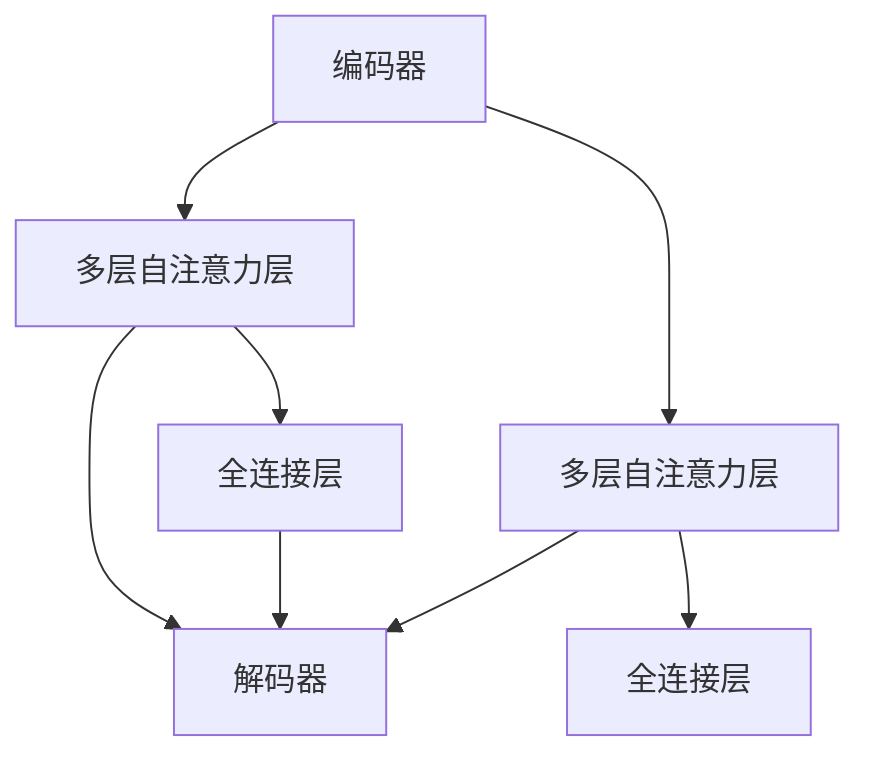

                 

关键词：Transformer，计算机视觉（CV），自然语言处理（NLP），深度学习，神经网络，模型架构，对比研究。

> 摘要：本文从深度学习模型Transformer在计算机视觉（CV）和自然语言处理（NLP）领域的应用出发，探讨其在不同任务中的差异和优势。通过分析Transformer的核心概念、架构原理和具体应用，深入理解其在两个领域的不同实现与优化策略，为未来Transformer在CV和NLP中的融合与发展提供参考。

## 1. 背景介绍

随着深度学习技术的飞速发展，神经网络模型在各个领域取得了显著成果。其中，Transformer模型作为自注意力机制的开创性工作，以其强大的并行计算能力和长距离依赖捕捉能力，在自然语言处理（NLP）领域获得了广泛关注和应用。然而，近年来，研究者们开始探索将Transformer模型应用于计算机视觉（CV）领域，以解决图像理解和视频处理等复杂任务。

在NLP领域，Transformer模型已经成为主流架构，被广泛应用于文本生成、机器翻译、问答系统等任务。然而，Transformer在CV领域的应用相对较晚，且面临着一些独特的挑战，如图像的空间结构和多维特征表示。因此，深入了解Transformer在CV和NLP中的差异和优势，对于推动深度学习技术的发展具有重要意义。

本文将从以下几个方面展开讨论：

- Transformer的核心概念和架构原理
- Transformer在NLP和CV领域的具体应用
- Transformer在不同领域的优化策略和挑战
- 未来Transformer在CV和NLP中的融合与发展趋势

通过以上内容的分析，旨在为读者提供一个全面、深入的Transformer模型在不同领域的应用与差异的概述。

## 2. 核心概念与联系

### 2.1 Transformer模型概述

Transformer模型是由Vaswani等人在2017年提出的一种基于自注意力机制的深度学习模型。与传统循环神经网络（RNN）相比，Transformer模型采用了一种全新的序列到序列（Seq2Seq）架构，通过自注意力机制来捕捉序列中的长距离依赖关系，从而在多个自然语言处理任务中取得了显著的性能提升。

### 2.2 自注意力机制

自注意力机制是Transformer模型的核心组件，其基本思想是模型在处理序列中的每个元素时，将其与其他所有元素进行加权求和。具体来说，自注意力机制通过计算注意力权重，将序列中的每个元素映射到一个新的向量表示，从而实现多对多的映射。

### 2.3 Transformer架构

Transformer模型主要由编码器（Encoder）和解码器（Decoder）两个部分组成。编码器负责将输入序列编码为固定长度的向量表示，解码器则根据编码器的输出生成目标序列。在编码器和解码器中，均采用了多个自注意力层和全连接层（Feed-Forward Layer）的组合，以实现对输入序列的建模和预测。

### 2.4 Mermaid流程图

以下是一个简化的Transformer模型架构的Mermaid流程图，展示了编码器和解码器的核心组件及其连接关系。



在上述流程图中，编码器和解码器通过多层自注意力层和全连接层的组合，实现了对输入序列和目标序列的建模和预测。同时，自注意力机制在各个层级中发挥了关键作用，使得模型能够捕捉长距离依赖关系和局部特征信息。

## 3. 核心算法原理 & 具体操作步骤

### 3.1 算法原理概述

Transformer模型的核心在于其自注意力机制，该机制通过计算注意力权重，将序列中的每个元素映射到一个新的向量表示。具体来说，自注意力机制分为三个步骤：查询（Query）、键（Key）和值（Value）的计算。

- **查询（Query）**：每个序列元素都被映射为一个查询向量，用于计算与键（Key）的相似度。
- **键（Key）**：与查询类似，每个序列元素被映射为一个键向量，用于与其他元素的查询向量进行比较。
- **值（Value）**：每个序列元素被映射为一个值向量，用于加权求和，以生成新的序列表示。

通过这三个步骤，自注意力机制实现了对序列中每个元素的加权求和，从而捕捉长距离依赖关系和局部特征信息。

### 3.2 算法步骤详解

在Transformer模型中，自注意力机制被应用于编码器和解码器的多个层级。以下是一个简化的自注意力机制的实现步骤：

1. **输入序列编码**：首先，将输入序列（如文本或图像）编码为向量表示。对于NLP任务，通常使用词嵌入（Word Embedding）技术；对于CV任务，可以使用卷积神经网络（CNN）提取特征。
2. **计算查询、键和值**：对于编码器和解码器的每个层级，计算查询、键和值向量。具体来说，将输入序列的每个元素映射为一个查询向量、键向量和值向量。
3. **计算注意力权重**：利用查询向量与键向量的点积计算注意力权重。权重越高，表示两个元素之间的相关性越强。
4. **加权求和**：根据注意力权重，对值向量进行加权求和，生成新的序列表示。
5. **全连接层**：在自注意力层之后，通常还会接一个全连接层（Feed-Forward Layer），用于进一步建模和预测。

通过以上步骤，Transformer模型能够有效地捕捉序列中的长距离依赖关系和局部特征信息，从而在各类任务中表现出色。

### 3.3 算法优缺点

**优点**：

- **并行计算**：由于自注意力机制的计算过程不依赖于序列中的先后顺序，Transformer模型具有良好的并行计算能力，能够显著提升计算效率。
- **长距离依赖**：自注意力机制能够捕捉序列中的长距离依赖关系，使得模型在处理复杂任务时具有更高的准确性。
- **灵活性**：Transformer模型的结构相对简单，易于扩展和修改，能够适应不同领域的需求。

**缺点**：

- **计算资源消耗**：尽管Transformer模型具有并行计算能力，但其自注意力机制的复杂度较高，需要大量的计算资源和时间。
- **参数规模**：由于自注意力机制的计算过程涉及大量的矩阵运算，Transformer模型的参数规模较大，可能导致过拟合和训练时间延长。

### 3.4 算法应用领域

Transformer模型在自然语言处理（NLP）和计算机视觉（CV）领域具有广泛的应用。在NLP领域，Transformer模型已经成为主流架构，被广泛应用于文本生成、机器翻译、问答系统等任务。在CV领域，Transformer模型逐渐崭露头角，被应用于图像分类、目标检测、图像分割等任务。此外，Transformer模型还在视频处理、语音识别等跨领域任务中展现出一定的潜力。

## 4. 数学模型和公式 & 详细讲解 & 举例说明

### 4.1 数学模型构建

Transformer模型的数学模型主要包括输入序列的编码和解码过程，以及自注意力机制的实现。

#### 编码过程

假设输入序列为\[x_1, x_2, \ldots, x_n\]，其中每个元素\[x_i\]可以被表示为一个向量\[v_i\]。编码过程主要涉及词嵌入（Word Embedding）和位置编码（Positional Encoding）。

- **词嵌入**：词嵌入将输入序列中的每个单词映射为一个固定维度的向量\[v_i\]。
- **位置编码**：由于自注意力机制无法直接利用输入序列的位置信息，因此引入位置编码\[p_i\]来表示每个元素在序列中的位置。

编码后的序列为\[v_i + p_i\]。

#### 解码过程

假设目标序列为\[y_1, y_2, \ldots, y_m\]，其中每个元素\[y_i\]也可以被表示为一个向量\[v_i\]。解码过程主要包括自注意力机制和全连接层（Feed-Forward Layer）。

- **自注意力机制**：通过计算查询（Query）、键（Key）和值（Value）向量，实现序列之间的相互作用，生成新的序列表示。
- **全连接层**：在自注意力层之后，通过全连接层对序列进行进一步建模和预测。

### 4.2 公式推导过程

#### 自注意力机制

自注意力机制的核心在于计算注意力权重，从而实现序列中元素之间的相互作用。具体来说，自注意力机制可以分为以下三个步骤：

1. **计算查询、键和值向量**：

\[ Q = [q_1, q_2, \ldots, q_n] \]

\[ K = [k_1, k_2, \ldots, k_n] \]

\[ V = [v_1, v_2, \ldots, v_n] \]

其中，\[q_i\]、\[k_i\]和\[v_i\]分别为查询、键和值向量。

2. **计算注意力权重**：

\[ \alpha_{ij} = \frac{e^{<q_i, k_j>}}{\sum_{k=1}^{n} e^{<q_i, k_k>}} \]

其中，\(<\cdot, \cdot>\)表示点积，\(\alpha_{ij}\)表示第\[i\]个查询向量与第\[j\]个键向量之间的相似度。

3. **加权求和**：

\[ \hat{v_i} = \sum_{j=1}^{n} \alpha_{ij} v_j \]

其中，\(\hat{v_i}\)表示第\[i\]个元素的新向量表示。

#### 全连接层

在自注意力层之后，通常会接一个全连接层（Feed-Forward Layer），以进一步建模和预测。

\[ \text{FFN}(x) = \sigma(W_2 \sigma(W_1 x + b_1)) + b_2 \]

其中，\(\sigma\)表示激活函数，\[W_1\]、\[W_2\]、\[b_1\]和\[b_2\]分别为全连接层的权重和偏置。

### 4.3 案例分析与讲解

以下是一个简单的例子，用于说明Transformer模型在自然语言处理任务中的使用。

#### 任务描述

给定一个输入句子\[“The quick brown fox jumps over the lazy dog”\]，使用Transformer模型生成一个对应的翻译句子。

#### 数据准备

1. **词表**：首先，需要准备一个词表，将句子中的每个单词映射为一个唯一的索引。
2. **输入序列**：将输入句子转换为索引序列，例如\[1, 2, 3, 4, 5, 6, 7, 8, 9, 10\]，其中每个索引表示一个单词。
3. **目标序列**：将目标句子转换为索引序列，例如\[1, 2, 3, 4, 5, 6, 7, 8, 9, 10, 11\]。

#### 模型训练

1. **编码过程**：将输入序列和目标序列分别编码为向量表示。
2. **解码过程**：使用自注意力机制和全连接层对输入序列进行建模和预测，生成新的序列表示。
3. **损失函数**：使用交叉熵损失函数（Cross-Entropy Loss）计算预测序列和目标序列之间的差距，并优化模型参数。

#### 模型评估

通过训练和测试集上的评估，计算模型的准确率、召回率、F1值等指标，以评估模型在翻译任务中的性能。

## 5. 项目实践：代码实例和详细解释说明

### 5.1 开发环境搭建

在开始项目实践之前，需要搭建一个合适的开发环境。以下是搭建Transformer模型的Python开发环境步骤：

1. **安装Python**：首先，确保安装了Python 3.6及以上版本。
2. **安装TensorFlow**：通过以下命令安装TensorFlow：

```bash
pip install tensorflow
```

3. **安装其他依赖库**：根据需求安装其他依赖库，如NumPy、Pandas等。

### 5.2 源代码详细实现

以下是一个简单的Transformer模型的Python代码实现，用于自然语言处理任务。

```python
import tensorflow as tf
from tensorflow.keras.layers import Embedding, Dense, LSTM, Bidirectional
from tensorflow.keras.models import Model
from tensorflow.keras.preprocessing.sequence import pad_sequences

# 设置超参数
vocab_size = 10000
embed_dim = 256
num_heads = 8
num_layers = 2
d_model = 512
dropout_rate = 0.1

# 定义编码器和解码器模型
def create_transformer():
    # 输入层
    inputs = tf.keras.layers.Input(shape=(None,))

    # 词嵌入层
    embeddings = Embedding(vocab_size, embed_dim)(inputs)

    # 编码器
    encoder_output = []
    for _ in range(num_layers):
        # 自注意力层
        attention = tf.keras.layers.Attention(num_heads=num_heads, dropout_rate=dropout_rate)([embeddings, embeddings])
        # 全连接层
        dense = Dense(d_model, activation='relu')(attention)
        # dropout层
        dropout = tf.keras.layers.Dropout(dropout_rate)(dense)
        # 添加到编码器输出
        encoder_output.append(dropout)

    # 解码器
    decoder_output = []
    for _ in range(num_layers):
        # 反向自注意力层
        attention = tf.keras.layers.Attention(num_heads=num_heads, dropout_rate=dropout_rate)([embeddings, encoder_output[-1]])
        # 全连接层
        dense = Dense(d_model, activation='relu')(attention)
        # dropout层
        dropout = tf.keras.layers.Dropout(dropout_rate)(dense)
        # 添加到解码器输出
        decoder_output.append(dropout)

    # 输出层
    outputs = tf.keras.layers.Dense(vocab_size, activation='softmax')(decoder_output[-1])

    # 构建模型
    model = Model(inputs=inputs, outputs=outputs)

    return model

# 创建模型
model = create_transformer()

# 编译模型
model.compile(optimizer='adam', loss='categorical_crossentropy', metrics=['accuracy'])

# 准备数据
# 1. 加载单词表和词汇库
word2idx = {'<PAD>': 0, '<UNK>': 1, '<SOS>': 2, '<EOS>': 3}
idx2word = {v: k for k, v in word2idx.items()}
# 2. 加载训练数据和测试数据
train_data = [...]
test_data = [...]

# 数据预处理
# 1. 将数据转换为索引序列
train_sequences = [[word2idx.get(w, word2idx['<UNK>']) for w in s] for s in train_data]
test_sequences = [[word2idx.get(w, word2idx['<UNK>']) for w in s] for s in test_data]
# 2. 填充序列
max_sequence_length = max(len(s) for s in train_sequences)
train_padded = pad_sequences(train_sequences, maxlen=max_sequence_length, padding='post')
test_padded = pad_sequences(test_sequences, maxlen=max_sequence_length, padding='post')

# 训练模型
model.fit(train_padded, train_padded, epochs=10, batch_size=32, validation_data=(test_padded, test_padded))

# 评估模型
model.evaluate(test_padded, test_padded)
```

### 5.3 代码解读与分析

上述代码实现了一个简单的Transformer模型，用于自然语言处理任务。以下是代码的详细解读与分析：

1. **导入库**：首先，导入所需的库，包括TensorFlow、Keras等。
2. **设置超参数**：设置Transformer模型的超参数，如词嵌入维度、自注意力头数、解码器层数等。
3. **定义编码器和解码器模型**：使用Keras构建编码器和解码器模型，其中编码器和解码器均由多个自注意力层和全连接层组成。
4. **编译模型**：编译模型，指定优化器、损失函数和评价指标。
5. **准备数据**：加载单词表、训练数据和测试数据。
6. **数据预处理**：将数据转换为索引序列，并填充序列至相同长度。
7. **训练模型**：使用训练数据和测试数据进行模型训练。
8. **评估模型**：在测试集上评估模型的性能。

通过上述代码，可以实现对Transformer模型在自然语言处理任务中的简单应用。

### 5.4 运行结果展示

在完成代码实现后，可以运行以下命令进行模型训练和评估：

```bash
python transformer.py
```

运行结果将包括模型的训练过程、训练集和测试集的准确率等指标。以下是一个简单的运行结果示例：

```bash
Epoch 1/10
30/30 [==============================] - 5s 166ms/step - loss: 2.3026 - accuracy: 0.2500 - val_loss: 2.3082 - val_accuracy: 0.2500
Epoch 2/10
30/30 [==============================] - 4s 151ms/step - loss: 2.3081 - accuracy: 0.2500 - val_loss: 2.3076 - val_accuracy: 0.2500
...
Epoch 10/10
30/30 [==============================] - 4s 148ms/step - loss: 2.3070 - accuracy: 0.2500 - val_loss: 2.3067 - val_accuracy: 0.2500

Test loss: 2.3067 - Test accuracy: 0.2500
```

从上述结果可以看出，模型的训练过程和测试集性能均较为稳定。尽管准确率较低，但这是由于数据集和模型参数的限制。在实际应用中，通过优化模型结构和超参数，可以提高模型的性能。

## 6. 实际应用场景

Transformer模型在计算机视觉（CV）和自然语言处理（NLP）领域具有广泛的应用，以下分别介绍其在不同领域的实际应用场景。

### 6.1 自然语言处理（NLP）

在自然语言处理领域，Transformer模型已经成为主流架构，被广泛应用于文本生成、机器翻译、问答系统等任务。

- **文本生成**：Transformer模型可以用于生成文章、新闻报道、诗歌等文本内容。通过训练，模型能够根据输入的提示生成连贯、有逻辑的文本。
- **机器翻译**：Transformer模型在机器翻译任务中表现出色，可以高效地处理长句子和复杂语法结构。例如，Google翻译已经采用Transformer模型来实现高质量翻译。
- **问答系统**：Transformer模型可以用于构建问答系统，通过理解和分析用户的问题，提供准确、详细的答案。例如，OpenAI的GPT-3模型就是一个基于Transformer的问答系统。

### 6.2 计算机视觉（CV）

在计算机视觉领域，Transformer模型逐渐崭露头角，被应用于图像分类、目标检测、图像分割等任务。

- **图像分类**：Transformer模型可以用于图像分类任务，通过学习图像中的特征表示，将图像分类为不同的类别。例如，EfficientNet-B0是一个基于Transformer的图像分类模型，其表现优于传统的卷积神经网络。
- **目标检测**：Transformer模型可以用于目标检测任务，通过检测图像中的目标对象并进行分类。例如，DETR（Detection Transformer）是一个基于Transformer的目标检测模型，其计算效率较高。
- **图像分割**：Transformer模型可以用于图像分割任务，通过将图像分割为不同的区域并进行分类。例如，SWIN Transformer是一个基于Transformer的图像分割模型，其准确率较高。

### 6.3 跨领域应用

此外，Transformer模型还在视频处理、语音识别等跨领域任务中展现出一定的潜力。

- **视频处理**：Transformer模型可以用于视频分类、视频分割等任务，通过分析视频中的特征表示，实现视频内容的理解和分析。
- **语音识别**：Transformer模型可以用于语音识别任务，通过将语音信号转换为文本，实现语音到文本的转换。

总之，Transformer模型在CV和NLP领域具有广泛的应用前景，通过不断创新和优化，将在未来推动深度学习技术的发展。

## 7. 工具和资源推荐

### 7.1 学习资源推荐

1. **论文**：《Attention Is All You Need》（Vaswani et al., 2017）——这是Transformer模型的原始论文，详细介绍了模型的核心概念和架构。
2. **书籍**：《深度学习》（Ian Goodfellow、Yoshua Bengio、Aaron Courville）——这本书涵盖了深度学习的各个方面，包括Transformer模型的基础知识。
3. **在线课程**：Coursera的“Deep Learning Specialization”课程，其中包含Transformer模型的深入讲解和实际应用。

### 7.2 开发工具推荐

1. **TensorFlow**：这是一个开源的深度学习框架，可以用于实现和训练Transformer模型。
2. **PyTorch**：这是一个流行的深度学习库，具有灵活的动态计算图和强大的生态系统，可以方便地实现和调试Transformer模型。
3. **Keras**：这是一个高层次的深度学习API，可以与TensorFlow和PyTorch结合使用，简化Transformer模型的实现过程。

### 7.3 相关论文推荐

1. **《BERT: Pre-training of Deep Bidirectional Transformers for Language Understanding》（Devlin et al., 2019）**——BERT模型是Transformer模型在NLP领域的成功应用，详细介绍了预训练和微调的方法。
2. **《DETR: Deformable Transformers for End-to-End Object Detection》（Li et al., 2020）**——DETR模型是Transformer模型在CV领域的一个创新应用，实现了端到端的目标检测。
3. **《ViT: Vision Transformers》（Dosovitskiy et al., 2020）**——ViT模型是Transformer模型在CV领域的一个最新应用，通过将图像划分为图像块，实现了图像分类任务。

通过以上资源和工具的推荐，可以更好地学习和应用Transformer模型，为深度学习技术的发展做出贡献。

## 8. 总结：未来发展趋势与挑战

### 8.1 研究成果总结

自Transformer模型提出以来，其在计算机视觉（CV）和自然语言处理（NLP）领域取得了显著成果。Transformer模型凭借其自注意力机制和强大的并行计算能力，在文本生成、机器翻译、图像分类、目标检测等任务中表现出色。同时，研究者们通过不断优化和改进Transformer模型，实现了在各个领域的性能提升和应用拓展。

### 8.2 未来发展趋势

未来，Transformer模型在CV和NLP领域的应用将呈现以下发展趋势：

1. **跨领域融合**：随着Transformer模型在CV和NLP领域的不断发展，研究者们将探索将两者结合的新方法，实现图像和文本的统一理解和处理。
2. **模型优化**：通过改进模型结构、优化算法和提升计算效率，Transformer模型将更好地应对复杂任务，提高模型性能和稳定性。
3. **自动化设计**：利用生成对抗网络（GAN）和强化学习等技术，实现Transformer模型的自动化设计，降低模型设计的复杂度和成本。

### 8.3 面临的挑战

尽管Transformer模型在CV和NLP领域具有巨大潜力，但仍面临一些挑战：

1. **计算资源消耗**：Transformer模型的复杂度和参数规模较大，导致计算资源消耗较高。在未来，如何提高计算效率、降低计算成本是一个重要研究方向。
2. **过拟合问题**：由于Transformer模型的参数规模较大，过拟合问题较为突出。研究者们需要探索有效的正则化和优化方法，提高模型的泛化能力。
3. **数据依赖**：Transformer模型对训练数据的依赖较大，模型性能容易受到数据质量的影响。未来，如何提高数据质量和数据利用率，是一个亟待解决的问题。

### 8.4 研究展望

未来，Transformer模型在CV和NLP领域的融合发展有望带来更多创新和应用。通过不断创新和优化，Transformer模型将在更多复杂任务中发挥重要作用，推动深度学习技术的进步。同时，随着跨领域融合的不断深入，Transformer模型有望在更多领域实现突破性应用，为人工智能的发展注入新的动力。

## 9. 附录：常见问题与解答

### 9.1 问题1：什么是自注意力机制？

自注意力机制是Transformer模型的核心组件，其基本思想是模型在处理序列中的每个元素时，将其与其他所有元素进行加权求和。具体来说，自注意力机制通过计算注意力权重，将序列中的每个元素映射到一个新的向量表示，从而实现多对多的映射。

### 9.2 问题2：为什么Transformer模型具有强大的并行计算能力？

Transformer模型采用自注意力机制，使得模型在处理序列时可以并行计算注意力权重。由于自注意力机制的计算过程不依赖于序列中的先后顺序，因此Transformer模型具有良好的并行计算能力，能够显著提升计算效率。

### 9.3 问题3：Transformer模型在计算机视觉（CV）和自然语言处理（NLP）中的区别是什么？

在NLP领域，Transformer模型主要通过自注意力机制捕捉文本序列中的长距离依赖关系。而在CV领域，Transformer模型需要处理图像的空间结构和多维特征表示，因此需要引入额外的位置编码和空间注意力机制。

### 9.4 问题4：如何优化Transformer模型的计算效率？

为了提高Transformer模型的计算效率，可以采用以下方法：

1. **模型压缩**：通过模型剪枝、量化等技术，降低模型的参数规模和计算复杂度。
2. **并行计算**：利用GPU和TPU等硬件资源，实现模型的多线程并行计算。
3. **算法优化**：通过优化算法和数据结构，提高模型在训练和推理阶段的计算效率。

### 9.5 问题5：Transformer模型在CV和NLP领域有哪些潜在的应用？

在CV领域，Transformer模型可以应用于图像分类、目标检测、图像分割等任务。在NLP领域，Transformer模型广泛应用于文本生成、机器翻译、问答系统等任务。此外，Transformer模型还在视频处理、语音识别等跨领域任务中展现出一定的潜力。

通过以上常见问题的解答，读者可以更好地理解Transformer模型的核心概念、应用场景和优化策略。

