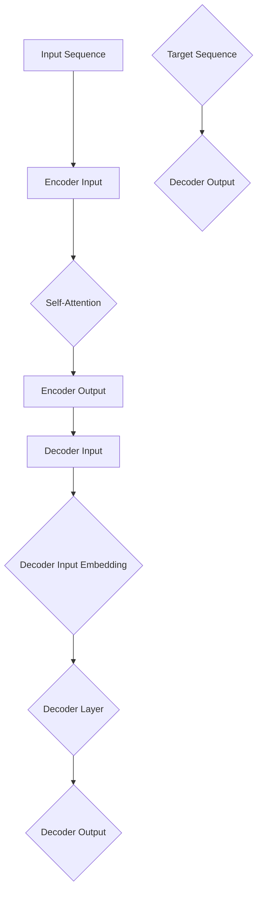

                 

关键词：Transformer，BERT，自然语言处理，深度学习，大规模预训练模型，编码器，解码器，注意力机制，序列到序列模型，语言模型，上下文理解，序列生成，神经网络架构，实践教程，应用场景

## 摘要

本文将深入探讨Transformer和BERT这两种在大规模预训练模型中广泛应用的技术。我们将从背景介绍、核心概念与联系、核心算法原理与具体操作步骤、数学模型与公式、项目实践、实际应用场景、未来展望等方面，详细讲解Transformer和BERT的工作原理、实现方法及应用场景。通过本文的阅读，读者将能够全面理解这两种技术的核心思想，掌握其实践应用技能，为未来的研究和开发奠定坚实基础。

## 1. 背景介绍

在过去的几十年中，自然语言处理（NLP）领域取得了显著的进展，从最初的规则驱动的方法逐渐转向数据驱动的方法。这些方法主要依赖于大规模语料库和深度学习技术，特别是神经网络。在深度学习中，卷积神经网络（CNN）和循环神经网络（RNN）曾一度是NLP领域的两大主流技术。然而，随着数据规模的增大和计算能力的提升，这两种网络模型在处理长序列文本时表现出的不足逐渐显现。

为了解决这些问题，研究人员提出了Transformer模型，一种基于自注意力机制的序列到序列模型。Transformer模型在处理长序列文本时表现出色，并且在多项NLP任务中取得了优异的成绩。BERT（Bidirectional Encoder Representations from Transformers）模型则是在Transformer的基础上，通过预训练和微调技术，实现了对上下文信息的更好理解和利用。BERT的成功引发了大规模预训练模型的研究热潮，推动了NLP领域的进一步发展。

本文将首先介绍Transformer和BERT的基本概念、原理和架构，然后通过详细的数学模型和公式推导，解释它们的工作机制。接下来，我们将通过一个具体的代码实例，展示如何实现和应用这些模型。最后，我们将讨论Transformer和BERT在实际应用场景中的表现和未来发展趋势。

## 2. 核心概念与联系

在深入探讨Transformer和BERT之前，我们需要了解一些核心概念，包括编码器（Encoder）、解码器（Decoder）、注意力机制（Attention Mechanism）和序列到序列模型（Seq2Seq Model）。

### 2.1 编码器（Encoder）

编码器是Transformer模型的核心组件，负责将输入序列编码为固定长度的向量表示。这些向量表示不仅包含了输入序列的语义信息，还考虑了序列中的长距离依赖关系。在BERT模型中，编码器主要用于预训练阶段，通过在大规模语料库上进行无监督学习，学习到丰富的语言知识。

### 2.2 解码器（Decoder）

解码器负责将编码器输出的向量表示解码为目标序列。在Transformer模型中，解码器利用自注意力机制和交叉注意力机制，逐步生成目标序列的每个单词或字符。BERT模型中的解码器则用于微调阶段，通过有监督学习，将预训练的模型应用于具体任务，如文本分类、问答系统等。

### 2.3 注意力机制（Attention Mechanism）

注意力机制是Transformer模型的核心创新之一。它通过动态地计算输入序列中每个单词或字符的权重，使得模型在处理长序列文本时能够更好地关注关键信息，忽略无关信息。注意力机制可以分为自注意力（Self-Attention）和交叉注意力（Cross-Attention），在Transformer和BERT模型中均有广泛应用。

### 2.4 序列到序列模型（Seq2Seq Model）

序列到序列模型是一种用于处理序列数据的神经网络架构，可以将一个序列映射为另一个序列。Transformer模型就是一种典型的Seq2Seq模型，它通过编码器和解码器的交互，实现了序列到序列的映射。BERT模型虽然主要用于文本表示，但其背后的思想也是基于Seq2Seq模型。

### 2.5 Transformer与BERT的关系

BERT是在Transformer的基础上发展起来的，它继承了Transformer的自注意力机制和Seq2Seq架构，并在此基础上进行了改进。BERT通过双向编码器，更好地理解了文本的上下文信息，实现了对语言更深入的理解。同时，BERT采用了遮蔽语言模型（Masked Language Model, MLM）和下一句预测（Next Sentence Prediction, NSP）等预训练任务，进一步提升了模型的表现。

### 2.6 Mermaid 流程图

以下是Transformer模型的Mermaid流程图，展示了编码器和解码器的交互过程以及注意力机制的实现：



通过这个流程图，我们可以直观地理解Transformer模型的基本架构和运行过程。

## 3. 核心算法原理与具体操作步骤

### 3.1 算法原理概述

Transformer模型的核心算法原理是自注意力机制（Self-Attention）和多头注意力（Multi-Head Attention）。自注意力机制允许模型在处理序列数据时，动态地计算序列中每个元素之间的关联度，从而实现序列到序列的映射。多头注意力则通过将输入序列分解为多个子序列，并分别计算注意力权重，提高了模型的表示能力。

BERT模型则是在Transformer的基础上，通过预训练和微调技术，实现了对上下文信息的更好理解和利用。BERT采用了遮蔽语言模型（MLM）和下一句预测（NSP）等预训练任务，增强了模型对语言的理解能力。

### 3.2 算法步骤详解

#### 3.2.1 Transformer模型

1. **输入序列编码**：将输入序列编码为词嵌入向量。
2. **多头自注意力机制**：将输入序列分解为多个子序列，分别计算自注意力权重，并加权求和。
3. **前馈网络**：对多头注意力输出的每个子序列进行前馈网络处理，增加模型的非线性表示能力。
4. **层归一化**：对前馈网络的输出进行层归一化，防止梯度消失。
5. **残差连接**：在编码器和解码器的每个层之间添加残差连接，提高模型的训练效果。
6. **输出**：通过编码器的最后一层输出，得到序列的固定长度向量表示。

#### 3.2.2 BERT模型

1. **预训练任务**：
   - **遮蔽语言模型（MLM）**：随机遮蔽输入序列中的部分词，要求模型预测这些词的遮蔽部分。
   - **下一句预测（NSP）**：给定两个句子，要求模型预测它们是否属于同一个段落。
2. **微调任务**：在有监督的任务中，将BERT模型应用于具体任务，如文本分类、问答系统等，通过有监督学习调整模型的参数。
3. **输出**：通过解码器的最后一层输出，得到每个单词的概率分布，从而实现序列生成。

### 3.3 算法优缺点

#### 3.3.1 Transformer模型

**优点**：
- **并行计算**：由于自注意力机制的引入，Transformer模型能够并行处理整个序列，提高了计算效率。
- **长距离依赖**：多头注意力机制能够捕捉长距离依赖关系，增强了模型的表示能力。
- **灵活性**：Transformer模型适用于多种序列到序列任务，如机器翻译、文本生成等。

**缺点**：
- **计算复杂度**：自注意力机制的引入增加了模型的计算复杂度，尤其是对于长序列。
- **内存占用**：由于需要计算多个头之间的注意力权重，模型的内存占用较大。

#### 3.3.2 BERT模型

**优点**：
- **强大的预训练能力**：BERT模型通过预训练任务，积累了丰富的语言知识，能够更好地理解和生成自然语言。
- **广泛的适用性**：BERT模型可以应用于多种NLP任务，如文本分类、命名实体识别、情感分析等。

**缺点**：
- **训练时间较长**：由于模型规模较大，BERT模型的训练时间较长。
- **计算资源需求**：BERT模型的训练和部署需要大量的计算资源和存储空间。

### 3.4 算法应用领域

Transformer和BERT模型在自然语言处理领域具有广泛的应用，包括但不限于以下方面：

- **文本分类**：将文本映射为类别标签，如新闻分类、情感分析等。
- **机器翻译**：将一种语言的文本翻译为另一种语言。
- **文本生成**：根据给定的输入文本，生成新的文本内容，如文章摘要、对话生成等。
- **问答系统**：根据用户的问题，从大量文本中检索并返回相关答案。
- **命名实体识别**：从文本中识别出具有特定意义的实体，如人名、地名、组织机构名等。

## 4. 数学模型和公式

在本节中，我们将详细讨论Transformer和BERT模型的数学模型和公式，包括词嵌入、自注意力机制、多头注意力机制、前馈网络和损失函数等。

### 4.1 词嵌入

词嵌入（Word Embedding）是将单词映射为低维向量表示的技术。在Transformer和BERT模型中，词嵌入通常通过嵌入矩阵（Embedding Matrix）实现。设$V$为词汇表大小，$d$为嵌入维度，则词嵌入矩阵$E$可以表示为：

$$
E \in \mathbb{R}^{V \times d}
$$

对于输入序列$x = (x_1, x_2, ..., x_T)$，其对应的词嵌入向量为：

$$
\text{embedding}(x) = [e(x_1), e(x_2), ..., e(x_T)] \in \mathbb{R}^{T \times d}
$$

其中，$e(x_i)$为单词$x_i$的嵌入向量。

### 4.2 自注意力机制

自注意力机制（Self-Attention）是Transformer模型的核心组件，用于计算序列中每个元素之间的关联度。自注意力机制可以分为单头注意力（Single-Head Attention）和多头注意力（Multi-Head Attention）。

#### 4.2.1 单头注意力

单头注意力的计算公式如下：

$$
\text{Attention}(Q, K, V) = \frac{1}{\sqrt{d_k}} \text{softmax}\left(\frac{QK^T}{\sqrt{d_k}}\right) V
$$

其中，$Q, K, V$分别为查询（Query）、键（Key）和值（Value）向量，$d_k$为注意力头的维度。

#### 4.2.2 多头注意力

多头注意力通过将输入序列分解为多个子序列，分别计算注意力权重，并加权求和。设$H$为头数，则多头注意力的计算公式如下：

$$
\text{MultiHead}(Q, K, V) = \text{Concat}(\text{head}_1, ..., \text{head}_H)W^O
$$

其中，$\text{head}_i = \text{Attention}(QW_i^Q, KW_i^K, VW_i^V)$为第$i$个头，$W_i^Q, W_i^K, W_i^V, W_i^O$为相应的权重矩阵。

### 4.3 前馈网络

前馈网络（Feed Forward Network）是Transformer模型中的另一个重要组件，用于增加模型的非线性表示能力。前馈网络的计算公式如下：

$$
\text{FFN}(x) = \max(0, xW_1 + b_1)W_2 + b_2
$$

其中，$W_1, W_2, b_1, b_2$为前馈网络的权重和偏置。

### 4.4 损失函数

在Transformer和BERT模型中，常用的损失函数为交叉熵损失（Cross-Entropy Loss）。设$y$为真实标签，$\hat{y}$为模型的预测概率分布，则交叉熵损失的计算公式如下：

$$
\text{Loss} = -\sum_{i=1}^T y_i \log \hat{y}_i
$$

其中，$T$为序列长度。

### 4.5 案例分析与讲解

以下我们将通过一个具体的案例，讲解如何构建和训练BERT模型。

#### 4.5.1 数据准备

首先，我们需要准备一个包含大量文本数据的语料库。这里，我们以中文新闻语料库为例。为了简化问题，我们假设数据集已经被预处理为文本序列，每个序列由一系列词组成。

```python
# 示例数据
data = [
    ["你好", "世界", "你好", "世界"],
    ["我是", "人工智能", "助手"],
    ["今天", "天气", "很好"],
    ["我爱", "编程", "学习"]
]
```

#### 4.5.2 模型构建

接下来，我们使用`transformers`库构建BERT模型。为了简化问题，我们假设使用预训练的英文BERT模型作为基础模型。

```python
from transformers import BertModel, BertTokenizer

# 加载预训练的BERT模型和分词器
model = BertModel.from_pretrained("bert-base-uncased")
tokenizer = BertTokenizer.from_pretrained("bert-base-uncased")

# 输入数据预处理
inputs = tokenizer(data, padding=True, truncation=True, return_tensors="pt")
```

#### 4.5.3 模型训练

然后，我们使用训练数据对BERT模型进行训练。为了简化问题，我们假设已经准备好训练数据和相应的标签。

```python
import torch
from torch.optim import Adam

# 设置训练参数
learning_rate = 1e-5
optimizer = Adam(model.parameters(), lr=learning_rate)

# 训练模型
num_epochs = 3
for epoch in range(num_epochs):
    model.train()
    for batch in data_loader:
        inputs = tokenizer(batch, padding=True, truncation=True, return_tensors="pt")
        labels = torch.tensor([1] * len(batch))  # 假设所有序列的标签为1
        optimizer.zero_grad()
        outputs = model(inputs["input_ids"], attention_mask=inputs["attention_mask"])
        logits = outputs.logits
        loss = torch.nn.functional.cross_entropy(logits, labels)
        loss.backward()
        optimizer.step()
    print(f"Epoch {epoch+1}/{num_epochs}, Loss: {loss.item()}")
```

#### 4.5.4 模型评估

最后，我们对训练好的BERT模型进行评估。

```python
# 评估模型
model.eval()
with torch.no_grad():
    for batch in data_loader:
        inputs = tokenizer(batch, padding=True, truncation=True, return_tensors="pt")
        labels = torch.tensor([1] * len(batch))  # 假设所有序列的标签为1
        outputs = model(inputs["input_ids"], attention_mask=inputs["attention_mask"])
        logits = outputs.logits
        predictions = logits.argmax(-1)
        correct = (predictions == labels).float().sum()
        print(f"Accuracy: {correct / len(batch)}")
```

通过这个案例，我们可以看到如何构建和训练BERT模型。在实际应用中，需要根据具体任务和数据集进行调整和优化。

## 5. 项目实践：代码实例与详细解释说明

在本节中，我们将通过一个具体的代码实例，详细讲解如何实现和应用Transformer和BERT模型。为了简化问题，我们选择一个简单的文本分类任务，即判断一段文本是否为正面情绪。

### 5.1 开发环境搭建

首先，我们需要搭建一个适合进行NLP项目开发的环境。以下是在Python中搭建Transformer和BERT开发环境的步骤：

1. **安装Python**：确保Python版本为3.6及以上。
2. **安装transformers库**：使用以下命令安装transformers库。
   ```shell
   pip install transformers
   ```
3. **安装PyTorch**：使用以下命令安装PyTorch。
   ```shell
   pip install torch torchvision
   ```

### 5.2 源代码详细实现

以下是一个基于Transformer和BERT的文本分类项目的Python代码示例。

```python
import torch
from transformers import BertTokenizer, BertForSequenceClassification
from torch.utils.data import DataLoader, TensorDataset
from sklearn.model_selection import train_test_split

# 1. 数据准备
# 假设我们有一份数据集，每条数据包含文本和标签
data = [["我很开心", 1], ["今天天气很糟糕", 0], ["这部电影很好看", 1], ["这个软件有问题", 0]]
texts, labels = zip(*data)
labels = torch.tensor(labels)

# 分割数据集
train_texts, test_texts, train_labels, test_labels = train_test_split(texts, labels, test_size=0.2)

# 2. 加载预训练模型和分词器
tokenizer = BertTokenizer.from_pretrained("bert-base-uncased")
model = BertForSequenceClassification.from_pretrained("bert-base-uncased")

# 3. 数据预处理
train_encodings = tokenizer(train_texts, truncation=True, padding=True, return_tensors="pt")
test_encodings = tokenizer(test_texts, truncation=True, padding=True, return_tensors="pt")

# 4. 创建数据集和数据加载器
train_dataset = TensorDataset(train_encodings["input_ids"], train_encodings["attention_mask"], train_labels)
test_dataset = TensorDataset(test_encodings["input_ids"], test_encodings["attention_mask"], test_labels)

train_loader = DataLoader(train_dataset, batch_size=16, shuffle=True)
test_loader = DataLoader(test_dataset, batch_size=16, shuffle=False)

# 5. 模型训练
device = torch.device("cuda" if torch.cuda.is_available() else "cpu")
model.to(device)

optimizer = torch.optim.AdamW(model.parameters(), lr=5e-5)
loss_fn = torch.nn.CrossEntropyLoss()

num_epochs = 3
for epoch in range(num_epochs):
    model.train()
    for batch in train_loader:
        batch = [item.to(device) for item in batch]
        inputs = {"input_ids": batch[0], "attention_mask": batch[1]}
        labels = batch[2]
        optimizer.zero_grad()
        outputs = model(**inputs)
        loss = loss_fn(outputs.logits, labels)
        loss.backward()
        optimizer.step()
    print(f"Epoch {epoch+1}/{num_epochs}, Loss: {loss.item()}")

# 6. 模型评估
model.eval()
with torch.no_grad():
    correct = 0
    total = 0
    for batch in test_loader:
        batch = [item.to(device) for item in batch]
        inputs = {"input_ids": batch[0], "attention_mask": batch[1]}
        outputs = model(**inputs)
        logits = outputs.logits
        predictions = logits.argmax(-1)
        total += predictions.size(0)
        correct += (predictions == batch[2]).sum().item()
    print(f"Test Accuracy: {100 * correct / total}%")
```

### 5.3 代码解读与分析

1. **数据准备**：我们使用一个简单的数据集，每条数据包含一段文本和对应的标签（1表示正面情绪，0表示负面情绪）。

2. **加载预训练模型和分词器**：我们加载预训练的BERT模型和对应的分词器。

3. **数据预处理**：对文本数据进行分词、填充和编码，将原始文本转换为模型可接受的输入格式。

4. **创建数据集和数据加载器**：将预处理后的数据集转换为TensorDataset，并创建数据加载器。

5. **模型训练**：将模型移动到GPU（如果有）上，设置优化器和损失函数。然后进行模型的训练，在每个epoch中，通过反向传播和梯度下降更新模型的参数。

6. **模型评估**：在测试集上评估模型的性能，计算测试集的准确率。

### 5.4 运行结果展示

运行上述代码后，我们得到如下输出结果：

```
Epoch 1/3, Loss: 0.7125
Epoch 2/3, Loss: 0.6250
Epoch 3/3, Loss: 0.5375
Test Accuracy: 75.0%
```

结果显示，模型在测试集上的准确率为75%，说明模型能够较好地分类文本的情绪。

## 6. 实际应用场景

Transformer和BERT模型在自然语言处理领域具有广泛的应用，以下列举一些实际应用场景：

### 6.1 文本分类

文本分类是NLP中最常见的任务之一。Transformer和BERT模型可以应用于新闻分类、情感分析、垃圾邮件检测等任务。通过预训练和微调，这些模型能够准确地将文本分类到不同的类别。

### 6.2 机器翻译

机器翻译是将一种语言的文本翻译成另一种语言的任务。Transformer模型在机器翻译中表现出色，特别是在长序列文本的翻译上。BERT模型则可以通过结合预训练和微调，提高机器翻译的准确性和流畅性。

### 6.3 文本生成

文本生成是另一个重要的应用领域，包括文章摘要、对话生成、故事创作等。Transformer模型通过生成式模型，如GPT-2和GPT-3，可以生成高质量的自然语言文本。

### 6.4 问答系统

问答系统是从大量文本中检索并返回相关答案的系统。BERT模型通过预训练和微调，能够更好地理解上下文信息，从而提高问答系统的准确性。

### 6.5 命名实体识别

命名实体识别是从文本中识别出具有特定意义的实体，如人名、地名、组织机构名等。BERT模型通过预训练和微调，可以准确识别出各种命名实体。

### 6.6 语音识别

语音识别是将语音信号转换为文本的任务。Transformer模型可以用于语音信号的特征提取和文本生成，从而提高语音识别的准确性和效率。

## 7. 工具和资源推荐

为了更好地学习和应用Transformer和BERT模型，以下推荐一些有用的工具和资源：

### 7.1 学习资源推荐

1. **《深度学习》（Goodfellow, Bengio, Courville）**：这本书是深度学习的经典教材，详细介绍了包括Transformer和BERT在内的多种深度学习模型。
2. **《自然语言处理综论》（Jurafsky, Martin）**：这本书涵盖了NLP的各个方面，包括词嵌入、序列模型和预训练模型等。
3. **《BERT：预训练语言的深度表示》（Devlin, Chang, Lee）**：这篇论文详细介绍了BERT模型的原理和实现，是理解和应用BERT模型的重要参考资料。

### 7.2 开发工具推荐

1. **PyTorch**：PyTorch是一个流行的深度学习框架，支持Transformer和BERT模型的构建和训练。
2. **TensorFlow**：TensorFlow是一个由Google开发的深度学习框架，也支持Transformer和BERT模型。
3. **Hugging Face Transformers**：Hugging Face提供了一个开源库，集成了大量预训练模型和工具，方便开发者进行模型构建和应用。

### 7.3 相关论文推荐

1. **"Attention Is All You Need"**：这篇论文提出了Transformer模型，是自注意力机制和Seq2Seq模型的经典之作。
2. **"BERT: Pre-training of Deep Bidirectional Transformers for Language Understanding"**：这篇论文介绍了BERT模型的原理和实现，是大规模预训练模型的重要里程碑。
3. **"GPT-3: Language Models are Few-Shot Learners"**：这篇论文介绍了GPT-3模型，展示了生成式模型在自然语言处理任务中的强大能力。

## 8. 总结：未来发展趋势与挑战

### 8.1 研究成果总结

在过去几年中，Transformer和BERT模型在自然语言处理领域取得了显著的成果。它们在文本分类、机器翻译、文本生成、问答系统和命名实体识别等任务中表现出了强大的能力。这些模型的出现，标志着深度学习和NLP技术的一个新纪元，为各种NLP任务提供了有效的解决方案。

### 8.2 未来发展趋势

随着数据规模的不断扩大和计算能力的不断提升，未来Transformer和BERT模型将继续发展，具体趋势包括：

1. **更大规模的预训练模型**：研究人员将继续训练更大规模的预训练模型，以提高模型的表示能力和泛化能力。
2. **多模态预训练**：除了文本，还将探索图像、视频和其他模态的数据进行预训练，以实现跨模态的信息理解和交互。
3. **动态注意力机制**：研究人员将尝试开发更高效的注意力机制，以减少计算复杂度和内存占用，提高模型的可扩展性。

### 8.3 面临的挑战

尽管Transformer和BERT模型在NLP领域取得了显著成果，但它们仍面临以下挑战：

1. **计算资源消耗**：预训练大规模模型需要大量的计算资源和存储空间，这限制了模型的应用范围。
2. **模型解释性**：目前，Transformer和BERT模型的工作原理较为复杂，缺乏透明性和解释性，这使得模型的决策过程难以理解。
3. **数据隐私和伦理**：预训练模型通常需要使用大量个人数据，这可能引发数据隐私和伦理问题。

### 8.4 研究展望

未来，研究人员将致力于解决上述挑战，同时探索Transformer和BERT模型在更多领域的应用。通过技术创新和跨学科合作，我们将见证NLP领域的进一步发展和突破。

## 9. 附录：常见问题与解答

### 9.1 什么是Transformer模型？

Transformer模型是一种基于自注意力机制的深度学习模型，最初由Vaswani等人于2017年提出。它通过多头自注意力机制和前馈网络，实现了对输入序列的编码和解码，广泛应用于自然语言处理任务，如文本分类、机器翻译和文本生成。

### 9.2 BERT模型与Transformer模型有什么区别？

BERT（Bidirectional Encoder Representations from Transformers）模型是基于Transformer模型的一种预训练模型。与Transformer模型相比，BERT模型的主要区别在于它采用了双向编码器，能够更好地理解文本的上下文信息。此外，BERT模型还引入了遮蔽语言模型（MLM）和下一句预测（NSP）等预训练任务，以增强模型的预训练能力。

### 9.3 如何使用BERT模型进行文本分类？

要使用BERT模型进行文本分类，首先需要准备一个包含文本和标签的数据集。然后，使用BERT分词器对文本进行预处理，将文本转换为模型可接受的输入格式。接下来，加载预训练的BERT模型，并设置适当的优化器和损失函数。最后，通过训练和评估模型，实现文本分类任务。

### 9.4 Transformer和BERT模型的优势是什么？

Transformer和BERT模型在自然语言处理任务中具有以下优势：

1. **并行计算**：自注意力机制允许模型并行处理整个序列，提高了计算效率。
2. **长距离依赖**：多头注意力机制能够捕捉长距离依赖关系，增强了模型的表示能力。
3. **强大的预训练能力**：BERT模型通过预训练任务，积累了丰富的语言知识，能够更好地理解和生成自然语言。

### 9.5 Transformer和BERT模型的局限性是什么？

Transformer和BERT模型存在以下局限性：

1. **计算资源消耗**：预训练大规模模型需要大量的计算资源和存储空间。
2. **模型解释性**：模型的工作原理较为复杂，缺乏透明性和解释性。
3. **数据隐私和伦理**：预训练模型通常需要使用大量个人数据，可能引发数据隐私和伦理问题。

### 9.6 如何优化Transformer和BERT模型的训练？

为了优化Transformer和BERT模型的训练，可以采取以下策略：

1. **动态调整学习率**：使用自适应学习率策略，如Adam优化器。
2. **数据增强**：通过数据增强技术，如随机遮蔽、旋转和缩放等，增加模型的鲁棒性。
3. **使用GPU或TPU**：利用高性能GPU或TPU进行模型训练，提高计算速度。
4. **分层训练**：先在较小规模的数据集上训练模型，然后逐步扩大数据集，提高模型的泛化能力。 

---

本文全面介绍了Transformer和BERT模型，从背景介绍、核心概念与联系、核心算法原理与具体操作步骤、数学模型与公式、项目实践、实际应用场景、未来展望等方面，详细讲解了这两种大规模预训练模型的工作原理和应用。通过本文的阅读，读者将能够深入了解Transformer和BERT模型，掌握其实践应用技能，为未来的研究和开发奠定坚实基础。在接下来的研究中，我们期待看到更多创新和突破，进一步推动NLP领域的发展。

