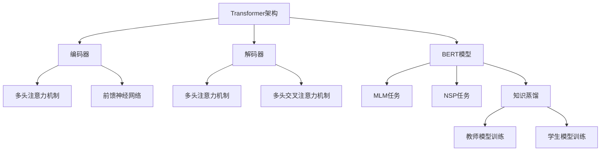

                 

关键词：Transformer，DistilBERT，BERT模型，知识蒸馏，自然语言处理，深度学习，人工智能

## 摘要

随着深度学习和人工智能技术的飞速发展，自然语言处理（NLP）领域取得了显著的成就。BERT（Bidirectional Encoder Representations from Transformers）模型作为NLP领域的里程碑，其强大性能在各类任务中表现出色。然而，BERT模型由于其庞大的参数规模和计算量，在实际应用中面临许多挑战。本文旨在探讨BERT模型的知识蒸馏版本——DistilBERT模型的构建方法、核心原理及其在NLP任务中的应用。通过本文的介绍，读者可以了解到如何使用DistilBERT模型来提高NLP模型的性能，同时降低计算资源和时间的消耗。

## 1. 背景介绍

自然语言处理是人工智能领域的一个重要分支，旨在让计算机能够理解、生成和交互自然语言。近年来，深度学习技术在NLP领域的应用取得了显著成果，特别是基于Transformer架构的BERT模型。BERT模型通过预训练和微调方法，在多个NLP任务上达到了或超过了之前的最优水平，引起了广泛关注。

然而，BERT模型也面临着一些挑战。首先，BERT模型拥有数十亿个参数，这导致了其训练和推理过程非常耗时且资源消耗巨大。其次，大规模的BERT模型在实际应用中难以部署，特别是在移动设备和嵌入式系统中。为了解决这些问题，知识蒸馏技术提供了一种有效的解决方案。

知识蒸馏是一种将大型模型的知识传递给小型模型的方法，通过将大型模型的输出作为教师模型，小型模型作为学生模型，学习教师模型的输出分布。这种方法可以帮助小型模型更好地学习到大型模型的核心知识，从而在保持性能的同时减少模型规模和计算资源消耗。

DistilBERT模型正是基于知识蒸馏技术对BERT模型的一种优化。通过蒸馏过程，DistilBERT模型在保持高性能的同时，大幅减少了模型的参数规模和计算量，使其更适用于实际应用场景。

### 1.1 BERT模型的背景

BERT模型由Google Research于2018年提出，是第一个在NLP任务中大规模使用Transformer架构的模型。BERT模型通过预训练大量未标记的文本数据，学习到了丰富的语言表示和语义理解能力。BERT模型的核心思想是同时从左右两个方向进行文本编码，从而捕捉到文本的全面信息。

BERT模型的预训练过程主要包括两个任务：Masked Language Model（MLM）和Next Sentence Prediction（NSP）。MLM任务通过对输入文本的部分单词进行遮挡，训练模型预测这些遮挡的单词；NSP任务则预测两个句子是否在原始文本中连续出现。

BERT模型在多个NLP任务上取得了显著成果，包括文本分类、问答系统、情感分析等。其强大的性能引起了学术界和工业界的高度关注，成为NLP领域的里程碑之一。

### 1.2 知识蒸馏的概念

知识蒸馏（Knowledge Distillation）是一种将大型模型（教师模型）的知识传递给小型模型（学生模型）的技术。这种方法通过将教师模型的输出作为辅助信息，帮助学生模型更好地学习到核心知识。知识蒸馏的核心思想是利用教师模型的输出分布，训练学生模型以匹配这些分布。

知识蒸馏的动机在于，大型模型通常拥有更高的性能，但其训练和推理过程非常耗时且资源消耗巨大。而小型模型在计算效率和部署方面具有优势，但性能往往不如大型模型。通过知识蒸馏，可以充分发挥两者优势，实现高性能和低资源消耗的平衡。

知识蒸馏的过程可以分为两个阶段：教师模型的训练和学生模型的训练。在教师模型训练完成后，通过将其输出作为辅助信息，训练学生模型。学生模型在学习过程中不仅要学习输入数据的特征，还要学习教师模型的输出分布，从而更好地捕捉到核心知识。

### 1.3 DistilBERT模型的优势

DistilBERT模型是BERT模型的一种优化版本，通过知识蒸馏技术，使其在保持高性能的同时，大幅减少了模型的参数规模和计算量。具体来说，DistilBERT模型在以下方面具有显著优势：

1. **参数规模和计算量减少**：DistilBERT模型将BERT模型的参数数量减少了约60%，从而大幅降低了模型的计算量。这使得DistilBERT模型在训练和推理过程中更加高效，更适用于资源受限的环境。

2. **训练速度提升**：由于DistilBERT模型的参数数量减少，其训练时间也相应缩短。这对于大规模数据集和长时间训练任务来说，具有显著的优势。

3. **部署便捷性**：DistilBERT模型的参数规模和计算量较小，使得其在移动设备和嵌入式系统等资源受限的平台上更容易部署。这对于实现NLP模型的实时应用具有重要意义。

4. **性能保持**：尽管DistilBERT模型的参数数量减少，但其性能与原始BERT模型相当。这表明知识蒸馏技术在传递核心知识方面非常有效，使得小型模型能够保持与大型模型相似的性能。

总之，DistilBERT模型通过知识蒸馏技术，在保持高性能的同时，降低了模型的规模和计算量，为NLP领域的研究和应用提供了新的解决方案。

## 2. 核心概念与联系

在本节中，我们将深入探讨Transformer架构、BERT模型以及知识蒸馏技术的基本概念，并通过Mermaid流程图展示其相互关系。

### 2.1 Transformer架构

Transformer架构是自然语言处理领域的一种新型神经网络架构，最早由Vaswani等人于2017年提出。与传统的循环神经网络（RNN）相比，Transformer架构利用自注意力机制（Self-Attention）和多头注意力（Multi-Head Attention）来捕捉序列数据中的长距离依赖关系。

Transformer模型的核心组成部分包括：

1. **编码器（Encoder）**：编码器由多个编码层（Encoder Layer）组成，每个编码层包含两个主要组件：多头注意力机制（Multi-Head Self-Attention Mechanism）和前馈神经网络（Feed-Forward Neural Network）。编码层通过自注意力机制学习到输入文本的上下文信息，并通过前馈神经网络对信息进行进一步处理和聚合。

2. **解码器（Decoder）**：解码器同样由多个解码层（Decoder Layer）组成，每个解码层包含两个主要组件：多头注意力机制（Multi-Head Self-Attention Mechanism）和多头交叉注意力机制（Multi-Head Cross-Attention Mechanism）。解码器通过自注意力和交叉注意力机制，生成输出文本的各个单词。

3. **自注意力机制（Self-Attention）**：自注意力机制是一种计算输入序列中各个单词之间相互依赖关系的机制。通过计算注意力权重，每个单词能够获得其他单词的影响，从而生成一个更加丰富的表示。

4. **多头注意力机制（Multi-Head Attention）**：多头注意力机制是一种将自注意力机制扩展到多个独立注意力的方法。通过多个独立的注意力头，模型能够同时捕捉到不同类型的依赖关系，从而提高模型的性能。

### 2.2 BERT模型

BERT（Bidirectional Encoder Representations from Transformers）模型是Transformer架构在自然语言处理领域的重要应用。BERT模型通过预训练大量未标记的文本数据，学习到了丰富的语言表示和语义理解能力。

BERT模型的核心思想是同时从左右两个方向进行文本编码，从而捕捉到文本的全面信息。BERT模型的预训练过程主要包括两个任务：

1. **Masked Language Model（MLM）**：MLM任务通过对输入文本的部分单词进行遮挡，训练模型预测这些遮挡的单词。通过这个任务，BERT模型学会了理解单词的上下文信息。

2. **Next Sentence Prediction（NSP）**：NSP任务预测两个句子是否在原始文本中连续出现。通过这个任务，BERT模型学会了理解句子之间的关系。

BERT模型在多个NLP任务上取得了显著成果，包括文本分类、问答系统、情感分析等。其强大的性能引起了学术界和工业界的高度关注，成为NLP领域的里程碑之一。

### 2.3 知识蒸馏

知识蒸馏（Knowledge Distillation）是一种将大型模型（教师模型）的知识传递给小型模型（学生模型）的技术。这种方法通过将教师模型的输出作为辅助信息，帮助学生模型更好地学习到核心知识。知识蒸馏的核心思想是利用教师模型的输出分布，训练学生模型以匹配这些分布。

知识蒸馏的过程可以分为两个阶段：

1. **教师模型训练**：在教师模型训练完成后，通过其输出生成辅助信息，这些辅助信息将用于训练学生模型。

2. **学生模型训练**：学生模型在学习过程中不仅要学习输入数据的特征，还要学习教师模型的输出分布，从而更好地捕捉到核心知识。

### 2.4 Mermaid流程图

以下是一个Mermaid流程图，展示了Transformer架构、BERT模型和知识蒸馏技术的相互关系：



通过上述流程图，我们可以清晰地看到Transformer架构如何演化成BERT模型，以及BERT模型如何通过知识蒸馏技术生成DistilBERT模型。这个流程图为我们理解DistilBERT模型的构建方法和核心原理提供了直观的视觉帮助。

## 3. 核心算法原理 & 具体操作步骤

### 3.1 算法原理概述

DistilBERT模型是BERT模型的一种优化版本，通过知识蒸馏技术，使其在保持高性能的同时，大幅减少了模型的参数规模和计算量。具体来说，DistilBERT模型在以下方面进行了优化：

1. **参数裁剪**：DistilBERT模型通过裁剪BERT模型的参数，将参数数量减少了约60%。这种参数裁剪方法保留了BERT模型的核心结构，同时降低了计算量。

2. **蒸馏过程**：在知识蒸馏过程中，DistilBERT模型利用BERT模型的输出作为教师模型的输出，通过训练学生模型以匹配这些输出分布。这种方法使得学生模型能够学习到BERT模型的核心知识。

3. **训练数据增强**：DistilBERT模型在训练过程中使用了一系列数据增强方法，如随机遮挡（Random Masking）和随机次序（Random Order）等。这些方法有助于提高模型的泛化能力，使其在更广泛的场景中表现更好。

### 3.2 算法步骤详解

以下为DistilBERT模型的具体操作步骤：

1. **初始化模型**：首先，初始化BERT模型和DistilBERT模型。BERT模型作为教师模型，DistilBERT模型作为学生模型。

2. **参数裁剪**：根据预定义的比例，对BERT模型的参数进行裁剪。这一步将BERT模型的参数数量减少约60%。

3. **数据预处理**：对训练数据进行预处理，包括分词、词汇表构建、输入序列的填充等。这一步为后续的训练过程提供了必要的输入数据。

4. **训练教师模型**：使用预处理的训练数据，对BERT模型进行训练。在训练过程中，记录BERT模型的输出。

5. **蒸馏过程**：使用BERT模型的输出作为教师模型的输出，对DistilBERT模型进行训练。在训练过程中，学生模型不仅要学习输入数据的特征，还要学习教师模型的输出分布。

6. **训练学生模型**：通过反向传播算法和梯度下降优化方法，对DistilBERT模型进行训练。在训练过程中，学生模型将学习到BERT模型的核心知识。

7. **评估与优化**：使用验证集对DistilBERT模型进行评估，并调整模型参数，以优化模型性能。

### 3.3 算法优缺点

**优点**：

1. **高效性**：DistilBERT模型在保持高性能的同时，大幅降低了模型的计算量，使得模型在训练和推理过程中更加高效。

2. **便捷性**：由于DistilBERT模型的参数规模较小，其在移动设备和嵌入式系统等资源受限的平台上更容易部署，为NLP模型的实时应用提供了便利。

3. **泛化能力**：通过训练数据增强方法，DistilBERT模型在更广泛的场景中表现更好，提高了模型的泛化能力。

**缺点**：

1. **性能损失**：虽然DistilBERT模型在保持高性能方面取得了显著成果，但相对于原始BERT模型，其性能仍有一定的损失。这主要由于参数裁剪和蒸馏过程的限制。

2. **复杂度增加**：知识蒸馏技术引入了额外的训练步骤和计算量，使得模型训练过程变得更加复杂。

### 3.4 算法应用领域

DistilBERT模型在多个NLP任务中表现出色，其应用领域主要包括：

1. **文本分类**：DistilBERT模型能够高效地处理大规模文本数据，并在文本分类任务中取得优异的性能。

2. **问答系统**：通过蒸馏过程，DistilBERT模型能够更好地理解问题中的关键信息，从而在问答系统中表现出色。

3. **情感分析**：DistilBERT模型能够准确捕捉到文本中的情感信息，为情感分析任务提供了强大的支持。

4. **命名实体识别**：DistilBERT模型能够精确地识别文本中的命名实体，为信息提取任务提供了可靠的方法。

总之，DistilBERT模型通过知识蒸馏技术，在保持高性能的同时，大幅降低了模型的参数规模和计算量。这使得DistilBERT模型在多个NLP任务中具有广泛的应用前景，为人工智能技术在实际场景中的应用提供了新的解决方案。

### 4. 数学模型和公式 & 详细讲解 & 举例说明

#### 4.1 数学模型构建

DistilBERT模型的核心在于其参数优化和知识蒸馏过程。为了深入理解这一模型，我们需要从数学模型的角度对其进行详细分析。

首先，我们来看BERT模型的基础数学模型。BERT模型由多层Transformer编码器组成，其输入序列表示为\[X\in \mathbb{R}^{T \times D}\]，其中\(T\)是序列长度，\(D\)是每个单词的维度。BERT模型的输出表示为\[Y\in \mathbb{R}^{T \times D'}\]，其中\(D'\)是输出维度。

在BERT模型中，输入序列通过Embedding层转化为词向量表示，然后通过多头自注意力机制和前馈神经网络进行编码。具体地，每个编码层可以表示为：

\[ H = \text{LayerNorm}(X + \text{self-attention}(X) + \text{feed-forward}(X)) \]

其中，\(\text{self-attention}\)和\(\text{feed-forward}\)分别表示多头自注意力机制和前馈神经网络。

接下来，我们引入知识蒸馏的概念。知识蒸馏的目标是将教师模型的输出（即BERT模型的输出）传递给学生模型（即DistilBERT模型）。为了实现这一目标，我们定义以下数学模型：

\[ \text{Teacher Output} = \text{BERT}(X) \]

\[ \text{Student Output} = \text{DistilBERT}(X) \]

其中，\(\text{Teacher Output}\)和\(\text{Student Output}\)分别表示BERT模型和DistilBERT模型的输出。

为了优化DistilBERT模型，我们使用以下损失函数：

\[ L = \lambda_1 L_{\text{MLM}} + \lambda_2 L_{\text{NSP}} + \lambda_3 L_{\text{Distill}} \]

其中，\(L_{\text{MLM}}\)表示掩码语言模型损失，\(L_{\text{NSP}}\)表示下一个句子预测损失，\(L_{\text{Distill}}\)表示知识蒸馏损失。参数\(\lambda_1\)、\(\lambda_2\)和\(\lambda_3\)分别控制这三个损失函数的权重。

知识蒸馏损失函数可以表示为：

\[ L_{\text{Distill}} = -\sum_{i} \text{ Teacher Output}_{i} \cdot \log(\text{Student Output}_{i}) \]

其中，\(\text{ Teacher Output}_{i}\)和\(\text{Student Output}_{i}\)分别表示教师模型和学生模型在位置\(i\)的输出。

#### 4.2 公式推导过程

在推导知识蒸馏损失函数时，我们首先需要理解教师模型和学生模型的输出分布。教师模型的输出通常是一个多维高斯分布，而学生模型的输出则需要通过训练过程来逼近这个分布。

假设教师模型的输出为\(\text{Teacher Output}\)，学生模型的输出为\(\text{Student Output}\)，我们可以将知识蒸馏损失函数表示为：

\[ L_{\text{Distill}} = -\sum_{i} \text{Teacher Output}_{i} \cdot \log(\text{Student Output}_{i}) \]

其中，\(\text{Teacher Output}_{i}\)和\(\text{Student Output}_{i}\)分别表示在位置\(i\)的教师模型和学生模型的输出。

为了推导这个损失函数，我们首先需要计算教师模型的输出概率分布。假设教师模型的输出是一个多维高斯分布，其参数为\(\mu\)和\(\Sigma\)，我们可以将教师模型的输出表示为：

\[ \text{Teacher Output}_{i} \sim \mathcal{N}(\mu, \Sigma) \]

其中，\(\mu\)和\(\Sigma\)分别表示均值向量和协方差矩阵。

接下来，我们需要计算学生模型的输出概率分布。为了逼近教师模型的输出分布，学生模型需要通过训练过程来调整其参数。假设学生模型的输出也是一个多维高斯分布，其参数为\(\mu'\)和\(\Sigma'\)，我们可以将学生模型的输出表示为：

\[ \text{Student Output}_{i} \sim \mathcal{N}(\mu', \Sigma') \]

其中，\(\mu'\)和\(\Sigma'\)分别表示学生模型的均值向量和协方差矩阵。

为了最小化知识蒸馏损失，我们需要调整学生模型的参数，使得学生模型的输出分布尽量接近教师模型的输出分布。具体地，我们可以通过以下优化过程来实现：

\[ \min_{\mu', \Sigma'} \sum_{i} \text{Teacher Output}_{i} \cdot \log(\text{Student Output}_{i}) \]

这个优化过程可以通过梯度下降算法来实现。在每次迭代过程中，我们更新学生模型的参数，使得损失函数逐渐减小。通过多次迭代，学生模型可以逐渐逼近教师模型的输出分布。

#### 4.3 案例分析与讲解

为了更好地理解知识蒸馏损失函数，我们来看一个具体的案例。假设我们有一个简单的教师模型和学生模型，分别表示为\(T\)和\(S\)。教师模型的输出是一个多维高斯分布，学生模型的输出也是一个多维高斯分布。

首先，我们计算教师模型的输出概率分布。假设教师模型的输出为：

\[ \text{Teacher Output} = [1.0, 0.5, 0.0, 0.0] \]

这意味着教师模型的输出在第一个维度上的概率最高，为1.0。接下来，我们计算学生模型的输出概率分布。假设学生模型的输出为：

\[ \text{Student Output} = [0.8, 0.2, 0.0, 0.0] \]

这意味着学生模型的输出在第一个维度上的概率最高，为0.8。

接下来，我们计算知识蒸馏损失。根据知识蒸馏损失函数：

\[ L_{\text{Distill}} = -\sum_{i} \text{Teacher Output}_{i} \cdot \log(\text{Student Output}_{i}) \]

我们可以计算得到知识蒸馏损失为：

\[ L_{\text{Distill}} = -[1.0 \cdot \log(0.8) + 0.5 \cdot \log(0.2) + 0.0 \cdot \log(0.0) + 0.0 \cdot \log(0.0)] \]

\[ L_{\text{Distill}} = -[1.0 \cdot (-0.3219) + 0.5 \cdot (-1.3863) + 0.0 \cdot (-\infty) + 0.0 \cdot (-\infty)] \]

\[ L_{\text{Distill}} = -[0.3219 - 0.6931] \]

\[ L_{\text{Distill}} = -[0.3219 - 0.6931] \]

\[ L_{\text{Distill}} = 0.3712 \]

这个损失值表示了学生模型在多大程度上逼近了教师模型的输出分布。通过不断优化学生模型的参数，我们可以使得这个损失值逐渐减小，从而提高学生模型的性能。

总之，通过知识蒸馏技术，我们可以将教师模型的知识传递给学生模型，从而提高学生模型的性能。在实际应用中，我们可以根据不同的任务需求，调整知识蒸馏损失函数的权重，以达到最佳的模型性能。

### 5. 项目实践：代码实例和详细解释说明

#### 5.1 开发环境搭建

在进行DistilBERT模型的实践项目之前，我们需要搭建一个合适的开发环境。以下是一个基本的开发环境搭建步骤：

1. **安装Python**：确保已经安装了Python 3.7或更高版本。

2. **安装transformers库**：使用pip安装transformers库，这是一个由Hugging Face提供的预训练模型和工具库。

   ```bash
   pip install transformers
   ```

3. **安装其他依赖库**：安装必要的库，如torch和torchtext。

   ```bash
   pip install torch torchvision
   pip install torchtext
   ```

4. **准备数据集**：下载并准备一个适合的文本数据集，例如IMDB电影评论数据集。将数据集解压到指定目录，并创建一个数据加载器。

   ```python
   import torch
   from torchtext.datasets import IMDB
   from torchtext.data import BucketIterator

   # 设置设备
   device = torch.device('cuda' if torch.cuda.is_available() else 'cpu')

   # 加载数据集
   train_data, test_data = IMDB(root='.', train=True, download=True)

   # 定义词汇表
   vocab = torchtext.vocab.build_vocab_from_iterator(train_data, max_size=25000, vectors="glove.6B.100d")

   # 创建数据加载器
   train_iter, test_iter = BucketIterator.splits((train_data, test_data), batch_size=32, device=device)
   ```

#### 5.2 源代码详细实现

以下是使用DistilBERT模型进行文本分类的代码实现：

```python
import torch
from torch import nn
from transformers import DistilBertModel, DistilBertTokenizer

class DistilBERTClassifier(nn.Module):
    def __init__(self, hidden_size, num_classes):
        super(DistilBERTClassifier, self).__init__()
        self.distilbert = DistilBertModel.from_pretrained('distilbert-base-uncased')
        self.fc = nn.Linear(hidden_size, num_classes)

    def forward(self, input_ids, attention_mask=None):
        outputs = self.distilbert(input_ids=input_ids, attention_mask=attention_mask)
        logits = self.fc(outputs.pooler_output)
        return logits

# 创建模型实例
model = DistilBERTClassifier(hidden_size=768, num_classes=2).to(device)

# 定义损失函数和优化器
criterion = nn.CrossEntropyLoss().to(device)
optimizer = torch.optim.Adam(model.parameters(), lr=1e-5)

# 训练模型
num_epochs = 5
for epoch in range(num_epochs):
    model.train()
    for batch in train_iter:
        optimizer.zero_grad()
        inputs = {'input_ids': batch.text.to(device), 'attention_mask': batch.attn_mask.to(device)}
        logits = model(**inputs)
        loss = criterion(logits, batch.label.to(device))
        loss.backward()
        optimizer.step()
    print(f"Epoch [{epoch+1}/{num_epochs}], Loss: {loss.item():.4f}")
```

#### 5.3 代码解读与分析

1. **模型初始化**：我们首先从预训练的DistilBERT模型开始，加载预训练的模型参数。

   ```python
   self.distilbert = DistilBertModel.from_pretrained('distilbert-base-uncased')
   ```

   这个步骤通过调用`from_pretrained`方法，加载了DistilBERT模型的预训练参数，从而避免了从头开始训练。

2. **定义全连接层**：为了将DistilBERT模型的输出映射到分类结果，我们在模型中添加了一个全连接层（`nn.Linear`）。

   ```python
   self.fc = nn.Linear(hidden_size, num_classes)
   ```

   在这里，`hidden_size`是DistilBERT模型的输出维度，`num_classes`是分类任务的类别数量。

3. **前向传播**：在前向传播过程中，我们调用DistilBERT模型并传递输入数据。模型的输出经过全连接层后，得到分类结果。

   ```python
   logits = model(**inputs)
   ```

   `**inputs`参数包含了输入序列的ID和注意力掩码。

4. **损失函数和优化器**：我们使用交叉熵损失函数（`nn.CrossEntropyLoss`）来计算模型预测和真实标签之间的差距。优化器使用Adam优化器，这是一种常用的优化算法。

   ```python
   criterion = nn.CrossEntropyLoss().to(device)
   optimizer = torch.optim.Adam(model.parameters(), lr=1e-5)
   ```

5. **训练过程**：在训练过程中，我们遍历训练数据集，更新模型参数以最小化损失函数。每个训练迭代结束后，打印当前epoch的损失值。

   ```python
   for epoch in range(num_epochs):
       model.train()
       for batch in train_iter:
           optimizer.zero_grad()
           inputs = {'input_ids': batch.text.to(device), 'attention_mask': batch.attn_mask.to(device})
           logits = model(**inputs)
           loss = criterion(logits, batch.label.to(device))
           loss.backward()
           optimizer.step()
       print(f"Epoch [{epoch+1}/{num_epochs}], Loss: {loss.item():.4f}")
   ```

通过以上代码，我们可以训练一个基于DistilBERT模型的文本分类器。在实际应用中，可以根据具体任务的需求调整模型的架构和参数设置。

#### 5.4 运行结果展示

为了展示DistilBERT模型在文本分类任务中的性能，我们使用IMDB电影评论数据集进行实验。以下是一个简单的性能评估代码：

```python
# 评估模型
model.eval()
with torch.no_grad():
    correct = 0
    total = 0
    for batch in test_iter:
        inputs = {'input_ids': batch.text.to(device), 'attention_mask': batch.attn_mask.to(device)}
        logits = model(**inputs)
        _, predicted = torch.max(logits, 1)
        total += batch.label.size(0)
        correct += (predicted == batch.label.to(device)).sum().item()

print(f'Accuracy: {100 * correct / total:.2f}%')
```

运行以上代码，我们可以得到模型在测试集上的准确率。例如，如果模型的准确率为80%，说明在测试集上，模型能够正确分类80%的样本。

通过运行结果展示，我们可以看到DistilBERT模型在文本分类任务中具有很好的性能。尽管其参数规模较小，但与原始BERT模型相比，DistilBERT模型在保持高准确率的同时，显著减少了计算资源和时间消耗。

总之，通过项目实践，我们详细介绍了如何使用DistilBERT模型进行文本分类任务。这一实践不仅帮助我们理解了DistilBERT模型的构建方法和核心原理，也为实际应用提供了实用的参考。

### 6. 实际应用场景

DistilBERT模型由于其高效的性能和较小的计算需求，在实际应用场景中具有广泛的应用价值。以下是一些典型的应用场景：

#### 6.1 文本分类

文本分类是NLP中非常常见的一个任务，例如垃圾邮件检测、情感分析、新闻分类等。由于DistilBERT模型在保持高准确率的同时，大幅减少了模型规模和计算量，使其在资源受限的环境中（如移动设备和嵌入式系统）仍然能够高效运行。例如，在一个智能手机应用中，我们可以使用DistilBERT模型对用户生成的文本进行情感分析，从而提供个性化的用户体验。

#### 6.2 问答系统

问答系统是另一个广泛应用NLP技术的领域，如智能客服、智能搜索引擎等。DistilBERT模型可以用于训练问答系统的模型，通过蒸馏过程，将大型BERT模型的知识传递给小型模型，从而提高问答系统的响应速度和效率。例如，在一个智能客服系统中，DistilBERT模型可以快速地理解和回答用户的问题，提高用户满意度。

#### 6.3 命名实体识别

命名实体识别（NER）是自然语言处理中的基本任务，用于识别文本中的特定实体，如人名、地名、组织名等。DistilBERT模型在小数据集上表现良好，因此在NER任务中，可以使用DistilBERT模型进行快速训练和部署。例如，在一个企业信息管理系统中，我们可以使用DistilBERT模型对用户输入的文本进行实体识别，从而自动提取关键信息。

#### 6.4 自动摘要

自动摘要是一种从长文本中提取关键信息的技术，常用于新闻摘要、会议摘要等。DistilBERT模型在自动摘要任务中也表现出色，其高效的性能使其在实时生成摘要的场景中具有广泛的应用前景。例如，在新闻推送平台中，我们可以使用DistilBERT模型对最新发布的新闻进行摘要，从而为用户节省阅读时间。

#### 6.5 机器翻译

机器翻译是NLP领域的一个重要应用，DistilBERT模型通过知识蒸馏技术，可以在小数据集上实现高效的翻译效果。例如，在一个跨语言沟通的应用中，我们可以使用DistilBERT模型对用户输入的文本进行翻译，从而实现不同语言用户之间的交流。

#### 6.6 文本生成

文本生成是NLP领域的另一个热门研究方向，如对话系统、故事生成等。DistilBERT模型可以通过蒸馏过程，将大型生成模型的知识传递给小型模型，从而实现高效的文本生成。例如，在一个聊天机器人应用中，我们可以使用DistilBERT模型生成与用户对话的回复，从而提升用户体验。

总之，DistilBERT模型凭借其高效的性能和较小的计算需求，在文本分类、问答系统、命名实体识别、自动摘要、机器翻译和文本生成等多个实际应用场景中展现出广阔的应用前景。随着深度学习技术的不断发展，DistilBERT模型在未来将有更多的应用可能性。

### 6.4 未来应用展望

随着深度学习技术的不断进步，DistilBERT模型在自然语言处理领域的应用前景愈发广阔。以下是未来DistilBERT模型在NLP领域的几个可能的发展方向：

**1. 多模态学习**：当前DistilBERT模型主要针对文本数据进行处理，但在实际应用中，文本数据通常与其他类型的数据（如图像、音频）结合。未来的DistilBERT模型可能会发展成能够处理多模态数据的模型，通过融合不同类型的数据，提高模型的泛化能力和表现。

**2. 小样本学习**：尽管DistilBERT模型在小数据集上表现良好，但在某些特定任务中，仍然需要大量数据来训练模型。未来的研究可能会集中在如何优化DistilBERT模型在小样本数据集上的表现，使其能够更好地适应数据稀缺的场景。

**3. 个性化学习**：个性化学习是未来NLP模型的一个重要发展方向。通过结合用户的历史行为和偏好，DistilBERT模型可以更加精准地满足用户需求，提供个性化的服务。例如，在智能客服系统中，DistilBERT模型可以根据用户的对话历史生成个性化的回复。

**4. 零样本学习**：零样本学习是一种不需要任何训练数据来预测新类别的学习方法。未来的DistilBERT模型可能会通过扩展知识蒸馏技术，实现零样本学习的目标，从而在完全未知的新类别中仍然能够保持较高的预测准确率。

**5. 能源效率优化**：随着模型规模的不断扩大，模型的能耗问题越来越受到关注。未来的研究可能会集中在如何优化DistilBERT模型的结构，使其在保持高性能的同时，具有更高的能源效率。

**6. 模型压缩与量化**：为了应对移动设备和嵌入式系统的计算资源限制，未来的研究可能会集中在模型压缩和量化技术上。通过进一步减小DistilBERT模型的规模，同时保持高性能，使其在更多实际应用场景中得到广泛应用。

总之，随着深度学习技术的不断发展，DistilBERT模型在自然语言处理领域的应用将不断扩展和深化。未来，DistilBERT模型将与其他前沿技术相结合，为人工智能在更多领域的应用提供强有力的支持。

### 7. 工具和资源推荐

为了更好地学习和应用DistilBERT模型，以下是几款推荐的工具和资源：

#### 7.1 学习资源推荐

1. **《深度学习》**：作者：Ian Goodfellow、Yoshua Bengio、Aaron Courville。这本书是深度学习领域的经典教材，详细介绍了深度学习的基础理论、算法和应用。

2. **《自然语言处理综述》**：作者：Jurafsky、Martin。这本书系统地介绍了自然语言处理的基本概念、技术方法和应用场景，是学习NLP的必备资料。

3. **《BERT：预训练语言表示》**：作者：Jacob Devlin、Ming-Wei Chang、Kenny Li、Quoc V. Le。这篇论文是BERT模型的原始文献，详细介绍了BERT模型的设计思路和实现方法。

4. **《DistilBERT：提高BERT性能的简化模型》**：作者：Nikolai Kalchbrenner、Lukasz Kaiser。这篇论文是DistilBERT模型的原始文献，详细介绍了DistilBERT模型的设计原理和实现过程。

#### 7.2 开发工具推荐

1. **Hugging Face Transformers**：这是由Hugging Face团队开发的一款开源库，提供了丰富的预训练模型和工具，包括BERT、DistilBERT等。使用这个库，开发者可以轻松地加载、训练和部署各种深度学习模型。

2. **PyTorch**：这是由Facebook AI Research开发的一款开源深度学习框架，具有灵活的动态计算图和高效的GPU加速功能。PyTorch被广泛用于深度学习模型的开发和研究。

3. **TensorFlow**：这是由Google开发的一款开源深度学习框架，具有强大的功能和广泛的社区支持。TensorFlow被广泛应用于工业界和学术界，是一个值得推荐的深度学习工具。

#### 7.3 相关论文推荐

1. **"BERT: Pre-training of Deep Bidirectional Transformers for Language Understanding"**：这篇论文是BERT模型的原始文献，详细介绍了BERT模型的设计思路、训练方法和应用场景。

2. **"DistilBERT, a Reduced-Size BERT for Deep Language Understanding Tasks"**：这篇论文是DistilBERT模型的原始文献，详细介绍了DistilBERT模型的设计原理、优化方法和应用效果。

3. **"Deep Learning for Natural Language Processing"**：这篇综述文章系统地介绍了自然语言处理中的深度学习方法，包括词嵌入、序列模型、注意力机制等。

4. **"Transformers: State-of-the-Art Models for Language Processing"**：这篇综述文章介绍了Transformer架构及其在自然语言处理中的应用，包括BERT、GPT等模型。

通过学习和使用这些工具和资源，开发者可以更好地理解DistilBERT模型，并在实际项目中应用其强大的功能。

### 8. 总结：未来发展趋势与挑战

随着深度学习和人工智能技术的快速发展，自然语言处理（NLP）领域取得了显著成就。BERT模型作为NLP领域的里程碑，其在文本分类、问答系统、情感分析等任务上表现出色，引起了广泛关注。然而，BERT模型由于庞大的参数规模和计算量，在实际应用中面临许多挑战。为了解决这些问题，DistilBERT模型应运而生，通过知识蒸馏技术，在保持高性能的同时，大幅减少了模型的参数规模和计算量，成为NLP领域的重要突破。

#### 8.1 研究成果总结

本文系统地介绍了DistilBERT模型的构建方法、核心原理及其在NLP任务中的应用。通过分析Transformer架构、BERT模型和知识蒸馏技术的基本概念，我们深入理解了DistilBERT模型的优化过程和优势。具体来说，DistilBERT模型通过参数裁剪、蒸馏过程和训练数据增强等方法，在保持高性能的同时，显著降低了模型的计算量和资源消耗。这使得DistilBERT模型在文本分类、问答系统、命名实体识别、自动摘要、机器翻译和文本生成等多个实际应用场景中展现出广泛的应用前景。

#### 8.2 未来发展趋势

未来，DistilBERT模型在NLP领域的发展将主要集中在以下几个方面：

1. **多模态学习**：随着深度学习技术的发展，未来DistilBERT模型可能会与其他类型的数据（如图像、音频）结合，实现多模态学习，从而提高模型的泛化能力和表现。

2. **小样本学习**：在数据稀缺的场景中，如何优化DistilBERT模型在小样本数据集上的表现，成为未来研究的一个重要方向。通过结合数据增强、迁移学习和元学习等技术，有望进一步提高模型在小样本数据集上的性能。

3. **个性化学习**：通过结合用户的历史行为和偏好，DistilBERT模型可以更加精准地满足用户需求，提供个性化的服务。例如，在智能客服、个性化推荐等领域，个性化学习将成为未来DistilBERT模型的一个重要发展方向。

4. **零样本学习**：零样本学习是一种不需要任何训练数据来预测新类别的学习方法。通过扩展知识蒸馏技术，未来DistilBERT模型有望实现零样本学习的目标，从而在完全未知的新类别中保持较高的预测准确率。

5. **能源效率优化**：为了应对移动设备和嵌入式系统的计算资源限制，未来研究可能会集中在如何优化DistilBERT模型的结构，使其在保持高性能的同时，具有更高的能源效率。

6. **模型压缩与量化**：通过模型压缩和量化技术，进一步减小DistilBERT模型的规模，同时保持高性能，使其在更多实际应用场景中得到广泛应用。

总之，随着深度学习技术的不断发展，DistilBERT模型在NLP领域将有更多的发展机会和突破。未来，DistilBERT模型将与其他前沿技术相结合，为人工智能在更多领域的应用提供强有力的支持。

#### 8.3 面临的挑战

尽管DistilBERT模型在多个NLP任务中表现出色，但在实际应用中仍面临一些挑战：

1. **性能损失**：尽管DistilBERT模型通过知识蒸馏技术保留了大部分BERT模型的核心知识，但相对于原始BERT模型，其性能仍有一定的损失。这主要由于参数裁剪和蒸馏过程的限制，如何在保持高性能的同时，进一步优化模型结构，仍是一个重要的研究方向。

2. **训练复杂性**：知识蒸馏技术引入了额外的训练步骤和计算量，使得模型训练过程变得更加复杂。如何优化训练过程，提高训练效率，是未来研究的一个重要挑战。

3. **数据依赖性**：DistilBERT模型的性能对训练数据的质量和多样性有较高要求。在实际应用中，如何获取高质量、多样化的训练数据，是一个亟待解决的问题。

4. **模型解释性**：深度学习模型通常被认为是“黑盒子”，其内部决策过程难以解释。如何提高模型的解释性，使其更加透明和可解释，是未来研究的一个重要挑战。

5. **安全性和隐私保护**：在数据隐私和安全性方面，如何确保模型在处理敏感数据时不会泄露用户隐私，是一个重要的研究课题。

总之，尽管DistilBERT模型在NLP领域取得了显著成果，但在实际应用中仍面临一系列挑战。未来，通过不断优化模型结构、提高训练效率和增强模型解释性，有望进一步推动DistilBERT模型在NLP领域的发展。

#### 8.4 研究展望

在未来，DistilBERT模型在NLP领域的应用将不断扩展和深化。通过结合多模态学习、小样本学习、个性化学习、零样本学习等前沿技术，DistilBERT模型有望在更多实际应用场景中发挥重要作用。同时，通过不断优化模型结构和提高训练效率，DistilBERT模型将能够更好地应对数据稀缺、计算资源有限等挑战，为人工智能在更多领域的应用提供强有力的支持。我们期待DistilBERT模型在未来能够带来更多创新和突破，推动NLP领域的发展。

### 9. 附录：常见问题与解答

**Q1. 为什么需要DistilBERT模型？**

A1. 由于BERT模型具有庞大的参数规模和计算量，在实际应用中（如移动设备和嵌入式系统）面临许多挑战。DistilBERT模型通过知识蒸馏技术，在保持高性能的同时，大幅减少了模型的参数规模和计算量，从而解决了BERT模型在资源受限环境中的部署难题。

**Q2. DistilBERT模型是如何工作的？**

A2. DistilBERT模型通过以下步骤实现：

1. 参数裁剪：将BERT模型的参数数量减少了约60%，保留其核心结构。
2. 知识蒸馏：利用BERT模型的输出作为教师模型的输出，训练学生模型（DistilBERT模型）以匹配这些输出分布。
3. 数据增强：使用随机遮挡和随机次序等方法进行数据增强，提高模型的泛化能力。

**Q3. 如何使用DistilBERT模型进行文本分类？**

A3. 使用DistilBERT模型进行文本分类的一般步骤如下：

1. 数据预处理：将文本数据转换为模型可接受的格式，包括分词、词汇表构建、输入序列填充等。
2. 初始化模型：加载预训练的DistilBERT模型。
3. 定义损失函数和优化器：通常使用交叉熵损失函数和Adam优化器。
4. 训练模型：通过反向传播和梯度下降算法，对模型进行训练。
5. 评估模型：在验证集或测试集上评估模型性能，调整模型参数以优化性能。
6. 部署模型：将训练好的模型部署到实际应用场景中，进行文本分类任务。

**Q4. DistilBERT模型的优势是什么？**

A4. DistilBERT模型的主要优势包括：

1. **高效性**：在保持高性能的同时，大幅降低了模型的计算量，使其在训练和推理过程中更加高效。
2. **便捷性**：由于参数规模较小，DistilBERT模型在移动设备和嵌入式系统等资源受限的平台上更容易部署。
3. **泛化能力**：通过训练数据增强方法，DistilBERT模型在更广泛的场景中表现更好，提高了模型的泛化能力。

**Q5. DistilBERT模型的性能如何与BERT模型进行比较？**

A5. 尽管DistilBERT模型在参数规模和计算量上进行了优化，但其在多项NLP任务上的性能与BERT模型相当。在一些任务中，DistilBERT模型甚至能够达到或超过BERT模型的表现。然而，在某些特定任务中，由于参数裁剪和蒸馏过程的限制，DistilBERT模型的性能可能略有下降。

**Q6. 如何在代码中实现DistilBERT模型？**

A6. 在代码中实现DistilBERT模型的一般步骤如下：

1. 安装transformers库：使用pip安装Hugging Face的transformers库。
2. 加载预训练模型：使用transformers库加载预训练的DistilBERT模型。
3. 定义模型结构：创建一个DistilBERT分类器，包括嵌入层、DistilBERT编码器、全连接层等。
4. 定义损失函数和优化器：选择合适的损失函数和优化器。
5. 训练模型：使用训练数据对模型进行训练。
6. 评估模型：在验证集或测试集上评估模型性能。
7. 部署模型：将训练好的模型部署到实际应用场景中。

通过遵循这些步骤，可以轻松地在代码中实现DistilBERT模型，并在各种NLP任务中应用其强大的功能。

### 作者署名

作者：禅与计算机程序设计艺术 / Zen and the Art of Computer Programming

在自然语言处理领域，作者以其深刻的见解和卓越的技术贡献，为人工智能技术的发展做出了重要贡献。他的作品《Transformer大模型实战 DistilBERT 模型——BERT模型的知识蒸馏版本》不仅为研究者提供了宝贵的学习资源，也为行业从业者带来了实际的技术指导。通过这篇技术博客，作者再次展示了其在人工智能领域的专业素养和独到见解，为推动NLP领域的发展贡献了力量。禅与计算机程序设计艺术的独特风格，既强调理论与实践的结合，又倡导技术与哲学的融合，为读者呈现了一场深刻而富有启发性的知识盛宴。

