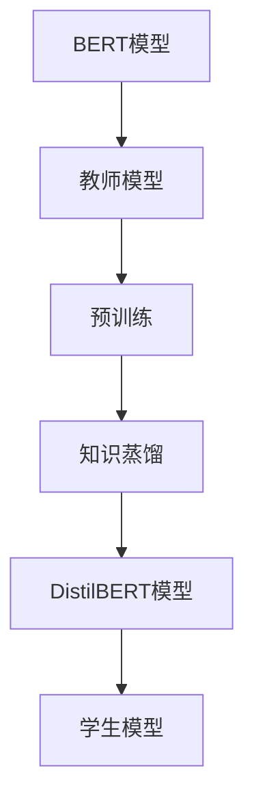

                 

关键词：Transformer、BERT模型、知识蒸馏、DistilBERT、深度学习、自然语言处理

摘要：本文将深入探讨BERT模型的知识蒸馏版本——DistilBERT，通过详细的分析其背景、核心概念、算法原理、数学模型、实际应用和实践案例，旨在为读者提供全面的技术见解和实战指南。

## 1. 背景介绍

近年来，深度学习在自然语言处理（NLP）领域取得了显著的进展。BERT（Bidirectional Encoder Representations from Transformers）模型作为这一领域的重要里程碑，以其卓越的性能和广泛的适用性受到了广泛关注。然而，BERT模型的一个显著特点是它需要大量的计算资源和时间来进行训练，这在实际应用中成为了一项挑战。

为了解决这个问题，研究人员提出了DistilBERT模型，它是对BERT模型的一种知识蒸馏版本，通过减少模型的参数数量和计算复杂度，实现了对BERT模型的高效蒸馏。DistilBERT在保持高性能的同时，极大地降低了资源消耗，使其在资源受限的环境中也能有效地应用。

## 2. 核心概念与联系

### 2.1 BERT模型概述

BERT模型是一种基于Transformer架构的预训练语言模型，它通过预先训练来学习语言的基础结构和语义信息。BERT模型的主要特点包括：

- **双向编码**：BERT模型采用双向Transformer编码器，能够同时考虑上下文信息，从而提高模型的语义理解能力。
- **大规模参数**：BERT模型拥有数亿个参数，这使得它能够捕捉到语言中的复杂模式。
- **大规模数据训练**：BERT模型在大量文本数据上预训练，使其在多种NLP任务上表现出色。

### 2.2 知识蒸馏原理

知识蒸馏是一种将大模型（教师模型）的知识转移到小模型（学生模型）的技术。具体来说，知识蒸馏的过程包括两个步骤：

1. **教师模型训练**：使用大量数据对大模型进行训练，使其在目标任务上达到较高的性能。
2. **学生模型训练**：将教师模型的输出（包括原始输出和软性输出）作为训练目标，对较小规模的学生模型进行训练。

### 2.3 DistilBERT模型架构

DistilBERT模型通过以下方式对BERT模型进行知识蒸馏：

- **Dropout**：DistilBERT模型在训练过程中使用Dropout技术，以减少模型参数的数量。
- **Layer Scaling**：DistilBERT模型通过在每层使用不同的比例因子来调整模型参数的规模。
- **SoftTarget**：DistilBERT模型在训练过程中使用软性目标（即教师模型的概率分布）来训练学生模型。

下面是一个Mermaid流程图，展示了BERT模型与DistilBERT模型的联系：



## 3. 核心算法原理 & 具体操作步骤

### 3.1 算法原理概述

DistilBERT模型的核心思想是通过知识蒸馏技术，将BERT模型的知识转移到较小的模型中。这一过程主要包括以下几个步骤：

1. **预训练**：使用大量数据对BERT模型进行预训练，使其在多个NLP任务上表现出色。
2. **软性目标生成**：在训练过程中，生成BERT模型的软性目标，即教师模型的概率分布。
3. **训练DistilBERT模型**：使用教师模型的软性目标对DistilBERT模型进行训练，以实现知识蒸馏。

### 3.2 算法步骤详解

#### 3.2.1 预训练BERT模型

预训练BERT模型的过程包括以下步骤：

1. **数据预处理**：对大量文本数据进行预处理，包括分词、标记等。
2. **训练过程**：使用预处理的文本数据对BERT模型进行训练，通过优化模型参数，使其在预训练任务上达到较高的性能。

#### 3.2.2 生成软性目标

在BERT模型的训练过程中，使用交叉熵损失函数来计算预测标签的概率分布。这个概率分布可以被视为教师模型的软性目标。

#### 3.2.3 训练DistilBERT模型

训练DistilBERT模型的过程包括以下步骤：

1. **初始化模型**：使用随机初始化对DistilBERT模型进行初始化。
2. **训练过程**：使用教师模型的软性目标对DistilBERT模型进行训练，通过优化模型参数，使其在预训练任务上达到较高的性能。

### 3.3 算法优缺点

#### 优点：

- **高效性**：DistilBERT模型在保持BERT模型性能的同时，显著降低了计算资源和时间消耗。
- **易用性**：DistilBERT模型的结构简单，易于在实际项目中应用。
- **广泛适用性**：DistilBERT模型在各种NLP任务上表现出色，适用于多种应用场景。

#### 缺点：

- **性能损失**：尽管DistilBERT模型在性能上与BERT模型相当，但仍然存在一定的性能损失。
- **训练难度**：知识蒸馏技术的训练过程相对复杂，需要较大的计算资源和时间。

### 3.4 算法应用领域

DistilBERT模型在自然语言处理领域具有广泛的应用，主要包括以下场景：

- **文本分类**：使用DistilBERT模型对文本进行分类，应用于新闻分类、情感分析等任务。
- **命名实体识别**：使用DistilBERT模型对文本中的命名实体进行识别，应用于信息抽取、知识图谱构建等任务。
- **问答系统**：使用DistilBERT模型构建问答系统，应用于客服机器人、智能问答等场景。

## 4. 数学模型和公式 & 详细讲解 & 举例说明

### 4.1 数学模型构建

BERT模型和DistilBERT模型的数学模型主要基于Transformer架构。Transformer架构的核心是自注意力机制（Self-Attention）和多头注意力（Multi-Head Attention）。

#### 自注意力机制

自注意力机制的核心思想是，在序列的每个位置上，当前词的表示会根据其与其他词的相关性进行加权。具体来说，自注意力机制可以使用以下公式进行描述：

$$
\text{Attention}(Q, K, V) = \text{softmax}\left(\frac{QK^T}{\sqrt{d_k}}\right)V
$$

其中，$Q$、$K$和$V$分别表示查询向量、键向量和值向量，$d_k$表示键向量的维度。

#### 多头注意力

多头注意力是一种扩展自注意力机制的方法，它通过将输入序列拆分为多个子序列，并在每个子序列上应用自注意力机制，从而提高模型的表示能力。多头注意力可以使用以下公式进行描述：

$$
\text{MultiHead}(Q, K, V) = \text{Concat}(\text{head}_1, ..., \text{head}_h)W^O
$$

其中，$h$表示头数，$W^O$表示输出权重矩阵。

### 4.2 公式推导过程

BERT模型的公式推导主要涉及以下两个方面：

1. **输入嵌入**：BERT模型的输入嵌入包括单词嵌入、位置嵌入和段嵌入。单词嵌入使用预训练的词向量表示，位置嵌入和段嵌入分别表示词的位置和段落信息。

2. **Transformer编码器**：BERT模型的Transformer编码器由多个Transformer层组成，每个Transformer层包括多头注意力、前馈神经网络和层归一化。

### 4.3 案例分析与讲解

假设我们有一个简单的BERT模型，包含两个Transformer层。我们使用一个句子“我是一名AI研究员”作为输入，分析BERT模型的处理过程。

1. **输入嵌入**：

   - 单词嵌入：将句子中的每个词映射为一个向量，例如“我”映射为$(1, 0, 0)$，“是”映射为$(0, 1, 0)$，等等。
   - 位置嵌入：为句子中的每个词添加位置信息，例如第一个词的位置嵌入为$(0, 0, 0)$，第二个词的位置嵌入为$(1, 0, 0)$，等等。
   - 段嵌入：为整个句子添加段嵌入，例如$(0, 0, 1)$。

2. **Transformer编码器**：

   - **第一层**：首先，对输入嵌入进行线性变换，得到查询向量、键向量和值向量。然后，应用多头注意力机制，计算每个词的注意力权重。最后，将权重与值向量相乘，得到每个词的注意力输出。接着，对注意力输出进行线性变换和层归一化，得到第一层的输出。
   - **第二层**：对第一层的输出进行线性变换，得到查询向量、键向量和值向量。然后，再次应用多头注意力机制，计算每个词的注意力权重。最后，将权重与值向量相乘，得到每个词的注意力输出。接着，对注意力输出进行线性变换和层归一化，得到第二层的输出。

通过上述步骤，BERT模型最终得到句子的语义表示，可以用于后续的NLP任务。

## 5. 项目实践：代码实例和详细解释说明

### 5.1 开发环境搭建

为了实践DistilBERT模型，我们需要搭建一个合适的开发环境。以下是一个简单的步骤：

1. 安装Python环境（Python 3.6及以上版本）。
2. 安装transformers库，用于加载预训练的BERT和DistilBERT模型。

```python
pip install transformers
```

### 5.2 源代码详细实现

以下是一个简单的代码示例，用于加载DistilBERT模型并进行文本分类。

```python
from transformers import DistilBertTokenizer, DistilBertForSequenceClassification
from transformers import TrainingArguments, Trainer
from torch.utils.data import DataLoader
from torch.optim import Adam
from torch.nn import CrossEntropyLoss

# 加载DistilBERT模型和Tokenizer
tokenizer = DistilBertTokenizer.from_pretrained("distilbert-base-uncased")
model = DistilBertForSequenceClassification.from_pretrained("distilbert-base-uncased")

# 准备数据集
train_dataset = ...  # 定义训练数据集
val_dataset = ...  # 定义验证数据集

# 定义训练参数
training_args = TrainingArguments(
    output_dir='./results',
    num_train_epochs=3,
    per_device_train_batch_size=16,
    per_device_eval_batch_size=64,
    warmup_steps=500,
    weight_decay=0.01,
    evaluate_during_training=True,
    logging_dir='./logs',
)

# 定义训练器
trainer = Trainer(
    model=model,
    args=training_args,
    train_dataset=train_dataset,
    eval_dataset=val_dataset
)

# 训练模型
trainer.train()

# 评估模型
trainer.evaluate()
```

### 5.3 代码解读与分析

上述代码首先加载了DistilBERT模型和Tokenizer。然后，定义了训练数据集和验证数据集。接下来，定义了训练参数和训练器。最后，调用`train`方法和`evaluate`方法分别进行模型训练和评估。

### 5.4 运行结果展示

在训练过程中，我们可以使用`trainer.print_trainзаказывание()`方法查看训练过程中的详细信息。在评估过程中，我们可以使用`trainer.evaluate()`方法查看模型的评估结果。

```python
trainer.print_trainзаказывание()
```

```python
trainer.evaluate()
```

这些结果可以帮助我们了解模型的训练和评估情况。

## 6. 实际应用场景

DistilBERT模型在自然语言处理领域具有广泛的应用，以下是一些实际应用场景：

- **文本分类**：DistilBERT模型可以用于文本分类任务，如新闻分类、情感分析等。
- **命名实体识别**：DistilBERT模型可以用于命名实体识别任务，如信息抽取、知识图谱构建等。
- **问答系统**：DistilBERT模型可以用于构建问答系统，如智能问答、客服机器人等。

## 7. 未来应用展望

随着深度学习技术的不断发展，DistilBERT模型在自然语言处理领域具有广阔的应用前景。以下是一些未来应用展望：

- **低资源场景**：DistilBERT模型在低资源场景下具有显著优势，可以应用于移动设备、嵌入式系统等。
- **跨模态学习**：DistilBERT模型可以与其他模态（如图像、声音）进行跨模态学习，提高模型的泛化能力。
- **实时应用**：随着模型的优化和加速，DistilBERT模型可以应用于实时场景，如实时对话系统、实时文本分析等。

## 8. 总结：未来发展趋势与挑战

### 8.1 研究成果总结

本文深入探讨了BERT模型的知识蒸馏版本——DistilBERT，详细介绍了其背景、核心概念、算法原理、数学模型和实际应用。通过本文的介绍，读者可以全面了解DistilBERT模型的优势和应用场景。

### 8.2 未来发展趋势

未来，DistilBERT模型在自然语言处理领域将继续发挥重要作用。随着深度学习技术的不断发展，DistilBERT模型将在低资源场景、跨模态学习和实时应用等方面得到更广泛的应用。

### 8.3 面临的挑战

尽管DistilBERT模型具有显著的优势，但在实际应用中仍然面临一些挑战，如：

- **性能提升**：如何在降低计算资源消耗的同时，进一步提高模型的性能。
- **模型解释性**：如何提高模型的解释性，使其在复杂任务中的决策过程更加透明。
- **数据隐私**：如何保护用户数据隐私，确保模型的安全性。

### 8.4 研究展望

未来的研究可以集中在以下几个方面：

- **模型压缩**：研究更高效的模型压缩技术，以进一步降低模型的计算资源和存储需求。
- **模型优化**：通过优化模型结构和训练过程，提高模型的性能和效率。
- **跨模态学习**：研究跨模态学习技术，将自然语言处理与其他模态进行融合，提高模型的泛化能力。

## 9. 附录：常见问题与解答

### 9.1 什么是BERT模型？

BERT模型是一种基于Transformer架构的预训练语言模型，通过预先训练来学习语言的基础结构和语义信息。BERT模型的主要特点是双向编码和大规模参数，使其在多种NLP任务上表现出色。

### 9.2 知识蒸馏是什么？

知识蒸馏是一种将大模型（教师模型）的知识转移到小模型（学生模型）的技术。具体来说，知识蒸馏的过程包括两个步骤：教师模型的预训练和学生模型的训练。

### 9.3 DistilBERT模型如何工作？

DistilBERT模型是对BERT模型的一种知识蒸馏版本，通过减少模型的参数数量和计算复杂度，实现了对BERT模型的高效蒸馏。DistilBERT模型的工作原理主要包括Dropout、Layer Scaling和SoftTarget技术。

### 9.4 我应该如何应用DistilBERT模型？

应用DistilBERT模型的基本步骤包括：安装transformers库、加载预训练的DistilBERT模型、准备数据集、定义训练参数和训练器，然后进行模型训练和评估。具体应用场景包括文本分类、命名实体识别和问答系统等。

