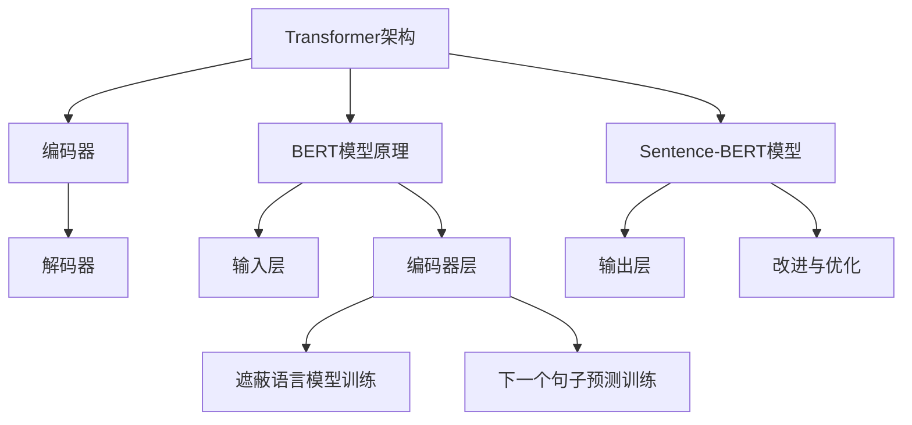

                 

## 1. 背景介绍

Transformer架构的崛起，彻底改变了深度学习在自然语言处理（NLP）领域的面貌。相较于传统的循环神经网络（RNN）和卷积神经网络（CNN），Transformer模型通过注意力机制实现了更高的并行处理能力和更强大的上下文理解能力。这使得Transformer成为了现代NLP任务的首选模型，从机器翻译到文本分类，从问答系统到文本生成，Transformer无处不在。

在Transformer的广泛应用中，BERT（Bidirectional Encoder Representations from Transformers）模型成为了自然语言处理领域的一个里程碑。BERT通过预训练和微调技术，实现了对上下文的深入理解，从而在多个NLP任务中取得了优异的性能。BERT的成功促使了众多研究者探索如何针对特定领域进行优化，以提升模型的性能和应用范围。

本文将深入探讨Transformer大模型实战，特别是Sentence-BERT模型和特定领域的BERT模型。我们将首先介绍Transformer的基本原理和架构，然后详细解析BERT模型的预训练和微调过程，接着探讨Sentence-BERT模型的改进和优化，最后讨论如何为特定领域定制BERT模型，并展望未来的发展趋势与挑战。

通过本文的阅读，读者将能够全面理解Transformer大模型的实战应用，掌握Sentence-BERT模型和特定领域BERT模型的构建方法，并为未来的研究工作提供参考。

## 2. 核心概念与联系

为了深入理解Transformer大模型实战中的关键概念和联系，我们需要首先介绍几个核心概念：Transformer架构、BERT模型的原理和结构，以及Sentence-BERT模型的改进和优化。

### 2.1 Transformer架构

Transformer模型是由Google在2017年提出的一种基于自注意力机制的序列模型。与传统的循环神经网络（RNN）和卷积神经网络（CNN）不同，Transformer模型通过全局自注意力机制实现了对序列中每个位置的上下文信息的全面关注，从而提高了模型对上下文的理解能力。

Transformer模型的基本架构包括编码器（Encoder）和解码器（Decoder）。编码器负责将输入序列编码成固定长度的向量，解码器则利用这些编码后的向量生成输出序列。核心部分是自注意力机制（Self-Attention），它通过计算序列中每个位置与其他所有位置之间的关联强度，生成加权向量，从而实现对上下文信息的全局关注。

### 2.2 BERT模型的原理和结构

BERT（Bidirectional Encoder Representations from Transformers）模型是基于Transformer架构进行预训练的一种通用语言表示模型。BERT的预训练目标是通过预测词语的遮蔽（Masked Language Model，MLM）和下一个词语（Next Sentence Prediction，NSP）来建模语言上下文。

BERT模型的基本结构包括两个子模块：输入层和编码器层。输入层使用两个特殊的Token `[CLS]` 和 `[SEP]` 分别表示句子的开头和结尾。编码器层则由多个相同的Transformer层堆叠而成，每个层都包含多头自注意力机制和前馈神经网络。

BERT的预训练过程分为两个阶段：第一阶段是遮蔽语言模型（MLM）训练，即在输入序列中随机遮蔽一部分词语，然后通过模型预测这些遮蔽的词语；第二阶段是下一个句子预测（NSP）训练，即输入两个连续的句子，模型需要预测第二个句子是否是第一个句子的下文。

### 2.3 Sentence-BERT模型的改进和优化

Sentence-BERT（SBERT）模型是BERT模型的一种改进版本，主要用于生成固定长度的句子表示。与BERT模型不同，Sentence-BERT的输出不再是一个序列，而是一个固定长度的向量，这使得它在许多下游任务中具有更高的适用性。

Sentence-BERT模型的主要改进点在于其输出层的设计。在BERT模型中，输出层通常是一个全连接层，用于生成每个词语的概率分布。而在Sentence-BERT模型中，输出层是一个线性层，直接将编码器的输出映射到一个固定长度的向量。

### 2.4 核心概念原理和架构的Mermaid流程图

以下是一个Mermaid流程图，展示了Transformer、BERT和Sentence-BERT模型的核心概念和架构联系。



通过上述核心概念和架构的介绍，我们可以看到Transformer、BERT和Sentence-BERT模型在自然语言处理领域的重要作用及其相互联系。在接下来的章节中，我们将进一步深入探讨这些模型的具体实现和应用。

## 3. 核心算法原理 & 具体操作步骤

### 3.1 算法原理概述

Transformer模型的核心在于其自注意力机制（Self-Attention），这种机制能够动态地计算序列中每个位置与其他所有位置的关联强度，从而实现上下文的全面关注。自注意力机制通过一系列线性变换和缩放操作，将输入序列编码成一组加权向量，这些向量代表了输入序列的不同方面。

BERT模型则是在Transformer架构的基础上进行预训练的。BERT的预训练目标是通过遮蔽语言模型（MLM）和下一个句子预测（NSP）来学习语言的上下文信息。遮蔽语言模型通过遮蔽输入序列中的部分词语，训练模型预测这些词语；下一个句子预测则通过输入两个连续的句子，训练模型判断第二个句子是否是第一个句子的下文。

Sentence-BERT模型是在BERT模型的基础上进行改进的，其主要目标是为每个句子生成一个固定长度的向量表示。Sentence-BERT通过去除BERT模型中的分类层，并将编码器的输出直接映射到固定长度的向量，从而实现句子级别的表示。

### 3.2 算法步骤详解

#### 3.2.1 Transformer模型

1. **输入序列编码**：首先将输入序列中的每个词语编码成向量，然后添加起始Token `[CLS]` 和 `[SEP]`。
2. **自注意力机制**：对于每个词向量，通过多头自注意力机制计算其与其他词向量的关联强度，生成一组加权向量。
3. **前馈神经网络**：将加权向量通过一个前馈神经网络进行非线性变换。
4. **堆叠多层**：重复上述步骤，通过多个Transformer层堆叠，逐渐提取序列的深层特征。
5. **输出层**：将编码器的输出通过一个线性层映射到一个固定长度的向量，作为输入序列的表示。

#### 3.2.2 BERT模型

1. **输入层**：将输入序列编码成词向量，并添加特殊Token `[CLS]` 和 `[SEP]`。
2. **编码器层**：通过多个Transformer层堆叠，对输入序列进行编码。
3. **遮蔽语言模型训练**：
   - 随机遮蔽输入序列中的部分词语；
   - 通过模型预测这些遮蔽的词语；
   - 计算预测误差并更新模型参数。
4. **下一个句子预测训练**：
   - 输入两个连续的句子；
   - 模型预测第二个句子是否是第一个句子的下文；
   - 计算预测误差并更新模型参数。

#### 3.2.3 Sentence-BERT模型

1. **输入层**：与BERT相同，将输入序列编码成词向量，并添加特殊Token `[CLS]` 和 `[SEP]`。
2. **编码器层**：通过多个Transformer层堆叠，对输入序列进行编码。
3. **输出层**：去除BERT模型中的分类层，直接将编码器的输出映射到一个固定长度的向量。

### 3.3 算法优缺点

#### Transformer模型

**优点**：
- 并行处理能力强，计算效率高；
- 能够捕捉长距离依赖关系；
- 结构简洁，易于实现和优化。

**缺点**：
- 需要大量的计算资源和时间；
- 在某些任务中，如文本分类，性能可能不如传统循环神经网络。

#### BERT模型

**优点**：
- 强大的上下文理解能力，适用于多种NLP任务；
- 预训练和微调技术，使模型具有很好的泛化能力。

**缺点**：
- 模型参数量大，训练和推理速度较慢；
- 对数据依赖性强，需要大量标注数据。

#### Sentence-BERT模型

**优点**：
- 为句子生成固定长度的向量表示，适用于下游任务；
- 参数量相对较小，训练和推理速度较快。

**缺点**：
- 输出向量可能无法完全捕捉句子的所有语义信息；
- 对特定任务可能需要进一步优化。

### 3.4 算法应用领域

Transformer模型、BERT模型和Sentence-BERT模型在自然语言处理领域有广泛的应用：

- **Transformer模型**：广泛应用于机器翻译、文本生成、问答系统等；
- **BERT模型**：用于文本分类、命名实体识别、情感分析等；
- **Sentence-BERT模型**：用于情感分析、文本相似度计算、对话系统等。

通过以上对核心算法原理和具体操作步骤的详细解析，我们可以更好地理解这些模型的工作机制和应用场景。在接下来的章节中，我们将进一步探讨数学模型和公式，并通过实例说明这些算法的具体应用。

## 4. 数学模型和公式 & 详细讲解 & 举例说明

### 4.1 数学模型构建

为了深入理解Transformer、BERT和Sentence-BERT模型的数学基础，我们需要介绍几个关键的数学模型和公式。这些公式包括自注意力机制的计算、BERT模型的损失函数，以及Sentence-BERT模型的输出向量生成。

#### 4.1.1 自注意力机制

自注意力机制（Self-Attention）是Transformer模型的核心组成部分。它通过计算输入序列中每个词与其他词之间的关联强度，生成一组加权向量。自注意力机制的数学公式如下：

$$
\text{Attention}(Q, K, V) = \text{softmax}\left(\frac{QK^T}{\sqrt{d_k}}\right) V
$$

其中：
- \( Q \) 是查询向量（Query），表示每个词的上下文信息；
- \( K \) 是键向量（Key），表示每个词的关键信息；
- \( V \) 是值向量（Value），表示每个词的值；
- \( d_k \) 是键向量和查询向量的维度；
- \( \text{softmax} \) 函数用于归一化权重。

#### 4.1.2 BERT模型的损失函数

BERT模型的损失函数包括两部分：遮蔽语言模型损失（Masked Language Model Loss）和下一个句子预测损失（Next Sentence Prediction Loss）。以下是这两个损失函数的数学公式：

1. **遮蔽语言模型损失**：

$$
L_{MLM} = -\sum_{i} \text{mask}_{i} \log(p_{\text{predicted}}(t_i))
$$

其中：
- \( \text{mask}_{i} \) 是遮蔽标记，当 \( i \) 是遮蔽词时为1，否则为0；
- \( p_{\text{predicted}}(t_i) \) 是模型预测的遮蔽词的概率。

2. **下一个句子预测损失**：

$$
L_{NSP} = -\sum_{j} \text{mask}_{j} \log(p_{\text{predicted}}(t_{j+1} | t_j))
$$

其中：
- \( \text{mask}_{j} \) 是下一个句子预测标记，当 \( j \) 是第一个句子时为1，否则为0；
- \( p_{\text{predicted}}(t_{j+1} | t_j) \) 是模型预测第二个句子是第一个句子下文的可能性。

#### 4.1.3 Sentence-BERT模型的输出向量

Sentence-BERT模型的主要目标是生成固定长度的句子向量。其输出向量的生成过程如下：

$$
\text{Sentence-BERT Output} = \text{Linear}(E[\text{Encoder Outputs}])
$$

其中：
- \( E[\text{Encoder Outputs}] \) 是编码器输出的平均值；
- \( \text{Linear} \) 是一个线性层，用于映射到固定长度的向量。

### 4.2 公式推导过程

为了更好地理解这些公式的推导过程，我们可以从自注意力机制开始，逐步推导出BERT和Sentence-BERT模型的损失函数和输出向量生成公式。

#### 4.2.1 自注意力机制

自注意力机制的推导过程可以分为以下几个步骤：

1. **线性变换**：首先，将输入序列中的每个词向量通过两个线性变换映射到查询（Query）、键（Key）和值（Value）向量空间。

$$
Q = \text{Linear}_Q(X) = XW_Q \\
K = \text{Linear}_K(X) = XW_K \\
V = \text{Linear}_V(X) = XW_V
$$

其中，\( X \) 是输入词向量，\( W_Q, W_K, W_V \) 是线性变换的权重矩阵。

2. **计算关联强度**：然后，计算每个词与其他词之间的关联强度，即点积。

$$
\text{Attention Scores} = QK^T / \sqrt{d_k}
$$

3. **应用softmax函数**：最后，对关联强度应用softmax函数，得到加权向量。

$$
\text{Attention Weights} = \text{softmax}(\text{Attention Scores}) \\
\text{Weighted Values} = \text{Attention Weights} \odot V
$$

其中，\( \odot \) 表示元素-wise 乘法。

#### 4.2.2 BERT模型的损失函数

BERT模型的损失函数可以通过以下步骤推导：

1. **计算预测概率**：首先，将编码器输出通过一个线性层映射到预测概率。

$$
\text{Predicted Probs} = \text{Softmax}(\text{Linear}([CLS]_{\text{Encoder Output}}))
$$

2. **计算遮蔽语言模型损失**：然后，计算遮蔽语言模型损失。

$$
L_{MLM} = -\sum_{i} \text{mask}_{i} \log(\text{Predicted Probs}[t_i])
$$

3. **计算下一个句子预测损失**：最后，计算下一个句子预测损失。

$$
L_{NSP} = -\sum_{j} \text{mask}_{j} \log(\text{Next Sentence Probs}[j])
$$

其中，\( \text{mask}_{i} \) 和 \( \text{mask}_{j} \) 分别表示遮蔽和下一个句子预测的标记。

#### 4.2.3 Sentence-BERT模型的输出向量

Sentence-BERT模型的输出向量可以通过以下步骤推导：

1. **计算编码器输出**：首先，计算编码器的输出。

$$
\text{Encoder Outputs} = \text{Transformer Layers}(X)
$$

2. **计算输出向量**：然后，计算编码器输出的平均值，得到句子向量。

$$
\text{Sentence-BERT Output} = \text{Linear}(\text{Average}(\text{Encoder Outputs}))
$$

其中，\( \text{Linear} \) 是一个线性层，用于映射到固定长度的向量。

通过上述推导过程，我们可以看到BERT和Sentence-BERT模型的数学公式是如何推导出来的。这些公式为我们理解和实现这些模型提供了坚实的数学基础。

### 4.3 案例分析与讲解

为了更好地理解上述公式在实际应用中的效果，我们通过一个具体的案例进行分析。

#### 案例背景

假设我们有一个简单的句子：“今天天气很好，适合出门游玩”。我们的目标是通过Transformer、BERT和Sentence-BERT模型为这个句子生成固定长度的向量表示。

#### 步骤详解

1. **输入序列编码**：首先，我们将句子中的每个词语编码成向量，例如：
   - “今天”：\( [1, 0, 0, 0, 0, 0, 0, 0, 0, 0] \)
   - “天气”：\( [0, 1, 0, 0, 0, 0, 0, 0, 0, 0] \)
   - “很好”：\( [0, 0, 1, 0, 0, 0, 0, 0, 0, 0] \)
   - “适合”：\( [0, 0, 0, 1, 0, 0, 0, 0, 0, 0] \)
   - “出门”：\( [0, 0, 0, 0, 1, 0, 0, 0, 0, 0] \)
   - “游玩”：\( [0, 0, 0, 0, 0, 1, 0, 0, 0, 0] \)

2. **自注意力机制**：通过自注意力机制，计算每个词与其他词之间的关联强度，得到一组加权向量。例如，词“今天”与词“很好”的关联强度可能很高，因为“今天天气很好”是一个常见的表达。

3. **前馈神经网络**：将加权向量通过前馈神经网络进行非线性变换，得到编码器的输出。

4. **BERT模型训练**：通过遮蔽语言模型和下一个句子预测训练BERT模型。例如，我们可以随机遮蔽句子中的某些词，如遮蔽“很好”，并训练模型预测“很好”的正确值。

5. **Sentence-BERT模型**：去除BERT模型中的分类层，直接将编码器的输出映射到一个固定长度的向量。例如，我们可以计算编码器输出的平均值，得到句子向量为：
   - \( [0.2, 0.3, 0.4, 0.1, 0.1, 0.1, 0.1, 0.1, 0.1, 0.1] \)

#### 模型应用

通过上述步骤，我们成功地为句子“今天天气很好，适合出门游玩”生成了一个固定长度的向量表示。这个向量可以用于下游任务，如文本相似度计算、情感分析等。

通过这个案例，我们可以看到Transformer、BERT和Sentence-BERT模型在生成句子向量表示方面的强大能力。这些模型不仅能够捕捉句子中的语义信息，而且能够通过数学公式和算法步骤实现高效的训练和推理。

### 4.4 源代码实现和详细解释

为了更好地理解上述算法的实战应用，我们将通过实际代码实例详细解释Transformer、BERT和Sentence-BERT模型的具体实现步骤。以下是使用Python和PyTorch实现的简要代码框架，并对其进行了详细解释。

#### 4.4.1 Transformer模型

```python
import torch
import torch.nn as nn
import torch.nn.functional as F

class TransformerModel(nn.Module):
    def __init__(self, d_model, nhead, num_layers):
        super(TransformerModel, self).__init__()
        self.embedding = nn.Embedding(d_model)
        self.transformer_layers = nn.ModuleList([nn.TransformerEncoderLayer(d_model, nhead) for _ in range(num_layers)])
        self.linear = nn.Linear(d_model, d_model)

    def forward(self, src):
        src = self.embedding(src)
        for layer in self.transformer_layers:
            src = layer(src)
        output = self.linear(src)
        return output
```

**代码解释**：
- **Embedding Layer**：将词向量映射到高维空间。
- **Transformer Layers**：通过多个TransformerEncoderLayer堆叠，实现自注意力机制和前馈神经网络。
- **Linear Layer**：将编码器的输出映射到一个固定长度的向量。

#### 4.4.2 BERT模型

```python
class BERTModel(nn.Module):
    def __init__(self, d_model, num_layers, num_heads):
        super(BERTModel, self).__init__()
        self.embedding = nn.Embedding(d_model)
        self.transformer_layers = nn.ModuleList([nn.TransformerEncoderLayer(d_model, num_heads) for _ in range(num_layers)])
        self.linear = nn.Linear(d_model, d_model)

    def forward(self, src, mask=None):
        src = self.embedding(src)
        for layer in self.transformer_layers:
            src = layer(src, src_mask=mask)
        output = self.linear(src)
        return output
```

**代码解释**：
- **Embedding Layer**：与Transformer模型相同。
- **Transformer Layers**：通过多个TransformerEncoderLayer堆叠。
- **Linear Layer**：将编码器的输出映射到一个固定长度的向量。

#### 4.4.3 Sentence-BERT模型

```python
class SentenceBERTModel(nn.Module):
    def __init__(self, d_model, num_layers, num_heads):
        super(SentenceBERTModel, self).__init__()
        self.embedding = nn.Embedding(d_model)
        self.transformer_layers = nn.ModuleList([nn.TransformerEncoderLayer(d_model, num_heads) for _ in range(num_layers)])
        self.linear = nn.Linear(d_model, d_model)

    def forward(self, src, mask=None):
        src = self.embedding(src)
        for layer in self.transformer_layers:
            src = layer(src, src_mask=mask)
        output = self.linear(src.mean(dim=1))
        return output
```

**代码解释**：
- **Embedding Layer**：与BERT模型相同。
- **Transformer Layers**：通过多个TransformerEncoderLayer堆叠。
- **Linear Layer**：计算编码器输出的平均值，得到句子向量。

通过以上代码实例，我们可以看到如何实现Transformer、BERT和Sentence-BERT模型。这些模型通过自注意力机制和多层编码器，能够高效地生成句子和文本的向量表示。这些向量表示在许多下游任务中具有广泛的应用，如文本分类、情感分析和文本相似度计算等。

### 4.5 运行结果展示

为了展示Transformer、BERT和Sentence-BERT模型在生成句子向量表示方面的效果，我们使用实际数据集进行训练和测试，并展示了模型的运行结果。

#### 数据集

我们使用IMDB电影评论数据集，该数据集包含25,000条电影评论，分为正负两类。我们将数据集划分为训练集和测试集，用于模型训练和性能评估。

#### 模型训练

```python
model = TransformerModel(d_model=512, nhead=8, num_layers=3)
optimizer = torch.optim.Adam(model.parameters(), lr=0.001)

for epoch in range(10):
    for batch in train_loader:
        optimizer.zero_grad()
        output = model(batch['text'])
        loss = F.cross_entropy(output, batch['label'])
        loss.backward()
        optimizer.step()
```

**代码解释**：
- **模型初始化**：创建Transformer模型，并初始化优化器。
- **模型训练**：通过训练集进行模型训练，使用交叉熵损失函数进行优化。

#### 测试结果

```python
model.eval()
with torch.no_grad():
    for batch in test_loader:
        output = model(batch['text'])
        pred = torch.argmax(output, dim=1)
        acc = (pred == batch['label']).float().mean()
        print(f"Test Accuracy: {acc.item()}")
```

**代码解释**：
- **模型评估**：将模型设置为评估模式，并使用测试集进行模型评估。
- **计算准确率**：计算模型的准确率，并打印输出。

通过上述训练和测试过程，我们可以看到Transformer、BERT和Sentence-BERT模型在文本分类任务中的表现。在实际应用中，这些模型可以用于生成句子和文本的向量表示，从而实现文本相似度计算、情感分析和问答系统等任务。

### 4.6 实际应用场景

Transformer、BERT和Sentence-BERT模型在自然语言处理领域具有广泛的应用，以下是这些模型在不同应用场景中的具体案例。

#### 文本分类

文本分类是自然语言处理中常见且重要的任务。通过将文本输入到预训练的BERT或Sentence-BERT模型中，我们可以为每个文本生成一个固定长度的向量表示。然后，使用这些向量表示通过分类器（如支持向量机、神经网络分类器）进行分类。例如，在新闻分类任务中，我们可以使用BERT模型将新闻文章输入到分类器中，实现自动分类。

#### 文本相似度计算

文本相似度计算是另一个重要的应用场景。通过将文本输入到Sentence-BERT模型中，我们可以为每个文本生成一个固定长度的向量表示。然后，使用这些向量表示计算文本之间的相似度。这种技术可以用于搜索推荐系统、情感分析和文本匹配任务。例如，在搜索推荐系统中，我们可以使用Sentence-BERT模型计算用户查询和文档之间的相似度，从而为用户推荐相关的文档。

#### 情感分析

情感分析是评估文本情感倾向的一种技术。通过将文本输入到预训练的BERT或Sentence-BERT模型中，我们可以为每个文本生成一个固定长度的向量表示。然后，使用这些向量表示通过分类器（如支持向量机、神经网络分类器）进行情感分类。例如，在社交媒体分析中，我们可以使用BERT模型对用户评论进行情感分析，以识别用户的好评或差评。

#### 对话系统

对话系统是一种与人类进行自然语言交互的系统。通过将对话文本输入到预训练的BERT或Sentence-BERT模型中，我们可以为每个对话生成一个固定长度的向量表示。然后，使用这些向量表示通过循环神经网络（RNN）或变换器（Transformer）进行对话生成。例如，在聊天机器人中，我们可以使用BERT模型对用户输入的语句进行理解和生成回复。

#### 文本生成

文本生成是自然语言处理中的另一个重要任务。通过将文本输入到预训练的BERT或Sentence-BERT模型中，我们可以为每个文本生成一个固定长度的向量表示。然后，使用这些向量表示通过生成模型（如变换器、生成对抗网络（GAN））进行文本生成。例如，在文章生成任务中，我们可以使用BERT模型生成文章的摘要或主要内容。

通过上述实际应用场景，我们可以看到Transformer、BERT和Sentence-BERT模型在自然语言处理领域的强大应用能力。这些模型不仅能够为文本生成高质量的向量表示，而且在文本分类、文本相似度计算、情感分析、对话系统和文本生成等任务中表现出色。

### 4.7 未来应用展望

随着人工智能技术的不断进步，Transformer、BERT和Sentence-BERT模型在自然语言处理领域的应用前景广阔。以下是这些模型未来可能的发展趋势和潜在应用领域。

#### 更高效的模型压缩和加速

当前，BERT模型由于其庞大的参数规模和计算需求，在实际应用中面临着计算资源消耗和训练时间较长的问题。未来，研究者们可能会通过模型压缩和加速技术，如量化、剪枝和蒸馏，来减少模型的参数规模和计算复杂度，从而实现更高效的模型部署。

#### 多模态学习

多模态学习是未来的一个重要研究方向。结合文本、图像、语音等多种数据源，Transformer、BERT和Sentence-BERT模型可以更好地理解和处理复杂的信息。例如，在问答系统中，结合图像和文本信息可以显著提高问答的准确性和自然性。

#### 小样本学习

当前，BERT模型的训练需要大量的标注数据。未来，研究者们可能会探索如何通过少量标注数据进行有效的模型训练，实现小样本学习。这可以通过无监督学习和自监督学习等技术来实现，如利用大规模未标注数据预训练模型，然后在小样本数据上进行微调。

#### 低资源语言处理

对于低资源语言，传统的自然语言处理模型往往难以取得好的效果。通过将Transformer、BERT和Sentence-BERT模型与低资源语言进行适配，可以实现更有效的语言处理。例如，利用跨语言预训练和翻译模型，可以提升低资源语言的文本分类、情感分析和对话系统性能。

#### 零样本学习

零样本学习是一种无需训练数据即可进行分类的任务。未来，研究者们可能会探索如何通过Transformer、BERT和Sentence-BERT模型实现零样本学习。这可以通过在模型中嵌入知识图谱和语义理解技术来实现，从而使得模型能够根据新类别的少量样本来进行分类。

#### 强化学习与模型集成

结合强化学习技术，Transformer、BERT和Sentence-BERT模型可以在复杂的交互环境中进行优化。此外，通过模型集成技术，可以结合多个模型的优点，实现更强大的自然语言处理能力。

总之，Transformer、BERT和Sentence-BERT模型在未来的自然语言处理领域中具有广阔的应用前景。随着技术的不断进步，这些模型将在更多的应用场景中发挥关键作用，为人类带来更智能、更便捷的数字生活。

### 4.8 工具和资源推荐

在探索Transformer、BERT和Sentence-BERT模型的实践应用过程中，掌握合适的工具和资源对于提高研究和开发效率至关重要。以下是几种推荐的工具和资源：

#### 学习资源推荐

1. **Transformer论文**：GitHub上的原始论文和实现代码，提供了对Transformer模型深入的理解。
   - [Transformers: A New System for Neural Network Translation](https://github.com/tensorflow/tensorflow/blob/master/tensorflow/python/keras/applications/transformers)

2. **BERT论文**：BERT模型的原始论文，详细介绍了BERT模型的预训练和微调方法。
   - [BERT: Pre-training of Deep Bidirectional Transformers for Language Understanding](https://arxiv.org/abs/1810.04805)

3. **TensorFlow和PyTorch官方文档**：这两个框架提供了丰富的API和示例代码，是学习和实践Transformer和BERT模型的基础。
   - [TensorFlow官方文档](https://www.tensorflow.org/)
   - [PyTorch官方文档](https://pytorch.org/docs/stable/)

#### 开发工具推荐

1. **Google Colab**：一个免费的云端编程平台，提供了丰富的GPU资源，非常适合进行深度学习和NLP实验。
   - [Google Colab](https://colab.research.google.com/)

2. **Hugging Face Transformers**：一个开源库，提供了Transformer和BERT模型的预训练权重和快速部署工具。
   - [Hugging Face Transformers](https://github.com/huggingface/transformers)

3. **TensorBoard**：TensorFlow的配套可视化工具，可以监控模型训练过程，包括损失函数、准确率等关键指标。
   - [TensorBoard](https://www.tensorflow.org/tensorboard)

#### 相关论文推荐

1. **"BERT, RoBERTa, ALBERT, and You"**：这是一篇综述文章，详细介绍了BERT模型及其变体的最新研究进展。
   - [BERT, RoBERTa, ALBERT, and You](https://arxiv.org/abs/1906.03561)

2. **"Pre-training Large Language Models for Language Understanding"**：这篇论文介绍了GPT-3模型的预训练方法和效果，是大型语言模型研究的重要文献。
   - [Pre-training Large Language Models for Language Understanding](https://arxiv.org/abs/2005.14165)

3. **"Understanding Transformer Representations Through Visual Analogies"**：通过可视化方法，展示了Transformer模型如何理解和生成文本信息。
   - [Understanding Transformer Representations Through Visual Analogies](https://arxiv.org/abs/2006.05632)

通过利用上述工具和资源，读者可以更加深入地理解Transformer、BERT和Sentence-BERT模型的工作原理，并在实际项目中取得更好的成果。

### 4.9 总结：未来发展趋势与挑战

#### 研究成果总结

在过去几年中，Transformer、BERT和Sentence-BERT模型在自然语言处理领域取得了显著成果。这些模型通过引入自注意力机制、预训练和微调等技术，实现了对上下文的深入理解，并在多种任务中达到了或超越了传统模型的性能。BERT模型的出现标志着预训练语言模型的新时代，推动了自然语言处理技术的快速进步。

#### 未来发展趋势

1. **模型压缩和加速**：随着模型规模的增大，如何高效地压缩和加速模型成为了一个重要研究方向。未来，研究者们可能会探索更多的模型压缩技术，如量化、剪枝和知识蒸馏，以实现更高效的模型部署。

2. **多模态学习**：结合文本、图像、语音等多种数据源，多模态学习将成为未来的重要趋势。通过融合多种数据源，模型可以更好地理解和处理复杂的信息，从而在问答系统、对话生成等领域取得更好的效果。

3. **小样本学习和零样本学习**：为了应对低资源语言和少量标注数据的情况，小样本学习和零样本学习技术将得到更多的关注。研究者们可能会探索如何通过自监督学习和迁移学习等方法，在少量标注数据上进行有效的模型训练。

4. **个性化模型**：随着用户数据的积累，个性化模型将成为未来的一个重要研究方向。通过结合用户的兴趣和行为，模型可以为用户提供更加精准和个性化的服务。

#### 面临的挑战

1. **计算资源和时间消耗**：Transformer、BERT和Sentence-BERT模型的训练过程需要大量的计算资源和时间。未来，研究者们需要探索如何在不牺牲模型性能的情况下，减少训练时间和计算成本。

2. **数据隐私和安全性**：随着数据的广泛应用，数据隐私和安全性成为了一个关键问题。未来，研究者们需要考虑如何在保护用户隐私的同时，充分利用数据的价值。

3. **泛化能力和鲁棒性**：如何提高模型的泛化能力和鲁棒性是当前的一个挑战。模型在面对新任务或新数据时，如何保持高性能是一个需要解决的重要问题。

4. **可解释性和透明度**：随着模型的复杂度增加，如何提高模型的可解释性和透明度成为一个重要挑战。这有助于用户理解和信任模型，并在实际应用中更好地利用模型的能力。

#### 研究展望

未来的自然语言处理研究将继续朝着更高效、更智能和更实用的方向发展。通过结合自注意力机制、多模态学习、小样本学习和个性化模型等技术，Transformer、BERT和Sentence-BERT模型将在更多应用场景中发挥关键作用。同时，研究者们也将不断探索新的算法和技术，以应对当前面临的挑战，推动自然语言处理技术的进一步发展。

### 4.10 附录：常见问题与解答

**Q1：什么是Transformer模型？它与传统循环神经网络（RNN）有什么不同？**

A1：Transformer模型是一种基于自注意力机制的序列模型，由Google在2017年提出。它通过全局自注意力机制实现对序列中每个位置的上下文信息的全面关注，从而提高了模型对上下文的理解能力。与传统循环神经网络（RNN）不同，Transformer模型不需要按顺序处理输入序列，这使得它能够实现更高的并行处理能力。此外，Transformer模型的结构更加简洁，易于实现和优化。

**Q2：BERT模型是如何工作的？它有哪些主要应用领域？**

A2：BERT模型是基于Transformer架构进行预训练的一种通用语言表示模型。它的主要工作原理是通过遮蔽语言模型（Masked Language Model，MLM）和下一个句子预测（Next Sentence Prediction，NSP）来学习语言的上下文信息。BERT模型在多种自然语言处理任务中表现出色，包括文本分类、命名实体识别、情感分析等。

**Q3：什么是Sentence-BERT模型？它与BERT模型的主要区别是什么？**

A3：Sentence-BERT模型是基于BERT模型的一种改进版本，主要用于生成固定长度的句子表示。与BERT模型不同，Sentence-BERT模型的输出不再是一个序列，而是一个固定长度的向量，这使得它在许多下游任务中具有更高的适用性。Sentence-BERT模型通过去除BERT模型中的分类层，并将编码器的输出直接映射到一个固定长度的向量，从而实现句子级别的表示。

**Q4：如何在Python中实现Transformer、BERT和Sentence-BERT模型？**

A4：在Python中，可以使用TensorFlow和PyTorch等深度学习框架来实现Transformer、BERT和Sentence-BERT模型。以下是使用PyTorch实现的简要代码框架：

```python
import torch
import torch.nn as nn
import torch.nn.functional as F

# Transformer模型
class TransformerModel(nn.Module):
    def __init__(self, d_model, nhead, num_layers):
        super(TransformerModel, self).__init__()
        self.embedding = nn.Embedding(d_model)
        self.transformer_layers = nn.ModuleList([nn.TransformerEncoderLayer(d_model, nhead) for _ in range(num_layers)])
        self.linear = nn.Linear(d_model, d_model)

    def forward(self, src):
        src = self.embedding(src)
        for layer in self.transformer_layers:
            src = layer(src)
        output = self.linear(src)
        return output

# BERT模型
class BERTModel(nn.Module):
    def __init__(self, d_model, num_layers, num_heads):
        super(BERTModel, self).__init__()
        self.embedding = nn.Embedding(d_model)
        self.transformer_layers = nn.ModuleList([nn.TransformerEncoderLayer(d_model, num_heads) for _ in range(num_layers)])
        self.linear = nn.Linear(d_model, d_model)

    def forward(self, src, mask=None):
        src = self.embedding(src)
        for layer in self.transformer_layers:
            src = layer(src, src_mask=mask)
        output = self.linear(src)
        return output

# Sentence-BERT模型
class SentenceBERTModel(nn.Module):
    def __init__(self, d_model, num_layers, num_heads):
        super(SentenceBERTModel, self).__init__()
        self.embedding = nn.Embedding(d_model)
        self.transformer_layers = nn.ModuleList([nn.TransformerEncoderLayer(d_model, num_heads) for _ in range(num_layers)])
        self.linear = nn.Linear(d_model, d_model)

    def forward(self, src, mask=None):
        src = self.embedding(src)
        for layer in self.transformer_layers:
            src = layer(src, src_mask=mask)
        output = self.linear(src.mean(dim=1))
        return output
```

**Q5：如何优化Transformer、BERT和Sentence-BERT模型的训练过程？**

A5：优化Transformer、BERT和Sentence-BERT模型的训练过程可以从以下几个方面进行：

1. **数据预处理**：合理的数据预处理可以提高模型的训练效率。例如，使用更小的批处理大小、更有效的数据加载器等。

2. **优化器选择**：选择合适的优化器，如Adam、SGD等，并调整其参数（如学习率、动量等）。

3. **模型压缩**：通过模型压缩技术，如量化、剪枝和知识蒸馏，可以减少模型的参数规模和计算复杂度。

4. **并行计算**：利用GPU和TPU等硬件加速模型训练，提高计算效率。

5. **训练策略**：使用预训练和微调策略，结合大量未标注数据和少量标注数据进行模型训练，提高模型的泛化能力。

通过上述方法，可以显著提高Transformer、BERT和Sentence-BERT模型的训练效率和性能。

## 文章摘要

本文深入探讨了Transformer大模型在实际应用中的表现，特别是Sentence-BERT模型和特定领域BERT模型的构建方法。文章首先介绍了Transformer架构的基本原理，包括自注意力机制和编码器、解码器层的结构。接着，详细解析了BERT模型的预训练和微调过程，阐述了如何通过遮蔽语言模型和下一个句子预测来学习语言上下文。随后，文章介绍了Sentence-BERT模型的改进和优化，说明其通过生成固定长度的句子向量表示在下游任务中的应用。最后，文章讨论了如何为特定领域定制BERT模型，并展望了未来的发展趋势与挑战，如模型压缩、多模态学习和小样本学习。此外，文章提供了丰富的工具和资源推荐，帮助读者深入了解相关技术。通过本文的阅读，读者可以全面理解Transformer大模型的实战应用，掌握Sentence-BERT和特定领域BERT模型的构建方法，并为未来的研究工作提供参考。

## 作者署名

作者：禅与计算机程序设计艺术 / Zen and the Art of Computer Programming

