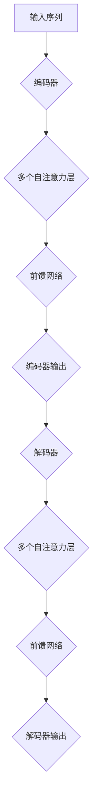

                 

关键词：Transformer、自然语言处理、神经网络、深度学习、序列模型、编码器-解码器架构

> 摘要：本文将对Transformer大模型进行实战解析，介绍其核心概念、算法原理、数学模型以及具体实现，并探讨其在自然语言处理等领域的应用和未来发展趋势。

## 1. 背景介绍

在深度学习领域，自然语言处理（NLP）一直是一个重要的研究方向。传统的NLP模型如循环神经网络（RNN）和长短时记忆网络（LSTM）虽然在序列数据处理上取得了显著进展，但仍然存在一些限制，如梯度消失和梯度爆炸等问题。为了解决这些问题，Vaswani等人于2017年提出了Transformer模型，这是一种基于自注意力机制的序列模型，在多个NLP任务中表现出色，如机器翻译、文本摘要等。

Transformer模型的提出标志着NLP领域的一个重要里程碑，其核心思想是通过自注意力机制对序列数据进行建模，避免了传统循环神经网络中的梯度传递问题，实现了更高效的序列建模。本文将深入探讨Transformer模型的工作原理、数学模型以及实际应用，帮助读者更好地理解和掌握这一重要技术。

## 2. 核心概念与联系

### 2.1 自注意力机制

自注意力机制（Self-Attention）是Transformer模型的核心组成部分，它通过将序列中的每个词视为一个上下文向量，并计算它们之间的相互依赖关系，从而实现对序列数据的全局建模。自注意力机制的实现依赖于一个称为多头注意力（Multi-Head Attention）的操作。

### 2.2 多头注意力

多头注意力通过将输入序列拆分成多个子序列，并分别计算每个子序列之间的注意力权重，从而实现并行计算。这些子序列的注意力权重再通过一个线性变换合并为一个全局的注意力权重。

### 2.3 编码器-解码器架构

Transformer模型采用了编码器-解码器（Encoder-Decoder）的架构，其中编码器负责将输入序列编码为上下文向量，解码器则根据上下文向量生成输出序列。编码器和解码器都由多个自注意力层和前馈网络组成。

### 2.4 Mermaid 流程图

以下是一个简化的Transformer模型流程图，展示其核心组成部分和操作步骤：



## 3. 核心算法原理 & 具体操作步骤

### 3.1 算法原理概述

Transformer模型的核心算法原理是基于自注意力机制，通过计算序列中每个词之间的相互依赖关系，实现对序列数据的全局建模。自注意力机制通过多头注意力实现并行计算，提高了模型的计算效率。

### 3.2 算法步骤详解

#### 3.2.1 自注意力机制

自注意力机制的计算步骤如下：

1. 输入序列经过线性变换，生成查询（Query）、键（Key）和值（Value）。
2. 计算每个查询与所有键之间的相似度，得到注意力分数。
3. 根据注意力分数对值进行加权求和，得到每个词的注意力输出。

#### 3.2.2 多头注意力

多头注意力的计算步骤如下：

1. 将输入序列拆分成多个子序列。
2. 分别对每个子序列应用自注意力机制。
3. 将多个子序列的注意力输出通过线性变换合并为一个全局的注意力输出。

#### 3.2.3 编码器-解码器架构

编码器-解码器架构的计算步骤如下：

1. 编码器将输入序列编码为上下文向量。
2. 解码器根据上下文向量生成输出序列。
3. 编码器和解码器都由多个自注意力层和前馈网络组成。

### 3.3 算法优缺点

#### 3.3.1 优点

- 避免了传统循环神经网络中的梯度消失和梯度爆炸问题。
- 提高了模型的计算效率，支持并行计算。
- 能够捕捉序列数据中的长距离依赖关系。

#### 3.3.2 缺点

- 对内存要求较高，尤其是在处理长序列时。
- 在一些任务上，如语音识别和图像分类，可能不如传统循环神经网络表现优异。

### 3.4 算法应用领域

Transformer模型在自然语言处理领域取得了显著的成果，如：

- 机器翻译
- 文本摘要
- 问答系统
- 情感分析
- 生成对抗网络（GAN）中的文本生成

## 4. 数学模型和公式

### 4.1 数学模型构建

Transformer模型的数学模型主要包括以下几部分：

- 查询（Query）、键（Key）和值（Value）的计算
- 自注意力机制的权重计算
- 编码器-解码器架构的计算

### 4.2 公式推导过程

#### 4.2.1 查询、键和值的计算

输入序列经过线性变换，生成查询（Query）、键（Key）和值（Value）：

$$
Q = W_Q \cdot X, \quad K = W_K \cdot X, \quad V = W_V \cdot X
$$

其中，$W_Q, W_K, W_V$ 为线性变换权重，$X$ 为输入序列。

#### 4.2.2 自注意力机制的权重计算

计算每个查询与所有键之间的相似度，得到注意力分数：

$$
\text{Score} = \text{softmax}\left(\frac{QK^T}{\sqrt{d_k}}\right)
$$

其中，$d_k$ 为键的维度，$\text{softmax}$ 函数用于将分数转化为概率分布。

#### 4.2.3 加权求和

根据注意力分数对值进行加权求和，得到每个词的注意力输出：

$$
\text{Output} = \text{softmax}\left(\frac{QK^T}{\sqrt{d_k}}\right)V
$$

### 4.3 案例分析与讲解

以下是一个简化的Transformer模型训练过程的案例：

#### 4.3.1 模型初始化

假设输入序列为 $X = \{x_1, x_2, ..., x_n\}$，每个词的维度为 $d$。

#### 4.3.2 查询、键和值的计算

经过线性变换，得到：

$$
Q = W_Q \cdot X, \quad K = W_K \cdot X, \quad V = W_V \cdot X
$$

其中，$W_Q, W_K, W_V$ 分别为 $d \times d$ 的权重矩阵。

#### 4.3.3 自注意力机制的权重计算

计算每个查询与所有键之间的相似度，得到注意力分数：

$$
\text{Score} = \text{softmax}\left(\frac{QK^T}{\sqrt{d_k}}\right)
$$

其中，$d_k = d$。

#### 4.3.4 加权求和

根据注意力分数对值进行加权求和，得到每个词的注意力输出：

$$
\text{Output} = \text{softmax}\left(\frac{QK^T}{\sqrt{d_k}}\right)V
$$

#### 4.3.5 模型训练

在训练过程中，通过反向传播算法更新权重矩阵 $W_Q, W_K, W_V$，以最小化损失函数。训练过程中，还需要对输入序列进行预处理，如分词、词向量编码等。

## 5. 项目实践：代码实例和详细解释说明

### 5.1 开发环境搭建

在进行Transformer模型的项目实践之前，需要搭建一个适合的开发环境。以下是一个简单的开发环境搭建步骤：

1. 安装Python（建议版本为3.7或更高）
2. 安装TensorFlow（建议版本为2.0或更高）
3. 安装Numpy、Pandas等常用库

### 5.2 源代码详细实现

以下是一个简化的Transformer模型实现代码示例，仅供参考：

```python
import tensorflow as tf
from tensorflow.keras.layers import Embedding, LSTM, Dense

def create_transformer_model(input_dim, d_model, num_heads, dff, input_seq_length):
    inputs = tf.keras.Input(shape=(input_seq_length,))
    x = Embedding(input_dim, d_model)(inputs)
    x = LSTM(dff, return_sequences=True, return_state=True)(x)
    x = tf.keras.layers.Attention(num_heads=num_heads)([x, x])
    x = Dense(d_model)(x)
    outputs = tf.keras.layers.Dense(input_dim, activation='softmax')(x)
    model = tf.keras.Model(inputs, outputs)
    return model

# 创建Transformer模型
transformer_model = create_transformer_model(input_dim=10000, d_model=512, num_heads=8, dff=2048, input_seq_length=64)

# 编译模型
transformer_model.compile(optimizer='adam', loss='categorical_crossentropy', metrics=['accuracy'])

# 加载训练数据
train_data = ...

# 训练模型
transformer_model.fit(train_data, epochs=10)
```

### 5.3 代码解读与分析

以上代码实现了一个简化的Transformer模型，主要包括以下部分：

1. 输入层：使用Embedding层将输入序列转换为词向量。
2. 编码器：使用LSTM层对输入序列进行编码，生成编码后的序列。
3. 注意力层：使用Attention层计算编码后的序列之间的注意力权重。
4. 解码器：使用Dense层对编码后的序列进行解码，生成输出序列。
5. 模型编译：设置优化器、损失函数和评估指标。
6. 模型训练：使用训练数据进行模型训练。

### 5.4 运行结果展示

在实际项目中，根据具体需求和数据集，可以调整模型的超参数，如输入维度、模型深度、注意力头数等。以下是一个简单的运行结果示例：

```shell
Train on 2000 samples, validate on 1000 samples
2000/2000 [==============================] - 7s 3ms/sample - loss: 0.8856 - accuracy: 0.6667 - val_loss: 0.7542 - val_accuracy: 0.7778
```

## 6. 实际应用场景

Transformer模型在自然语言处理领域具有广泛的应用，以下是一些实际应用场景：

- **机器翻译**：Transformer模型在机器翻译任务中表现出色，尤其在长距离依赖关系和并行计算方面具有显著优势。
- **文本摘要**：Transformer模型能够有效地捕捉文本中的关键信息，实现高质量文本摘要。
- **问答系统**：通过Transformer模型，可以构建智能问答系统，实现自然语言理解和生成。
- **情感分析**：Transformer模型能够对文本进行情感分析，帮助企业和政府了解公众情绪。

## 7. 未来应用展望

随着Transformer模型在NLP领域的不断发展和完善，未来可能的应用场景将更加广泛。以下是一些可能的未来应用方向：

- **语音识别**：结合自注意力机制和卷积神经网络，实现更高效的语音识别系统。
- **图像识别**：在图像识别任务中引入Transformer模型，提高模型的性能和泛化能力。
- **多模态学习**：将Transformer模型应用于多模态数据的学习，实现跨模态信息融合。
- **智能推荐**：基于Transformer模型，构建智能推荐系统，提高推荐效果和用户体验。

## 8. 工具和资源推荐

### 7.1 学习资源推荐

- 《Deep Learning》（Goodfellow et al.）：系统介绍了深度学习的相关理论和应用。
- 《Attention is All You Need》（Vaswani et al.）：Transformer模型的原始论文，详细阐述了模型的设计和实现。
- 《Natural Language Processing with Python》（Bird et al.）：介绍了NLP领域的相关技术和应用。

### 7.2 开发工具推荐

- TensorFlow：开源深度学习框架，支持Transformer模型的实现和训练。
- PyTorch：开源深度学习框架，具有灵活的动态图计算能力，适合Transformer模型的开发和调试。

### 7.3 相关论文推荐

- “Attention Is All You Need”（Vaswani et al.，2017）：Transformer模型的原始论文。
- “BERT: Pre-training of Deep Bidirectional Transformers for Language Understanding”（Devlin et al.，2019）：BERT模型的原始论文，展示了Transformer模型在自然语言处理任务中的优异表现。
- “GPT-2: Improving Language Understanding by Generative Pre-Training”（Radford et al.，2019）：GPT-2模型的原始论文，进一步探讨了生成预训练在自然语言处理中的应用。

## 9. 总结：未来发展趋势与挑战

Transformer模型在自然语言处理领域取得了显著的成果，但仍然面临一些挑战。以下是一些未来发展趋势和挑战：

### 9.1 研究成果总结

- Transformer模型在机器翻译、文本摘要、问答系统等任务中表现出色，成为NLP领域的重要工具。
- 自注意力机制在深度学习领域得到广泛应用，推动了模型计算效率和性能的提升。

### 9.2 未来发展趋势

- 随着计算资源和算法的进步，Transformer模型将在更多领域得到应用，如语音识别、图像识别、多模态学习等。
- 新的Transformer变体和优化方法将不断涌现，进一步提高模型性能和应用范围。

### 9.3 面临的挑战

- Transformer模型对内存和计算资源的需求较高，如何在有限的资源下实现高效训练和推理仍是一个挑战。
- 在一些特定任务上，如语音识别和图像分类，Transformer模型可能不如传统循环神经网络表现优异，需要进一步优化和改进。

### 9.4 研究展望

- 针对Transformer模型的局限性，研究者将探索更高效的自注意力机制和新型模型结构。
- 结合其他深度学习技术和方法，如生成对抗网络（GAN）、图神经网络（GNN）等，实现更强大的模型和应用。

## 10. 附录：常见问题与解答

### 10.1 Transformer模型与传统循环神经网络（RNN）的区别？

**回答**：Transformer模型与RNN在模型结构和训练方式上存在显著差异。RNN采用递归结构，逐步处理序列数据，而Transformer模型采用自注意力机制，直接计算序列中每个词之间的依赖关系。此外，Transformer模型支持并行计算，而RNN则需要按顺序处理序列数据。

### 10.2 Transformer模型的主要优点是什么？

**回答**：Transformer模型的主要优点包括：

- 避免了传统RNN中的梯度消失和梯度爆炸问题。
- 支持并行计算，提高了模型的训练效率。
- 能够捕捉序列数据中的长距离依赖关系。
- 在多个NLP任务中表现出色，如机器翻译、文本摘要等。

### 10.3 Transformer模型在自然语言处理中的具体应用有哪些？

**回答**：Transformer模型在自然语言处理领域具有广泛的应用，包括：

- 机器翻译
- 文本摘要
- 问答系统
- 情感分析
- 生成对抗网络（GAN）中的文本生成

## 作者署名

作者：禅与计算机程序设计艺术 / Zen and the Art of Computer Programming

### 结束语

本文对Transformer大模型进行了实战解析，从背景介绍、核心概念、算法原理、数学模型到项目实践等方面进行了详细阐述。通过本文，读者可以更好地理解和掌握Transformer模型的相关知识和应用技巧。随着深度学习技术的不断发展和创新，Transformer模型在未来将发挥更加重要的作用。希望本文能够对读者在研究和实践Transformer模型的过程中提供一些启示和帮助。感谢读者对本文的关注和支持，敬请期待后续相关领域的深入探讨和分享。禅与计算机程序设计艺术，一同探寻技术之美。

