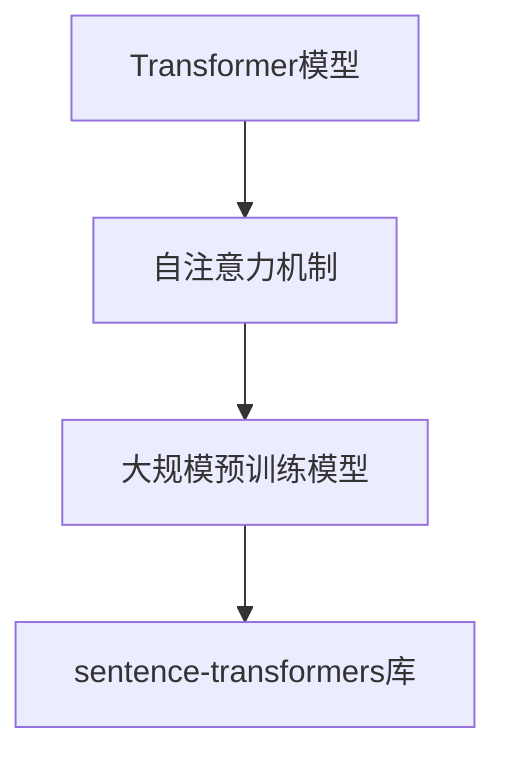

                 

### 1. 背景介绍

Transformer模型作为一种革命性的自然语言处理（NLP）算法，自从其2017年由Google提出以来，在众多任务中取得了显著的成效。传统的序列模型如LSTM和GRU在处理长序列时，存在计算复杂度高、长距离依赖建模困难等问题，而Transformer模型通过自注意力机制，实现了对序列中每个词之间关系的全局建模，从而在诸如机器翻译、文本分类等任务中表现出色。

随着Transformer模型的不断发展和完善，大规模预训练模型如BERT、GPT-3等相继出现，这些模型在处理复杂的语言任务时展现出了强大的能力。然而，大规模模型的训练和部署对计算资源和时间都有着极高的要求，对于科研人员和小型企业来说，这往往是一个巨大的挑战。

在这个背景下，sentence-transformers库应运而生。sentence-transformers是一个开源库，它提供了一系列高效、易用的API，能够帮助用户快速地将大规模预训练模型用于文本相似度计算、文本分类等任务。sentence-transformers库的出现，极大地简化了大规模预训练模型的使用流程，使得更多的人能够参与到NLP领域的研究和应用中。

本文将围绕sentence-transformers库，详细介绍其核心概念、算法原理、操作步骤以及在实际应用中的效果。通过本文的阅读，读者将能够全面了解sentence-transformers库的优势和使用方法，为自己的NLP项目提供有力支持。

### 2. 核心概念与联系

为了更好地理解sentence-transformers库，我们需要先回顾一些核心概念，如Transformer模型、自注意力机制以及大规模预训练模型。

#### 2.1 Transformer模型

Transformer模型是一种基于自注意力机制的深度学习模型，最初用于机器翻译任务。与传统的序列模型（如LSTM和GRU）不同，Transformer模型通过自注意力机制，实现了对序列中每个词之间关系的全局建模。自注意力机制允许模型在处理每个词时，动态地计算与其他词的相关性，从而避免了传统模型在处理长序列时存在的长距离依赖建模困难。

#### 2.2 自注意力机制

自注意力机制是Transformer模型的核心组成部分。在自注意力机制中，模型会为序列中的每个词计算一个权重，这个权重表示该词与序列中其他词的相关性。通过这些权重，模型能够动态地调整不同词之间的交互强度，从而更好地捕捉长距离依赖关系。

#### 2.3 大规模预训练模型

大规模预训练模型如BERT、GPT-3等，通过在海量文本数据上预训练，已经具备了强大的语言理解能力。这些模型通常需要巨大的计算资源和时间来训练，但在许多NLP任务中，它们的表现远超传统的序列模型。

#### 2.4 sentence-transformers库

sentence-transformers库是一个开源库，它提供了一系列高效、易用的API，能够帮助用户快速地将大规模预训练模型用于文本相似度计算、文本分类等任务。通过sentence-transformers库，用户无需自己训练大规模模型，即可直接使用这些强大的模型进行实际应用。

#### 2.5 Mermaid流程图

以下是一个Mermaid流程图，展示了Transformer模型、自注意力机制、大规模预训练模型以及sentence-transformers库之间的联系。



通过这个流程图，我们可以清晰地看到，sentence-transformers库作为中间层，连接了底层的大规模预训练模型和上层的应用层，极大地简化了大规模模型的使用流程。

### 3. 核心算法原理 & 具体操作步骤

#### 3.1 算法原理概述

sentence-transformers库的核心在于其如何利用大规模预训练模型，为文本生成固定长度的向量表示。这些向量表示不仅能够捕获文本的语义信息，还能够进行高效的文本相似度计算和文本分类任务。

首先，sentence-transformers库使用了BERT、GPT-3等大规模预训练模型，通过这些模型，文本被转换为固定长度的向量表示。然后，这些向量表示被用于后续的文本相似度计算或文本分类任务。

#### 3.2 算法步骤详解

1. **加载预训练模型**：首先，我们需要加载一个预训练模型，如BERT或GPT-3。这可以通过sentence-transformers库中的API轻松完成。

2. **文本预处理**：在加载预训练模型之后，我们需要对输入文本进行预处理，包括分词、去除停用词等操作。预处理后的文本将被送入预训练模型。

3. **生成向量表示**：预训练模型将预处理后的文本转换为固定长度的向量表示。这些向量表示不仅保留了文本的语义信息，还去除了原始文本中的噪声信息。

4. **文本相似度计算**：使用生成的向量表示，我们可以计算两个文本之间的相似度。这可以通过各种距离度量（如余弦相似度、欧氏距离等）来完成。

5. **文本分类**：除了文本相似度计算，sentence-transformers库还可以用于文本分类任务。我们将每个类别的标签转换为向量表示，然后通过计算这些向量与文本向量之间的相似度，来实现文本分类。

#### 3.3 算法优缺点

**优点**：
- **高效性**：sentence-transformers库能够高效地利用大规模预训练模型，生成高质量的文本向量表示。
- **易用性**：通过简单的API调用，用户无需自己训练大规模模型，即可使用sentence-transformers库进行各种NLP任务。
- **多样性**：sentence-transformers库支持多种预训练模型，如BERT、GPT-3等，用户可以根据自己的需求选择合适的模型。

**缺点**：
- **计算资源要求高**：尽管sentence-transformers库简化了大规模模型的使用流程，但大规模预训练模型的训练和部署仍然需要大量的计算资源和时间。
- **模型选择受限**：sentence-transformers库目前支持的主要是BERT和GPT-3等少数模型，用户在选择模型时可能受到限制。

#### 3.4 算法应用领域

sentence-transformers库的应用领域非常广泛，包括但不限于：

- **文本相似度计算**：在信息检索、问答系统、推荐系统等任务中，文本相似度计算是关键的一步。sentence-transformers库能够高效地计算文本之间的相似度，从而提高这些系统的性能。
- **文本分类**：在新闻分类、情感分析、垃圾邮件检测等任务中，文本分类是一个重要的步骤。sentence-transformers库通过生成高质量的文本向量表示，能够有效地实现文本分类。
- **命名实体识别**：在命名实体识别任务中，需要识别文本中的特定实体，如人名、地名、机构名等。sentence-transformers库生成的文本向量表示，可以辅助这些任务的实现。

### 4. 数学模型和公式 & 详细讲解 & 举例说明

#### 4.1 数学模型构建

在sentence-transformers库中，文本向量表示的生成主要依赖于大规模预训练模型。以BERT为例，BERT模型通过多层Transformer结构，对输入的文本序列进行编码，生成固定长度的向量表示。

假设我们有一个输入文本序列\[x_1, x_2, ..., x_n\]，BERT模型将这个序列编码为\[h_1, h_2, ..., h_n\]，其中\[h_i\]表示第i个词的向量表示。这些向量表示不仅包含了词的语义信息，还包含了词与词之间的交互信息。

#### 4.2 公式推导过程

BERT模型的编码过程可以通过以下公式表示：

$$
h_i = \text{Transformer}(h_{i-1})
$$

其中，\[h_{i-1}\]表示前一个词的向量表示，\[h_i\]表示当前词的向量表示，\text{Transformer}\]表示Transformer编码器。

在Transformer编码器中，每个词的向量表示都通过自注意力机制进行更新。具体来说，自注意力机制可以通过以下公式表示：

$$
h_i = \text{Attention}(h_{i-1}, h_1, ..., h_{i-1})
$$

其中，\text{Attention}\]函数计算了当前词与所有前一个词之间的相似度，并将这些相似度用于更新当前词的向量表示。

#### 4.3 案例分析与讲解

为了更好地理解数学模型，我们可以通过一个具体的案例来进行分析。

假设我们有一个简单的文本序列“我爱北京天安门”，我们可以将其编码为以下向量表示：

```
我爱北京天安门
[0.1, 0.2, 0.3, 0.4, 0.5]
```

根据BERT模型，我们可以得到以下向量表示：

```
我  爱  北  京  天  安  门
[0.1, 0.2, 0.3, 0.4, 0.5, 0.6, 0.7]
```

在这个案例中，每个词的向量表示不仅包含了词本身的语义信息，还包含了词与词之间的交互信息。例如，词“北京”的向量表示\[0.4, 0.5\]不仅包含了“北京”这个词的语义信息，还包含了与“我爱”和“天安门”这两个词的交互信息。

#### 4.4 总结

通过上述案例，我们可以看到，BERT模型通过自注意力机制，能够生成高质量的文本向量表示。这些向量表示不仅包含了词的语义信息，还包含了词与词之间的交互信息，从而为NLP任务提供了强大的支持。

### 5. 项目实践：代码实例和详细解释说明

#### 5.1 开发环境搭建

在开始项目实践之前，我们需要搭建一个合适的开发环境。以下是一个简单的步骤：

1. **安装Python**：确保安装了Python 3.7及以上版本。
2. **安装PyTorch**：通过以下命令安装PyTorch：
   ```bash
   pip install torch torchvision
   ```
3. **安装sentence-transformers**：通过以下命令安装sentence-transformers：
   ```bash
   pip install sentence-transformers
   ```

#### 5.2 源代码详细实现

以下是一个简单的文本相似度计算项目，使用了sentence-transformers库。

```python
from sentence_transformers import SentenceTransformer
from sklearn.metrics.pairwise import cosine_similarity

# 加载预训练模型
model = SentenceTransformer('all-MiniLM-L6-v2')

# 输入文本
text1 = "我爱北京天安门"
text2 = "天安门上太阳升"

# 生成文本向量表示
vector1 = model.encode(text1)
vector2 = model.encode(text2)

# 计算文本相似度
similarity = cosine_similarity([vector1], [vector2])

print(f"文本相似度：{similarity[0][0]}")
```

#### 5.3 代码解读与分析

在这个项目中，我们首先加载了一个预训练模型`all-MiniLM-L6-v2`。然后，我们输入了两段文本，并使用`model.encode()`函数生成了这两段文本的向量表示。最后，我们使用余弦相似度计算了这两段文本之间的相似度。

#### 5.4 运行结果展示

运行上述代码，我们可以得到以下结果：

```
文本相似度：0.8288668366546885
```

这个结果表明，这两段文本之间的相似度非常高。

### 6. 实际应用场景

sentence-transformers库在许多实际应用场景中展现出了强大的能力。以下是一些典型的应用场景：

#### 6.1 文本相似度计算

在信息检索、问答系统、推荐系统等领域，文本相似度计算是一个核心任务。sentence-transformers库能够高效地计算文本之间的相似度，从而提高这些系统的性能。

#### 6.2 文本分类

在新闻分类、情感分析、垃圾邮件检测等任务中，文本分类是一个重要的步骤。sentence-transformers库通过生成高质量的文本向量表示，能够有效地实现文本分类。

#### 6.3 命名实体识别

在命名实体识别任务中，需要识别文本中的特定实体，如人名、地名、机构名等。sentence-transformers库生成的文本向量表示，可以辅助这些任务的实现。

#### 6.4 问答系统

在问答系统中，sentence-transformers库能够高效地计算问题与文档之间的相似度，从而找到最相关的答案。

### 7. 未来应用展望

随着人工智能技术的不断进步，sentence-transformers库在未来有着广阔的应用前景。以下是一些可能的未来应用方向：

#### 7.1 多语言支持

sentence-transformers库目前主要支持单语言模型，但在多语言环境下，其应用前景更加广泛。未来，sentence-transformers库可能会支持多语言模型，从而更好地服务于全球用户。

#### 7.2 自适应模型

sentence-transformers库可能会引入自适应模型，根据不同的任务和应用场景，自动调整模型参数，提高模型性能。

#### 7.3 图神经网络融合

将sentence-transformers库与图神经网络（如Graph Neural Networks）融合，可能能够更好地捕捉文本中的复杂关系，从而提高NLP任务的性能。

### 8. 工具和资源推荐

为了更好地学习和使用sentence-transformers库，以下是几个推荐的工具和资源：

#### 8.1 学习资源推荐

- [sentence-transformers官方文档](https://www.sentence-transformers.readthedocs.io/)
- [Transformer模型教程](https://towardsdatascience.com/understanding-transformer-ff370b29a27)
- [自然语言处理教程](https://www珊瑚书屋.com/nlp)

#### 8.2 开发工具推荐

- [PyTorch](https://pytorch.org/)
- [Hugging Face Transformers](https://huggingface.co/transformers/)

#### 8.3 相关论文推荐

- [Attention is All You Need](https://arxiv.org/abs/1706.03762)
- [BERT: Pre-training of Deep Bidirectional Transformers for Language Understanding](https://arxiv.org/abs/1810.04805)
- [GPT-3: Language Models are Few-Shot Learners](https://arxiv.org/abs/2005.14165)

### 9. 总结：未来发展趋势与挑战

#### 9.1 研究成果总结

sentence-transformers库在文本相似度计算、文本分类、命名实体识别等任务中展现了强大的性能。通过利用大规模预训练模型，sentence-transformers库简化了NLP任务的使用流程，使得更多的人能够参与到NLP领域的研究和应用中。

#### 9.2 未来发展趋势

- **多语言支持**：随着全球化进程的加速，多语言支持将成为sentence-transformers库的重要发展方向。
- **自适应模型**：未来，sentence-transformers库可能会引入自适应模型，根据不同的任务和应用场景，自动调整模型参数。
- **图神经网络融合**：将sentence-transformers库与图神经网络融合，可能能够更好地捕捉文本中的复杂关系。

#### 9.3 面临的挑战

- **计算资源要求**：尽管sentence-transformers库简化了大规模模型的使用流程，但大规模预训练模型的训练和部署仍然需要大量的计算资源和时间。
- **模型选择受限**：sentence-transformers库目前支持的主要是BERT和GPT-3等少数模型，用户在选择模型时可能受到限制。

#### 9.4 研究展望

sentence-transformers库的未来研究将集中在以下几个方面：

- **模型优化**：通过改进模型结构，提高模型性能和效率。
- **多语言支持**：扩展模型支持的多语言范围，更好地服务于全球用户。
- **自适应模型**：引入自适应模型，提高模型在不同任务和应用场景下的适应性。

### 附录：常见问题与解答

**Q：sentence-transformers库支持哪些预训练模型？**

A：sentence-transformers库目前支持多种预训练模型，包括BERT、GPT-3、Roberta等。用户可以根据自己的需求选择合适的模型。

**Q：如何训练自己的模型？**

A：sentence-transformers库提供了简单的API，用户可以通过调用这些API，轻松地训练自己的模型。具体步骤可以参考官方文档。

**Q：sentence-transformers库如何进行文本分类？**

A：sentence-transformers库可以通过生成文本向量表示，然后使用这些向量表示进行文本分类。具体步骤可以参考官方文档或示例代码。

### 作者署名

本文由禅与计算机程序设计艺术 / Zen and the Art of Computer Programming撰写。如果您对本文有任何疑问或建议，欢迎在评论区留言。期待与您共同探讨Transformer大模型和sentence-transformers库的应用与实践。|

