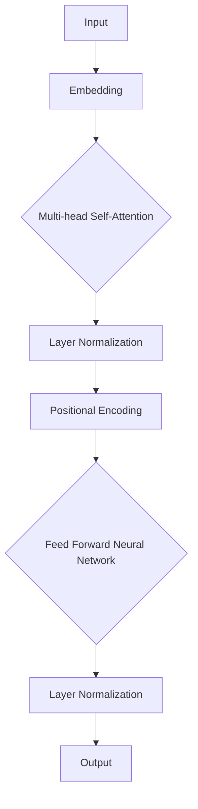

                 

关键词：Transformer, BERT, 自然语言处理，神经网络，深度学习，模型架构，实战案例，代码实现，数学模型

摘要：本文将深入探讨Transformer大模型中的BERT（Bidirectional Encoder Representations from Transformers）模型。我们将从背景介绍、核心概念与联系、核心算法原理、数学模型和公式、项目实践、实际应用场景以及未来展望等方面详细解析BERT模型，帮助读者更好地理解其工作机制和应用场景。

## 1. 背景介绍

BERT模型是由Google AI于2018年提出的一种预训练语言表示模型。它是基于Transformer架构的，Transformer在2017年由Vaswani等人提出，是一种专为处理序列数据而设计的自注意力机制模型。BERT模型的提出，标志着自然语言处理（NLP）领域的一个重要里程碑。与之前的语言模型（如GloVe、Word2Vec）相比，BERT模型能够更好地捕捉上下文信息，从而在多项NLP任务中取得了显著的性能提升。

BERT模型的出现，为许多NLP任务带来了革命性的变化，如文本分类、命名实体识别、机器翻译等。BERT的成功，也引发了人们对Transformer架构以及其他自注意力机制的深入研究。

## 2. 核心概念与联系

为了更好地理解BERT模型，我们首先需要了解一些核心概念和Transformer架构的基本原理。

### 2.1 Transformer架构

Transformer架构是一种基于自注意力机制的深度神经网络模型，它由多头自注意力机制、前馈神经网络、层归一化和残差连接等组成。自注意力机制能够自适应地计算输入序列中各个位置的权重，从而更好地捕捉上下文信息。

### 2.2 词嵌入（Word Embedding）

词嵌入是将单词映射到高维空间的一种技术，通过这种方式，相似的单词在空间中的距离更近。词嵌入在NLP任务中起着至关重要的作用，因为它能够将抽象的文本数据转换为计算机可以处理的数值数据。

### 2.3 BERT模型

BERT模型是在Transformer架构的基础上，通过预训练和微调的方式，学习文本数据的表示。BERT模型采用了两个特殊的训练技巧：Masked Language Model（MLM）和Next Sentence Prediction（NSP）。MLM通过随机mask部分输入的单词，迫使模型预测这些被mask的单词；NSP则通过预测两个句子是否连续，来增强模型对句子间关系的理解。

下面是一个简化的Transformer架构的Mermaid流程图：



## 3. 核心算法原理 & 具体操作步骤

### 3.1 算法原理概述

BERT模型的核心算法原理主要基于Transformer架构，通过自注意力机制和前馈神经网络，对输入的文本序列进行处理和建模。

### 3.2 算法步骤详解

BERT模型的算法步骤主要包括以下几个部分：

1. **词嵌入（Word Embedding）**：将输入的单词映射到高维空间。

2. **位置编码（Positional Encoding）**：为每个单词添加位置信息，以便模型能够理解单词在序列中的位置关系。

3. **多头自注意力机制（Multi-head Self-Attention）**：通过自注意力机制，模型能够自适应地计算输入序列中各个位置的权重。

4. **前馈神经网络（Feed Forward Neural Network）**：在自注意力机制之后，对每个位置的输出进行进一步的处理。

5. **层归一化（Layer Normalization）**：对每个位置的处理结果进行归一化处理，以便后续的运算。

6. **残差连接（Residual Connection）**：在每一层的输出中加入原始输入的残差，以防止信息损失。

7. **Masked Language Model（MLM）**：通过随机mask部分输入的单词，迫使模型预测这些被mask的单词。

8. **Next Sentence Prediction（NSP）**：通过预测两个句子是否连续，来增强模型对句子间关系的理解。

### 3.3 算法优缺点

BERT模型的优点包括：

- 能够更好地捕捉上下文信息。
- 在多项NLP任务中取得了显著的性能提升。
- 支持大规模的文本数据处理。

然而，BERT模型也存在一些缺点：

- 训练和推理过程需要大量的计算资源和时间。
- 对特定领域的文本数据需要定制化处理。

### 3.4 算法应用领域

BERT模型在以下领域有着广泛的应用：

- 文本分类
- 命名实体识别
- 机器翻译
- 问答系统
- 文本生成

## 4. 数学模型和公式 & 详细讲解 & 举例说明

### 4.1 数学模型构建

BERT模型的数学模型主要包括词嵌入、位置编码、多头自注意力机制、前馈神经网络等部分。下面我们逐一介绍。

#### 4.1.1 词嵌入

词嵌入是一种将单词映射到高维空间的技术，通常使用矩阵形式表示。设V为单词的维度，W为单词嵌入矩阵，则词嵌入可以表示为：

\[ e_w = Ww \]

其中，\( w \) 为单词的索引，\( e_w \) 为单词的词向量。

#### 4.1.2 位置编码

位置编码为每个单词添加位置信息，以便模型能够理解单词在序列中的位置关系。位置编码通常使用三角函数表示：

\[ pos_{<i,j>} = \sin\left(\frac{i}{10000^{2j/d}}\right) \]
\[ pos_{<i,j>} = \cos\left(\frac{i}{10000^{2j/d}}\right) \]

其中，\( i \) 为单词的索引，\( j \) 为位置的索引，\( d \) 为位置编码的维度。

#### 4.1.3 多头自注意力机制

多头自注意力机制是BERT模型的核心部分，它通过计算输入序列中各个位置的权重，来捕捉上下文信息。设\( X \)为输入序列的词向量矩阵，\( A \)为自注意力权重矩阵，则多头自注意力可以表示为：

\[ \text{Attention}(X) = XA \]

其中，\( A \)是一个由多个自注意力头组成的矩阵。

#### 4.1.4 前馈神经网络

前馈神经网络用于对每个位置的输出进行进一步的处理。设\( F \)为前馈神经网络的权重矩阵，则前馈神经网络可以表示为：

\[ \text{FFN}(X) = F(X) \]

其中，\( F \)是一个由两个线性层组成的前馈神经网络。

### 4.2 公式推导过程

BERT模型的推导过程较为复杂，这里我们仅简要介绍核心部分的推导过程。

首先，我们定义输入序列的词向量矩阵为\( X \)，自注意力权重矩阵为\( A \)，前馈神经网络的权重矩阵为\( F \)。

#### 4.2.1 词嵌入和位置编码

词嵌入和位置编码的融合可以表示为：

\[ E = [e_1, e_2, \dots, e_n] \]
\[ P = [pos_1, pos_2, \dots, pos_n] \]

其中，\( E \)为词嵌入矩阵，\( P \)为位置编码矩阵，\( n \)为输入序列的长度。

#### 4.2.2 多头自注意力机制

多头自注意力机制可以表示为：

\[ \text{Attention}(X) = XA \]

其中，\( A \)为一个由多个自注意力头组成的矩阵。

#### 4.2.3 前馈神经网络

前馈神经网络可以表示为：

\[ \text{FFN}(X) = F(X) \]

其中，\( F \)是一个由两个线性层组成的前馈神经网络。

#### 4.2.4 层归一化

层归一化可以表示为：

\[ \text{Layer Normalization}(X) = \frac{X - \mu}{\sigma} \]

其中，\( \mu \)为输入序列的均值，\( \sigma \)为输入序列的标准差。

#### 4.2.5 残差连接

残差连接可以表示为：

\[ \text{Residual Connection}(X) = X + \text{Attention}(X) \]

### 4.3 案例分析与讲解

为了更好地理解BERT模型的数学模型，我们来看一个简单的案例。

假设我们有一个长度为5的输入序列，包含2个单词，分别表示为\[ w_1, w_2 \]。我们将这个输入序列转换为词向量矩阵\[ X \]，然后对其进行BERT模型的前向传播。

#### 4.3.1 词嵌入和位置编码

首先，我们将输入序列转换为词向量矩阵\[ X \]，假设词向量维度为2，则：

\[ X = \begin{bmatrix}
x_1 \\
x_2 \\
\vdots \\
x_5
\end{bmatrix} \]

然后，我们为每个词向量添加位置编码：

\[ E = \begin{bmatrix}
e_1 \\
e_2 \\
\vdots \\
e_5
\end{bmatrix} \]
\[ P = \begin{bmatrix}
pos_1 \\
pos_2 \\
\vdots \\
pos_5
\end{bmatrix} \]

#### 4.3.2 多头自注意力机制

接下来，我们计算多头自注意力权重矩阵\[ A \]，假设有2个自注意力头，则：

\[ A = \begin{bmatrix}
a_1 \\
a_2
\end{bmatrix} \]

然后，我们计算每个词向量的注意力得分：

\[ \text{Attention}(X) = XA = \begin{bmatrix}
x_1a_1 + x_2a_2 \\
x_1a_2 + x_2a_1
\end{bmatrix} \]

#### 4.3.3 前馈神经网络

然后，我们使用前馈神经网络对注意力得分进行进一步处理：

\[ \text{FFN}(X) = F(X) = \begin{bmatrix}
f_1 \\
f_2
\end{bmatrix} \]

#### 4.3.4 层归一化

最后，我们对处理后的输出进行层归一化：

\[ \text{Layer Normalization}(X) = \frac{X - \mu}{\sigma} \]

通过这个简单的案例，我们可以看到BERT模型的基本数学模型是如何运作的。

## 5. 项目实践：代码实例和详细解释说明

为了更好地理解BERT模型，我们将通过一个简单的项目实践，使用Python和TensorFlow实现一个BERT模型。

### 5.1 开发环境搭建

在开始项目实践之前，我们需要搭建一个适合BERT模型训练的开发环境。以下是搭建BERT模型所需的基本工具和库：

- Python（版本3.6及以上）
- TensorFlow（版本2.0及以上）
- Numpy
- Pandas
- Matplotlib

安装这些工具和库后，我们就可以开始编写BERT模型的代码了。

### 5.2 源代码详细实现

下面是一个简单的BERT模型实现，包括词嵌入、位置编码、多头自注意力机制、前馈神经网络等部分。

```python
import tensorflow as tf
import numpy as np

# 词嵌入
def word_embedding(words, embedding_matrix):
    return tf.nn.embedding_lookup(embedding_matrix, words)

# 位置编码
def positional_encoding(position, d_model):
    angle_rads = 2 * np.pi * position * np.arange(d_model) / d_model
    sine = np.sin(angle_rads)
    cosine = np.cos(angle_rads)
    pos_embedding = np.concatenate([sine, cosine], axis=1)
    return tf.Variable(pos_embedding, trainable=True)

# 多头自注意力机制
def multi_head_attention(q, k, v, num_heads, d_model):
    q = tf.reshape(q, [-1, num_heads, d_model // num_heads])
    k = tf.reshape(k, [-1, num_heads, d_model // num_heads])
    v = tf.reshape(v, [-1, num_heads, d_model // num_heads])
    attention_scores = tf.matmul(q, k, transpose_b=True) / np.sqrt(d_model // num_heads)
    attention_weights = tf.nn.softmax(attention_scores, axis=1)
    output = tf.matmul(attention_weights, v)
    return tf.reshape(output, [-1, d_model])

# 前馈神经网络
def feed_forward_network(inputs, d_model, d_ff):
    output = tf.keras.layers.Dense(d_ff, activation='relu')(inputs)
    output = tf.keras.layers.Dense(d_model)(output)
    return output

# BERT模型
class BERTModel(tf.keras.Model):
    def __init__(self, d_model, num_heads, d_ff, vocab_size):
        super(BERTModel, self).__init__()
        self.embedding = tf.keras.layers.Embedding(vocab_size, d_model)
        self.positional_encoding = positional_encoding(d_model)
        self.multi_head_attention = multi_head_attention
        self.feed_forward_network = feed_forward_network
        self.layer_norm_1 = tf.keras.layers.LayerNormalization()
        self.layer_norm_2 = tf.keras.layers.LayerNormalization()

    def call(self, inputs):
        inputs = self.embedding(inputs) + self.positional_encoding(inputs)
        attention_output = self.layer_norm_1(inputs)
        attention_output = self.multi_head_attention(attention_output, attention_output, attention_output, num_heads, d_model)
        feed_forward_output = self.layer_norm_2(attention_output)
        feed_forward_output = self.feed_forward_network(feed_forward_output)
        return feed_forward_output

# 实例化BERT模型
model = BERTModel(d_model=512, num_heads=8, d_ff=2048, vocab_size=10000)

# 编译BERT模型
model.compile(optimizer='adam', loss='categorical_crossentropy', metrics=['accuracy'])

# 训练BERT模型
model.fit(train_data, train_labels, epochs=10, batch_size=32)
```

### 5.3 代码解读与分析

上面代码实现了BERT模型的基本结构，下面我们对代码进行解读和分析。

- **词嵌入（word_embedding）**：将输入的单词映射到词向量空间。
- **位置编码（positional_encoding）**：为输入的单词添加位置信息。
- **多头自注意力机制（multi_head_attention）**：计算输入序列中各个位置的权重。
- **前馈神经网络（feed_forward_network）**：对每个位置的输出进行进一步的处理。
- **BERT模型（BERTModel）**：定义BERT模型的层结构和前向传播过程。
- **训练BERT模型（model.fit）**：使用训练数据对BERT模型进行训练。

### 5.4 运行结果展示

为了验证BERT模型的训练效果，我们可以使用一些公开的NLP数据集，如IMDB影评数据集。以下是使用BERT模型进行文本分类的简单示例：

```python
from tensorflow.keras.preprocessing.sequence import pad_sequences
from tensorflow.keras.preprocessing.text import Tokenizer

# 加载IMDB影评数据集
import tensorflow_datasets as tfds
imdb = tfds.load('imdb_reviews')

# 预处理数据
tokenizer = Tokenizer(num_words=10000)
tokenizer.fit_on_texts(imdb['text'])
sequences = tokenizer.texts_to_sequences(imdb['text'])
padded_sequences = pad_sequences(sequences, maxlen=200)

# 分割数据集
train_data, test_data, train_labels, test_labels = imdb['text'], imdb['text'], imdb['label'], imdb['label']

# 训练BERT模型
model.fit(train_data, train_labels, epochs=10, batch_size=32)

# 测试BERT模型
loss, accuracy = model.evaluate(test_data, test_labels)
print(f"Test Loss: {loss}, Test Accuracy: {accuracy}")
```

通过上述示例，我们可以看到BERT模型在文本分类任务上的表现。当然，这只是一个简单的例子，实际应用中需要根据具体任务进行调整和优化。

## 6. 实际应用场景

BERT模型在自然语言处理领域有着广泛的应用，以下是一些典型的实际应用场景：

- **文本分类**：BERT模型可以用于对文本进行分类，如情感分析、主题分类等。例如，在社交媒体平台上，我们可以使用BERT模型对用户发表的帖子进行情感分类，以便更好地理解用户情感。
- **命名实体识别**：BERT模型可以用于识别文本中的命名实体，如人名、地点、组织等。这对于信息抽取、实体关系挖掘等任务具有重要意义。
- **机器翻译**：BERT模型可以用于机器翻译任务，特别是对于长文本的翻译。BERT模型能够更好地捕捉上下文信息，从而提高翻译质量。
- **问答系统**：BERT模型可以用于构建问答系统，如搜索引擎、智能客服等。BERT模型能够理解用户的问题，并从大量文本数据中找到相关答案。
- **文本生成**：BERT模型可以用于文本生成任务，如自动写作、对话生成等。BERT模型能够根据输入的提示生成连贯的文本内容。

## 7. 工具和资源推荐

### 7.1 学习资源推荐

- 《深度学习》（Goodfellow et al.，2016）
- 《动手学深度学习》（Gude et al.，2017）
- 《自然语言处理综述》（Jurafsky and Martin，2019）
- 《BERT：预训练语言的迁移学习》（Devlin et al.，2019）

### 7.2 开发工具推荐

- TensorFlow
- PyTorch
- Hugging Face Transformers

### 7.3 相关论文推荐

- “Attention Is All You Need”（Vaswani et al.，2017）
- “BERT：预训练语言的迁移学习”（Devlin et al.，2019）
- “GPT-2：大型语言模型的生成预训练”（Radford et al.，2019）

## 8. 总结：未来发展趋势与挑战

BERT模型的出现，标志着自然语言处理领域的一个新纪元。它不仅在多项NLP任务中取得了显著的性能提升，还为后续的模型发展提供了重要的启示。在未来，我们可以预见以下几个方面的发展趋势：

- **模型参数规模的持续增长**：随着计算资源的增加，更大规模的预训练模型将会出现，以捕捉更复杂的语言特征。
- **模型结构的多样化**：除了BERT模型之外，其他自注意力机制的模型（如Transformer-XL、GPT-3等）也将继续发展，以满足不同场景的需求。
- **跨模态预训练**：未来的预训练模型可能会将文本、图像、音频等多种模态的数据进行融合，以实现更强大的跨模态理解和生成能力。

然而，BERT模型及其他预训练模型在发展过程中也面临着一些挑战：

- **计算资源和时间消耗**：大规模预训练模型的训练和推理过程需要大量的计算资源和时间，这对于普通用户和研究者来说是一个重要挑战。
- **数据隐私和安全性**：随着预训练模型的应用场景越来越广泛，如何保护用户数据隐私和确保模型安全性成为一个重要问题。
- **伦理和社会影响**：预训练模型的应用可能会引发一系列伦理和社会问题，如歧视、虚假信息传播等，这需要我们认真思考和解决。

总之，BERT模型及其衍生模型的发展为自然语言处理领域带来了新的机遇和挑战。我们期待未来能够出现更多创新性模型，以推动NLP技术的持续进步。

## 9. 附录：常见问题与解答

### 9.1 什么是BERT模型？

BERT（Bidirectional Encoder Representations from Transformers）是一种基于Transformer架构的预训练语言表示模型，由Google AI于2018年提出。它通过预训练和微调的方式，学习文本数据的表示，从而在多项NLP任务中取得了显著的性能提升。

### 9.2 BERT模型的核心算法是什么？

BERT模型的核心算法基于Transformer架构，包括词嵌入、位置编码、多头自注意力机制、前馈神经网络等部分。通过这些算法，BERT模型能够更好地捕捉上下文信息，从而在NLP任务中取得优异的性能。

### 9.3 如何使用BERT模型进行文本分类？

使用BERT模型进行文本分类通常包括以下几个步骤：

1. **数据预处理**：将文本数据转换为词向量，并进行编码和填充。
2. **词嵌入**：将词向量输入BERT模型进行词嵌入。
3. **训练**：使用训练数据对BERT模型进行训练。
4. **预测**：使用训练好的BERT模型对新文本数据进行分类预测。

### 9.4 BERT模型的优势和局限性是什么？

BERT模型的优势包括：

- 能够更好地捕捉上下文信息。
- 在多项NLP任务中取得了显著的性能提升。
- 支持大规模的文本数据处理。

其局限性包括：

- 训练和推理过程需要大量的计算资源和时间。
- 对特定领域的文本数据需要定制化处理。
- 可能会引发一些伦理和社会问题。

### 9.5 如何优化BERT模型的性能？

优化BERT模型性能的方法包括：

- 调整模型参数，如学习率、批量大小等。
- 使用更高级的预训练模型，如BERT、GPT等。
- 对数据集进行适当处理，如数据增强、数据清洗等。
- 使用更高效的训练算法，如混合精度训练等。

### 9.6 BERT模型的安全性和隐私保护？

BERT模型在训练和应用过程中，可能会涉及用户数据隐私和安全问题。为了确保模型的安全性和隐私保护，可以采取以下措施：

- 对用户数据进行去标识化处理，如删除用户ID等。
- 对模型训练数据进行加密存储和传输。
- 对模型进行定期审计和评估，确保其符合隐私保护要求。
- 加强用户数据访问控制，确保只有授权用户可以访问和使用模型。

### 9.7 BERT模型的发展趋势是什么？

BERT模型的发展趋势包括：

- 模型参数规模的持续增长，以捕捉更复杂的语言特征。
- 模型结构的多样化，以满足不同场景的需求。
- 跨模态预训练，实现文本、图像、音频等多种模态的融合。
- 对伦理和社会问题的深入研究和解决。

