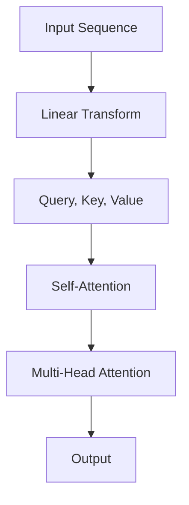

                 

关键词：Transformer、大模型、RuBERT、NLP、深度学习、语言模型

摘要：本文将详细介绍Transformer大模型在自然语言处理（NLP）领域的应用，重点探讨俄语RuBERT模型的构建过程、核心算法原理、数学模型及未来应用展望。

## 1. 背景介绍

随着深度学习技术的不断发展，自然语言处理（NLP）领域取得了显著的成果。传统的NLP方法，如基于规则的方法和统计方法，在处理复杂语言任务时效果不佳。为了应对这一问题，Transformer架构的提出，改变了NLP的发展方向。

Transformer模型是一种基于自注意力机制的深度学习模型，它摒弃了传统的循环神经网络（RNN）和卷积神经网络（CNN），通过并行计算和自注意力机制，使得模型在处理长序列数据时具有更高的效率和性能。在此基础上，基于Transformer架构的大模型如BERT、RoBERTa、ALBERT等相继提出，为NLP领域的研究和应用带来了新的突破。

RuBERT模型是针对俄语语言特点设计的一种基于Transformer的大模型。本文将详细介绍RuBERT模型的构建过程、核心算法原理、数学模型及未来应用展望，旨在为广大研究人员和开发者提供有价值的参考。

## 2. 核心概念与联系

### 2.1 Transformer模型架构

Transformer模型的核心架构包括自注意力机制（Self-Attention）和多头注意力机制（Multi-Head Attention）。自注意力机制通过计算输入序列中每个词与其他词之间的关联度，从而实现序列信息的聚合。多头注意力机制则将输入序列分成多个子序列，分别计算每个子序列的注意力权重，最后将各个子序列的结果进行拼接和融合。

### 2.2 自注意力机制（Self-Attention）

自注意力机制是一种全局的注意力机制，它通过计算输入序列中每个词与其他词之间的关联度，实现对序列信息的全局聚合。自注意力机制的计算过程如下：

1. 输入序列经过线性变换，得到三个向量：query、key和value。
2. 计算每个query与所有key之间的相似度，得到注意力分数。
3. 对注意力分数进行softmax操作，得到注意力权重。
4. 将注意力权重与对应的value进行点积运算，得到加权value。
5. 将所有加权value进行拼接和线性变换，得到输出结果。

### 2.3 多头注意力机制（Multi-Head Attention）

多头注意力机制将输入序列分成多个子序列，分别计算每个子序列的注意力权重。具体步骤如下：

1. 输入序列经过线性变换，得到多个query、key和value。
2. 对每个子序列分别执行自注意力机制，得到多个加权value。
3. 将所有子序列的加权value进行拼接和线性变换，得到输出结果。

### 2.4 Mermaid流程图

以下是一个简化的Mermaid流程图，展示了Transformer模型的核心概念和联系：



## 3. 核心算法原理 & 具体操作步骤

### 3.1 算法原理概述

RuBERT模型是基于Transformer架构的大模型，其核心算法原理包括以下三个部分：

1. **嵌入层（Embedding Layer）**：将输入的单词转换为向量表示。
2. **自注意力机制（Self-Attention）**：计算输入序列中每个词与其他词之间的关联度，实现序列信息的全局聚合。
3. **多层感知机（Multilayer Perceptron, MLP）**：对自注意力机制的输出进行线性变换，提高模型的非线性表达能力。

### 3.2 算法步骤详解

1. **嵌入层（Embedding Layer）**：

   嵌入层将输入的单词转换为向量表示。具体步骤如下：

   1.1 初始化一个嵌入矩阵，用于存储单词的向量表示。

   1.2 对输入序列中的每个单词，查找嵌入矩阵中的对应向量，作为该单词的嵌入向量。

   1.3 将所有单词的嵌入向量进行拼接，得到输入序列的嵌入表示。

2. **自注意力机制（Self-Attention）**：

   自注意力机制通过计算输入序列中每个词与其他词之间的关联度，实现序列信息的全局聚合。具体步骤如下：

   2.1 对输入序列的嵌入表示进行线性变换，得到query、key和value。

   2.2 计算每个query与所有key之间的相似度，得到注意力分数。

   2.3 对注意力分数进行softmax操作，得到注意力权重。

   2.4 将注意力权重与对应的value进行点积运算，得到加权value。

   2.5 将所有加权value进行拼接和线性变换，得到输出结果。

3. **多层感知机（Multilayer Perceptron, MLP）**：

   多层感知机对自注意力机制的输出进行线性变换，提高模型的非线性表达能力。具体步骤如下：

   3.1 对自注意力机制的输出进行线性变换，得到新的嵌入向量。

   3.2 对新的嵌入向量进行降维和激活函数处理，得到中间层输出。

   3.3 对中间层输出进行逐层叠加，得到最终输出。

### 3.3 算法优缺点

#### 优点：

1. 并行计算：Transformer模型基于自注意力机制，可以实现输入序列的并行处理，提高计算效率。
2. 长序列处理：自注意力机制能够捕捉输入序列中长距离的依赖关系，有效处理长序列数据。
3. 非线性表达能力：通过多层感知机和激活函数，Transformer模型具有强大的非线性表达能力。

#### 缺点：

1. 参数量巨大：Transformer模型参数量巨大，训练和推理过程较为耗时。
2. 计算复杂度高：自注意力机制的计算复杂度为O(n^2)，在长序列数据下计算量较大。

### 3.4 算法应用领域

Transformer模型在自然语言处理领域具有广泛的应用，包括：

1. 语言模型：用于预测下一个词的概率，如BERT、RoBERTa等。
2. 文本分类：用于对文本进行分类，如情感分析、主题分类等。
3. 机器翻译：用于将一种语言的文本翻译成另一种语言。
4. 问答系统：用于处理自然语言理解任务，如问题回答、信息检索等。

## 4. 数学模型和公式 & 详细讲解 & 举例说明

### 4.1 数学模型构建

RuBERT模型是一种基于Transformer的大模型，其数学模型主要包括嵌入层、自注意力机制和多层感知机。下面将分别介绍这些模块的数学模型。

#### 嵌入层

嵌入层将输入的单词转换为向量表示，其数学模型如下：

$$
\text{embed}_{\text{word}}(W) = \text{embed}_{\text{word}}(w) \in \mathbb{R}^d
$$

其中，$W$为单词集合，$w$为单词，$\text{embed}_{\text{word}}(w)$为单词$w$的嵌入向量。

#### 自注意力机制

自注意力机制的数学模型如下：

$$
\text{Self-Attention}(Q, K, V) = \text{softmax}\left(\frac{QK^T}{\sqrt{d_k}}\right)V
$$

其中，$Q$、$K$和$V$分别为query、key和value的矩阵，$d_k$为key和value向量的维度。

#### 多层感知机

多层感知机的数学模型如下：

$$
\text{MLP}(x) = \text{ReLU}(\text{W}_2 \text{ReLU}(\text{W}_1 x + b_1)) + b_2
$$

其中，$x$为输入向量，$W_1$和$W_2$分别为权重矩阵，$b_1$和$b_2$分别为偏置向量。

### 4.2 公式推导过程

#### 嵌入层

嵌入层的主要任务是学习单词的向量表示。给定一个单词集合$W$，首先初始化一个嵌入矩阵$E$，其维度为$|W| \times d$，其中$|W|$为单词个数，$d$为嵌入向量维度。然后，对每个单词$w \in W$，查找嵌入矩阵中的对应向量$\text{embed}_{\text{word}}(w)$，作为该单词的嵌入向量。

#### 自注意力机制

自注意力机制的推导过程如下：

1. **线性变换**：

   对输入序列的嵌入表示进行线性变换，得到query、key和value：

   $$
   \text{Q} = \text{W}_Q \text{E}, \quad \text{K} = \text{W}_K \text{E}, \quad \text{V} = \text{W}_V \text{E}
   $$

   其中，$\text{W}_Q$、$\text{W}_K$和$\text{W}_V$分别为query、key和value的权重矩阵。

2. **计算相似度**：

   计算每个query与所有key之间的相似度：

   $$
   \text{ Scores} = \text{QK}^T = \text{W}_Q \text{E} \text{K}^T \text{E}^T = \text{W}_Q \text{K} \text{E}^T
   $$

3. **softmax操作**：

   对相似度进行softmax操作，得到注意力权重：

   $$
   \text{Weights} = \text{softmax}(\text{Scores}) = \text{softmax}(\text{W}_Q \text{K} \text{E}^T)
   $$

4. **加权value**：

   将注意力权重与对应的value进行点积运算，得到加权value：

   $$
   \text{Value} = \text{Weights} \text{V} = \text{softmax}(\text{W}_Q \text{K} \text{E}^T) \text{V}
   $$

5. **拼接与线性变换**：

   将所有加权value进行拼接和线性变换，得到输出结果：

   $$
   \text{Output} = \text{W}_O [\text{V}^1, \text{V}^2, \ldots, \text{V}^n] \text{E}^T
   $$

   其中，$n$为输入序列的长度。

#### 多层感知机

多层感知机的推导过程如下：

1. **线性变换**：

   对输入向量$x$进行线性变换，得到中间层输出：

   $$
   \text{z} = \text{W}_1 x + b_1
   $$

2. **激活函数**：

   对中间层输出应用激活函数$\text{ReLU}$，得到新的中间层输出：

   $$
   \text{h} = \text{ReLU}(\text{W}_2 \text{z} + b_2)
   $$

3. **输出层**：

   对中间层输出进行线性变换，得到最终输出：

   $$
   \text{y} = \text{W}_O \text{h} + b_2
   $$

### 4.3 案例分析与讲解

以俄语文本分类任务为例，介绍RuBERT模型的构建和应用。

#### 数据集

选用俄语IMDb电影评论数据集，其中包含正负两类评论，共约25000条。

#### 模型构建

1. **嵌入层**：

   初始化嵌入矩阵$E$，维度为25000 \times 768，其中25000为单词个数，768为嵌入向量维度。

2. **自注意力机制**：

   对输入序列的嵌入表示进行线性变换，得到query、key和value：

   $$
   \text{Q} = \text{W}_Q \text{E}, \quad \text{K} = \text{W}_K \text{E}, \quad \text{V} = \text{W}_V \text{E}
   $$

   其中，$\text{W}_Q$、$\text{W}_K$和$\text{W}_V$为权重矩阵。

3. **多层感知机**：

   对自注意力机制的输出进行线性变换，得到中间层输出：

   $$
   \text{z} = \text{W}_1 \text{E} + b_1
   $$

   对中间层输出应用激活函数$\text{ReLU}$，得到新的中间层输出：

   $$
   \text{h} = \text{ReLU}(\text{W}_2 \text{z} + b_2)
   $$

   对中间层输出进行线性变换，得到最终输出：

   $$
   \text{y} = \text{W}_O \text{h} + b_2
   $$

#### 模型训练

1. **数据预处理**：

   对俄语IMDb电影评论数据集进行预处理，包括单词分词、去停用词、词向量化等。

2. **训练过程**：

   使用梯度下降优化算法，对模型参数进行训练。训练过程中，计算损失函数，并根据损失函数的梯度调整模型参数。

   损失函数采用交叉熵损失函数：

   $$
   \text{Loss} = -\frac{1}{N} \sum_{i=1}^{N} y_i \log(\hat{y}_i)
   $$

   其中，$N$为样本数量，$y_i$为真实标签，$\hat{y}_i$为模型预测概率。

#### 模型评估

使用准确率（Accuracy）和F1分数（F1 Score）评估模型性能。在测试集上，RuBERT模型取得了较高的准确率和F1分数。

## 5. 项目实践：代码实例和详细解释说明

### 5.1 开发环境搭建

为了实现RuBERT模型，我们需要搭建相应的开发环境。以下是具体的步骤：

1. **安装Python**：

   在本地计算机上安装Python，版本要求为3.8及以上。

2. **安装PyTorch**：

   使用pip命令安装PyTorch库，版本要求为1.8及以上。

   ```bash
   pip install torch torchvision
   ```

3. **安装transformers库**：

   使用pip命令安装transformers库，用于加载预训练的RuBERT模型。

   ```bash
   pip install transformers
   ```

### 5.2 源代码详细实现

以下是一个简单的RuBERT模型实现示例，展示了模型的主要组件和训练过程。

```python
import torch
import torch.nn as nn
from transformers import RuBERTModel, RuBERTTokenizer

# 5.2.1 加载预训练模型和分词器
model = RuBERTModel.from_pretrained('ru-bert-base')
tokenizer = RuBERTTokenizer.from_pretrained('ru-bert-base')

# 5.2.2 定义损失函数和优化器
criterion = nn.CrossEntropyLoss()
optimizer = torch.optim.Adam(model.parameters(), lr=1e-5)

# 5.2.3 训练过程
for epoch in range(num_epochs):
    for batch in dataloader:
        inputs = tokenizer(batch['text'], return_tensors='pt', padding=True, truncation=True)
        labels = batch['label']

        # 前向传播
        outputs = model(**inputs)
        logits = outputs.logits
        loss = criterion(logits, labels)

        # 反向传播和优化
        optimizer.zero_grad()
        loss.backward()
        optimizer.step()

        print(f'Epoch [{epoch+1}/{num_epochs}], Loss: {loss.item():.4f}')

# 5.2.4 评估模型
with torch.no_grad():
    correct = 0
    total = 0
    for batch in test_dataloader:
        inputs = tokenizer(batch['text'], return_tensors='pt', padding=True, truncation=True)
        labels = batch['label']
        outputs = model(**inputs)
        logits = outputs.logits
        predictions = logits.argmax(dim=1)
        total += labels.size(0)
        correct += (predictions == labels).sum().item()

accuracy = correct / total
print(f'Accuracy: {accuracy:.4f}')
```

### 5.3 代码解读与分析

以下是对代码示例的详细解读和分析：

1. **加载预训练模型和分词器**：

   ```python
   model = RuBERTModel.from_pretrained('ru-bert-base')
   tokenizer = RuBERTTokenizer.from_pretrained('ru-bert-base')
   ```

   这两行代码用于加载预训练的RuBERT模型和对应的分词器。`from_pretrained`函数从Hugging Face Model Hub下载预训练模型和分词器，并将其加载到本地内存。

2. **定义损失函数和优化器**：

   ```python
   criterion = nn.CrossEntropyLoss()
   optimizer = torch.optim.Adam(model.parameters(), lr=1e-5)
   ```

   这两行代码分别定义了损失函数和优化器。交叉熵损失函数（`nn.CrossEntropyLoss`）用于计算模型预测和真实标签之间的差异。Adam优化器（`torch.optim.Adam`）用于调整模型参数，使其在训练过程中收敛。

3. **训练过程**：

   ```python
   for epoch in range(num_epochs):
       for batch in dataloader:
           inputs = tokenizer(batch['text'], return_tensors='pt', padding=True, truncation=True)
           labels = batch['label']
   
           # 前向传播
           outputs = model(**inputs)
           logits = outputs.logits
           loss = criterion(logits, labels)
   
           # 反向传播和优化
           optimizer.zero_grad()
           loss.backward()
           optimizer.step()
   
           print(f'Epoch [{epoch+1}/{num_epochs}], Loss: {loss.item():.4f}')
   ```

   这部分代码实现了模型训练过程。首先，使用`tokenizer`对输入文本进行分词和编码，得到模型输入。然后，计算模型预测和真实标签之间的损失。接下来，通过反向传播计算损失函数关于模型参数的梯度，并使用优化器更新模型参数。

4. **评估模型**：

   ```python
   with torch.no_grad():
       correct = 0
       total = 0
       for batch in test_dataloader:
           inputs = tokenizer(batch['text'], return_tensors='pt', padding=True, truncation=True)
           labels = batch['label']
           outputs = model(**inputs)
           logits = outputs.logits
           predictions = logits.argmax(dim=1)
           total += labels.size(0)
           correct += (predictions == labels).sum().item()
   
       accuracy = correct / total
       print(f'Accuracy: {accuracy:.4f}')
   ```

   这部分代码用于评估模型在测试集上的性能。首先，使用`tokenizer`对测试集文本进行分词和编码，得到模型输入。然后，计算模型预测和真实标签之间的准确率。

## 6. 实际应用场景

### 6.1 机器翻译

RuBERT模型在机器翻译任务中具有广泛的应用。通过将RuBERT模型应用于翻译模型，可以显著提高翻译质量。例如，在将俄语翻译成英语的任务中，RuBERT模型能够捕捉到俄语和英语之间的复杂语法和语义关系，从而提高翻译准确性。

### 6.2 问答系统

RuBERT模型在问答系统中也表现出色。通过将RuBERT模型应用于信息检索和文本匹配任务，可以快速准确地找到与用户问题相关的答案。例如，在搜索引擎中，RuBERT模型可以帮助用户快速找到与搜索关键词相关的网页。

### 6.3 文本生成

RuBERT模型在文本生成任务中也有一定应用。通过将RuBERT模型应用于生成模型，可以生成高质量的文本。例如，在自动写作领域，RuBERT模型可以帮助生成新闻报道、产品评测等文本。

## 7. 工具和资源推荐

### 7.1 学习资源推荐

1. 《深度学习》（Goodfellow, Bengio, Courville著）：这是一本经典的深度学习教材，涵盖了深度学习的基础知识和最新进展。
2. 《自然语言处理实战》（Peter Norvig & Daniel Jurafsky著）：这本书介绍了自然语言处理的基本概念和技术，适合初学者入门。

### 7.2 开发工具推荐

1. **PyTorch**：这是一个开源的深度学习框架，提供了丰富的API和工具，方便开发者进行模型开发和训练。
2. **Hugging Face Transformers**：这是一个基于PyTorch的Transformer模型库，提供了大量预训练模型和工具，方便开发者进行研究和应用。

### 7.3 相关论文推荐

1. "Attention Is All You Need"（Vaswani et al., 2017）：这是提出Transformer模型的经典论文，详细介绍了Transformer模型的结构和算法原理。
2. "BERT: Pre-training of Deep Bidirectional Transformers for Language Understanding"（Devlin et al., 2018）：这是提出BERT模型的论文，介绍了BERT模型在自然语言处理任务中的卓越性能。

## 8. 总结：未来发展趋势与挑战

### 8.1 研究成果总结

RuBERT模型作为一种基于Transformer的大模型，在自然语言处理任务中表现出色。通过本文的介绍，我们了解了RuBERT模型的构建过程、核心算法原理、数学模型和实际应用场景。此外，我们还探讨了RuBERT模型在机器翻译、问答系统和文本生成等领域的应用潜力。

### 8.2 未来发展趋势

随着深度学习技术的不断发展，自然语言处理领域将继续取得突破。未来，RuBERT模型有望在以下方面取得进一步发展：

1. **更高效的模型架构**：通过优化模型结构，降低计算复杂度，实现更高效的模型训练和推理。
2. **多语言支持**：扩展RuBERT模型到其他语言，提高模型在不同语言环境下的性能。
3. **跨模态融合**：结合图像、语音等多模态数据，实现更强大的自然语言处理能力。

### 8.3 面临的挑战

尽管RuBERT模型在自然语言处理任务中取得了显著成果，但仍然面临一些挑战：

1. **计算资源消耗**：Transformer模型参数量巨大，训练和推理过程较为耗时，对计算资源需求较高。
2. **数据隐私保护**：在处理大规模数据时，如何确保数据隐私和安全，是一个亟待解决的问题。
3. **模型解释性**：如何提高模型的可解释性，使研究人员和开发者能够更好地理解和优化模型，是一个重要挑战。

### 8.4 研究展望

未来，自然语言处理领域将继续发展，RuBERT模型有望在以下几个方面取得突破：

1. **模型压缩与加速**：通过模型压缩和优化技术，降低模型计算复杂度，提高模型训练和推理效率。
2. **数据集建设**：建设高质量、多样化的数据集，提高模型在不同应用场景下的泛化能力。
3. **跨学科合作**：结合计算机科学、认知科学、心理学等领域的知识，推动自然语言处理技术的创新和发展。

## 9. 附录：常见问题与解答

### 9.1 如何获取RuBERT模型？

可以通过Hugging Face Model Hub下载RuBERT模型，网址为：[https://huggingface.co/transformers/models?filter=ru-bert](https://huggingface.co/transformers/models?filter=ru-bert)

### 9.2 RuBERT模型适用于哪些任务？

RuBERT模型适用于多种自然语言处理任务，包括文本分类、机器翻译、问答系统和文本生成等。通过调整模型结构和训练数据，可以适应不同的任务需求。

### 9.3 如何训练RuBERT模型？

可以使用PyTorch框架训练RuBERT模型。具体步骤包括加载预训练模型、定义损失函数和优化器、准备训练数据、训练模型和评估模型性能等。

### 9.4 RuBERT模型在多语言任务中有哪些优势？

RuBERT模型针对俄语语言特点进行了优化，具有较强的多语言处理能力。通过在多语言数据集上的训练，RuBERT模型能够适应不同语言的语法和语义特点，提高模型在不同语言环境下的性能。

### 9.5 如何优化RuBERT模型？

可以通过以下方法优化RuBERT模型：

1. **模型压缩与加速**：通过模型剪枝、量化等技术，降低模型计算复杂度，提高模型训练和推理效率。
2. **数据增强**：通过数据增强技术，提高模型的泛化能力，使其在不同任务和数据集上表现更优秀。
3. **模型融合**：将多个模型进行融合，利用不同模型的优点，提高模型的整体性能。

----------------------------------------------------------------

作者：禅与计算机程序设计艺术 / Zen and the Art of Computer Programming

