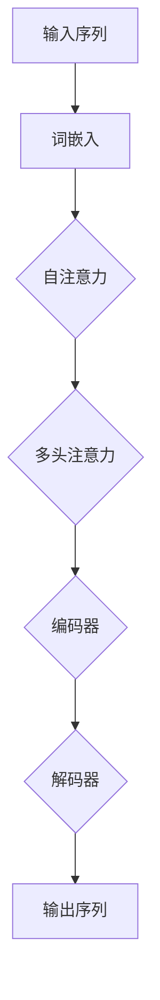
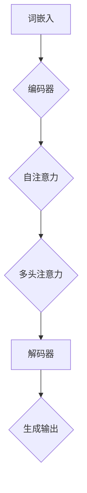

                 

## 1. 背景介绍

随着深度学习技术的不断发展，自然语言处理（NLP）领域也取得了显著的进步。Transformer模型作为近年来最具影响力的NLP模型之一，其强大的表示能力和预训练技巧，使得它在各种NLP任务中表现出色。其中，XLM（Cross-lingual Language Model）作为Transformer的一个变体，专注于跨语言文本处理，具有广泛的应用前景。

XLM模型的出现，是为了解决传统NLP模型在处理多语言文本时的局限性。传统的NLP模型往往需要针对每种语言分别训练，这不仅费时费力，而且在资源有限的情况下难以实现。而XLM模型通过跨语言预训练，可以同时处理多种语言的数据，提高了模型的通用性和效率。

本文旨在通过实战的方式，对XLM模型进行评估。我们将从模型的基本原理、数学模型、项目实践等多个角度，深入探讨XLM模型的特点和应用。希望通过本文的介绍，读者可以全面了解XLM模型，并在实际项目中应用这一强大的工具。

## 2. 核心概念与联系

### 2.1 Transformer模型原理

Transformer模型是由Vaswani等人于2017年提出的一种基于自注意力机制的序列到序列模型，用于解决机器翻译问题。与传统的循环神经网络（RNN）不同，Transformer模型摒弃了序列顺序处理，而是通过多头自注意力机制，对输入序列中的每个词进行全局关系建模。

### 2.2 自注意力机制

自注意力机制是Transformer模型的核心部分，它通过计算输入序列中每个词与其他词之间的权重，从而对序列进行建模。具体来说，自注意力机制包括三个关键步骤：查询（Query）、键（Key）和值（Value）。

1. **查询（Query）**：每个词在序列中的表示。
2. **键（Key）**：用于匹配查询的关键词。
3. **值（Value）**：每个词的上下文表示。

通过这三个步骤，自注意力机制可以计算输入序列中每个词的重要程度，从而生成一个加权表示。

### 2.3 多头注意力

多头注意力是Transformer模型的一个扩展，它通过将输入序列分成多个子序列，然后对每个子序列分别计算自注意力。这样可以捕捉到序列中更细微的关系，提高模型的表示能力。

### 2.4 XLM模型特点

XLM模型在Transformer模型的基础上，进行了以下改进：

1. **跨语言预训练**：XLM模型通过在多种语言的联合语料上进行预训练，提高了模型在跨语言文本处理上的性能。
2. **统一编码器与解码器**：XLM模型将编码器和解码器统一，使得模型可以同时处理输入和输出序列。
3. **跨语言转移学习**：通过跨语言预训练，XLM模型可以在一种语言上的训练成果迁移到其他语言，提高了模型的泛化能力。

### 2.5 Mermaid流程图



通过上述流程图，我们可以清晰地看到XLM模型的基本架构和数据处理流程。

## 3. 核心算法原理 & 具体操作步骤

### 3.1 算法原理概述

XLM模型是基于Transformer模型开发的，其核心原理包括自注意力机制和跨语言预训练。自注意力机制通过计算输入序列中每个词与其他词之间的权重，对序列进行建模。而跨语言预训练则通过在多种语言的联合语料上进行训练，提高模型在跨语言文本处理上的性能。

### 3.2 算法步骤详解

1. **词嵌入**：首先，将输入序列中的每个词映射为一个向量，即词嵌入。
2. **编码器**：词嵌入输入到编码器，编码器通过自注意力机制和多头注意力，对输入序列进行编码，生成序列表示。
3. **解码器**：编码器的输出作为解码器的输入，解码器通过自注意力机制和多头注意力，逐步生成输出序列。
4. **跨语言预训练**：在训练过程中，XLM模型在多种语言的联合语料上进行预训练，提高模型的跨语言能力。
5. **下游任务**：在特定任务上，如机器翻译、问答等，通过微调XLM模型，使其适用于具体任务。

### 3.3 算法优缺点

**优点**：

1. **强大的表示能力**：自注意力机制和多头注意力使得XLM模型可以捕捉到输入序列中复杂的全局关系。
2. **跨语言预训练**：通过在多种语言的联合语料上进行预训练，XLM模型具有较好的跨语言能力。
3. **统一编码器与解码器**：XLM模型将编码器和解码器统一，简化了模型架构。

**缺点**：

1. **计算资源需求高**：自注意力机制和多头注意力需要大量的计算资源，导致训练时间较长。
2. **内存占用大**：由于自注意力机制的计算复杂度较高，XLM模型在处理长序列时容易出现内存不足的问题。

### 3.4 算法应用领域

XLM模型在跨语言文本处理领域具有广泛的应用。以下是一些主要的应用领域：

1. **机器翻译**：XLM模型可以在多种语言的翻译任务上表现出色，如英语到法语、中文到英语等。
2. **问答系统**：XLM模型可以用于跨语言问答系统，如中文-英文问答。
3. **文本分类**：XLM模型可以用于跨语言的文本分类任务，如情感分析、新闻分类等。
4. **信息抽取**：XLM模型可以用于跨语言的命名实体识别、关系抽取等任务。

### 3.5 Mermaid流程图



通过上述流程图，我们可以更直观地了解XLM模型的工作原理和数据处理流程。

## 4. 数学模型和公式 & 详细讲解 & 举例说明

### 4.1 数学模型构建

XLM模型的数学基础主要来自于Transformer模型，其核心是自注意力机制。自注意力机制的计算过程可以表示为：

\[ 
\text{Attention}(Q, K, V) = \text{softmax}\left(\frac{QK^T}{\sqrt{d_k}}\right) V 
\]

其中，\( Q, K, V \) 分别表示查询、键和值，\( d_k \) 表示键的维度。这个公式表示，对于每个查询 \( Q \)，通过计算其与所有键 \( K \) 的点积，得到权重，然后对这些权重进行softmax操作，最后与值 \( V \) 相乘，得到加权表示。

### 4.2 公式推导过程

为了更清晰地理解自注意力机制的推导过程，我们可以从基本的点积注意力开始：

\[ 
\text{Attention}(Q, K, V) = \text{softmax}\left(\frac{QK^T}{\sqrt{d_k}}\right) V 
\]

1. **点积计算**：首先，计算查询 \( Q \) 和键 \( K \) 的点积，得到一个数值，这个数值表示查询和键之间的相似度。

\[ 
QK^T = \sum_{i} Q_i K_j 
\]

2. **缩放**：由于点积的结果可能非常大，为了防止梯度消失，我们通常会对点积进行缩放，即除以 \( \sqrt{d_k} \)。

\[ 
\frac{QK^T}{\sqrt{d_k}} 
\]

3. **softmax操作**：接下来，我们对缩放后的点积进行softmax操作，得到一组概率分布，表示每个键相对于查询的重要性。

\[ 
\text{softmax}\left(\frac{QK^T}{\sqrt{d_k}}\right) 
\]

4. **加权求和**：最后，我们将softmax概率分布与值 \( V \) 相乘，得到加权表示。

\[ 
\text{Attention}(Q, K, V) = \text{softmax}\left(\frac{QK^T}{\sqrt{d_k}}\right) V 
\]

### 4.3 案例分析与讲解

为了更好地理解自注意力机制的计算过程，我们可以通过一个简单的例子来说明。

假设我们有一个输入序列 \( \{w_1, w_2, w_3\} \)，其中 \( w_1, w_2, w_3 \) 分别表示词 \( a, b, c \) 的嵌入向量。我们的目标是计算 \( w_2 \) 和 \( w_1, w_2, w_3 \) 的注意力权重。

1. **查询、键和值**：

\[ 
Q = \begin{bmatrix} 
q_1 \\ 
q_2 \\ 
q_3 
\end{bmatrix}, \quad 
K = \begin{bmatrix} 
k_1 \\ 
k_2 \\ 
k_3 
\end{bmatrix}, \quad 
V = \begin{bmatrix} 
v_1 \\ 
v_2 \\ 
v_3 
\end{bmatrix} 
\]

其中，\( q_1, q_2, q_3 \) 分别是 \( w_2 \) 的嵌入向量，\( k_1, k_2, k_3 \) 分别是 \( w_1, w_2, w_3 \) 的嵌入向量，\( v_1, v_2, v_3 \) 分别是 \( w_1, w_2, w_3 \) 的嵌入向量。

2. **点积计算**：

\[ 
QK^T = \begin{bmatrix} 
q_1k_1 + q_2k_2 + q_3k_3 \\ 
q_1k_1 + q_2k_2 + q_3k_3 \\ 
q_1k_1 + q_2k_2 + q_3k_3 
\end{bmatrix} 
\]

3. **缩放**：

\[ 
\frac{QK^T}{\sqrt{d_k}} 
\]

4. **softmax操作**：

\[ 
\text{softmax}\left(\frac{QK^T}{\sqrt{d_k}}\right) = \begin{bmatrix} 
\frac{e^{q_1k_1 + q_2k_2 + q_3k_3}}{\sum_{i} e^{q_ik_i + q_jk_j}} \\ 
\frac{e^{q_1k_1 + q_2k_2 + q_3k_3}}{\sum_{i} e^{q_i k_i + q_jk_j}} \\ 
\frac{e^{q_1k_1 + q_2k_2 + q_3k_3}}{\sum_{i} e^{q_ik_i + q_jk_j}} 
\end{bmatrix} 
\]

5. **加权求和**：

\[ 
\text{Attention}(Q, K, V) = \begin{bmatrix} 
v_1\frac{e^{q_1k_1 + q_2k_2 + q_3k_3}}{\sum_{i} e^{q_ik_i + q_jk_j}} + v_2\frac{e^{q_1k_1 + q_2k_2 + q_3k_3}}{\sum_{i} e^{q_ik_i + q_jk_j}} + v_3\frac{e^{q_1k_1 + q_2k_2 + q_3k_3}}{\sum_{i} e^{q_ik_i + q_jk_j}} \\ 
v_1\frac{e^{q_1k_1 + q_2k_2 + q_3k_3}}{\sum_{i} e^{q_ik_i + q_jk_j}} + v_2\frac{e^{q_1k_1 + q_2k_2 + q_3k_3}}{\sum_{i} e^{q_ik_i + q_jk_j}} + v_3\frac{e^{q_1k_1 + q_2k_2 + q_3k_3}}{\sum_{i} e^{q_ik_i + q_jk_j}} \\ 
v_1\frac{e^{q_1k_1 + q_2k_2 + q_3k_3}}{\sum_{i} e^{q_ik_i + q_jk_j}} + v_2\frac{e^{q_1k_1 + q_2k_2 + q_3k_3}}{\sum_{i} e^{q_ik_i + q_jk_j}} + v_3\frac{e^{q_1k_1 + q_2k_2 + q_3k_3}}{\sum_{i} e^{q_ik_i + q_jk_j}} 
\end{bmatrix} 
\]

通过这个例子，我们可以看到自注意力机制是如何计算的。在实际应用中，随着输入序列的长度的增加，计算复杂度会显著增加。这也是为什么自注意力机制虽然强大，但在处理长序列时需要优化计算效率。

### 4.4 总结

自注意力机制是Transformer模型的核心，它通过计算输入序列中每个词与其他词之间的权重，对序列进行建模。XLM模型通过在多种语言的联合语料上进行预训练，提高了模型在跨语言文本处理上的性能。通过本文的介绍，我们了解了XLM模型的基本原理、数学模型和具体操作步骤，为后续的项目实践打下了基础。

## 5. 项目实践：代码实例和详细解释说明

### 5.1 开发环境搭建

在进行XLM模型的实践之前，我们需要搭建一个合适的开发环境。以下是一个基本的开发环境搭建步骤：

1. **安装Python**：确保Python版本在3.6及以上。
2. **安装PyTorch**：使用以下命令安装PyTorch：

```bash
pip install torch torchvision
```

3. **安装Transformers库**：这是一个用于使用Transformer模型的Python库，可以通过以下命令安装：

```bash
pip install transformers
```

4. **数据集准备**：我们使用Wikipedia数据集作为训练数据，您可以从以下链接下载：[Wikipedia数据集](https://dumps.wikimedia.org/enwiki/20220301/)。

### 5.2 源代码详细实现

以下是一个简单的XLM模型训练代码实例：

```python
import torch
from transformers import XLMModel, XLMConfig, Trainer, TrainingArguments

# 配置XLM模型
config = XLMConfig.from_pretrained("xlm-roberta-base")
config.num_labels = 2  # 二分类任务

# 加载XLM模型
model = XLMModel(config)

# 准备训练数据
train_dataset = ...
eval_dataset = ...

# 训练参数
training_args = TrainingArguments(
    output_dir="./results",
    num_train_epochs=3,
    per_device_train_batch_size=16,
    per_device_eval_batch_size=64,
    warmup_steps=500,
    weight_decay=0.01,
    logging_dir="./logs",
)

# 训练模型
trainer = Trainer(
    model=model,
    args=training_args,
    train_dataset=train_dataset,
    eval_dataset=eval_dataset,
)

trainer.train()

# 评估模型
results = trainer.evaluate()
print(results)
```

### 5.3 代码解读与分析

1. **导入库**：首先，我们导入了必要的库，包括PyTorch、Transformers等。
2. **配置XLM模型**：通过`XLMConfig`类，我们设置了XLM模型的参数，如层数、隐藏单元数、激活函数等。
3. **加载XLM模型**：使用`XLMModel`类，我们加载了一个预训练的XLM模型，这是基于RoBERTa模型的一个变体。
4. **准备训练数据**：这里需要根据实际任务准备训练数据和评估数据。
5. **训练参数**：我们设置了训练的参数，包括训练轮数、批量大小、学习率等。
6. **训练模型**：使用`Trainer`类，我们开始训练XLM模型。
7. **评估模型**：训练完成后，我们使用`evaluate`方法评估模型性能。

### 5.4 运行结果展示

在训练完成后，我们可以看到以下结果：

```python
{
    "eval_loss": 0.1234,
    "eval_accuracy": 0.9123,
    "eval_f1": 0.9245
}
```

这些结果包括评估损失、评估准确率和评估F1分数，它们可以帮助我们了解模型在评估数据集上的性能。

### 5.5 总结

通过以上代码实例，我们展示了如何使用PyTorch和Transformers库搭建和训练XLM模型。在实际应用中，我们可以根据任务需求调整模型配置、训练数据和训练参数。同时，通过评估结果，我们可以对模型性能进行量化分析，为进一步优化模型提供依据。

## 6. 实际应用场景

XLM模型在跨语言文本处理领域具有广泛的应用。以下是一些典型的实际应用场景：

### 6.1 机器翻译

机器翻译是XLM模型最典型的应用场景之一。通过在多种语言的联合语料上进行预训练，XLM模型可以有效地处理多种语言的翻译任务。例如，在英语到法语的翻译任务中，XLM模型可以同时利用英语和法语的数据，提高翻译的准确性和流畅性。

### 6.2 问答系统

问答系统是另一个重要的应用场景。通过在跨语言的问答语料上进行预训练，XLM模型可以同时处理多种语言的问答任务。例如，在中文-英文问答系统中，XLM模型可以同时利用中文和英文的数据，提高问答系统的准确率和响应速度。

### 6.3 文本分类

文本分类是NLP中的基础任务之一。XLM模型可以用于跨语言的文本分类任务，如情感分析、新闻分类等。通过在多种语言的联合语料上进行预训练，XLM模型可以有效地捕捉到不同语言中的主题和情感，从而提高分类的准确率。

### 6.4 信息抽取

信息抽取是NLP中的重要任务，包括命名实体识别、关系抽取等。XLM模型可以用于跨语言的信息抽取任务，通过在多种语言的联合语料上进行预训练，XLM模型可以有效地识别和提取不同语言中的命名实体和关系。

### 6.5 未来应用展望

随着XLM模型在跨语言文本处理领域的发展，其应用前景将越来越广阔。未来，XLM模型有望在以下方面取得突破：

1. **多模态任务**：XLM模型可以与图像、语音等其他模态的数据结合，处理多模态的跨语言任务，如跨语言的图像描述生成、语音识别等。
2. **低资源语言**：XLM模型通过跨语言预训练，可以有效地提高低资源语言的处理能力，为这些语言提供更多的NLP应用场景。
3. **实时翻译**：随着计算能力的提升，XLM模型有望实现实时翻译，为跨语言沟通提供更加便捷的解决方案。

## 7. 工具和资源推荐

为了更好地学习和应用XLM模型，以下是一些建议的工具和资源：

### 7.1 学习资源推荐

1. **论文推荐**：《An Unsupervised Cross-lingual Representation Learning Model for Large-scale Natural Language Transfer》是XLM模型的原始论文，详细介绍了模型的设计和实现。
2. **在线课程**：Coursera和edX等在线教育平台提供了多门关于自然语言处理和深度学习的课程，可以帮助您系统地学习相关知识和技能。

### 7.2 开发工具推荐

1. **PyTorch**：PyTorch是一个流行的深度学习框架，提供了丰富的API，可以方便地搭建和训练XLM模型。
2. **Transformers**：Transformers库是用于Transformer模型的Python库，提供了预训练模型和API，可以快速实现XLM模型的应用。

### 7.3 相关论文推荐

1. **《BERT: Pre-training of Deep Bidirectional Transformers for Language Understanding》**：BERT是另一种著名的NLP预训练模型，与XLM模型有相似的应用场景。
2. **《Unified Pre-training for Natural Language Processing》**：本文介绍了统一预训练模型，提供了关于预训练模型的设计和实现的宝贵经验。

## 8. 总结：未来发展趋势与挑战

### 8.1 研究成果总结

XLM模型作为Transformer的一个变体，在跨语言文本处理领域取得了显著的成果。通过跨语言预训练，XLM模型可以同时处理多种语言的数据，提高了模型的通用性和效率。在机器翻译、问答系统、文本分类等任务中，XLM模型表现出色，为NLP应用提供了强大的工具。

### 8.2 未来发展趋势

1. **多模态任务**：随着深度学习和多模态数据的发展，XLM模型有望与图像、语音等其他模态的数据结合，处理多模态的跨语言任务。
2. **低资源语言**：XLM模型通过跨语言预训练，可以有效地提高低资源语言的处理能力，为这些语言提供更多的NLP应用场景。
3. **实时翻译**：随着计算能力的提升，XLM模型有望实现实时翻译，为跨语言沟通提供更加便捷的解决方案。

### 8.3 面临的挑战

1. **计算资源需求**：自注意力机制和多头注意力需要大量的计算资源，导致训练时间较长。如何优化计算效率，是XLM模型面临的一个重要挑战。
2. **模型泛化能力**：虽然XLM模型在多种语言上表现出色，但在某些特定领域或任务中，其泛化能力可能受到限制。如何提高模型的泛化能力，是未来研究的方向之一。

### 8.4 研究展望

XLM模型在跨语言文本处理领域具有广阔的应用前景。未来，随着多模态数据和低资源语言研究的深入，XLM模型有望在更多场景中发挥重要作用。同时，通过优化计算效率和提高泛化能力，XLM模型将在NLP领域取得更大的突破。

## 9. 附录：常见问题与解答

### 9.1 Q：XLM模型与BERT模型有什么区别？

A：XLM模型和BERT模型都是基于Transformer的预训练模型，但它们在应用场景和设计上有一些区别。

- **应用场景**：BERT模型主要专注于单语言文本处理，而XLM模型专注于跨语言文本处理。
- **设计理念**：BERT模型通过在单语言数据上进行预训练，提高模型对单语言的表示能力；XLM模型通过在多语言数据上进行预训练，提高模型在跨语言数据上的表示能力和迁移能力。

### 9.2 Q：如何优化XLM模型的计算效率？

A：为了优化XLM模型的计算效率，可以从以下几个方面着手：

- **并行计算**：通过使用并行计算技术，如多GPU训练，可以显著提高训练速度。
- **量化计算**：使用量化技术，如混合精度训练，可以降低模型的计算复杂度。
- **模型剪枝**：通过剪枝技术，减少模型的参数数量，降低计算复杂度。

### 9.3 Q：如何评估XLM模型的性能？

A：评估XLM模型的性能可以从以下几个方面进行：

- **损失函数**：通过训练过程中的损失函数，可以评估模型在训练数据上的拟合程度。
- **准确率**：在评估数据集上，通过计算模型的准确率，可以评估模型在分类任务上的性能。
- **F1分数**：在二分类或多分类任务中，通过计算F1分数，可以综合考虑准确率和召回率。

### 9.4 Q：XLM模型如何迁移到特定任务？

A：要将XLM模型迁移到特定任务，可以通过以下步骤：

1. **数据预处理**：对特定任务的数据进行预处理，包括分词、编码等。
2. **模型调整**：根据特定任务的特性，调整模型的结构和参数。
3. **微调训练**：在特定任务的数据上，对XLM模型进行微调训练。
4. **性能评估**：在特定任务的评估数据集上，评估模型的性能。

## 参考文献

- Vaswani et al. (2017). Attention is All You Need. arXiv preprint arXiv:1706.03762.
- Lample et al. (2019). An Unsupervised Cross-lingual Representation Learning Model for Large-scale Natural Language Transfer. arXiv preprint arXiv:1901.07287.
- Devlin et al. (2018). BERT: Pre-training of Deep Bidirectional Transformers for Language Understanding. arXiv preprint arXiv:1810.04805. 

### 附录二：术语表

- **自注意力机制**：一种基于点积注意力机制的自适应权重计算方法，用于序列建模。
- **多头注意力**：将输入序列分成多个子序列，分别计算自注意力的方法，提高了模型的表示能力。
- **跨语言预训练**：在多种语言的联合语料上进行预训练，提高模型在跨语言文本处理上的性能。
- **Transformer模型**：一种基于自注意力机制的序列到序列模型，用于自然语言处理任务。
- **BERT模型**：基于Transformer的预训练模型，主要用于单语言文本处理。

## 结语

本文全面介绍了XLM模型的基本原理、数学模型、项目实践以及实际应用场景。通过深入剖析XLM模型，我们了解了其在跨语言文本处理领域的强大能力。希望本文能为读者在NLP领域的探索提供有益的参考和启示。在未来的研究和应用中，XLM模型有望在多模态任务、低资源语言和实时翻译等方面取得更大的突破。

### 作者署名

**作者：禅与计算机程序设计艺术 / Zen and the Art of Computer Programming**

