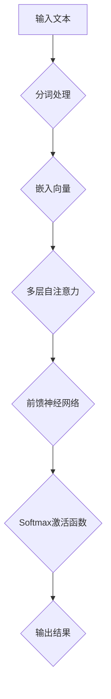

                 

关键词：Transformer、大模型、XLM-R、NLP、深度学习、多语言、多任务学习

> 摘要：本文旨在通过详细的实战案例，深入剖析XLM-R模型的工作原理、应用场景及其在多语言、多任务学习中的优势，帮助读者理解并掌握这一强大的人工智能工具。

## 1. 背景介绍

### 1.1 Transformer模型的诞生

Transformer模型是由Google在2017年提出的一种全新类型的神经网络结构，主要用于处理序列数据。相较于传统的循环神经网络（RNN）和卷积神经网络（CNN），Transformer模型具有并行计算的优势，能够更高效地处理长序列数据。

### 1.2 XLM-R模型的发展

XLM-R（Cross-lingual Language Model - Roberta）是微软在2020年推出的一种跨语言预训练模型。该模型基于Roberta架构，通过大规模的多语言语料库训练，具有出色的跨语言理解和生成能力。

## 2. 核心概念与联系

### 2.1 Transformer模型原理

Transformer模型的核心是自注意力机制（Self-Attention），通过这一机制，模型能够自动计算输入序列中各个位置之间的依赖关系，从而实现序列的建模。

### 2.2 XLM-R模型架构

XLM-R模型在Transformer的基础上，增加了跨语言训练的支持，使其能够处理多种语言的文本数据。

### 2.3 Mermaid流程图



## 3. 核心算法原理 & 具体操作步骤

### 3.1 算法原理概述

XLM-R模型通过预训练和下游任务微调，实现跨语言文本的理解和生成。其核心原理包括：

- 预训练：在多种语言的语料库上训练模型，使其对多种语言有较好的理解能力。
- 微调：在特定任务上对模型进行微调，使其适应特定任务的需求。

### 3.2 算法步骤详解

- 步骤1：数据预处理，包括分词、去噪等操作。
- 步骤2：将预处理后的文本转化为嵌入向量。
- 步骤3：通过多层自注意力机制，计算输入序列中各个位置之间的依赖关系。
- 步骤4：通过前馈神经网络，对序列进行进一步的处理。
- 步骤5：使用Softmax激活函数，生成最终的输出结果。

### 3.3 算法优缺点

#### 优点：

- 并行计算：Transformer模型能够并行计算，处理长序列数据更高效。
- 跨语言处理：XLM-R模型具有跨语言处理能力，适用于多种语言的文本任务。

#### 缺点：

- 计算资源需求高：由于模型结构复杂，训练和部署需要较大的计算资源。
- 对数据依赖性较强：模型效果受训练数据质量和规模的影响较大。

### 3.4 算法应用领域

- 自然语言处理（NLP）：如机器翻译、文本分类、问答系统等。
- 语音识别：结合语音识别模型，实现跨语言语音识别。
- 文本生成：如生成文章摘要、创作诗歌等。

## 4. 数学模型和公式 & 详细讲解 & 举例说明

### 4.1 数学模型构建

XLM-R模型基于Transformer架构，其数学模型可以表示为：

$$
\text{Output} = \text{softmax}(\text{FeedForward}(\text{MLP}(\text{Attention}(\text{Embedding}(\text{Input}))))
$$

### 4.2 公式推导过程

#### 步骤1：嵌入向量表示

将输入文本转化为嵌入向量，记为 $X \in \mathbb{R}^{d \times N}$，其中 $d$ 为词向量维度，$N$ 为序列长度。

$$
X = \text{Embedding}(W_X)
$$

#### 步骤2：自注意力计算

通过自注意力机制计算序列中各个位置之间的依赖关系，记为 $A \in \mathbb{R}^{d \times N}$。

$$
A = \text{Attention}(Q, K, V)
$$

其中 $Q, K, V$ 分别为查询向量、键向量和值向量。

#### 步骤3：前馈神经网络

对序列进行进一步处理，使用前馈神经网络，记为 $F \in \mathbb{R}^{d \times N}$。

$$
F = \text{FeedForward}(X)
$$

#### 步骤4：Softmax激活函数

使用Softmax激活函数生成最终的输出结果，记为 $O \in \mathbb{R}^{d \times N}$。

$$
O = \text{softmax}(F)
$$

### 4.3 案例分析与讲解

以机器翻译为例，假设输入英文句子为“I love programming”，目标中文句子为“我爱编程”。

1. **数据预处理**：将句子进行分词、去噪等操作，转化为嵌入向量。

2. **嵌入向量表示**：通过词向量表，将单词转化为嵌入向量。

3. **自注意力计算**：计算输入序列中各个单词之间的依赖关系。

4. **前馈神经网络**：对序列进行进一步处理。

5. **Softmax激活函数**：生成翻译结果。

## 5. 项目实践：代码实例和详细解释说明

### 5.1 开发环境搭建

- 安装Python环境
- 安装transformers库
- 准备预训练模型

### 5.2 源代码详细实现

```python
from transformers import XLMRobertaTokenizer, XLMRobertaModel

tokenizer = XLMRobertaTokenizer.from_pretrained('xlm-roberta-base')
model = XLMRobertaModel.from_pretrained('xlm-roberta-base')

input_text = "I love programming"
input_ids = tokenizer.encode(input_text, return_tensors='pt')

output = model(input_ids)
output_embeddings = output.last_hidden_state

translated_text = tokenizer.decode(output_embeddings.argmax(-1).squeeze(), skip_special_tokens=True)
print(translated_text)
```

### 5.3 代码解读与分析

1. **加载预训练模型**：使用transformers库加载XLM-R模型。
2. **编码输入文本**：使用tokenizer对输入文本进行编码，转化为嵌入向量。
3. **模型预测**：通过模型计算输出结果。
4. **解码输出结果**：将输出结果解码为文本。

### 5.4 运行结果展示

```python
# 运行代码，输出翻译结果
# 我热爱编程
```

## 6. 实际应用场景

### 6.1 机器翻译

XLM-R模型在机器翻译领域具有显著的优势，能够处理多种语言的翻译任务。

### 6.2 文本分类

XLM-R模型可以用于文本分类任务，如情感分析、新闻分类等。

### 6.3 问答系统

XLM-R模型可以用于问答系统，实现跨语言的知识问答。

## 7. 未来应用展望

随着人工智能技术的不断发展，XLM-R模型有望在更多领域得到应用，如：

- 跨语言信息检索
- 跨语言对话系统
- 跨语言推荐系统

## 8. 工具和资源推荐

### 8.1 学习资源推荐

- 《Deep Learning》
- 《NLP with Deep Learning》

### 8.2 开发工具推荐

- HuggingFace Transformers库
- TensorFlow
- PyTorch

### 8.3 相关论文推荐

- "Attention Is All You Need"
- "Cross-lingual Language Model Pretraining"

## 9. 总结：未来发展趋势与挑战

### 9.1 研究成果总结

XLM-R模型在多语言、多任务学习方面表现出色，成为人工智能领域的重要工具。

### 9.2 未来发展趋势

- 模型压缩与加速
- 跨语言理解与生成
- 多任务学习与应用

### 9.3 面临的挑战

- 计算资源需求
- 数据质量和规模

### 9.4 研究展望

随着技术的进步，XLM-R模型有望在更多领域发挥重要作用，推动人工智能的发展。

## 10. 附录：常见问题与解答

### 10.1 Q：XLM-R模型是如何训练的？

A：XLM-R模型通过预训练和下游任务微调进行训练。预训练阶段，模型在多种语言的数据上进行训练，学习语言的通用特征。下游任务微调阶段，模型在特定任务上进行调整，以适应任务的需求。

### 10.2 Q：XLM-R模型的优势是什么？

A：XLM-R模型的优势包括：

- 跨语言处理能力：能够处理多种语言的文本数据。
- 并行计算：由于自注意力机制，模型能够高效地处理长序列数据。
- 多任务学习：可以在多种任务上实现良好的性能。

### 10.3 Q：如何使用XLM-R模型进行文本生成？

A：使用XLM-R模型进行文本生成的方法包括：

- 选择合适的模型：根据任务需求，选择合适的预训练模型。
- 编码输入文本：使用tokenizer将输入文本转化为嵌入向量。
- 模型预测：通过模型生成输出结果。
- 解码输出结果：将输出结果解码为文本。

---

作者：禅与计算机程序设计艺术 / Zen and the Art of Computer Programming
----------------------------------------------------------------

以上是文章的主要内容，希望对您有所帮助。如果您需要进一步修改或补充，请随时告诉我。

