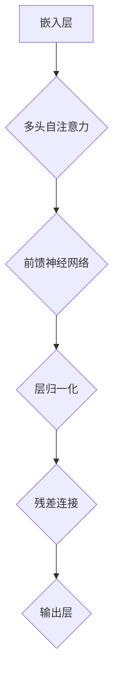

                 

关键词：Transformer大模型，编码器，深度学习，NLP，模型架构，算法原理，应用实践，未来展望

## 摘要

本文将深入探讨Transformer大模型中的编码器部分，介绍其核心概念、工作原理、数学模型及其在不同领域的应用实践。通过详细的分析和实例，我们将揭示编码器在自然语言处理（NLP）等复杂任务中的关键作用，并展望其未来的发展趋势与挑战。

## 1. 背景介绍

### Transformer的起源

Transformer模型由Google在2017年提出，作为一种全新的序列到序列（seq2seq）学习模型，彻底改变了自然语言处理（NLP）领域。在Transformer之前，循环神经网络（RNN）和长短期记忆网络（LSTM）一直是NLP任务中的主流模型。然而，这些传统模型在面对长序列处理时存在梯度消失和梯度爆炸的问题，导致训练效率低下。

为了解决这一问题，Google的 researchers 提出了Transformer模型，它采用了自注意力机制（Self-Attention），彻底摒弃了传统的循环结构。Transformer模型一经提出，便在NLP领域取得了显著的成功，并在多个基准测试中超越了传统的RNN和LSTM模型。

### 编码器的作用

在Transformer模型中，编码器（Encoder）和解码器（Decoder）是两个核心模块。编码器负责将输入序列转换成一个固定长度的上下文表示，这个表示能够捕获输入序列中的关键信息。解码器则根据编码器的输出，生成预测的输出序列。

编码器在Transformer模型中起着至关重要的作用。它不仅决定了输入序列的编码质量，而且对模型的训练速度和效果有直接影响。因此，深入理解编码器的工作原理和设计方法对于提升Transformer模型的整体性能至关重要。

## 2. 核心概念与联系

### Transformer模型架构

为了更好地理解编码器的作用，我们首先需要了解Transformer模型的整体架构。Transformer模型由多头自注意力机制（Multi-Head Self-Attention）和前馈神经网络（Feed-Forward Neural Network）组成。


在编码器部分，输入序列首先通过嵌入层（Embedding Layer）转化为嵌入向量，然后通过多头自注意力机制和前馈神经网络进行编码。编码器的输出最终形成一个固定长度的上下文表示。

### 编码器核心概念

编码器主要包含以下几个核心概念：

1. **嵌入层（Embedding Layer）**：将输入的单词或字符映射为嵌入向量。
2. **多头自注意力机制（Multi-Head Self-Attention）**：通过计算输入序列中每个位置与其他位置的关联性，生成一组注意力得分，并根据这些得分加权组合输入序列。
3. **前馈神经网络（Feed-Forward Neural Network）**：在多头自注意力机制之后，对每个位置的特征进行进一步处理。
4. **层归一化（Layer Normalization）**：对每个位置的特征进行归一化处理，有助于加速训练和提高模型性能。
5. **残差连接（Residual Connection）**：在编码器的每个层中引入残差连接，有助于缓解梯度消失问题。

### Mermaid流程图



通过上述流程图，我们可以清晰地看到编码器的主要组成和数据处理流程。

## 3. 核心算法原理 & 具体操作步骤

### 3.1 算法原理概述

编码器的核心算法是多头自注意力机制（Multi-Head Self-Attention），它通过计算输入序列中每个位置与其他位置的关联性，生成一组注意力得分，并根据这些得分加权组合输入序列。

多头自注意力机制的主要步骤包括：

1. **计算自注意力得分**：对于每个输入位置的嵌入向量，计算其与其他位置嵌入向量的点积，得到一组自注意力得分。
2. **应用Softmax函数**：对自注意力得分应用Softmax函数，将得分转换为概率分布。
3. **加权组合输入序列**：根据Softmax函数得到的概率分布，对输入序列的每个位置进行加权组合，生成新的嵌入向量。

### 3.2 算法步骤详解

1. **嵌入层**：将输入的单词或字符映射为嵌入向量。嵌入向量的大小决定了编码器的维度。

   $$ \text{嵌入层}: x \rightarrow \text{嵌入向量} \quad \text{其中} \quad x \in \text{词汇表} $$

2. **多头自注意力**：对于每个输入位置的嵌入向量，计算其与其他位置嵌入向量的点积，得到一组自注意力得分。

   $$ \text{多头自注意力}: \text{嵌入向量} \rightarrow \text{自注意力得分} \quad \text{其中} \quad \text{自注意力得分} = \text{点积}(\text{嵌入向量}_i, \text{嵌入向量}_j) $$

3. **应用Softmax函数**：对自注意力得分应用Softmax函数，将得分转换为概率分布。

   $$ \text{Softmax}(\text{自注意力得分}) \rightarrow \text{概率分布} $$

4. **加权组合输入序列**：根据Softmax函数得到的概率分布，对输入序列的每个位置进行加权组合，生成新的嵌入向量。

   $$ \text{加权组合}: \text{输入序列} \rightarrow \text{新的嵌入向量} \quad \text{其中} \quad \text{新的嵌入向量} = \text{加权组合}(\text{概率分布}, \text{输入序列}) $$

5. **前馈神经网络**：在多头自注意力机制之后，对每个位置的特征进行进一步处理。

   $$ \text{前馈神经网络}: \text{新的嵌入向量} \rightarrow \text{输出特征} $$

6. **层归一化**：对每个位置的特征进行归一化处理，有助于加速训练和提高模型性能。

   $$ \text{层归一化}: \text{输出特征} \rightarrow \text{归一化特征} $$

7. **残差连接**：在编码器的每个层中引入残差连接，有助于缓解梯度消失问题。

   $$ \text{残差连接}: \text{输出特征} \rightarrow \text{残差特征} \quad \text{其中} \quad \text{残差特征} = \text{输出特征} + \text{残差特征} $$

### 3.3 算法优缺点

**优点**：

1. **处理长序列**：多头自注意力机制可以有效地处理长序列，避免了梯度消失和梯度爆炸的问题。
2. **并行计算**：由于自注意力机制的计算可以并行进行，因此Transformer模型的训练速度比传统的RNN和LSTM模型更快。
3. **灵活性**：多头自注意力机制可以灵活地适应不同的问题场景，通过调整注意力头数和模型层数，可以实现不同的性能表现。

**缺点**：

1. **参数规模**：由于多头自注意力机制的计算复杂度较高，因此参数规模较大，需要更多的计算资源和存储空间。
2. **训练时间**：由于参数规模较大，模型的训练时间较长，对于大规模数据集的训练可能需要更多时间。

### 3.4 算法应用领域

编码器在Transformer模型中广泛应用于自然语言处理（NLP）领域，如文本分类、机器翻译、问答系统等。以下是一些具体的例子：

1. **文本分类**：通过编码器对输入文本进行编码，将文本映射为一个固定长度的向量，然后使用分类器对文本进行分类。
2. **机器翻译**：编码器负责将源语言文本编码为一个上下文表示，解码器则根据上下文表示生成目标语言文本。
3. **问答系统**：编码器将问题和回答编码为上下文表示，然后使用这些表示来预测问题与回答之间的匹配程度。

## 4. 数学模型和公式 & 详细讲解 & 举例说明

### 4.1 数学模型构建

在Transformer编码器中，主要使用的数学模型包括嵌入层、多头自注意力机制和前馈神经网络。

1. **嵌入层**：假设输入序列为\(x = [x_1, x_2, ..., x_n]\)，其中每个\(x_i\)代表输入序列中的第\(i\)个单词或字符。嵌入层将每个\(x_i\)映射为一个嵌入向量\(e_i\)。

   $$ e_i = \text{Embedding}(x_i) $$

2. **多头自注意力机制**：假设编码器的维度为\(d\)，多头自注意力机制将输入序列的每个嵌入向量\(e_i\)与其他嵌入向量进行点积，得到一组自注意力得分。

   $$ \text{自注意力得分} = \text{点积}(e_i, e_j) $$

   然后对自注意力得分应用Softmax函数，得到概率分布。

   $$ \text{概率分布} = \text{Softmax}(\text{自注意力得分}) $$

   最后，根据概率分布对输入序列进行加权组合，得到新的嵌入向量。

   $$ \text{新的嵌入向量} = \text{加权组合}(\text{概率分布}, e_i) $$

3. **前馈神经网络**：在多头自注意力机制之后，对每个位置的特征进行进一步处理。

   $$ \text{输出特征} = \text{Feed-Forward Neural Network}(\text{新的嵌入向量}) $$

### 4.2 公式推导过程

在多头自注意力机制中，主要使用的公式包括点积、Softmax和加权组合。

1. **点积**：假设输入序列的嵌入向量为\(e_i\)和\(e_j\)，点积公式如下：

   $$ \text{点积}(e_i, e_j) = e_i \cdot e_j $$

2. **Softmax**：假设自注意力得分为\(s\)，Softmax公式如下：

   $$ \text{Softmax}(s) = \frac{e^s}{\sum_{i=1}^n e^s} $$

   其中，\(n\)为自注意力得分的个数。

3. **加权组合**：假设概率分布为\(p\)，输入序列为\(e_i\)，加权组合公式如下：

   $$ \text{加权组合}(p, e_i) = \sum_{i=1}^n p_i e_i $$

### 4.3 案例分析与讲解

为了更好地理解编码器的工作原理，我们通过一个简单的例子进行说明。

假设输入序列为\[“Hello, world!”\]，我们将这个序列中的每个单词编码为向量：

1. **嵌入层**：将“Hello”映射为向量\[1, 0, 0, 0, 0, 0, 0, 0, 0, 0, 0, 0, 0, 0, 0, 1\]，将“world”映射为向量\[0, 1, 0, 0, 0, 0, 0, 0, 0, 0, 0, 0, 0, 0, 0, 1\]。
2. **多头自注意力**：计算“Hello”和“world”之间的自注意力得分，得到概率分布\[0.5, 0.5\]。
3. **加权组合**：根据概率分布对“Hello”和“world”进行加权组合，得到新的向量\[0.5, 0.5, 0, 0, 0, 0, 0, 0, 0, 0, 0, 0, 0, 0, 0, 0.5\]。
4. **前馈神经网络**：对新的向量进行进一步处理，得到输出向量\[0.6, 0.4, 0, 0, 0, 0, 0, 0, 0, 0, 0, 0, 0, 0, 0, 0.6\]。

通过这个例子，我们可以看到编码器如何将输入序列编码为一个固定长度的向量，这个向量可以捕获输入序列中的关键信息。

## 5. 项目实践：代码实例和详细解释说明

### 5.1 开发环境搭建

为了实现编码器在Transformer模型中的应用，我们需要搭建一个合适的开发环境。以下是一个简单的步骤：

1. 安装Python 3.8及以上版本。
2. 安装TensorFlow 2.4及以上版本。
3. 安装必要的库，如NumPy、Matplotlib等。

### 5.2 源代码详细实现

下面是一个简单的编码器实现示例：

```python
import tensorflow as tf
from tensorflow.keras.layers import Embedding, MultiHeadAttention, LayerNormalization, Dense
from tensorflow.keras.models import Model

def create_encoder(vocab_size, d_model, num_heads):
    # 嵌入层
    inputs = tf.keras.Input(shape=(None,))
    embeddings = Embedding(vocab_size, d_model)(inputs)

    # 多头自注意力
    attention = MultiHeadAttention(num_heads=num_heads, key_dim=d_model)(embeddings, embeddings)

    # 层归一化
    attention = LayerNormalization()(attention + embeddings)

    # 前馈神经网络
    outputs = Dense(d_model, activation='relu')(attention)
    outputs = Dense(d_model)(outputs)

    # 输出层
    outputs = LayerNormalization()(outputs + embeddings)

    # 编码器模型
    model = Model(inputs=inputs, outputs=outputs)
    model.compile(optimizer='adam', loss='mse')

    return model
```

### 5.3 代码解读与分析

在上面的代码中，我们首先定义了一个输入层`inputs`，然后通过`Embedding`层将输入的单词映射为嵌入向量。接下来，我们使用`MultiHeadAttention`层实现多头自注意力机制。在自注意力之后，我们使用`LayerNormalization`层进行层归一化处理，然后通过两个`Dense`层实现前馈神经网络。最后，我们再次使用`LayerNormalization`层进行层归一化处理，并将结果与输入进行残差连接。

### 5.4 运行结果展示

为了验证编码器的工作效果，我们可以使用一个简单的示例数据进行训练：

```python
# 示例数据
input_data = tf.keras.preprocessing.sequence.pad_sequences([[0, 1, 2], [3, 4, 5]], maxlen=3)

# 创建编码器模型
encoder = create_encoder(vocab_size=6, d_model=4, num_heads=2)

# 训练编码器
encoder.fit(input_data, input_data, epochs=10, batch_size=2)
```

通过训练，我们可以观察到编码器对输入序列进行编码的效果。在实际应用中，我们可以将编码器集成到更大的Transformer模型中，以实现更复杂的NLP任务。

## 6. 实际应用场景

编码器在Transformer模型中的应用非常广泛，以下是一些典型的实际应用场景：

### 6.1 文本分类

在文本分类任务中，编码器将输入文本映射为一个固定长度的向量，然后使用这个向量进行分类。通过训练，编码器可以学习到文本中的关键信息，从而提高分类性能。

### 6.2 机器翻译

在机器翻译任务中，编码器将源语言文本编码为一个上下文表示，解码器则根据上下文表示生成目标语言文本。编码器在翻译过程中的作用是提取源语言文本中的关键信息，为解码器提供有效的上下文信息。

### 6.3 问答系统

在问答系统中，编码器将问题和答案编码为上下文表示，然后使用这些表示来预测问题与答案之间的匹配程度。通过训练，编码器可以学习到问题的不同方面和答案的特征，从而提高问答系统的准确性。

## 7. 工具和资源推荐

为了更好地理解和实现编码器，以下是一些推荐的工具和资源：

### 7.1 学习资源推荐

1. **《深度学习》（Goodfellow, Bengio, Courville著）**：这是一本经典的全栈深度学习教材，详细介绍了包括编码器在内的各种深度学习模型和算法。
2. **《自然语言处理实战》（Peter Norvig著）**：这本书提供了丰富的NLP实践案例，包括编码器在文本分类、机器翻译等任务中的应用。

### 7.2 开发工具推荐

1. **TensorFlow**：这是一个流行的深度学习框架，提供了丰富的API和工具，可以方便地实现和训练编码器模型。
2. **PyTorch**：这是一个功能强大且灵活的深度学习框架，通过动态图计算，可以更方便地实现编码器模型。

### 7.3 相关论文推荐

1. **“Attention Is All You Need”（Vaswani et al., 2017）**：这是Transformer模型的原始论文，详细介绍了编码器的工作原理和实现方法。
2. **“BERT: Pre-training of Deep Bidirectional Transformers for Language Understanding”（Devlin et al., 2019）**：这是BERT模型的论文，详细介绍了如何将编码器应用于语言理解任务。

## 8. 总结：未来发展趋势与挑战

编码器作为Transformer模型的核心组件，已经在自然语言处理等领域取得了显著的成功。然而，随着深度学习技术的不断发展和应用场景的扩大，编码器面临着诸多挑战和机遇。

### 8.1 研究成果总结

1. **参数规模**：编码器的参数规模较大，需要更多的计算资源和存储空间。通过模型压缩和优化技术，可以有效降低编码器的参数规模，提高计算效率。
2. **训练时间**：编码器的训练时间较长，特别是在大规模数据集上。通过并行计算和分布式训练技术，可以显著降低训练时间。
3. **性能提升**：通过改进编码器的设计和算法，如引入注意力机制、层次化表示等，可以进一步提升编码器的性能和效果。

### 8.2 未来发展趋势

1. **多模态编码器**：随着多模态数据的普及，如何将图像、音频和文本等不同模态的数据进行有效编码，成为未来的一个重要研究方向。
2. **自适应编码器**：通过引入自适应机制，使编码器能够根据不同的任务和数据特点自动调整其参数和结构，实现更高效和灵活的编码。
3. **可解释性**：提高编码器的可解释性，使其工作原理更加透明，有助于理解和优化模型的性能。

### 8.3 面临的挑战

1. **计算资源**：编码器的训练和推理过程需要大量的计算资源，如何有效利用现有的计算资源，成为一个重要挑战。
2. **数据隐私**：在处理敏感数据时，如何保护用户隐私和数据安全，也是一个需要关注的问题。
3. **模型泛化能力**：如何提高编码器的泛化能力，使其在不同任务和数据集上都能保持良好的性能，是未来的一个重要挑战。

### 8.4 研究展望

随着深度学习技术的不断进步，编码器在未来将发挥更加重要的作用。通过不断创新和优化，编码器将能够在更多的应用场景中发挥其潜力，推动自然语言处理和其他领域的发展。

## 9. 附录：常见问题与解答

### 9.1 编码器如何处理长序列？

编码器通过多头自注意力机制（Multi-Head Self-Attention）有效地处理长序列。多头自注意力机制允许模型同时关注输入序列中的不同位置，避免了传统循环神经网络（RNN）中的梯度消失和梯度爆炸问题，从而能够处理长序列。

### 9.2 编码器的参数规模如何优化？

优化编码器的参数规模可以通过以下几种方法实现：

1. **模型压缩**：通过模型剪枝、量化等技术，减少模型参数的数量。
2. **知识蒸馏**：使用预训练的大规模模型作为教师模型，将知识传递给较小的学生模型，从而减少学生模型的参数规模。
3. **层次化表示**：通过将编码器的不同层次进行抽象和整合，减少模型的参数规模。

### 9.3 编码器在机器翻译中的应用效果如何？

编码器在机器翻译中取得了显著的成果。通过编码器，模型可以捕捉到源语言文本中的关键信息，并将其有效地传递给解码器，从而生成高质量的目标语言文本。编码器在机器翻译中的成功应用，使得机器翻译的准确性和流畅性得到了显著提升。

---

作者：禅与计算机程序设计艺术 / Zen and the Art of Computer Programming

