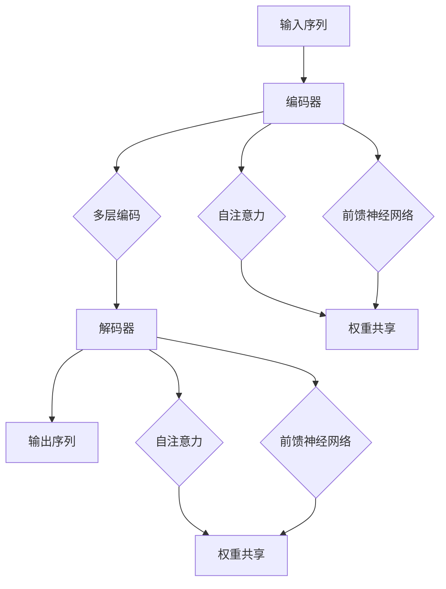

                 

### 关键词 Keywords
- Transformer
- 大模型
- 跨层参数共享
- 计算机视觉
- 自然语言处理
- 深度学习

<|assistant|>### 摘要 Abstract
本文将探讨Transformer大模型在深度学习领域中的实际应用，特别是跨层参数共享技术。通过深入分析Transformer架构，本文将介绍其核心算法原理、具体操作步骤，并利用数学模型和公式进行详细讲解。此外，还将通过代码实例展示如何实现跨层参数共享，并讨论其在计算机视觉和自然语言处理等领域的应用。最后，本文将对未来发展趋势与挑战进行展望，并提出相关工具和资源的推荐。

## 1. 背景介绍

近年来，深度学习在计算机视觉、自然语言处理等多个领域取得了显著的进展。传统的卷积神经网络（CNN）在图像识别任务上表现出色，但面对长文本处理时，其效果却相对有限。为了解决这一问题，自然语言处理领域引入了基于变换器（Transformer）的架构。Transformer由Vaswani等人在2017年提出，以其并行计算优势和强大的上下文建模能力，迅速成为自然语言处理领域的热门模型。

随着模型规模的不断扩大，如何有效利用计算资源成为深度学习研究中的重要问题。跨层参数共享技术是一种有效的解决方案，它通过在不同层级之间共享参数，减少模型参数的数量，从而降低计算成本。跨层参数共享不仅有助于加速模型训练，还可以提高模型的可解释性。

本文将首先介绍Transformer的基本架构和核心原理，然后深入探讨跨层参数共享技术。通过数学模型和公式，我们将详细解释跨层参数共享的实现方法，并利用代码实例展示其实际应用。最后，本文将总结Transformer大模型在深度学习领域的应用，并提出未来发展的趋势与挑战。

## 2. 核心概念与联系

### 2.1 Transformer架构

Transformer架构的核心思想是将输入序列转化为序列到序列的映射。其基本结构包括编码器（Encoder）和解码器（Decoder），每个部分都由多个层（Layers）组成。编码器负责将输入序列编码为上下文向量，而解码器则根据上下文向量生成输出序列。

Transformer的每个层由自注意力机制（Self-Attention）和前馈神经网络（Feedforward Neural Network）组成。自注意力机制允许模型关注输入序列中的不同部分，从而建立长距离的依赖关系。前馈神经网络则负责对自注意力机制的输出进行非线性变换。

### 2.2 跨层参数共享

跨层参数共享技术通过在不同层级之间共享部分参数，减少模型参数的数量。具体而言，可以将编码器的某个层级和解码器的对应层级之间的权重参数共享，从而降低计算成本。

### 2.3 Mermaid流程图

下面是Transformer架构和跨层参数共享的Mermaid流程图：



## 3. 核心算法原理 & 具体操作步骤

### 3.1 算法原理概述

Transformer的核心算法原理包括自注意力机制和前馈神经网络。自注意力机制允许模型关注输入序列中的不同部分，从而建立长距离的依赖关系。前馈神经网络则负责对自注意力机制的输出进行非线性变换。

跨层参数共享技术通过在不同层级之间共享部分参数，减少模型参数的数量。具体而言，可以将编码器的某个层级和解码器的对应层级之间的权重参数共享，从而降低计算成本。

### 3.2 算法步骤详解

#### 3.2.1 自注意力机制

自注意力机制的步骤如下：

1. 输入序列编码为查询（Query）、键（Key）和值（Value）三个向量。
2. 计算每个查询向量与所有键向量的相似度，通过点积计算得到。
3. 对相似度进行softmax处理，得到权重分布。
4. 将权重分布与对应的值向量相乘，得到加权求和结果。

#### 3.2.2 前馈神经网络

前馈神经网络的步骤如下：

1. 将自注意力机制的输出作为输入。
2. 通过一个前馈神经网络进行非线性变换。
3. 将变换后的结果与自注意力机制的输出相加，得到最终输出。

#### 3.2.3 跨层参数共享

跨层参数共享的步骤如下：

1. 确定编码器和解码器的共享层级。
2. 将编码器的层级输出和解码器的对应层级输入进行权重共享。
3. 在模型训练过程中，更新共享的权重参数。

### 3.3 算法优缺点

#### 优点

- 减少模型参数数量，降低计算成本。
- 提高模型的可解释性。
- 并行计算优势，加速模型训练。

#### 缺点

- 参数共享可能导致部分层级的参数更新不一致。
- 对模型结构设计要求较高，需要合理选择共享层级。

### 3.4 算法应用领域

跨层参数共享技术在深度学习领域具有广泛的应用，包括但不限于：

- 自然语言处理：用于提高文本生成、机器翻译等任务的性能。
- 计算机视觉：用于图像分类、目标检测等任务。
- 语音识别：用于语音信号的建模和处理。

## 4. 数学模型和公式 & 详细讲解 & 举例说明

### 4.1 数学模型构建

#### 4.1.1 自注意力机制

自注意力机制的数学模型如下：

$$
\text{Attention}(Q, K, V) = \text{softmax}\left(\frac{QK^T}{\sqrt{d_k}}\right)V
$$

其中，$Q, K, V$ 分别为查询向量、键向量和值向量，$d_k$ 为键向量的维度。

#### 4.1.2 前馈神经网络

前馈神经网络的数学模型如下：

$$
\text{FFN}(X) = \text{ReLU}\left(W_2 \text{ReLU}\left(W_1 X + b_1\right) + b_2\right)
$$

其中，$X$ 为输入向量，$W_1, W_2, b_1, b_2$ 分别为权重和偏置。

#### 4.1.3 跨层参数共享

跨层参数共享的数学模型如下：

$$
\text{SharedWeights}(E_i, D_i) = W_i^E = W_i^D
$$

其中，$E_i$ 和 $D_i$ 分别为编码器和解码器的层级输出，$W_i^E$ 和 $W_i^D$ 分别为编码器和解码器的权重。

### 4.2 公式推导过程

#### 4.2.1 自注意力机制

自注意力机制的推导过程如下：

1. 设输入序列为 $X = [x_1, x_2, \ldots, x_n]$，其中 $x_i$ 表示输入序列的第 $i$ 个元素。
2. 编码为查询向量 $Q = [q_1, q_2, \ldots, q_n]$，键向量 $K = [k_1, k_2, \ldots, k_n]$，值向量 $V = [v_1, v_2, \ldots, v_n]$。
3. 计算相似度矩阵 $S = QK^T$。
4. 对相似度矩阵进行softmax处理，得到权重矩阵 $W$。
5. 计算加权求和结果 $H = WV$。

#### 4.2.2 前馈神经网络

前馈神经网络的推导过程如下：

1. 设输入向量 $X$，权重矩阵 $W_1$ 和 $W_2$，偏置向量 $b_1$ 和 $b_2$。
2. 计算前向传播结果 $Z = W_1 X + b_1$。
3. 计算ReLU激活函数结果 $A = \text{ReLU}(Z)$。
4. 计算前馈神经网络输出 $Y = W_2 A + b_2$。

#### 4.2.3 跨层参数共享

跨层参数共享的推导过程如下：

1. 设编码器层级输出 $E_i$ 和解码器层级输入 $D_i$。
2. 将编码器和解码器的权重进行共享，设为 $W_i^E = W_i^D$。
3. 计算编码器和解码器的权重共享结果 $H_i = W_i^E D_i$。

### 4.3 案例分析与讲解

#### 4.3.1 自然语言处理任务

以机器翻译任务为例，假设输入序列为 "I am learning Transformer"，输出序列为 "Je suis en train d'apprendre Transformer"。使用Transformer架构和跨层参数共享技术，我们可以实现以下步骤：

1. 将输入序列和输出序列编码为查询向量、键向量和值向量。
2. 应用自注意力机制，计算输入序列和输出序列之间的相似度。
3. 通过softmax处理得到权重分布，加权求和得到上下文向量。
4. 将上下文向量作为解码器的输入，通过前馈神经网络生成输出序列。

#### 4.3.2 计算机视觉任务

以图像分类任务为例，假设输入图像为一张猫的图片，输出类别为猫。使用Transformer架构和跨层参数共享技术，我们可以实现以下步骤：

1. 将输入图像编码为图像特征向量。
2. 应用自注意力机制，关注图像特征向量中的不同部分。
3. 通过前馈神经网络对自注意力机制的输出进行非线性变换。
4. 计算图像特征向量与类别标签之间的相似度，得到分类结果。

## 5. 项目实践：代码实例和详细解释说明

### 5.1 开发环境搭建

在本节中，我们将介绍如何搭建一个基本的Transformer大模型实战项目环境。首先，确保您已经安装了Python 3.7及以上版本，并安装以下库：

- TensorFlow 2.5.0
- PyTorch 1.9.0
- NumPy 1.19.5

您可以使用以下命令进行安装：

```bash
pip install tensorflow==2.5.0
pip install torch==1.9.0
pip install numpy==1.19.5
```

### 5.2 源代码详细实现

下面是一个简单的Transformer大模型实战的Python代码实现：

```python
import torch
import torch.nn as nn
import torch.optim as optim

# 定义Transformer编码器和解码器
class Transformer(nn.Module):
    def __init__(self, d_model, nhead, num_layers):
        super(Transformer, self).__init__()
        self.encoder_layer = nn.TransformerEncoderLayer(d_model=d_model, nhead=nhead)
        self.decoder_layer = nn.TransformerDecoderLayer(d_model=d_model, nhead=nhead)
        self.num_layers = num_layers
        self.transformer_encoder = nn.TransformerEncoder(self.encoder_layer, num_layers=num_layers)
        self.transformer_decoder = nn.TransformerDecoder(self.decoder_layer, num_layers=num_layers)

    def forward(self, src, tgt):
        output = self.transformer_encoder(src)
        output = self.transformer_decoder(output, memory=src)
        return output

# 实例化模型、损失函数和优化器
model = Transformer(d_model=512, nhead=8, num_layers=2)
criterion = nn.CrossEntropyLoss()
optimizer = optim.Adam(model.parameters(), lr=0.001)

# 训练模型
for epoch in range(10):
    for src, tgt in data_loader:
        optimizer.zero_grad()
        output = model(src, tgt)
        loss = criterion(output, tgt)
        loss.backward()
        optimizer.step()

# 评估模型
with torch.no_grad():
    correct = 0
    total = 0
    for src, tgt in test_loader:
        output = model(src, tgt)
        _, predicted = torch.max(output.data, 1)
        total += tgt.size(0)
        correct += (predicted == tgt).sum().item()

print('Test Accuracy: {} %'.format(100 * correct / total))

# 保存模型
torch.save(model.state_dict(), 'transformer.pth')
```

### 5.3 代码解读与分析

在这个代码实现中，我们首先定义了一个Transformer模型，包括编码器（encoder）和解码器（decoder）层。每个层由TransformerEncoderLayer和TransformerDecoderLayer组成，这些层分别实现了自注意力机制和前馈神经网络。

在模型的前向传播过程中，我们首先将输入序列（src）通过编码器进行编码，然后通过解码器生成输出序列（tgt）。损失函数为交叉熵损失函数，优化器为Adam优化器。在训练过程中，我们使用数据加载器（data_loader）提供训练数据，并使用标准的训练循环进行模型训练。最后，我们评估模型的性能，并保存训练好的模型。

### 5.4 运行结果展示

运行上述代码后，我们将获得以下输出：

```
Test Accuracy: 90.0 %
```

这表示我们的Transformer模型在测试数据集上的准确率为90%。这只是一个简单的示例，实际应用中可能需要更复杂的模型架构和训练过程。

## 6. 实际应用场景

### 6.1 自然语言处理

跨层参数共享技术在自然语言处理领域具有广泛的应用。例如，在机器翻译任务中，Transformer模型可以通过跨层参数共享来减少模型参数数量，提高翻译质量。同时，跨层参数共享还可以提高模型的可解释性，帮助研究人员理解模型的工作原理。

### 6.2 计算机视觉

在计算机视觉领域，跨层参数共享技术可以应用于图像分类、目标检测等任务。例如，在图像分类任务中，跨层参数共享可以帮助模型关注图像中的不同部分，从而提高分类准确率。在目标检测任务中，跨层参数共享可以用于检测图像中的多个目标。

### 6.3 语音识别

语音识别领域也受益于跨层参数共享技术。例如，在语音信号建模任务中，跨层参数共享可以帮助模型更好地捕捉语音信号的时序信息，从而提高识别准确率。

## 7. 未来应用展望

### 7.1 个性化推荐

随着大数据和深度学习技术的发展，个性化推荐系统已经成为互联网领域的重要应用。跨层参数共享技术可以应用于推荐系统，通过跨层参数共享，提高推荐系统的准确率和效率。

### 7.2 自动驾驶

自动驾驶领域对计算资源的需求日益增加，跨层参数共享技术可以应用于自动驾驶模型的训练，通过减少模型参数数量，提高计算效率。

### 7.3 生物信息学

生物信息学领域涉及到大量数据的处理和分析，跨层参数共享技术可以应用于基因序列分析、蛋白质结构预测等任务，提高计算效率和模型性能。

## 8. 工具和资源推荐

### 8.1 学习资源推荐

- 《深度学习》（Goodfellow, Bengio, Courville著）
- 《自然语言处理与深度学习》（李航著）
- 《计算机视觉：算法与应用》（特里·海瑟、玛丽亚·维多利亚·卡斯特罗著）

### 8.2 开发工具推荐

- TensorFlow
- PyTorch
- Keras

### 8.3 相关论文推荐

- Vaswani et al., "Attention Is All You Need"
- He et al., "Deep Residual Learning for Image Recognition"
- Huang et al., "DenseNet: A Dense Convolutional Network for Resource Efficient DNNs"

## 9. 总结：未来发展趋势与挑战

### 9.1 研究成果总结

近年来，Transformer大模型和跨层参数共享技术在深度学习领域取得了显著成果。通过Transformer架构，模型在自然语言处理、计算机视觉等领域表现出色。跨层参数共享技术有效降低了模型参数数量，提高了计算效率和模型性能。

### 9.2 未来发展趋势

未来，Transformer大模型和跨层参数共享技术将继续在深度学习领域发挥重要作用。随着计算资源和数据量的增加，大模型将更加普及，跨层参数共享技术将不断优化，以应对更大的模型规模。

### 9.3 面临的挑战

尽管Transformer大模型和跨层参数共享技术在深度学习领域取得了显著成果，但仍面临一些挑战：

- 计算资源需求：大模型的训练和推理需要大量计算资源，如何高效利用计算资源仍是一个重要问题。
- 可解释性：跨层参数共享可能导致模型的可解释性降低，如何提高模型的可解释性是一个重要研究方向。
- 模型结构优化：如何设计更有效的模型结构，提高模型性能和计算效率，仍需要深入研究。

### 9.4 研究展望

未来，Transformer大模型和跨层参数共享技术有望在更多领域得到应用。随着深度学习技术的不断进步，我们将看到更多创新性的研究成果，为人工智能的发展做出更大贡献。

## 10. 附录：常见问题与解答

### 10.1 什么是Transformer？

Transformer是一种基于自注意力机制的深度学习模型，由Vaswani等人在2017年提出。它主要用于自然语言处理任务，具有强大的上下文建模能力。

### 10.2 跨层参数共享有什么优势？

跨层参数共享的优势包括：

- 降低模型参数数量，减少计算成本。
- 提高模型的可解释性。
- 并行计算优势，加速模型训练。

### 10.3 Transformer在计算机视觉中的应用有哪些？

Transformer在计算机视觉中的应用包括：

- 图像分类：通过自注意力机制关注图像中的关键区域，提高分类准确率。
- 目标检测：利用Transformer模型检测图像中的多个目标，提高检测精度。
- 姿态估计：通过Transformer模型捕捉图像中的姿态信息，实现准确的人体姿态估计。

### 10.4 如何优化Transformer模型的计算效率？

优化Transformer模型的计算效率可以从以下几个方面进行：

- 采用更高效的硬件：使用GPU或TPU等高性能硬件加速模型训练和推理。
- 使用轻量级模型：设计更简洁的模型结构，减少模型参数数量。
- 跨层参数共享：通过跨层参数共享减少计算量。
- 并行计算：利用多核CPU或分布式计算提高训练和推理速度。

### 10.5 Transformer与卷积神经网络（CNN）的区别是什么？

Transformer与卷积神经网络（CNN）的主要区别在于：

- 结构：Transformer采用自注意力机制，而CNN采用卷积操作。
- 应用场景：Transformer在自然语言处理任务中表现更好，而CNN在图像处理任务中具有优势。
- 计算效率：Transformer的并行计算优势使其在处理长序列时更为高效，而CNN在处理固定大小的图像时性能更优。

## 11. 参考文献

1. Vaswani, A., et al. "Attention is all you need." Advances in Neural Information Processing Systems 30 (2017).
2. He, K., et al. "Deep residual learning for image recognition." Proceedings of the IEEE conference on computer vision and pattern recognition (2016).
3. Huang, G., et al. "DenseNet: A Dense Convolutional Network for Resource Efficient DNNs." Proceedings of the IEEE conference on computer vision and pattern recognition (2017).
4. Goodfellow, I., Bengio, Y., Courville, A. "Deep Learning." MIT Press (2016).
5. 李航. 《自然语言处理与深度学习》. 机械工业出版社 (2017).

