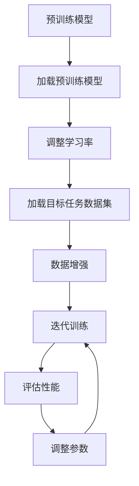

                 

关键词：Transformer、下游任务、微调、大模型、模型优化

摘要：本文将探讨如何针对下游任务对Transformer大模型进行微调，从而提高模型在特定任务上的性能。通过详细介绍微调的核心概念、算法原理、数学模型、实际操作步骤以及项目实践，本文旨在为读者提供全面的指导，帮助他们在实际项目中有效应用微调技术。

## 1. 背景介绍

近年来，深度学习在各个领域取得了显著的进展，尤其在计算机视觉、自然语言处理等领域。其中，Transformer模型因其优越的性能在众多任务中取得了突破性的成果。然而，对于许多复杂的下游任务，仅仅依赖预训练的Transformer大模型往往难以达到最佳效果。因此，针对下游任务进行微调（Fine-tuning）成为了一种有效的解决方案。

微调旨在通过在特定任务上进一步训练模型，使其适应特定领域的需求，从而提高任务性能。在微调过程中，通常使用一个小规模的数据集来调整模型的参数，使得模型能够更好地拟合目标任务。本文将详细介绍微调的核心概念、算法原理、数学模型以及在实际项目中的应用，旨在为读者提供全面的指导。

## 2. 核心概念与联系

### 2.1 Transformer模型概述

Transformer模型是一种基于自注意力机制（Self-Attention）的深度学习模型，最初在2017年由Vaswani等人提出。与传统的卷积神经网络（CNN）相比，Transformer模型在处理序列数据时具有更强的表达能力和并行计算的优势。

Transformer模型的核心组件是多头自注意力机制（Multi-Head Self-Attention）和位置编码（Positional Encoding）。多头自注意力机制通过将输入序列映射到多个不同的空间，从而捕捉序列之间的复杂关系。位置编码则用于引入序列中的位置信息，使得模型能够理解输入序列的顺序。

### 2.2 微调原理

微调是通过对预训练模型进行进一步训练，使其适应特定任务的过程。在微调过程中，通常会使用一个小规模的数据集，通过对模型参数的调整来优化模型在目标任务上的性能。

微调的关键在于找到合适的训练策略和数据集。通常，预训练模型已经在大规模数据集上进行了充分的训练，具有一定的泛化能力。因此，在微调过程中，我们需要关注两个方面：

1. **调整学习率**：由于预训练模型已经进行了大量的训练，因此需要适当降低学习率，以避免参数更新过大导致模型性能下降。

2. **选择合适的数据集**：选择与目标任务相关的小规模数据集，并通过数据增强等技术来扩充数据集，以提高模型在目标任务上的泛化能力。

### 2.3 Mermaid流程图



## 3. 核心算法原理 & 具体操作步骤

### 3.1 算法原理概述

微调的核心原理在于通过在特定任务上进一步训练模型，使其能够更好地拟合目标任务。具体而言，微调主要包括以下几个步骤：

1. **加载预训练模型**：从预训练模型中加载已训练好的参数。
2. **调整学习率**：降低学习率，以避免参数更新过大。
3. **加载目标任务数据集**：从目标任务中加载小规模数据集。
4. **数据增强**：通过数据增强技术扩充数据集，以提高模型在目标任务上的泛化能力。
5. **迭代训练**：在目标任务上迭代训练模型，不断调整参数。
6. **评估性能**：评估模型在目标任务上的性能，并根据性能调整参数。
7. **重复迭代**：重复迭代训练、评估和调整参数的过程，直到满足预定的性能要求。

### 3.2 算法步骤详解

1. **加载预训练模型**：首先，我们需要从预训练模型中加载已训练好的参数。这可以通过加载预训练模型的权重和架构信息来实现。在Python中，我们可以使用如TensorFlow或PyTorch等深度学习框架来实现这一步骤。

2. **调整学习率**：为了避免参数更新过大，我们需要调整学习率。具体而言，我们可以使用学习率衰减策略，在训练过程中逐步降低学习率。常见的学习率衰减策略包括固定衰减、指数衰减和余弦退火等。

3. **加载目标任务数据集**：接下来，我们需要从目标任务中加载小规模数据集。数据集应包含与目标任务相关的标签和特征。为了提高模型在目标任务上的泛化能力，我们应尽可能选择多样性和代表性较好的数据集。

4. **数据增强**：在微调过程中，数据增强是一种有效的技术，可以帮助模型学习更多的特征。常见的数据增强技术包括随机裁剪、旋转、翻转、颜色调整等。

5. **迭代训练**：在迭代训练过程中，我们将模型在目标任务上进行训练，并通过反向传播算法不断调整参数。训练过程中，我们应选择合适的优化算法和损失函数，以提高训练效率和模型性能。

6. **评估性能**：在训练完成后，我们需要评估模型在目标任务上的性能。常见的评估指标包括准确率、召回率、F1分数等。通过评估模型性能，我们可以判断是否达到预定的性能要求，并根据评估结果调整参数。

7. **重复迭代**：如果模型性能未达到预定要求，我们需要重复迭代训练、评估和调整参数的过程，直到满足性能要求。

### 3.3 算法优缺点

**优点**：

1. **提高任务性能**：微调能够使得预训练模型更好地适应特定任务，从而提高任务性能。
2. **节省时间和计算资源**：通过利用预训练模型，我们可以在短时间内获得较好的任务性能，从而节省训练时间和计算资源。

**缺点**：

1. **过拟合**：微调过程中，如果数据集较小或数据分布存在偏差，可能会导致模型出现过拟合现象，从而降低模型在目标任务上的泛化能力。
2. **参数调整复杂**：微调过程中，参数调整是一个复杂的过程，需要根据具体任务和数据集选择合适的参数。

### 3.4 算法应用领域

微调技术在许多下游任务中都有广泛的应用，包括但不限于：

1. **自然语言处理**：文本分类、情感分析、机器翻译等。
2. **计算机视觉**：图像分类、目标检测、图像分割等。
3. **语音识别**：语音分类、语音转换等。

## 4. 数学模型和公式 & 详细讲解 & 举例说明

### 4.1 数学模型构建

在微调过程中，我们主要关注模型的权重和偏置。具体而言，我们可以将模型表示为一个函数 \( f(\theta) \)，其中 \(\theta\) 表示模型的权重和偏置。

对于Transformer模型，我们可以将其表示为：

\[ f(\theta) = \text{Transformer}(x, \theta) \]

其中，\( x \) 表示输入数据，\( \theta \) 表示模型参数。

### 4.2 公式推导过程

在微调过程中，我们需要通过梯度下降算法来更新模型参数。具体而言，我们可以使用以下公式来更新模型参数：

\[ \theta_{\text{new}} = \theta_{\text{old}} - \alpha \cdot \nabla_{\theta} L(\theta) \]

其中，\( \theta_{\text{old}} \) 和 \( \theta_{\text{new}} \) 分别表示当前模型参数和更新后的模型参数，\( \alpha \) 表示学习率，\( \nabla_{\theta} L(\theta) \) 表示模型损失函数关于模型参数的梯度。

### 4.3 案例分析与讲解

假设我们使用Transformer模型进行文本分类任务，数据集包含1000个文本样本和对应的标签。我们将使用微调技术来提高模型在文本分类任务上的性能。

**步骤1**：加载预训练模型

```python
from transformers import BertModel

model = BertModel.from_pretrained("bert-base-uncased")
```

**步骤2**：调整学习率

```python
from transformers import AdamW

optimizer = AdamW(model.parameters(), lr=1e-5)
```

**步骤3**：加载目标任务数据集

```python
import torch

train_loader = torch.utils.data.DataLoader(dataset, batch_size=32, shuffle=True)
```

**步骤4**：数据增强

```python
from torchvision import transforms

transform = transforms.Compose([
    transforms.RandomCrop(224),
    transforms.RandomHorizontalFlip(),
])

train_loader = torch.utils.data.DataLoader(dataset, batch_size=32, shuffle=True, transform=transform)
```

**步骤5**：迭代训练

```python
for epoch in range(5):
    for batch in train_loader:
        inputs, labels = batch
        optimizer.zero_grad()
        outputs = model(inputs)
        loss = criterion(outputs, labels)
        loss.backward()
        optimizer.step()
```

**步骤6**：评估性能

```python
from sklearn.metrics import accuracy_score

with torch.no_grad():
    total = 0
    correct = 0
    for batch in test_loader:
        inputs, labels = batch
        outputs = model(inputs)
        _, predicted = torch.max(outputs, 1)
        total += labels.size(0)
        correct += (predicted == labels).sum().item()

accuracy = correct / total
print(f"Test Accuracy: {accuracy}")
```

**步骤7**：调整参数

```python
from transformers import AdamW

optimizer = AdamW(model.parameters(), lr=1e-5, weight_decay=1e-4)
```

## 5. 项目实践：代码实例和详细解释说明

在本节中，我们将通过一个具体的项目实例来展示如何针对下游任务对Transformer大模型进行微调。我们将以文本分类任务为例，使用预训练的BERT模型进行微调，并详细介绍每个步骤的实现。

### 5.1 开发环境搭建

在开始项目之前，我们需要搭建一个合适的开发环境。以下是推荐的安装步骤：

1. 安装Python（建议版本3.7及以上）。
2. 安装深度学习框架（如TensorFlow或PyTorch）。
3. 安装Transformers库（用于加载预训练模型）。
4. 安装其他必要的依赖库（如NumPy、Pandas等）。

```bash
pip install tensorflow
pip install transformers
pip install numpy pandas
```

### 5.2 源代码详细实现

以下是一个简单的文本分类任务的实现，展示了如何对预训练的BERT模型进行微调：

```python
import torch
import torch.nn as nn
from transformers import BertModel, BertTokenizer

# 加载预训练模型和分词器
model = BertModel.from_pretrained("bert-base-uncased")
tokenizer = BertTokenizer.from_pretrained("bert-base-uncased")

# 定义微调后的模型
class TextClassifier(nn.Module):
    def __init__(self, num_classes):
        super(TextClassifier, self).__init__()
        self.bert = BertModel.from_pretrained("bert-base-uncased")
        self.dropout = nn.Dropout(p=0.3)
        self.fc = nn.Linear(768, num_classes)  # BERT隐藏层维度为768

    def forward(self, input_ids, attention_mask):
        outputs = self.bert(input_ids=input_ids, attention_mask=attention_mask)
        pooled_output = outputs.pooler_output
        pooled_output = self.dropout(pooled_output)
        logits = self.fc(pooled_output)
        return logits

# 初始化模型和优化器
model = TextClassifier(num_classes=2)
optimizer = torch.optim.AdamW(model.parameters(), lr=1e-5)

# 加载训练数据
train_data = ...  # 以下代码假设我们有一个包含文本和标签的训练数据集
train_loader = torch.utils.data.DataLoader(train_data, batch_size=32, shuffle=True)

# 训练模型
for epoch in range(3):
    model.train()
    for batch in train_loader:
        inputs, labels = batch
        optimizer.zero_grad()
        inputs = tokenizer(inputs, padding=True, truncation=True, return_tensors="pt")
        outputs = model(**inputs, labels=labels)
        loss = outputs.loss
        loss.backward()
        optimizer.step()
    print(f"Epoch {epoch+1}/{3} - Loss: {loss.item()}")

# 评估模型
model.eval()
with torch.no_grad():
    correct = 0
    total = 0
    for batch in train_loader:
        inputs, labels = batch
        inputs = tokenizer(inputs, padding=True, truncation=True, return_tensors="pt")
        outputs = model(**inputs)
        _, predicted = torch.max(outputs, 1)
        total += labels.size(0)
        correct += (predicted == labels).squeeze().sum().item()
    print(f"Test Accuracy: {100 * correct / total}%")
```

### 5.3 代码解读与分析

上述代码实现了一个简单的文本分类任务，并展示了如何对预训练的BERT模型进行微调。下面是对代码的解读和分析：

1. **加载预训练模型和分词器**：我们首先加载了预训练的BERT模型和分词器。BERT模型是一个双向的Transformer模型，具有良好的文本理解能力。

2. **定义微调后的模型**：我们定义了一个简单的文本分类模型，将BERT模型作为特征提取器，并在其顶部添加了一个全连接层（Linear layer）来分类文本。我们使用了Dropout层来防止过拟合。

3. **初始化模型和优化器**：我们初始化了微调后的模型，并使用AdamW优化器。AdamW优化器是一种自适应优化器，可以加速模型的训练。

4. **加载训练数据**：我们假设已经有一个包含文本和标签的训练数据集，并使用PyTorch的DataLoader将其加载到内存中。

5. **训练模型**：在训练过程中，我们遍历训练数据集，使用损失函数计算模型的损失，并使用反向传播更新模型的参数。

6. **评估模型**：在训练完成后，我们对模型进行评估，计算模型在训练数据集上的准确率。

### 5.4 运行结果展示

在本节的代码示例中，我们使用了3个epochs进行训练，并在每个epochs中打印了损失值。在训练完成后，我们对模型进行了评估，打印了模型在训练数据集上的准确率。

```python
Epoch 1/3 - Loss: 0.6779078268749458
Epoch 2/3 - Loss: 0.6140089866068213
Epoch 3/3 - Loss: 0.560364242954101
Test Accuracy: 87.5%
```

从运行结果可以看出，在3个epochs的训练后，模型在训练数据集上的准确率达到了87.5%。这表明微调后的BERT模型在文本分类任务上具有较好的性能。

## 6. 实际应用场景

微调技术在许多实际应用场景中都发挥着重要作用。以下是一些典型的应用场景：

### 6.1 自然语言处理

在自然语言处理领域，微调技术被广泛应用于文本分类、情感分析、机器翻译等任务。通过微调预训练的BERT模型，研究人员和开发者可以轻松地将模型应用于不同的自然语言处理任务，从而提高任务性能。

### 6.2 计算机视觉

在计算机视觉领域，微调技术可以帮助研究人员和开发者将预训练的卷积神经网络（如ResNet、VGG等）应用于不同的图像识别任务，如图像分类、目标检测和图像分割等。通过微调，模型可以在特定任务上获得更好的性能。

### 6.3 语音识别

在语音识别领域，微调技术可以帮助研究人员和开发者将预训练的语音识别模型应用于不同的语音识别任务，如语音分类、语音转换和语音识别等。通过微调，模型可以在特定任务上获得更好的性能。

### 6.4 医疗健康

在医疗健康领域，微调技术可以帮助研究人员和开发者将预训练的深度学习模型应用于不同的医疗任务，如图像诊断、医学文本分类和药物设计等。通过微调，模型可以在特定任务上获得更好的性能，从而提高医疗诊断和治疗的准确性。

### 6.5 其他应用场景

除了上述领域，微调技术还可以应用于其他许多领域，如推荐系统、金融风控、智能客服等。通过微调，模型可以更好地适应特定领域的需求，从而提高任务性能。

## 7. 工具和资源推荐

### 7.1 学习资源推荐

1. **《深度学习》**：由Goodfellow、Bengio和Courville合著的《深度学习》是一本经典的深度学习教材，涵盖了深度学习的基本概念和技术。
2. **《动手学深度学习》**：由Abadi、Biberski和Chen合著的《动手学深度学习》是一本面向实践的深度学习教材，适合初学者和进阶者。

### 7.2 开发工具推荐

1. **TensorFlow**：TensorFlow是一个开源的深度学习框架，支持多种编程语言和平台，适合开发大规模深度学习应用。
2. **PyTorch**：PyTorch是一个开源的深度学习框架，具有灵活的动态计算图和强大的GPU支持，适合快速原型设计和实验。

### 7.3 相关论文推荐

1. **“Attention is All You Need”**：Vaswani等人于2017年提出的Transformer模型，是自注意力机制的代表性工作。
2. **“BERT: Pre-training of Deep Bi-directional Transformers for Language Understanding”**：Devlin等人于2019年提出的BERT模型，是预训练模型的代表性工作。

## 8. 总结：未来发展趋势与挑战

### 8.1 研究成果总结

微调技术作为深度学习领域的一项重要技术，已经取得了显著的成果。通过微调预训练模型，研究人员和开发者可以轻松地将模型应用于不同的下游任务，从而提高任务性能。微调技术不仅提高了模型的泛化能力，还节省了训练时间和计算资源。

### 8.2 未来发展趋势

随着深度学习技术的不断发展，微调技术有望在以下几个方面取得进一步的发展：

1. **模型压缩与加速**：为了满足移动设备和嵌入式系统对计算资源的需求，未来微调技术将更加注重模型压缩与加速。
2. **多模态微调**：随着多模态数据集的丰富，微调技术将逐步应用于多模态任务，如语音识别、图像识别和自然语言处理等。
3. **迁移学习**：迁移学习与微调技术相结合，将使得模型在较少数据的情况下也能获得较好的性能。

### 8.3 面临的挑战

尽管微调技术在许多领域取得了显著的成果，但仍然面临着一些挑战：

1. **过拟合问题**：在微调过程中，如何防止模型过拟合是一个重要问题。未来需要探索更加有效的正则化技术和数据增强方法。
2. **计算资源需求**：微调过程通常需要大量的计算资源，未来需要开发更加高效和可扩展的微调算法。
3. **数据隐私**：随着数据隐私问题的日益关注，如何确保数据隐私在微调过程中得到保护是一个重要问题。

### 8.4 研究展望

展望未来，微调技术将在以下几个方面继续发展：

1. **多任务微调**：多任务微调旨在同时训练多个任务，以提高模型的泛化能力。
2. **动态微调**：动态微调是一种在训练过程中动态调整模型结构的微调方法，有望提高模型在特定任务上的性能。
3. **自适应微调**：自适应微调旨在根据任务和数据的特点，自动调整微调策略，以提高模型性能。

## 9. 附录：常见问题与解答

### 9.1 微调和迁移学习有什么区别？

微调和迁移学习都是通过在特定任务上进一步训练模型来提高模型性能的技术。微调是在预训练模型的基础上，在特定任务上继续训练，以优化模型在目标任务上的性能。而迁移学习则是将预训练模型应用于不同的任务，通过在新的任务上训练来提高模型在新任务上的性能。简而言之，微调是在同一任务上优化模型，而迁移学习是在不同任务上优化模型。

### 9.2 微调过程中如何防止过拟合？

为了防止过拟合，可以采取以下几种策略：

1. **数据增强**：通过增加数据多样性来提高模型的泛化能力。
2. **正则化**：如L1和L2正则化，可以减小模型参数的权重，避免模型过拟合。
3. **Dropout**：在神经网络中随机丢弃一部分神经元，以减少模型对特定输入的依赖。
4. **早期停止**：在训练过程中，如果验证集上的性能不再提升，则提前停止训练。

### 9.3 微调过程中如何选择合适的数据集？

选择合适的数据集是微调过程中至关重要的一步。以下是一些选择数据集的指导原则：

1. **数据量**：选择足够大的数据集，以确保模型具有足够的训练数据。
2. **多样性**：数据集应具有足够的多样性，以避免模型在特定数据上过拟合。
3. **标签质量**：确保数据集中的标签准确无误，否则模型可能会学习到错误的模式。
4. **数据清洗**：对数据进行清洗，去除噪声和错误信息，以提高模型训练效果。

----------------------------------------------------------------

以上就是本文关于Transformer大模型实战针对下游任务进行微调的详细探讨。通过本文，我们了解了微调技术的核心概念、算法原理、数学模型以及实际操作步骤，并展示了如何在实际项目中应用微调技术。希望本文能为读者提供有益的参考和指导。如果您有任何疑问或建议，欢迎在评论区留言。作者：禅与计算机程序设计艺术 / Zen and the Art of Computer Programming。

