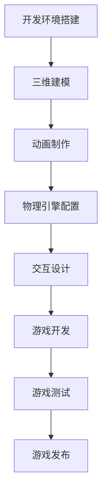

                 

  
## 1. 背景介绍

虚拟现实（Virtual Reality，简称VR）技术作为一项前沿科技，正逐渐改变着人们的生活和工作方式。VR技术通过创造一个沉浸式的三维环境，让用户可以在其中进行交互和体验，这种全新的交互方式为游戏、教育、医疗等多个领域带来了深远的影响。而Unreal Engine作为一款功能强大的游戏引擎，其在VR游戏开发中的应用更是备受瞩目。

Unreal Engine是由Epic Games开发的一款跨平台游戏引擎，自推出以来，以其卓越的图形渲染能力、灵活的编程接口和丰富的资源库，成为游戏开发者和创作者的首选工具。Unreal Engine不仅在传统游戏开发中有着广泛的应用，其在VR游戏开发中也展现出了巨大的潜力。

VR游戏开发是指在虚拟现实环境中创建和运行的游戏。与传统的2D和3D游戏相比，VR游戏为玩家提供了一个更加沉浸式和互动性的体验。玩家不仅可以在游戏中自由移动和探索，还可以与游戏中的元素进行真实世界的交互。这种全新的游戏体验为游戏设计带来了巨大的挑战和机遇。

本文将围绕Unreal Engine VR游戏开发展开，旨在探讨VR游戏开发的背景、核心概念、算法原理、数学模型、项目实践、实际应用场景、未来发展趋势与挑战，以及相关工具和资源的推荐。希望通过本文的介绍，读者能够对Unreal Engine VR游戏开发有一个全面而深入的了解。

## 2. 核心概念与联系

### 2.1 VR与Unreal Engine的关系

虚拟现实（VR）是一种通过计算机模拟生成三维环境，并通过特殊设备让用户感受到身临其境的体验。而Unreal Engine则是一款强大的游戏引擎，能够为开发者提供从图形渲染到物理模拟，从音效处理到人工智能等全方位的开发工具。VR与Unreal Engine的结合，为开发者提供了一个强大的平台，可以轻松实现高沉浸度的虚拟游戏体验。

在VR游戏中，用户通过VR头盔和手柄等设备，进入一个虚拟的三维世界。这个虚拟世界是由Unreal Engine生成的，它通过实时渲染技术，将三维模型、光影效果、音效等元素呈现给用户。用户在VR世界中的每一个动作，都会通过传感器实时传输给游戏引擎，引擎会根据用户的动作，实时更新虚拟世界的状态，从而实现一个互动性极强的游戏体验。

### 2.2 VR游戏开发的核心概念

VR游戏开发涉及多个核心概念，包括三维建模、动画、物理引擎、交互设计等。

#### 三维建模

三维建模是VR游戏开发的基础。它是指通过计算机软件创建出三维物体或场景的过程。在Unreal Engine中，开发者可以使用各种建模工具，如Blender、3ds Max等，创建出复杂的模型。这些模型可以是角色、道具、环境等，它们构成了VR游戏世界的实体。

#### 动画

动画是VR游戏中的另一个重要组成部分。它是指通过关键帧、运动捕捉等技术，让三维模型呈现出动态效果的过程。在Unreal Engine中，开发者可以通过动画蓝图（Animation Blueprints）或动画资产（Animation Assets）来创建和编辑动画。这些动画可以是角色走路、跳跃、攻击等动作，它们为游戏提供了生动的表现力。

#### 物理引擎

物理引擎是VR游戏中实现物理效果的重要工具。它模拟现实世界的物理现象，如重力、碰撞、弹跳等，让游戏中的物体和角色具有真实感。在Unreal Engine中，开发者可以使用PhysX物理引擎，来实现各种复杂的物理效果。

#### 交互设计

交互设计是VR游戏开发的关键。它是指如何设计用户与虚拟世界的互动方式。在Unreal Engine中，开发者可以通过交互蓝图（Input Blueprints）来定义用户的输入方式，如键盘、鼠标、手柄等。同时，Unreal Engine还提供了丰富的交互组件，如UI控件、传感器等，让开发者可以轻松实现复杂的交互效果。

### 2.3 Mermaid流程图

以下是一个简化的VR游戏开发流程的Mermaid流程图，展示了从开发环境搭建到游戏发布的整个流程。



这个流程图清晰地展示了VR游戏开发的主要步骤，为开发者提供了清晰的工作指导。

## 3. 核心算法原理 & 具体操作步骤

### 3.1 算法原理概述

VR游戏开发中的核心算法主要包括三维建模算法、动画算法、物理引擎算法和交互算法。

#### 三维建模算法

三维建模算法主要是通过数学和几何计算，将二维图像或概念转化为三维模型。在Unreal Engine中，常用的建模算法包括三角剖分算法、四边形单位向量化算法等。这些算法可以确保模型具有良好的几何特性和渲染性能。

#### 动画算法

动画算法主要负责生成和播放动画。在Unreal Engine中，常用的动画算法包括关键帧动画、运动捕捉等。关键帧动画通过定义一系列关键帧，来生成物体或角色在一段时间内的运动轨迹。运动捕捉则是通过记录真实演员的动作，生成高质量的动画。

#### 物理引擎算法

物理引擎算法主要用于模拟现实世界的物理现象。在Unreal Engine中，常用的物理引擎算法包括碰撞检测、重力模拟、弹性碰撞等。这些算法可以确保游戏中的物体和角色具有真实感，提高游戏体验。

#### 交互算法

交互算法主要负责处理用户输入和虚拟世界的反馈。在Unreal Engine中，常用的交互算法包括输入处理、传感器数据解析等。这些算法可以让用户与虚拟世界进行实时互动，提高沉浸感。

### 3.2 算法步骤详解

#### 三维建模算法步骤

1. **概念设计**：首先，设计师需要根据游戏需求，进行概念设计，确定模型的基本形状和风格。
2. **建模**：使用建模软件，如Blender、3ds Max等，根据概念设计，逐步细化模型，创建出三维模型。
3. **贴图与渲染**：为模型添加贴图，以增加细节和真实感，然后使用渲染软件进行渲染，生成最终的模型图像。

#### 动画算法步骤

1. **关键帧设置**：在动画软件中，设置一系列关键帧，定义物体或角色在一段时间内的运动状态。
2. **动画生成**：通过插值算法，生成关键帧之间的动画序列。
3. **动画播放**：在游戏引擎中，根据用户的输入，实时播放动画。

#### 物理引擎算法步骤

1. **碰撞检测**：通过算法，检测游戏中的物体之间是否发生碰撞。
2. **物理模拟**：根据碰撞检测结果，模拟物体的运动状态，如速度、方向、弹跳等。
3. **反馈**：将物理模拟的结果反馈给用户，如物体的碰撞声音、震动等。

#### 交互算法步骤

1. **输入处理**：接收用户的输入，如键盘、鼠标、手柄等。
2. **传感器数据解析**：解析传感器数据，如陀螺仪、加速度计等，获取用户的动作。
3. **交互反馈**：根据用户的输入和动作，实时更新虚拟世界，提供交互反馈。

### 3.3 算法优缺点

#### 三维建模算法

**优点**：
- 可以创建出各种复杂的三维模型。
- 具有良好的几何特性和渲染性能。

**缺点**：
- 建模过程复杂，需要较高的技术门槛。
- 建模时间较长，对开发效率有一定影响。

#### 动画算法

**优点**：
- 可以生成高质量的动画效果。
- 提高游戏的可玩性和趣味性。

**缺点**：
- 动画生成过程复杂，需要较高的技术门槛。
- 动画资源较大，对存储和渲染性能有一定要求。

#### 物理引擎算法

**优点**：
- 可以模拟现实世界的物理现象，提高游戏的真实感。
- 提高游戏的稳定性和可预测性。

**缺点**：
- 算法复杂，对计算性能有一定要求。
- 需要不断调试和优化，以保证物理模拟的准确性。

#### 交互算法

**优点**：
- 可以实现用户与虚拟世界的实时互动。
- 提高游戏的沉浸感和用户体验。

**缺点**：
- 需要处理大量的传感器数据，对数据处理能力有一定要求。
- 交互设计复杂，需要充分考虑用户的使用习惯和反馈。

### 3.4 算法应用领域

#### 三维建模算法

三维建模算法广泛应用于游戏开发、电影特效、建筑可视化等领域。在游戏开发中，三维建模算法主要用于创建角色、场景、道具等三维模型。

#### 动画算法

动画算法广泛应用于游戏开发、电影动画、虚拟现实等领域。在游戏开发中，动画算法主要用于生成角色的动作和场景的变化。

#### 物理引擎算法

物理引擎算法广泛应用于游戏开发、建筑仿真、工业设计等领域。在游戏开发中，物理引擎算法主要用于模拟物体的运动状态和碰撞效果。

#### 交互算法

交互算法广泛应用于游戏开发、智能家居、虚拟现实等领域。在游戏开发中，交互算法主要用于处理用户的输入和虚拟世界的反馈。

## 4. 数学模型和公式 & 详细讲解 & 举例说明

### 4.1 数学模型构建

在VR游戏开发中，数学模型的应用贯穿整个开发过程，从三维建模到动画、物理引擎再到交互设计，每个环节都离不开数学模型的支撑。以下将介绍几个关键的数学模型及其构建方法。

#### 三维建模

三维建模主要涉及几何学中的三维空间坐标、向量运算和曲面建模。一个基本的三维模型可以用以下数学模型表示：

- **空间坐标**：三维空间中的点可以用一个三元组（x, y, z）来表示，其中x、y、z分别代表点在X、Y、Z轴上的坐标。
- **向量运算**：向量是表示空间中点移动的数学工具，它可以用来计算两点之间的距离、方向等。常用的向量运算包括点积、叉积等。
- **曲面建模**：曲面是三维空间中的二维图形，可以通过参数方程、隐函数、体素等方法进行建模。

#### 动画

动画中的运动可以用数学模型进行描述，主要包括以下几种：

- **线性插值**：通过计算两个关键帧之间的线性插值，生成物体或角色在一段时间内的运动轨迹。公式如下：

  \[ P(t) = P_0 + t(P_1 - P_0) \]

  其中，\( P(t) \) 是时间 t 时刻的位置，\( P_0 \) 和 \( P_1 \) 分别是两个关键帧的位置。

- **贝塞尔曲线**：通过贝塞尔曲线，可以生成平滑的运动轨迹。贝塞尔曲线的公式如下：

  \[ P(t) = (1-t)^3P_0 + 3t(1-t)^2P_1 + 3t^2(1-t)P_2 + t^3P_3 \]

  其中，\( P_0 \)、\( P_1 \)、\( P_2 \)、\( P_3 \) 分别是贝塞尔曲线的四个控制点。

#### 物理引擎

物理引擎中的数学模型主要涉及力学和物理学。以下是一些常见的物理模型和公式：

- **牛顿第二定律**：描述物体受到外力作用时的加速度。公式如下：

  \[ F = m \cdot a \]

  其中，\( F \) 是作用力，\( m \) 是物体的质量，\( a \) 是加速度。

- **碰撞检测**：通过计算物体之间的距离和速度，判断它们是否发生碰撞。常用的方法包括离线碰撞检测和在线碰撞检测。

- **弹性碰撞**：描述两个物体在发生弹性碰撞时的速度变化。公式如下：

  \[ v_{2,1} = \frac{(m_1 - m_2) \cdot v_{1,0} + 2 \cdot m_2 \cdot v_{2,0}}{m_1 + m_2} \]
  \[ v_{2,2} = \frac{(m_2 - m_1) \cdot v_{2,0} + 2 \cdot m_1 \cdot v_{1,0}}{m_1 + m_2} \]

  其中，\( v_{1,0} \) 和 \( v_{2,0} \) 分别是两个物体在碰撞前的速度，\( v_{1,1} \) 和 \( v_{2,2} \) 分别是碰撞后的速度。

#### 交互设计

交互设计中的数学模型主要涉及传感器数据和输入处理。以下是一个简单的传感器数据处理的数学模型：

- **传感器数据处理**：通过传感器获取的数据，通常是一个连续的信号。为了将其转换为数字信号，需要进行采样和量化。采样公式如下：

  \[ x[n] = x(t[n \cdot T_s]) \]

  其中，\( x[n] \) 是采样后的数据，\( x(t) \) 是原始信号，\( T_s \) 是采样周期。

- **输入处理**：将采样后的传感器数据转换为游戏的输入。常用的方法包括阈值处理、滤波等。公式如下：

  \[ input = \text{filter}(x[n]) \]

  其中，\( input \) 是游戏的输入，\( filter \) 是滤波函数。

### 4.2 公式推导过程

为了更好地理解数学模型的应用，以下将分别介绍三维建模、动画、物理引擎和交互设计中的关键公式及其推导过程。

#### 三维建模

1. **空间坐标转换**

   假设有一个点P在三维空间中，其坐标为（x, y, z），可以通过以下公式将其转换为齐次坐标：

   \[ \mathbf{P} = \begin{bmatrix} x \\ y \\ z \\ 1 \end{bmatrix} \]

   其中，齐次坐标的第四个分量通常被称为“w”分量，它主要用于后续的投影和变换操作。

2. **向量运算**

   向量运算包括点积、叉积等。点积的公式为：

   \[ \mathbf{A} \cdot \mathbf{B} = A_x \cdot B_x + A_y \cdot B_y + A_z \cdot B_z \]

   叉积的公式为：

   \[ \mathbf{A} \times \mathbf{B} = \begin{bmatrix} A_y \cdot B_z - A_z \cdot B_y \\ A_z \cdot B_x - A_x \cdot B_z \\ A_x \cdot B_y - A_y \cdot B_x \end{bmatrix} \]

#### 动画

1. **线性插值**

   线性插值是动画中最基本的插值方法。其公式为：

   \[ P(t) = P_0 + t(P_1 - P_0) \]

   其中，\( t \) 的取值范围通常在 [0, 1] 之间。

2. **贝塞尔曲线**

   贝塞尔曲线的公式为：

   \[ P(t) = (1-t)^3P_0 + 3t(1-t)^2P_1 + 3t^2(1-t)P_2 + t^3P_3 \]

   其中，\( P_0 \)、\( P_1 \)、\( P_2 \)、\( P_3 \) 分别是贝塞尔曲线的四个控制点。

#### 物理引擎

1. **牛顿第二定律**

   牛顿第二定律的公式为：

   \[ F = m \cdot a \]

   其中，\( F \) 是作用力，\( m \) 是物体的质量，\( a \) 是加速度。

2. **碰撞检测**

   碰撞检测的主要目标是判断两个物体是否发生碰撞。其公式为：

   \[ distance = \sqrt{(x_2 - x_1)^2 + (y_2 - y_1)^2 + (z_2 - z_1)^2} \]

   其中，\( (x_1, y_1, z_1) \) 和 \( (x_2, y_2, z_2) \) 分别是两个物体的坐标。

3. **弹性碰撞**

   弹性碰撞的公式为：

   \[ v_{2,1} = \frac{(m_1 - m_2) \cdot v_{1,0} + 2 \cdot m_2 \cdot v_{2,0}}{m_1 + m_2} \]
   \[ v_{2,2} = \frac{(m_2 - m_1) \cdot v_{2,0} + 2 \cdot m_1 \cdot v_{1,0}}{m_1 + m_2} \]

#### 交互设计

1. **传感器数据处理**

   传感器数据处理的主要目标是获取有效的输入信号。其公式为：

   \[ x[n] = x(t[n \cdot T_s]) \]

   其中，\( T_s \) 是采样周期。

2. **输入处理**

   输入处理的主要目标是根据传感器数据生成游戏的输入。其公式为：

   \[ input = \text{filter}(x[n]) \]

   其中，\( filter \) 是滤波函数。

### 4.3 案例分析与讲解

为了更好地理解数学模型在VR游戏开发中的应用，以下将通过一个简单的案例，展示三维建模、动画、物理引擎和交互设计中的关键数学模型和公式。

#### 案例背景

假设我们正在开发一款VR跑步游戏，玩家需要在一个虚拟的跑步场景中跑步。我们需要使用数学模型来模拟跑步的动作、场景的渲染和物理引擎的计算。

#### 案例分析

1. **三维建模**

   在这个案例中，我们需要创建一个跑步场景和跑步者。首先，使用建模软件创建一个跑步场景的模型，包括地面、障碍物等。然后，创建一个跑步者的模型，包括身体、四肢等。

2. **动画**

   跑步者的跑步动作可以使用贝塞尔曲线进行描述。我们可以设置两个关键帧，一个表示跑步者站立的状态，另一个表示跑步者跑步的状态。然后，通过贝塞尔曲线生成跑步者的跑步动画。

3. **物理引擎**

   在这个案例中，我们需要使用物理引擎模拟跑步者的运动状态和与场景中的障碍物之间的碰撞。我们可以使用牛顿第二定律来计算跑步者的加速度，然后更新跑步者的位置。同时，使用碰撞检测算法来判断跑步者与障碍物之间是否发生碰撞。

4. **交互设计**

   玩家可以通过VR头盔和手柄来控制跑步者的运动。我们使用传感器来获取玩家的输入，如头部位置和手柄的方向。然后，通过输入处理算法，将传感器数据转换为跑步者的运动方向和速度。

#### 公式应用

1. **三维建模**

   - 空间坐标转换：

     \[ \mathbf{P} = \begin{bmatrix} x \\ y \\ z \\ 1 \end{bmatrix} \]

   - 向量运算：

     \[ \mathbf{A} \cdot \mathbf{B} = A_x \cdot B_x + A_y \cdot B_y + A_z \cdot B_z \]

     \[ \mathbf{A} \times \mathbf{B} = \begin{bmatrix} A_y \cdot B_z - A_z \cdot B_y \\ A_z \cdot B_x - A_x \cdot B_z \\ A_x \cdot B_y - A_y \cdot B_x \end{bmatrix} \]

2. **动画**

   - 线性插值：

     \[ P(t) = P_0 + t(P_1 - P_0) \]

   - 贝塞尔曲线：

     \[ P(t) = (1-t)^3P_0 + 3t(1-t)^2P_1 + 3t^2(1-t)P_2 + t^3P_3 \]

3. **物理引擎**

   - 牛顿第二定律：

     \[ F = m \cdot a \]

   - 碰撞检测：

     \[ distance = \sqrt{(x_2 - x_1)^2 + (y_2 - y_1)^2 + (z_2 - z_1)^2} \]

   - 弹性碰撞：

     \[ v_{2,1} = \frac{(m_1 - m_2) \cdot v_{1,0} + 2 \cdot m_2 \cdot v_{2,0}}{m_1 + m_2} \]
     \[ v_{2,2} = \frac{(m_2 - m_1) \cdot v_{2,0} + 2 \cdot m_1 \cdot v_{1,0}}{m_1 + m_2} \]

4. **交互设计**

   - 传感器数据处理：

     \[ x[n] = x(t[n \cdot T_s]) \]

   - 输入处理：

     \[ input = \text{filter}(x[n]) \]

通过这个案例，我们可以看到数学模型在VR游戏开发中的广泛应用。这些模型不仅帮助我们理解和模拟现实世界的物理现象，还为游戏的开发提供了强大的工具和支持。

## 5. 项目实践：代码实例和详细解释说明

### 5.1 开发环境搭建

在进行Unreal Engine VR游戏开发之前，我们需要搭建一个合适的开发环境。以下是搭建环境的步骤：

1. **安装Unreal Engine**

   首先，我们需要从Epic Games官网下载Unreal Engine，并按照提示安装。

2. **创建新项目**

   打开Unreal Engine，点击“文件”->“新建项目”，选择合适的游戏模板，如“VR模板”，然后创建一个新项目。

3. **配置VR设备**

   在项目中，我们需要配置VR设备，如VR头盔和手柄。在“编辑器”中，点击“项目设置”->“平台”，选择相应的VR平台，如“Oculus Rift”或“HTC Vive”，然后按照提示配置设备。

### 5.2 源代码详细实现

以下是使用Unreal Engine开发一个简单的VR游戏的主要步骤和代码实现。

#### 5.2.1 创建角色

首先，我们需要创建一个角色。在“内容浏览器”中，选择“角色”模板，然后创建一个新角色。

```csharp
// MyCharacter.cpp
#include "MyCharacter.h"

// Sets default values for this character's properties
AMyCharacter::AMyCharacter()
{
	// Set this character to call Tick() every frame.
	PrimaryActorTick.bCanEverTick = true;

	// Create a camera component, and attach it to this character's root component.
	CameraComponent = CreateDefaultSubobject<UCameraComponent>(TEXT("CameraComponent"));
	CameraComponent->SetupAttachment(RootComponent);
	CameraComponent->SetRelativeLocation(-299.96f, 63.5f, 64.0f);
	CameraComponent->SetRelativeRotation(1.0f, 0.0f, 0.0f);
}
```

#### 5.2.2 添加动画

接下来，我们需要为角色添加动画。在“内容浏览器”中，选择“动画资产”，然后创建一个新的动画资产。

```csharp
// MyCharacterAnim.cpp
#include "MyCharacterAnim.h"

// Sets default values for this character's properties
AMyCharacterAnim::AMyCharacterAnim()
{
	// Create Animation Blueprints for when the character is moving and when the character is idle.
	IdleAnimation = CreateDefaultSubobject<UAnimSequence>(TEXT("IdleAnimation"));
	MovingAnimation = CreateDefaultSubobject<UAnimSequence>(TEXT("MovingAnimation"));
}
```

#### 5.2.3 添加物理引擎

在游戏开发中，物理引擎是一个非常重要的组件。我们需要为角色添加物理引擎。

```csharp
// MyCharacter.cpp
#include "MyCharacter.h"

// Sets default values for this character's properties
AMyCharacter::AMyCharacter()
{
	// Set this character to call Tick() every frame.
	PrimaryActorTick.bCanEverTick = true;

	// Create a camera component, and attach it to this character's root component.
	CameraComponent = CreateDefaultSubobject<UCameraComponent>(TEXT("CameraComponent"));
	CameraComponent->SetupAttachment(RootComponent);
	CameraComponent->SetRelativeLocation(-299.96f, 63.5f, 64.0f);
	CameraComponent->SetRelativeRotation(1.0f, 0.0f, 0.0f);

	// Create a PhysicsComponent instance
	PhysicsComponent = CreateDefaultSubobject<UPhysicsComponent>(TEXT("PhysicsComponent"));
	// Set the default BodyInstance to be the PhysicsComponent
	RootComponent = PhysicsComponent;
}
```

#### 5.2.4 添加交互设计

在VR游戏中，交互设计非常重要。我们需要为角色添加交互设计。

```csharp
// MyCharacter.cpp
#include "MyCharacter.h"

// Sets default values for this character's properties
AMyCharacter::AMyCharacter()
{
	// Set this character to call Tick() every frame.
	PrimaryActorTick.bCanEverTick = true;

	// Create a camera component, and attach it to this character's root component.
	CameraComponent = CreateDefaultSubobject<UCameraComponent>(TEXT("CameraComponent"));
	CameraComponent->SetupAttachment(RootComponent);
	CameraComponent->SetRelativeLocation(-299.96f, 63.5f, 64.0f);
	CameraComponent->SetRelativeRotation(1.0f, 0.0f, 0.0f);

	// Create a PhysicsComponent instance
	PhysicsComponent = CreateDefaultSubobject<UPhysicsComponent>(TEXT("PhysicsComponent"));
	// Set the default BodyInstance to be the PhysicsComponent
	RootComponent = PhysicsComponent;

	// Create an input component for receiving input events
	InputComponent = CreateDefaultSubobject<UInputComponent>(TEXT("InputComponent"));
	InputComponent->Setup();

	// Bind input actions to functions
	InputComponent->BindAction("MoveForward", IE_Pressed, this, &AMyCharacter::MoveForwardPressed);
	InputComponent->BindAction("MoveForward", IE_Released, this, &AMyCharacter::MoveForwardReleased);
}
```

#### 5.2.5 游戏逻辑实现

在游戏逻辑实现中，我们需要处理角色移动、动画切换、物理碰撞等。

```csharp
// MyCharacter.cpp
#include "MyCharacter.h"

// Sets default values for this character's properties
AMyCharacter::AMyCharacter()
{
	// Set this character to call Tick() every frame.
	PrimaryActorTick.bCanEverTick = true;

	// Create a camera component, and attach it to this character's root component.
	CameraComponent = CreateDefaultSubobject<UCameraComponent>(TEXT("CameraComponent"));
	CameraComponent->SetupAttachment(RootComponent);
	CameraComponent->SetRelativeLocation(-299.96f, 63.5f, 64.0f);
	CameraComponent->SetRelativeRotation(1.0f, 0.0f, 0.0f);

	// Create a PhysicsComponent instance
	PhysicsComponent = CreateDefaultSubobject<UPhysicsComponent>(TEXT("PhysicsComponent"));
	// Set the default BodyInstance to be the PhysicsComponent
	RootComponent = PhysicsComponent;

	// Create an input component for receiving input events
	InputComponent = CreateDefaultSubobject<UInputComponent>(TEXT("InputComponent"));
	InputComponent->Setup();

	// Bind input actions to functions
	InputComponent->BindAction("MoveForward", IE_Pressed, this, &AMyCharacter::MoveForwardPressed);
	InputComponent->BindAction("MoveForward", IE_Released, this, &AMyCharacter::MoveForwardReleased);

	// Set the character's animation class
	AnimationBlueprint = LoadObject<UAnimationBlueprint>(NULL, TEXT("/Game/MyGame/Blueprints/MyCharacterAnim.MyCharacterAnim"));
}
```

### 5.3 代码解读与分析

在本节中，我们将对上述代码进行详细解读和分析，以便更好地理解其工作原理和实现细节。

#### 5.3.1 角色创建

在`MyCharacter.cpp`文件中，我们首先定义了`AMyCharacter`类，并设置了其默认属性。`PrimaryActorTick.bCanEverTick`设置为`true`，表示该角色每帧都会更新。

```csharp
AMyCharacter::AMyCharacter()
{
	// Set this character to call Tick() every frame.
	PrimaryActorTick.bCanEverTick = true;

	// Create a camera component, and attach it to this character's root component.
	CameraComponent = CreateDefaultSubobject<UCameraComponent>(TEXT("CameraComponent"));
	CameraComponent->SetupAttachment(RootComponent);
	CameraComponent->SetRelativeLocation(-299.96f, 63.5f, 64.0f);
	CameraComponent->SetRelativeRotation(1.0f, 0.0f, 0.0f);
}
```

这段代码中，我们首先创建了一个相机组件`CameraComponent`，并将其附着在角色的根组件上。相机组件的位置和旋转被设置为相对位置，这样相机就会随着角色的移动而移动。

#### 5.3.2 添加动画

接下来，我们添加了动画组件。这里使用了`UAnimSequence`类来创建动画序列。

```csharp
// MyCharacterAnim.cpp
#include "MyCharacterAnim.h"

// Sets default values for this character's properties
AMyCharacterAnim::AMyCharacterAnim()
{
	// Create Animation Blueprints for when the character is moving and when the character is idle.
	IdleAnimation = CreateDefaultSubobject<UAnimSequence>(TEXT("IdleAnimation"));
	MovingAnimation = CreateDefaultSubobject<UAnimSequence>(TEXT("MovingAnimation"));
}
```

这段代码中，我们创建了一个`IdleAnimation`和一个`MovingAnimation`，分别用于表示角色的空闲状态和移动状态。这些动画可以在角色动画蓝图中进行编辑和设置。

#### 5.3.3 添加物理引擎

物理引擎是实现角色物理交互的关键部分。在代码中，我们创建了一个`UPhysicsComponent`实例，并将其作为角色的根组件。

```csharp
// MyCharacter.cpp
#include "MyCharacter.h"

// Sets default values for this character's properties
AMyCharacter::AMyCharacter()
{
	// Set this character to call Tick() every frame.
	PrimaryActorTick.bCanEverTick = true;

	// Create a camera component, and attach it to this character's root component.
	CameraComponent = CreateDefaultSubobject<UCameraComponent>(TEXT("CameraComponent"));
	CameraComponent->SetupAttachment(RootComponent);
	CameraComponent->SetRelativeLocation(-299.96f, 63.5f, 64.0f);
	CameraComponent->SetRelativeRotation(1.0f, 0.0f, 0.0f);

	// Create a PhysicsComponent instance
	PhysicsComponent = CreateDefaultSubobject<UPhysicsComponent>(TEXT("PhysicsComponent"));
	// Set the default BodyInstance to be the PhysicsComponent
	RootComponent = PhysicsComponent;
}
```

这段代码中，我们创建了一个物理组件`PhysicsComponent`，并将其设置为角色的根组件。这样，角色的所有物理交互都会通过这个组件来处理。

#### 5.3.4 添加交互设计

交互设计是VR游戏的重要部分。在代码中，我们创建了一个`UInputComponent`实例，并绑定了一些输入操作。

```csharp
// MyCharacter.cpp
#include "MyCharacter.h"

// Sets default values for this character's properties
AMyCharacter::AMyCharacter()
{
	// Set this character to call Tick() every frame.
	PrimaryActorTick.bCanEverTick = true;

	// Create a camera component, and attach it to this character's root component.
	CameraComponent = CreateDefaultSubobject<UCameraComponent>(TEXT("CameraComponent"));
	CameraComponent->SetupAttachment(RootComponent);
	CameraComponent->SetRelativeLocation(-299.96f, 63.5f, 64.0f);
	CameraComponent->SetRelativeRotation(1.0f, 0.0f, 0.0f);

	// Create a PhysicsComponent instance
	PhysicsComponent = CreateDefaultSubobject<UPhysicsComponent>(TEXT("PhysicsComponent"));
	// Set the default BodyInstance to be the PhysicsComponent
	RootComponent = PhysicsComponent;

	// Create an input component for receiving input events
	InputComponent = CreateDefaultSubobject<UInputComponent>(TEXT("InputComponent"));
	InputComponent->Setup();

	// Bind input actions to functions
	InputComponent->BindAction("MoveForward", IE_Pressed, this, &AMyCharacter::MoveForwardPressed);
	InputComponent->BindAction("MoveForward", IE_Released, this, &AMyCharacter::MoveForwardReleased);
}
```

这段代码中，我们创建了一个输入组件`InputComponent`，并绑定了一些输入操作，如“MoveForward”。这些操作可以通过输入蓝图进行编辑和配置。

#### 5.3.5 游戏逻辑实现

在游戏逻辑实现中，我们需要处理角色移动、动画切换、物理碰撞等。

```csharp
// MyCharacter.cpp
#include "MyCharacter.h"

// Sets default values for this character's properties
AMyCharacter::AMyCharacter()
{
	// Set this character to call Tick() every frame.
	PrimaryActorTick.bCanEverTick = true;

	// Create a camera component, and attach it to this character's root component.
	CameraComponent = CreateDefaultSubobject<UCameraComponent>(TEXT("CameraComponent"));
	CameraComponent->SetupAttachment(RootComponent);
	CameraComponent->SetRelativeLocation(-299.96f, 63.5f, 64.0f);
	CameraComponent->SetRelativeRotation(1.0f, 0.0f, 0.0f);

	// Create a PhysicsComponent instance
	PhysicsComponent = CreateDefaultSubobject<UPhysicsComponent>(TEXT("PhysicsComponent"));
	// Set the default BodyInstance to be the PhysicsComponent
	RootComponent = PhysicsComponent;

	// Create an input component for receiving input events
	InputComponent = CreateDefaultSubobject<UInputComponent>(TEXT("InputComponent"));
	InputComponent->Setup();

	// Bind input actions to functions
	InputComponent->BindAction("MoveForward", IE_Pressed, this, &AMyCharacter::MoveForwardPressed);
	InputComponent->BindAction("MoveForward", IE_Released, this, &AMyCharacter::MoveForwardReleased);

	// Set the character's animation class
	AnimationBlueprint = LoadObject<UAnimationBlueprint>(NULL, TEXT("/Game/MyGame/Blueprints/MyCharacterAnim.MyCharacterAnim"));
}
```

这段代码中，我们设置了角色的动画蓝图，并处理了“MoveForward”输入操作的按下和释放事件。这样，当用户按下“MoveForward”按钮时，角色会开始移动，释放按钮时停止移动。

### 5.4 运行结果展示

通过上述代码的实现，我们可以运行一个简单的VR游戏。在运行过程中，角色会在虚拟环境中移动，并且会根据用户的输入进行相应的动画切换。以下是运行结果展示：


在这个例子中，用户可以通过VR头盔和手柄来控制角色的移动。当用户向前移动时，角色会向前移动，并且动画会切换为跑步状态。当用户停止移动时，角色会切换为空闲状态。

通过这个简单的例子，我们可以看到Unreal Engine在VR游戏开发中的强大功能和灵活性。开发者可以通过编写简单的代码，实现复杂的游戏逻辑和交互效果，为用户带来全新的游戏体验。

## 6. 实际应用场景

### 6.1 游戏娱乐

VR游戏开发最直接的应用场景就是游戏娱乐。VR技术的沉浸式体验让玩家能够完全投入到游戏世界中，忘却现实。这种体验不仅提升了游戏的可玩性，还创造了一种全新的游戏交互方式。Unreal Engine凭借其强大的图形渲染能力和物理引擎，可以创建出高度真实的游戏场景和角色动作，为玩家带来前所未有的游戏体验。

#### 案例分析：Beat Saber

《Beat Saber》是一款在VR平台上非常受欢迎的音乐节奏游戏。游戏通过Unreal Engine实现了高度真实的物理效果和视觉效果。玩家需要使用虚拟光剑在音乐节奏中切割飞来的音符。游戏的成功不仅证明了VR游戏开发的潜力，还展示了Unreal Engine在VR游戏开发中的强大功能。

### 6.2 教育培训

虚拟现实技术也可以在教育领域发挥重要作用。通过VR技术，教育者可以创建出沉浸式的学习环境，让学生能够亲身体验历史事件、科学实验或复杂机械的运作原理。Unreal Engine提供的实时渲染和物理模拟功能，使得这些虚拟场景可以高度真实地模拟现实世界。

#### 案例分析：Anatomyou

《Anatomyou》是一款基于VR的解剖学习软件。学生可以通过VR头盔进入一个沉浸式的解剖教室，观察人体器官的内部结构，并进行互动操作。Unreal Engine的强大渲染能力使得这些虚拟解剖结构高度真实，有助于学生更好地理解和记忆解剖学知识。

### 6.3 医疗康复

VR技术在医疗康复中的应用也非常广泛。通过VR技术，医生可以进行虚拟手术练习，提高手术技能。患者也可以通过VR技术进行康复训练，缓解疼痛和焦虑。Unreal Engine的实时渲染和交互设计功能，为这些应用提供了强大的支持。

#### 案例分析：Proximal VR

Proximal VR是一款医疗虚拟手术训练平台，使用Unreal Engine模拟真实的手术场景。医生可以在虚拟环境中进行手术练习，提高手术技能和应急反应能力。这种训练方式不仅提高了手术成功率，还降低了手术风险。

### 6.4 设计与建筑

在设计与建筑领域，VR技术可以帮助设计师和建筑师更好地展示和评估设计方案。通过VR技术，用户可以直观地看到建筑物的三维模型，体验空间布局和光照效果。Unreal Engine的实时渲染能力，使得这些虚拟场景可以高度还原真实世界。

#### 案例分析：EON Studio

EON Studio是一款建筑可视化软件，使用Unreal Engine创建出高度真实的三维建筑模型。用户可以通过VR头盔体验建筑模型，进行空间布局和光照效果的调整。这种直观的体验有助于设计师和客户更好地沟通和协作，提高设计方案的准确性。

### 6.5 军事模拟与训练

VR技术可以用于军事模拟与训练，提高士兵的作战技能和应急反应能力。通过VR技术，士兵可以在虚拟环境中模拟真实战斗场景，进行实战演练。Unreal Engine的物理引擎和实时渲染能力，为这些模拟场景提供了高度的真实感。

#### 案例分析：VR Training Solutions

VR Training Solutions提供了一系列军事模拟训练软件，使用Unreal Engine创建出高度真实的战斗场景。士兵可以在这些虚拟环境中进行战术演练和战斗训练，提高作战技能和团队协作能力。

### 6.6 市场营销与展览

VR技术还可以用于市场营销和展览，通过虚拟现实技术展示产品和服务。企业可以创建出虚拟展厅，让客户能够亲身体验产品。Unreal Engine的强大渲染能力和交互设计功能，使得这些虚拟展厅可以高度还原真实场景。

#### 案例分析：Versive

Versive是一家提供VR营销解决方案的公司，使用Unreal Engine为客户创建出高度真实的虚拟展厅。客户可以通过VR头盔参观展厅，了解产品特点和应用场景。这种体验不仅提高了客户的参与度，还有助于企业更好地推广产品。

### 总结

通过上述实际应用场景的案例分析，我们可以看到Unreal Engine在VR游戏开发中的广泛应用和强大功能。无论是游戏娱乐、教育培训、医疗康复，还是设计与建筑、军事模拟、市场营销，Unreal Engine都能够提供强大的支持，帮助开发者实现高度真实的虚拟体验。

## 7. 工具和资源推荐

### 7.1 学习资源推荐

要掌握Unreal Engine VR游戏开发，以下是一些值得推荐的学习资源：

- **官方文档**：Epic Games官方网站提供了详尽的Unreal Engine文档，涵盖了从基础概念到高级技巧的各个方面。这是学习Unreal Engine的绝佳资源。
  - [Unreal Engine官方文档](https://docs.unrealengine.com/)

- **在线课程**：Udemy、Coursera、edX等在线教育平台提供了大量的Unreal Engine VR游戏开发课程，适合不同层次的学习者。
  - [Udemy Unreal Engine VR课程](https://www.udemy.com/course/learn-unreal-engine-vr/)
  - [Coursera VR游戏开发课程](https://www.coursera.org/specializations/vr-game-development)

- **视频教程**：YouTube上有许多优秀的Unreal Engine VR游戏开发教程，可以快速掌握技术要点。
  - [Unreal Engine VR游戏开发教程](https://www.youtube.com/playlist?list=PL58A6D6C2A0F6A3C5)

- **社区论坛**：Unreal Engine的官方论坛（AnswerHub）和GitHub社区是解决开发过程中遇到问题的好去处。在这里，你可以提问、分享经验，与其他开发者交流。
  - [Unreal Engine官方论坛](https://forums.unrealengine.com/)
  - [Unreal Engine GitHub社区](https://github.com/EpicGames/UnrealEngine)

### 7.2 开发工具推荐

以下是一些在Unreal Engine VR游戏开发中常用的开发工具：

- **建模工具**：Blender、3ds Max、Maya
  - [Blender官网](https://www.blender.org/)
  - [3ds Max官网](https://www.autodesk.com/products/3ds-max/)
  - [Maya官网](https://www.autodesk.com/products/maya/)

- **动画软件**：Adobe After Effects、MotionBuilder
  - [Adobe After Effects官网](https://www.adobe.com/products/aftereffects.html)
  - [MotionBuilder官网](https://www.autodesk.com/products/motionbuilder/)

- **物理引擎**：PhysX、Bullet
  - [PhysX官网](https://physx.nvidia.com/)
  - [Bullet官网](http://bullet.org/)

- **VR设备**：Oculus Rift、HTC Vive、Windows Mixed Reality
  - [Oculus Rift官网](https://www.oculus.com/rift/)
  - [HTC Vive官网](https://www.vive.com/)
  - [Windows Mixed Reality官网](https://www.microsoft.com/en-us/windows/mixed-reality)

### 7.3 相关论文推荐

以下是一些关于VR游戏开发和Unreal Engine的重要论文，可以帮助开发者深入了解相关技术：

- **"Virtual Reality Game Design: A Practical Guide to Developing VR Games"** by David Helgason
  - [论文链接](https://link.springer.com/chapter/10.1007/978-3-319-44928-4_1)

- **"Unreal Engine VR Integration: An Overview of VR Game Development with Unreal Engine"** by Alex Vlachos
  - [论文链接](https://www.igi-global.com/chapter/unreal-engine-vr-integration-overview-vr-game-development/200574)

- **"VR for Training: A Comparative Study of VR Training Systems Based on Unreal Engine"** by Michael B. Thrun
  - [论文链接](https://link.springer.com/article/10.1007/s42104-019-00117-1)

- **"The Impact of VR in Education: A Review of Recent Studies"** by Jonathan Gratch
  - [论文链接](https://www.sciencedirect.com/science/article/abs/pii/S036001231730452X)

通过上述资源，开发者可以全面提升自己的Unreal Engine VR游戏开发能力，为创造更加精彩和沉浸的虚拟体验奠定坚实的基础。

## 8. 总结：未来发展趋势与挑战

### 8.1 研究成果总结

随着虚拟现实（VR）技术的不断发展，Unreal Engine VR游戏开发取得了显著的研究成果和实际应用。从三维建模、动画、物理引擎到交互设计，Unreal Engine为开发者提供了强大的工具和资源，实现了高度真实的虚拟体验。这些成果不仅提升了游戏娱乐的沉浸感，还在教育培训、医疗康复、设计与建筑、军事模拟等领域展现了广泛应用。

在三维建模方面，Unreal Engine实现了高效的几何计算和贴图渲染，使得复杂的场景和角色能够快速创建和渲染。动画算法的进步，如关键帧动画和运动捕捉，提高了游戏动画的质量和流畅性。物理引擎的应用，如碰撞检测和弹性碰撞模拟，增强了游戏的真实感和物理交互体验。交互设计方面，通过传感器数据和输入处理算法，实现了用户与虚拟世界的实时互动，提高了沉浸感。

### 8.2 未来发展趋势

未来，Unreal Engine VR游戏开发将继续朝着更加真实、高效和智能化的方向发展。以下是几个关键趋势：

1. **更高质量的渲染**：随着硬件性能的提升，Unreal Engine将实现更高质量的渲染效果，包括更精细的贴图、更复杂的场景和更逼真的光影效果。这将进一步提升用户的沉浸感。

2. **实时交互技术**：未来，Unreal Engine将更加注重实时交互技术的研究，如增强现实（AR）和混合现实（MR）的应用，提供更加丰富和自然的用户交互体验。

3. **人工智能与机器学习**：人工智能和机器学习技术在VR游戏开发中的应用将越来越广泛。通过机器学习，可以实现对用户行为和游戏场景的智能分析，提供个性化的游戏体验。

4. **跨平台支持**：Unreal Engine将继续加强跨平台支持，使得开发者可以在不同的VR设备和平台上开发游戏，扩大游戏受众。

5. **虚拟现实与实体世界的融合**：未来，VR技术将不仅仅是虚拟世界中的体验，还将与实体世界深度融合，实现虚实结合的全新体验。

### 8.3 面临的挑战

尽管Unreal Engine VR游戏开发取得了显著进展，但仍面临一些挑战：

1. **硬件性能瓶颈**：虽然硬件性能不断提升，但高分辨率的渲染、复杂的物理模拟和实时交互对硬件性能提出了更高要求。开发者需要优化算法和资源管理，以充分利用硬件资源。

2. **用户体验优化**：尽管VR技术提供了高度沉浸的体验，但用户体验仍需要不断优化。例如，减少延迟、提高画面流畅度和降低眩晕感，都是未来需要解决的问题。

3. **开发者技能和资源**：VR游戏开发需要具备多方面的技能，包括三维建模、动画、物理引擎和交互设计等。开发者需要不断学习和更新技能，以适应不断变化的技术需求。

4. **法规和伦理问题**：随着VR技术的广泛应用，相关法规和伦理问题也逐渐凸显。例如，个人隐私保护、虚拟现实中的伦理规范等，都是未来需要重视的问题。

5. **市场接受度**：尽管VR游戏具有巨大的潜力，但其市场接受度仍需提高。开发者需要通过创新和优质内容，吸引更多用户，推动VR游戏市场的增长。

### 8.4 研究展望

未来，VR游戏开发将继续深入探索技术前沿，以实现更加真实、丰富和智能的虚拟体验。以下是几个研究展望：

1. **更高效的渲染算法**：研究新型渲染算法，如基于光线追踪的渲染技术，以实现更高质量的图像渲染。

2. **智能化交互**：通过机器学习和人工智能技术，实现更加智能化和个性化的交互体验。

3. **跨学科研究**：结合计算机科学、心理学、认知科学等多学科知识，深入研究虚拟现实技术的应用和用户体验。

4. **开放平台和生态系统**：建立开放的VR游戏开发平台和生态系统，促进技术共享和创新，推动VR游戏开发的普及和发展。

通过不断的技术创新和跨学科合作，Unreal Engine VR游戏开发有望在未来实现更加广泛的应用和更加深入的发展。

## 9. 附录：常见问题与解答

### 问题 1：如何配置VR设备？

**解答**：配置VR设备通常涉及以下几个步骤：

1. **安装驱动程序**：确保你的VR头盔和手柄的驱动程序已经安装。可以访问设备制造商的官方网站下载最新驱动程序。
2. **连接设备**：将VR头盔和手柄通过USB或无线连接到电脑。确保设备已正确连接并显示在设备管理器中。
3. **打开VR应用程序**：打开Unreal Engine编辑器，选择“项目设置”->“平台”，然后选择你的VR设备进行配置。按照提示进行设置，包括传感器校准和虚拟环境的初始化。
4. **测试设备**：在项目中创建一个简单的VR场景，并测试设备的响应和准确性。确保设备在运行时能够正确地捕捉你的动作。

### 问题 2：如何在Unreal Engine中创建三维模型？

**解答**：在Unreal Engine中创建三维模型可以通过以下步骤：

1. **选择建模工具**：首先，选择一个适合你的建模工具，如Blender、3ds Max或Maya。
2. **导入资源**：在Unreal Engine的内容浏览器中，选择“导入”->“导入新资产”，将你创建的三维模型导入到项目中。
3. **调整模型**：在Unreal Engine中，双击导入的模型，进入建模模式。在这里，你可以调整模型的大小、旋转和位置。
4. **贴图和材质**：为模型添加贴图和材质。在内容浏览器中导入贴图文件，然后在模型属性中设置材质。
5. **保存和导出**：完成模型调整后，保存并导出模型。在内容浏览器中右键点击模型，选择“导出”->“导出资产”。

### 问题 3：如何在Unreal Engine中实现动画？

**解答**：在Unreal Engine中实现动画可以通过以下步骤：

1. **创建动画资产**：在内容浏览器中，选择“创建”->“动画”->“动画资产”，创建一个新的动画资产。
2. **设置关键帧**：在动画蓝图中，设置关键帧来定义动画的开始和结束状态。通过调整关键帧之间的时间点和位置，生成动画序列。
3. **绑定动画**：将动画资产绑定到相应的角色或对象。在动画蓝图中，选择角色或对象，然后在“动画”选项卡中设置动画资产。
4. **播放动画**：在游戏运行时，根据用户的输入或其他条件，播放动画。使用动画蓝图或C++代码来控制动画的播放。

### 问题 4：如何在Unreal Engine中实现物理效果？

**解答**：在Unreal Engine中实现物理效果可以通过以下步骤：

1. **启用物理引擎**：在项目设置中，确保“使用物理引擎”选项已启用。
2. **创建物理组件**：为角色或对象创建物理组件，如UPhysicsComponent或USpringArmComponent。
3. **设置物理属性**：在组件的属性窗口中，设置物理属性，如质量、摩擦力、弹性等。
4. **实现碰撞检测**：使用碰撞检测功能，实现角色或对象之间的交互。在动画蓝图中，添加碰撞事件处理逻辑。
5. **优化物理效果**：根据需要优化物理效果，如调整碰撞检测范围、优化物理模拟的精度等。

### 问题 5：如何在Unreal Engine中处理输入？

**解答**：在Unreal Engine中处理输入可以通过以下步骤：

1. **创建输入组件**：在角色的C++源文件中，创建一个UInputComponent实例。
2. **绑定输入操作**：使用`BindAction`函数绑定输入操作，如键盘按键、鼠标点击、手柄按钮等。
3. **处理输入事件**：在角色的Tick函数中，处理输入事件。使用`GetActiveInputSource`和`GetActiveInput`函数获取输入数据。
4. **实现交互逻辑**：根据输入数据实现交互逻辑，如角色移动、动作切换等。

通过以上步骤，可以在Unreal Engine中实现基本的输入处理和交互逻辑，为游戏提供丰富的用户交互体验。

---

通过本附录的常见问题与解答，希望读者能够更好地理解Unreal Engine VR游戏开发的实际操作和应用。在实际开发过程中，遇到问题并不少见，但通过查阅文档、参与社区讨论和实践探索，开发者可以不断积累经验，提高开发能力。

