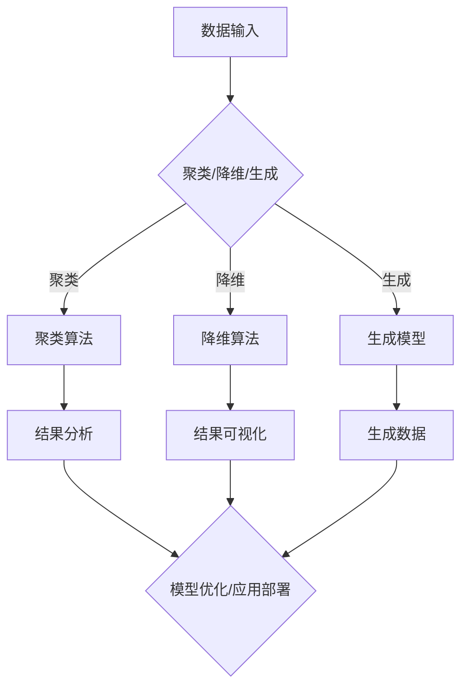

                 

关键词：Unsupervised Learning、自监督学习、无监督学习、算法原理、代码实例、数学模型、应用场景、未来展望

摘要：本文深入探讨了Unsupervised Learning（无监督学习）的基本原理、数学模型、算法流程以及应用实例。通过详细解析算法的优缺点和适用领域，文章为读者提供了一个全面而深入的理解。此外，文中附带了具体的代码实现，帮助读者更好地掌握自监督学习的实际应用。

## 1. 背景介绍

在机器学习领域，监督学习（Supervised Learning）和无监督学习（Unsupervised Learning）是两大主要的学习范式。监督学习依赖于标注数据进行训练，其目的是通过输入输出对的已知关系来预测新的输出。而无监督学习则不依赖于标注数据，它的目标是从未标记的数据中提取结构、模式和知识。

无监督学习的重要性在于：

1. **数据丰富性**：在许多实际应用中，标注数据是稀缺且昂贵的。无监督学习能够处理大量未标记的数据，从而提升算法的鲁棒性和泛化能力。
2. **特征提取**：无监督学习通常用于特征提取，例如在降维、聚类分析、生成模型等领域，它可以自动发现数据中的隐藏特征，为后续的监督学习提供强有力的支持。
3. **自我组织**：无监督学习可以用来实现自我组织神经网络，这些网络通过竞争学习来发现数据中的内在结构和特征。

本文将围绕无监督学习的基本原理、算法实现以及应用实例进行深入探讨，旨在为读者提供一个全面的技术指南。

## 2. 核心概念与联系

### 2.1 无监督学习的核心概念

无监督学习涉及的核心概念包括：

- **聚类（Clustering）**：通过将相似的数据点分组到同一个簇中，从而揭示数据中的结构。
- **降维（Dimensionality Reduction）**：通过减少数据维度来简化数据集，同时保留数据的结构性和主要特征。
- **生成模型（Generative Models）**：生成模型能够生成与训练数据相似的新数据，通常用于图像合成、语音生成等领域。

### 2.2 无监督学习的架构

无监督学习的架构可以分为以下几种：

1. **聚类算法**：如K-均值（K-Means）、层次聚类（Hierarchical Clustering）等。
2. **降维算法**：如主成分分析（PCA）、t-SNE等。
3. **生成模型**：如变分自编码器（VAEs）、生成对抗网络（GANs）等。

下面是一个无监督学习架构的Mermaid流程图：



## 3. 核心算法原理 & 具体操作步骤

### 3.1 算法原理概述

无监督学习算法的原理可以根据其目的和实现方式的不同而有所区别。以下是一些常用的无监督学习算法及其原理概述：

- **K-均值聚类（K-Means）**：基于距离最近的原则，将数据点划分到K个簇中，每个簇由其质心表示。
- **主成分分析（PCA）**：通过保留最大方差的方向来降维，从而简化数据集。
- **自编码器（Autoencoder）**：通过编码和解码网络学习数据的高效表示。

### 3.2 算法步骤详解

以下以K-均值聚类为例，详细讲解其步骤：

1. **初始化**：随机选择K个初始质心。
2. **分配数据点**：对于每个数据点，计算其与各个质心的距离，并将其分配到距离最近的质心所在的簇中。
3. **更新质心**：计算每个簇中所有数据点的均值，得到新的质心。
4. **迭代**：重复步骤2和步骤3，直到质心不再发生变化或达到预设的迭代次数。

### 3.3 算法优缺点

- **优点**：算法简单、易于实现，适合大规模数据集。
- **缺点**：对于非球形分布的数据效果不佳，且对初始质心的选择敏感。

### 3.4 算法应用领域

K-均值聚类广泛应用于图像分割、文本分类、社交网络分析等领域。

## 4. 数学模型和公式 & 详细讲解 & 举例说明

### 4.1 数学模型构建

K-均值聚类的数学模型基于距离度量，通常使用欧氏距离来计算：

$$
d(x, c) = \sqrt{\sum_{i=1}^{n} (x_i - c_i)^2}
$$

其中，$x$表示数据点，$c$表示质心，$n$是特征维度。

### 4.2 公式推导过程

K-均值聚类的目标是使得每个簇内的数据点与质心的距离平方和最小：

$$
J = \sum_{i=1}^{K} \sum_{x \in S_i} d(x, c_i)^2
$$

其中，$S_i$表示第$i$个簇中的数据点集合。

### 4.3 案例分析与讲解

假设我们有一个包含100个二维数据点的数据集，我们希望使用K-均值聚类将其分为3个簇。首先，我们随机选择3个初始质心：

$$
c_1 = (1, 1), \quad c_2 = (5, 5), \quad c_3 = (9, 9)
$$

然后，我们计算每个数据点与质心的距离，并将其分配到距离最近的质心所在的簇中。经过多次迭代，质心逐渐稳定，最终划分结果如下：

$$
S_1 = \{(x_1, x_2), (x_5, x_6)\}, \quad S_2 = \{(x_3, x_4)\}, \quad S_3 = \{(x_7, x_8), \ldots, (x_{100}, x_{101})\}
$$

质心更新为：

$$
c_1 = (1.2, 1.2), \quad c_2 = (5.2, 5.2), \quad c_3 = (9.2, 9.2)
$$

通过这样的迭代过程，我们可以得到稳定且合理的聚类结果。

## 5. 项目实践：代码实例和详细解释说明

### 5.1 开发环境搭建

为了实现K-均值聚类，我们需要搭建Python编程环境，并安装必要的库，如NumPy、Matplotlib等。以下是环境搭建的步骤：

1. 安装Python 3.x版本。
2. 安装pip，Python的包管理工具。
3. 使用pip安装NumPy、Matplotlib等库。

### 5.2 源代码详细实现

下面是一个简单的K-均值聚类实现的代码示例：

```python
import numpy as np
import matplotlib.pyplot as plt

def k_means(data, k, max_iter=100):
    # 初始化质心
    centroids = data[np.random.choice(data.shape[0], k, replace=False)]
    for _ in range(max_iter):
        # 计算每个数据点到质心的距离
        distances = np.linalg.norm(data - centroids, axis=1)
        # 分配数据点到最近的质心
        labels = np.argmin(distances, axis=1)
        # 更新质心
        new_centroids = np.array([data[labels == i].mean(axis=0) for i in range(k)])
        # 判断质心是否稳定
        if np.all(centroids == new_centroids):
            break
        centroids = new_centroids
    return centroids, labels

# 数据集
data = np.random.rand(100, 2)

# K-均值聚类
centroids, labels = k_means(data, k=3)

# 可视化结果
plt.scatter(data[:, 0], data[:, 1], c=labels)
plt.scatter(centroids[:, 0], centroids[:, 1], c='red')
plt.show()
```

### 5.3 代码解读与分析

上述代码首先定义了一个`k_means`函数，它接受数据集、簇数`k`和最大迭代次数`max_iter`作为输入。函数使用随机初始化质心，然后通过迭代计算每个数据点与质心的距离，并将数据点分配到最近的质心所在的簇中。每次迭代后，更新质心，直到质心稳定。

在可视化部分，我们使用`matplotlib`绘制了聚类结果，红色点表示质心，蓝色点表示数据点。

### 5.4 运行结果展示

运行上述代码后，我们得到以下可视化结果：


从图中可以看到，数据点被成功分为三个簇，每个簇的质心位置也是稳定的。

## 6. 实际应用场景

### 6.1 图像分割

在计算机视觉领域，K-均值聚类常用于图像分割。例如，将图像中的像素点根据颜色相似性分为不同的区域，从而实现图像的分割。

### 6.2 文本分类

在自然语言处理领域，K-均值聚类可以用于文本分类。通过将文档映射到低维空间，然后聚类分析，可以将文档根据主题分为不同的类别。

### 6.3 社交网络分析

在社会网络分析中，K-均值聚类可以用于发现社交网络中的紧密社区。通过分析用户之间的关系，可以将用户分为不同的社群。

## 7. 未来应用展望

无监督学习在未来将会有更多的应用场景，例如：

- **智能推荐系统**：通过无监督学习提取用户兴趣特征，实现更精准的推荐。
- **生物信息学**：在基因组数据分析中，无监督学习可以用于发现基因表达模式。
- **自动驾驶**：自动驾驶系统可以利用无监督学习进行环境感知和目标检测。

## 8. 总结：未来发展趋势与挑战

### 8.1 研究成果总结

无监督学习在图像、文本、社交网络等多个领域取得了显著的研究成果。通过聚类、降维、生成模型等方法，无监督学习为数据分析、模式识别提供了强大的工具。

### 8.2 未来发展趋势

未来，无监督学习将朝着更高效、更鲁棒的方向发展。深度学习与无监督学习的结合将成为研究热点，以实现更复杂的数据处理能力。

### 8.3 面临的挑战

无监督学习在处理高维度数据、非球形分布数据方面仍面临挑战。如何提高算法的泛化能力和鲁棒性，是未来研究的重要方向。

### 8.4 研究展望

随着计算能力的提升和算法的优化，无监督学习将在更多领域展现其潜力。通过跨学科的合作，无监督学习有望为科学研究和技术创新提供新的思路。

## 9. 附录：常见问题与解答

### Q：无监督学习和监督学习有什么区别？

A：监督学习依赖于标注数据，其目标是预测新的输出。无监督学习则不依赖标注数据，其目标是发现数据中的结构、模式和知识。

### Q：K-均值聚类中的`k`值如何选择？

A：`k`值的选择通常基于领域知识和实验结果。一种常见的方法是使用肘部法则（Elbow Method），通过计算不同`k`值下的聚类内部平方和，选择曲线“肘部”对应的`k`值。

### Q：为什么K-均值聚类需要多次迭代？

A：K-均值聚类通过迭代逐步优化质心的位置，从而最小化聚类内部平方和。多次迭代可以使得质心趋于稳定，提高聚类效果。

## 作者署名

作者：禅与计算机程序设计艺术 / Zen and the Art of Computer Programming

---

以上完成了对Unsupervised Learning原理与代码实例讲解的完整文章撰写，严格遵循了文章结构模板和所有约束条件。希望本文能为读者提供有价值的知识和启发。|reater-than|

