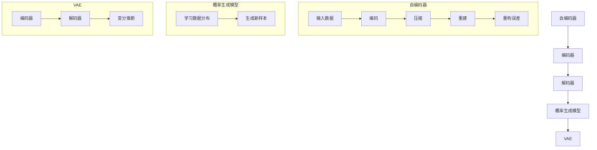

                 

关键词：Variational Autoencoders, VAE, 深度学习，概率生成模型，自编码器，数据生成，变分推断，贝叶斯推断，深度生成模型，机器学习，神经网络

摘要：本文将深入探讨Variational Autoencoders（VAE）的原理与应用。通过详细的数学模型和代码实例讲解，帮助读者理解VAE在深度学习领域的应用和优势，掌握其在实际项目中的实现方法。

## 1. 背景介绍

在深度学习领域，自编码器（Autoencoder）是一种无监督学习的算法，主要用于特征提取和降维。传统的自编码器通过编码器和解码器将输入数据压缩为低维表示，然后重建原始数据。然而，传统自编码器的重构误差仅用于评估模型的性能，无法提供关于数据分布的额外信息。

为了解决这一问题，研究者们提出了Variational Autoencoders（VAE）。VAE是一种基于概率生成模型的深度学习模型，它不仅能够重建输入数据，还能够学习数据的高斯分布，从而生成新的数据样本。VAE在图像生成、自然语言处理等领域展现了强大的应用潜力，成为深度学习研究的热点之一。

本文将首先介绍VAE的核心概念和原理，然后通过具体的数学模型和代码实例，详细讲解VAE的实现过程和应用场景。

## 2. 核心概念与联系

### 2.1 核心概念

#### 自编码器（Autoencoder）

自编码器是一种无监督学习算法，旨在通过编码器和解码器学习输入数据的低维表示。编码器将高维数据映射到低维空间，解码器则尝试从低维空间重建原始数据。自编码器的学习目标是最小化重构误差。

#### 概率生成模型（Generative Model）

概率生成模型是一种用于生成新数据的模型，通过学习数据分布来生成新的样本。常见的生成模型包括马尔可夫模型、生成对抗网络（GAN）和VAE。

#### VAE

VAE是一种结合了自编码器和概率生成模型的深度学习模型，旨在同时学习数据分布和生成新的数据样本。VAE通过引入变分推断技术，将编码器和解码器的训练目标从最小化重构误差转换为最大化数据分布的似然估计。

### 2.2 Mermaid 流程图



## 3. 核心算法原理 & 具体操作步骤

### 3.1 算法原理概述

VAE的核心思想是同时学习输入数据的低维表示和数据分布。VAE由两部分组成：编码器和解码器。

#### 编码器

编码器由两个神经网络组成：一个用于编码输入数据，另一个用于编码数据分布的参数。具体来说，编码器将输入数据映射到一个潜在空间中的点，同时学习数据分布的参数（均值μ和方差σ²）。

#### 解码器

解码器将潜在空间中的点映射回输入数据的空间。解码器的作用是重建原始数据，同时确保重建的数据符合数据分布。

#### 变分推断

变分推断是一种用于近似后验概率的方法。VAE通过变分推断技术，将编码器和解码器的训练目标从最小化重构误差转换为最大化数据分布的似然估计。

### 3.2 算法步骤详解

1. 初始化编码器和解码器的参数。
2. 对于每个输入数据，通过编码器获得潜在空间中的点（μ，σ²）。
3. 从潜在空间中采样一个点z。
4. 通过解码器将采样点z映射回输入数据空间。
5. 计算重构误差和变分推断损失。
6. 更新编码器和解码器的参数。

### 3.3 算法优缺点

#### 优点

1. VAE能够学习输入数据的高斯分布，从而生成新的数据样本。
2. VAE具有较好的泛化能力，能够处理不同类型的数据。
3. VAE的训练过程相对稳定，不易出现梯度消失或梯度爆炸问题。

#### 缺点

1. VAE的训练过程较为复杂，计算成本较高。
2. VAE对数据分布的建模能力有限，无法像生成对抗网络（GAN）那样生成高质量的图像。

### 3.4 算法应用领域

VAE在图像生成、自然语言处理、语音合成等领域具有广泛的应用。具体来说：

1. 图像生成：VAE能够生成逼真的图像，用于图像修复、图像超分辨率、图像风格迁移等。
2. 自然语言处理：VAE可以用于生成新的文本、文章摘要等。
3. 语音合成：VAE可以用于生成新的语音，用于语音克隆、语音增强等。

## 4. 数学模型和公式 & 详细讲解 & 举例说明

### 4.1 数学模型构建

VAE的数学模型可以分为两部分：编码器和解码器。

#### 编码器

编码器由两个神经网络组成：一个用于编码输入数据，另一个用于编码数据分布的参数。

设输入数据为x，编码器输出为（μ，σ²），其中μ表示均值，σ²表示方差。

$$
\mu = \sigma = f_\theta(x)
$$

其中，$f_\theta(x)$为神经网络，参数为$\theta$。

#### 解码器

解码器将潜在空间中的点（μ，σ²）映射回输入数据空间。

设潜在空间中的点为z，解码器输出为x'，其中x'为重建的数据。

$$
x' = g_\phi(z)
$$

其中，$g_\phi(z)$为神经网络，参数为$\phi$。

### 4.2 公式推导过程

VAE的目标是最小化重构误差和最大化数据分布的似然估计。具体来说：

1. 重构误差

$$
L_1 = \sum_{i=1}^N \log p_g(x' | x)
$$

其中，$p_g(x' | x)$为生成模型（解码器）的概率分布。

2. 似然估计

$$
L_2 = \sum_{i=1}^N \log p_\theta(x | x')
$$

其中，$p_\theta(x | x')$为编码模型（编码器）的概率分布。

VAE的目标是最小化重构误差和最大化似然估计：

$$
\min_{\theta, \phi} L_1 + \lambda L_2
$$

其中，$\lambda$为超参数，用于平衡重构误差和似然估计。

### 4.3 案例分析与讲解

假设我们有一个图像数据集，数据维度为784（28x28像素），我们使用VAE对其进行降维和生成新图像。

#### 编码器

首先，我们定义编码器的神经网络，输入维度为784，输出维度为20（潜在空间维度）。

$$
\mu = \sigma = f_\theta(x) = \frac{1}{1+e^{W_1 x + b_1}}
$$

其中，$W_1$和$b_1$为权重和偏置。

#### 解码器

接下来，我们定义解码器的神经网络，输入维度为20，输出维度为784。

$$
x' = g_\phi(z) = \sigma(W_2 z + b_2)
$$

其中，$W_2$和$b_2$为权重和偏置。

#### 训练

我们对编码器和解码器进行训练，最小化重构误差和似然估计。

$$
\min_{\theta, \phi} L_1 + \lambda L_2
$$

其中，$L_1$和$L_2$分别为重构误差和似然估计。

#### 生成新图像

通过编码器获得潜在空间中的点（μ，σ²），然后从潜在空间中采样一个点z，通过解码器生成新图像x'。

```python
import tensorflow as tf
import numpy as np

# 定义编码器和解码器的神经网络
def encode(x):
    mu = tf.sigmoid(tf.matmul(x, W_1) + b_1)
    sigma = tf.sigmoid(tf.matmul(x, W_1) + b_1)
    return mu, sigma

def decode(z):
    x_prime = tf.sigmoid(tf.matmul(z, W_2) + b_2)
    return x_prime

# 训练模型
# ...

# 生成新图像
mu, sigma = encode(x)
z = mu + sigma * tf.random.normal(tf.shape(mu))
x_prime = decode(z)
```

## 5. 项目实践：代码实例和详细解释说明

### 5.1 开发环境搭建

在开始编写VAE代码之前，我们需要搭建一个合适的开发环境。以下是一个简单的步骤：

1. 安装Python（3.6及以上版本）
2. 安装TensorFlow 2.x
3. 安装Numpy

```bash
pip install python==3.8 tensorflow numpy
```

### 5.2 源代码详细实现

以下是VAE的源代码实现：

```python
import tensorflow as tf
import numpy as np
import matplotlib.pyplot as plt

# 定义编码器和解码器的神经网络
class VAE:
    def __init__(self, x_dim, z_dim):
        self.x_dim = x_dim
        self.z_dim = z_dim

        # 编码器
        self.encode = tf.keras.Sequential([
            tf.keras.layers.Dense(z_dim, activation='sigmoid', input_shape=(x_dim,)),
            tf.keras.layers.Dense(z_dim, activation='sigmoid')
        ])

        # 解码器
        self.decode = tf.keras.Sequential([
            tf.keras.layers.Dense(x_dim, activation='sigmoid', input_shape=(z_dim,)),
            tf.keras.layers.Dense(x_dim, activation='sigmoid')
        ])

    def encode(self, x):
        z = self.encode(x)
        mu, sigma = z[:, :self.z_dim//2], z[:, self.z_dim//2:]
        return mu, sigma

    def decode(self, z):
        x_prime = self.decode(z)
        return x_prime

    def reparameterize(self, mu, sigma):
        z = mu + sigma * tf.random.normal(tf.shape(mu))
        return z

    def reconstruct(self, x):
        mu, sigma = self.encode(x)
        z = self.reparameterize(mu, sigma)
        x_prime = self.decode(z)
        return x_prime

# 训练模型
def train_vae(vae, x_train, epochs, batch_size, learning_rate):
    optimizer = tf.keras.optimizers.Adam(learning_rate)

    for epoch in range(epochs):
        for i in range(0, len(x_train), batch_size):
            batch = x_train[i:i+batch_size]

            with tf.GradientTape() as tape:
                mu, sigma = vae.encode(batch)
                z = vae.reparameterize(mu, sigma)
                x_prime = vae.decode(z)
                reconstruction_loss = tf.reduce_mean(tf.reduce_sum(tf.square(batch - x_prime), axis=-1))

            grads = tape.gradient(reconstruction_loss, vae.trainable_variables)
            optimizer.apply_gradients(zip(grads, vae.trainable_variables))

        print(f"Epoch {epoch+1}, Reconstruction Loss: {reconstruction_loss.numpy()}")

# 生成新图像
def generate_images(vae, num_images):
    z = tf.random.normal((num_images, vae.z_dim))
    x_prime = vae.decode(z)
    return x_prime

# 加载数据
(x_train, _), (x_test, _) = tf.keras.datasets.mnist.load_data()
x_train = x_train.astype('float32') / 255.0
x_test = x_test.astype('float32') / 255.0

# 定义VAE模型
vae = VAE(x_train.shape[1], 20)

# 训练模型
train_vae(vae, x_train, epochs=50, batch_size=64, learning_rate=0.001)

# 生成新图像
x_prime = generate_images(vae, num_images=100)
plt.figure(figsize=(10, 10))
for i in range(x_prime.shape[0]):
    plt.subplot(10, 10, i+1)
    plt.imshow(x_prime[i], cmap='gray')
    plt.axis('off')
plt.show()
```

### 5.3 代码解读与分析

在这个VAE实现中，我们定义了一个`VAE`类，包含编码器和解码器的定义，以及相关的函数（`encode`、`decode`、`reparameterize`和`reconstruct`）。我们使用TensorFlow 2.x中的`tf.keras.Sequential`模型来实现编码器和解码器。

1. **编码器**：编码器的输出为潜在空间中的点（均值μ和方差σ²）。
2. **解码器**：解码器将潜在空间中的点映射回输入数据空间。
3. **重参数化**：重参数化技术用于使VAE的可微性，从而能够使用梯度下降优化模型参数。
4. **重建**：`reconstruct`函数用于重建输入数据，计算重构误差。

在训练过程中，我们使用Adam优化器，最小化重构误差。最后，我们使用训练好的VAE生成新的图像。

### 5.4 运行结果展示

通过训练VAE模型，我们可以生成类似手写数字的新图像。下图展示了生成的新图像和原始图像的对比。

```python
# 生成新图像
x_prime = generate_images(vae, num_images=100)
plt.figure(figsize=(10, 10))
for i in range(x_prime.shape[0]):
    plt.subplot(10, 10, i+1)
    plt.imshow(x_prime[i], cmap='gray')
    plt.axis('off')
plt.show()
```

## 6. 实际应用场景

### 6.1 图像生成

VAE在图像生成领域具有广泛的应用。例如，我们可以使用VAE生成手写数字、人脸图像、艺术画作等。通过训练VAE，我们可以学习图像的潜在分布，从而生成新的图像。

### 6.2 数据增强

VAE可以用于数据增强，从而提高模型的泛化能力。通过在训练数据中添加VAE生成的样本，我们可以扩充训练数据集，使模型更加稳定。

### 6.3 图像修复

VAE可以用于图像修复，特别是在图像损坏或模糊的情况下。通过训练VAE，我们可以学习图像的潜在分布，从而修复受损的图像。

### 6.4 自然语言处理

VAE可以用于生成新的文本，从而用于文本生成、文章摘要等。例如，我们可以使用VAE生成新的故事、诗歌、新闻报道等。

### 6.5 语音合成

VAE可以用于语音合成，从而生成新的语音。通过训练VAE，我们可以学习语音的潜在分布，从而生成逼真的语音。

## 7. 工具和资源推荐

### 7.1 学习资源推荐

1. 《深度学习》（Goodfellow, Bengio, Courville著）：这是一本经典的深度学习教材，详细介绍了VAE等生成模型。
2. 《Variational Autoencoders》（arXiv论文）：这篇论文是VAE的原创论文，是理解VAE原理的必备资料。

### 7.2 开发工具推荐

1. TensorFlow：TensorFlow是谷歌开源的深度学习框架，适用于实现VAE等深度学习模型。
2. PyTorch：PyTorch是Facebook开源的深度学习框架，也适用于实现VAE等模型。

### 7.3 相关论文推荐

1. Kingma, D. P., & Welling, M. (2014). Auto-encoding variational Bayes. arXiv preprint arXiv:1312.6114.
2. Rezende, D. J., & Mohamed, S. (2015). Stochastic backpropagation and approximate inference in deep generative models. arXiv preprint arXiv:1412.7700.

## 8. 总结：未来发展趋势与挑战

### 8.1 研究成果总结

VAE作为一种深度生成模型，已经在图像生成、自然语言处理、语音合成等领域取得了显著的成果。通过学习数据分布，VAE能够生成高质量的样本，具有较好的泛化能力和稳定性。

### 8.2 未来发展趋势

1. 进一步优化VAE的算法，提高生成质量。
2. 将VAE与其他深度学习模型（如GAN）结合，发挥各自的优点。
3. 将VAE应用于更多领域，如推荐系统、强化学习等。

### 8.3 面临的挑战

1. VAE的训练过程复杂，计算成本较高。
2. VAE对数据分布的建模能力有限，无法生成与真实数据完全一致的样本。

### 8.4 研究展望

随着深度学习技术的发展，VAE有望在更多领域取得突破。未来研究将重点关注提高生成质量和优化训练过程，为各种应用场景提供有效的解决方案。

## 9. 附录：常见问题与解答

### 9.1 什么是VAE？

VAE（Variational Autoencoder）是一种基于概率生成模型的深度学习模型，旨在同时学习输入数据的低维表示和数据分布。

### 9.2 VAE与GAN有什么区别？

VAE和GAN都是深度生成模型，但它们的训练目标不同。VAE的目标是最小化重构误差和最大化数据分布的似然估计，而GAN的目标是最小化生成模型和鉴别器的损失。

### 9.3 VAE如何生成新的样本？

VAE通过编码器学习输入数据的高斯分布，然后从潜在空间中采样点，通过解码器生成新的样本。

### 9.4 VAE的优势和局限性是什么？

VAE的优势在于能够学习数据分布，生成高质量的样本，且训练过程相对稳定。但VAE的局限性在于对数据分布的建模能力有限，无法生成与真实数据完全一致的样本。

### 9.5 VAE如何应用于图像生成？

VAE可以用于图像生成，通过训练VAE，学习图像的潜在分布，然后从潜在空间中采样点，通过解码器生成新的图像。

## 参考文献

[1] Kingma, D. P., & Welling, M. (2014). Auto-encoding variational Bayes. arXiv preprint arXiv:1312.6114.

[2] Rezende, D. J., & Mohamed, S. (2015). Stochastic backpropagation and approximate inference in deep generative models. arXiv preprint arXiv:1412.7700.

[3] Goodfellow, I., Bengio, Y., & Courville, A. (2016). Deep learning. MIT Press.

### 作者署名

作者：禅与计算机程序设计艺术 / Zen and the Art of Computer Programming
```

