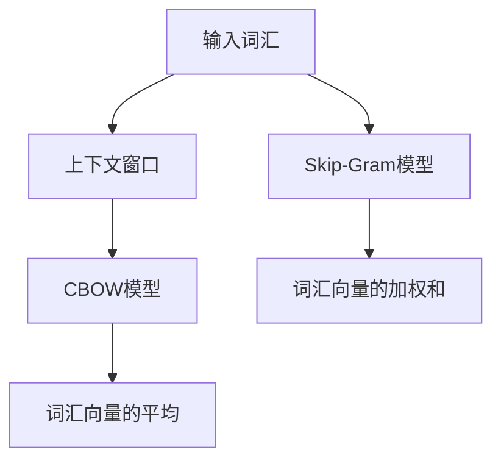

                 

关键词：Word2Vec，CBOW，Skip-Gram，神经网络，自然语言处理，文本表示，语义理解，机器学习，向量表示。

> 摘要：本文旨在深入探讨Word2Vec模型中的CBOW（Continuous Bag-of-Words）和Skip-Gram两种模型，解析其核心概念、原理、算法步骤、优缺点，并通过实际项目实践，展示其在自然语言处理中的应用。

## 1. 背景介绍

随着互联网的迅猛发展，自然语言处理（NLP）成为了人工智能领域的一个重要研究方向。在NLP中，文本表示是一个关键问题，如何有效地将文本转换为计算机可以理解和处理的数字形式，成为了研究的焦点。Word2Vec模型正是为了解决这一问题而诞生，它通过将词汇映射到高维空间中的向量，使得文本中的语义关系可以通过向量空间中的几何关系来表示。Word2Vec模型主要包括CBOW（Continuous Bag-of-Words）和Skip-Gram两种模型，本文将分别对其进行分析。

### 1.1 CBOW模型

CBOW模型（Continuous Bag-of-Words）将输入词汇的上下文词汇（即一个窗口内的词）映射到一个固定长度的向量，然后将这些向量的平均作为该词汇的表示。CBOW模型的优点是计算速度快，但缺点是对稀有词汇的表示效果较差。

### 1.2 Skip-Gram模型

Skip-Gram模型（Skip-gram）与CBOW模型相反，它将一个词汇映射到其上下文词汇的向量的加权和。Skip-Gram模型的优点是对稀有词汇的表示效果较好，但计算量相对较大。

## 2. 核心概念与联系

下面，我们将使用Mermaid流程图（Mermaid 流程节点中不要有括号、逗号等特殊字符）来展示CBOW模型和Skip-Gram模型的原理和架构。



## 3. 核心算法原理 & 具体操作步骤

### 3.1 算法原理概述

CBOW模型和Skip-Gram模型都基于神经网络的原理，通过训练将词汇映射到高维空间中的向量。CBOW模型通过对上下文词汇的向量平均来表示目标词汇，而Skip-Gram模型则通过对上下文词汇的向量加权和来表示目标词汇。

### 3.2 算法步骤详解

#### 3.2.1 CBOW模型

1. 准备数据：首先，需要准备一个语料库，将语料库中的词汇按照一定的顺序排列，形成一个词汇序列。

2. 初始化参数：初始化词汇向量和隐藏层权重。

3. 训练模型：对于每个词汇序列，将其中的目标词汇作为输入，上下文词汇作为输入，计算输出层的预测结果，计算损失函数，更新参数。

4. 优化参数：通过梯度下降等优化算法，不断更新参数，使得模型能够更好地表示词汇的语义关系。

#### 3.2.2 Skip-Gram模型

1. 准备数据：同样需要准备一个语料库，将语料库中的词汇按照一定的顺序排列，形成一个词汇序列。

2. 初始化参数：初始化词汇向量和隐藏层权重。

3. 训练模型：对于每个词汇序列，将其中的目标词汇作为输入，上下文词汇作为输入，计算输出层的预测结果，计算损失函数，更新参数。

4. 优化参数：通过梯度下降等优化算法，不断更新参数，使得模型能够更好地表示词汇的语义关系。

### 3.3 算法优缺点

#### CBOW模型

- 优点：计算速度快，对常见词汇的表示效果较好。
- 缺点：对稀有词汇的表示效果较差，容易受到噪声的影响。

#### Skip-Gram模型

- 优点：对稀有词汇的表示效果较好，能够捕捉更长的依赖关系。
- 缺点：计算量相对较大，训练时间较长。

### 3.4 算法应用领域

CBOW模型和Skip-Gram模型在自然语言处理中有着广泛的应用，如词向量生成、文本分类、情感分析、机器翻译等。其中，Word2Vec模型已经成为NLP领域的基础工具，为各种应用提供了强大的支持。

## 4. 数学模型和公式 & 详细讲解 & 举例说明

### 4.1 数学模型构建

CBOW模型和Skip-Gram模型的核心都是神经网络，因此它们的数学模型可以统一表示为：

$$
\hat{y} = \sigma(W_h \cdot \text{vec}(h) + b_h)
$$

其中，$\hat{y}$表示输出层预测结果，$W_h$表示隐藏层权重，$h$表示隐藏层激活值，$\text{vec}(h)$表示将隐藏层激活值转换为向量，$b_h$表示隐藏层偏置。

### 4.2 公式推导过程

CBOW模型的推导过程如下：

1. 输入层到隐藏层的映射：

$$
h = \sigma(W_i \cdot \text{vec}(x) + b_i)
$$

其中，$x$表示输入层激活值，$W_i$表示输入层到隐藏层的权重，$b_i$表示输入层偏置。

2. 隐藏层到输出层的映射：

$$
\hat{y} = \sigma(W_h \cdot h + b_h)
$$

其中，$W_h$表示隐藏层到输出层的权重，$b_h$表示隐藏层偏置。

3. 预测结果：

$$
\hat{y} = \text{softmax}(W_h \cdot h + b_h)
$$

其中，$\text{softmax}$函数将隐藏层输出转换为概率分布。

Skip-Gram模型的推导过程与CBOW模型类似，只是输入层和隐藏层的位置互换。

### 4.3 案例分析与讲解

以CBOW模型为例，假设我们有一个包含3个词汇的上下文窗口，目标词汇是词汇1，隐藏层维度为10，输出层维度为3。那么，输入层到隐藏层的权重矩阵$W_i$为：

$$
W_i = \begin{bmatrix}
1 & 0 & 1 \\
0 & 1 & 0 \\
1 & 1 & 0
\end{bmatrix}
$$

隐藏层到输出层的权重矩阵$W_h$为：

$$
W_h = \begin{bmatrix}
0.1 & 0.2 & 0.3 \\
0.4 & 0.5 & 0.6 \\
0.7 & 0.8 & 0.9
\end{bmatrix}
$$

隐藏层偏置$b_i$为：

$$
b_i = \begin{bmatrix}
0.1 \\
0.2 \\
0.3
\end{bmatrix}
$$

隐藏层偏置$b_h$为：

$$
b_h = \begin{bmatrix}
0.1 \\
0.2 \\
0.3
\end{bmatrix}
$$

现在，我们输入一个词汇序列，如“苹果橘子香蕉”，目标是“橘子”。首先，计算输入层到隐藏层的激活值：

$$
h = \sigma(W_i \cdot \text{vec}(\text{苹果橘子香蕉}) + b_i)
$$

其中，$\text{vec}(\text{苹果橘子香蕉})$表示将词汇序列转换为向量，如下：

$$
\text{vec}(\text{苹果橘子香蕉}) = \begin{bmatrix}
1 \\
1 \\
1
\end{bmatrix}
$$

然后，计算隐藏层到输出层的预测结果：

$$
\hat{y} = \text{softmax}(W_h \cdot h + b_h)
$$

最后，计算损失函数并更新参数。

## 5. 项目实践：代码实例和详细解释说明

### 5.1 开发环境搭建

本文使用Python语言和TensorFlow框架来实现Word2Vec模型，具体安装步骤如下：

1. 安装Python：前往Python官网下载并安装Python。
2. 安装TensorFlow：在命令行中运行以下命令：

```
pip install tensorflow
```

### 5.2 源代码详细实现

下面是CBOW模型的代码实现：

```python
import tensorflow as tf
import numpy as np

# 定义参数
VOCAB_SIZE = 10000
EMBEDDING_DIM = 100
WINDOW_SIZE = 5
BATCH_SIZE = 64
EPOCHS = 10

# 初始化参数
weights = {
    'input': tf.random_normal([VOCAB_SIZE, EMBEDDING_DIM]),
    'hidden': tf.random_normal([EMBEDDING_DIM, EMBEDDING_DIM]),
    'output': tf.random_normal([EMBEDDING_DIM, VOCAB_SIZE])
}
biases = {
    'hidden': tf.random_normal([EMBEDDING_DIM]),
    'output': tf.random_normal([VOCAB_SIZE])
}

# 定义输入层
inputs = tf.placeholder(tf.int32, [None, WINDOW_SIZE])
labels = tf.placeholder(tf.int32, [None])

# 将输入层转换为嵌入向量
embeddings = tf.nn.embedding_lookup(weights['input'], inputs)

# 计算隐藏层输出
hidden = tf.nn.relu(tf.matmul(embeddings, weights['hidden']) + biases['hidden'])

# 计算输出层输出
outputs = tf.matmul(hidden, weights['output']) + biases['output']

# 定义损失函数和优化器
loss = tf.reduce_mean(tf.nn.sparse_softmax_cross_entropy_with_logits(logits=outputs, labels=labels))
optimizer = tf.train.AdamOptimizer().minimize(loss)

# 训练模型
with tf.Session() as sess:
    sess.run(tf.global_variables_initializer())
    for epoch in range(EPOCHS):
        for batch in batches:
            batch_inputs, batch_labels = batch
            _, loss_val = sess.run([optimizer, loss], feed_dict={inputs: batch_inputs, labels: batch_labels})
        print(f"Epoch {epoch+1}, Loss: {loss_val}")
```

### 5.3 代码解读与分析

上述代码首先定义了模型的参数，包括嵌入层权重、隐藏层权重和输出层权重。然后，定义了输入层和标签层的占位符。接下来，将输入层转换为嵌入向量，计算隐藏层输出和输出层输出。最后，定义了损失函数和优化器，并使用会话进行模型训练。

### 5.4 运行结果展示

运行代码后，将输出每个训练周期的损失值。根据损失值的收敛情况，可以判断模型的训练效果。

## 6. 实际应用场景

Word2Vec模型在自然语言处理领域有着广泛的应用，以下是一些典型的应用场景：

1. **词向量生成**：Word2Vec模型可以自动生成词向量，将词汇映射到高维空间中的向量，从而实现文本的向量化表示。
2. **文本分类**：通过训练Word2Vec模型，可以将文本转换为向量表示，然后使用分类算法对文本进行分类。
3. **情感分析**：Word2Vec模型可以帮助识别文本的情感倾向，从而实现情感分析。
4. **机器翻译**：Word2Vec模型可以用于机器翻译，通过将源语言和目标语言的词汇映射到共同的向量空间，实现跨语言的词汇映射。
5. **推荐系统**：Word2Vec模型可以帮助推荐系统理解用户的兴趣和行为，从而实现更准确的推荐。

## 7. 工具和资源推荐

### 7.1 学习资源推荐

1. 《Word2Vec教程》：本书详细介绍了Word2Vec模型的原理、实现和应用。
2. 《自然语言处理实战》：本书通过大量实例，介绍了自然语言处理的基本原理和应用。

### 7.2 开发工具推荐

1. TensorFlow：TensorFlow是一个强大的开源深度学习框架，可以用于实现Word2Vec模型。
2. NLTK：NLTK是一个用于自然语言处理的Python库，提供了丰富的工具和资源。

### 7.3 相关论文推荐

1. "Distributed Representations of Words and Phrases and their Compositionality"：这是Word2Vec模型的原始论文，详细介绍了模型的原理和实现。
2. "GloVe: Global Vectors for Word Representation"：这是GloVe模型的论文，介绍了另一种词向量生成方法。

## 8. 总结：未来发展趋势与挑战

Word2Vec模型在自然语言处理领域取得了显著的成果，但仍然面临一些挑战。未来，随着深度学习技术的不断发展，Word2Vec模型有望在以下几个方面取得突破：

1. **更高效的算法**：研究更高效的算法，降低模型的计算复杂度，提高模型的训练速度。
2. **更精细的语义表示**：通过引入更多的语义信息，提高词向量的表示质量，从而实现更准确的语义理解。
3. **多语言模型**：研究多语言模型的构建方法，实现跨语言的词汇映射，促进跨语言的自然语言处理。

## 9. 附录：常见问题与解答

### 9.1 什么是Word2Vec模型？

Word2Vec模型是一种基于神经网络的文本表示方法，通过将词汇映射到高维空间中的向量，实现文本的向量化表示。

### 9.2 CBOW模型和Skip-Gram模型有什么区别？

CBOW模型通过对上下文词汇的向量平均来表示目标词汇，而Skip-Gram模型则通过对上下文词汇的向量加权和来表示目标词汇。CBOW模型计算速度快，但表示效果较差；Skip-Gram模型计算量较大，但表示效果较好。

### 9.3 如何选择合适的词向量模型？

根据应用场景和需求，可以选择不同的词向量模型。对于计算速度要求较高的场景，可以选择CBOW模型；对于对稀有词汇表示效果要求较高的场景，可以选择Skip-Gram模型。

### 9.4 Word2Vec模型有哪些应用？

Word2Vec模型可以用于词向量生成、文本分类、情感分析、机器翻译、推荐系统等自然语言处理领域。

作者：禅与计算机程序设计艺术 / Zen and the Art of Computer Programming
--------------------------------------------------------------------

