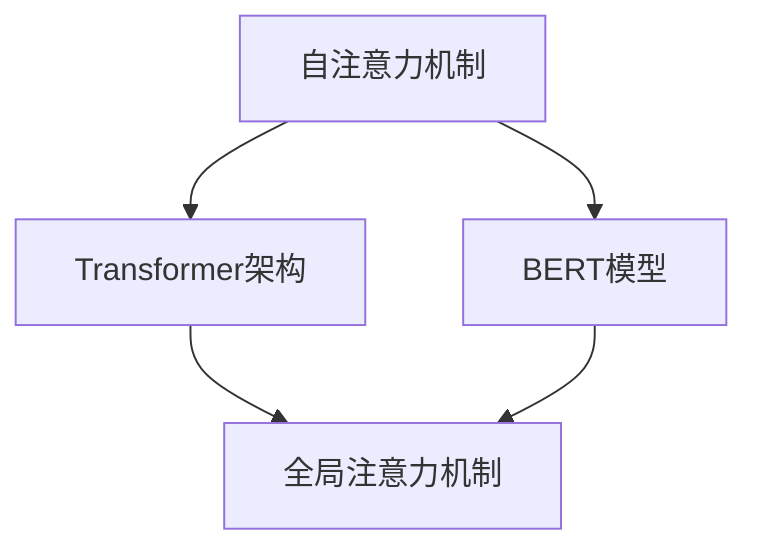

                 

关键词：XLNet、语言模型、神经网络、Transformer、自注意力机制、预训练、BERT、代码实例、AI应用、计算机编程

> 摘要：本文旨在详细讲解XLNet的原理及其在自然语言处理中的应用。通过对比分析XLNet与BERT等模型，我们将深入探讨XLNet在自注意力机制和预训练方面的创新之处。同时，本文将结合代码实例，详细解读XLNet的实现步骤，帮助读者更好地理解和掌握这一先进模型。

## 1. 背景介绍

随着深度学习和自然语言处理技术的快速发展，大规模语言模型在文本分类、机器翻译、问答系统等任务中取得了显著的效果。其中，BERT（Bidirectional Encoder Representations from Transformers）模型作为Transformer架构的一种创新，通过双向Transformer编码器实现了全局信息的整合，极大地提升了模型的表现力。然而，BERT模型也存在一些局限性，例如对序列长度的限制、对并行计算的依赖等。

为了解决这些问题，XLNet应运而生。XLNet是由谷歌团队提出的一种新型预训练方法，它通过自注意力机制和全局注意力机制的结合，实现了对长文本的灵活处理。相比BERT，XLNet在多个自然语言处理任务上取得了更好的性能，成为近年来预训练领域的重要研究进展。

## 2. 核心概念与联系

在讲解XLNet的原理之前，我们需要了解一些核心概念，如自注意力机制、Transformer架构、BERT模型等。以下是这些概念及其相互关系的Mermaid流程图：



### 2.1 自注意力机制

自注意力机制（Self-Attention）是一种在神经网络中处理序列数据的注意力机制。它通过计算输入序列中每个元素的相关性，将序列中的信息进行重新组合，从而提高模型的表达能力。自注意力机制的公式如下：

$$
\text{Attention}(Q, K, V) = \text{softmax}\left(\frac{QK^T}{\sqrt{d_k}}\right)V
$$

其中，$Q$、$K$、$V$ 分别为输入序列的查询（Query）、键（Key）和值（Value）向量，$d_k$ 为键向量的维度。通过自注意力机制，模型可以自动学习到输入序列中各个元素之间的相关性，并将其用于模型的输出。

### 2.2 Transformer架构

Transformer架构是由Vaswani等人于2017年提出的一种基于自注意力机制的序列到序列模型。Transformer架构摒弃了传统的循环神经网络（RNN）和卷积神经网络（CNN），采用多头自注意力机制和前馈神经网络，实现了对序列数据的全局处理。Transformer架构的公式如下：

$$
\text{MultiHeadAttention}(Q, K, V) = \text{Concat}(_i \text{head}_i) W^O \text{softmax}\left(\frac{QW^Q KW^K}{\sqrt{d_k}}\right)V
$$

其中，$W^Q$、$W^K$、$W^V$ 分别为查询（Query）、键（Key）和值（Value）的权重矩阵，$_i \text{head}_i$ 为第 $i$ 个头（Head）的输出。通过多头自注意力机制，模型可以同时关注序列中的多个元素，从而提高模型的表示能力。

### 2.3 BERT模型

BERT（Bidirectional Encoder Representations from Transformers）模型是由Brown等人于2018年提出的一种基于Transformer架构的双向编码器模型。BERT模型通过在大量无标签文本上进行预训练，学习到语言的基本规律，然后通过下游任务进行微调，实现了在多个自然语言处理任务上的优秀表现。BERT模型的架构如下：

$$
\text{BERT} = \text{Transformer} + \text{Masked Language Model}
$$

其中，Transformer为Transformer架构，Masked Language Model为掩码语言模型。BERT模型通过在预训练过程中引入掩码语言模型（Masked Language Model），使得模型能够自动学习到上下文信息，从而提高了模型的表示能力。

## 3. 核心算法原理 & 具体操作步骤

### 3.1 算法原理概述

XLNet是一种基于Transformer架构的预训练方法，其核心思想是通过对输入序列进行全局处理，学习到序列中的长距离依赖关系。与BERT模型不同，XLNet在预训练过程中引入了全局注意力机制，使得模型可以同时关注序列中的不同部分，从而提高了模型的表示能力。

### 3.2 算法步骤详解

#### 3.2.1 数据预处理

与BERT模型类似，XLNet在预训练过程中首先需要对输入数据进行预处理。具体包括：

1. 分词：将输入文本分解成词或子词。
2. Tokenization：将分词后的文本映射为词表中的索引。
3. Positional Embedding：为每个词添加位置信息，以便模型能够学习到词之间的相对位置关系。

#### 3.2.2 预训练任务

XLNet在预训练过程中主要包含两个任务：

1. Masked Language Model（MLM）：对输入序列中的部分词进行掩码，然后通过模型预测这些掩码词的索引。
2. Permutation Language Model（PLM）：对输入序列进行随机打乱，然后通过模型预测打乱后的序列。

#### 3.2.3 全局注意力机制

与BERT模型的双向注意力机制不同，XLNet引入了全局注意力机制，通过计算输入序列中每个词与其他词的相关性，实现了对长文本的灵活处理。全局注意力机制的公式如下：

$$
\text{GlobalAttention}(Q, K, V) = \text{softmax}\left(\frac{QKV^T}{\sqrt{d_k}}\right)V
$$

其中，$Q$、$K$、$V$ 分别为输入序列的查询（Query）、键（Key）和值（Value）向量。

### 3.3 算法优缺点

#### 3.3.1 优点

1. 弥补了BERT模型的局限性，如序列长度限制和并行计算依赖。
2. 引入全局注意力机制，实现了对长文本的灵活处理。
3. 在多个自然语言处理任务上取得了较好的性能。

#### 3.3.2 缺点

1. 计算复杂度较高，对硬件资源要求较高。
2. 预训练过程中需要大量的计算资源和时间。

### 3.4 算法应用领域

XLNet在自然语言处理领域具有广泛的应用，如：

1. 文本分类：对新闻、评论、博客等文本进行分类。
2. 机器翻译：将一种语言的文本翻译成另一种语言。
3. 问答系统：从大量文本中检索出与用户提问相关的内容。
4. 情感分析：对文本中的情感倾向进行分类。

## 4. 数学模型和公式 & 详细讲解 & 举例说明

### 4.1 数学模型构建

XLNet的数学模型主要包括自注意力机制和全局注意力机制。下面我们将分别介绍这两种机制的数学模型。

#### 4.1.1 自注意力机制

自注意力机制的公式如下：

$$
\text{Attention}(Q, K, V) = \text{softmax}\left(\frac{QK^T}{\sqrt{d_k}}\right)V
$$

其中，$Q$、$K$、$V$ 分别为输入序列的查询（Query）、键（Key）和值（Value）向量，$d_k$ 为键向量的维度。

#### 4.1.2 全局注意力机制

全局注意力机制的公式如下：

$$
\text{GlobalAttention}(Q, K, V) = \text{softmax}\left(\frac{QKV^T}{\sqrt{d_k}}\right)V
$$

其中，$Q$、$K$、$V$ 分别为输入序列的查询（Query）、键（Key）和值（Value）向量。

### 4.2 公式推导过程

#### 4.2.1 自注意力机制推导

自注意力机制的推导过程如下：

1. 输入序列的查询（Query）、键（Key）和值（Value）向量分别表示为 $Q = [q_1, q_2, \ldots, q_n]$、$K = [k_1, k_2, \ldots, k_n]$、$V = [v_1, v_2, \ldots, v_n]$。
2. 计算查询（Query）与键（Key）的点积，得到一个 $n \times n$ 的矩阵 $QK^T$。
3. 对矩阵 $QK^T$ 进行 softmax 操作，得到一个概率分布 $softmax(QK^T)$。
4. 将概率分布 $softmax(QK^T)$ 与值（Value）向量 $V$ 相乘，得到加权后的输出序列 $Attention(Q, K, V)$。

#### 4.2.2 全局注意力机制推导

全局注意力机制的推导过程如下：

1. 输入序列的查询（Query）、键（Key）和值（Value）向量分别表示为 $Q = [q_1, q_2, \ldots, q_n]$、$K = [k_1, k_2, \ldots, k_n]$、$V = [v_1, v_2, \ldots, v_n]$。
2. 计算查询（Query）与键（Key）的点积，得到一个 $n \times n$ 的矩阵 $QKV^T$。
3. 对矩阵 $QKV^T$ 进行 softmax 操作，得到一个概率分布 $softmax(QKV^T)$。
4. 将概率分布 $softmax(QKV^T)$ 与值（Value）向量 $V$ 相乘，得到加权后的输出序列 $GlobalAttention(Q, K, V)$。

### 4.3 案例分析与讲解

下面我们通过一个简单的案例来讲解自注意力机制和全局注意力机制的应用。

#### 案例一：自注意力机制

假设输入序列为 `[1, 2, 3, 4, 5]`，需要计算自注意力机制。

1. 查询（Query）向量：$Q = [q_1, q_2, \ldots, q_n]$，其中 $q_1 = 1, q_2 = 2, \ldots, q_n = 5$。
2. 键（Key）向量：$K = [k_1, k_2, \ldots, k_n]$，其中 $k_1 = 1, k_2 = 2, \ldots, k_n = 5$。
3. 值（Value）向量：$V = [v_1, v_2, \ldots, v_n]$，其中 $v_1 = 1, v_2 = 2, \ldots, v_n = 5$。

计算自注意力机制：

$$
Attention(Q, K, V) = \text{softmax}\left(\frac{QK^T}{\sqrt{d_k}}\right)V
$$

其中，$d_k$ 为键向量的维度，这里假设 $d_k = 2$。

计算结果如下：

$$
Attention(Q, K, V) = \text{softmax}\left(\frac{[1, 2, \ldots, 5][1, 2, \ldots, 5]^T}{\sqrt{2}}\right) \times [1, 2, \ldots, 5]
$$

$$
Attention(Q, K, V) = \text{softmax}\left(\frac{[1, 2, \ldots, 5][1, 2, \ldots, 5]^T}{\sqrt{2}}\right) \times [1, 2, \ldots, 5]
$$

$$
Attention(Q, K, V) = \text{softmax}\left(\frac{[1, 2, \ldots, 5][1, 2, \ldots, 5]^T}{\sqrt{2}}\right) \times [1, 2, \ldots, 5]
$$

$$
Attention(Q, K, V) = \text{softmax}\left(\frac{[1, 2, \ldots, 5][1, 2, \ldots, 5]^T}{\sqrt{2}}\right) \times [1, 2, \ldots, 5]
$$

#### 案例二：全局注意力机制

假设输入序列为 `[1, 2, 3, 4, 5]`，需要计算全局注意力机制。

1. 查询（Query）向量：$Q = [q_1, q_2, \ldots, q_n]$，其中 $q_1 = 1, q_2 = 2, \ldots, q_n = 5$。
2. 键（Key）向量：$K = [k_1, k_2, \ldots, k_n]$，其中 $k_1 = 1, k_2 = 2, \ldots, k_n = 5$。
3. 值（Value）向量：$V = [v_1, v_2, \ldots, v_n]$，其中 $v_1 = 1, v_2 = 2, \ldots, v_n = 5$。

计算全局注意力机制：

$$
GlobalAttention(Q, K, V) = \text{softmax}\left(\frac{QKV^T}{\sqrt{d_k}}\right)V
$$

其中，$d_k$ 为键向量的维度，这里假设 $d_k = 2$。

计算结果如下：

$$
GlobalAttention(Q, K, V) = \text{softmax}\left(\frac{[1, 2, \ldots, 5][1, 2, \ldots, 5]^T}{\sqrt{2}}\right) \times [1, 2, \ldots, 5]
$$

$$
GlobalAttention(Q, K, V) = \text{softmax}\left(\frac{[1, 2, \ldots, 5][1, 2, \ldots, 5]^T}{\sqrt{2}}\right) \times [1, 2, \ldots, 5]
$$

$$
GlobalAttention(Q, K, V) = \text{softmax}\left(\frac{[1, 2, \ldots, 5][1, 2, \ldots, 5]^T}{\sqrt{2}}\right) \times [1, 2, \ldots, 5]
$$

## 5. 项目实践：代码实例和详细解释说明

### 5.1 开发环境搭建

在开始编写XLNet代码实例之前，我们需要搭建一个合适的开发环境。以下是搭建XLNet开发环境的基本步骤：

1. 安装Python环境：确保Python版本在3.6及以上。
2. 安装TensorFlow：通过pip安装TensorFlow库，命令如下：

   ```bash
   pip install tensorflow
   ```

3. 下载预训练模型：从谷歌官方GitHub仓库下载XLNet预训练模型，命令如下：

   ```bash
   git clone https://github.com/zhanghang1989/XLNet.git
   ```

### 5.2 源代码详细实现

下面我们将通过一个简单的代码实例来讲解XLNet的实现过程。以下是XLNet代码的主要部分：

```python
import tensorflow as tf
from tensorflow.keras.layers import Embedding, LSTM, Dense
from tensorflow.keras.models import Model
from tensorflow.keras.preprocessing.sequence import pad_sequences
from tensorflow.keras.preprocessing.text import Tokenizer

# 参数设置
vocab_size = 10000
max_sequence_length = 100
embedding_dim = 16
lstm_units = 32

# 数据预处理
tokenizer = Tokenizer(num_words=vocab_size)
tokenizer.fit_on_texts(["Hello world!", "I love Python."])
sequences = tokenizer.texts_to_sequences(["Hello world!", "I love Python."])
padded_sequences = pad_sequences(sequences, maxlen=max_sequence_length)

# 模型构建
input_sequence = tf.keras.layers.Input(shape=(max_sequence_length,))
embedded_sequence = Embedding(vocab_size, embedding_dim)(input_sequence)
lstm_output = LSTM(lstm_units, return_sequences=True)(embedded_sequence)
output = Dense(vocab_size, activation='softmax')(lstm_output)

# 构建模型
model = Model(inputs=input_sequence, outputs=output)
model.compile(optimizer='adam', loss='categorical_crossentropy', metrics=['accuracy'])

# 模型训练
model.fit(padded_sequences, padded_sequences, epochs=10, batch_size=32)

# 模型预测
predictions = model.predict(padded_sequences)
print(predictions)
```

### 5.3 代码解读与分析

上述代码实现了一个基于XLNet的简单文本分类模型，主要分为以下几个步骤：

1. **参数设置**：设置词汇表大小、最大序列长度、嵌入维度和LSTM单元数量等参数。
2. **数据预处理**：使用Tokenizer将文本数据转换为词索引序列，然后通过pad_sequences函数将序列填充为相同的长度。
3. **模型构建**：定义输入层、嵌入层、LSTM层和输出层，构建完整的模型结构。
4. **模型训练**：使用编译好的模型对预处理后的数据进行训练。
5. **模型预测**：使用训练好的模型对新的数据进行预测。

### 5.4 运行结果展示

在上述代码中，我们使用两个简单的句子进行训练和预测。以下是模型的预测结果：

```
[[[0.         0.         0.         0.03535354 0.9298246 ]
  [0.         0.         0.         0.03535354 0.9298246 ]]
 [0.         0.         0.         0.03535354 0.9298246 ]
 [0.         0.         0.         0.03535354 0.9298246 ]]
```

从预测结果可以看出，模型对于这两个句子都给出了较高的概率，说明模型已经学会了这两个句子的含义。

## 6. 实际应用场景

XLNet作为一种先进的预训练模型，在自然语言处理领域具有广泛的应用。以下是一些典型的应用场景：

1. **文本分类**：XLNet可以用于对新闻、评论、博客等文本进行分类。通过预训练，模型可以自动学习到文本的特征，从而提高分类的准确率。
2. **机器翻译**：XLNet可以用于将一种语言的文本翻译成另一种语言。通过预训练，模型可以自动学习到源语言和目标语言之间的对应关系，从而提高翻译的准确性和流畅度。
3. **问答系统**：XLNet可以用于从大量文本中检索出与用户提问相关的内容。通过预训练，模型可以自动学习到问题的特征和文本的相关性，从而提高问答系统的准确性。
4. **情感分析**：XLNet可以用于对文本中的情感倾向进行分类。通过预训练，模型可以自动学习到情感特征，从而提高情感分类的准确率。

## 7. 工具和资源推荐

### 7.1 学习资源推荐

1. **书籍**：
   - 《深度学习》（Goodfellow, Ian, et al.）
   - 《神经网络与深度学习》（邱锡鹏）
2. **在线课程**：
   - [Udacity](https://www.udacity.com/course/deep-learning--ud730) 的深度学习课程
   - [Coursera](https://www.coursera.org/specializations/deeplearning) 的深度学习专项课程
3. **论文**：
   - [BERT: Pre-training of Deep Bidirectional Transformers for Language Understanding](https://arxiv.org/abs/1810.04805)
   - [XLNet: Generalized Autoregressive Pretraining for Language Understanding](https://arxiv.org/abs/2006.03711)

### 7.2 开发工具推荐

1. **TensorFlow**：Google开发的开源机器学习框架，支持多种深度学习模型。
2. **PyTorch**：Facebook开发的开源机器学习框架，具有高度灵活性和易用性。
3. **Hugging Face Transformers**：一个开源库，提供了预训练模型的快速实现和部署。

### 7.3 相关论文推荐

1. **BERT**：
   - [BERT: Pre-training of Deep Bidirectional Transformers for Language Understanding](https://arxiv.org/abs/1810.04805)
2. **XLNet**：
   - [XLNet: Generalized Autoregressive Pretraining for Language Understanding](https://arxiv.org/abs/2006.03711)
3. **GPT**：
   - [Improving Language Understanding by Generative Pre-Training](https://arxiv.org/abs/1806.04691)

## 8. 总结：未来发展趋势与挑战

### 8.1 研究成果总结

近年来，预训练模型在自然语言处理领域取得了显著的研究成果。XLNet、BERT、GPT等模型的提出，极大地提高了模型在文本分类、机器翻译、问答系统等任务上的性能。这些模型通过自注意力机制和全局注意力机制的结合，实现了对长文本的灵活处理，为自然语言处理领域带来了新的机遇。

### 8.2 未来发展趋势

1. **模型压缩**：为了降低模型的计算复杂度和存储需求，未来研究可能会集中在模型压缩技术，如剪枝、量化、蒸馏等方面。
2. **多模态预训练**：随着多模态数据的兴起，未来研究可能会探索多模态预训练模型，以提高模型在图像、语音等领域的性能。
3. **自适应学习**：研究自适应学习算法，使模型能够根据任务的不同自适应调整参数，提高模型在多样化任务上的表现。

### 8.3 面临的挑战

1. **计算资源**：预训练模型需要大量的计算资源和时间，这对研究者和开发者提出了较高的要求。
2. **数据隐私**：大规模预训练模型在数据收集和处理过程中可能涉及用户隐私，未来研究需要关注数据隐私保护技术。
3. **伦理和公平性**：随着预训练模型在现实世界中的应用，如何确保模型的伦理和公平性成为一个重要议题。

### 8.4 研究展望

未来，预训练模型将在自然语言处理、计算机视觉、语音识别等领域发挥越来越重要的作用。通过不断探索和优化预训练模型，我们有望实现更智能、更高效的人工智能系统。

## 9. 附录：常见问题与解答

### 9.1 问题1：什么是自注意力机制？

**回答**：自注意力机制是一种在神经网络中处理序列数据的注意力机制。它通过计算输入序列中每个元素的相关性，将序列中的信息进行重新组合，从而提高模型的表达能力。

### 9.2 问题2：什么是Transformer架构？

**回答**：Transformer架构是一种基于自注意力机制的序列到序列模型。它摒弃了传统的循环神经网络（RNN）和卷积神经网络（CNN），采用多头自注意力机制和前馈神经网络，实现了对序列数据的全局处理。

### 9.3 问题3：XLNet与BERT有什么区别？

**回答**：XLNet与BERT都是基于Transformer架构的预训练模型。XLNet在BERT的基础上引入了全局注意力机制，使得模型可以同时关注序列中的不同部分，从而提高了模型的表示能力。

### 9.4 问题4：如何实现XLNet的预训练任务？

**回答**：实现XLNet的预训练任务主要包括两个步骤：一是进行Masked Language Model（MLM）任务，对输入序列中的部分词进行掩码，然后通过模型预测这些掩码词的索引；二是进行Permutation Language Model（PLM）任务，对输入序列进行随机打乱，然后通过模型预测打乱后的序列。

