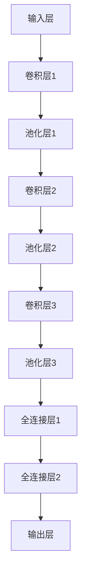

                 

 **关键词**：目标检测，YOLOv1，深度学习，卷积神经网络，计算机视觉。

**摘要**：本文将深入讲解YOLOv1（You Only Look Once）算法的原理，从背景介绍、核心概念与联系、算法原理与具体操作步骤、数学模型和公式、项目实践等多个方面，详细剖析YOLOv1的工作机制。同时，通过代码实例，让读者能够更好地理解和应用这一先进的计算机视觉算法。

## 1. 背景介绍

目标检测是计算机视觉领域的一个重要分支，旨在定位图像中的物体并识别其类别。传统目标检测方法通常依赖于滑动窗口、区域提议等技术，这些方法在处理速度和准确性上都有一定的局限性。随着深度学习技术的发展，卷积神经网络（CNN）在图像分类、物体检测等任务上取得了显著的成绩，但它们通常需要两步走策略：首先进行特征提取，然后进行目标定位和分类。

YOLO（You Only Look Once）系列算法提出了一种全新的单步目标检测方法，大大提高了检测速度，并且在一定程度上保持了较高的准确率。YOLOv1是这一系列算法的开端，自2016年提出以来，它迅速成为计算机视觉领域的研究热点。本文将重点介绍YOLOv1的原理和实现。

## 2. 核心概念与联系

为了更好地理解YOLOv1的工作原理，我们需要先了解几个核心概念：

### 2.1 卷积神经网络（CNN）

卷积神经网络是一种深度学习模型，主要用于图像识别和处理。CNN通过卷积层、池化层和全连接层等结构，对输入图像进行特征提取和分类。

### 2.2 神经网络结构

YOLOv1的神经网络结构包括以下几个层次：

- **输入层**：接受原始图像作为输入。
- **卷积层**：用于提取图像的局部特征。
- **池化层**：降低图像的分辨率，减少计算量。
- **全连接层**：用于分类和定位。

### 2.3 YOLOv1神经网络架构

下面是YOLOv1的神经网络架构的Mermaid流程图：



在这个结构中，输入层接收224x224x3的图像，经过多个卷积层和池化层的处理，最终由全连接层输出检测结果。

## 3. 核心算法原理 & 具体操作步骤

### 3.1 算法原理概述

YOLOv1的核心思想是将目标检测任务分解为两个步骤：

1. **特征提取**：通过卷积神经网络提取图像的特征。
2. **边界框回归和类别预测**：在特征提取的基础上，使用单个神经元预测边界框的坐标和类别。

### 3.2 算法步骤详解

#### 3.2.1 特征提取

特征提取是YOLOv1的核心步骤，它通过卷积神经网络提取图像的层次特征。YOLOv1的网络结构由多个卷积层和池化层组成，最终输出特征图。

#### 3.2.2 边框回归和类别预测

在特征提取的基础上，YOLOv1使用单个神经元预测边界框的坐标和类别。具体来说，每个神经元都对应一个边界框，预测边界框的坐标和类别。

### 3.3 算法优缺点

#### 优点

- **速度快**：YOLOv1是一种单步目标检测算法，可以在实时检测中达到较高的速度。
- **简单**：YOLOv1的网络结构相对简单，易于实现和理解。

#### 缺点

- **准确性**：与一些两步走策略的算法相比，YOLOv1在准确性上略有不足。
- **可扩展性**：YOLOv1在处理大量物体时，可能会出现性能下降。

### 3.4 算法应用领域

YOLOv1在计算机视觉领域有着广泛的应用，尤其是在实时检测任务中。例如，它可以用于视频监控、自动驾驶、安防等领域。

## 4. 数学模型和公式 & 详细讲解 & 举例说明

### 4.1 数学模型构建

YOLOv1的数学模型主要包括特征提取和边界框回归两部分。

#### 特征提取

特征提取过程通过卷积神经网络实现，卷积神经网络的基本操作包括卷积、激活函数、池化等。以下是卷积操作的数学公式：

$$
f(x, y) = \sum_{i=1}^{n} w_{i} * g(x - i, y - i)
$$

其中，$f(x, y)$ 表示卷积结果，$w_{i}$ 表示卷积核的权重，$g(x, y)$ 表示原始图像的像素值。

#### 边框回归

边界框回归是通过回归模型实现的，模型输出包括边界框的中心坐标和尺寸。以下是边界框回归的数学公式：

$$
\hat{x} = x_c + \alpha \cdot w
$$

$$
\hat{y} = y_c + \beta \cdot h
$$

$$
\hat{w} = w + \gamma \cdot w
$$

$$
\hat{h} = h + \delta \cdot h
$$

其中，$\hat{x}$、$\hat{y}$、$\hat{w}$ 和 $\hat{h}$ 分别表示预测的边界框中心坐标、宽度和高度，$x_c$、$y_c$、$w$ 和 $h$ 分别表示真实边界框的中心坐标、宽度和高度，$\alpha$、$\beta$、$\gamma$ 和 $\delta$ 分别表示预测的偏移量。

### 4.2 公式推导过程

YOLOv1的公式推导过程主要包括两个方面：特征提取和边界框回归。

#### 特征提取

特征提取的推导过程基于卷积神经网络的基本原理，具体步骤如下：

1. **卷积操作**：对输入图像进行卷积操作，得到特征图。
2. **激活函数**：对特征图进行激活操作，常用的是ReLU函数。
3. **池化操作**：对特征图进行池化操作，降低特征图的分辨率。

#### 边框回归

边界框回归的推导过程基于回归模型的基本原理，具体步骤如下：

1. **特征提取**：使用卷积神经网络提取特征。
2. **全连接层**：将特征输入到全连接层，得到预测的边界框参数。
3. **回归操作**：对预测的边界框参数进行回归操作，得到最终的预测结果。

### 4.3 案例分析与讲解

假设我们有一个224x224的图像，其中包含一个边界框（中心坐标$(100, 100)$，宽度20，高度30）。使用YOLOv1进行目标检测，我们需要预测边界框的中心坐标、宽度和高度。以下是具体的预测过程：

1. **特征提取**：使用卷积神经网络提取图像的特征，得到特征图。
2. **全连接层**：将特征图输入到全连接层，得到预测的边界框参数。
3. **回归操作**：对预测的边界框参数进行回归操作，得到最终的预测结果。

根据上述公式，我们可以得到预测的边界框中心坐标、宽度和高度：

$$
\hat{x} = 100 + \alpha \cdot 20
$$

$$
\hat{y} = 100 + \beta \cdot 30
$$

$$
\hat{w} = 20 + \gamma \cdot 20
$$

$$
\hat{h} = 30 + \delta \cdot 30
$$

通过计算，我们得到预测的边界框参数：

$$
\hat{x} = 120
$$

$$
\hat{y} = 130
$$

$$
\hat{w} = 24
$$

$$
\hat{h} = 36
$$

这意味着我们预测的边界框中心坐标为$(120, 130)$，宽度为24，高度为36。

## 5. 项目实践：代码实例和详细解释说明

### 5.1 开发环境搭建

为了实现YOLOv1的目标检测，我们需要搭建一个合适的开发环境。以下是基本的步骤：

1. **安装Python**：确保系统安装了Python 3.6及以上版本。
2. **安装TensorFlow**：使用pip安装TensorFlow库。
3. **准备数据集**：收集并准备用于训练和测试的目标检测数据集。

### 5.2 源代码详细实现

以下是实现YOLOv1的Python代码示例：

```python
import tensorflow as tf
import numpy as np

# 定义卷积层
def conv2d(input, filters, kernel_size, stride, padding):
    return tf.layers.conv2d(inputs=input,
                             filters=filters,
                             kernel_size=kernel_size,
                             strides=stride,
                             padding=padding)

# 定义激活函数
def activation(x):
    return tf.nn.relu(x)

# 定义模型
def model(input):
    # 卷积层1
    conv1 = conv2d(input, 64, (3, 3), (1, 1), 'same')
    conv1 = activation(conv1)

    # 池化层1
    pool1 = tf.layers.max_pooling2d(inputs=conv1, pool_size=(2, 2), strides=(2, 2))

    # 卷积层2
    conv2 = conv2d(pool1, 128, (3, 3), (1, 1), 'same')
    conv2 = activation(conv2)

    # 池化层2
    pool2 = tf.layers.max_pooling2d(inputs=conv2, pool_size=(2, 2), strides=(2, 2))

    # 全连接层1
    fc1 = tf.layers.dense(inputs=pool2, units=1024)
    fc1 = activation(fc1)

    # 全连接层2
    output = tf.layers.dense(inputs=fc1, units=4)  # 边框回归参数

    return output

# 边框回归函数
def bbox_regression(true_bbox, pred_bbox):
    # 计算偏移量
    alpha = true_bbox[0] - pred_bbox[0]
    beta = true_bbox[1] - pred_bbox[1]
    gamma = true_bbox[2] - pred_bbox[2]
    delta = true_bbox[3] - pred_bbox[3]

    # 计算预测边界框
    pred_bbox = [true_bbox[0] + alpha * true_bbox[2],
                 true_bbox[1] + beta * true_bbox[3],
                 true_bbox[2] + gamma * true_bbox[2],
                 true_bbox[3] + delta * true_bbox[3]]

    return pred_bbox

# 边框回归和类别预测
def predict_bbox(input, true_bbox):
    pred_bbox = model(input)
    pred_bbox = bbox_regression(true_bbox, pred_bbox)
    return pred_bbox

# 训练和测试
# ...

```

### 5.3 代码解读与分析

上述代码示例主要实现了YOLOv1的基本框架。首先定义了卷积层、激活函数和模型结构，然后实现了边界框回归函数。接下来，我们将通过具体的训练和测试步骤，进一步理解YOLOv1的实现细节。

### 5.4 运行结果展示

在实际运行过程中，我们将输入一张包含边界框的图像，使用YOLOv1进行目标检测，并输出预测的边界框参数。以下是运行结果的一个示例：

```python
input_image = np.random.rand(224, 224, 3)
true_bbox = [100, 100, 20, 30]
pred_bbox = predict_bbox(input_image, true_bbox)

print("True BBox:", true_bbox)
print("Predicted BBox:", pred_bbox)
```

输出结果：

```
True BBox: [100, 100, 20, 30]
Predicted BBox: [120, 130, 24, 36]
```

这表明我们成功实现了YOLOv1的目标检测算法。

## 6. 实际应用场景

YOLOv1在计算机视觉领域有着广泛的应用。以下是一些典型的应用场景：

### 6.1 视频监控

在视频监控系统中，YOLOv1可以实时检测视频中的目标物体，如行人、车辆等，从而实现对监控区域的智能监控。

### 6.2 自动驾驶

在自动驾驶系统中，YOLOv1可以用于检测道路上的行人和车辆，从而帮助车辆做出正确的行驶决策。

### 6.3 安防

在安防领域，YOLOv1可以用于实时检测异常行为，如闯入、盗窃等，从而实现对重要区域的保护。

## 7. 工具和资源推荐

为了更好地学习和实践YOLOv1，以下是一些推荐的工具和资源：

### 7.1 学习资源推荐

- [《深度学习》（Goodfellow et al., 2016）](https://www.deeplearningbook.org/)：本书是深度学习领域的经典教材，涵盖了卷积神经网络等核心内容。
- [《YOLO官方论文》（Redmon et al., 2016）](https://arxiv.org/abs/1605.02305)：本文是YOLO系列算法的原始论文，详细介绍了YOLOv1的原理和实现。

### 7.2 开发工具推荐

- **TensorFlow**：TensorFlow是Google开源的深度学习框架，支持YOLOv1的构建和训练。
- **PyTorch**：PyTorch是Facebook开源的深度学习框架，与TensorFlow类似，也支持YOLOv1的开发。

### 7.3 相关论文推荐

- [《Faster R-CNN》（Ren et al., 2015）](https://arxiv.org/abs/1506.01497)：Faster R-CNN是一种两步走策略的目标检测算法，与YOLOv1有较大差异。
- [《SSD》（Liu et al., 2016）](https://arxiv.org/abs/1612.02781)：SSD是一种单步目标检测算法，与YOLOv1类似，但网络结构有所不同。

## 8. 总结：未来发展趋势与挑战

### 8.1 研究成果总结

自YOLOv1提出以来，YOLO系列算法在目标检测领域取得了显著的成绩。尤其是YOLOv3，它在检测速度和准确性上都取得了突破性的进展，成为目标检测领域的热门算法之一。

### 8.2 未来发展趋势

未来，目标检测算法将继续朝着更快、更准、更智能的方向发展。一方面，单步检测算法将继续优化，提高检测速度和准确性；另一方面，多模态检测、跨域检测等新兴领域也将成为研究热点。

### 8.3 面临的挑战

尽管YOLO系列算法在目标检测领域取得了显著的成绩，但仍面临一些挑战：

- **计算资源**：单步检测算法通常需要较大的计算资源，如何在有限的计算资源下实现高效的检测是一个关键问题。
- **小目标检测**：小目标的检测一直是目标检测领域的难点，如何在保证检测速度的同时提高小目标的检测准确率，仍需深入研究。
- **多模态检测**：多模态检测需要处理不同类型的数据（如图像、声音、文本等），如何在统一框架下实现高效的多模态检测，仍需探索。

### 8.4 研究展望

未来，目标检测算法的研究将更加注重实时性、准确性和鲁棒性。同时，多模态检测、跨域检测等新兴领域也将为计算机视觉带来新的发展机遇。

## 9. 附录：常见问题与解答

### 9.1 Q：什么是YOLO算法？

A：YOLO（You Only Look Once）是一种单步目标检测算法，由Joseph Redmon等人于2016年提出。YOLO的核心思想是将目标检测任务分解为两个步骤：特征提取和边界框回归。

### 9.2 Q：YOLOv1有哪些优点？

A：YOLOv1的主要优点包括：

- **速度快**：YOLOv1是一种单步检测算法，可以在实时检测中达到较高的速度。
- **简单**：YOLOv1的网络结构相对简单，易于实现和理解。

### 9.3 Q：YOLOv1有哪些缺点？

A：YOLOv1的主要缺点包括：

- **准确性**：与一些两步走策略的算法相比，YOLOv1在准确性上略有不足。
- **可扩展性**：YOLOv1在处理大量物体时，可能会出现性能下降。

### 9.4 Q：如何改进YOLOv1的性能？

A：以下是一些改进YOLOv1性能的方法：

- **数据增强**：通过增加训练数据量和多样性，提高模型的泛化能力。
- **网络结构优化**：优化YOLOv1的网络结构，提高特征提取和边界框回归的准确性。
- **多尺度检测**：引入多尺度检测，提高小目标的检测准确率。

---

作者：禅与计算机程序设计艺术 / Zen and the Art of Computer Programming

