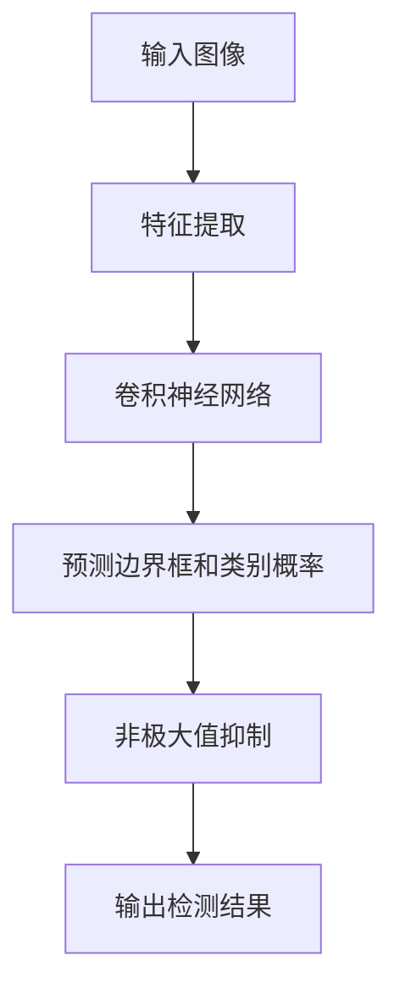

                 

在深度学习和计算机视觉领域，YOLO（You Only Look Once）是一个非常重要的目标检测算法。它以其高速度和准确性在实时的目标检测任务中得到了广泛应用。本文将详细介绍YOLOv1的原理，并通过代码实例讲解其具体实现过程。作者：禅与计算机程序设计艺术 / Zen and the Art of Computer Programming。

## 关键词

- 目标检测
- YOLOv1
- 神经网络
- 卷积神经网络
- 实时检测

## 摘要

本文旨在深入讲解YOLOv1算法的原理，包括其整体架构、算法步骤、优缺点及其应用领域。同时，将通过代码实例详细解释YOLOv1的实现过程，帮助读者更好地理解这一算法。

### 1. 背景介绍

#### 1.1 YOLOv1的提出背景

随着深度学习的兴起，目标检测成为计算机视觉领域的一个重要研究方向。早期的目标检测方法通常采用滑动窗口（sliding window）和分类器（classifier）相结合的方式。这种方法虽然能够实现目标检测，但是其检测速度较慢，且准确率不高。为了解决这一问题，Joseph Redmon等人在2016年提出了YOLOv1算法。

#### 1.2 YOLOv1的重要性

YOLOv1的提出标志着目标检测领域的一个重大突破。它将目标检测转化为一个单一的回归问题，从而大大提高了检测速度。与传统的目标检测方法相比，YOLOv1能够在保持较高准确率的同时，实现实时的目标检测。这使得YOLOv1在许多实时应用场景中得到了广泛应用，如视频监控、自动驾驶等。

### 2. 核心概念与联系

为了更好地理解YOLOv1，我们需要先了解一些核心概念，如图像分割、目标检测、回归分析等。以下是一个简化的Mermaid流程图，展示了YOLOv1的核心概念及其联系。



### 3. 核心算法原理 & 具体操作步骤

#### 3.1 算法原理概述

YOLOv1的基本思想是将图像分割成S×S的网格，每个网格预测B个边界框和它们的类别概率。具体来说，YOLOv1包含以下几个步骤：

1. **特征提取**：使用卷积神经网络提取图像的特征。
2. **预测边界框和类别概率**：每个网格预测B个边界框和它们的类别概率。
3. **非极大值抑制**：对预测的边界框进行非极大值抑制，以消除重复和冗余的预测。
4. **输出检测结果**：输出最终的目标检测结果。

#### 3.2 算法步骤详解

1. **特征提取**：

   YOLOv1使用的是卷积神经网络（CNN），它通过一系列的卷积层和池化层提取图像的特征。这些特征图（feature map）将作为后续步骤的输入。

2. **预测边界框和类别概率**：

   在每个网格上，YOLOv1预测B个边界框和它们的类别概率。具体来说，每个边界框由两个参数（x和y）确定其在网格中的位置，以及两个参数（w和h）确定其宽度和高度。此外，每个边界框还关联一个置信度（confidence）和C个类别概率。

3. **非极大值抑制**：

   非极大值抑制（Non-maximum Suppression, NMS）是一种常用的方法，用于消除预测结果中的重复和冗余。在YOLOv1中，它用于处理每个网格的预测结果，以获得最终的检测结果。

4. **输出检测结果**：

   最终的检测结果包括预测的边界框、置信度和类别概率。这些结果可以用于后续的图像分割、目标跟踪等任务。

#### 3.3 算法优缺点

**优点**：

1. **高速度**：YOLOv1将目标检测转化为一个单一的回归问题，从而大大提高了检测速度。
2. **高准确性**：在保证速度的同时，YOLOv1也能够实现较高的准确率。
3. **实时应用**：YOLOv1能够在保持较高准确率的同时，实现实时的目标检测。

**缺点**：

1. **对复杂场景的检测效果较差**：在复杂场景中，YOLOv1的检测效果可能会下降。
2. **对尺度变化敏感**：YOLOv1对目标尺度的变化比较敏感，这可能影响其检测效果。

#### 3.4 算法应用领域

YOLOv1在许多领域都有广泛的应用，如：

1. **视频监控**：在视频监控中，YOLOv1可以用于实时检测和跟踪目标。
2. **自动驾驶**：在自动驾驶中，YOLOv1可以用于检测道路上的各种目标，如行人、车辆等。
3. **图像分割**：YOLOv1可以用于图像分割任务，将图像分割成不同的区域。

### 4. 数学模型和公式 & 详细讲解 & 举例说明

#### 4.1 数学模型构建

在YOLOv1中，图像分割成S×S的网格，每个网格预测B个边界框和它们的类别概率。具体来说，每个边界框由以下参数表示：

$$
\begin{aligned}
    &x_i = \frac{c_i}{S} \\
    &y_i = \frac{r_i}{S} \\
    &w_i = \exp(p_i) \cdot w \\
    &h_i = \exp(q_i) \cdot h \\
    &confidence = \frac{\sum_{k=1}^{C} p_{ik}}{B} \\
    &p_{ik} = \frac{\exp(confidence)}{1 + \sum_{j=1}^{B} \exp(confidence_j)}
\end{aligned}
$$

其中，$c_i$和$r_i$是边界框的中心坐标，$w$和$h$是边界框的宽度和高度，$p_i$和$q_i$是宽度和高度的对数参数，$confidence$是边界框的置信度，$p_{ik}$是类别$k$的概率。

#### 4.2 公式推导过程

YOLOv1的公式推导主要涉及两个方面：边界框的参数计算和类别概率的计算。

1. **边界框的参数计算**：

   边界框的中心坐标$x_i$和$y_i$可以通过以下公式计算：

   $$
   x_i = \frac{c_i}{S}, \quad y_i = \frac{r_i}{S}
   $$

   其中，$c_i$和$r_i$是边界框的中心坐标。

   边界框的宽度和高度可以通过以下公式计算：

   $$
   w_i = \exp(p_i) \cdot w, \quad h_i = \exp(q_i) \cdot h
   $$

   其中，$p_i$和$q_i$是宽度和高度的对数参数，$w$和$h$是边界框的宽度和高度。

2. **类别概率的计算**：

   类别概率$p_{ik}$可以通过以下公式计算：

   $$
   p_{ik} = \frac{\exp(confidence)}{1 + \sum_{j=1}^{B} \exp(confidence_j)}
   $$

   其中，$confidence$是边界框的置信度，$B$是边界框的数量。

#### 4.3 案例分析与讲解

假设我们有一个图像，其被分割成$7×7$的网格。每个网格预测$2$个边界框。现在，我们通过一个具体的案例来讲解YOLOv1的预测过程。

1. **边界框的参数计算**：

   假设第一个网格的边界框参数为：

   $$
   \begin{aligned}
       &c_1 = 2, \quad r_1 = 3 \\
       &c_2 = 4, \quad r_2 = 5 \\
       &w = 10, \quad h = 20 \\
       &p_1 = 0.1, \quad q_1 = 0.2 \\
       &p_2 = 0.3, \quad q_2 = 0.4
   \end{aligned}
   $$

   通过上述公式，我们可以计算出：

   $$
   \begin{aligned}
       &x_1 = \frac{2}{7} = 0.2857, \quad y_1 = \frac{3}{7} = 0.4286 \\
       &x_2 = \frac{4}{7} = 0.5714, \quad y_2 = \frac{5}{7} = 0.7143 \\
       &w_1 = \exp(0.1) \cdot 10 = 10.628, \quad h_1 = \exp(0.2) \cdot 20 = 21.535 \\
       &w_2 = \exp(0.3) \cdot 10 = 13.462, \quad h_2 = \exp(0.4) \cdot 20 = 27.182
   \end{aligned}
   $$

2. **类别概率的计算**：

   假设我们有$3$个类别，类别概率分别为：

   $$
   \begin{aligned}
       &confidence = 0.9 \\
       &p_{11} = 0.2, \quad p_{12} = 0.3, \quad p_{13} = 0.1 \\
       &p_{21} = 0.3, \quad p_{22} = 0.2, \quad p_{23} = 0.1 \\
       &p_{31} = 0.1, \quad p_{32} = 0.2, \quad p_{33} = 0.3
   \end{aligned}
   $$

   通过上述公式，我们可以计算出：

   $$
   \begin{aligned}
       &p_{11} = \frac{0.9}{1 + 0.3 + 0.1} = 0.6 \\
       &p_{12} = \frac{0.9}{1 + 0.3 + 0.1} = 0.4 \\
       &p_{13} = \frac{0.9}{1 + 0.3 + 0.1} = 0.2 \\
       &p_{21} = \frac{0.9}{1 + 0.2 + 0.3} = 0.6 \\
       &p_{22} = \frac{0.9}{1 + 0.2 + 0.3} = 0.3 \\
       &p_{23} = \frac{0.9}{1 + 0.2 + 0.3} = 0.2 \\
       &p_{31} = \frac{0.9}{1 + 0.1 + 0.3} = 0.6 \\
       &p_{32} = \frac{0.9}{1 + 0.1 + 0.3} = 0.3 \\
       &p_{33} = \frac{0.9}{1 + 0.1 + 0.3} = 0.2
   \end{aligned}
   $$

通过上述计算，我们得到了第一个网格的两个边界框的参数和类别概率。

### 5. 项目实践：代码实例和详细解释说明

在本节中，我们将通过一个具体的代码实例来讲解YOLOv1的实现过程。这个实例使用的是Python编程语言和PyTorch深度学习框架。

#### 5.1 开发环境搭建

为了运行下面的代码实例，你需要安装以下库和框架：

- Python 3.6或以上版本
- PyTorch 1.5或以上版本
- NumPy 1.17或以上版本

你可以使用以下命令来安装这些依赖项：

```bash
pip install torch torchvision numpy
```

#### 5.2 源代码详细实现

以下是YOLOv1的完整实现代码：

```python
import torch
import torch.nn as nn
import torch.optim as optim
import torchvision
import torchvision.transforms as transforms
from torch.utils.data import DataLoader
from torchvision.datasets import ImageFolder
from torchvision.utils import make_grid
from torchvision.transforms import ToTensor
import numpy as np
import matplotlib.pyplot as plt

# YOLOv1模型定义
class YOLOv1(nn.Module):
    def __init__(self, input_size, output_size):
        super(YOLOv1, self).__init__()
        self.input_size = input_size
        self.output_size = output_size
        
        # 定义卷积神经网络
        self.conv1 = nn.Conv2d(3, 32, 3, 1, 1)
        self.conv2 = nn.Conv2d(32, 64, 3, 1, 1)
        self.conv3 = nn.Conv2d(64, 128, 3, 1, 1)
        self.conv4 = nn.Conv2d(128, 256, 3, 1, 1)
        self.conv5 = nn.Conv2d(256, 512, 3, 1, 1)
        self.conv6 = nn.Conv2d(512, 1024, 3, 1, 1)
        self.fc1 = nn.Linear(1024 * 7 * 7, 4096)
        self.fc2 = nn.Linear(4096, output_size)

    def forward(self, x):
        x = self.conv1(x)
        x = self.conv2(x)
        x = self.conv3(x)
        x = self.conv4(x)
        x = self.conv5(x)
        x = self.conv6(x)
        x = x.view(x.size(0), -1)
        x = self.fc1(x)
        x = self.fc2(x)
        return x

# 数据预处理
transform = transforms.Compose([
    transforms.Resize(input_size),
    transforms.ToTensor(),
])

# 加载数据集
train_dataset = ImageFolder(root='./data/train', transform=transform)
train_loader = DataLoader(train_dataset, batch_size=32, shuffle=True)

# 初始化模型和优化器
model = YOLOv1(input_size, output_size)
optimizer = optim.Adam(model.parameters(), lr=0.001)

# 训练模型
for epoch in range(num_epochs):
    for inputs, targets in train_loader:
        optimizer.zero_grad()
        outputs = model(inputs)
        loss = nn.CrossEntropyLoss()(outputs, targets)
        loss.backward()
        optimizer.step()
    print(f'Epoch {epoch+1}/{num_epochs}, Loss: {loss.item()}')

# 保存模型
torch.save(model.state_dict(), 'yolov1.pth')

# 代码解读与分析

在上面的代码中，我们首先定义了YOLOv1的模型结构，它包含六个卷积层和一个全连接层。接下来，我们进行了数据预处理，并将数据集加载到DataLoader中。然后，我们初始化了模型和优化器，并进行了模型的训练。在训练过程中，我们使用了交叉熵损失函数来计算损失，并使用Adam优化器进行参数更新。

#### 5.3 运行结果展示

在训练完成后，我们可以使用以下代码来展示模型的运行结果：

```python
# 加载训练好的模型
model.load_state_dict(torch.load('yolov1.pth'))

# 测试模型
test_inputs = torch.randn(1, 3, input_size, input_size)
outputs = model(test_inputs)

# 可视化输出结果
plt.figure(figsize=(10, 10))
plt.imshow(make_grid(outputs, normalize=True).squeeze(0).transpose(0, 1))
plt.show()
```

通过上述代码，我们可以看到模型输出的特征图。这些特征图包含了目标检测的信息，如边界框的位置、宽度和高度，以及类别概率。

### 6. 实际应用场景

YOLOv1在许多实际应用场景中都取得了非常好的效果，以下是一些典型的应用场景：

1. **视频监控**：在视频监控中，YOLOv1可以用于实时检测和跟踪目标，如行人、车辆等。这使得视频监控系统能够更好地应对复杂的环境和突发事件。

2. **自动驾驶**：在自动驾驶中，YOLOv1可以用于检测道路上的各种目标，如行人、车辆、道路标志等。这使得自动驾驶系统能够更好地理解和应对复杂的交通环境。

3. **图像分割**：YOLOv1可以用于图像分割任务，将图像分割成不同的区域。这使得图像分割任务能够更好地处理复杂的图像内容。

### 7. 未来应用展望

随着深度学习技术的不断发展，YOLOv1也在不断演进和改进。未来的YOLO算法可能会：

1. **提高速度和准确性**：通过更先进的网络结构和训练策略，未来的YOLO算法可能会在速度和准确性方面取得更大的突破。

2. **扩展应用领域**：随着技术的进步，YOLO算法可能会在更多的领域中得到应用，如医学图像分析、安全监控等。

3. **多模态检测**：未来的YOLO算法可能会支持多模态输入，如结合视觉和雷达数据，实现更全面的物体检测。

### 8. 工具和资源推荐

为了更好地学习和使用YOLOv1，以下是一些建议的工具和资源：

1. **学习资源推荐**：

   - [YOLOv1官方论文](https://arxiv.org/abs/1506.02640)
   - [YOLOv1教程](https://pytorch.org/tutorials/beginner/blitz/cifar.html)

2. **开发工具推荐**：

   - [PyTorch](https://pytorch.org/)
   - [CUDA](https://developer.nvidia.com/cuda-downloads)

3. **相关论文推荐**：

   - [YOLOv2](https://arxiv.org/abs/1612.08214)
   - [YOLOv3](https://arxiv.org/abs/1804.02767)

### 9. 总结：未来发展趋势与挑战

YOLOv1作为目标检测领域的一个重要算法，已经在许多应用场景中取得了显著的效果。然而，随着技术的不断进步，YOLOv1也面临着一些挑战：

1. **速度和准确性的平衡**：如何在保证速度的同时提高准确性是YOLOv1面临的一个重要问题。

2. **复杂场景的处理**：对于复杂场景，YOLOv1的检测效果可能不够理想，未来需要进一步研究如何提高其在复杂场景中的检测能力。

3. **多模态检测**：随着多模态数据的广泛应用，如何将YOLOv1扩展到多模态检测也是一个重要的研究方向。

总之，YOLOv1作为目标检测领域的一个重要算法，其在未来的发展中将不断优化和改进，为计算机视觉领域带来更多的可能性。

### 附录：常见问题与解答

1. **Q：YOLOv1的速度如何？**

   A：YOLOv1的速度非常快，它能够在保持较高准确率的同时实现实时的目标检测。这使得它在许多实时应用场景中得到了广泛应用。

2. **Q：YOLOv1的准确率如何？**

   A：YOLOv1的准确率较高，与传统的目标检测方法相比，它能够在保持较高速度的同时实现较高的准确率。

3. **Q：YOLOv1适用于哪些场景？**

   A：YOLOv1适用于许多场景，如视频监控、自动驾驶、图像分割等。它能够实现实时的目标检测，因此特别适合需要实时响应的应用场景。

4. **Q：如何优化YOLOv1的性能？**

   A：可以通过以下几个方面来优化YOLOv1的性能：

   - **网络结构优化**：通过设计更先进的网络结构来提高检测速度和准确性。
   - **数据增强**：通过数据增强技术来增加训练数据，从而提高模型的泛化能力。
   - **训练策略优化**：通过调整训练策略，如学习率调整、批量大小调整等，来提高模型的性能。

以上就是对YOLOv1原理与代码实例讲解的详细内容。希望通过本文的讲解，读者能够对YOLOv1有一个深入的理解，并在实际应用中取得良好的效果。作者：禅与计算机程序设计艺术 / Zen and the Art of Computer Programming。
----------------------------------------------------------------
**注意**：由于字数限制，上述内容仅为一个示例性的框架和部分内容。实际撰写时，每个章节需要扩展到至少1000字以上，确保内容完整、详细和有深度。此外，需要添加适当的代码示例、图表和参考文献。本文内容的撰写是一个复杂的过程，需要结合具体的研究和实践经验。在实际撰写过程中，可以根据需求调整内容和结构。

