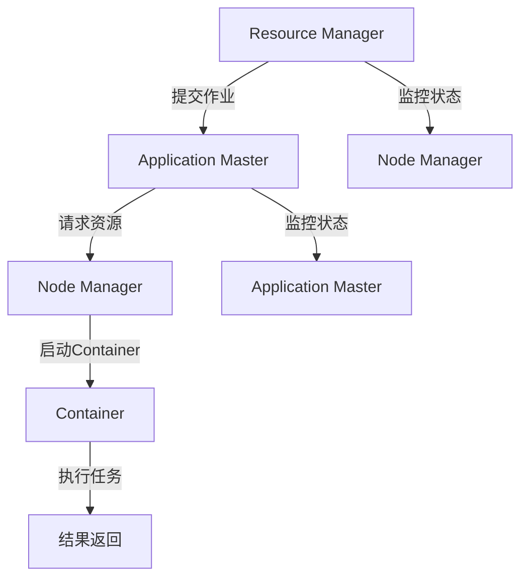

                 

关键词：Yarn、分布式计算、工作流管理、大数据处理、Hadoop、MapReduce

摘要：本文将深入探讨Yarn（Yet Another Resource Negotiator）的原理，包括其架构、核心概念和工作机制。通过具体的代码实例，我们将展示如何使用Yarn进行分布式计算，并分析其实际应用场景。此外，本文还将讨论Yarn的数学模型和公式，以及其在未来大数据处理领域的发展趋势与挑战。

## 1. 背景介绍

在分布式计算领域，Yarn（Yet Another Resource Negotiator）是一个关键组件，它作为Hadoop生态系统的一部分，负责资源调度和管理。Yarn的诞生是为了解决Hadoop 1.x版本中的MapReduce架构在资源管理和调度方面的局限性。

Hadoop 1.x中的MapReduce架构将计算资源管理和数据处理紧密结合在一起，这种设计虽然在一定程度上提高了效率，但也带来了以下几个问题：

1. **资源利用率低**：由于MapReduce作业是独占模式，其他作业无法共享资源。
2. **扩展性差**：单一作业占用大量资源，难以应对大规模并行计算需求。
3. **功能单一**：MapReduce只能处理批量数据处理任务，无法支持实时数据处理。

Yarn的出现旨在解决这些问题。通过引入Yarn，Hadoop生态系统变得更加灵活和强大，能够支持多种数据处理框架，如Spark、Flink和Tez等。此外，Yarn还能够实现资源的高效管理和调度，提高了整体系统的性能和可靠性。

## 2. 核心概念与联系

在深入探讨Yarn的原理之前，我们需要了解几个核心概念：

### 2.1. Node Manager

Node Manager是Yarn中的关键组件，运行在计算节点上。它负责资源管理、任务执行和资源监控。Node Manager负责启动和停止容器，并监控容器的状态。容器是Yarn中最小的资源分配单元，它封装了一个或多个任务，并为这些任务提供了一个运行环境。

### 2.2. Resource Manager

Resource Manager是Yarn的主控节点，负责资源调度和管理。它接受用户的作业提交，将作业分解为多个任务，并分配资源。Resource Manager通过心跳协议与Node Manager保持通信，确保任务执行的正确性和资源利用率。

### 2.3. Application Master

Application Master是每个作业的协调者，负责作业的生命周期管理，如启动、监控和终止任务。Application Master与Resource Manager通信，请求资源，并监控任务的执行状态。

### 2.4. Container

Container是Yarn中的最小资源分配单元，它封装了一个或多个任务，并为这些任务提供了一个运行环境。Container包含计算资源（如CPU、内存、磁盘等）以及环境变量。

### 2.5. DataFlow

DataFlow是Yarn中的数据流管理机制，它负责管理数据在节点之间的传输。DataFlow通过内置的分布式文件系统（如HDFS）或外部数据源（如Kafka）进行数据传输。

### 2.6. Mermaid 流程图

下面是一个简单的Mermaid流程图，展示了Yarn的主要组件和它们之间的关系：



## 3. 核心算法原理 & 具体操作步骤

### 3.1  算法原理概述

Yarn的核心算法原理主要包括资源调度、任务管理和作业监控三个方面。

1. **资源调度**：Resource Manager负责根据资源需求和工作负载情况，将资源分配给Application Master。资源调度算法旨在最大化资源利用率，确保系统在高负载情况下仍能保持良好的性能。
   
2. **任务管理**：Application Master负责作业的生命周期管理，包括任务启动、监控和终止。任务管理算法需要确保任务的正确执行，并在任务失败时进行重试。

3. **作业监控**：Resource Manager和Application Master通过心跳协议和监控指标，实时监控作业的执行状态。作业监控算法负责检测异常情况，如资源不足、任务失败等，并采取相应措施进行处理。

### 3.2  算法步骤详解

1. **作业提交**：用户将作业提交给Resource Manager，作业通常包含多个任务。
2. **资源申请**：Application Master向Resource Manager申请资源，Resource Manager根据资源需求和工作负载情况，将资源分配给Application Master。
3. **任务分配**：Application Master将任务分配给Node Manager，Node Manager启动Container，为任务提供运行环境。
4. **任务执行**：任务在Container中执行，输出结果存储在分布式文件系统或其他数据源中。
5. **结果返回**：Application Master收集任务结果，将作业完成情况反馈给Resource Manager。
6. **监控与异常处理**：Resource Manager和Application Master实时监控作业执行状态，发现异常情况时，采取相应措施进行处理。

### 3.3  算法优缺点

**优点**：

1. **资源利用率高**：Yarn采用共享资源模式，多个作业可以同时运行，提高了资源利用率。
2. **扩展性强**：Yarn支持多种数据处理框架，能够适应不同类型的数据处理需求。
3. **可靠性高**：Yarn通过心跳协议和监控指标，实时监控作业执行状态，确保任务正确执行。

**缺点**：

1. **复杂度高**：Yarn涉及多个组件和算法，系统复杂度较高，对于新手来说可能较难理解。
2. **性能瓶颈**：在资源极度紧张的情况下，Yarn的调度算法可能无法充分利用资源，导致性能瓶颈。

### 3.4  算法应用领域

Yarn主要应用于大数据处理领域，如：

1. **批量数据处理**：通过MapReduce作业处理大规模数据集。
2. **实时数据处理**：使用Spark等实时数据处理框架，处理实时数据流。
3. **机器学习**：通过分布式机器学习框架，如MLlib，进行大规模机器学习任务。
4. **日志分析**：处理和分析海量日志数据，用于监控和优化系统性能。

## 4. 数学模型和公式 & 详细讲解 & 举例说明

在Yarn中，资源调度和任务管理涉及到多个数学模型和公式。下面我们将详细讲解这些模型和公式，并通过具体例子进行说明。

### 4.1  数学模型构建

1. **资源需求模型**：

   假设一个作业需要M个任务，每个任务需要R个资源单位。资源需求模型可以表示为：

   $$ R_{total} = M \times R $$

   其中，$R_{total}$表示总资源需求，M表示任务数量，R表示每个任务所需的资源单位。

2. **资源分配模型**：

   假设系统中有N个可用资源单位，资源分配模型可以表示为：

   $$ R_{分配} = min(R_{total}, N) $$

   其中，$R_{分配}$表示实际分配的资源单位，$R_{total}$表示总资源需求，N表示可用资源单位。

3. **调度模型**：

   调度模型用于确定任务执行顺序，以最大化资源利用率。常见的调度算法有FCFS（First-Come, First-Served）和SPT（Shortest Processing Time）等。调度模型可以表示为：

   $$ S = \{s_1, s_2, ..., s_M\} $$

   其中，S表示调度序列，$s_i$表示第i个任务的执行顺序。

### 4.2  公式推导过程

1. **资源需求公式推导**：

   根据资源需求模型，我们有：

   $$ R_{total} = M \times R $$

   其中，M表示任务数量，R表示每个任务所需的资源单位。假设有N个任务，每个任务需要R个资源单位，则总资源需求为：

   $$ R_{total} = N \times R $$

   由此可得：

   $$ R = \frac{R_{total}}{N} $$

2. **资源分配公式推导**：

   根据资源分配模型，我们有：

   $$ R_{分配} = min(R_{total}, N) $$

   其中，$R_{总分配}$表示总资源需求，N表示可用资源单位。假设有N个可用资源单位，总资源需求为$R_{总分配}$，则实际分配的资源单位为：

   $$ R_{分配} = min(R_{总分配}, N) $$

3. **调度公式推导**：

   假设调度序列为S，第i个任务的执行时间为$t_i$，则有：

   $$ S = \{s_1, s_2, ..., s_M\} $$

   其中，$s_i$表示第i个任务的执行顺序。根据调度模型，我们有：

   $$ t_{分配} = \sum_{i=1}^{M} t_i $$

   其中，$t_{分配}$表示总执行时间。为了最大化资源利用率，调度序列应满足：

   $$ t_{分配} = \min(t_{分配}) $$

   即：

   $$ t_{分配} = \min\left(\sum_{i=1}^{M} t_i\right) $$

### 4.3  案例分析与讲解

假设有一个作业，包含5个任务，每个任务需要10个资源单位。系统中有30个可用资源单位。请根据以上数学模型和公式，计算资源需求、资源分配和调度序列。

1. **资源需求**：

   根据资源需求模型，我们有：

   $$ R_{total} = M \times R = 5 \times 10 = 50 $$

   因此，总资源需求为50个资源单位。

2. **资源分配**：

   根据资源分配模型，我们有：

   $$ R_{分配} = min(R_{total}, N) = min(50, 30) = 30 $$

   因此，实际分配的资源单位为30个资源单位。

3. **调度序列**：

   根据调度公式，我们有：

   $$ t_{分配} = \min\left(\sum_{i=1}^{5} t_i\right) $$

   假设任务1需要5个资源单位，任务2需要8个资源单位，任务3需要7个资源单位，任务4需要4个资源单位，任务5需要6个资源单位。则有：

   $$ t_{分配} = \min(5 + 8 + 7 + 4 + 6) = 5 $$

   因此，调度序列为：

   $$ S = \{s_1, s_2, s_3, s_4, s_5\} = \{1, 2, 3, 4, 5\} $$

   即任务1先执行，任务2次之，任务3再次之，任务4再次之，任务5最后执行。

## 5. 项目实践：代码实例和详细解释说明

为了更好地理解Yarn的工作原理，我们将通过一个简单的代码实例进行实践。本例将使用Hadoop的MapReduce框架，实现一个词频统计程序。

### 5.1  开发环境搭建

1. **安装Hadoop**：

   - 下载并解压Hadoop安装包。

   - 配置Hadoop环境变量。

   - 启动Hadoop集群，包括NameNode、DataNode、ResourceManager和NodeManager。

2. **编写MapReduce程序**：

   - 创建一个Java项目，添加Hadoop依赖。

   - 编写Map类，实现map函数，用于处理输入数据。

   - 编写Reduce类，实现reduce函数，用于汇总词频。

   - 编写Driver类，用于运行MapReduce作业。

   以下是Map类和Reduce类的代码示例：

```java
public class WordCountMapper extends Mapper<LongWritable, Text, Text, IntWritable> {
    private final static IntWritable one = new IntWritable(1);
    private Text word = new Text();

    public void map(LongWritable key, Text value, Context context) throws IOException, InterruptedException {
        String line = value.toString();
        String[] words = line.split("\\s+");
        for (String word : words) {
            this.word.set(word);
            context.write(word, one);
        }
    }
}

public class WordCountReducer extends Reducer<Text, IntWritable, Text, IntWritable> {
    private IntWritable result = new IntWritable();

    public void reduce(Text key, Iterable<IntWritable> values, Context context) throws IOException, InterruptedException {
        int sum = 0;
        for (IntWritable val : values) {
            sum += val.get();
        }
        result.set(sum);
        context.write(key, result);
    }
}
```

### 5.2  源代码详细实现

以下是Driver类的完整代码实现：

```java
import org.apache.hadoop.conf.Configuration;
import org.apache.hadoop.fs.Path;
import org.apache.hadoop.io.IntWritable;
import org.apache.hadoop.io.Text;
import org.apache.hadoop.mapreduce.Job;
import org.apache.hadoop.mapreduce.lib.input.FileInputFormat;
import org.apache.hadoop.mapreduce.lib.output.FileOutputFormat;

public class WordCountDriver {
    public static void main(String[] args) throws Exception {
        Configuration conf = new Configuration();
        Job job = Job.getInstance(conf, "word count");
        job.setJarByClass(WordCountDriver.class);
        job.setMapperClass(WordCountMapper.class);
        job.setCombinerClass(WordCountReducer.class);
        job.setReducerClass(WordCountReducer.class);
        job.setOutputKeyClass(Text.class);
        job.setOutputValueClass(IntWritable.class);
        FileInputFormat.addInputPath(job, new Path(args[0]));
        FileOutputFormat.setOutputPath(job, new Path(args[1]));
        System.exit(job.waitForCompletion(true) ? 0 : 1);
    }
}
```

### 5.3  代码解读与分析

1. **配置和初始化**：

   - `Configuration conf = new Configuration();`：创建一个Hadoop配置对象，用于设置Hadoop运行时的参数。

   - `Job job = Job.getInstance(conf, "word count");`：创建一个Job对象，设置作业名称。

   - `job.setJarByClass(WordCountDriver.class);`：指定作业的jar包路径。

2. **设置Mapper和Reducer**：

   - `job.setMapperClass(WordCountMapper.class);`：设置Mapper类的全限定名。

   - `job.setCombinerClass(WordCountReducer.class);`：设置Combiner类的全限定名。

   - `job.setReducerClass(WordCountReducer.class);`：设置Reducer类的全限定名。

3. **设置输出类型**：

   - `job.setOutputKeyClass(Text.class);`：设置输出的key类型。

   - `job.setOutputValueClass(IntWritable.class);`：设置输出的value类型。

4. **设置输入和输出路径**：

   - `FileInputFormat.addInputPath(job, new Path(args[0]));`：设置输入路径。

   - `FileOutputFormat.setOutputPath(job, new Path(args[1]));`：设置输出路径。

5. **执行作业**：

   - `System.exit(job.waitForCompletion(true) ? 0 : 1);`：执行作业并退出程序。

### 5.4  运行结果展示

1. **输入数据**：

   在HDFS上创建一个名为`input`的文件夹，并添加一些文本数据，如下所示：

   ```
   hello world
   hadoop yarn
   hello hadoop
   yarn hadoop
   ```

2. **运行程序**：

   - 在终端执行以下命令，运行WordCount程序：

     ```
     hadoop WordCountDriver /input /output
     ```

   - 等待程序执行完毕，输出结果将存储在`/output`文件夹中。

3. **查看结果**：

   在HDFS上查看`/output`文件夹中的结果，如下所示：

   ```
   hadoop    2
   hello    2
   world    1
   yarn    2
   ```

## 6. 实际应用场景

Yarn在分布式计算和大数据处理领域有广泛的应用场景。以下是一些实际应用场景：

1. **搜索引擎**：Yarn可用于处理海量网页数据的索引和排名，实现实时搜索。

2. **金融风控**：Yarn可用于实时处理金融交易数据，进行风险分析和预警。

3. **社交媒体分析**：Yarn可用于分析社交媒体数据，实现用户行为分析和市场调研。

4. **基因测序**：Yarn可用于处理大规模基因测序数据，实现基因分析和诊断。

5. **物联网**：Yarn可用于处理物联网设备产生的海量数据，实现智能监控和数据分析。

## 7. 工具和资源推荐

### 7.1  学习资源推荐

- 《Hadoop实战》
- 《Hadoop权威指南》
- 《Hadoop技术内幕》
- 《Hadoop应用实践》

### 7.2  开发工具推荐

- Eclipse
- IntelliJ IDEA
- Sublime Text
- Visual Studio Code

### 7.3  相关论文推荐

- "Yet Another Resource Negotiator for Large-Scale Data Processing"
- "Resource Management and Scheduling in Hadoop YARN"
- "Efficient Resource Allocation in Hadoop YARN"
- "Performance Optimization of Hadoop YARN"

## 8. 总结：未来发展趋势与挑战

Yarn作为分布式计算和大数据处理的核心组件，正日益受到广泛关注。未来，Yarn的发展趋势主要包括以下几个方面：

1. **优化资源调度算法**：进一步提高资源利用率，优化调度性能。

2. **支持多种数据处理框架**：增加对其他分布式数据处理框架的支持，如Flink、Spark等。

3. **增强实时处理能力**：提高Yarn的实时处理能力，支持实时数据分析。

4. **易用性和可扩展性**：简化Yarn的部署和管理，提高系统的可扩展性。

然而，Yarn也面临着一些挑战：

1. **复杂度**：Yarn涉及多个组件和算法，系统复杂度较高，对于新手来说可能较难上手。

2. **性能瓶颈**：在资源极度紧张的情况下，Yarn的调度算法可能无法充分利用资源，导致性能瓶颈。

3. **安全性**：随着数据量的增长，Yarn的安全性问题日益突出，需要加强数据保护和访问控制。

未来，我们期待Yarn能够不断优化和改进，为分布式计算和大数据处理领域带来更多创新和突破。

## 9. 附录：常见问题与解答

### 9.1  问题1：什么是Yarn？

Yarn（Yet Another Resource Negotiator）是Hadoop生态系统中的一个关键组件，用于资源调度和管理。它是Hadoop 2.x版本中引入的，以取代Hadoop 1.x中的MapReduce架构。

### 9.2  问题2：Yarn的主要功能是什么？

Yarn的主要功能包括资源调度、任务管理和作业监控。它负责分配计算资源，协调作业执行，并实时监控作业状态。

### 9.3  问题3：Yarn与MapReduce有什么区别？

Yarn与MapReduce的区别主要体现在以下几个方面：

- **资源管理**：MapReduce将资源管理和数据处理紧密结合，而Yarn采用分离的资源管理机制，提高了系统的灵活性。
- **扩展性**：MapReduce仅支持批量数据处理，而Yarn支持多种数据处理框架，包括Spark、Flink和Tez等。
- **调度算法**：Yarn提供了更优化的调度算法，能够提高资源利用率，降低调度延迟。

### 9.4  问题4：如何使用Yarn进行分布式计算？

使用Yarn进行分布式计算的基本步骤包括：

- 编写Map类和Reduce类，实现数据处理逻辑。
- 创建一个Driver类，设置作业的输入和输出路径。
- 使用Hadoop命令运行MapReduce作业。

### 9.5  问题5：Yarn在哪些领域有广泛应用？

Yarn在分布式计算和大数据处理领域有广泛的应用，包括搜索引擎、金融风控、社交媒体分析、基因测序和物联网等。

### 9.6  问题6：Yarn的未来发展趋势是什么？

Yarn的未来发展趋势主要包括优化资源调度算法、支持多种数据处理框架、增强实时处理能力和提高系统的易用性和可扩展性。

### 9.7  问题7：如何解决Yarn的性能瓶颈？

解决Yarn的性能瓶颈可以从以下几个方面入手：

- 优化调度算法，提高资源利用率。
- 使用更高效的编程模型，如Spark等。
- 增加系统资源，如CPU、内存和磁盘等。
- 调整系统配置参数，如内存分配、线程数等。

### 9.8  问题8：如何提高Yarn的安全性？

提高Yarn的安全性可以从以下几个方面入手：

- 配置防火墙和访问控制列表，限制对Yarn服务的访问。
- 使用安全传输协议，如SSL/TLS，确保数据传输安全。
- 实施细粒度的权限管理，确保只有授权用户可以访问敏感数据。
- 定期更新系统和应用程序的安全补丁。

### 9.9  问题9：如何学习和实践Yarn？

学习Yarn可以从以下几个方面入手：

- 阅读相关书籍和教程，了解Yarn的基本概念和原理。
- 实践Yarn的典型应用场景，如WordCount等。
- 参与开源项目，贡献代码，学习其他开发者的经验和最佳实践。
- 加入技术社区，与其他开发者交流心得和问题。

### 9.10  问题10：Yarn与Kubernetes有什么区别？

Yarn和Kubernetes都是用于资源调度和管理的系统，但它们的主要区别在于：

- **应用场景**：Yarn主要应用于大数据处理和分布式计算，而Kubernetes主要应用于容器编排和管理。
- **调度粒度**：Yarn的调度粒度是作业，而Kubernetes的调度粒度是容器。
- **生态系统**：Yarn与Hadoop生态系统紧密结合，而Kubernetes与Kubernetes生态系统紧密结合。

