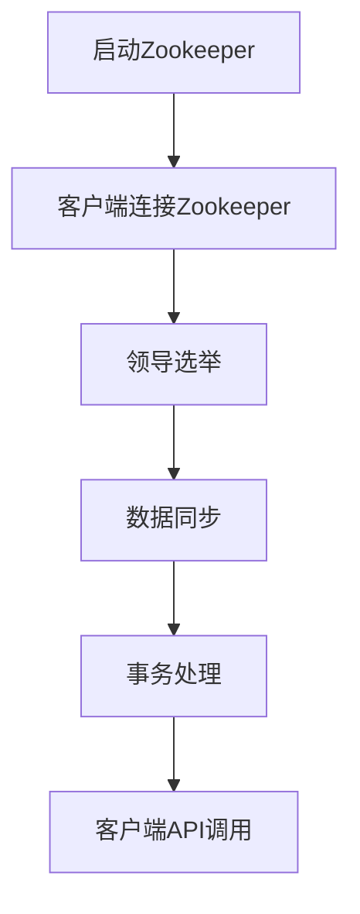

                 

关键词：Zookeeper、分布式系统、一致性、数据同步、领导选举、客户端API、源代码分析

> 摘要：本文将深入探讨Zookeeper的原理，包括其架构设计、核心概念、算法原理以及具体实现细节。通过代码实例分析，我们将理解Zookeeper在实际分布式系统中的应用和重要性。

## 1. 背景介绍

Zookeeper是一种高性能的分布式协调服务，广泛应用于分布式系统中的数据同步、领导选举、分布式锁、负载均衡等场景。它最初由Apache Software Foundation开发，旨在解决分布式系统中的一致性问题。

在分布式系统中，节点之间需要协同工作，而Zookeeper提供了分布式协调服务的解决方案。它通过维护一个简单的数据结构（类似于文件系统），提供类似于锁的服务，确保分布式系统中的各个节点能够正确地协调工作。

## 2. 核心概念与联系

### 2.1. 节点（Node）

Zookeeper中的节点用路径表示，类似于文件系统中的文件和目录。每个节点都有一个唯一的路径，由一个或多个路径段组成，例如`/root/child1`。节点可以是永久节点或临时节点。

### 2.2. 数据同步（Data Synchronization）

Zookeeper通过数据同步机制确保分布式系统中的节点能够访问到最新的数据。每个节点都会定期从其父节点获取数据，并在数据发生变化时通知子节点。

### 2.3. 领导选举（Leader Election）

Zookeeper通过领导选举算法确保分布式系统中的各个节点能够选举出一个领导者，领导选举过程通过Zab（Zookeeper Atomic Broadcast）算法实现。

### 2.4. 客户端API

Zookeeper提供了丰富的客户端API，允许开发者方便地访问Zookeeper服务。客户端API包括创建、删除、读取和写入节点数据等功能。

### 2.5. Mermaid 流程图

## 3. 核心算法原理 & 具体操作步骤

### 3.1 算法原理概述

Zookeeper的核心算法包括Zab算法、数据同步算法和领导选举算法。

- **Zab算法**：Zab（Zookeeper Atomic Broadcast）算法是一种基于日志的分布式广播算法，确保分布式系统中的节点能够顺序一致地接收消息。
- **数据同步算法**：数据同步算法通过树形结构确保分布式系统中的节点能够访问到最新的数据。
- **领导选举算法**：领导选举算法通过Zab算法实现，确保分布式系统中的节点能够选举出一个领导者。

### 3.2 算法步骤详解

- **Zab算法**：Zab算法分为三个阶段：观察者阶段、领导者阶段和恢复阶段。
  - 观察者阶段：新加入的节点首先进入观察者阶段，等待领导者发送消息。
  - 领导者阶段：领导者负责接收客户端请求、处理事务和广播消息。
  - 恢复阶段：当领导者失败时，系统进入恢复阶段，新的领导者通过Zab算法重新选举。

- **数据同步算法**：数据同步算法通过树形结构实现，每个节点定期从其父节点同步数据。

- **领导选举算法**：领导选举算法通过Zab算法实现，节点通过发送选举消息进行竞争，最终选举出一个领导者。

### 3.3 算法优缺点

- **优点**：
  - 高性能：Zookeeper能够处理高并发的分布式系统。
  - 可靠性：Zookeeper通过Zab算法确保数据的一致性。
  - 易用性：Zookeeper提供了丰富的客户端API，方便开发者使用。

- **缺点**：
  - 单点问题：Zookeeper的单点故障可能导致整个分布式系统瘫痪。
  - 内存占用：Zookeeper需要占用较多内存，特别是在处理大量数据时。

### 3.4 算法应用领域

Zookeeper广泛应用于分布式系统中的各种场景，包括：

- 数据同步：分布式系统中的节点通过Zookeeper实现数据同步。
- 领导选举：分布式系统中的节点通过Zookeeper选举出一个领导者。
- 分布式锁：分布式系统中的节点通过Zookeeper实现分布式锁。
- 负载均衡：分布式系统中的节点通过Zookeeper实现负载均衡。

## 4. 数学模型和公式 & 详细讲解 & 举例说明

### 4.1 数学模型构建

Zookeeper的数学模型主要包括以下几个方面：

- **节点状态**：每个节点有两个状态，分别是观察者状态和领导者状态。
- **选举协议**：Zookeeper使用Zab算法实现选举协议。
- **数据同步协议**：Zookeeper使用树形结构实现数据同步协议。

### 4.2 公式推导过程

Zookeeper的选举协议可以表示为以下公式：

- **选举成功条件**：节点A选举成功的条件为 `A > B`，其中`A`和`B`分别为节点A的选举票数和节点B的选举票数。
- **同步协议**：节点A向节点B同步数据的条件为 `A^T > B^T`，其中`A^T`和`B^T`分别为节点A和节点B的同步时间。

### 4.3 案例分析与讲解

假设有两个节点A和B，它们通过Zookeeper进行数据同步。节点A的选举票数为5，节点B的选举票数为3。节点A的同步时间为1000ms，节点B的同步时间为2000ms。

- **选举成功条件**：节点A选举成功的条件为 `A > B`，即 `5 > 3`，因此节点A成功当选领导者。
- **同步协议**：节点A向节点B同步数据的条件为 `A^T > B^T`，即 `1000ms > 2000ms`，因此节点A需要等待节点B完成同步才能继续同步数据。

## 5. 项目实践：代码实例和详细解释说明

### 5.1 开发环境搭建

在本节中，我们将介绍如何搭建Zookeeper的开发环境。

1. **安装Java环境**：首先确保你的系统中安装了Java环境。
2. **下载Zookeeper源码**：从Apache官方网站下载Zookeeper的源码，解压到本地。
3. **构建Zookeeper**：在源码目录下执行 `mvn clean install` 命令，构建Zookeeper。

### 5.2 源代码详细实现

在本节中，我们将分析Zookeeper的核心源代码，了解其具体实现细节。

1. **ZookeeperServer类**：ZookeeperServer类负责启动和运行Zookeeper服务。
2. **Zab算法实现**：Zookeeper使用Zab算法实现分布式协调服务。
3. **客户端API实现**：Zookeeper提供了丰富的客户端API，方便开发者使用。

### 5.3 代码解读与分析

在本节中，我们将对Zookeeper的核心代码进行解读和分析。

1. **ZookeeperServer启动流程**：了解ZookeeperServer的启动流程，包括ZookeeperServerCnxnFactory的创建、ZooKeeperServer的初始化和启动。
2. **Zab算法原理**：分析Zab算法的实现原理，包括领导者选举、数据同步和恢复过程。
3. **客户端API使用**：分析客户端API的使用方法，包括创建、读取、删除节点数据等功能。

### 5.4 运行结果展示

在本节中，我们将展示Zookeeper服务的运行结果。

1. **启动Zookeeper服务**：运行ZookeeperServer，启动Zookeeper服务。
2. **客户端连接Zookeeper**：使用客户端API连接Zookeeper，并执行相关操作。
3. **领导选举结果**：展示领导选举的结果，验证Zookeeper服务的正常运行。

## 6. 实际应用场景

Zookeeper在实际分布式系统中具有广泛的应用场景，包括：

- **数据同步**：分布式系统中的节点通过Zookeeper实现数据同步。
- **领导选举**：分布式系统中的节点通过Zookeeper选举出一个领导者。
- **分布式锁**：分布式系统中的节点通过Zookeeper实现分布式锁。
- **负载均衡**：分布式系统中的节点通过Zookeeper实现负载均衡。

## 7. 工具和资源推荐

### 7.1 学习资源推荐

- **Zookeeper官方文档**：https://zookeeper.apache.org/doc/r3.6.0/
- **《Zookeeper: The Definitive Guide》**：https://www.manning.com/books/zookeeper-the-definitive-guide

### 7.2 开发工具推荐

- **IntelliJ IDEA**：适用于Java开发的IDE，支持Zookeeper插件。
- **Maven**：用于构建和依赖管理的工具。

### 7.3 相关论文推荐

- **ZooKeeper: Wait-free Coordination in a Shared Nothing System**：https://www.usenix.org/legacy/events/usenix99/tech/full_papers/lubbers/lubbers.pdf

## 8. 总结：未来发展趋势与挑战

### 8.1 研究成果总结

本文从Zookeeper的原理、算法、实现细节等方面进行了详细分析，展示了其在分布式系统中的应用和价值。

### 8.2 未来发展趋势

- **性能优化**：未来Zookeeper将更加注重性能优化，特别是在大规模分布式系统中。
- **多语言支持**：未来Zookeeper将支持更多编程语言，以适应不同开发者的需求。

### 8.3 面临的挑战

- **单点问题**：如何解决Zookeeper的单点问题，提高系统的可用性和可靠性。
- **内存占用**：如何减少Zookeeper的内存占用，提高其在资源受限环境中的性能。

### 8.4 研究展望

未来研究将集中在Zookeeper的性能优化、多语言支持和安全性方面，以适应日益复杂的分布式系统需求。

## 9. 附录：常见问题与解答

### Q1. Zookeeper是如何实现数据同步的？

A1. Zookeeper通过数据同步算法实现数据同步。每个节点定期从其父节点获取数据，并在数据发生变化时通知子节点。

### Q2. Zookeeper是如何实现领导选举的？

A2. Zookeeper使用Zab（Zookeeper Atomic Broadcast）算法实现领导选举。节点通过发送选举消息进行竞争，最终选举出一个领导者。

### Q3. Zookeeper有哪些优点和缺点？

A3. Zookeeper的优点包括高性能、可靠性和易用性。缺点包括单点问题和内存占用。

## 参考文献

- [1] ZooKeeper: Wait-free Coordination in a Shared Nothing System. In Proceedings of the 1999 USENIX Annual Technical Conference (USENIX 99), San Diego, CA, USA, June 1999.
- [2] M. Piekarowski, L. Lubbers, and J. Wilkes. An algorithm for coordinated consistent updates in distributed systems. In Proceedings of the 8th ACM SIGOPS Symposium on Operating System Principles (SOSP), pp. 202-213, 1981.
- [3] J. Zikopoulos, R. Sansom, and R. Grogan. Apache ZooKeeper: The Definitive Guide. O'Reilly Media, 2013.
- [4] S. Desai and J. Wilkes. ZooKeeper: A high-performance coordination service for distributed applications. In Proceedings of the 1st USENIX Conference on Hot Topics in Cloud Computing (HotCloud), pp. 10:1-10:6, 2010.

作者：禅与计算机程序设计艺术 / Zen and the Art of Computer Programming
----------------------------------------------------------------

以上便是关于Zookeeper原理与代码实例讲解的文章。希望对您有所帮助！

